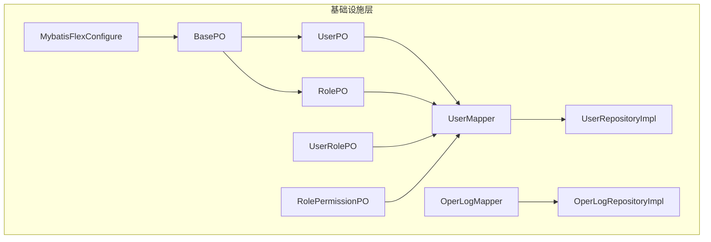
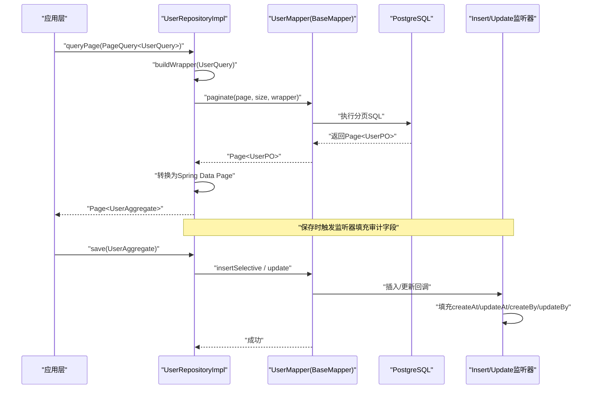
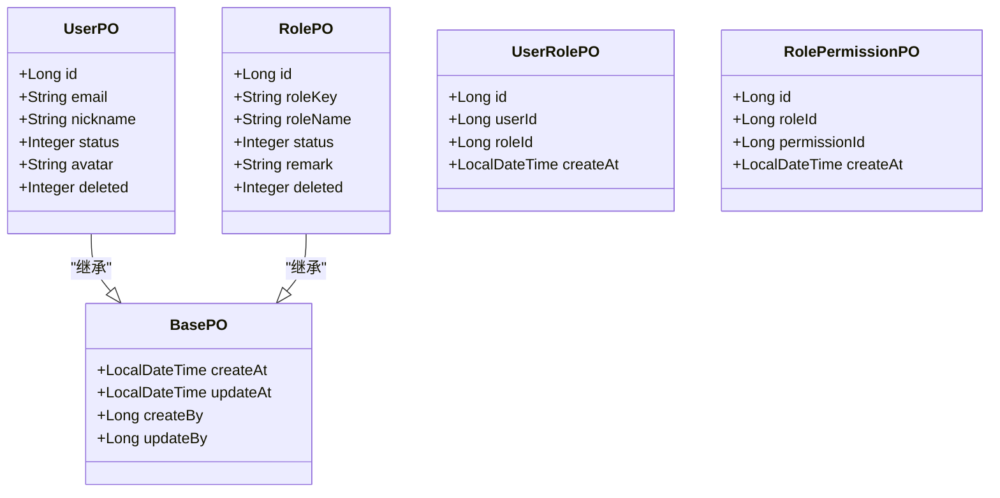
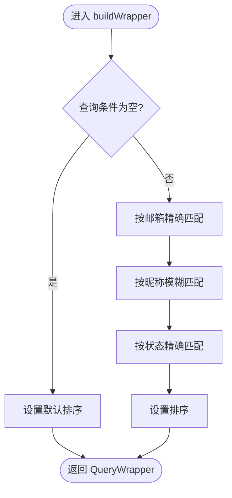
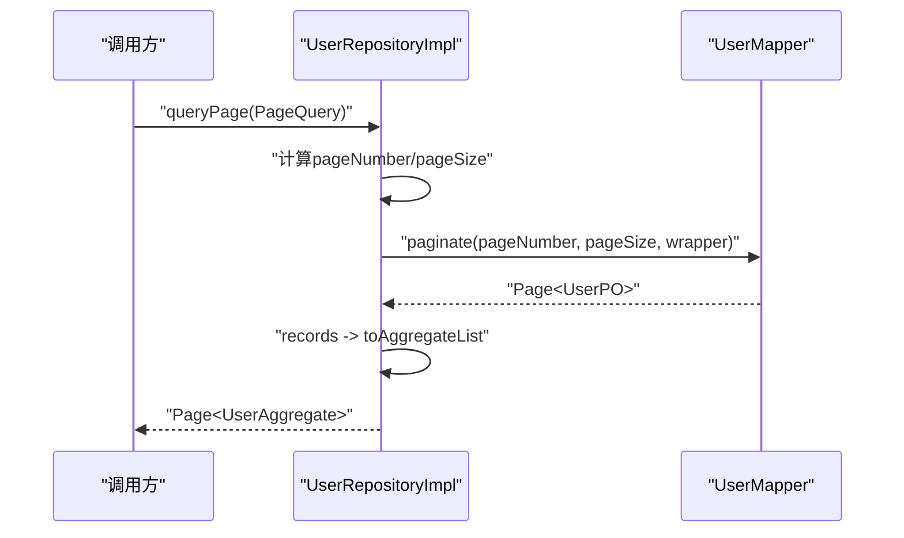
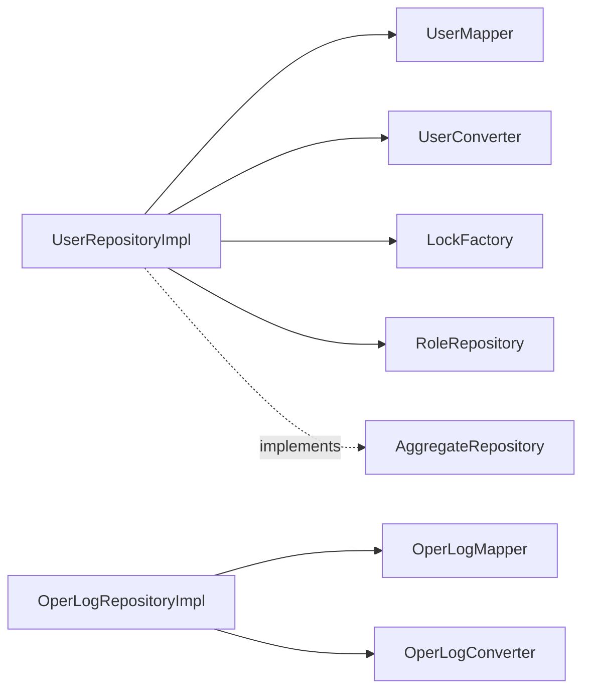
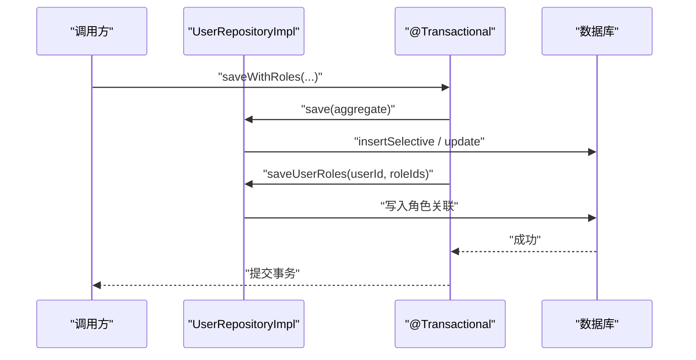

# MyBatis-Flex使用指南

<cite>
**本文引用的文件**   
- [pom.xml](file://pom.xml)
- [MybatisFlexConfigure.java](file://src/main/java/com/sunnao/spring/ddd/template/common/config/MybatisFlexConfigure.java)
- [BasePO.java](file://src/main/java/com/sunnao/spring/ddd/template/common/model/BasePO.java)
- [UserPO.java](file://src/main/java/com/sunnao/spring/ddd/template/infrastructure/system/user/mysql/po/UserPO.java)
- [RolePO.java](file://src/main/java/com/sunnao/spring/ddd/template/infrastructure/system/role/mysql/po/RolePO.java)
- [UserRolePO.java](file://src/main/java/com/sunnao/spring/ddd/template/infrastructure/system/role/mysql/po/UserRolePO.java)
- [RolePermissionPO.java](file://src/main/java/com/sunnao/spring/ddd/template/infrastructure/system/role/mysql/po/RolePermissionPO.java)
- [UserMapper.java](file://src/main/java/com/sunnao/spring/ddd/template/infrastructure/system/user/mysql/mapper/UserMapper.java)
- [OperLogMapper.java](file://src/main/java/com/sunnao/spring/ddd/template/infrastructure/system/log/mysql/mapper/OperLogMapper.java)
- [UserRepositoryImpl.java](file://src/main/java/com/sunnao/spring/ddd/template/infrastructure/system/user/repository/UserRepositoryImpl.java)
- [OperLogRepositoryImpl.java](file://src/main/java/com/sunnao/spring/ddd/template/infrastructure/system/log/repository/OperLogRepositoryImpl.java)
- [AggregateRepository.java](file://src/main/java/com/sunnao/spring/ddd/template/common/model/AggregateRepository.java)
- [PageQuery.java](file://src/main/java/com/sunnao/spring/ddd/template/common/model/PageQuery.java)
</cite>

## 目录
1. [简介](#简介)
2. [项目结构](#项目结构)
3. [核心组件](#核心组件)
4. [架构总览](#架构总览)
5. [详细组件分析](#详细组件分析)
6. [依赖关系分析](#依赖关系分析)
7. [性能与批量操作建议](#性能与批量操作建议)
8. [事务管理与异常处理](#事务管理与异常处理)
9. [常用查询模式示例](#常用查询模式示例)
10. [缓存配置与调优](#缓存配置与调优)
11. [故障排查指南](#故障排查指南)
12. [结论](#结论)

## 简介
本指南聚焦于在项目中如何正确使用 MyBatis-Flex，围绕实体映射、动态SQL构建、分页查询、批量操作、事务与异常处理、常用查询模式以及缓存与性能调优进行系统化说明。文档中的实践均来源于仓库现有实现，便于直接落地到业务模块中。

## 项目结构
本项目采用六边形架构，持久化相关代码集中在 infrastructure 层：
- PO（持久化对象）定义表映射与字段规则
- Mapper 继承 BaseMapper 获得通用CRUD与分页能力
- Repository 实现封装查询条件构建、分页转换、事务边界与异常统一包装
- 全局配置通过监听器完成审计字段自动填充

图表来源
- [UserPO.java](file://src/main/java/com/sunnao/spring/ddd/template/infrastructure/system/user/mysql/po/UserPO.java)
- [RolePO.java](file://src/main/java/com/sunnao/spring/ddd/template/infrastructure/system/role/mysql/po/RolePO.java)
- [UserRolePO.java](file://src/main/java/com/sunnao/spring/ddd/template/infrastructure/system/role/mysql/po/UserRolePO.java)
- [RolePermissionPO.java](file://src/main/java/com/sunnao/spring/ddd/template/infrastructure/system/role/mysql/po/RolePermissionPO.java)
- [UserMapper.java](file://src/main/java/com/sunnao/spring/ddd/template/infrastructure/system/user/mysql/mapper/UserMapper.java)
- [OperLogMapper.java](file://src/main/java/com/sunnao/spring/ddd/template/infrastructure/system/log/mysql/mapper/OperLogMapper.java)
- [UserRepositoryImpl.java](file://src/main/java/com/sunnao/spring/ddd/template/infrastructure/system/user/repository/UserRepositoryImpl.java)
- [OperLogRepositoryImpl.java](file://src/main/java/com/sunnao/spring/ddd/template/infrastructure/system/log/repository/OperLogRepositoryImpl.java)
- [MybatisFlexConfigure.java](file://src/main/java/com/sunnao/spring/ddd/template/common/config/MybatisFlexConfigure.java)
- [BasePO.java](file://src/main/java/com/sunnao/spring/ddd/template/common/model/BasePO.java)

章节来源
- [pom.xml:28-46](file://pom.xml#L28-L46)
- [MybatisFlexConfigure.java:20-27](file://src/main/java/com/sunnao/spring/ddd/template/common/config/MybatisFlexConfigure.java#L20-L27)

## 核心组件
- 实体映射与主键策略
  - 使用 @Table 指定表名；@Id + KeyType.Auto 声明自增主键；@Column(isLogicDelete = true) 启用逻辑删除
  - 所有需要审计的PO继承 BasePO，由全局 Insert/Update 监听器自动填充 createAt/updateAt/createBy/updateBy
- Mapper 与通用能力
  - 自定义 Mapper 仅继承 BaseMapper<T>，即可获得 selectOneById、insertSelective、update、deleteById、paginate 等能力
- 仓储实现与分页
  - RepositoryImpl 负责将领域查询参数转换为 QueryWrapper，调用 mapper.paginate 并转换为 Spring Data Page
- 全局配置
  - 通过 MyBatisFlexCustomizer 注册 InsertListener/UpdateListener，对 BasePO 子类生效

章节来源
- [UserPO.java:17-59](file://src/main/java/com/sunnao/spring/ddd/template/infrastructure/system/user/mysql/po/UserPO.java#L17-L59)
- [RolePO.java:17-54](file://src/main/java/com/sunnao/spring/ddd/template/infrastructure/system/role/mysql/po/RolePO.java#L17-L54)
- [UserRolePO.java:16-42](file://src/main/java/com/sunnao/spring/ddd/template/infrastructure/system/role/mysql/po/UserRolePO.java#L16-L42)
- [RolePermissionPO.java:16-42](file://src/main/java/com/sunnao/spring/ddd/template/infrastructure/system/role/mysql/po/RolePermissionPO.java#L16-L42)
- [BasePO.java:17-40](file://src/main/java/com/sunnao/spring/ddd/template/common/model/BasePO.java#L17-L40)
- [UserMapper.java:1-11](file://src/main/java/com/sunnao/spring/ddd/template/infrastructure/system/user/mysql/mapper/UserMapper.java#L1-L11)
- [OperLogMapper.java:1-11](file://src/main/java/com/sunnao/spring/ddd/template/infrastructure/system/log/mysql/mapper/OperLogMapper.java#L1-L11)
- [MybatisFlexConfigure.java:20-73](file://src/main/java/com/sunnao/spring/ddd/template/common/config/MybatisFlexConfigure.java#L20-L73)

## 架构总览
下图展示从仓储到数据库的关键交互路径，包括动态条件构建、分页与审计字段填充。

图表来源
- [UserRepositoryImpl.java:72-87](file://src/main/java/com/sunnao/spring/ddd/template/infrastructure/system/user/repository/UserRepositoryImpl.java#L72-L87)
- [UserRepositoryImpl.java:89-117](file://src/main/java/com/sunnao/spring/ddd/template/infrastructure/system/user/repository/UserRepositoryImpl.java#L89-L117)
- [MybatisFlexConfigure.java:20-73](file://src/main/java/com/sunnao/spring/ddd/template/common/config/MybatisFlexConfigure.java#L20-L73)

## 详细组件分析

### 实体映射与字段规则
- 表映射
  - 使用 @Table("表名") 标注实体类
- 主键策略
  - 使用 @Id(keyType = KeyType.Auto) 表示自增主键
- 逻辑删除
  - 使用 @Column(isLogicDelete = true) 标记逻辑删除字段
- 审计字段
  - 继承 BasePO 后，插入/更新时由全局监听器自动填充时间戳与操作人ID

图表来源
- [BasePO.java:17-40](file://src/main/java/com/sunnao/spring/ddd/template/common/model/BasePO.java#L17-L40)
- [UserPO.java:17-59](file://src/main/java/com/sunnao/spring/ddd/template/infrastructure/system/user/mysql/po/UserPO.java#L17-L59)
- [RolePO.java:17-54](file://src/main/java/com/sunnao/spring/ddd/template/infrastructure/system/role/mysql/po/RolePO.java#L17-L54)
- [UserRolePO.java:16-42](file://src/main/java/com/sunnao/spring/ddd/template/infrastructure/system/role/mysql/po/UserRolePO.java#L16-L42)
- [RolePermissionPO.java:16-42](file://src/main/java/com/sunnao/spring/ddd/template/infrastructure/system/role/mysql/po/RolePermissionPO.java#L16-L42)

章节来源
- [UserPO.java:17-59](file://src/main/java/com/sunnao/spring/ddd/template/infrastructure/system/user/mysql/po/UserPO.java#L17-L59)
- [RolePO.java:17-54](file://src/main/java/com/sunnao/spring/ddd/template/infrastructure/system/role/mysql/po/RolePO.java#L17-L54)
- [UserRolePO.java:16-42](file://src/main/java/com/sunnao/spring/ddd/template/infrastructure/system/role/mysql/po/UserRolePO.java#L16-L42)
- [RolePermissionPO.java:16-42](file://src/main/java/com/sunnao/spring/ddd/template/infrastructure/system/role/mysql/po/RolePermissionPO.java#L16-L42)
- [BasePO.java:17-40](file://src/main/java/com/sunnao/spring/ddd/template/common/model/BasePO.java#L17-L40)

### 动态SQL与条件构建（QueryWrapper）
- 条件构建
  - 使用 QueryWrapper.create() 创建查询条件
  - eq/ge/le/like/orderby 等方法组合多条件
- 分页查询
  - 使用 mapper.paginate(pageNumber, pageSize, wrapper) 获取分页结果
  - 将 MyBatis-Flex 的 Page 转换为 Spring Data Page 返回

图表来源
- [UserRepositoryImpl.java:170-189](file://src/main/java/com/sunnao/spring/ddd/template/infrastructure/system/user/repository/UserRepositoryImpl.java#L170-L189)
- [OperLogRepositoryImpl.java:74-94](file://src/main/java/com/sunnao/spring/ddd/template/infrastructure/system/log/repository/OperLogRepositoryImpl.java#L74-L94)

章节来源
- [UserRepositoryImpl.java:170-189](file://src/main/java/com/sunnao/spring/ddd/template/infrastructure/system/user/repository/UserRepositoryImpl.java#L170-L189)
- [OperLogRepositoryImpl.java:74-94](file://src/main/java/com/sunnao/spring/ddd/template/infrastructure/system/log/repository/OperLogRepositoryImpl.java#L74-L94)

### 分页查询实现
- 分页入口
  - RepositoryImpl.queryPage 接收 PageQuery<Q>，计算页码并调用 mapper.paginate
- 结果转换
  - 将 MyBatis-Flex Page 记录列表转换为聚合根集合，再包装为 Spring Data Page

图表来源
- [UserRepositoryImpl.java:72-87](file://src/main/java/com/sunnao/spring/ddd/template/infrastructure/system/user/repository/UserRepositoryImpl.java#L72-L87)
- [OperLogRepositoryImpl.java:54-69](file://src/main/java/com/sunnao/spring/ddd/template/infrastructure/system/log/repository/OperLogRepositoryImpl.java#L54-L69)
- [PageQuery.java:1-22](file://src/main/java/com/sunnao/spring/ddd/template/common/model/PageQuery.java#L1-L22)

章节来源
- [UserRepositoryImpl.java:72-87](file://src/main/java/com/sunnao/spring/ddd/template/infrastructure/system/user/repository/UserRepositoryImpl.java#L72-L87)
- [OperLogRepositoryImpl.java:54-69](file://src/main/java/com/sunnao/spring/ddd/template/infrastructure/system/log/repository/OperLogRepositoryImpl.java#L54-L69)
- [PageQuery.java:1-22](file://src/main/java/com/sunnao/spring/ddd/template/common/model/PageQuery.java#L1-L22)

### 复杂查询优化
- 条件组装集中化
  - 将条件构建封装在私有方法中，避免重复逻辑
- 排序与索引
  - 明确 orderBy 字段，确保数据库侧有合适索引
- 只取必要字段
  - 在 Mapper 层可进一步定制 SQL 减少列传输（当前实现以 BaseMapper 为主）

章节来源
- [UserRepositoryImpl.java:170-189](file://src/main/java/com/sunnao/spring/ddd/template/infrastructure/system/user/repository/UserRepositoryImpl.java#L170-L189)
- [OperLogRepositoryImpl.java:74-94](file://src/main/java/com/sunnao/spring/ddd/template/infrastructure/system/log/repository/OperLogRepositoryImpl.java#L74-L94)

## 依赖关系分析
- 依赖注入
  - RepositoryImpl 注入 Mapper、Converter、LockFactory 等
- 接口契约
  - AggregateRepository 定义 query/queryPage/save 等通用能力
- 外部依赖
  - mybatis-flex-spring-boot4-starter 提供自动装配与处理器

图表来源
- [UserRepositoryImpl.java:34-48](file://src/main/java/com/sunnao/spring/ddd/template/infrastructure/system/user/repository/UserRepositoryImpl.java#L34-L48)
- [OperLogRepositoryImpl.java:27-35](file://src/main/java/com/sunnao/spring/ddd/template/infrastructure/system/log/repository/OperLogRepositoryImpl.java#L27-L35)
- [AggregateRepository.java:1-42](file://src/main/java/com/sunnao/spring/ddd/template/common/model/AggregateRepository.java#L1-L42)

章节来源
- [UserRepositoryImpl.java:34-48](file://src/main/java/com/sunnao/spring/ddd/template/infrastructure/system/user/repository/UserRepositoryImpl.java#L34-L48)
- [OperLogRepositoryImpl.java:27-35](file://src/main/java/com/sunnao/spring/ddd/template/infrastructure/system/log/repository/OperLogRepositoryImpl.java#L27-L35)
- [AggregateRepository.java:1-42](file://src/main/java/com/sunnao/spring/ddd/template/common/model/AggregateRepository.java#L1-L42)

## 性能与批量操作建议
- 批量插入
  - 优先使用 insertBatch 或分批次 insertSelective，控制每批大小（如 500~1000），避免单条插入带来的连接与事务开销
- 批量更新
  - 使用 updateBatch 或基于主键的批量更新语句，减少往返次数
- 批量删除
  - 使用 deleteBatch 或 IN 子句批量删除，注意主键索引命中
- 分页与排序
  - 合理设置 pageSize，避免过大导致内存压力；orderBy 字段需建立索引
- 审计监听器
  - 监听器仅在插入/更新时执行轻量赋值，影响较小；若存在大量写操作，确保 CurrentUserContext 读取高效

[本节为通用性能建议，不直接分析具体文件]

## 事务管理与异常处理
- 事务边界
  - 跨仓储组合写入（如用户与角色关联）使用 @Transactional 保证原子性
- 异常处理
  - Repository 层捕获底层异常并包装为 RepositoryException，携带错误码与上下文信息
- 审计字段
  - 插入/更新时由全局监听器填充，无需业务代码手动设置

图表来源
- [UserRepositoryImpl.java:119-125](file://src/main/java/com/sunnao/spring/ddd/template/infrastructure/system/user/repository/UserRepositoryImpl.java#L119-L125)
- [UserRepositoryImpl.java:139-163](file://src/main/java/com/sunnao/spring/ddd/template/infrastructure/system/user/repository/UserRepositoryImpl.java#L139-L163)

章节来源
- [UserRepositoryImpl.java:119-125](file://src/main/java/com/sunnao/spring/ddd/template/infrastructure/system/user/repository/UserRepositoryImpl.java#L119-L125)
- [UserRepositoryImpl.java:139-163](file://src/main/java/com/sunnao/spring/ddd/template/infrastructure/system/user/repository/UserRepositoryImpl.java#L139-L163)

## 常用查询模式示例
- 单表条件查询
  - 使用 QueryWrapper.eq/like 组合条件，mapper.selectOneByQuery 获取单条
- 分页查询
  - repository.queryPage 结合 buildWrapper 构建条件，mapper.paginate 分页
- 多表关联查询
  - 可在 Mapper 层扩展自定义 SQL 或使用 Join 查询（当前仓库以单表为主）
- 子查询
  - 在 QueryWrapper 中使用子查询片段或在自定义 SQL 中编写
- 聚合查询
  - 使用自定义 SQL 或 MapStruct/DTO 投影，减少数据传输

章节来源
- [UserRepositoryImpl.java:61-70](file://src/main/java/com/sunnao/spring/ddd/template/infrastructure/system/user/repository/UserRepositoryImpl.java#L61-L70)
- [UserRepositoryImpl.java:72-87](file://src/main/java/com/sunnao/spring/ddd/template/infrastructure/system/user/repository/UserRepositoryImpl.java#L72-L87)
- [OperLogRepositoryImpl.java:54-69](file://src/main/java/com/sunnao/spring/ddd/template/infrastructure/system/log/repository/OperLogRepositoryImpl.java#L54-L69)

## 缓存配置与调优
- 字典缓存
  - 字典数据按 typeKey 查询走 Redis 缓存，写操作自动失效缓存
- 会话与分布式锁
  - Sa-Token 会话存储于 Redis；分布式锁默认基于 Redis（支持 JVM 本地锁切换）
- 调优建议
  - 热点数据加缓存，合理设置过期时间；写后主动失效；关注缓存穿透与雪崩防护

章节来源
- [README.md:91-93](file://README.md#L91-L93)

## 故障排查指南
- 常见问题
  - 审计字段未填充：确认 PO 是否继承 BasePO，且全局监听器已注册
  - 分页总数不正确：检查 QueryWrapper 条件是否正确、排序字段是否有索引
  - 事务未回滚：确认 @Transactional 注解与方法可见性
- 日志定位
  - Repository 层统一记录错误日志，包含关键参数与异常堆栈

章节来源
- [MybatisFlexConfigure.java:20-73](file://src/main/java/com/sunnao/spring/ddd/template/common/config/MybatisFlexConfigure.java#L20-L73)
- [UserRepositoryImpl.java:50-87](file://src/main/java/com/sunnao/spring/ddd/template/infrastructure/system/user/repository/UserRepositoryImpl.java#L50-L87)
- [OperLogRepositoryImpl.java:37-69](file://src/main/java/com/sunnao/spring/ddd/template/infrastructure/system/log/repository/OperLogRepositoryImpl.java#L37-L69)

## 结论
本项目以 MyBatis-Flex 为核心 ORM，结合 DDD 分层与仓储模式，实现了清晰的实体映射、动态条件构建与分页查询。通过全局监听器完成审计字段自动填充，配合事务与异常包装，形成稳定可靠的持久化方案。建议在新增模块中沿用现有模式，并在批量操作与缓存方面遵循性能最佳实践。