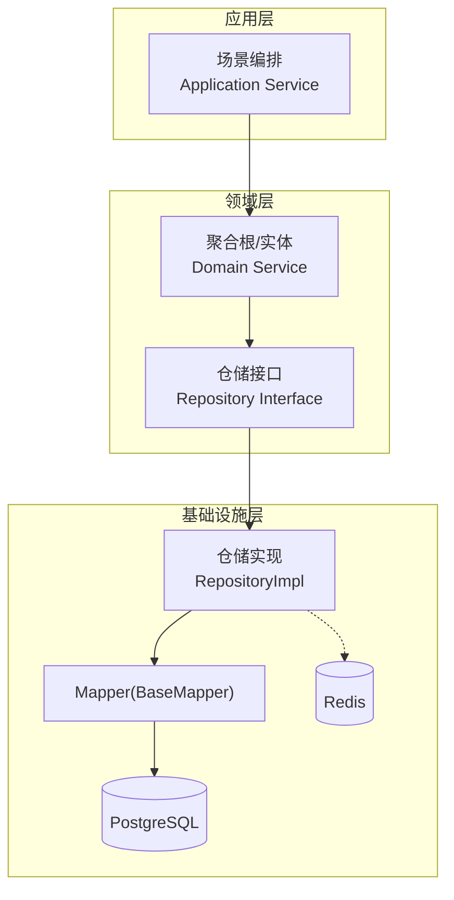
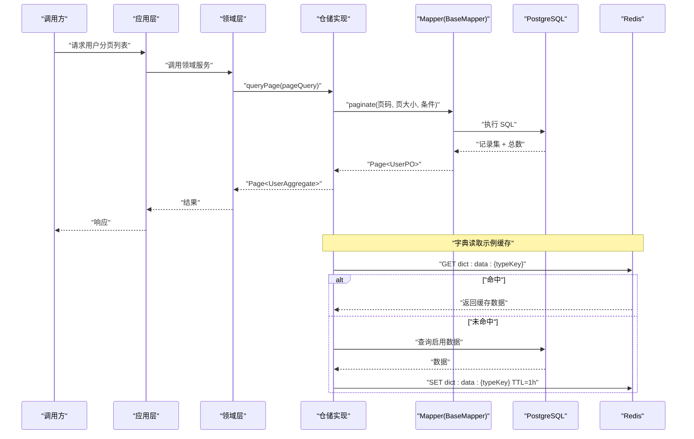
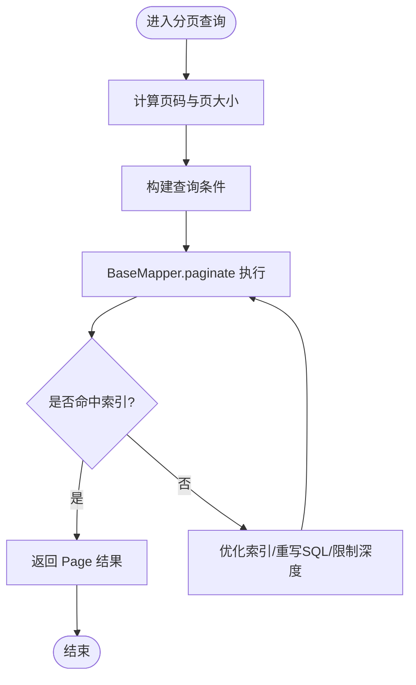
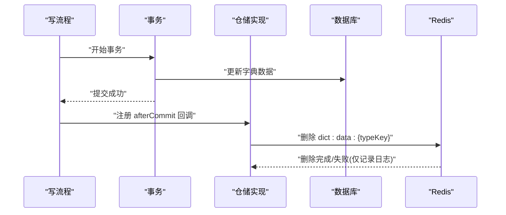
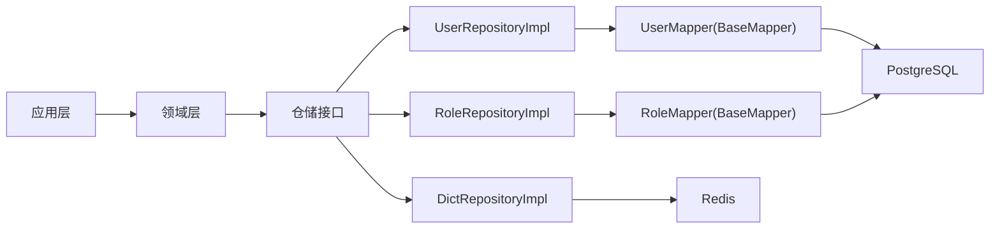

# 性能优化策略

<cite>
**本文引用的文件**   
- [README.md](file://README.md)
- [application.yaml](file://src/main/resources/application.yaml)
- [application-prod.yaml](file://src/main/resources/application-prod.yaml)
- [MybatisFlexConfigure.java](file://src/main/java/com/sunnao/spring/ddd/template/common/config/MybatisFlexConfigure.java)
- [UserRepositoryImpl.java](file://src/main/java/com/sunnao/spring/ddd/template/infrastructure/system/user/repository/UserRepositoryImpl.java)
- [RoleRepositoryImpl.java](file://src/main/java/com/sunnao/spring/ddd/template/infrastructure/system/role/repository/RoleRepositoryImpl.java)
- [DictRepositoryImpl.java](file://src/main/java/com/sunnao/spring/ddd/template/infrastructure/system/dict/repository/DictRepositoryImpl.java)
- [V1__init_sys_user.sql](file://src/main/resources/db/migration/V1__init_sys_user.sql)
- [V2__init_rbac.sql](file://src/main/resources/db/migration/V2__init_rbac.sql)
- [V3__init_sys_oper_log.sql](file://src/main/resources/db/migration/V3__init_sys_oper_log.sql)
- [V4__init_dict.sql](file://src/main/resources/db/migration/V4__init_dict.sql)
- [V5__init_sys_file.sql](file://src/main/resources/db/migration/V5__init_sys_file.sql)
</cite>

## 目录
1. [引言](#引言)
2. [项目结构](#项目结构)
3. [核心组件](#核心组件)
4. [架构总览](#架构总览)
5. [详细组件分析](#详细组件分析)
6. [依赖分析](#依赖分析)
7. [性能考虑](#性能考虑)
8. [故障排查指南](#故障排查指南)
9. [结论](#结论)
10. [附录](#附录)

## 引言
本指南面向数据库与缓存相关的性能优化，结合仓库中实际实现，覆盖以下主题：索引设计与优化、慢查询分析与优化方法、连接池配置优化、分页与大表查询最佳实践、缓存策略与一致性保证、监控指标收集与分析工具使用。文档以“从代码到落地”的方式给出可操作建议，并附带图示帮助理解。

## 项目结构
本项目采用六边形架构（领域驱动设计），数据访问集中在基础设施层，通过 MyBatis-Flex 进行持久化；Redis 用于会话、分布式锁与字典缓存；Flyway 管理数据库迁移脚本。

图表来源
- [README.md:19-36](file://README.md#L19-L36)
- [MybatisFlexConfigure.java:1-32](file://src/main/java/com/sunnao/spring/ddd/template/common/config/MybatisFlexConfigure.java#L1-L32)

章节来源
- [README.md:19-36](file://README.md#L19-L36)

## 核心组件
- 数据源与连接池：基于 Spring Boot 的 JDBC + PostgreSQL 驱动，Redis 客户端为 Lettuce，默认提供基础连接池参数。
- ORM 与审计：MyBatis-Flex 全局监听器自动填充审计字段（创建/更新时间、操作人）。
- 分页与查询：仓储层统一封装分页查询，返回标准 Page 对象。
- 缓存与一致性：字典模块按 typeKey 缓存启用数据，写后在事务提交后失效对应 key。

章节来源
- [application.yaml:9-26](file://src/main/resources/application.yaml#L9-L26)
- [MybatisFlexConfigure.java:1-32](file://src/main/java/com/sunnao/spring/ddd/template/common/config/MybatisFlexConfigure.java#L1-L32)
- [UserRepositoryImpl.java:72-95](file://src/main/java/com/sunnao/spring/ddd/template/infrastructure/system/user/repository/UserRepositoryImpl.java#L72-L95)
- [DictRepositoryImpl.java:311-345](file://src/main/java/com/sunnao/spring/ddd/template/infrastructure/system/dict/repository/DictRepositoryImpl.java#L311-L345)

## 架构总览
下图展示一次典型的用户分页查询路径，以及字典读路径中的缓存命中与回源流程。

图表来源
- [UserRepositoryImpl.java:72-95](file://src/main/java/com/sunnao/spring/ddd/template/infrastructure/system/user/repository/UserRepositoryImpl.java#L72-L95)
- [DictRepositoryImpl.java:311-345](file://src/main/java/com/sunnao/spring/ddd/template/infrastructure/system/dict/repository/DictRepositoryImpl.java#L311-L345)

## 详细组件分析

### 索引设计与优化策略
- 单列索引
  - 适用场景：高频等值或范围过滤的单列字段。
  - 仓库现状：sys_user.email 唯一索引（仅对未删除记录生效）、sys_role.role_key 唯一索引、sys_permission.perm_key 唯一索引、sys_dict_data.type_key 索引、sys_file.create_by 索引等。
  - 建议：优先将高选择性且频繁出现在 WHERE/JOIN/ORDER BY/GROUP BY 的列建立索引；注意逻辑删除列上的部分索引可减少无效扫描。
- 复合索引
  - 适用场景：多列联合过滤、排序或分组。
  - 仓库现状：sys_role_permission(role_id, permission_id)、sys_user_role(user_id, role_id) 唯一索引；sys_user_role(user_id) 辅助索引。
  - 建议：遵循最左前缀原则，将等值条件列放在前面，范围条件列靠后；避免过多冗余复合索引。
- 唯一索引
  - 适用场景：业务唯一性约束（如邮箱、角色键、权限键、类型+值组合）。
  - 仓库现状：多处使用带 deleted 条件的唯一索引，确保逻辑删除下的唯一性。
  - 建议：唯一索引同时具备索引加速效果，但需评估写入冲突成本。

章节来源
- [V1__init_sys_user.sql:45-46](file://src/main/resources/db/migration/V1__init_sys_user.sql#L45-L46)
- [V2__init_rbac.sql:41](file://src/main/resources/db/migration/V2__init_rbac.sql#L41-L41)
- [V2__init_rbac.sql:78](file://src/main/resources/db/migration/V2__init_rbac.sql#L78-L78)
- [V2__init_rbac.sql:96](file://src/main/resources/db/migration/V2__init_rbac.sql#L96-L96)
- [V2__init_rbac.sql:114-115](file://src/main/resources/db/migration/V2__init_rbac.sql#L114-L115)
- [V3__init_sys_oper_log.sql:42-44](file://src/main/resources/db/migration/V3__init_sys_oper_log.sql#L42-L44)
- [V4__init_dict.sql:39](file://src/main/resources/db/migration/V4__init_dict.sql#L39-L39)
- [V4__init_dict.sql:85-86](file://src/main/resources/db/migration/V4__init_dict.sql#L85-L86)
- [V5__init_sys_file.sql:42](file://src/main/resources/db/migration/V5__init_sys_file.sql#L42-L42)

### 慢查询分析与优化方法
- EXPLAIN 使用
  - 建议在开发/测试环境开启 SQL 日志，针对热点接口执行 EXPLAIN/EXPLAIN ANALYZE，关注全表扫描、临时表、文件排序、嵌套循环次数等。
- 执行计划分析要点
  - 是否走索引、索引选择是否合理、回表代价、排序/分组方式、是否存在隐式类型转换导致索引失效。
- 查询重写技巧
  - 避免 SELECT *，只取必要列；尽量用等值条件替代函数包裹列；将范围条件放复合索引右侧；分页大偏移时考虑延迟关联或游标分页。
- 仓库内参考点
  - 分页查询统一通过 BaseMapper.paginate 实现，便于集中观察生成的 SQL 与统计信息。

章节来源
- [UserRepositoryImpl.java:72-95](file://src/main/java/com/sunnao/spring/ddd/template/infrastructure/system/user/repository/UserRepositoryImpl.java#L72-L95)
- [RoleRepositoryImpl.java:88-102](file://src/main/java/com/sunnao/spring/ddd/template/infrastructure/system/role/repository/RoleRepositoryImpl.java#L88-L102)

### 连接池配置优化
- 当前配置
  - Redis 客户端为 Lettuce，默认提供 max-active/max-idle/min-idle 三项基础参数。
  - 数据源使用 Spring Boot JDBC 自动装配，默认连接池参数由框架决定。
- 优化建议
  - 根据并发量与 RT 目标调优最大连接数与空闲连接回收策略；生产环境建议显式声明连接池参数（HikariCP）并设置超时、空闲回收、最小空闲等。
  - Redis 连接池：max-active 与线程数匹配，避免阻塞；max-idle 不宜过大造成资源浪费；min-idle 保持一定预热。
  - 监控连接池等待队列长度、获取连接耗时、活跃连接占比等指标。

章节来源
- [application.yaml:22-26](file://src/main/resources/application.yaml#L22-L26)

### 分页查询与大表查询最佳实践
- 分页实现
  - 仓储层统一使用 BaseMapper.paginate，传入页码与页大小，返回包含总数的 Page 对象。
- 大表优化
  - 避免深分页（OFFSET 过大），可采用“上次最大 ID + 下一页”的游标分页；限制每页大小；为排序列建合适索引。
  - 复杂查询拆分：先查主键再批量拉取详情，减少回表开销。
  - 读写分离/只读副本：读多写少场景可分流。

图表来源
- [UserRepositoryImpl.java:72-95](file://src/main/java/com/sunnao/spring/ddd/template/infrastructure/system/user/repository/UserRepositoryImpl.java#L72-L95)
- [RoleRepositoryImpl.java:88-102](file://src/main/java/com/sunnao/spring/ddd/template/infrastructure/system/role/repository/RoleRepositoryImpl.java#L88-L102)

章节来源
- [UserRepositoryImpl.java:72-95](file://src/main/java/com/sunnao/spring/ddd/template/infrastructure/system/user/repository/UserRepositoryImpl.java#L72-L95)
- [RoleRepositoryImpl.java:88-102](file://src/main/java/com/sunnao/spring/ddd/template/infrastructure/system/role/repository/RoleRepositoryImpl.java#L88-L102)

### 缓存策略设计与一致性保证
- 缓存位置与粒度
  - 字典数据按 typeKey 缓存启用项，key 前缀固定，TTL 兜底防脏数据长存。
- 一致性策略
  - 写操作在事务提交后失效对应 key，避免“失效 → 提交”窗口内的脏读回写。
  - 缓存失败降级直查数据库，保障可用性。
- 扩展建议
  - 增加缓存命中率、过期率、异常率监控；对热点 key 做本地二级缓存需谨慎，注意一致性。

图表来源
- [DictRepositoryImpl.java:311-345](file://src/main/java/com/sunnao/spring/ddd/template/infrastructure/system/dict/repository/DictRepositoryImpl.java#L311-L345)

章节来源
- [DictRepositoryImpl.java:311-345](file://src/main/java/com/sunnao/spring/ddd/template/infrastructure/system/dict/repository/DictRepositoryImpl.java#L311-L345)

### 监控指标收集与分析工具
- 建议采集
  - 数据库：连接池活跃/等待、慢查询数量、锁等待、缓冲命中率、I/O 吞吐。
  - Redis：连接池状态、命令延迟、内存使用、命中率、淘汰率。
  - 应用：接口 P95/P99 耗时、错误率、线程池利用率、GC 情况。
- 工具建议
  - 数据库端启用慢查询日志与 EXPLAIN 分析；配合可视化平台（如 Prometheus + Grafana）长期观测。
  - 应用侧暴露健康检查与指标端点，结合链路追踪（traceId）定位问题。

[本节为通用指导，不直接分析具体文件]

## 依赖分析
- 外部依赖
  - 数据库：PostgreSQL（JDBC 驱动）
  - 缓存：Redis（Lettuce 客户端）
  - ORM：MyBatis-Flex（BaseMapper 提供分页能力）
  - 迁移：Flyway（启动时执行 db/migration）
- 内部耦合
  - 仓储实现依赖 Mapper 与 Converter，统一处理异常并包装为领域异常。
  - 字典仓储依赖 Redis 与锁工厂，写后在事务提交后失效缓存。

图表来源
- [UserRepositoryImpl.java:72-95](file://src/main/java/com/sunnao/spring/ddd/template/infrastructure/system/user/repository/UserRepositoryImpl.java#L72-L95)
- [RoleRepositoryImpl.java:88-102](file://src/main/java/com/sunnao/spring/ddd/template/infrastructure/system/role/repository/RoleRepositoryImpl.java#L88-L102)
- [DictRepositoryImpl.java:311-345](file://src/main/java/com/sunnao/spring/ddd/template/infrastructure/system/dict/repository/DictRepositoryImpl.java#L311-L345)

章节来源
- [application.yaml:9-26](file://src/main/resources/application.yaml#L9-L26)
- [UserRepositoryImpl.java:72-95](file://src/main/java/com/sunnao/spring/ddd/template/infrastructure/system/user/repository/UserRepositoryImpl.java#L72-L95)
- [RoleRepositoryImpl.java:88-102](file://src/main/java/com/sunnao/spring/ddd/template/infrastructure/system/role/repository/RoleRepositoryImpl.java#L88-L102)
- [DictRepositoryImpl.java:311-345](file://src/main/java/com/sunnao/spring/ddd/template/infrastructure/system/dict/repository/DictRepositoryImpl.java#L311-L345)

## 性能考虑
- 索引先行：优先为高频过滤/排序/分组列建立合适索引，避免过度索引影响写入。
- 查询瘦身：只取必要列，避免隐式类型转换与函数包裹列。
- 分页优化：限制页大小，深分页改用游标分页。
- 连接池：根据压测结果调整连接池上限与超时，生产环境显式配置。
- 缓存：热点读数据入缓存，写后及时失效，TTL 兜底；监控命中率与异常。
- 监控：建立关键指标看板，持续跟踪慢查询与资源瓶颈。

[本节为通用指导，不直接分析具体文件]

## 故障排查指南
- 常见问题
  - 连接池耗尽：检查最大连接数、慢查询、死锁与长时间事务。
  - 缓存不一致：确认写后失效时机是否在事务提交后；核对 key 命名与失效范围。
  - 分页异常：检查页码计算与边界条件，确认排序列有索引。
- 快速定位
  - 利用 traceId 串联日志与数据库慢查询；结合 EXPLAIN 分析执行计划。
  - 关注仓储层异常日志，定位具体 SQL 与参数。

章节来源
- [UserRepositoryImpl.java:72-95](file://src/main/java/com/sunnao/spring/ddd/template/infrastructure/system/user/repository/UserRepositoryImpl.java#L72-L95)
- [RoleRepositoryImpl.java:88-102](file://src/main/java/com/sunnao/spring/ddd/template/infrastructure/system/role/repository/RoleRepositoryImpl.java#L88-L102)
- [DictRepositoryImpl.java:311-345](file://src/main/java/com/sunnao/spring/ddd/template/infrastructure/system/dict/repository/DictRepositoryImpl.java#L311-L345)

## 结论
通过合理的索引设计、规范的查询与分页策略、稳健的连接池与缓存配置，以及完善的监控体系，可以显著提升系统的数据访问性能与稳定性。建议在生产上线前进行压测与回归，持续迭代优化。

[本节为总结，不直接分析具体文件]

## 附录
- 环境开关
  - 生产环境关闭 Swagger UI 与 OpenAPI 文档，避免接口暴露。
- 审计字段
  - 插入/更新时自动填充审计字段，提升可追溯性与运维效率。

章节来源
- [application-prod.yaml:1-7](file://src/main/resources/application-prod.yaml#L1-L7)
- [MybatisFlexConfigure.java:1-32](file://src/main/java/com/sunnao/spring/ddd/template/common/config/MybatisFlexConfigure.java#L1-L32)