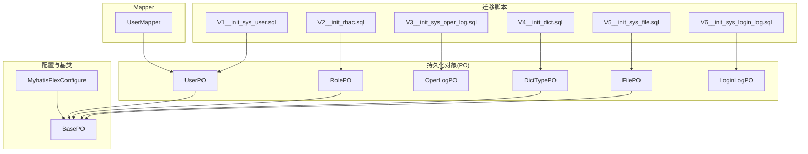
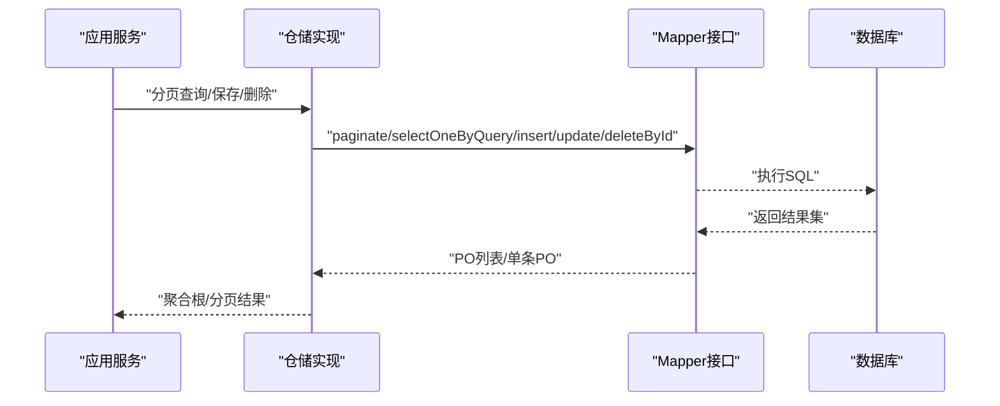
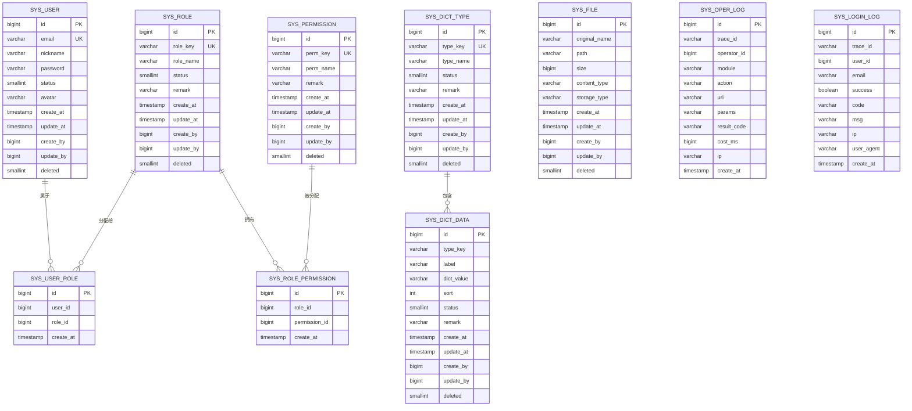
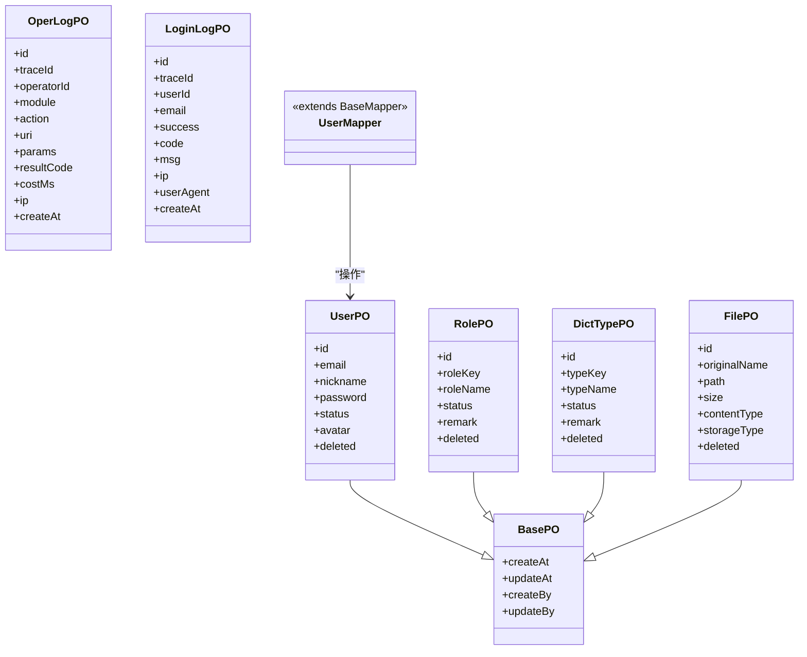
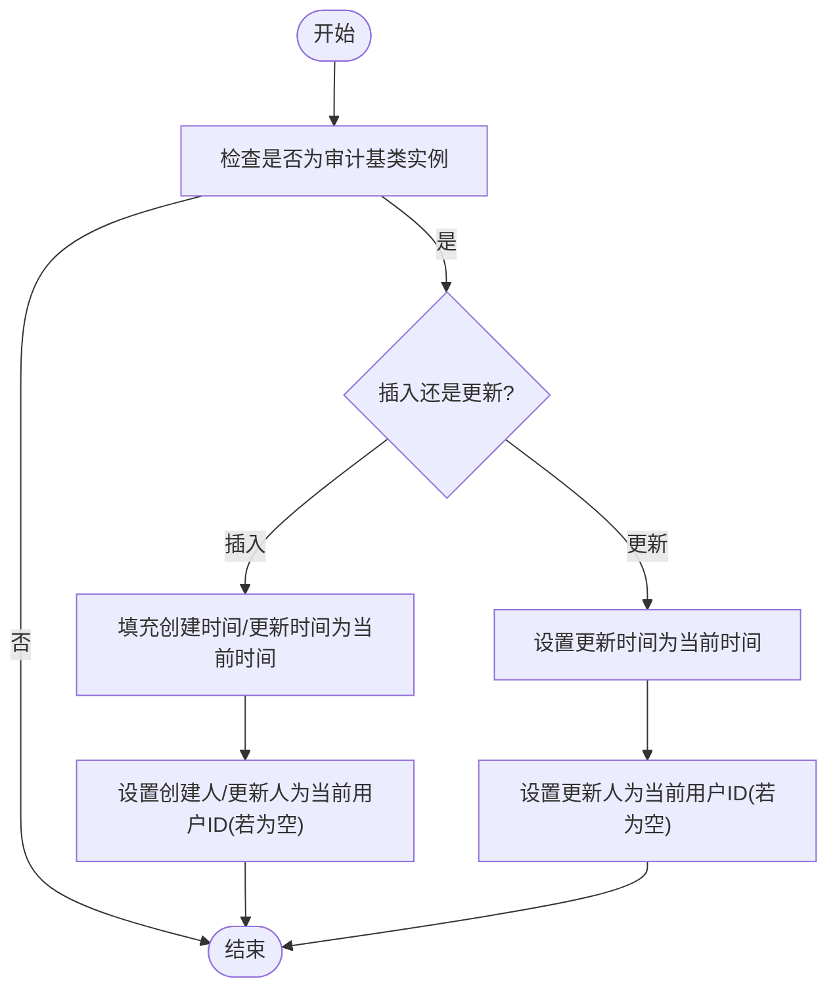
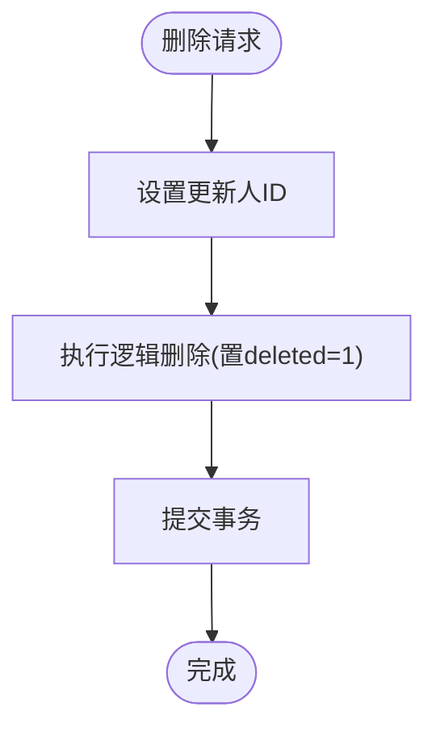
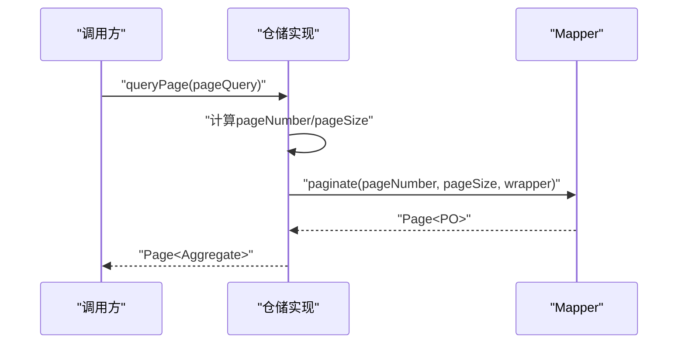
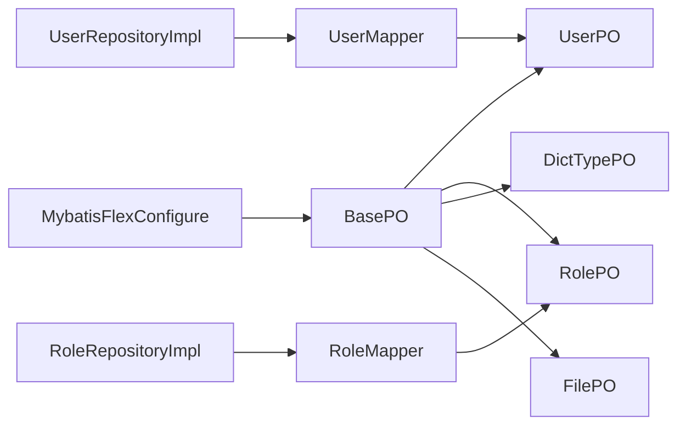

# 数据层设计

<cite>
**本文引用的文件**   
- [V1__init_sys_user.sql](file://src/main/resources/db/migration/V1__init_sys_user.sql)
- [V2__init_rbac.sql](file://src/main/resources/db/migration/V2__init_rbac.sql)
- [V3__init_sys_oper_log.sql](file://src/main/resources/db/migration/V3__init_sys_oper_log.sql)
- [V4__init_dict.sql](file://src/main/resources/db/migration/V4__init_dict.sql)
- [V5__init_sys_file.sql](file://src/main/resources/db/migration/V5__init_sys_file.sql)
- [V6__init_sys_login_log.sql](file://src/main/resources/db/migration/V6__init_sys_login_log.sql)
- [MybatisFlexConfigure.java](file://src/main/java/com/sunnao/spring/ddd/template/common/config/MybatisFlexConfigure.java)
- [BasePO.java](file://src/main/java/com/sunnao/spring/ddd/template/common/model/BasePO.java)
- [UserPO.java](file://src/main/java/com/sunnao/spring/ddd/template/infrastructure/system/user/mysql/po/UserPO.java)
- [RolePO.java](file://src/main/java/com/sunnao/spring/ddd/template/infrastructure/system/role/mysql/po/RolePO.java)
- [OperLogPO.java](file://src/main/java/com/sunnao/spring/ddd/template/infrastructure/system/log/mysql/po/OperLogPO.java)
- [LoginLogPO.java](file://src/main/java/com/sunnao/spring/ddd/template/infrastructure/system/log/mysql/po/LoginLogPO.java)
- [DictTypePO.java](file://src/main/java/com/sunnao/spring/ddd/template/infrastructure/system/dict/mysql/po/DictTypePO.java)
- [FilePO.java](file://src/main/java/com/sunnao/spring/ddd/template/infrastructure/system/file/mysql/po/FilePO.java)
- [UserMapper.java](file://src/main/java/com/sunnao/spring/ddd/template/infrastructure/system/user/mysql/mapper/UserMapper.java)
- [UserRepositoryImpl.java](file://src/main/java/com/sunnao/spring/ddd/template/infrastructure/system/user/repository/UserRepositoryImpl.java)
- [RoleRepositoryImpl.java](file://src/main/java/com/sunnao/spring/ddd/template/infrastructure/system/role/repository/RoleRepositoryImpl.java)
- [FileRepositoryImpl.java](file://src/main/java/com/sunnao/spring/ddd/template/infrastructure/system/file/repository/FileRepositoryImpl.java)
</cite>

## 目录
1. [引言](#引言)
2. [项目结构](#项目结构)
3. [核心组件](#核心组件)
4. [架构总览](#架构总览)
5. [详细组件分析](#详细组件分析)
6. [依赖关系分析](#依赖关系分析)
7. [性能与索引优化](#性能与索引优化)
8. [事务与一致性](#事务与一致性)
9. [故障排查指南](#故障排查指南)
10. [结论](#结论)
11. [附录：迁移与版本管理](#附录：迁移与版本管理)

## 引言
本文件聚焦于数据层设计，覆盖数据库表结构设计、ORM 配置与使用（MyBatis-Flex）、Flyway 迁移策略、审计字段自动填充与逻辑删除机制、索引与查询优化建议、备份恢复方案以及事务与一致性保障实践。文档面向具备不同技术背景的读者，既提供高层概览，也给出代码级映射与可操作建议。

## 项目结构
数据层相关资源主要分布在以下位置：
- 数据库迁移脚本：src/main/resources/db/migration/V*.sql
- ORM 实体与映射：infrastructure 层下的 mysql/po 与 mapper
- 全局配置与监听器：common/config 与 common/model

图表来源
- [V1__init_sys_user.sql:1-51](file://src/main/resources/db/migration/V1__init_sys_user.sql#L1-L51)
- [V2__init_rbac.sql:1-158](file://src/main/resources/db/migration/V2__init_rbac.sql#L1-L158)
- [V3__init_sys_oper_log.sql:1-45](file://src/main/resources/db/migration/V3__init_sys_oper_log.sql#L1-L45)
- [V4__init_dict.sql:1-95](file://src/main/resources/db/migration/V4__init_dict.sql#L1-L95)
- [V5__init_sys_file.sql:1-43](file://src/main/resources/db/migration/V5__init_sys_file.sql#L1-L43)
- [V6__init_sys_login_log.sql:1-42](file://src/main/resources/db/migration/V6__init_sys_login_log.sql#L1-L42)
- [UserPO.java:1-60](file://src/main/java/com/sunnao/spring/ddd/template/infrastructure/system/user/mysql/po/UserPO.java#L1-L60)
- [RolePO.java:1-55](file://src/main/java/com/sunnao/spring/ddd/template/infrastructure/system/role/mysql/po/RolePO.java#L1-L55)
- [OperLogPO.java:1-79](file://src/main/java/com/sunnao/spring/ddd/template/infrastructure/system/log/mysql/po/OperLogPO.java#L1-L79)
- [LoginLogPO.java:1-74](file://src/main/java/com/sunnao/spring/ddd/template/infrastructure/system/log/mysql/po/LoginLogPO.java#L1-L74)
- [DictTypePO.java:1-55](file://src/main/java/com/sunnao/spring/ddd/template/infrastructure/system/dict/mysql/po/DictTypePO.java#L1-L55)
- [FilePO.java:1-60](file://src/main/java/com/sunnao/spring/ddd/template/infrastructure/system/file/mysql/po/FilePO.java#L1-L60)
- [BasePO.java:1-41](file://src/main/java/com/sunnao/spring/ddd/template/common/model/BasePO.java#L1-L41)
- [MybatisFlexConfigure.java:1-73](file://src/main/java/com/sunnao/spring/ddd/template/common/config/MybatisFlexConfigure.java#L1-L73)
- [UserMapper.java:1-11](file://src/main/java/com/sunnao/spring/ddd/template/infrastructure/system/user/mysql/mapper/UserMapper.java#L1-L11)

章节来源
- [V1__init_sys_user.sql:1-51](file://src/main/resources/db/migration/V1__init_sys_user.sql#L1-L51)
- [V2__init_rbac.sql:1-158](file://src/main/resources/db/migration/V2__init_rbac.sql#L1-L158)
- [V3__init_sys_oper_log.sql:1-45](file://src/main/resources/db/migration/V3__init_sys_oper_log.sql#L1-L45)
- [V4__init_dict.sql:1-95](file://src/main/resources/db/migration/V4__init_dict.sql#L1-L95)
- [V5__init_sys_file.sql:1-43](file://src/main/resources/db/migration/V5__init_sys_file.sql#L1-L43)
- [V6__init_sys_login_log.sql:1-42](file://src/main/resources/db/migration/V6__init_sys_login_log.sql#L1-L42)
- [UserPO.java:1-60](file://src/main/java/com/sunnao/spring/ddd/template/infrastructure/system/user/mysql/po/UserPO.java#L1-L60)
- [RolePO.java:1-55](file://src/main/java/com/sunnao/spring/ddd/template/infrastructure/system/role/mysql/po/RolePO.java#L1-L55)
- [OperLogPO.java:1-79](file://src/main/java/com/sunnao/spring/ddd/template/infrastructure/system/log/mysql/po/OperLogPO.java#L1-L79)
- [LoginLogPO.java:1-74](file://src/main/java/com/sunnao/spring/ddd/template/infrastructure/system/log/mysql/po/LoginLogPO.java#L1-L74)
- [DictTypePO.java:1-55](file://src/main/java/com/sunnao/spring/ddd/template/infrastructure/system/dict/mysql/po/DictTypePO.java#L1-L55)
- [FilePO.java:1-60](file://src/main/java/com/sunnao/spring/ddd/template/infrastructure/system/file/mysql/po/FilePO.java#L1-L60)
- [BasePO.java:1-41](file://src/main/java/com/sunnao/spring/ddd/template/common/model/BasePO.java#L1-L41)
- [MybatisFlexConfigure.java:1-73](file://src/main/java/com/sunnao/spring/ddd/template/common/config/MybatisFlexConfigure.java#L1-L73)
- [UserMapper.java:1-11](file://src/main/java/com/sunnao/spring/ddd/template/infrastructure/system/user/mysql/mapper/UserMapper.java#L1-L11)

## 核心组件
- 持久化对象（PO）与表映射：各 PO 通过注解与表名一一对应，主键采用自增策略；需要逻辑删除的表在对应字段上启用逻辑删除标记。
- 审计字段基类：所有需要审计字段的 PO 继承统一基类，由全局插入/更新监听器自动填充时间戳与操作人。
- Mapper 接口：基于框架提供的通用 Mapper 扩展，仅暴露必要方法，分页与条件查询通过包装器构建。
- 仓储实现：封装分页查询、保存、删除等基础设施能力，并处理异常转换与日志记录。

章节来源
- [UserPO.java:1-60](file://src/main/java/com/sunnao/spring/ddd/template/infrastructure/system/user/mysql/po/UserPO.java#L1-L60)
- [RolePO.java:1-55](file://src/main/java/com/sunnao/spring/ddd/template/infrastructure/system/role/mysql/po/RolePO.java#L1-L55)
- [OperLogPO.java:1-79](file://src/main/java/com/sunnao/spring/ddd/template/infrastructure/system/log/mysql/po/OperLogPO.java#L1-L79)
- [LoginLogPO.java:1-74](file://src/main/java/com/sunnao/spring/ddd/template/infrastructure/system/log/mysql/po/LoginLogPO.java#L1-L74)
- [DictTypePO.java:1-55](file://src/main/java/com/sunnao/spring/ddd/template/infrastructure/system/dict/mysql/po/DictTypePO.java#L1-L55)
- [FilePO.java:1-60](file://src/main/java/com/sunnao/spring/ddd/template/infrastructure/system/file/mysql/po/FilePO.java#L1-L60)
- [BasePO.java:1-41](file://src/main/java/com/sunnao/spring/ddd/template/common/model/BasePO.java#L1-L41)
- [UserMapper.java:1-11](file://src/main/java/com/sunnao/spring/ddd/template/infrastructure/system/user/mysql/mapper/UserMapper.java#L1-L11)
- [UserRepositoryImpl.java:72-95](file://src/main/java/com/sunnao/spring/ddd/template/infrastructure/system/user/repository/UserRepositoryImpl.java#L72-L95)
- [RoleRepositoryImpl.java:76-102](file://src/main/java/com/sunnao/spring/ddd/template/infrastructure/system/role/repository/RoleRepositoryImpl.java#L76-L102)

## 架构总览
下图展示从应用层到数据层的调用路径，包括分页查询与保存流程的关键节点。

图表来源
- [UserRepositoryImpl.java:72-95](file://src/main/java/com/sunnao/spring/ddd/template/infrastructure/system/user/repository/UserRepositoryImpl.java#L72-L95)
- [RoleRepositoryImpl.java:76-102](file://src/main/java/com/sunnao/spring/ddd/template/infrastructure/system/role/repository/RoleRepositoryImpl.java#L76-L102)
- [UserMapper.java:1-11](file://src/main/java/com/sunnao/spring/ddd/template/infrastructure/system/user/mysql/mapper/UserMapper.java#L1-L11)

## 详细组件分析

### 数据库表结构与ER图
- 用户表 sys_user：包含邮箱、昵称、密码、状态、头像、审计字段与逻辑删除字段；对邮箱建立唯一索引（仅未删除记录）。
- RBAC 角色权限表：sys_role、sys_permission、sys_role_permission、sys_user_role；角色与权限、用户与角色关联均建立唯一或复合索引；提供种子数据与历史字段迁移。
- 操作日志表 sys_oper_log：记录模块、动作、URI、参数摘要、结果码、耗时、IP、创建时间；按时间与操作人建索引。
- 字典表 sys_dict_type、sys_dict_data：类型与数据分离，类型键唯一，数据按类型键+值唯一；提供用户状态字典种子数据。
- 文件表 sys_file：记录原始文件名、存储路径、大小、MIME类型、存储类型、审计字段与逻辑删除；按创建人建索引。
- 登录日志表 sys_login_log：记录登录成功与否、结果码与说明、IP、UA、创建时间；按时间与用户、邮箱建索引。

图表来源
- [V1__init_sys_user.sql:1-51](file://src/main/resources/db/migration/V1__init_sys_user.sql#L1-L51)
- [V2__init_rbac.sql:1-158](file://src/main/resources/db/migration/V2__init_rbac.sql#L1-L158)
- [V3__init_sys_oper_log.sql:1-45](file://src/main/resources/db/migration/V3__init_sys_oper_log.sql#L1-L45)
- [V4__init_dict.sql:1-95](file://src/main/resources/db/migration/V4__init_dict.sql#L1-L95)
- [V5__init_sys_file.sql:1-43](file://src/main/resources/db/migration/V5__init_sys_file.sql#L1-L43)
- [V6__init_sys_login_log.sql:1-42](file://src/main/resources/db/migration/V6__init_sys_login_log.sql#L1-L42)

章节来源
- [V1__init_sys_user.sql:1-51](file://src/main/resources/db/migration/V1__init_sys_user.sql#L1-L51)
- [V2__init_rbac.sql:1-158](file://src/main/resources/db/migration/V2__init_rbac.sql#L1-L158)
- [V3__init_sys_oper_log.sql:1-45](file://src/main/resources/db/migration/V3__init_sys_oper_log.sql#L1-L45)
- [V4__init_dict.sql:1-95](file://src/main/resources/db/migration/V4__init_dict.sql#L1-L95)
- [V5__init_sys_file.sql:1-43](file://src/main/resources/db/migration/V5__init_sys_file.sql#L1-L43)
- [V6__init_sys_login_log.sql:1-42](file://src/main/resources/db/migration/V6__init_sys_login_log.sql#L1-L42)

### MyBatis-Flex 配置与使用
- 实体映射：PO 通过注解声明表名、主键策略与逻辑删除字段；例如用户、角色、字典类型、文件等表对应的 PO 均遵循此约定。
- 动态SQL：通过 QueryWrapper 构建查询条件，仓储实现中根据业务参数组装条件后交给 Mapper 执行。
- 分页查询：使用框架的分页 API，将 PageRequest 转换为框架内部分页对象，再映射为聚合根集合返回。
- 批量操作：当前实现以单条 insert/update/delete 为主；如需批量写入，可在 Repository 层组合多次调用并在事务中提交。

图表来源
- [BasePO.java:1-41](file://src/main/java/com/sunnao/spring/ddd/template/common/model/BasePO.java#L1-L41)
- [UserPO.java:1-60](file://src/main/java/com/sunnao/spring/ddd/template/infrastructure/system/user/mysql/po/UserPO.java#L1-L60)
- [RolePO.java:1-55](file://src/main/java/com/sunnao/spring/ddd/template/infrastructure/system/role/mysql/po/RolePO.java#L1-L55)
- [DictTypePO.java:1-55](file://src/main/java/com/sunnao/spring/ddd/template/infrastructure/system/dict/mysql/po/DictTypePO.java#L1-L55)
- [FilePO.java:1-60](file://src/main/java/com/sunnao/spring/ddd/template/infrastructure/system/file/mysql/po/FilePO.java#L1-L60)
- [OperLogPO.java:1-79](file://src/main/java/com/sunnao/spring/ddd/template/infrastructure/system/log/mysql/po/OperLogPO.java#L1-L79)
- [LoginLogPO.java:1-74](file://src/main/java/com/sunnao/spring/ddd/template/infrastructure/system/log/mysql/po/LoginLogPO.java#L1-L74)
- [UserMapper.java:1-11](file://src/main/java/com/sunnao/spring/ddd/template/infrastructure/system/user/mysql/mapper/UserMapper.java#L1-L11)

章节来源
- [UserRepositoryImpl.java:72-95](file://src/main/java/com/sunnao/spring/ddd/template/infrastructure/system/user/repository/UserRepositoryImpl.java#L72-L95)
- [RoleRepositoryImpl.java:76-102](file://src/main/java/com/sunnao/spring/ddd/template/infrastructure/system/role/repository/RoleRepositoryImpl.java#L76-L102)
- [UserMapper.java:1-11](file://src/main/java/com/sunnao/spring/ddd/template/infrastructure/system/user/mysql/mapper/UserMapper.java#L1-L11)

### 审计字段自动填充机制
- 触发时机：插入时填充创建时间、更新时间、创建人、更新人；更新时填充更新时间与更新人。
- 数据来源：时间取当前时间；操作人取自当前上下文的用户ID；若已显式赋值则不覆盖。
- 适用范围：所有继承统一基类的 PO 生效；日志表只增不改，无需审计更新字段。

图表来源
- [MybatisFlexConfigure.java:29-72](file://src/main/java/com/sunnao/spring/ddd/template/common/config/MybatisFlexConfigure.java#L29-L72)
- [BasePO.java:1-41](file://src/main/java/com/sunnao/spring/ddd/template/common/model/BasePO.java#L1-L41)

章节来源
- [MybatisFlexConfigure.java:1-73](file://src/main/java/com/sunnao/spring/ddd/template/common/config/MybatisFlexConfigure.java#L1-L73)
- [BasePO.java:1-41](file://src/main/java/com/sunnao/spring/ddd/template/common/model/BasePO.java#L1-L41)

### 逻辑删除实现
- 表层面：关键业务表包含 deleted 字段，默认值为正常；部分表对唯一索引增加“仅未删除”过滤条件。
- ORM 层面：PO 的 deleted 字段启用逻辑删除标记，使框架在查询与删除时自动附加过滤条件。
- 仓储层面：删除操作先记录更新人，再执行逻辑删除；确保审计信息完整。

图表来源
- [UserRepositoryImpl.java:127-155](file://src/main/java/com/sunnao/spring/ddd/template/infrastructure/system/user/repository/UserRepositoryImpl.java#L127-L155)
- [UserPO.java:54-59](file://src/main/java/com/sunnao/spring/ddd/template/infrastructure/system/user/mysql/po/UserPO.java#L54-L59)
- [V1__init_sys_user.sql:45-46](file://src/main/resources/db/migration/V1__init_sys_user.sql#L45-L46)

章节来源
- [UserRepositoryImpl.java:127-155](file://src/main/java/com/sunnao/spring/ddd/template/infrastructure/system/user/repository/UserRepositoryImpl.java#L127-L155)
- [UserPO.java:54-59](file://src/main/java/com/sunnao/spring/ddd/template/infrastructure/system/user/mysql/po/UserPO.java#L54-L59)
- [V1__init_sys_user.sql:45-46](file://src/main/resources/db/migration/V1__init_sys_user.sql#L45-L46)

### 分页查询实现
- 入口：仓储实现接收分页参数，计算页码与页大小。
- 执行：调用 Mapper 的分页方法，传入 QueryWrapper 构建的动态条件。
- 返回：将框架分页对象转换为应用层分页结果，包含总行数与记录集合。

图表来源
- [UserRepositoryImpl.java:72-95](file://src/main/java/com/sunnao/spring/ddd/template/infrastructure/system/user/repository/UserRepositoryImpl.java#L72-L95)
- [RoleRepositoryImpl.java:76-102](file://src/main/java/com/sunnao/spring/ddd/template/infrastructure/system/role/repository/RoleRepositoryImpl.java#L76-L102)

章节来源
- [UserRepositoryImpl.java:72-95](file://src/main/java/com/sunnao/spring/ddd/template/infrastructure/system/user/repository/UserRepositoryImpl.java#L72-L95)
- [RoleRepositoryImpl.java:76-102](file://src/main/java/com/sunnao/spring/ddd/template/infrastructure/system/role/repository/RoleRepositoryImpl.java#L76-L102)

### 批量操作优化
- 现状：当前仓储以单条写库为主，适合中小规模数据。
- 建议：
  - 在 Repository 层组织批量插入/更新，结合事务边界减少往返开销。
  - 对于大体积导入，考虑分批提交与异步落库，避免长事务锁竞争。
  - 针对高频写入场景，评估是否引入消息队列进行削峰填谷。

[本节为通用建议，不直接分析具体文件]

## 依赖关系分析
- 配置与实体：全局配置为所有继承基类的 PO 注册审计监听器；PO 通过注解与表结构对齐。
- 仓储与 Mapper：仓储实现依赖 Mapper 进行数据访问，分页与条件查询通过包装器动态生成。
- 迁移与实体：每个迁移脚本对应一组表结构，实体 PO 与其保持字段一致。

图表来源
- [MybatisFlexConfigure.java:1-73](file://src/main/java/com/sunnao/spring/ddd/template/common/config/MybatisFlexConfigure.java#L1-L73)
- [BasePO.java:1-41](file://src/main/java/com/sunnao/spring/ddd/template/common/model/BasePO.java#L1-L41)
- [UserPO.java:1-60](file://src/main/java/com/sunnao/spring/ddd/template/infrastructure/system/user/mysql/po/UserPO.java#L1-L60)
- [RolePO.java:1-55](file://src/main/java/com/sunnao/spring/ddd/template/infrastructure/system/role/mysql/po/RolePO.java#L1-L55)
- [DictTypePO.java:1-55](file://src/main/java/com/sunnao/spring/ddd/template/infrastructure/system/dict/mysql/po/DictTypePO.java#L1-L55)
- [FilePO.java:1-60](file://src/main/java/com/sunnao/spring/ddd/template/infrastructure/system/file/mysql/po/FilePO.java#L1-L60)
- [UserRepositoryImpl.java:72-95](file://src/main/java/com/sunnao/spring/ddd/template/infrastructure/system/user/repository/UserRepositoryImpl.java#L72-L95)
- [RoleRepositoryImpl.java:76-102](file://src/main/java/com/sunnao/spring/ddd/template/infrastructure/system/role/repository/RoleRepositoryImpl.java#L76-L102)
- [UserMapper.java:1-11](file://src/main/java/com/sunnao/spring/ddd/template/infrastructure/system/user/mysql/mapper/UserMapper.java#L1-L11)

章节来源
- [MybatisFlexConfigure.java:1-73](file://src/main/java/com/sunnao/spring/ddd/template/common/config/MybatisFlexConfigure.java#L1-L73)
- [UserRepositoryImpl.java:72-95](file://src/main/java/com/sunnao/spring/ddd/template/infrastructure/system/user/repository/UserRepositoryImpl.java#L72-L95)
- [RoleRepositoryImpl.java:76-102](file://src/main/java/com/sunnao/spring/ddd/template/infrastructure/system/role/repository/RoleRepositoryImpl.java#L76-L102)
- [UserMapper.java:1-11](file://src/main/java/com/sunnao/spring/ddd/template/infrastructure/system/user/mysql/mapper/UserMapper.java#L1-L11)

## 性能与索引优化
- 唯一性约束与选择性索引：
  - 用户邮箱、角色标识、权限标识、字典类型键、字典类型+值均建立唯一索引，且对逻辑删除字段做条件过滤，保证数据一致性与查询效率。
  - 关联表（用户-角色、角色-权限）建立复合唯一索引，防止重复分配。
- 查询热点索引：
  - 操作日志与登录日志按创建时间降序索引，便于最近记录快速检索。
  - 按操作人、用户ID、邮箱、模块等维度建立索引，支撑常见筛选场景。
- 文件与字典：
  - 文件表按创建人建索引，便于统计与追溯。
  - 字典数据按类型键建索引，提升按类型加载的性能。
- 建议：
  - 对高频复杂查询，评估是否需要覆盖索引或物化视图。
  - 定期分析慢查询日志，调整索引与 SQL 写法。
  - 对大表进行分区或归档策略，控制单表规模。

章节来源
- [V1__init_sys_user.sql:45-46](file://src/main/resources/db/migration/V1__init_sys_user.sql#L45-L46)
- [V2__init_rbac.sql:41-116](file://src/main/resources/db/migration/V2__init_rbac.sql#L41-L116)
- [V3__init_sys_oper_log.sql:42-45](file://src/main/resources/db/migration/V3__init_sys_oper_log.sql#L42-L45)
- [V4__init_dict.sql:39-86](file://src/main/resources/db/migration/V4__init_dict.sql#L39-L86)
- [V5__init_sys_file.sql:42-43](file://src/main/resources/db/migration/V5__init_sys_file.sql#L42-L43)
- [V6__init_sys_login_log.sql:39-42](file://src/main/resources/db/migration/V6__init_sys_login_log.sql#L39-L42)

## 事务与一致性
- 事务边界：仓储层对涉及多步写操作的场景使用事务注解，确保原子性。
- 一致性保障：
  - 删除用户时，先记录更新人，再执行逻辑删除；必要时清理关联数据（如用户-角色），保证数据完整性。
  - 保存文件时，新增后回填ID与审计字段，更新时避免覆盖创建信息。
- 并发控制：
  - 领域层对热点资源加锁，避免竞态条件导致的数据不一致。
  - 非关键副作用（如强制下线会话）失败不影响主流程，降低耦合风险。

章节来源
- [FileRepositoryImpl.java:90-119](file://src/main/java/com/sunnao/spring/ddd/template/infrastructure/system/file/repository/FileRepositoryImpl.java#L90-L119)
- [UserRepositoryImpl.java:127-155](file://src/main/java/com/sunnao/spring/ddd/template/infrastructure/system/user/repository/UserRepositoryImpl.java#L127-L155)

## 故障排查指南
- 常见问题定位：
  - 分页查询异常：检查分页参数计算与 QueryWrapper 条件是否正确。
  - 审计字段未填充：确认 PO 是否继承基类且全局监听器已注册。
  - 逻辑删除无效：检查 PO 的 deleted 字段是否启用逻辑删除标记，以及唯一索引是否包含 deleted 条件。
- 日志与错误码：
  - 仓储层捕获异常并记录上下文，抛出统一异常类型，便于上层处理与追踪。
  - 结合链路追踪ID与操作日志，快速定位问题请求。

章节来源
- [UserRepositoryImpl.java:72-95](file://src/main/java/com/sunnao/spring/ddd/template/infrastructure/system/user/repository/UserRepositoryImpl.java#L72-L95)
- [RoleRepositoryImpl.java:76-102](file://src/main/java/com/sunnao/spring/ddd/template/infrastructure/system/role/repository/RoleRepositoryImpl.java#L76-L102)
- [FileRepositoryImpl.java:90-119](file://src/main/java/com/sunnao/spring/ddd/template/infrastructure/system/file/repository/FileRepositoryImpl.java#L90-L119)

## 结论
本项目数据层设计围绕清晰的分层与一致的约定展开：迁移脚本驱动表结构演进，PO 与表严格映射，全局审计监听器简化运维成本，逻辑删除保障数据安全，索引策略兼顾唯一性与查询性能。仓储层封装分页与事务，配合领域层并发控制，形成稳健的数据访问体系。后续可根据业务增长持续优化索引与批处理策略，并完善监控与告警。

## 附录：迁移与版本管理
- 工具与策略：
  - 使用 Flyway 管理数据库迁移，脚本命名遵循 V序号__描述.sql 规范。
  - 每次变更需新增独立迁移脚本，禁止修改已发布脚本；回滚通过反向脚本或新脚本修正。
- 内容要点：
  - 初始化用户、RBAC、操作日志、字典、文件、登录日志等核心表结构。
  - 提供种子数据与存量字段迁移（如用户角色迁移至关联表）。
- 建议：
  - 在 CI/CD 中集成迁移校验，确保环境一致性。
  - 对生产环境迁移前进行预演与备份，降低变更风险。

章节来源
- [V1__init_sys_user.sql:1-51](file://src/main/resources/db/migration/V1__init_sys_user.sql#L1-L51)
- [V2__init_rbac.sql:1-158](file://src/main/resources/db/migration/V2__init_rbac.sql#L1-L158)
- [V3__init_sys_oper_log.sql:1-45](file://src/main/resources/db/migration/V3__init_sys_oper_log.sql#L1-L45)
- [V4__init_dict.sql:1-95](file://src/main/resources/db/migration/V4__init_dict.sql#L1-L95)
- [V5__init_sys_file.sql:1-43](file://src/main/resources/db/migration/V5__init_sys_file.sql#L1-L43)
- [V6__init_sys_login_log.sql:1-42](file://src/main/resources/db/migration/V6__init_sys_login_log.sql#L1-L42)