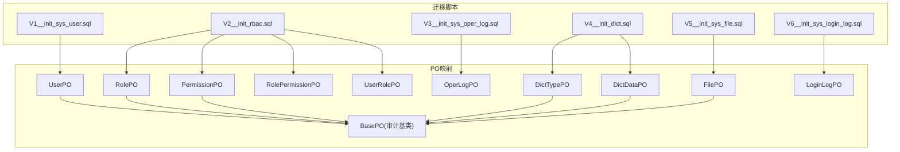
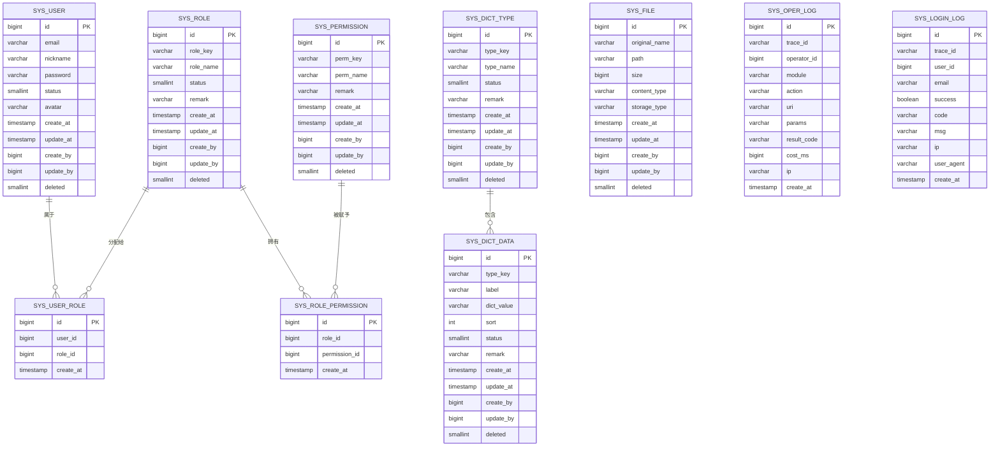
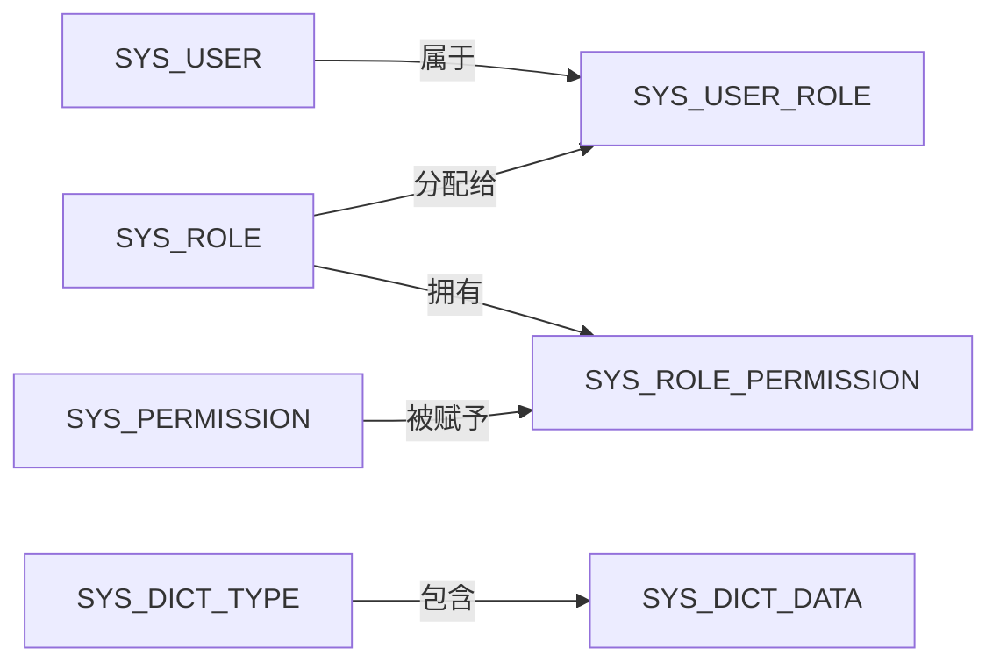

# 数据库设计与ER图

<cite>
**本文引用的文件**
- [V1__init_sys_user.sql](file://src/main/resources/db/migration/V1__init_sys_user.sql)
- [V2__init_rbac.sql](file://src/main/resources/db/migration/V2__init_rbac.sql)
- [V3__init_sys_oper_log.sql](file://src/main/resources/db/migration/V3__init_sys_oper_log.sql)
- [V4__init_dict.sql](file://src/main/resources/db/migration/V4__init_dict.sql)
- [V5__init_sys_file.sql](file://src/main/resources/db/migration/V5__init_sys_file.sql)
- [V6__init_sys_login_log.sql](file://src/main/resources/db/migration/V6__init_sys_login_log.sql)
- [BasePO.java](file://src/main/java/com/sunnao/spring/ddd/template/common/model/BasePO.java)
- [UserPO.java](file://src/main/java/com/sunnao/spring/ddd/template/infrastructure/system/user/mysql/po/UserPO.java)
- [RolePO.java](file://src/main/java/com/sunnao/spring/ddd/template/infrastructure/system/role/mysql/po/RolePO.java)
- [PermissionPO.java](file://src/main/java/com/sunnao/spring/ddd/template/infrastructure/system/role/mysql/po/PermissionPO.java)
- [OperLogPO.java](file://src/main/java/com/sunnao/spring/ddd/template/infrastructure/system/log/mysql/po/OperLogPO.java)
- [DictTypePO.java](file://src/main/java/com/sunnao/spring/ddd/template/infrastructure/system/dict/mysql/po/DictTypePO.java)
- [DictDataPO.java](file://src/main/java/com/sunnao/spring/ddd/template/infrastructure/system/dict/mysql/po/DictDataPO.java)
- [FilePO.java](file://src/main/java/com/sunnao/spring/ddd/template/infrastructure/system/file/mysql/po/FilePO.java)
- [LoginLogPO.java](file://src/main/java/com/sunnao/spring/ddd/template/infrastructure/system/log/mysql/po/LoginLogPO.java)
- [RolePermissionPO.java](file://src/main/java/com/sunnao/spring/ddd/template/infrastructure/system/role/mysql/po/RolePermissionPO.java)
- [UserRolePO.java](file://src/main/java/com/sunnao/spring/ddd/template/infrastructure/system/role/mysql/po/UserRolePO.java)
</cite>

## 目录
1. [引言](#引言)
2. [项目结构](#项目结构)
3. [核心组件](#核心组件)
4. [架构总览](#架构总览)
5. [详细组件分析](#详细组件分析)
6. [依赖关系分析](#依赖关系分析)
7. [性能考虑](#性能考虑)
8. [故障排查指南](#故障排查指南)
9. [结论](#结论)
10. [附录](#附录)

## 引言
本技术文档聚焦于系统数据库设计，覆盖用户、角色权限、操作日志、字典、文件、登录日志等核心业务表。文档从数据模型、字段类型与约束、索引策略、审计与逻辑删除模式、PostgreSQL特性与优化等方面展开，并给出完整的ER图与依赖说明，帮助读者快速理解并正确扩展该系统的持久化层。

## 项目结构
数据库定义以Flyway迁移脚本组织，位于 resources/db/migration 下；Java侧通过MyBatis-Flex的PO对象映射到具体表，审计字段由全局监听器自动填充。

图表来源
- [V1__init_sys_user.sql:1-51](file://src/main/resources/db/migration/V1__init_sys_user.sql#L1-L51)
- [V2__init_rbac.sql:1-158](file://src/main/resources/db/migration/V2__init_rbac.sql#L1-L158)
- [V3__init_sys_oper_log.sql:1-45](file://src/main/resources/db/migration/V3__init_sys_oper_log.sql#L1-L45)
- [V4__init_dict.sql:1-95](file://src/main/resources/db/migration/V4__init_dict.sql#L1-L95)
- [V5__init_sys_file.sql:1-43](file://src/main/resources/db/migration/V5__init_sys_file.sql#L1-L43)
- [V6__init_sys_login_log.sql:1-42](file://src/main/resources/db/migration/V6__init_sys_login_log.sql#L1-L42)
- [BasePO.java:1-41](file://src/main/java/com/sunnao/spring/ddd/template/common/model/BasePO.java#L1-L41)
- [UserPO.java:1-60](file://src/main/java/com/sunnao/spring/ddd/template/infrastructure/system/user/mysql/po/UserPO.java#L1-L60)
- [RolePO.java:1-55](file://src/main/java/com/sunnao/spring/ddd/template/infrastructure/system/role/mysql/po/RolePO.java#L1-L55)
- [PermissionPO.java:1-50](file://src/main/java/com/sunnao/spring/ddd/template/infrastructure/system/role/mysql/po/PermissionPO.java#L1-L50)
- [OperLogPO.java:1-79](file://src/main/java/com/sunnao/spring/ddd/template/infrastructure/system/log/mysql/po/OperLogPO.java#L1-L79)
- [DictTypePO.java:1-55](file://src/main/java/com/sunnao/spring/ddd/template/infrastructure/system/dict/mysql/po/DictTypePO.java#L1-L55)
- [DictDataPO.java:1-67](file://src/main/java/com/sunnao/spring/ddd/template/infrastructure/system/dict/mysql/po/DictDataPO.java#L1-L67)
- [FilePO.java:1-60](file://src/main/java/com/sunnao/spring/ddd/template/infrastructure/system/file/mysql/po/po/FilePO.java#L1-L60)
- [LoginLogPO.java:1-74](file://src/main/java/com/sunnao/spring/ddd/template/infrastructure/system/log/mysql/po/LoginLogPO.java#L1-L74)
- [RolePermissionPO.java:1-43](file://src/main/java/com/sunnao/spring/ddd/template/infrastructure/system/role/mysql/po/RolePermissionPO.java#L1-L43)
- [UserRolePO.java:1-43](file://src/main/java/com/sunnao/spring/ddd/template/infrastructure/system/role/mysql/po/UserRolePO.java#L1-L43)

章节来源
- [V1__init_sys_user.sql:1-51](file://src/main/resources/db/migration/V1__init_sys_user.sql#L1-L51)
- [V2__init_rbac.sql:1-158](file://src/main/resources/db/migration/V2__init_rbac.sql#L1-L158)
- [V3__init_sys_oper_log.sql:1-45](file://src/main/resources/db/migration/V3__init_sys_oper_log.sql#L1-L45)
- [V4__init_dict.sql:1-95](file://src/main/resources/db/migration/V4__init_dict.sql#L1-L95)
- [V5__init_sys_file.sql:1-43](file://src/main/resources/db/migration/V5__init_sys_file.sql#L1-L43)
- [V6__init_sys_login_log.sql:1-42](file://src/main/resources/db/migration/V6__init_sys_login_log.sql#L1-L42)
- [BasePO.java:1-41](file://src/main/java/com/sunnao/spring/ddd/template/common/model/BasePO.java#L1-L41)

## 核心组件
- sys_user：系统用户主实体，包含邮箱、昵称、密码、状态、头像及审计与逻辑删除字段。
- sys_role / sys_permission / sys_role_permission / sys_user_role：RBAC角色权限体系，含角色、权限、角色-权限关联、用户-角色关联。
- sys_oper_log：系统操作日志，记录模块、动作、URI、参数摘要、结果码、耗时、IP等。
- sys_dict_type / sys_dict_data：字典类型与字典值，支持启用/禁用与排序。
- sys_file：文件元信息，包括原始文件名、存储路径、大小、MIME类型、存储类型等。
- sys_login_log：登录日志，记录成功/失败、错误码、消息、IP、UA等。

章节来源
- [V1__init_sys_user.sql:1-51](file://src/main/resources/db/migration/V1__init_sys_user.sql#L1-L51)
- [V2__init_rbac.sql:1-158](file://src/main/resources/db/migration/V2__init_rbac.sql#L1-L158)
- [V3__init_sys_oper_log.sql:1-45](file://src/main/resources/db/migration/V3__init_sys_oper_log.sql#L1-L45)
- [V4__init_dict.sql:1-95](file://src/main/resources/db/migration/V4__init_dict.sql#L1-L95)
- [V5__init_sys_file.sql:1-43](file://src/main/resources/db/migration/V5__init_sys_file.sql#L1-L43)
- [V6__init_sys_login_log.sql:1-42](file://src/main/resources/db/migration/V6__init_sys_login_log.sql#L1-L42)

## 架构总览
下图展示核心实体间的ER关系（基于迁移脚本与PO映射）：

图表来源
- [V1__init_sys_user.sql:1-51](file://src/main/resources/db/migration/V1__init_sys_user.sql#L1-L51)
- [V2__init_rbac.sql:1-158](file://src/main/resources/db/migration/V2__init_rbac.sql#L1-L158)
- [V3__init_sys_oper_log.sql:1-45](file://src/main/resources/db/migration/V3__init_sys_oper_log.sql#L1-L45)
- [V4__init_dict.sql:1-95](file://src/main/resources/db/migration/V4__init_dict.sql#L1-L95)
- [V5__init_sys_file.sql:1-43](file://src/main/resources/db/migration/V5__init_sys_file.sql#L1-L43)
- [V6__init_sys_login_log.sql:1-42](file://src/main/resources/db/migration/V6__init_sys_login_log.sql#L1-L42)

## 详细组件分析

### 用户表 sys_user
- 业务含义：系统用户主数据，承载登录身份与基础资料。
- 关键字段与类型选择
  - id: BIGSERIAL，自增主键，适合高并发写入且无需外部生成ID的场景。
  - email: VARCHAR(128)，唯一性用于登录与去重。
  - nickname/password/status/avatar: 常规业务字段，status使用SMALLINT表示状态枚举。
  - 审计字段：create_at/update_at/create_by/update_by，由BasePO+全局监听器自动填充。
  - deleted: SMALLINT逻辑删除标记。
- 约束与索引
  - 主键PK(id)。
  - 唯一索引 uk_sys_user_email(email) WHERE deleted=0，保证未删除用户邮箱唯一。
- 审计与逻辑删除
  - 审计字段由BasePO提供，插入/更新时自动填充时间与人。
  - 逻辑删除通过deleted字段配合查询过滤实现。
- PostgreSQL优化建议
  - 条件唯一索引仅对未删除记录生效，避免重复插入已删除后重建的记录。
  - 可考虑为email列添加B-tree索引（已由唯一索引覆盖）。

章节来源
- [V1__init_sys_user.sql:1-51](file://src/main/resources/db/migration/V1__init_sys_user.sql#L1-L51)
- [BasePO.java:1-41](file://src/main/java/com/sunnao/spring/ddd/template/common/model/BasePO.java#L1-L41)
- [UserPO.java:1-60](file://src/main/java/com/sunnao/spring/ddd/template/infrastructure/system/user/mysql/po/UserPO.java#L1-L60)

### RBAC角色权限体系
- 角色表 sys_role
  - 关键字段：role_key(唯一标识)、role_name、status、remark、审计与逻辑删除。
  - 索引：uk_sys_role_key(role_key) WHERE deleted=0。
- 权限表 sys_permission
  - 关键字段：perm_key(唯一标识)、perm_name、remark、审计与逻辑删除。
  - 索引：uk_sys_permission_key(perm_key) WHERE deleted=0。
- 角色-权限关联 sys_role_permission
  - 硬删除，无审计字段。
  - 唯一索引 uk_sys_role_permission(role_id, permission_id) 防止重复授权。
- 用户-角色关联 sys_user_role
  - 硬删除，无审计字段。
  - 唯一索引 uk_sys_user_role(user_id, role_id)，普通索引 idx_sys_user_role_user(user_id) 加速按用户查角色。
- 种子数据与迁移
  - 内置admin/user角色与若干权限点，并为admin授予全部权限，user授予基础权限。
  - 将存量sys_user.role迁移至sys_user_role后，删除sys_user.role列。
- 外键关系
  - 当前DDL未声明物理外键，依赖应用层或触发器保障一致性；建议在后续版本按需引入外键约束。

章节来源
- [V2__init_rbac.sql:1-158](file://src/main/resources/db/migration/V2__init_rbac.sql#L1-L158)
- [RolePO.java:1-55](file://src/main/java/com/sunnao/spring/ddd/template/infrastructure/system/role/mysql/po/RolePO.java#L1-L55)
- [PermissionPO.java:1-50](file://src/main/java/com/sunnao/spring/ddd/template/infrastructure/system/role/mysql/po/PermissionPO.java#L1-L50)
- [RolePermissionPO.java:1-43](file://src/main/java/com/sunnao/spring/ddd/template/infrastructure/system/role/mysql/po/RolePermissionPO.java#L1-L43)
- [UserRolePO.java:1-43](file://src/main/java/com/sunnao/spring/ddd/template/infrastructure/system/role/mysql/po/UserRolePO.java#L1-L43)

### 操作日志 sys_oper_log
- 业务含义：记录关键操作的模块、动作、请求信息、结果与耗时，便于审计与排障。
- 关键字段：trace_id、operator_id、module、action、uri、params、result_code、cost_ms、ip、create_at。
- 索引策略：
  - idx_sys_oper_log_create_at(create_at DESC) 支持按时间倒序分页。
  - idx_sys_oper_log_operator(operator_id) 支持按操作人检索。
  - idx_sys_oper_log_module(module) 支持按模块筛选。
- 特点：只增不改、无逻辑删除与审计更新字段，不继承BasePO。

章节来源
- [V3__init_sys_oper_log.sql:1-45](file://src/main/resources/db/migration/V3__init_sys_oper_log.sql#L1-L45)
- [OperLogPO.java:1-79](file://src/main/java/com/sunnao/spring/ddd/template/infrastructure/system/log/mysql/po/OperLogPO.java#L1-L79)

### 字典 sys_dict_type / sys_dict_data
- 业务含义：集中管理前端下拉框、开关等静态配置项。
- 字典类型 sys_dict_type
  - type_key唯一标识，type_name名称，status启用/禁用，审计与逻辑删除。
  - 索引：uk_sys_dict_type_key(type_key) WHERE deleted=0。
- 字典数据 sys_dict_data
  - type_key关联类型，label显示名，dict_value实际值，sort排序，status启用/禁用，审计与逻辑删除。
  - 索引：idx_sys_dict_data_type_key(type_key) WHERE deleted=0；uk_sys_dict_data_type_value(type_key, dict_value) WHERE deleted=0。
- 注意：dict_value对应PostgreSQL关键字value，需显式列名映射。

章节来源
- [V4__init_dict.sql:1-95](file://src/main/resources/db/migration/V4__init_dict.sql#L1-L95)
- [DictTypePO.java:1-55](file://src/main/java/com/sunnao/spring/ddd/template/infrastructure/system/dict/mysql/po/DictTypePO.java#L1-L55)
- [DictDataPO.java:1-67](file://src/main/java/com/sunnao/spring/ddd/template/infrastructure/system/dict/mysql/po/DictDataPO.java#L1-L67)

### 文件 sys_file
- 业务含义：记录上传文件的元信息，实际文件内容存放于本地或OSS等外部存储。
- 关键字段：original_name、path、size、content_type、storage_type、审计与逻辑删除。
- 索引：idx_sys_file_create_by(create_by) WHERE deleted=0，便于按上传者查询。
- 扩展性：storage_type预留“local/OSS”等扩展点。

章节来源
- [V5__init_sys_file.sql:1-43](file://src/main/resources/db/migration/V5__init_sys_file.sql#L1-L43)
- [FilePO.java:1-60](file://src/main/java/com/sunnao/spring/ddd/template/infrastructure/system/file/mysql/po/FilePO.java#L1-L60)

### 登录日志 sys_login_log
- 业务含义：记录登录行为，便于安全审计与风控。
- 关键字段：trace_id、user_id、email、success、code、msg、ip、user_agent、create_at。
- 索引策略：
  - idx_sys_login_log_create_at(create_at DESC) 支持按时间倒序分页。
  - idx_sys_login_log_user(user_id) 支持按用户查询登录历史。
  - idx_sys_login_log_email(email) 支持按邮箱查询登录历史。
- 特点：只增不改、无逻辑删除与审计更新字段，不继承BasePO。

章节来源
- [V6__init_sys_login_log.sql:1-42](file://src/main/resources/db/migration/V6__init_sys_login_log.sql#L1-L42)
- [LoginLogPO.java:1-74](file://src/main/java/com/sunnao/spring/ddd/template/infrastructure/system/log/mysql/po/LoginLogPO.java#L1-L74)

### 审计字段与逻辑删除设计模式
- 审计字段
  - 统一由BasePO提供createAt/updateAt/createBy/updateBy，MyBatis-Flex全局监听器在Insert/Update时自动填充，已显式赋值不会被覆盖。
- 逻辑删除
  - 通过deleted字段（0正常/1删除）配合条件唯一索引与查询过滤实现，避免物理删除导致的历史追溯丢失。
- 适用场景
  - 需要保留变更历史的实体（用户、角色、权限、字典、文件等）采用逻辑删除。
  - 纯日志表（操作日志、登录日志）采用硬删除或归档策略，不引入deleted。

章节来源
- [BasePO.java:1-41](file://src/main/java/com/sunnao/spring/ddd/template/common/model/BasePO.java#L1-L41)
- [UserPO.java:55-59](file://src/main/java/com/sunnao/spring/ddd/template/infrastructure/system/user/mysql/po/UserPO.java#L55-L59)
- [RolePO.java:49-54](file://src/main/java/com/sunnao/spring/ddd/template/infrastructure/system/role/mysql/po/RolePO.java#L49-L54)
- [PermissionPO.java:44-49](file://src/main/java/com/sunnao/spring/ddd/template/infrastructure/system/role/mysql/po/PermissionPO.java#L44-L49)
- [DictTypePO.java:49-54](file://src/main/java/com/sunnao/spring/ddd/template/infrastructure/system/dict/mysql/po/DictTypePO.java#L49-L54)
- [DictDataPO.java:61-66](file://src/main/java/com/sunnao/spring/ddd/template/infrastructure/system/dict/mysql/po/DictDataPO.java#L61-L66)
- [FilePO.java:54-59](file://src/main/java/com/sunnao/spring/ddd/template/infrastructure/system/file/mysql/po/FilePO.java#L54-L59)

## 依赖关系分析
- 实体依赖
  - sys_user_role依赖sys_user与sys_role。
  - sys_role_permission依赖sys_role与sys_permission。
  - sys_dict_data依赖sys_dict_type（通过type_key语义关联）。
- 约束与唯一性
  - 条件唯一索引确保未删除记录的键唯一（如邮箱、角色key、权限key、字典type_key/type_value组合）。
  - 关联表复合唯一索引防止重复授权与重复分配。
- 外键关系
  - 当前DDL未声明物理外键，依赖应用层事务与唯一索引保障一致性；可在后续版本按需引入外键约束以提升强一致性。

图表来源
- [V2__init_rbac.sql:1-158](file://src/main/resources/db/migration/V2__init_rbac.sql#L1-L158)
- [V4__init_dict.sql:1-95](file://src/main/resources/db/migration/V4__init_dict.sql#L1-L95)

章节来源
- [V2__init_rbac.sql:1-158](file://src/main/resources/db/migration/V2__init_rbac.sql#L1-L158)
- [V4__init_dict.sql:1-95](file://src/main/resources/db/migration/V4__init_dict.sql#L1-L95)

## 性能考虑
- 索引策略
  - 高频查询字段建立合适索引：如操作日志按时间倒序、按操作人与模块筛选；登录日志按时间与用户/邮箱查询；文件按创建者查询。
  - 条件唯一索引仅在未删除记录上生效，减少无效冲突检查。
- 数据类型
  - 使用BIGSERIAL作为主键，避免分布式ID生成开销；若未来跨库分片，可评估改用雪花ID或UUID。
  - 文本字段长度合理控制，避免过大VARCHAR造成页膨胀。
- 日志表治理
  - 操作日志与登录日志增长快，建议定期归档或分区（按月份），并清理过期数据。
- 连接与事务
  - 批量写入日志时开启批处理；RBAC授权变更尽量合并事务，减少锁竞争。

[本节为通用性能指导，不直接分析具体文件]

## 故障排查指南
- 唯一性冲突
  - 邮箱/角色key/权限key重复：检查是否误删后重建，确认条件唯一索引生效范围。
- 权限异常
  - 用户无权限：核查sys_user_role与sys_role_permission是否存在重复或缺失，关注复合唯一索引约束。
- 字典显示异常
  - 字典值未生效：确认type_key一致、status启用、排序正确，以及dict_value非空。
- 日志缺失
  - 操作/登录日志未落库：检查异步写入链路、索引是否影响写入性能、磁盘空间与分区策略。

章节来源
- [V1__init_sys_user.sql:45-46](file://src/main/resources/db/migration/V1__init_sys_user.sql#L45-L46)
- [V2__init_rbac.sql:96-116](file://src/main/resources/db/migration/V2__init_rbac.sql#L96-L116)
- [V3__init_sys_oper_log.sql:42-45](file://src/main/resources/db/migration/V3__init_sys_oper_log.sql#L42-L45)
- [V4__init_dict.sql:85-86](file://src/main/resources/db/migration/V4__init_dict.sql#L85-L86)
- [V6__init_sys_login_log.sql:39-42](file://src/main/resources/db/migration/V6__init_sys_login_log.sql#L39-L42)

## 结论
本数据库设计围绕用户、RBAC、字典、文件与日志五大域展开，采用条件唯一索引与逻辑删除保障数据完整性与可追溯性；审计字段通过BasePO与全局监听器统一注入，降低样板代码。结合PostgreSQL特性（BIGSERIAL、条件唯一索引、布尔类型等）与合理的索引策略，系统在可读性、可维护性与性能之间取得良好平衡。后续可按需引入物理外键、分区与归档机制进一步提升稳定性与可扩展性。

## 附录
- PostgreSQL特有数据类型与用法
  - BIGSERIAL：自增主键，适用于单库或简单分片场景。
  - BOOLEAN：登录日志success字段使用布尔类型表达成功/失败。
  - 条件唯一索引：WHERE deleted=0，保证逻辑删除下的唯一性。
  - 字符串类型：VARCHAR(n)根据业务长度限制，避免过度冗余。
- 外键与一致性
  - 当前未声明物理外键，依赖应用层与唯一索引；如需强一致性，可在生产环境评估引入外键约束与级联策略。

[本节为概念性补充，不直接分析具体文件]