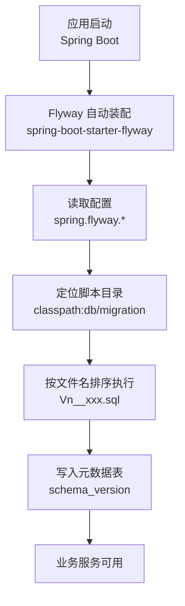
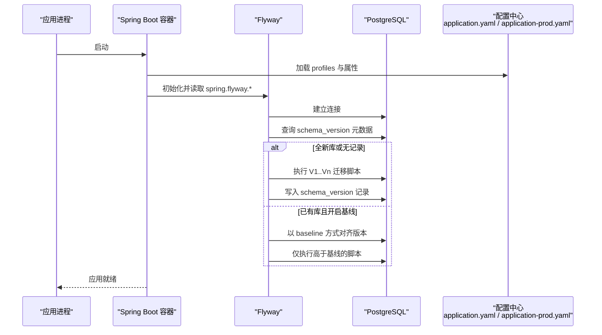
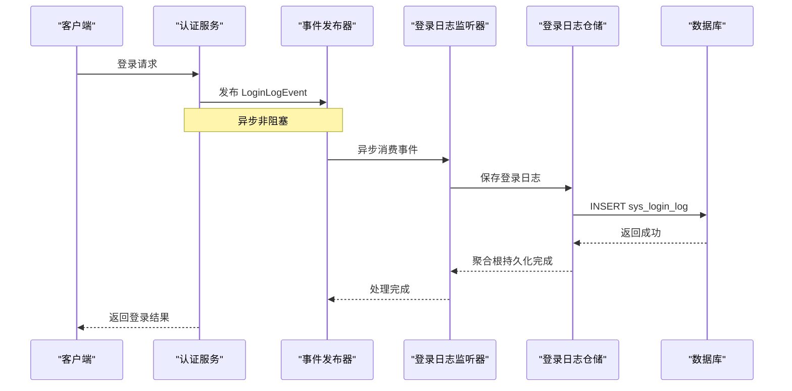
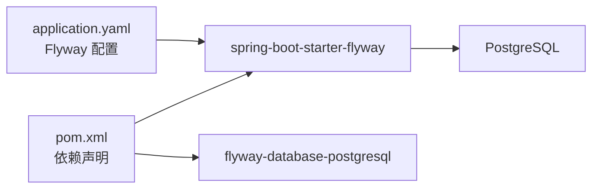

# 数据库迁移管理

<cite>
**本文引用的文件列表**
- [pom.xml](file://pom.xml)
- [application.yaml](file://src/main/resources/application.yaml)
- [application-prod.yaml](file://src/main/resources/application-prod.yaml)
- [docker-compose.yaml](file://docker-compose.yaml)
- [README.md](file://README.md)
- [V1__init_sys_user.sql](file://src/main/resources/db/migration/V1__init_sys_user.sql)
- [V2__init_rbac.sql](file://src/main/resources/db/migration/V2__init_rbac.sql)
- [V3__init_sys_oper_log.sql](file://src/main/resources/db/migration/V3__init_sys_oper_log.sql)
- [V4__init_dict.sql](file://src/main/resources/db/migration/V4__init_dict.sql)
- [V5__init_sys_file.sql](file://src/main/resources/db/migration/V5__init_sys_file.sql)
- [V6__init_sys_login_log.sql](file://src/main/resources/db/migration/V6__init_sys_login_log.sql)
</cite>

## 更新摘要
**变更内容**
- 新增 V6 版本登录日志跟踪功能的完整实现说明
- 更新迁移脚本清单，包含最新的 sys_login_log 表结构
- 补充登录日志相关的领域事件、聚合根和仓储实现细节
- 完善多环境部署时的登录日志数据一致性保障策略

## 目录
1. [简介](#简介)
2. [项目结构](#项目结构)
3. [核心组件](#核心组件)
4. [架构总览](#架构总览)
5. [详细组件分析](#详细组件分析)
6. [依赖关系分析](#依赖关系分析)
7. [性能与一致性考量](#性能与一致性考量)
8. [故障排查指南](#故障排查指南)
9. [结论](#结论)
10. [附录](#附录)

## 简介
本指南面向使用 Flyway 进行数据库版本化管理的团队，结合当前仓库的 Spring Boot + PostgreSQL 实践，系统阐述：
- 版本命名规范、脚本编写规范与执行顺序控制
- 开发/测试/生产环境的迁移策略差异
- 回滚机制与数据备份恢复流程
- 幂等性保证、数据一致性检查与错误处理最佳实践
- 多环境部署时的迁移同步策略与冲突解决方案
- 迁移过程的监控与告警建议

## 项目结构
本项目采用六边形架构（DDD），数据库迁移脚本统一存放于资源目录下的 db/migration，由 Spring Boot 自动装配的 Flyway 在应用启动时扫描并执行。

图表来源
- [pom.xml:141-151](file://pom.xml#L141-L151)
- [application.yaml:32-36](file://src/main/resources/application.yaml#L32-L36)

章节来源
- [pom.xml:141-151](file://pom.xml#L141-L151)
- [application.yaml:32-36](file://src/main/resources/application.yaml#L32-L36)
- [README.md:95](file://README.md#L95)

## 核心组件
- 依赖引入：通过 spring-boot-starter-flyway 与 flyway-database-postgresql 启用 Flyway 对 PostgreSQL 的支持。
- 配置项：
  - spring.flyway.enabled=true
  - spring.flyway.locations=classpath:db/migration
  - spring.flyway.baseline-on-migrate=true（兼容已有库）
- 脚本位置：src/main/resources/db/migration/*.sql
- 执行时机：应用启动阶段，连接池初始化后自动执行未执行的迁移脚本。

章节来源
- [pom.xml:141-151](file://pom.xml#L141-L151)
- [application.yaml:32-36](file://src/main/resources/application.yaml#L32-L36)

## 架构总览
下图展示了从应用启动到迁移完成的关键交互路径，以及各配置文件的作用范围。

图表来源
- [application.yaml:32-36](file://src/main/resources/application.yaml#L32-L36)
- [application-prod.yaml:1-7](file://src/main/resources/application-prod.yaml#L1-L7)
- [pom.xml:141-151](file://pom.xml#L141-L151)

## 详细组件分析

### 版本命名规范与执行顺序控制
- 命名规则：V{版本号}__{描述}.sql，例如 V1__init_sys_user.sql、V2__init_rbac.sql。
- 执行顺序：Flyway 严格按文件名字典序执行，因此版本号必须单调递增且唯一。
- 现有脚本清单：
  - V1__init_sys_user.sql
  - V2__init_rbac.sql
  - V3__init_sys_oper_log.sql
  - V4__init_dict.sql
  - V5__init_sys_file.sql
  - V6__init_sys_login_log.sql

**更新** 新增 V6 版本登录日志跟踪功能，包含完整的 sys_login_log 表结构和索引优化。

章节来源
- [V1__init_sys_user.sql](file://src/main/resources/db/migration/V1__init_sys_user.sql)
- [V2__init_rbac.sql](file://src/main/resources/db/migration/V2__init_rbac.sql)
- [V3__init_sys_oper_log.sql](file://src/main/resources/db/migration/V3__init_sys_oper_log.sql)
- [V4__init_dict.sql](file://src/main/resources/db/migration/V4__init_dict.sql)
- [V5__init_sys_file.sql](file://src/main/resources/db/migration/V5__init_sys_file.sql)
- [V6__init_sys_login_log.sql](file://src/main/resources/db/migration/V6__init_sys_login_log.sql)

### 迁移脚本编写规范
- 幂等性要求：
  - 使用 IF NOT EXISTS 创建对象；使用条件更新避免重复插入。
  - 删除列/索引前需判断存在性（如使用 PL/pgSQL 块）。
- 数据一致性：
  - 涉及多表变更应置于同一事务中（Flyway 默认单脚本内事务）。
  - 种子数据插入需考虑幂等与去重。
- 可观测性：
  - 为关键表添加注释 COMMENT ON TABLE/COLUMN。
  - 为高频查询字段建立合适索引。
- 兼容性：
  - 新增字段设置合理默认值，避免破坏既有查询。
  - 删除字段前先评估下游影响，必要时分阶段迁移。

**更新** V6 版本的登录日志表设计体现了良好的可观测性实践，包含详细的字段注释和性能优化的复合索引。

章节来源
- [V1__init_sys_user.sql](file://src/main/resources/db/migration/V1__init_sys_user.sql)
- [V2__init_rbac.sql](file://src/main/resources/db/migration/V2__init_rbac.sql)
- [V3__init_sys_oper_log.sql](file://src/main/resources/db/migration/V3__init_sys_oper_log.sql)
- [V4__init_dict.sql](file://src/main/resources/db/migration/V4__init_dict.sql)
- [V5__init_sys_file.sql](file://src/main/resources/db/migration/V5__init_sys_file.sql)
- [V6__init_sys_login_log.sql](file://src/main/resources/db/migration/V6__init_sys_login_log.sql)

### 执行顺序控制与依赖关系
- 脚本间依赖：
  - V2 依赖 V1 的用户表结构。
  - V3/V4/V5/V6 为独立模块扩展，不强制依赖彼此。
- 建议：
  - 将强依赖拆分为多个小脚本，便于局部回滚与验证。
  - 跨模块变更尽量合并至同一脚本，减少并发风险。

**更新** V6 登录日志功能作为独立的审计模块，与用户认证流程解耦，通过事件驱动架构确保数据一致性。

章节来源
- [V1__init_sys_user.sql](file://src/main/resources/db/migration/V1__init_sys_user.sql)
- [V2__init_rbac.sql](file://src/main/resources/db/migration/V2__init_rbac.sql)

### 多环境迁移策略差异
- 开发环境（dev）：
  - 默认激活 dev profile，本地 docker-compose 提供 PostgreSQL 与 Redis。
  - 应用启动即执行迁移，快速验证。
- 测试环境（test）：
  - 集成测试通过环境变量注入真实 PG/Redis，启动时同样触发迁移。
- 生产环境（prod）：
  - 通过环境变量注入连接信息，关闭 swagger-ui 与 openapi 暴露面。
  - 建议在发布流水线中显式执行迁移，或在灰度节点上先行执行并校验。

**更新** 生产环境部署时需特别注意 V6 登录日志表的异步写入特性，确保线程池配置和数据持久化可靠性。

章节来源
- [application.yaml:1-36](file://src/main/resources/application.yaml#L1-L36)
- [application-prod.yaml:1-7](file://src/main/resources/application-prod.yaml#L1-L7)
- [docker-compose.yaml:1-36](file://docker-compose.yaml#L1-L36)
- [README.md:76-83](file://README.md#L76-L83)

### 回滚机制与数据备份恢复流程
- 回滚能力：
  - 当前仓库未引入 Flyway 的回滚脚本（Rn__*.sql），不建议在生产直接依赖自动回滚。
  - 如需回滚，优先采用"正向修复"策略：编写新的迁移脚本修正问题。
- 数据备份与恢复：
  - 生产变更前执行全量逻辑/物理备份（pg_dump 或云厂商快照）。
  - 变更后若出现严重问题，优先回滚应用版本并恢复数据库备份。
- 基线模式说明：
  - 已开启 baseline-on-migrate，用于兼容历史库；新库仍从 V1 开始执行。

**更新** 对于 V6 登录日志表，由于是只增不改的审计表，回滚策略相对简单，主要关注数据一致性和完整性。

章节来源
- [application.yaml:32-36](file://src/main/resources/application.yaml#L32-L36)
- [README.md:95](file://README.md#L95)

### 幂等性与一致性检查要点
- 幂等性检查清单：
  - 建表/索引/约束是否使用 IF NOT EXISTS。
  - 插入种子数据是否具备唯一键或去重逻辑。
  - 删除操作是否先判断对象存在。
- 一致性检查建议：
  - 迁移前后对比 schema_version 记录。
  - 针对关键字段增加 CHECK 约束或外键约束，确保数据质量。
  - 大表变更分批提交，避免长事务锁竞争。

**更新** V6 登录日志表的设计充分考虑了幂等性，所有字段都有合理的默认值，支持多次执行的安全性。

章节来源
- [V1__init_sys_user.sql](file://src/main/resources/db/migration/V1__init_sys_user.sql)
- [V2__init_rbac.sql](file://src/main/resources/db/migration/V2__init_rbac.sql)
- [V3__init_sys_oper_log.sql](file://src/main/resources/db/migration/V3__init_sys_oper_log.sql)
- [V4__init_dict.sql](file://src/main/resources/db/migration/V4__init_dict.sql)
- [V5__init_sys_file.sql](file://src/main/resources/db/migration/V5__init_sys_file.sql)
- [V6__init_sys_login_log.sql](file://src/main/resources/db/migration/V6__init_sys_login_log.sql)

### 多环境部署时的迁移同步与冲突解决
- 同步策略：
  - 所有环境共享同一份 db/migration 脚本，禁止在各环境维护分支脚本。
  - 通过 CI/CD 流水线统一构建制品，确保各环境一致。
- 冲突解决：
  - 若多人并行修改同一模块，优先合并至单一脚本，避免版本号冲突。
  - 遇到版本号冲突，立即停止发布，评审后重新编号并回归验证。

**更新** V6 登录日志功能的分布式部署需要考虑异步事件处理的网络分区和重试机制。

章节来源
- [README.md:95](file://README.md#L95)

### 迁移过程中的监控与告警建议
- 日志与指标：
  - 关注应用启动日志中的 Flyway 执行结果与耗时。
  - 收集数据库连接成功率、慢查询与锁等待指标。
- 告警阈值：
  - 迁移失败率、单次迁移耗时异常、schema_version 不一致。
- 健康检查：
  - 在启动探针中增加"数据库连通 + 关键表存在"的检查，失败则拒绝流量。

**更新** 针对 V6 登录日志表，需要特别监控异步写入的成功率和延迟，确保审计数据的完整性。

[本节为通用建议，无需特定文件引用]

### 登录日志功能架构详解

#### 领域事件驱动架构
V6 版本引入了基于事件的登录日志跟踪功能，采用领域事件驱动架构确保主业务流程与审计日志的解耦。

图表来源
- [LoginLogListener.java:25-34](file://src/main/java/com/sunnao/spring/ddd/template/application/system/log/listener/LoginLogListener.java#L25-L34)
- [LoginLogRepositoryImpl.java:38-52](file://src/main/java/com/sunnao/spring/ddd/template/infrastructure/system/log/repository/LoginLogRepositoryImpl.java#L38-L52)

#### 数据模型设计
登录日志表采用简洁高效的设计，重点关注查询性能和数据完整性：

| 字段 | 类型 | 说明 | 索引 |
|------|------|------|------|
| id | BIGSERIAL | 主键ID | 主键索引 |
| trace_id | VARCHAR(64) | 链路追踪ID | - |
| user_id | BIGINT | 用户ID | idx_sys_login_log_user |
| email | VARCHAR(128) | 登录邮箱 | idx_sys_login_log_email |
| success | BOOLEAN | 是否登录成功 | - |
| code | VARCHAR(64) | 结果码 | - |
| msg | VARCHAR(256) | 结果说明 | - |
| ip | VARCHAR(64) | 客户端IP | - |
| user_agent | VARCHAR(512) | 客户端标识 | - |
| create_at | TIMESTAMP | 登录时间 | idx_sys_login_log_create_at |

**更新** V6 版本的表结构设计体现了良好的性能优化实践，包括时间倒序索引和用户维度查询索引。

章节来源
- [V6__init_sys_login_log.sql:1-42](file://src/main/resources/db/migration/V6__init_sys_login_log.sql#L1-L42)
- [LoginLogEntity.java:15-56](file://src/main/java/com/sunnao/spring/ddd/template/domain/system/log/model/entity/LoginLogEntity.java#L15-L56)
- [LoginLogPO.java:21-73](file://src/main/java/com/sunnao/spring/ddd/template/infrastructure/system/log/mysql/po/LoginLogPO.java#L21-L73)

#### 异步处理与错误隔离
登录日志的异步处理确保了主业务流程的高可用性：

- **异步消费**：使用 @Async 注解和专用线程池处理日志持久化
- **错误隔离**：捕获异常仅记录日志，不影响登录主流程
- **MDC 透传**：保持链路追踪上下文的一致性
- **幂等保证**：支持重复消费场景的数据一致性

章节来源
- [LoginLogListener.java:18-35](file://src/main/java/com/sunnao/spring/ddd/template/application/system/log/listener/LoginLogListener.java#L18-L35)
- [LoginLogRepositoryImpl.java:38-52](file://src/main/java/com/sunnao/spring/ddd/template/infrastructure/system/log/repository/LoginLogRepositoryImpl.java#L38-L52)

### 迁移过程中的监控与告警建议
- 日志与指标：
  - 关注应用启动日志中的 Flyway 执行结果与耗时。
  - 收集数据库连接成功率、慢查询与锁等待指标。
- 告警阈值：
  - 迁移失败率、单次迁移耗时异常、schema_version 不一致。
- 健康检查：
  - 在启动探针中增加"数据库连通 + 关键表存在"的检查，失败则拒绝流量。

**更新** 针对 V6 登录日志表，需要特别监控异步写入的成功率和延迟，确保审计数据的完整性。

[本节为通用建议，无需特定文件引用]

## 依赖关系分析
- 运行时依赖：
  - spring-boot-starter-flyway：启用 Flyway 自动装配。
  - flyway-database-postgresql：提供 PostgreSQL 驱动支持。
- 配置依赖：
  - spring.flyway.enabled、locations、baseline-on-migrate 决定迁移行为。
- 外部依赖：
  - PostgreSQL 17（开发环境通过 docker-compose 提供）。

图表来源
- [pom.xml:141-151](file://pom.xml#L141-L151)
- [application.yaml:32-36](file://src/main/resources/application.yaml#L32-L36)
- [docker-compose.yaml:1-36](file://docker-compose.yaml#L1-L36)

章节来源
- [pom.xml:141-151](file://pom.xml#L141-L151)
- [application.yaml:32-36](file://src/main/resources/application.yaml#L32-L36)
- [docker-compose.yaml:1-36](file://docker-compose.yaml#L1-L36)

## 性能与一致性考量
- 大表变更：
  - 使用在线变更工具或分批 DDL/DML，降低锁等待。
  - 避免在高峰时段执行长时间迁移。
- 索引与统计信息：
  - 批量导入后更新统计信息，提升查询计划质量。
- 事务边界：
  - 单个脚本内事务保证原子性；跨脚本变更谨慎拆分。

**更新** V6 登录日志表的索引设计充分考虑了常见查询场景，包括时间范围查询、用户维度查询和邮箱精确匹配。

[本节为通用建议，无需特定文件引用]

## 故障排查指南
- 常见问题定位：
  - 启动时报迁移失败：检查数据库连接、权限与脚本语法。
  - 重复执行报错：确认是否存在同名脚本或 schema_version 异常。
  - 基线模式导致跳过：核对 baseline-on-migrate 与期望版本是否一致。
- 快速自检步骤：
  - 查看应用启动日志中 Flyway 输出。
  - 登录数据库检查 schema_version 表记录。
  - 复现最小化脚本，隔离问题范围。

**更新** 针对 V6 登录日志功能，需要检查异步线程池配置和事件监听器的异常处理机制。

章节来源
- [application.yaml:32-36](file://src/main/resources/application.yaml#L32-L36)

## 结论
通过统一的 Flyway 管理与严格的脚本规范，本项目实现了可追溯、可回退（以正向修复为主）、可观测的数据库演进流程。在多环境部署中，坚持"脚本集中管理、版本严格递增、变更可验证"的原则，可有效降低上线风险。

**更新** V6 版本的登录日志功能展现了现代微服务架构的最佳实践，通过事件驱动和异步处理实现了高可用的审计日志系统。

[本节为总结性内容，无需特定文件引用]

## 附录
- 常用命令参考（概念性说明）：
  - 查看迁移状态：查询 schema_version 表。
  - 清理与重建：仅在本地/测试环境使用，生产严禁随意清理。
  - 基线操作：仅在历史库首次接入 Flyway 时使用。
- 相关文档：
  - README 中对迁移脚本位置与模块说明。

**更新** V6 版本的完整实现包含了领域事件、聚合根、仓储接口和基础设施层的完整代码示例，可作为后续类似功能的参考模板。

章节来源
- [README.md:95](file://README.md#L95)