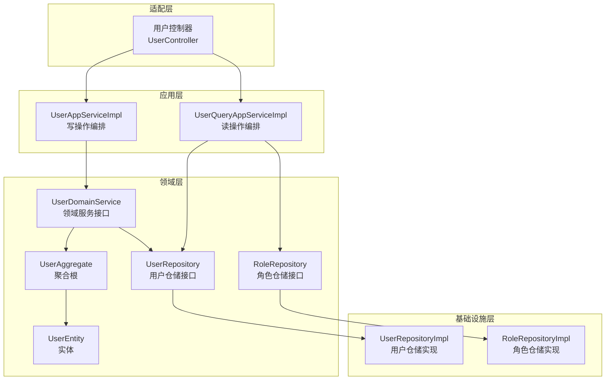
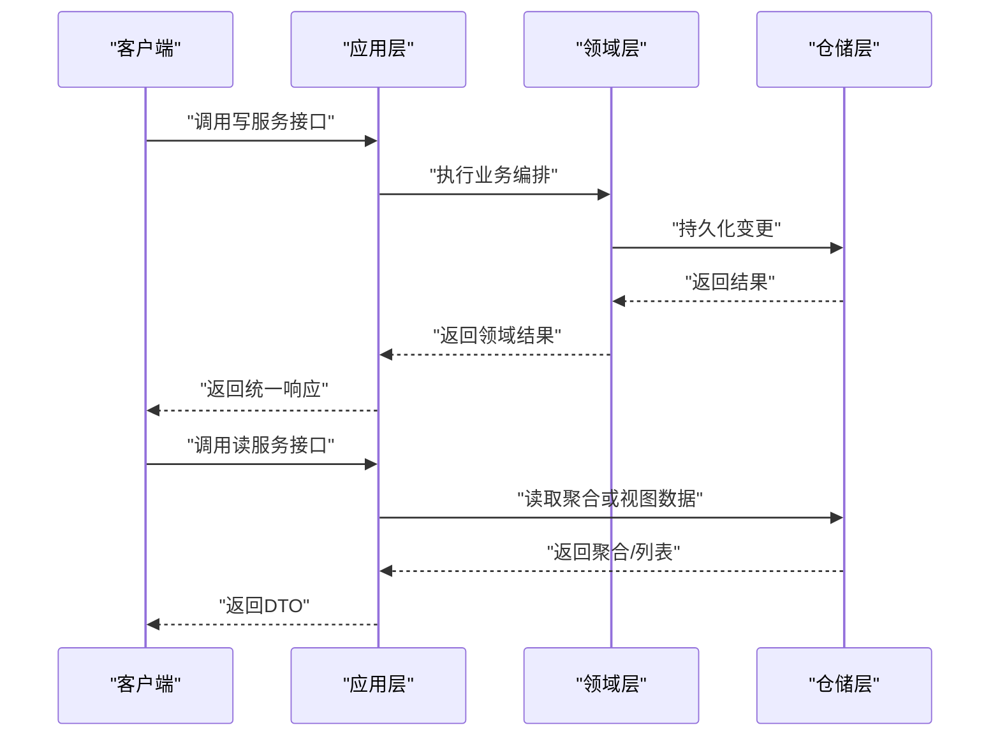
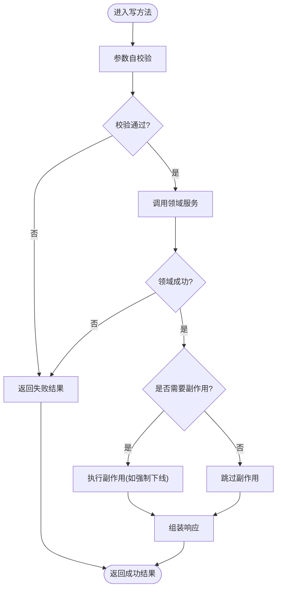
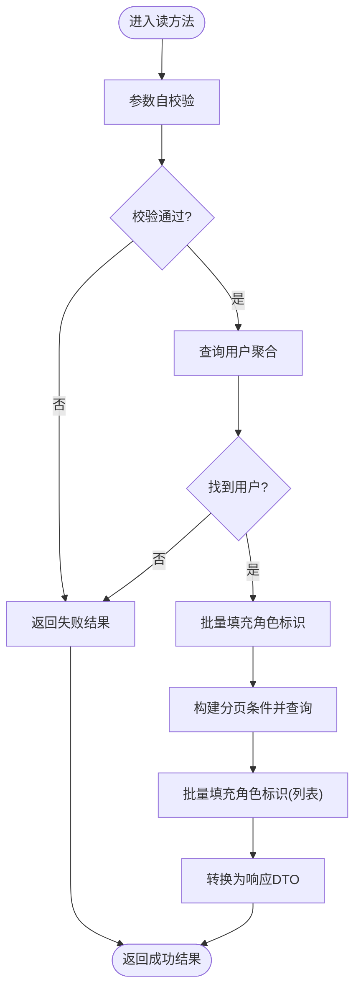
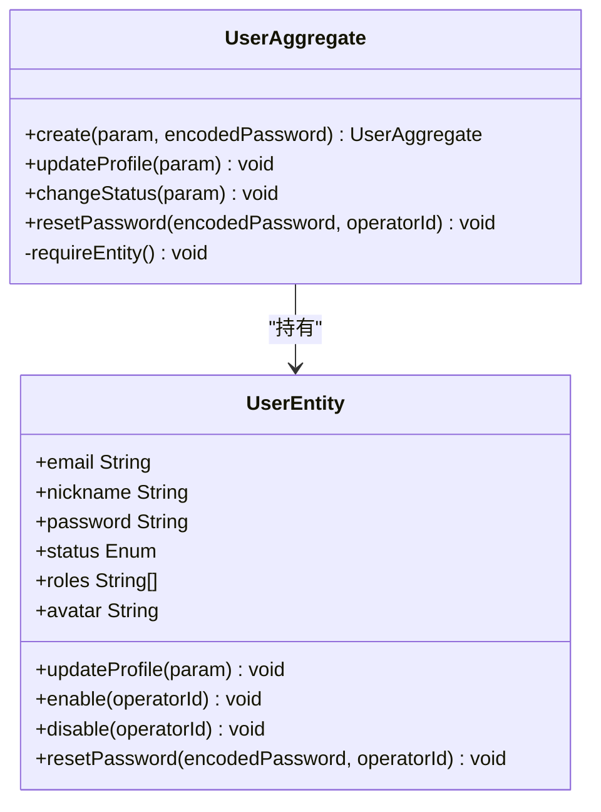
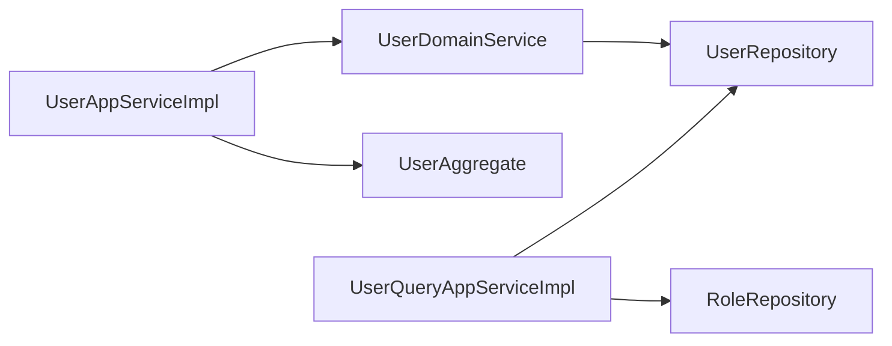

# CQRS模式实现

<cite>
**本文引用的文件**   
- [ApplicationCmdService.java](file://src/main/java/com/sunnao/spring/ddd/template/common/service/ApplicationCmdService.java)
- [ApplicationQueryService.java](file://src/main/java/com/sunnao/spring/ddd/template/common/service/ApplicationQueryService.java)
- [UserAppServiceImpl.java](file://src/main/java/com/sunnao/spring/ddd/template/application/system/user/scenario/UserAppServiceImpl.java)
- [UserQueryAppServiceImpl.java](file://src/main/java/com/sunnao/spring/ddd/template/application/system/user/scenario/UserQueryAppServiceImpl.java)
- [UserAppService.java](file://src/main/java/com/sunnao/spring/ddd/template/client/system/user/UserAppService.java)
- [UserQueryAppService.java](file://src/main/java/com/sunnao/spring/ddd/template/client/system/user/UserQueryAppService.java)
- [UserDomainService.java](file://src/main/java/com/sunnao/spring/ddd/template/domain/system/user/service/UserDomainService.java)
- [UserRepository.java](file://src/main/java/com/sunnao/spring/ddd/template/domain/system/user/repository/UserRepository.java)
- [RoleRepository.java](file://src/main/java/com/sunnao/spring/ddd/template/domain/system/role/repository/RoleRepository.java)
- [UserAggregate.java](file://src/main/java/com/sunnao/spring/ddd/template/domain/system/user/model/aggregate/UserAggregate.java)
- [UserEntity.java](file://src/main/java/com/sunnao/spring/ddd/template/domain/system/user/model/entity/UserEntity.java)
- [UserDTO.java](file://src/main/java/com/sunnao/spring/ddd/template/client/system/user/model/UserDTO.java)
- [BaseDto.java](file://src/main/java/com/sunnao/spring/ddd/template/common/model/BaseDto.java)
- [BaseEntity.java](file://src/main/java/com/sunnao/spring/ddd/template/common/model/BaseEntity.java)
- [Aggregate.java](file://src/main/java/com/sunnao/spring/ddd/template/common/model/Aggregate.java)
- [Repository.java](file://src/main/java/com/sunnao/spring/ddd/template/common/model/Repository.java)
</cite>

## 目录
1. [简介](#简介)
2. [项目结构](#项目结构)
3. [核心组件](#核心组件)
4. [架构总览](#架构总览)
5. [详细组件分析](#详细组件分析)
6. [依赖关系分析](#依赖关系分析)
7. [性能考量](#性能考量)
8. [故障排查指南](#故障排查指南)
9. [结论](#结论)
10. [附录](#附录)

## 简介
本技术文档围绕命令查询职责分离（CQRS）在该工程中的落地实践展开，重点解释：
- CQRS 的设计思想与适用场景
- ApplicationCmdService 与 ApplicationQueryService 的抽象设计及其职责划分
- 以 UserAppServiceImpl 和 UserQueryAppServiceImpl 为例的命令与查询实现差异
- 读写模型分离带来的性能、扩展性与复杂度收益
- 查询侧优化策略（缓存、数据库查询优化、DTO 设计）
- 命令侧事务处理与一致性保证机制
- CQRS 与事件溯源（Event Sourcing）结合的使用指南
- 常见性能陷阱与解决方案

## 项目结构
该工程采用分层与领域驱动相结合的组织方式。CQRS 在应用层通过“写服务”和“读服务”进行显式拆分，领域层通过聚合根与仓储接口维护一致性边界，基础设施层提供持久化实现。

图表来源
- [UserAppServiceImpl.java:1-163](file://src/main/java/com/sunnao/spring/ddd/template/application/system/user/scenario/UserAppServiceImpl.java#L1-L163)
- [UserQueryAppServiceImpl.java:1-104](file://src/main/java/com/sunnao/spring/ddd/template/application/system/user/scenario/UserQueryAppServiceImpl.java#L1-L104)
- [UserDomainService.java:1-50](file://src/main/java/com/sunnao/spring/ddd/template/domain/system/user/service/UserDomainService.java#L1-L50)
- [UserRepository.java:1-65](file://src/main/java/com/sunnao/spring/ddd/template/domain/system/user/repository/UserRepository.java#L1-L65)
- [RoleRepository.java:1-119](file://src/main/java/com/sunnao/spring/ddd/template/domain/system/role/repository/RoleRepository.java#L1-L119)

章节来源
- [UserAppServiceImpl.java:1-163](file://src/main/java/com/sunnao/spring/ddd/template/application/system/user/scenario/UserAppServiceImpl.java#L1-L163)
- [UserQueryAppServiceImpl.java:1-104](file://src/main/java/com/sunnao/spring/ddd/template/application/system/user/scenario/UserQueryAppServiceImpl.java#L1-L104)
- [UserDomainService.java:1-50](file://src/main/java/com/sunnao/spring/ddd/template/domain/system/user/service/UserDomainService.java#L1-L50)
- [UserRepository.java:1-65](file://src/main/java/com/sunnao/spring/ddd/template/domain/system/user/repository/UserRepository.java#L1-L65)
- [RoleRepository.java:1-119](file://src/main/java/com/sunnao/spring/ddd/template/domain/system/role/repository/RoleRepository.java#L1-L119)

## 核心组件
- 应用层写服务接口与应用层读服务接口作为统一抽象，便于跨领域复用与治理。
- 用户写应用服务实现负责参数校验、领域编排、响应组装以及必要的副作用（如强制下线）。
- 用户读应用服务实现专注读取领域数据，按需填充跨领域信息（如角色标识），并转换为 DTO。

章节来源
- [ApplicationCmdService.java:1-5](file://src/main/java/com/sunnao/spring/ddd/template/common/service/ApplicationCmdService.java#L1-L5)
- [ApplicationQueryService.java:1-5](file://src/main/java/com/sunnao/spring/ddd/template/common/service/ApplicationQueryService.java#L1-L5)
- [UserAppService.java:1-52](file://src/main/java/com/sunnao/spring/ddd/template/client/system/user/UserAppService.java#L1-L52)
- [UserQueryAppService.java:1-32](file://src/main/java/com/sunnao/spring/ddd/template/client/system/user/UserQueryAppService.java#L1-L32)
- [UserAppServiceImpl.java:1-163](file://src/main/java/com/sunnao/spring/ddd/template/application/system/user/scenario/UserAppServiceImpl.java#L1-L163)
- [UserQueryAppServiceImpl.java:1-104](file://src/main/java/com/sunnao/spring/ddd/template/application/system/user/scenario/UserQueryAppServiceImpl.java#L1-L104)

## 架构总览
下图展示了从请求进入应用层到领域层与仓储层的调用路径，体现 CQRS 的读写分离与职责边界。

图表来源
- [UserAppServiceImpl.java:1-163](file://src/main/java/com/sunnao/spring/ddd/template/application/system/user/scenario/UserAppServiceImpl.java#L1-L163)
- [UserQueryAppServiceImpl.java:1-104](file://src/main/java/com/sunnao/spring/ddd/template/application/system/user/scenario/UserQueryAppServiceImpl.java#L1-L104)
- [UserDomainService.java:1-50](file://src/main/java/com/sunnao/spring/ddd/template/domain/system/user/service/UserDomainService.java#L1-L50)
- [UserRepository.java:1-65](file://src/main/java/com/sunnao/spring/ddd/template/domain/system/user/repository/UserRepository.java#L1-L65)

## 详细组件分析

### 应用层写服务：UserAppServiceImpl
- 职责：场景编排、参数自校验、领域服务调用、响应组装；在禁用或删除用户后执行会话踢出等副作用。
- 关键流程要点：
  - 参数自校验优先于领域调用，失败直接返回错误码与消息。
  - 领域服务返回 ResultDO 包装的结果，应用层据此决定成功或失败分支。
  - 状态变更成功后根据目标状态决定是否触发“强制下线”，确保鉴权一致性。
  - 异常捕获与日志记录，避免系统异常穿透至上层。

图表来源
- [UserAppServiceImpl.java:1-163](file://src/main/java/com/sunnao/spring/ddd/template/application/system/user/scenario/UserAppServiceImpl.java#L1-L163)

章节来源
- [UserAppServiceImpl.java:1-163](file://src/main/java/com/sunnao/spring/ddd/template/application/system/user/scenario/UserAppServiceImpl.java#L1-L163)

### 应用层读服务：UserQueryAppServiceImpl
- 职责：领域内查询、跨领域数据填充（如角色标识）、分页构建与 DTO 转换。
- 关键流程要点：
  - 参数自校验后，先查询用户聚合，再按需批量填充角色标识，避免 N+1 查询。
  - 分页参数由 RequestDTO 转为 PageQuery，计算 startIndex 并设置 pageSize。
  - 使用 Map 批量映射角色标识，减少多次远程/数据库访问。
  - 异常捕获与错误码封装，保障可读性与可观测性。

图表来源
- [UserQueryAppServiceImpl.java:1-104](file://src/main/java/com/sunnao/spring/ddd/template/application/system/user/scenario/UserQueryAppServiceImpl.java#L1-L104)
- [RoleRepository.java:1-119](file://src/main/java/com/sunnao/spring/ddd/template/domain/system/role/repository/RoleRepository.java#L1-L119)

章节来源
- [UserQueryAppServiceImpl.java:1-104](file://src/main/java/com/sunnao/spring/ddd/template/application/system/user/scenario/UserQueryAppServiceImpl.java#L1-L104)
- [RoleRepository.java:1-119](file://src/main/java/com/sunnao/spring/ddd/template/domain/system/role/repository/RoleRepository.java#L1-L119)

### 领域层：聚合根与实体
- 聚合根负责业务不变量与状态流转，对外暴露语义化方法，内部委托实体完成属性更新。
- 实体承载基础属性与简单行为，遵循最小暴露原则。

图表来源
- [UserAggregate.java:1-113](file://src/main/java/com/sunnao/spring/ddd/template/domain/system/user/model/aggregate/UserAggregate.java#L1-L113)
- [UserEntity.java:1-119](file://src/main/java/com/sunnao/spring/ddd/template/domain/system/user/model/entity/UserEntity.java#L1-L119)

章节来源
- [UserAggregate.java:1-113](file://src/main/java/com/sunnao/spring/ddd/template/domain/system/user/model/aggregate/UserAggregate.java#L1-L113)
- [UserEntity.java:1-119](file://src/main/java/com/sunnao/spring/ddd/template/domain/system/user/model/entity/UserEntity.java#L1-L119)

### 仓储接口与跨领域协作
- UserRepository 定义用户聚合的 CRUD 与特殊能力（按邮箱查询、带角色的保存/删除、分布式锁构建）。
- RoleRepository 提供角色与权限相关查询，支持 Sa-Token 鉴权所需的数据获取。
- 读服务中通过 RoleRepository 批量填充角色标识，避免逐条查询。

章节来源
- [UserRepository.java:1-65](file://src/main/java/com/sunnao/spring/ddd/template/domain/system/user/repository/UserRepository.java#L1-L65)
- [RoleRepository.java:1-119](file://src/main/java/com/sunnao/spring/ddd/template/domain/system/role/repository/RoleRepository.java#L1-L119)

### DTO 设计与参数自校验
- BaseDto 提供统一的 check() 钩子，RequestDTO 可在其中实现参数自校验，避免在应用层散落校验逻辑。
- UserDTO 作为通用响应对象，不包含敏感字段，被多个 ResponseDTO 引用，提升复用性。

章节来源
- [BaseDto.java:1-23](file://src/main/java/com/sunnao/spring/ddd/template/common/model/BaseDto.java#L1-L23)
- [UserDTO.java:1-65](file://src/main/java/com/sunnao/spring/ddd/template/client/system/user/model/UserDTO.java#L1-L65)

## 依赖关系分析
- 应用层写服务依赖领域服务与 Assembler，不直接访问仓储。
- 应用层读服务直接依赖仓储接口，按需跨领域填充数据。
- 领域层通过仓储接口屏蔽基础设施细节，保持高内聚低耦合。

图表来源
- [UserAppServiceImpl.java:1-163](file://src/main/java/com/sunnao/spring/ddd/template/application/system/user/scenario/UserAppServiceImpl.java#L1-L163)
- [UserQueryAppServiceImpl.java:1-104](file://src/main/java/com/sunnao/spring/ddd/template/application/system/user/scenario/UserQueryAppServiceImpl.java#L1-L104)
- [UserDomainService.java:1-50](file://src/main/java/com/sunnao/spring/ddd/template/domain/system/user/service/UserDomainService.java#L1-L50)
- [UserRepository.java:1-65](file://src/main/java/com/sunnao/spring/ddd/template/domain/system/user/repository/UserRepository.java#L1-L65)
- [RoleRepository.java:1-119](file://src/main/java/com/sunnao/spring/ddd/template/domain/system/role/repository/RoleRepository.java#L1-L119)

章节来源
- [UserAppServiceImpl.java:1-163](file://src/main/java/com/sunnao/spring/ddd/template/application/system/user/scenario/UserAppServiceImpl.java#L1-L163)
- [UserQueryAppServiceImpl.java:1-104](file://src/main/java/com/sunnao/spring/ddd/template/application/system/user/scenario/UserQueryAppServiceImpl.java#L1-L104)
- [UserDomainService.java:1-50](file://src/main/java/com/sunnao/spring/ddd/template/domain/system/user/service/UserDomainService.java#L1-L50)
- [UserRepository.java:1-65](file://src/main/java/com/sunnao/spring/ddd/template/domain/system/user/repository/UserRepository.java#L1-L65)
- [RoleRepository.java:1-119](file://src/main/java/com/sunnao/spring/ddd/template/domain/system/role/repository/RoleRepository.java#L1-L119)

## 性能考量
- 查询侧优化
  - 批量填充：在分页查询时，先收集用户 ID 集合，再一次性查询角色标识，避免 N+1 问题。
  - 分页参数转换：将前端页码转换为 startIndex，减少内存计算开销。
  - DTO 精简：仅返回必要字段，降低序列化与网络传输成本。
- 缓存建议
  - 热点读数据（如字典、权限点、用户详情）可引入本地缓存或分布式缓存，注意失效策略与一致性权衡。
  - 写后主动失效或延迟双删，避免脏读。
- 数据库查询优化
  - 合理索引：为常用查询条件建立复合索引，覆盖排序与过滤字段。
  - 只查所需列：避免 SELECT *，减少 I/O 与内存占用。
  - 分批处理：大数据集采用游标或分页拉取，控制单次负载。
- 写侧优化
  - 幂等设计：对重复提交进行去重，防止重复写入。
  - 异步副作用：非关键路径操作（如通知、审计）异步化，缩短主流程耗时。

[本节为通用指导，无需特定文件引用]

## 故障排查指南
- 常见问题定位
  - 参数校验失败：检查 RequestDTO 的 check() 实现是否覆盖所有必填项与格式约束。
  - 领域状态非法：关注聚合根的状态流转方法与错误码，确认前置条件是否满足。
  - 跨领域数据缺失：确认读服务是否正确批量填充角色标识，避免空值导致展示异常。
  - 会话不一致：禁用或删除用户后，确认是否执行了强制下线逻辑。
- 日志与追踪
  - 应用层统一捕获异常并记录上下文（请求参数、用户ID），便于快速复现与定位。
  - 结合链路追踪 ID，贯穿适配层、应用层与领域层。

章节来源
- [UserAppServiceImpl.java:1-163](file://src/main/java/com/sunnao/spring/ddd/template/application/system/user/scenario/UserAppServiceImpl.java#L1-L163)
- [UserQueryAppServiceImpl.java:1-104](file://src/main/java/com/sunnao/spring/ddd/template/application/system/user/scenario/UserQueryAppServiceImpl.java#L1-L104)

## 结论
该工程通过明确的 CQRS 分层与领域建模，实现了写操作的强一致与读操作的高性能。应用层写服务聚焦编排与副作用，读服务专注高效读取与 DTO 转换；领域层通过聚合根维护不变量，仓储接口屏蔽持久化细节。配合批量填充、分页优化与统一的异常处理，整体具备良好的可扩展性与可维护性。

[本节为总结性内容，无需特定文件引用]

## 附录

### CQRS 与事件溯源（Event Sourcing）结合指南
- 何时考虑
  - 需要完整审计轨迹、时间旅行回放、复杂状态重建的场景。
  - 高并发下需要最终一致性的跨域协作。
- 如何结合
  - 写侧：领域事件替代直接状态变更，事件持久化为不可变记录；应用层发布领域事件。
  - 读侧：基于事件流重建投影表或缓存，实现高性能查询。
  - 一致性：通过幂等消费者与版本控制保证事件处理的幂等与顺序。
- 在本工程的演进建议
  - 在领域层引入事件发布器，将用户创建、状态变更等动作转化为领域事件。
  - 在基础设施层实现事件存储与消费，逐步迁移读模型为事件投影。
  - 保留现有仓储接口，作为过渡期兼容层，平滑演进。

[本节为概念性指导，无需特定文件引用]

### 代码示例路径（不含具体代码）
- 写操作示例
  - 创建用户：[UserAppServiceImpl.createUser:40-62](file://src/main/java/com/sunnao/spring/ddd/template/application/system/user/scenario/UserAppServiceImpl.java#L40-L62)
  - 修改用户资料：[UserAppServiceImpl.updateUser:65-88](file://src/main/java/com/sunnao/spring/ddd/template/application/system/user/scenario/UserAppServiceImpl.java#L65-L88)
  - 变更用户状态：[UserAppServiceImpl.changeUserStatus:91-120](file://src/main/java/com/sunnao/spring/ddd/template/application/system/user/scenario/UserAppServiceImpl.java#L91-L120)
  - 删除用户：[UserAppServiceImpl.deleteUser:123-149](file://src/main/java/com/sunnao/spring/ddd/template/application/system/user/scenario/UserAppServiceImpl.java#L123-L149)
- 读操作示例
  - 获取用户详情：[UserQueryAppServiceImpl.getUserDetail:43-65](file://src/main/java/com/sunnao/spring/ddd/template/application/system/user/scenario/UserQueryAppServiceImpl.java#L43-L65)
  - 分页查询用户列表：[UserQueryAppServiceImpl.queryUserPage:68-102](file://src/main/java/com/sunnao/spring/ddd/template/application/system/user/scenario/UserQueryAppServiceImpl.java#L68-L102)

章节来源
- [UserAppServiceImpl.java:1-163](file://src/main/java/com/sunnao/spring/ddd/template/application/system/user/scenario/UserAppServiceImpl.java#L1-L163)
- [UserQueryAppServiceImpl.java:1-104](file://src/main/java/com/sunnao/spring/ddd/template/application/system/user/scenario/UserQueryAppServiceImpl.java#L1-L104)