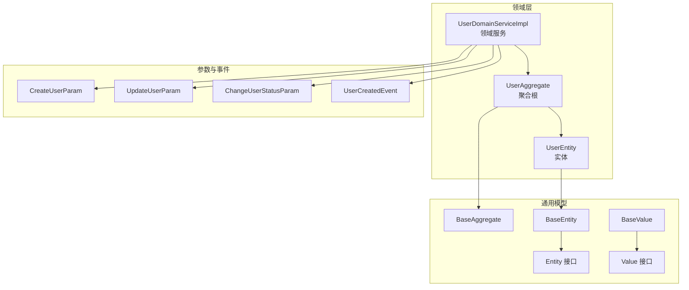
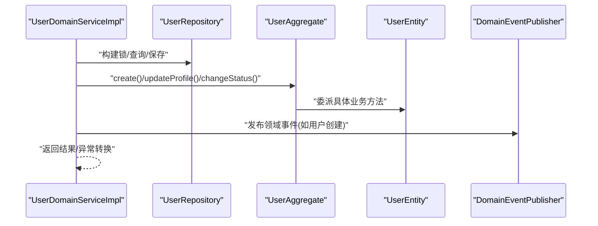
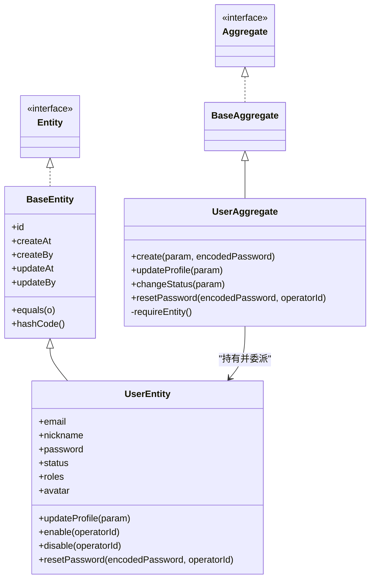
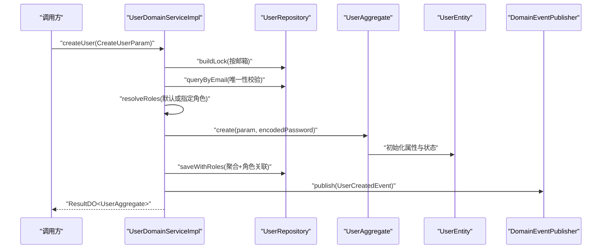
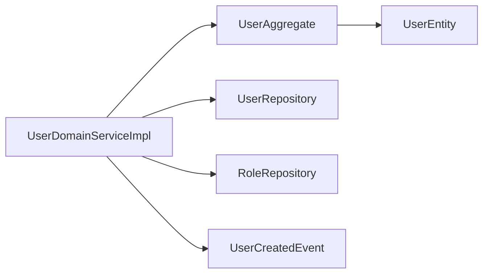

# DDD核心概念详解

<cite>
**本文引用的文件**
- [BaseAggregate.java](file://src/main/java/com/sunnao/spring/ddd/template/common/model/BaseAggregate.java)
- [Entity.java](file://src/main/java/com/sunnao/spring/ddd/template/common/model/Entity.java)
- [BaseValue.java](file://src/main/java/com/sunnao/spring/ddd/template/common/model/BaseValue.java)
- [BaseEntity.java](file://src/main/java/com/sunnao/spring/ddd/template/common/model/BaseEntity.java)
- [Aggregate.java](file://src/main/java/com/sunnao/spring/ddd/template/common/model/Aggregate.java)
- [Value.java](file://src/main/java/com/sunnao/spring/ddd/template/common/model/Value.java)
- [DomainService.java](file://src/main/java/com/sunnao/spring/ddd/template/common/service/DomainService.java)
- [UserAggregate.java](file://src/main/java/com/sunnao/spring/ddd/template/domain/system/user/model/aggregate/UserAggregate.java)
- [UserEntity.java](file://src/main/java/com/sunnao/spring/ddd/template/domain/system/user/model/entity/UserEntity.java)
- [UserDomainServiceImpl.java](file://src/main/java/com/sunnao/spring/ddd/template/domain/system/user/service/UserDomainServiceImpl.java)
- [CreateUserParam.java](file://src/main/java/com/sunnao/spring/ddd/template/domain/system/user/model/param/CreateUserParam.java)
- [UpdateUserParam.java](file://src/main/java/com/sunnao/spring/ddd/template/domain/system/user/model/param/UpdateUserParam.java)
- [ChangeUserStatusParam.java](file://src/main/java/com/sunnao/spring/ddd/template/domain/system/user/model/param/ChangeUserStatusParam.java)
- [UserCreatedEvent.java](file://src/main/java/com/sunnao/spring/ddd/template/domain/system/user/event/UserCreatedEvent.java)
- [README.md](file://docs/rule/ddd/README.md)
</cite>

## 目录
1. [引言](#引言)
2. [项目结构](#项目结构)
3. [核心组件](#核心组件)
4. [架构总览](#架构总览)
5. [详细组件分析](#详细组件分析)
6. [依赖关系分析](#依赖关系分析)
7. [性能与并发考虑](#性能与并发考虑)
8. [故障排查指南](#故障排查指南)
9. [结论](#结论)
10. [附录](#附录)

## 引言
本文件围绕领域驱动设计（DDD）的核心概念，结合仓库中的用户域实现，系统阐述聚合根、实体、值对象的设计原则与实践方式。重点说明 BaseAggregate、Entity、BaseValue 等基础抽象类的设计意图与使用规范；解释如何识别与划分聚合边界，确保高内聚低耦合的业务模型；详述实体的身份标识管理与生命周期控制、值对象的不可变性与等价性判断；并通过 UserEntity 等示例展示在真实项目中的落地模式；最后给出领域服务的适用场景与最佳实践建议。

## 项目结构
本项目采用六边形架构与分层规范，领域层聚焦业务不变式与状态变更，应用层负责用例编排，基础设施层提供持久化与技术能力，适配器层对接外部协议。文档侧的规范文件对四层职责、包结构与命名约定进行了明确定义，为领域建模提供了工程化约束。

图表来源
- [UserAggregate.java:1-113](file://src/main/java/com/sunnao/spring/ddd/template/domain/system/user/model/aggregate/UserAggregate.java#L1-L113)
- [UserEntity.java:1-119](file://src/main/java/com/sunnao/spring/ddd/template/domain/system/user/model/entity/UserEntity.java#L1-L119)
- [UserDomainServiceImpl.java:1-204](file://src/main/java/com/sunnao/spring/ddd/template/domain/system/user/service/UserDomainServiceImpl.java#L1-L204)
- [BaseAggregate.java:1-5](file://src/main/java/com/sunnao/spring/ddd/template/common/model/BaseAggregate.java#L1-L5)
- [BaseEntity.java:1-44](file://src/main/java/com/sunnao/spring/ddd/template/common/model/BaseEntity.java#L1-L44)
- [Entity.java:1-4](file://src/main/java/com/sunnao/spring/ddd/template/common/model/Entity.java#L1-L4)
- [BaseValue.java:1-4](file://src/main/java/com/sunnao/spring/ddd/template/common/model/BaseValue.java#L1-L4)
- [Value.java:1-4](file://src/main/java/com/sunnao/spring/ddd/template/common/model/Value.java#L1-L4)
- [CreateUserParam.java:1-48](file://src/main/java/com/sunnao/spring/ddd/template/domain/system/user/model/param/CreateUserParam.java#L1-L48)
- [UpdateUserParam.java:1-36](file://src/main/java/com/sunnao/spring/ddd/template/domain/system/user/model/param/UpdateUserParam.java#L1-L36)
- [ChangeUserStatusParam.java:1-32](file://src/main/java/com/sunnao/spring/ddd/template/domain/system/user/model/param/ChangeUserStatusParam.java#L1-L32)
- [UserCreatedEvent.java:1-39](file://src/main/java/com/sunnao/spring/ddd/template/domain/system/user/event/UserCreatedEvent.java#L1-L39)

章节来源
- [README.md:1-91](file://docs/rule/ddd/README.md#L1-L91)

## 核心组件
- 聚合根（Aggregate Root）
  - 通过统一入口封装内部实体的访问与变更，维护一致性边界与业务不变式。
  - 在本项目中由 UserAggregate 体现，对外暴露 create、updateProfile、changeStatus、resetPassword 等方法，内部委托给 UserEntity 执行具体变更。
- 实体（Entity）
  - 具有唯一身份标识与生命周期，承载属性与状态变更逻辑。
  - BaseEntity 提供 id、创建/更新时间、操作人等公共字段，并基于 id 实现 equals/hashCode，保证同一实例在不同会话中可被正确识别。
  - UserEntity 继承 BaseEntity，封装用户资料更新、启用/禁用、重置密码等业务方法。
- 值对象（Value Object）
  - 以相等性而非身份标识来区分，通常不可变，适合表达度量、描述或约束。
  - 通过 Value 接口与 BaseValue 抽象进行标记与扩展，便于在领域模型中统一处理。
- 领域服务（Domain Service）
  - 当业务逻辑无法自然归属到单一聚合时，使用领域服务协调多个聚合或跨聚合事务。
  - UserDomainServiceImpl 演示了写模式的标准流程：加锁→加载聚合→执行业务→持久化→发布事件→解锁。

章节来源
- [UserAggregate.java:1-113](file://src/main/java/com/sunnao/spring/ddd/template/domain/system/user/model/aggregate/UserAggregate.java#L1-L113)
- [UserEntity.java:1-119](file://src/main/java/com/sunnao/spring/ddd/template/domain/system/user/model/entity/UserEntity.java#L1-L119)
- [BaseEntity.java:1-44](file://src/main/java/com/sunnao/spring/ddd/template/common/model/BaseEntity.java#L1-L44)
- [BaseAggregate.java:1-5](file://src/main/java/com/sunnao/spring/ddd/template/common/model/BaseAggregate.java#L1-L5)
- [Entity.java:1-4](file://src/main/java/com/sunnao/spring/ddd/template/common/model/Entity.java#L1-L4)
- [BaseValue.java:1-4](file://src/main/java/com/sunnao/spring/ddd/template/common/model/BaseValue.java#L1-L4)
- [Value.java:1-4](file://src/main/java/com/sunnao/spring/ddd/template/common/model/Value.java#L1-L4)
- [UserDomainServiceImpl.java:1-204](file://src/main/java/com/sunnao/spring/ddd/template/domain/system/user/service/UserDomainServiceImpl.java#L1-L204)

## 架构总览
下图展示了用户域在写模式下从领域服务到聚合根与实体的调用链，以及领域事件的发布时机。

图表来源
- [UserDomainServiceImpl.java:46-89](file://src/main/java/com/sunnao/spring/ddd/template/domain/system/user/service/UserDomainServiceImpl.java#L46-L89)
- [UserAggregate.java:38-64](file://src/main/java/com/sunnao/spring/ddd/template/domain/system/user/model/aggregate/UserAggregate.java#L38-L64)
- [UserEntity.java:60-74](file://src/main/java/com/sunnao/spring/ddd/template/domain/system/user/model/entity/UserEntity.java#L60-L74)
- [UserCreatedEvent.java:1-39](file://src/main/java/com/sunnao/spring/ddd/template/domain/system/user/event/UserCreatedEvent.java#L1-L39)

## 详细组件分析

### 聚合根与实体的协作
- 聚合根负责：
  - 构造与校验入参，确保进入聚合的数据满足业务规则。
  - 作为唯一入口，避免外部直接修改内部实体，从而保护不变式。
  - 协调跨实体的复杂变更（例如状态切换时的前置检查）。
- 实体负责：
  - 维护自身属性与状态，并在方法内完成最小粒度的业务校验与变更。
  - 记录审计信息（如操作人），便于追踪与排障。

图表来源
- [Aggregate.java:1-4](file://src/main/java/com/sunnao/spring/ddd/template/common/model/Aggregate.java#L1-L4)
- [BaseAggregate.java:1-5](file://src/main/java/com/sunnao/spring/ddd/template/common/model/BaseAggregate.java#L1-L5)
- [UserAggregate.java:1-113](file://src/main/java/com/sunnao/spring/ddd/template/domain/system/user/model/aggregate/UserAggregate.java#L1-L113)
- [Entity.java:1-4](file://src/main/java/com/sunnao/spring/ddd/template/common/model/Entity.java#L1-L4)
- [BaseEntity.java:1-44](file://src/main/java/com/sunnao/spring/ddd/template/common/model/BaseEntity.java#L1-L44)
- [UserEntity.java:1-119](file://src/main/java/com/sunnao/spring/ddd/template/domain/system/user/model/entity/UserEntity.java#L1-L119)

章节来源
- [UserAggregate.java:1-113](file://src/main/java/com/sunnao/spring/ddd/template/domain/system/user/model/aggregate/UserAggregate.java#L1-L113)
- [UserEntity.java:1-119](file://src/main/java/com/sunnao/spring/ddd/template/domain/system/user/model/entity/UserEntity.java#L1-L119)

### 实体身份标识与生命周期
- 身份标识管理
  - BaseEntity 以 id 作为实体唯一标识，并据此实现 equals/hashCode，确保不同上下文中的同一实体能够被正确识别。
- 生命周期控制
  - 通过 createAt/createBy/updateAt/updateBy 记录创建与更新轨迹，便于审计与问题定位。
  - 在 UserEntity 的状态变更方法中设置 updateBy，保证每次变更都有操作人上下文。

章节来源
- [BaseEntity.java:12-42](file://src/main/java/com/sunnao/spring/ddd/template/common/model/BaseEntity.java#L12-L42)
- [UserEntity.java:82-102](file://src/main/java/com/sunnao/spring/ddd/template/domain/system/user/model/entity/UserEntity.java#L82-L102)

### 值对象的不可变性与等价性
- 设计要点
  - 值对象应尽可能不可变，所有变更通过返回新实例的方式表达。
  - 等价性判断基于内容而非身份，需重写 equals/hashCode。
- 项目中的标记
  - 通过 Value 接口与 BaseValue 抽象对值对象进行统一标记，便于后续扩展（如序列化、比较策略等）。

章节来源
- [BaseValue.java:1-4](file://src/main/java/com/sunnao/spring/ddd/template/common/model/BaseValue.java#L1-L4)
- [Value.java:1-4](file://src/main/java/com/sunnao/spring/ddd/template/common/model/Value.java#L1-L4)

### 领域服务的适用场景与实现
- 何时使用领域服务
  - 当业务逻辑跨越多个聚合或需要协调外部资源（如角色解析、权限校验）时，应放入领域服务。
  - 当逻辑属于纯计算或规则匹配且无状态时，也适合领域服务。
- 典型流程
  - 获取分布式锁防止并发冲突
  - 加载聚合根并进行存在性校验
  - 调用聚合根方法执行业务不变式
  - 持久化变更并释放锁
  - 发布领域事件供异步消费
- 示例路径
  - 用户创建：[UserDomainServiceImpl.createUser:46-89](file://src/main/java/com/sunnao/spring/ddd/template/domain/system/user/service/UserDomainServiceImpl.java#L46-L89)
  - 用户资料更新：[UserDomainServiceImpl.updateUser:92-121](file://src/main/java/com/sunnao/spring/ddd/template/domain/system/user/service/UserDomainServiceImpl.java#L92-L121)
  - 用户状态变更：[UserDomainServiceImpl.changeUserStatus:124-153](file://src/main/java/com/sunnao/spring/ddd/template/domain/system/user/service/UserDomainServiceImpl.java#L124-L153)
  - 用户删除：[UserDomainServiceImpl.deleteUser:156-182](file://src/main/java/com/sunnao/spring/ddd/template/domain/system/user/service/UserDomainServiceImpl.java#L156-L182)

章节来源
- [UserDomainServiceImpl.java:46-89](file://src/main/java/com/sunnao/spring/ddd/template/domain/system/user/service/UserDomainServiceImpl.java#L46-L89)
- [UserDomainServiceImpl.java:92-121](file://src/main/java/com/sunnao/spring/ddd/template/domain/system/user/service/UserDomainServiceImpl.java#L92-L121)
- [UserDomainServiceImpl.java:124-153](file://src/main/java/com/sunnao/spring/ddd/template/domain/system/user/service/UserDomainServiceImpl.java#L124-L153)
- [UserDomainServiceImpl.java:156-182](file://src/main/java/com/sunnao/spring/ddd/template/domain/system/user/service/UserDomainServiceImpl.java#L156-L182)
- [DomainService.java:1-4](file://src/main/java/com/sunnao/spring/ddd/template/common/service/DomainService.java#L1-L4)

### 聚合边界的识别与划分
- 识别原则
  - 将强一致性的业务概念与不变式放在同一聚合内，避免跨聚合频繁读写导致一致性难题。
  - 将只读或弱一致性的关联数据通过查询侧填充（如 UserEntity.roles 仅用于展示，不纳入写路径一致性）。
- 本项目的边界
  - 用户聚合包含 UserEntity，负责用户资料、状态、密码等核心变更。
  - 角色归属由查询侧按需填充，避免在写路径引入角色聚合的强一致性压力。

章节来源
- [UserEntity.java:44-47](file://src/main/java/com/sunnao/spring/ddd/template/domain/system/user/model/entity/UserEntity.java#L44-L47)
- [UserDomainServiceImpl.java:69-74](file://src/main/java/com/sunnao/spring/ddd/template/domain/system/user/service/UserDomainServiceImpl.java#L69-L74)

### 关键流程时序图（用户创建）

图表来源
- [UserDomainServiceImpl.java:46-89](file://src/main/java/com/sunnao/spring/ddd/template/domain/system/user/service/UserDomainServiceImpl.java#L46-L89)
- [UserAggregate.java:38-64](file://src/main/java/com/sunnao/spring/ddd/template/domain/system/user/model/aggregate/UserAggregate.java#L38-L64)
- [UserCreatedEvent.java:1-39](file://src/main/java/com/sunnao/spring/ddd/template/domain/system/user/event/UserCreatedEvent.java#L1-L39)

## 依赖关系分析
- 聚合根与实体
  - UserAggregate 依赖 UserEntity，通过方法委派实现变更，保持对外接口稳定。
- 领域服务与仓储
  - UserDomainServiceImpl 依赖 UserRepository 与 RoleRepository，承担跨聚合协调与事务边界。
- 参数与事件
  - CreateUserParam/UpdateUserParam/ChangeUserStatusParam 作为输入载体，UserCreatedEvent 作为输出产物，解耦上下游。

图表来源
- [UserDomainServiceImpl.java:1-204](file://src/main/java/com/sunnao/spring/ddd/template/domain/system/user/service/UserDomainServiceImpl.java#L1-L204)
- [UserAggregate.java:1-113](file://src/main/java/com/sunnao/spring/ddd/template/domain/system/user/model/aggregate/UserAggregate.java#L1-L113)
- [UserEntity.java:1-119](file://src/main/java/com/sunnao/spring/ddd/template/domain/system/user/model/entity/UserEntity.java#L1-L119)
- [UserCreatedEvent.java:1-39](file://src/main/java/com/sunnao/spring/ddd/template/domain/system/user/event/UserCreatedEvent.java#L1-L39)

## 性能与并发考虑
- 分布式锁
  - 写操作通过 LevelLock 按用户维度加锁，避免重复创建与并发覆盖。
- 幂等与去重
  - 邮箱唯一性校验与锁配合，降低重复提交风险。
- 事件异步化
  - 领域事件在持久化成功后发布，不影响主流程性能。

章节来源
- [UserDomainServiceImpl.java:46-89](file://src/main/java/com/sunnao/spring/ddd/template/domain/system/user/service/UserDomainServiceImpl.java#L46-L89)
- [UserDomainServiceImpl.java:92-121](file://src/main/java/com/sunnao/spring/ddd/template/domain/system/user/service/UserDomainServiceImpl.java#L92-L121)
- [UserDomainServiceImpl.java:124-153](file://src/main/java/com/sunnao/spring/ddd/template/domain/system/user/service/UserDomainServiceImpl.java#L124-L153)
- [UserDomainServiceImpl.java:156-182](file://src/main/java/com/sunnao/spring/ddd/template/domain/system/user/service/UserDomainServiceImpl.java#L156-L182)

## 故障排查指南
- 常见错误类型
  - 参数错误：入参为空或字段不符合约束，抛出聚合异常。
  - 状态非法：状态流转不合法，提示当前状态与目标状态冲突。
  - 数据缺失：聚合根未加载或实体不存在，提示数据错误。
  - 系统异常：捕获未知异常并转换为统一失败结果。
- 定位建议
  - 关注日志中的业务异常与系统异常分支，核对参数与状态。
  - 检查锁是否成功获取，确认是否存在并发竞争。
  - 核查事件发布是否成功，必要时查看消费者日志。

章节来源
- [UserEntity.java:60-74](file://src/main/java/com/sunnao/spring/ddd/template/domain/system/user/model/entity/UserEntity.java#L60-L74)
- [UserEntity.java:82-102](file://src/main/java/com/sunnao/spring/ddd/template/domain/system/user/model/entity/UserEntity.java#L82-L102)
- [UserAggregate.java:107-111](file://src/main/java/com/sunnao/spring/ddd/template/domain/system/user/model/aggregate/UserAggregate.java#L107-L111)
- [UserDomainServiceImpl.java:80-88](file://src/main/java/com/sunnao/spring/ddd/template/domain/system/user/service/UserDomainServiceImpl.java#L80-L88)

## 结论
通过将聚合根作为一致性边界、实体承载身份与状态变更、值对象表达不可变语义，并结合领域服务协调跨聚合逻辑，本项目实现了清晰、可维护的领域模型。写模式下的标准流程（加锁→加载→执行业务→持久化→事件→解锁）有效保障了并发安全与业务一致性。遵循上述原则与最佳实践，可在复杂业务中持续演进高质量领域模型。

## 附录
- 开发模式参考
  - 写模式：聚合根/实体承载业务逻辑，支持状态变更。
  - 读模式：聚合根作为数据载体，不变更状态。
  - 规则+计算模式：聚合根/实体承载规则与计算，不变更状态。
  - 纯计算模式：领域服务承载无状态计算。

章节来源
- [README.md:83-91](file://docs/rule/ddd/README.md#L83-L91)