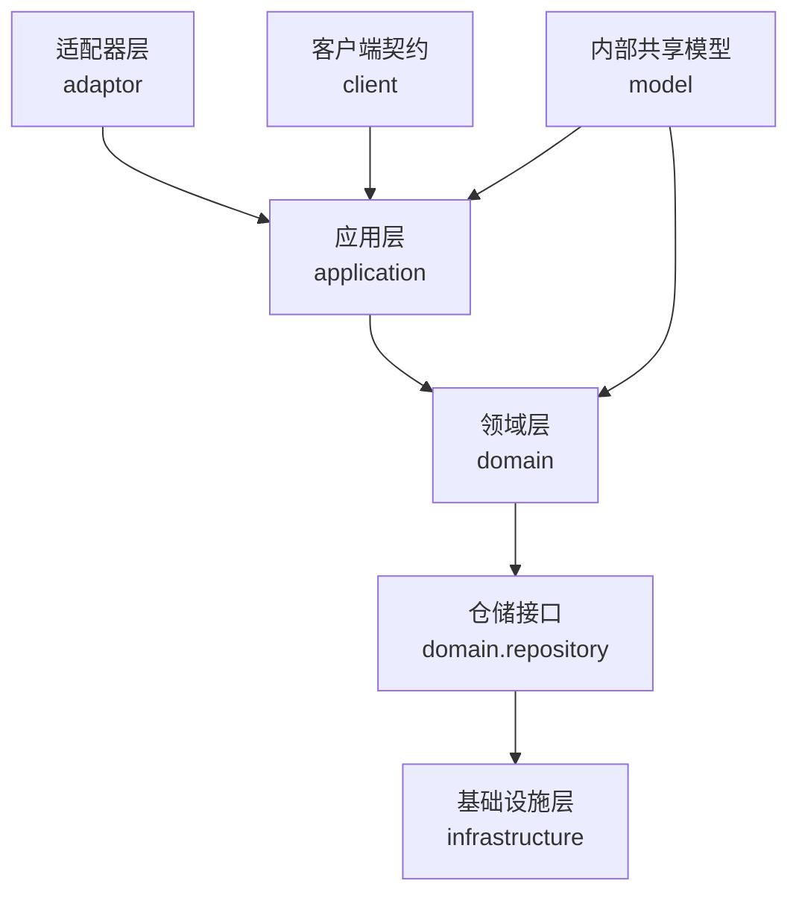
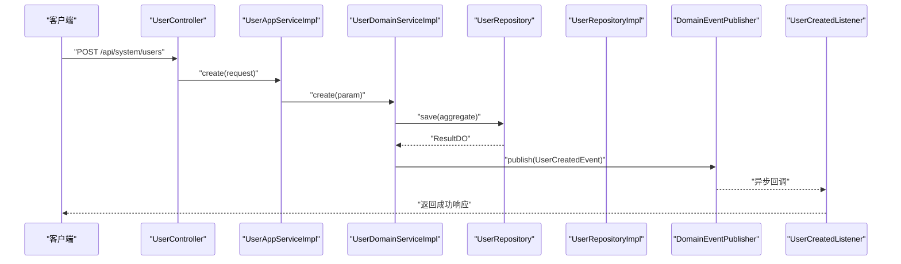
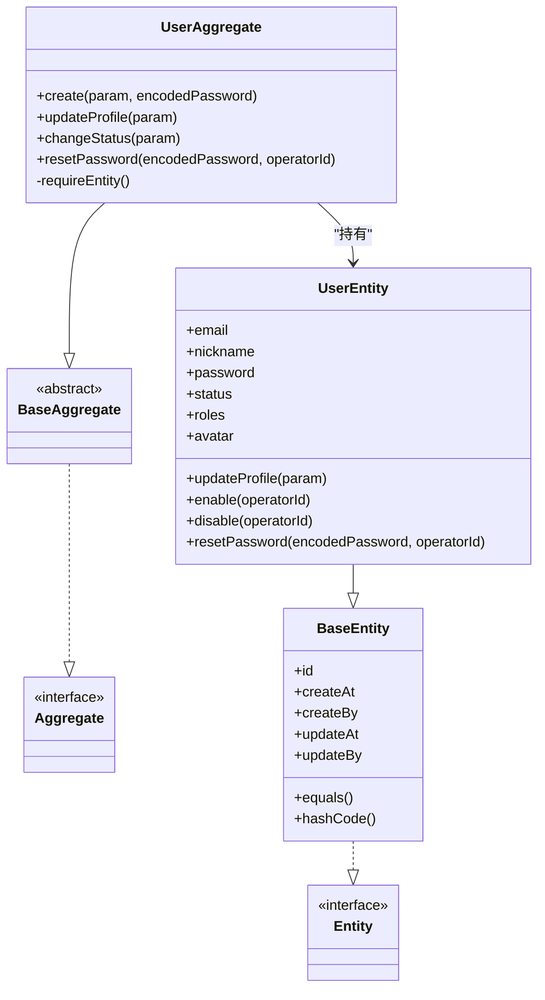
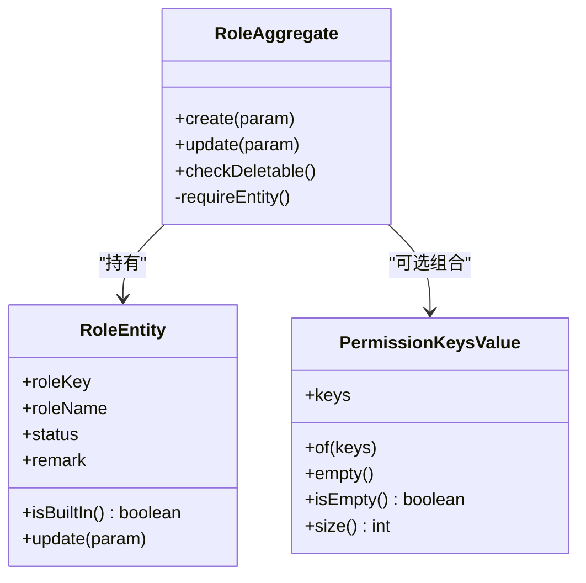
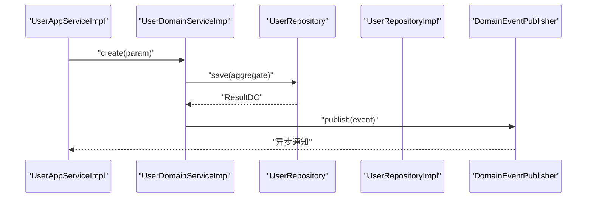
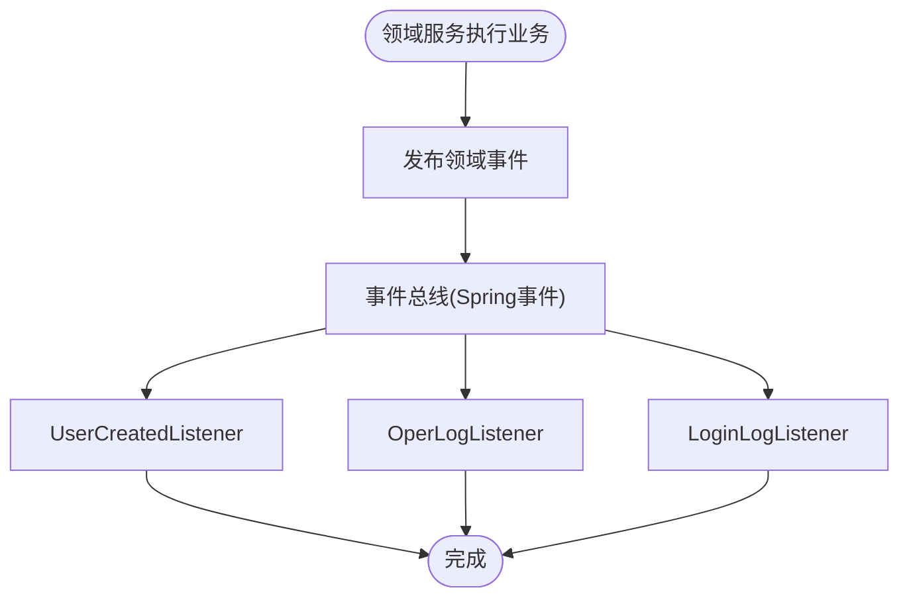
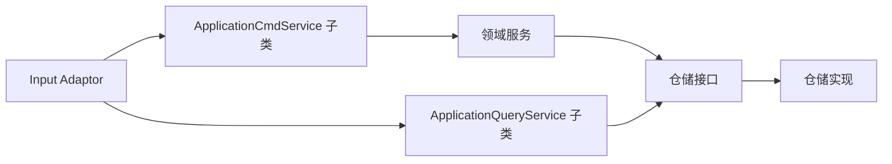
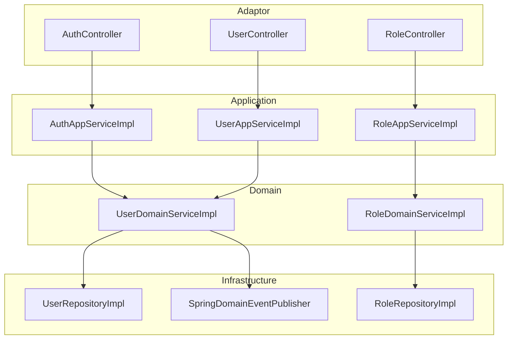

# DDD领域驱动设计实践

<cite>
**本文引用的文件**   
- [README.md](file://README.md)
- [docs/rule/ddd/README.md](file://docs/rule/ddd/README.md)
- [docs/rule/ddd/ddd-adaptor-layer.md](file://docs/rule/ddd/ddd-adaptor-layer.md)
- [docs/rule/ddd/ddd-model-layer.md](file://docs/rule/ddd/ddd-model-layer.md)
- [UserAggregate.java](file://src/main/java/com/sunnao/spring/ddd/template/domain/system/user/model/aggregate/UserAggregate.java)
- [UserEntity.java](file://src/main/java/com/sunnao/spring/ddd/template/domain/system/user/model/entity/UserEntity.java)
- [RoleAggregate.java](file://src/main/java/com/sunnao/spring/ddd/template/domain/system/role/model/aggregate/RoleAggregate.java)
- [RoleEntity.java](file://src/main/java/com/sunnao/spring/ddd/template/domain/system/role/model/entity/RoleEntity.java)
- [PermissionKeysValue.java](file://src/main/java/com/sunnao/spring/ddd/template/domain/system/role/model/value/PermissionKeysValue.java)
- [BaseAggregate.java](file://src/main/java/com/sunnao/spring/ddd/template/common/model/BaseAggregate.java)
- [BaseEntity.java](file://src/main/java/com/sunnao/spring/ddd/template/common/model/BaseEntity.java)
- [Aggregate.java](file://src/main/java/com/sunnao/spring/ddd/template/common/model/Aggregate.java)
- [Entity.java](file://src/main/java/com/sunnao/spring/ddd/template/common/model/Entity.java)
- [DomainEventPublisher.java](file://src/main/java/com/sunnao/spring/ddd/template/common/event/DomainEventPublisher.java)
- [SpringDomainEventPublisher.java](file://src/main/java/com/sunnao/spring/ddd/template/infrastructure/common/SpringDomainEventPublisher.java)
- [UserCreatedListener.java](file://src/main/java/com/sunnao/spring/ddd/template/application/system/user/listener/UserCreatedListener.java)
- [OperLogListener.java](file://src/main/java/com/sunnao/spring/ddd/template/application/system/log/listener/OperLogListener.java)
- [LoginLogListener.java](file://src/main/java/com/sunnao/spring/ddd/template/application/system/log/listener/LoginLogListener.java)
- [AuthAppServiceImpl.java](file://src/main/java/com/sunnao/spring/ddd/template/application/auth/scenario/AuthAppServiceImpl.java)
- [UserAppServiceImpl.java](file://src/main/java/com/sunnao/spring/ddd/template/application/system/user/scenario/UserAppServiceImpl.java)
- [RoleAppServiceImpl.java](file://src/main/java/com/sunnao/spring/ddd/template/application/system/role/scenario/RoleAppServiceImpl.java)
- [UserDomainService.java](file://src/main/java/com/sunnao/spring/ddd/template/domain/system/user/service/UserDomainService.java)
- [UserDomainServiceImpl.java](file://src/main/java/com/sunnao/spring/ddd/template/domain/system/user/service/UserDomainServiceImpl.java)
- [RoleDomainService.java](file://src/main/java/com/sunnao/spring/ddd/template/domain/system/role/service/RoleDomainService.java)
- [RoleDomainServiceImpl.java](file://src/main/java/com/sunnao/spring/ddd/template/domain/system/role/service/RoleDomainServiceImpl.java)
- [UserRepository.java](file://src/main/java/com/sunnao/spring/ddd/template/domain/system/user/repository/UserRepository.java)
- [RoleRepository.java](file://src/main/java/com/sunnao/spring/ddd/template/domain/system/role/repository/RoleRepository.java)
- [UserRepositoryImpl.java](file://src/main/java/com/sunnao/spring/ddd/template/infrastructure/system/user/repository/UserRepositoryImpl.java)
- [RoleRepositoryImpl.java](file://src/main/java/com/sunnao/spring/ddd/template/infrastructure/system/role/repository/RoleRepositoryImpl.java)
- [UserController.java](file://src/main/java/com/sunnao/spring/ddd/template/adaptor/system/user/input/UserController.java)
- [RoleController.java](file://src/main/java/com/sunnao/spring/ddd/template/adaptor/system/role/input/RoleController.java)
- [AuthController.java](file://src/main/java/com/sunnao/spring/ddd/template/adaptor/auth/input/AuthController.java)
- [ApplicationCmdService.java](file://src/main/java/com/sunnao/spring/ddd/template/common/service/ApplicationCmdService.java)
- [ApplicationQueryService.java](file://src/main/java/com/sunnao/spring/ddd/template/common/service/ApplicationQueryService.java)
- [DomainService.java](file://src/main/java/com/sunnao/spring/ddd/template/common/service/DomainService.java)
- [AggregateRepository.java](file://src/main/java/com/sunnao/spring/ddd/template/common/model/AggregateRepository.java)
- [Repository.java](file://src/main/java/com/sunnao/spring/ddd/template/common/model/Repository.java)
</cite>

## 目录
1. [引言](#引言)
2. [项目结构](#项目结构)
3. [核心组件](#核心组件)
4. [架构总览](#架构总览)
5. [详细组件分析](#详细组件分析)
6. [依赖分析](#依赖分析)
7. [性能考虑](#性能考虑)
8. [故障排查指南](#故障排查指南)
9. [结论](#结论)
10. [附录](#附录)

## 引言
本文件面向希望落地领域驱动设计（DDD）的工程团队，结合仓库中的用户与角色模块，系统阐述聚合根、实体、值对象、领域服务的设计与实现；解释聚合边界划分原则与高内聚业务概念识别方法；给出领域事件发布/订阅/处理机制；说明CQRS在应用层与仓储层的体现；并总结四种开发模式（写模式、读模式、纯计算模式、规则+计算模式）的应用场景与实践要点。文档以“可操作”为目标，提供代码级图示与路径引用，帮助读者快速将理论转化为工程实践。

## 项目结构
本项目遵循六边形架构与分层规范：adaptor → application → domain → repository接口（infrastructure实现），同时通过client定义对外契约，model承载内部共享模型。

图表来源
- [README.md:19-36](file://README.md#L19-L36)
- [docs/rule/ddd/README.md:50-81](file://docs/rule/ddd/README.md#L50-L81)

章节来源
- [README.md:19-36](file://README.md#L19-L36)
- [docs/rule/ddd/README.md:1-91](file://docs/rule/ddd/README.md#L1-91)

## 核心组件
- 聚合根与实体
  - 聚合根负责封装业务不变量与状态变更入口，外部仅能通过其公开方法访问内部实体。
  - 实体承载属性与细粒度行为，由聚合根持有并通过受控方法暴露。
- 值对象
  - 不可变数据载体，用于表达具有明确边界的业务概念，避免裸集合散落。
- 领域服务
  - 编排跨聚合或无状态的业务流程，协调锁、聚合根、仓储与事件。
- 仓储接口与实现
  - 领域层只声明仓储接口；基础设施层完成PO转换与持久化细节。
- 应用服务
  - 场景编排、DTO/Param转换、调用领域服务与仓储，不承载业务规则。
- 适配器层
  - Input Adaptor接收请求并调用应用服务；Output Adaptor隔离外部技术细节。

章节来源
- [UserAggregate.java:1-113](file://src/main/java/com/sunnao/spring/ddd/template/domain/system/user/model/aggregate/UserAggregate.java#L1-L113)
- [UserEntity.java:1-119](file://src/main/java/com/sunnao/spring/ddd/template/domain/system/user/model/entity/UserEntity.java#L1-L119)
- [RoleAggregate.java:1-102](file://src/main/java/com/sunnao/spring/ddd/template/domain/system/role/model/aggregate/RoleAggregate.java#L1-L102)
- [RoleEntity.java:1-84](file://src/main/java/com/sunnao/spring/ddd/template/domain/system/role/model/entity/RoleEntity.java#L1-L84)
- [PermissionKeysValue.java:1-43](file://src/main/java/com/sunnao/spring/ddd/template/domain/system/role/model/value/PermissionKeysValue.java#L1-L43)
- [BaseAggregate.java:1-5](file://src/main/java/com/sunnao/spring/ddd/template/common/model/BaseAggregate.java#L1-L5)
- [BaseEntity.java:1-44](file://src/main/java/com/sunnao/spring/ddd/template/common/model/BaseEntity.java#L1-L44)
- [Aggregate.java:1-4](file://src/main/java/com/sunnao/spring/ddd/template/common/model/Aggregate.java#L1-L4)
- [Entity.java:1-4](file://src/main/java/com/sunnao/spring/ddd/template/common/model/Entity.java#L1-L4)

## 架构总览
下图展示一次典型的用户创建写操作流程，体现CQRS的写路径与事件发布：

图表来源
- [UserController.java](file://src/main/java/com/sunnao/spring/ddd/template/adaptor/system/user/input/UserController.java)
- [UserAppServiceImpl.java](file://src/main/java/com/sunnao/spring/ddd/template/application/system/user/scenario/UserAppServiceImpl.java)
- [UserDomainServiceImpl.java](file://src/main/java/com/sunnao/spring/ddd/template/domain/system/user/service/UserDomainServiceImpl.java)
- [UserRepository.java](file://src/main/java/com/sunnao/spring/ddd/template/domain/system/user/repository/UserRepository.java)
- [UserRepositoryImpl.java](file://src/main/java/com/sunnao/spring/ddd/template/infrastructure/system/user/repository/UserRepositoryImpl.java)
- [DomainEventPublisher.java](file://src/main/java/com/sunnao/spring/ddd/template/common/event/DomainEventPublisher.java)
- [UserCreatedListener.java](file://src/main/java/com/sunnao/spring/ddd/template/application/system/user/listener/UserCreatedListener.java)

## 详细组件分析

### 聚合根与实体：UserAggregate 与 UserEntity
- 职责边界
  - UserAggregate 作为聚合根，提供 create/updateProfile/changeStatus/resetPassword 等受控入口，确保状态变更符合业务不变量。
  - UserEntity 承载用户属性与细粒度行为（启用/禁用、重置密码、资料更新）。
- 不变性保护
  - 通过 requireEntity 前置校验，防止空实体调用。
  - 状态变更方法中检查当前状态，避免非法流转。
- 复杂度与性能
  - 聚合根方法多为 O(1) 校验与赋值；复杂逻辑下沉到实体方法，保持聚合根简洁。
- 错误处理
  - 使用统一异常类型抛出参数/状态错误，便于上层捕获并转换为 ResultDO。

图表来源
- [BaseAggregate.java:1-5](file://src/main/java/com/sunnao/spring/ddd/template/common/model/BaseAggregate.java#L1-L5)
- [Aggregate.java:1-4](file://src/main/java/com/sunnao/spring/ddd/template/common/model/Aggregate.java#L1-L4)
- [BaseEntity.java:1-44](file://src/main/java/com/sunnao/spring/ddd/template/common/model/BaseEntity.java#L1-L44)
- [Entity.java:1-4](file://src/main/java/com/sunnao/spring/ddd/template/common/model/Entity.java#L1-L4)
- [UserAggregate.java:1-113](file://src/main/java/com/sunnao/spring/ddd/template/domain/system/user/model/aggregate/UserAggregate.java#L1-L113)
- [UserEntity.java:1-119](file://src/main/java/com/sunnao/spring/ddd/template/domain/system/user/model/entity/UserEntity.java#L1-L119)

章节来源
- [UserAggregate.java:1-113](file://src/main/java/com/sunnao/spring/ddd/template/domain/system/user/model/aggregate/UserAggregate.java#L1-L113)
- [UserEntity.java:1-119](file://src/main/java/com/sunnao/spring/ddd/template/domain/system/user/model/entity/UserEntity.java#L1-L119)

### 聚合根与实体：RoleAggregate 与 RoleEntity
- 职责边界
  - RoleAggregate 提供 create/update/checkDeletable 等方法，维护角色创建与删除约束。
  - RoleEntity 管理角色属性与内置角色保护逻辑（如 admin 不可禁用）。
- 值对象：PermissionKeysValue
  - 封装权限 key 集合，保证不可变性与空安全，避免裸集合散落在领域模型中。
- 不变性保护
  - checkDeletable 阻止删除内置角色；update 限制 roleKey 不可变更并校验管理员角色禁用策略。

图表来源
- [RoleAggregate.java:1-102](file://src/main/java/com/sunnao/spring/ddd/template/domain/system/role/model/aggregate/RoleAggregate.java#L1-L102)
- [RoleEntity.java:1-84](file://src/main/java/com/sunnao/spring/ddd/template/domain/system/role/model/entity/RoleEntity.java#L1-L84)
- [PermissionKeysValue.java:1-43](file://src/main/java/com/sunnao/spring/ddd/template/domain/system/role/model/value/PermissionKeysValue.java#L1-L43)

章节来源
- [RoleAggregate.java:1-102](file://src/main/java/com/sunnao/spring/ddd/template/domain/system/role/model/aggregate/RoleAggregate.java#L1-L102)
- [RoleEntity.java:1-84](file://src/main/java/com/sunnao/spring/ddd/template/domain/system/role/model/entity/RoleEntity.java#L1-L84)
- [PermissionKeysValue.java:1-43](file://src/main/java/com/sunnao/spring/ddd/template/domain/system/role/model/value/PermissionKeysValue.java#L1-L43)

### 领域服务与仓储：UserDomainService 与 UserRepository
- 领域服务
  - UserDomainServiceImpl 编排写流程：构建/加载聚合根、执行业务方法、持久化、发布领域事件。
- 仓储接口与实现
  - UserRepository 继承通用聚合仓储接口，声明 save/findById 等能力；UserRepositoryImpl 完成 PO 转换与数据库写入。
- CQRS体现
  - 写路径：应用服务 → 领域服务 → 仓储保存；读路径：应用查询服务 → 仓储直接查询（见各 QueryAppService）。

图表来源
- [UserDomainServiceImpl.java](file://src/main/java/com/sunnao/spring/ddd/template/domain/system/user/service/UserDomainServiceImpl.java)
- [UserRepository.java](file://src/main/java/com/sunnao/spring/ddd/template/domain/system/user/repository/UserRepository.java)
- [UserRepositoryImpl.java](file://src/main/java/com/sunnao/spring/ddd/template/infrastructure/system/user/repository/UserRepositoryImpl.java)
- [DomainEventPublisher.java](file://src/main/java/com/sunnao/spring/ddd/template/common/event/DomainEventPublisher.java)

章节来源
- [UserDomainService.java](file://src/main/java/com/sunnao/spring/ddd/template/domain/system/user/service/UserDomainService.java)
- [UserDomainServiceImpl.java](file://src/main/java/com/sunnao/spring/ddd/template/domain/system/user/service/UserDomainServiceImpl.java)
- [UserRepository.java](file://src/main/java/com/sunnao/spring/ddd/template/domain/system/user/repository/UserRepository.java)
- [UserRepositoryImpl.java](file://src/main/java/com/sunnao/spring/ddd/template/infrastructure/system/user/repository/UserRepositoryImpl.java)

### 领域事件：发布、订阅与处理
- 发布
  - 领域服务通过 DomainEventPublisher 发布领域事件（如用户创建后触发后续动作）。
- 订阅
  - 应用层监听器（UserCreatedListener、OperLogListener、LoginLogListener）异步消费事件，执行审计、日志记录等副作用。
- 基础设施实现
  - SpringDomainEventPublisher 基于 Spring 事件机制实现，支持 @Async 监听器。

图表来源
- [DomainEventPublisher.java](file://src/main/java/com/sunnao/spring/ddd/template/common/event/DomainEventPublisher.java)
- [SpringDomainEventPublisher.java](file://src/main/java/com/sunnao/spring/ddd/template/infrastructure/common/SpringDomainEventPublisher.java)
- [UserCreatedListener.java](file://src/main/java/com/sunnao/spring/ddd/template/application/system/user/listener/UserCreatedListener.java)
- [OperLogListener.java](file://src/main/java/com/sunnao/spring/ddd/template/application/system/log/listener/OperLogListener.java)
- [LoginLogListener.java](file://src/main/java/com/sunnao/spring/ddd/template/application/system/log/listener/LoginLogListener.java)

章节来源
- [DomainEventPublisher.java](file://src/main/java/com/sunnao/spring/ddd/template/common/event/DomainEventPublisher.java)
- [SpringDomainEventPublisher.java](file://src/main/java/com/sunnao/spring/ddd/template/infrastructure/common/SpringDomainEventPublisher.java)
- [UserCreatedListener.java](file://src/main/java/com/sunnao/spring/ddd/template/application/system/user/listener/UserCreatedListener.java)
- [OperLogListener.java](file://src/main/java/com/sunnao/spring/ddd/template/application/system/log/listener/OperLogListener.java)
- [LoginLogListener.java](file://src/main/java/com/sunnao/spring/ddd/template/application/system/log/listener/LoginLogListener.java)

### CQRS 模式在本项目的体现
- 命令（写）路径
  - Input Adaptor → ApplicationCmdService 子类（如 UserAppServiceImpl）→ 领域服务 → 仓储保存。
- 查询（读）路径
  - Input Adaptor → ApplicationQueryService 子类（如各 QueryAppServiceImpl）→ 仓储直接查询。
- 接口约定
  - ApplicationCmdService 与 ApplicationQueryService 抽象了命令与查询两类应用服务基类，清晰区分读写语义。

图表来源
- [ApplicationCmdService.java](file://src/main/java/com/sunnao/spring/ddd/template/common/service/ApplicationCmdService.java)
- [ApplicationQueryService.java](file://src/main/java/com/sunnao/spring/ddd/template/common/service/ApplicationQueryService.java)
- [UserAppServiceImpl.java](file://src/main/java/com/sunnao/spring/ddd/template/application/system/user/scenario/UserAppServiceImpl.java)
- [UserRepository.java](file://src/main/java/com/sunnao/spring/ddd/template/domain/system/user/repository/UserRepository.java)
- [UserRepositoryImpl.java](file://src/main/java/com/sunnao/spring/ddd/template/infrastructure/system/user/repository/UserRepositoryImpl.java)

章节来源
- [ApplicationCmdService.java](file://src/main/java/com/sunnao/spring/ddd/template/common/service/ApplicationCmdService.java)
- [ApplicationQueryService.java](file://src/main/java/com/sunnao/spring/ddd/template/common/service/ApplicationQueryService.java)
- [UserAppServiceImpl.java](file://src/main/java/com/sunnao/spring/ddd/template/application/system/user/scenario/UserAppServiceImpl.java)

### 四种开发模式与应用场景
- 写模式
  - 适用：订单创建、状态变更等需要修改聚合根状态的流程。
  - 关键点：领域服务先加锁（buildLock/tryLock），再加载/构建聚合根，执行业务方法，最后持久化并释放锁。
- 读模式
  - 适用：列表/详情查询，聚合根仅作为数据载体，不修改状态。
  - 关键点：应用查询服务直接走仓储查询，必要时通过 Output Adaptor 获取外部数据。
- 纯计算模式
  - 适用：费用计算、视图渲染等无状态计算。
  - 关键点：DomainService 承载计算逻辑，无需聚合根。
- 规则+计算模式
  - 适用：补贴匹配、费率计算等需读取规则并计算的场景。
  - 关键点：从仓储加载规则聚合根，调用 matchRule/calculate 完成计算。

章节来源
- [docs/rule/ddd/README.md:83-91](file://docs/rule/ddd/README.md#L83-L91)
- [docs/rule/ddd/ddd-adaptor-layer.md:143-162](file://docs/rule/ddd/ddd-adaptor-layer.md#L143-L162)
- [docs/rule/ddd/ddd-adaptor-layer.md:165-188](file://docs/rule/ddd/ddd-adaptor-layer.md#L165-L188)
- [docs/rule/ddd/ddd-adaptor-layer.md:277-293](file://docs/rule/ddd/ddd-adaptor-layer.md#L277-L293)
- [docs/rule/ddd/ddd-adaptor-layer.md:379-396](file://docs/rule/ddd/ddd-adaptor-layer.md#L379-L396)

### 聚合边界划分与高内聚识别
- 划分原则
  - 围绕不变量与一致性边界组织聚合，避免跨聚合强一致事务。
  - 将频繁共同变更的概念放入同一聚合，减少跨聚合调用。
- 高内聚识别
  - 观察业务用例：若多个属性与方法总是被一起修改，应归入同一聚合。
  - 示例：用户信息（邮箱、昵称、头像、状态）与状态机逻辑集中在 UserAggregate/UserEntity；角色标识、名称、状态与内置保护集中在 RoleAggregate/RoleEntity。
- 反模式规避
  - 避免将查询侧填充的跨域数据（如 roles）当作领域不变量的一部分；仅在查询时按需装配。

章节来源
- [UserAggregate.java:1-113](file://src/main/java/com/sunnao/spring/ddd/template/domain/system/user/model/aggregate/UserAggregate.java#L1-L113)
- [UserEntity.java:1-119](file://src/main/java/com/sunnao/spring/ddd/template/domain/system/user/model/entity/UserEntity.java#L1-L119)
- [RoleAggregate.java:1-102](file://src/main/java/com/sunnao/spring/ddd/template/domain/system/role/model/aggregate/RoleAggregate.java#L1-L102)
- [RoleEntity.java:1-84](file://src/main/java/com/sunnao/spring/ddd/template/domain/system/role/model/entity/RoleEntity.java#L1-L84)

### 常见陷阱与最佳实践
- 陷阱
  - 在聚合根中直接暴露实体 getter 供外部修改，破坏不变量。
  - 在应用层编写业务规则，导致领域贫血。
  - 跨聚合强耦合，造成事务边界模糊。
- 最佳实践
  - 聚合根仅提供受控方法，实体私有化或通过聚合根访问。
  - 应用层只做编排与转换，领域层承载规则。
  - 使用仓储接口解耦持久化，基础设施层实现具体存储。
  - 领域事件用于副作用（审计、通知），避免在事件中承载主业务流程。

章节来源
- [UserAggregate.java:1-113](file://src/main/java/com/sunnao/spring/ddd/template/domain/system/user/model/aggregate/UserAggregate.java#L1-L113)
- [RoleAggregate.java:1-102](file://src/main/java/com/sunnao/spring/ddd/template/domain/system/role/model/aggregate/RoleAggregate.java#L1-L102)
- [docs/rule/ddd/ddd-adaptor-layer.md:36-52](file://docs/rule/ddd/ddd-adaptor-layer.md#L36-L52)

## 依赖分析
- 组件耦合
  - adaptor 依赖 client 定义的 AppService 接口；application 实现这些接口并依赖 domain 与 infrastructure。
  - domain 仅依赖 common 基础模型与枚举，不依赖基础设施。
- 直接/间接依赖
  - 写流程：adaptor → application → domain → repository接口 → infrastructure实现。
  - 事件流：domain → common.event → infrastructure.common → application.listener。
- 外部依赖
  - Sa-Token、MyBatis-Flex、Redis、PostgreSQL 等通过基础设施层注入。

图表来源
- [AuthController.java](file://src/main/java/com/sunnao/spring/ddd/template/adaptor/auth/input/AuthController.java)
- [UserController.java](file://src/main/java/com/sunnao/spring/ddd/template/adaptor/system/user/input/UserController.java)
- [RoleController.java](file://src/main/java/com/sunnao/spring/ddd/template/adaptor/system/role/input/RoleController.java)
- [AuthAppServiceImpl.java](file://src/main/java/com/sunnao/spring/ddd/template/application/auth/scenario/AuthAppServiceImpl.java)
- [UserAppServiceImpl.java](file://src/main/java/com/sunnao/spring/ddd/template/application/system/user/scenario/UserAppServiceImpl.java)
- [RoleAppServiceImpl.java](file://src/main/java/com/sunnao/spring/ddd/template/application/system/role/scenario/RoleAppServiceImpl.java)
- [UserDomainServiceImpl.java](file://src/main/java/com/sunnao/spring/ddd/template/domain/system/user/service/UserDomainServiceImpl.java)
- [RoleDomainServiceImpl.java](file://src/main/java/com/sunnao/spring/ddd/template/domain/system/role/service/RoleDomainServiceImpl.java)
- [UserRepositoryImpl.java](file://src/main/java/com/sunnao/spring/ddd/template/infrastructure/system/user/repository/UserRepositoryImpl.java)
- [RoleRepositoryImpl.java](file://src/main/java/com/sunnao/spring/ddd/template/infrastructure/system/role/repository/RoleRepositoryImpl.java)
- [SpringDomainEventPublisher.java](file://src/main/java/com/sunnao/spring/ddd/template/infrastructure/common/SpringDomainEventPublisher.java)

章节来源
- [README.md:19-36](file://README.md#L19-L36)
- [docs/rule/ddd/README.md:50-81](file://docs/rule/ddd/README.md#L50-L81)

## 性能考虑
- 写路径优化
  - 合理使用分布式锁（RedisLevelLock/JvmLevelLock）避免并发冲突；尽量缩小锁粒度。
  - 批量操作与分页查询降低数据库压力。
- 读路径优化
  - 查询侧按需装配跨域数据，避免过度 JOIN；对热点字典数据使用缓存（如 Redis）。
- 事件处理
  - 领域事件异步处理，避免阻塞主流程；注意幂等与重试策略。

[本节为通用指导，不直接分析具体文件]

## 故障排查指南
- 常见问题定位
  - 参数校验失败：检查聚合根/实体的参数校验与错误码映射。
  - 状态流转异常：确认当前状态与目标状态是否合法。
  - 事件未触发：检查事件发布与监听器注册是否正确。
- 建议步骤
  - 查看全局异常处理器与 ResultDO 返回码。
  - 开启 traceId 链路追踪，定位跨层调用问题。
  - 针对集成测试环境，确认数据库与 Redis 连接配置。

章节来源
- [README.md:119-128](file://README.md#L119-L128)

## 结论
本实践以用户与角色模块为例，展示了如何在工程中落地 DDD：通过聚合根与实体封装不变量与状态变更，值对象表达不可变概念，领域服务编排流程，仓储接口解耦持久化，应用层实现 CQRS 读写分离，适配器层隔离外部技术细节。配合领域事件与四种开发模式，可在复杂业务中保持清晰的边界与高内聚。

[本节为总结，不直接分析具体文件]

## 附录
- 参考规范
  - 六边形架构与分层规范、四种开发模式、Adaptor 层规范、Model 层规范等详见 docs/rule/ddd 目录。
- 快速开始
  - 启动依赖、运行应用、访问 Swagger 文档与种子账号信息参见 README。

章节来源
- [docs/rule/ddd/README.md:1-91](file://docs/rule/ddd/README.md#L1-91)
- [docs/rule/ddd/ddd-adaptor-layer.md:1-479](file://docs/rule/ddd/ddd-adaptor-layer.md#L1-L479)
- [docs/rule/ddd/ddd-model-layer.md:1-97](file://docs/rule/ddd/ddd-model-layer.md#L1-L97)
- [README.md:47-95](file://README.md#L47-L95)