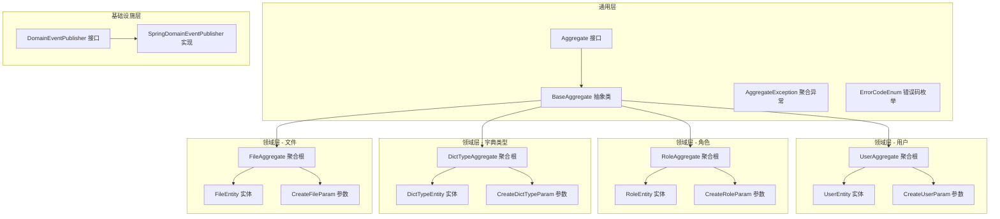
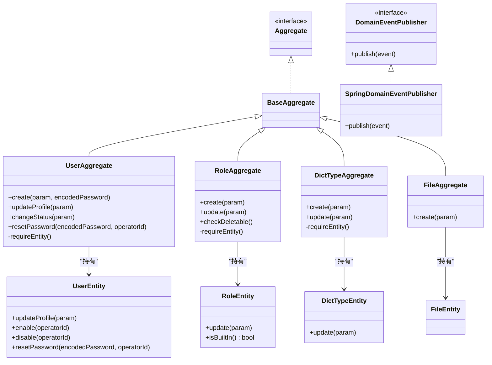
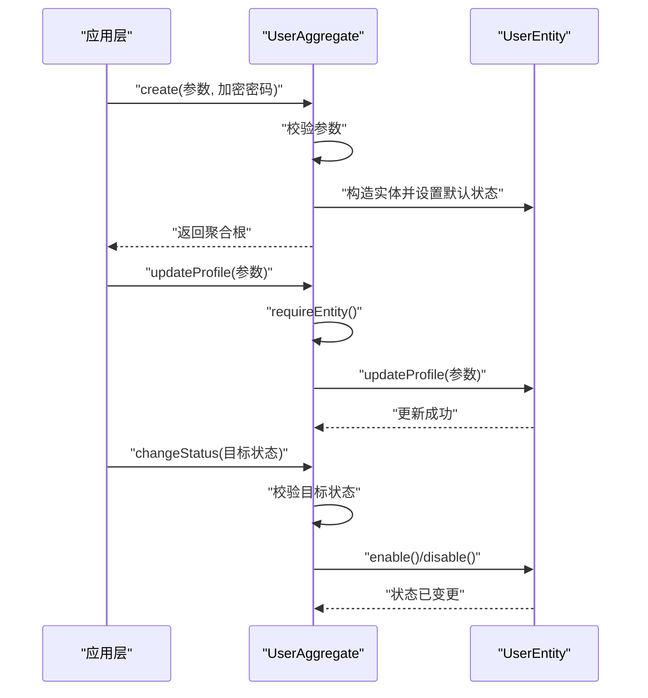
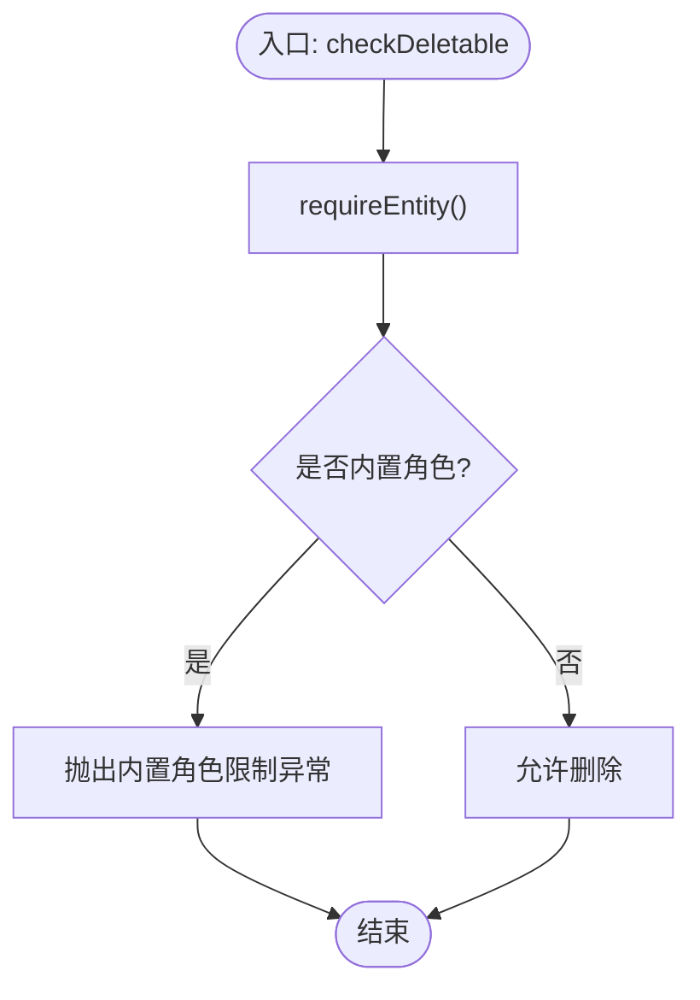
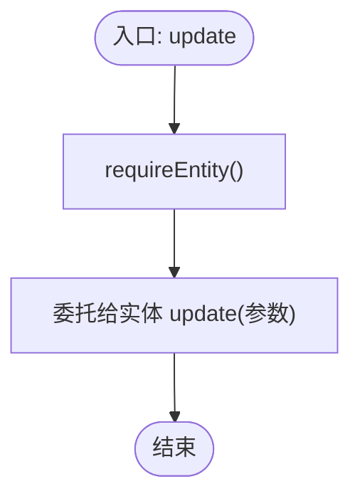
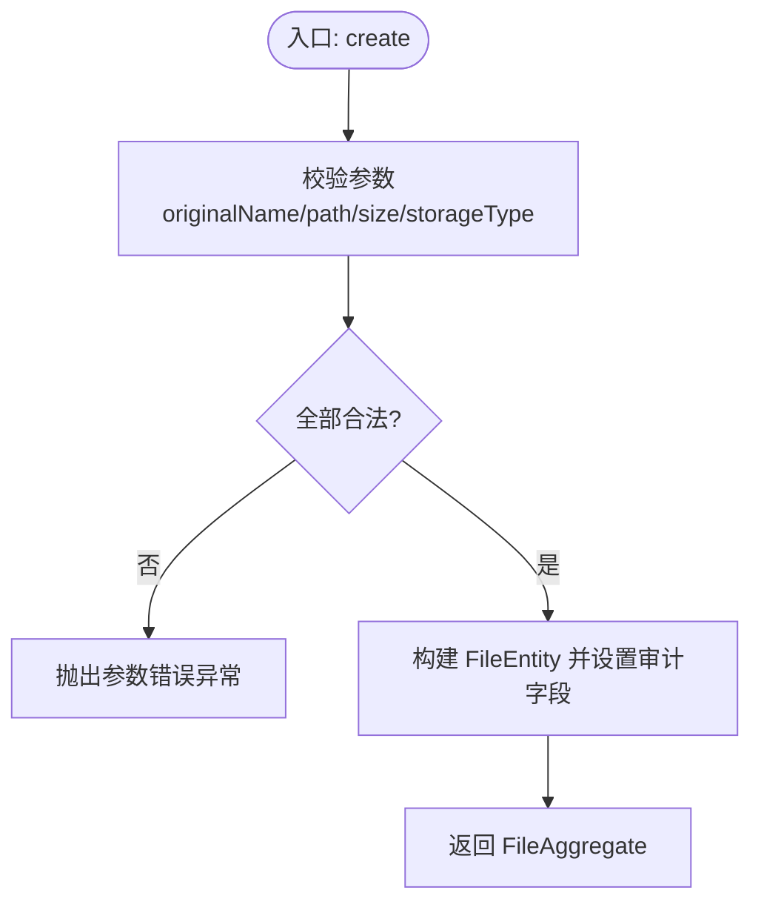
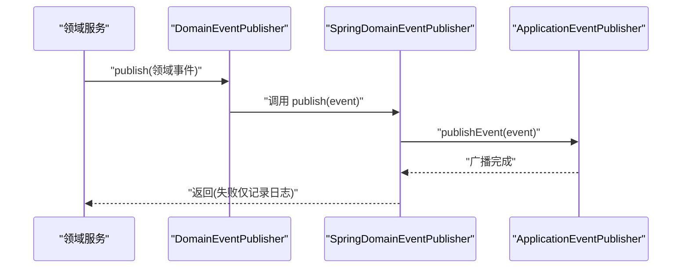
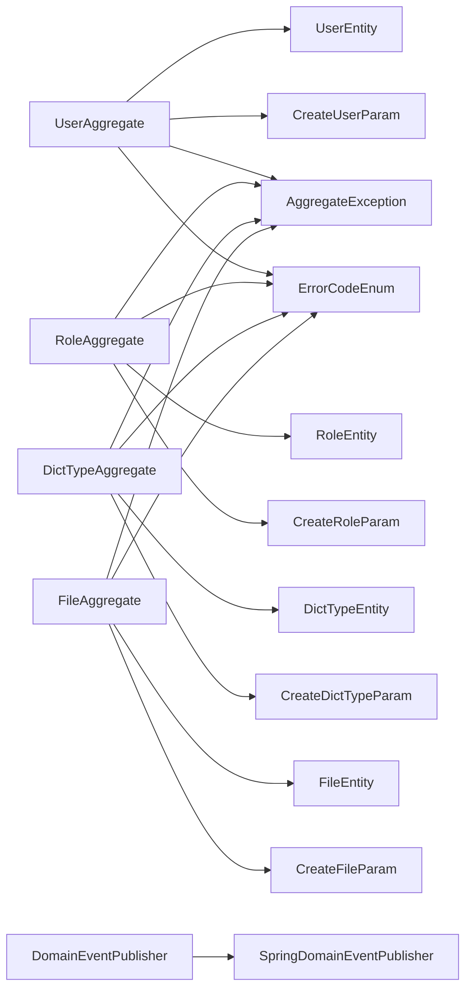

# 聚合设计模式

<cite>
**本文引用的文件**   
- [UserAggregate.java](file://src/main/java/com/sunnao/spring/ddd/template/domain/system/user/model/aggregate/UserAggregate.java)
- [RoleAggregate.java](file://src/main/java/com/sunnao/spring/ddd/template/domain/system/role/model/aggregate/RoleAggregate.java)
- [DictTypeAggregate.java](file://src/main/java/com/sunnao/spring/ddd/template/domain/system/dict/model/aggregate/DictTypeAggregate.java)
- [FileAggregate.java](file://src/main/java/com/sunnao/spring/ddd/template/domain/system/file/model/aggregate/FileAggregate.java)
- [BaseAggregate.java](file://src/main/java/com/sunnao/spring/ddd/template/common/model/BaseAggregate.java)
- [Aggregate.java](file://src/main/java/com/sunnao/spring/ddd/template/common/model/Aggregate.java)
- [UserEntity.java](file://src/main/java/com/sunnao/spring/ddd/template/domain/system/user/model/entity/UserEntity.java)
- [RoleEntity.java](file://src/main/java/com/sunnao/spring/ddd/template/domain/system/role/model/entity/RoleEntity.java)
- [DictTypeEntity.java](file://src/main/java/com/sunnao/spring/ddd/template/domain/system/dict/model/entity/DictTypeEntity.java)
- [FileEntity.java](file://src/main/java/com/sunnao/spring/ddd/template/domain/system/file/model/entity/FileEntity.java)
- [CreateUserParam.java](file://src/main/java/com/sunnao/spring/ddd/template/domain/system/user/model/param/CreateUserParam.java)
- [CreateRoleParam.java](file://src/main/java/com/sunnao/spring/ddd/template/domain/system/role/model/param/CreateRoleParam.java)
- [CreateDictTypeParam.java](file://src/main/java/com/sunnao/spring/ddd/template/domain/system/dict/model/param/CreateDictTypeParam.java)
- [CreateFileParam.java](file://src/main/java/com/sunnao/spring/ddd/template/domain/system/file/model/param/CreateFileParam.java)
- [DomainEventPublisher.java](file://src/main/java/com/sunnao/spring/ddd/template/common/event/DomainEventPublisher.java)
- [SpringDomainEventPublisher.java](file://src/main/java/com/sunnao/spring/ddd/template/infrastructure/common/SpringDomainEventPublisher.java)
- [AggregateException.java](file://src/main/java/com/sunnao/spring/ddd/template/common/exception/AggregateException.java)
- [ErrorCodeEnum.java](file://src/main/java/com/sunnao/spring/ddd/template/common/result/ErrorCodeEnum.java)
</cite>

## 目录
1. [简介](#简介)
2. [项目结构](#项目结构)
3. [核心组件](#核心组件)
4. [架构总览](#架构总览)
5. [详细组件分析](#详细组件分析)
6. [依赖关系分析](#依赖关系分析)
7. [性能考虑](#性能考虑)
8. [故障排查指南](#故障排查指南)
9. [结论](#结论)
10. [附录](#附录)

## 简介
本技术文档围绕“聚合设计模式”在该仓库中的落地实践，聚焦以下聚合根的实现与协作：用户、角色、字典类型、文件。文档从封装原则、不变性保护、状态变更管理、边界划分策略、工厂模式、跨聚合通信（事件发布与引用传递）等方面展开，并结合代码级图示说明数据流与控制流，帮助读者在复杂业务中正确组织领域模型与事务一致性。

## 项目结构
该仓库采用分层架构，领域层位于 domain，聚合根与实体集中在各子域 model/aggregate 与 model/entity 下；基础设施层提供事件发布实现；通用能力（异常、错误码、基础模型）集中于 common。

图表来源
- [BaseAggregate.java:1-5](file://src/main/java/com/sunnao/spring/ddd/template/common/model/BaseAggregate.java#L1-L5)
- [Aggregate.java:1-4](file://src/main/java/com/sunnao/spring/ddd/template/common/model/Aggregate.java#L1-L4)
- [UserAggregate.java:1-113](file://src/main/java/com/sunnao/spring/ddd/template/domain/system/user/model/aggregate/UserAggregate.java#L1-L113)
- [RoleAggregate.java:1-102](file://src/main/java/com/sunnao/spring/ddd/template/domain/system/role/model/aggregate/RoleAggregate.java#L1-L102)
- [DictTypeAggregate.java:1-84](file://src/main/java/com/sunnao/spring/ddd/template/domain/system/dict/model/aggregate/DictTypeAggregate.java#L1-L84)
- [FileAggregate.java:1-69](file://src/main/java/com/sunnao/spring/ddd/template/domain/system/file/model/aggregate/FileAggregate.java#L1-L69)
- [UserEntity.java:1-119](file://src/main/java/com/sunnao/spring/ddd/template/domain/system/user/model/entity/UserEntity.java#L1-L119)
- [RoleEntity.java:1-84](file://src/main/java/com/sunnao/spring/ddd/template/domain/system/role/model/entity/RoleEntity.java#L1-L84)
- [DictTypeEntity.java:1-67](file://src/main/java/com/sunnao/spring/ddd/template/domain/system/dict/model/entity/DictTypeEntity.java#L1-L67)
- [FileEntity.java:1-43](file://src/main/java/com/sunnao/spring/ddd/template/domain/system/file/model/entity/FileEntity.java#L1-L43)
- [DomainEventPublisher.java:1-20](file://src/main/java/com/sunnao/spring/ddd/template/common/event/DomainEventPublisher.java#L1-L20)
- [SpringDomainEventPublisher.java:1-35](file://src/main/java/com/sunnao/spring/ddd/template/infrastructure/common/SpringDomainEventPublisher.java#L1-L35)

章节来源
- [BaseAggregate.java:1-5](file://src/main/java/com/sunnao/spring/ddd/template/common/model/BaseAggregate.java#L1-L5)
- [Aggregate.java:1-4](file://src/main/java/com/sunnao/spring/ddd/template/common/model/Aggregate.java#L1-L4)

## 核心组件
- 聚合根基座
  - Aggregate 接口与 BaseAggregate 抽象类为所有聚合根提供统一契约与扩展点。
- 聚合根与实体
  - UserAggregate 持有 UserEntity，对外暴露 create/updateProfile/changeStatus/resetPassword 等语义化方法，内部通过 requireEntity 保证实体存在性。
  - RoleAggregate 持有 RoleEntity 与权限键值对象，提供 create/update/checkDeletable，内置角色保护逻辑由聚合根与实体共同保障。
  - DictTypeAggregate 持有 DictTypeEntity，提供 create/update，对 typeKey 进行正则校验。
  - FileAggregate 仅登记文件元数据，物理内容交由应用层存储抽象处理。
- 参数对象
  - CreateUserParam、CreateRoleParam、CreateDictTypeParam、CreateFileParam 作为输入载体，携带 operatorId 用于审计追踪。
- 异常与错误码
  - AggregateException 承载领域层业务异常；ErrorCodeEnum 集中定义错误码与默认文案。
- 事件发布
  - DomainEventPublisher 接口定义发布行为，SpringDomainEventPublisher 基于 ApplicationEventPublisher 实现，失败不抛异常，仅记录日志。

章节来源
- [UserAggregate.java:1-113](file://src/main/java/com/sunnao/spring/ddd/template/domain/system/user/model/aggregate/UserAggregate.java#L1-L113)
- [RoleAggregate.java:1-102](file://src/main/java/com/sunnao/spring/ddd/template/domain/system/role/model/aggregate/RoleAggregate.java#L1-L102)
- [DictTypeAggregate.java:1-84](file://src/main/java/com/sunnao/spring/ddd/template/domain/system/dict/model/aggregate/DictTypeAggregate.java#L1-L84)
- [FileAggregate.java:1-69](file://src/main/java/com/sunnao/spring/ddd/template/domain/system/file/model/aggregate/FileAggregate.java#L1-L69)
- [UserEntity.java:1-119](file://src/main/java/com/sunnao/spring/ddd/template/domain/system/user/model/entity/UserEntity.java#L1-L119)
- [RoleEntity.java:1-84](file://src/main/java/com/sunnao/spring/ddd/template/domain/system/role/model/entity/RoleEntity.java#L1-L84)
- [DictTypeEntity.java:1-67](file://src/main/java/com/sunnao/spring/ddd/template/domain/system/dict/model/entity/DictTypeEntity.java#L1-L67)
- [FileEntity.java:1-43](file://src/main/java/com/sunnao/spring/ddd/template/domain/system/file/model/entity/FileEntity.java#L1-L43)
- [CreateUserParam.java:1-48](file://src/main/java/com/sunnao/spring/ddd/template/domain/system/user/model/param/CreateUserParam.java#L1-L48)
- [CreateRoleParam.java:1-36](file://src/main/java/com/sunnao/spring/ddd/template/domain/system/role/model/param/CreateRoleParam.java#L1-L36)
- [CreateDictTypeParam.java:1-36](file://src/main/java/com/sunnao/spring/ddd/template/domain/system/dict/model/param/CreateDictTypeParam.java#L1-L36)
- [CreateFileParam.java:1-46](file://src/main/java/com/sunnao/spring/ddd/template/domain/system/file/model/param/CreateFileParam.java#L1-L46)
- [AggregateException.java:1-22](file://src/main/java/com/sunnao/spring/ddd/template/common/exception/AggregateException.java#L1-L22)
- [ErrorCodeEnum.java:1-209](file://src/main/java/com/sunnao/spring/ddd/template/common/result/ErrorCodeEnum.java#L1-L209)
- [DomainEventPublisher.java:1-20](file://src/main/java/com/sunnao/spring/ddd/template/common/event/DomainEventPublisher.java#L1-L20)
- [SpringDomainEventPublisher.java:1-35](file://src/main/java/com/sunnao/spring/ddd/template/infrastructure/common/SpringDomainEventPublisher.java#L1-L35)

## 架构总览
聚合根通过静态工厂方法创建并维护实体状态，实体负责细粒度属性与状态机规则；应用层或领域服务调用聚合根方法完成业务用例；基础设施层提供事件发布实现，确保主流程不受副作用影响。

图表来源
- [Aggregate.java:1-4](file://src/main/java/com/sunnao/spring/ddd/template/common/model/Aggregate.java#L1-L4)
- [BaseAggregate.java:1-5](file://src/main/java/com/sunnao/spring/ddd/template/common/model/BaseAggregate.java#L1-L5)
- [UserAggregate.java:1-113](file://src/main/java/com/sunnao/spring/ddd/template/domain/system/user/model/aggregate/UserAggregate.java#L1-L113)
- [RoleAggregate.java:1-102](file://src/main/java/com/sunnao/spring/ddd/template/domain/system/role/model/aggregate/RoleAggregate.java#L1-L102)
- [DictTypeAggregate.java:1-84](file://src/main/java/com/sunnao/spring/ddd/template/domain/system/dict/model/aggregate/DictTypeAggregate.java#L1-L84)
- [FileAggregate.java:1-69](file://src/main/java/com/sunnao/spring/ddd/template/domain/system/file/model/aggregate/FileAggregate.java#L1-L69)
- [UserEntity.java:1-119](file://src/main/java/com/sunnao/spring/ddd/template/domain/system/user/model/entity/UserEntity.java#L1-L119)
- [RoleEntity.java:1-84](file://src/main/java/com/sunnao/spring/ddd/template/domain/system/role/model/entity/RoleEntity.java#L1-L84)
- [DictTypeEntity.java:1-67](file://src/main/java/com/sunnao/spring/ddd/template/domain/system/dict/model/entity/DictTypeEntity.java#L1-L67)
- [FileEntity.java:1-43](file://src/main/java/com/sunnao/spring/ddd/template/domain/system/file/model/entity/FileEntity.java#L1-L43)
- [DomainEventPublisher.java:1-20](file://src/main/java/com/sunnao/spring/ddd/template/common/event/DomainEventPublisher.java#L1-L20)
- [SpringDomainEventPublisher.java:1-35](file://src/main/java/com/sunnao/spring/ddd/template/infrastructure/common/SpringDomainEventPublisher.java#L1-L35)

## 详细组件分析

### 用户聚合根（UserAggregate）
- 封装原则
  - 外部不直接访问 userEntity，所有变更通过聚合根方法进入，保证不变性与一致性。
- 工厂模式
  - 使用静态 create 方法完成参数校验、实体初始化与默认状态设置。
- 状态变更与校验
  - updateProfile 要求至少更新昵称或头像之一；changeStatus 根据目标状态调用 enable/disable，并在实体内做状态合法性校验；resetPassword 校验密码非空。
- 事务一致性
  - 聚合根方法本身不包含持久化逻辑，通常由上层在事务中调用仓储保存聚合根，保证一次请求内的原子性。

图表来源
- [UserAggregate.java:1-113](file://src/main/java/com/sunnao/spring/ddd/template/domain/system/user/model/aggregate/UserAggregate.java#L1-L113)
- [UserEntity.java:1-119](file://src/main/java/com/sunnao/spring/ddd/template/domain/system/user/model/entity/UserEntity.java#L1-L119)

章节来源
- [UserAggregate.java:1-113](file://src/main/java/com/sunnao/spring/ddd/template/domain/system/user/model/aggregate/UserAggregate.java#L1-L113)
- [UserEntity.java:1-119](file://src/main/java/com/sunnao/spring/ddd/template/domain/system/user/model/entity/UserEntity.java#L1-L119)

### 角色聚合根（RoleAggregate）
- 封装原则
  - 通过 create/update/checkDeletable 暴露有限操作集，禁止外部直接修改 roleEntity。
- 业务不变性
  - 角色标识需符合正则规范；内置角色不允许删除，管理员角色不允许禁用。
- 工厂模式
  - 静态 create 完成参数校验与实体初始化。

图表来源
- [RoleAggregate.java:1-102](file://src/main/java/com/sunnao/spring/ddd/template/domain/system/role/model/aggregate/RoleAggregate.java#L1-L102)
- [RoleEntity.java:1-84](file://src/main/java/com/sunnao/spring/ddd/template/domain/system/role/model/entity/RoleEntity.java#L1-L84)

章节来源
- [RoleAggregate.java:1-102](file://src/main/java/com/sunnao/spring/ddd/template/domain/system/role/model/aggregate/RoleAggregate.java#L1-L102)
- [RoleEntity.java:1-84](file://src/main/java/com/sunnao/spring/ddd/template/domain/system/role/model/entity/RoleEntity.java#L1-L84)

### 字典类型聚合根（DictTypeAggregate）
- 封装原则
  - 通过 create/update 控制变更，typeKey 不可变且受正则约束。
- 工厂模式
  - 静态 create 完成必填项与格式校验、默认状态设置。

图表来源
- [DictTypeAggregate.java:1-84](file://src/main/java/com/sunnao/spring/ddd/template/domain/system/dict/model/aggregate/DictTypeAggregate.java#L1-L84)
- [DictTypeEntity.java:1-67](file://src/main/java/com/sunnao/spring/ddd/template/domain/system/dict/model/entity/DictTypeEntity.java#L1-L67)

章节来源
- [DictTypeAggregate.java:1-84](file://src/main/java/com/sunnao/spring/ddd/template/domain/system/dict/model/aggregate/DictTypeAggregate.java#L1-L84)
- [DictTypeEntity.java:1-67](file://src/main/java/com/sunnao/spring/ddd/template/domain/system/dict/model/entity/DictTypeEntity.java#L1-L67)

### 文件聚合根（FileAggregate）
- 封装原则
  - 仅登记文件元数据，物理内容不在领域层处理，避免技术细节侵入领域。
- 工厂模式
  - 静态 create 校验原始文件名、路径、大小、存储类型等。

图表来源
- [FileAggregate.java:1-69](file://src/main/java/com/sunnao/spring/ddd/template/domain/system/file/model/aggregate/FileAggregate.java#L1-L69)
- [FileEntity.java:1-43](file://src/main/java/com/sunnao/spring/ddd/template/domain/system/file/model/entity/FileEntity.java#L1-L43)

章节来源
- [FileAggregate.java:1-69](file://src/main/java/com/sunnao/spring/ddd/template/domain/system/file/model/aggregate/FileAggregate.java#L1-L69)
- [FileEntity.java:1-43](file://src/main/java/com/sunnao/spring/ddd/template/domain/system/file/model/entity/FileEntity.java#L1-L43)

### 聚合间通信最佳实践
- 事件发布
  - 领域事件通过 DomainEventPublisher 发布，具体实现 SpringDomainEventPublisher 基于 Spring 事件机制广播，失败仅记录日志，不影响主流程。
- 引用传递
  - 跨聚合的强关联应通过 ID 引用而非实体实例，避免循环依赖与过度耦合；查询侧按需填充展示信息。
- 适用场景
  - 用户创建后触发登录日志、操作日志等异步处理，适合事件驱动；跨聚合写操作建议通过领域服务编排，保持单一聚合的事务边界。

图表来源
- [DomainEventPublisher.java:1-20](file://src/main/java/com/sunnao/spring/ddd/template/common/event/DomainEventPublisher.java#L1-L20)
- [SpringDomainEventPublisher.java:1-35](file://src/main/java/com/sunnao/spring/ddd/template/infrastructure/common/SpringDomainEventPublisher.java#L1-L35)

章节来源
- [DomainEventPublisher.java:1-20](file://src/main/java/com/sunnao/spring/ddd/template/common/event/DomainEventPublisher.java#L1-L20)
- [SpringDomainEventPublisher.java:1-35](file://src/main/java/com/sunnao/spring/ddd/template/infrastructure/common/SpringDomainEventPublisher.java#L1-L35)

## 依赖关系分析
- 低耦合高内聚
  - 聚合根仅依赖自身实体与参数对象，不直接依赖基础设施；事件发布通过接口解耦。
- 直接依赖
  - 聚合根 -> 实体、参数对象、异常与错误码。
- 间接依赖
  - 领域服务 -> 聚合根 -> 仓储（未在本节源码中展示）。
- 潜在循环依赖
  - 通过 ID 引用与事件发布避免跨聚合直接引用实体，降低循环风险。

图表来源
- [UserAggregate.java:1-113](file://src/main/java/com/sunnao/spring/ddd/template/domain/system/user/model/aggregate/UserAggregate.java#L1-L113)
- [RoleAggregate.java:1-102](file://src/main/java/com/sunnao/spring/ddd/template/domain/system/role/model/aggregate/RoleAggregate.java#L1-L102)
- [DictTypeAggregate.java:1-84](file://src/main/java/com/sunnao/spring/ddd/template/domain/system/dict/model/aggregate/DictTypeAggregate.java#L1-L84)
- [FileAggregate.java:1-69](file://src/main/java/com/sunnao/spring/ddd/template/domain/system/file/model/aggregate/FileAggregate.java#L1-L69)
- [UserEntity.java:1-119](file://src/main/java/com/sunnao/spring/ddd/template/domain/system/user/model/entity/UserEntity.java#L1-L119)
- [RoleEntity.java:1-84](file://src/main/java/com/sunnao/spring/ddd/template/domain/system/role/model/entity/RoleEntity.java#L1-L84)
- [DictTypeEntity.java:1-67](file://src/main/java/com/sunnao/spring/ddd/template/domain/system/dict/model/entity/DictTypeEntity.java#L1-L67)
- [FileEntity.java:1-43](file://src/main/java/com/sunnao/spring/ddd/template/domain/system/file/model/entity/FileEntity.java#L1-L43)
- [CreateUserParam.java:1-48](file://src/main/java/com/sunnao/spring/ddd/template/domain/system/user/model/param/CreateUserParam.java#L1-L48)
- [CreateRoleParam.java:1-36](file://src/main/java/com/sunnao/spring/ddd/template/domain/system/role/model/param/CreateRoleParam.java#L1-L36)
- [CreateDictTypeParam.java:1-36](file://src/main/java/com/sunnao/spring/ddd/template/domain/system/dict/model/param/CreateDictTypeParam.java#L1-L36)
- [CreateFileParam.java:1-46](file://src/main/java/com/sunnao/spring/ddd/template/domain/system/file/model/param/CreateFileParam.java#L1-L46)
- [AggregateException.java:1-22](file://src/main/java/com/sunnao/spring/ddd/template/common/exception/AggregateException.java#L1-L22)
- [ErrorCodeEnum.java:1-209](file://src/main/java/com/sunnao/spring/ddd/template/common/result/ErrorCodeEnum.java#L1-L209)
- [DomainEventPublisher.java:1-20](file://src/main/java/com/sunnao/spring/ddd/template/common/event/DomainEventPublisher.java#L1-L20)
- [SpringDomainEventPublisher.java:1-35](file://src/main/java/com/sunnao/spring/ddd/template/infrastructure/common/SpringDomainEventPublisher.java#L1-L35)

## 性能考虑
- 轻量聚合根
  - 聚合根仅做必要校验与状态流转，避免在聚合根中进行 I/O 或重型计算。
- 批量操作
  - 对于需要批量更新的场景，建议在应用层分批提交，减少单事务范围与锁竞争。
- 事件异步化
  - 通过事件发布器将非关键路径处理异步化，缩短主流程响应时间。
- 只读优化
  - 查询侧尽量使用 DTO 投影，避免加载完整聚合体。

[本节为通用指导，无需特定文件来源]

## 故障排查指南
- 常见异常
  - 参数错误：检查参数是否为空、格式是否符合正则、数值是否合法。
  - 状态不合法：确认当前状态与目标状态的转换是否被允许。
  - 内置角色限制：尝试删除内置角色或对 admin 禁用时会被拒绝。
  - 数据缺失：聚合根 requireEntity 校验失败表示实体未加载。
- 定位步骤
  - 查看抛出的错误码与消息，结合对应聚合根方法的入参与业务规则。
  - 若涉及事件发布失败，检查基础设施日志，注意发布失败不影响主流程。

章节来源
- [AggregateException.java:1-22](file://src/main/java/com/sunnao/spring/ddd/template/common/exception/AggregateException.java#L1-L22)
- [ErrorCodeEnum.java:1-209](file://src/main/java/com/sunnao/spring/ddd/template/common/result/ErrorCodeEnum.java#L1-L209)
- [UserAggregate.java:1-113](file://src/main/java/com/sunnao/spring/ddd/template/domain/system/user/model/aggregate/UserAggregate.java#L1-L113)
- [RoleAggregate.java:1-102](file://src/main/java/com/sunnao/spring/ddd/template/domain/system/role/model/aggregate/RoleAggregate.java#L1-L102)
- [DictTypeAggregate.java:1-84](file://src/main/java/com/sunnao/spring/ddd/template/domain/system/dict/model/aggregate/DictTypeAggregate.java#L1-L84)
- [FileAggregate.java:1-69](file://src/main/java/com/sunnao/spring/ddd/template/domain/system/file/model/aggregate/FileAggregate.java#L1-L69)

## 结论
该仓库在聚合设计上遵循“以聚合根为中心、实体承载状态与规则、工厂方法保证初始一致性、事件发布解耦副作用”的原则。通过严格的参数校验、状态机约束与内置角色保护，确保了业务不变性与可维护性。跨聚合通信采用事件与 ID 引用，有效降低了耦合度。整体设计清晰、可扩展，适合在复杂系统中持续演进。

[本节为总结性内容，无需特定文件来源]

## 附录
- 聚合边界划分建议
  - 以业务概念为单位，围绕一个稳定不变的核心选择聚合根；频繁跨边界的写操作应考虑拆分或引入领域服务协调。
- 工厂模式使用场景
  - 当创建过程包含复杂校验与默认值设置时，优先使用静态工厂方法；简单场景可直接构造。
- 事务一致性保证
  - 聚合根方法不应包含持久化逻辑；由上层在事务中调用仓储保存聚合根，必要时配合分布式事务或补偿机制。

[本节为通用指导，无需特定文件来源]