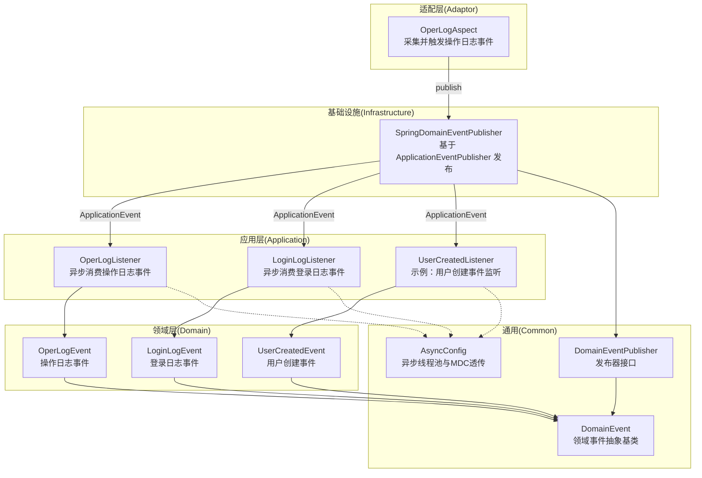
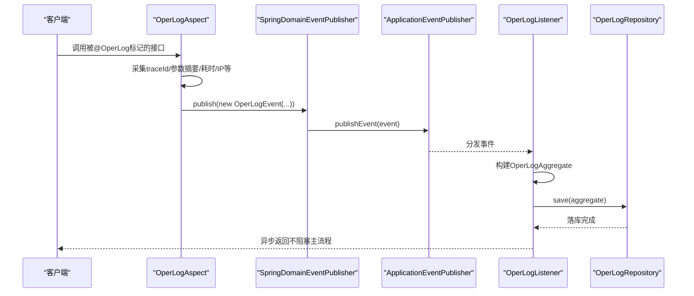
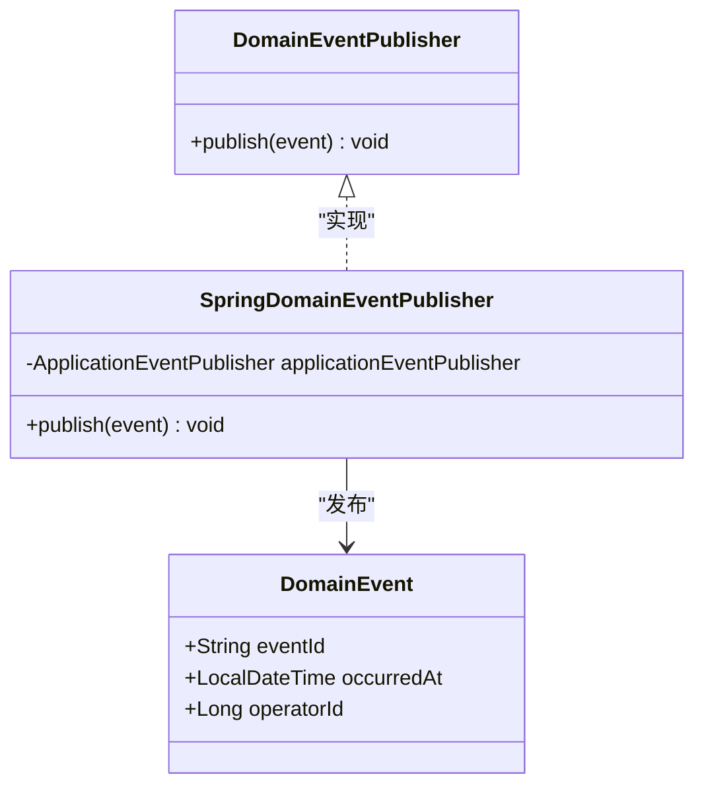
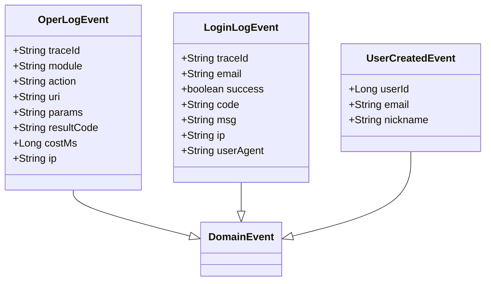
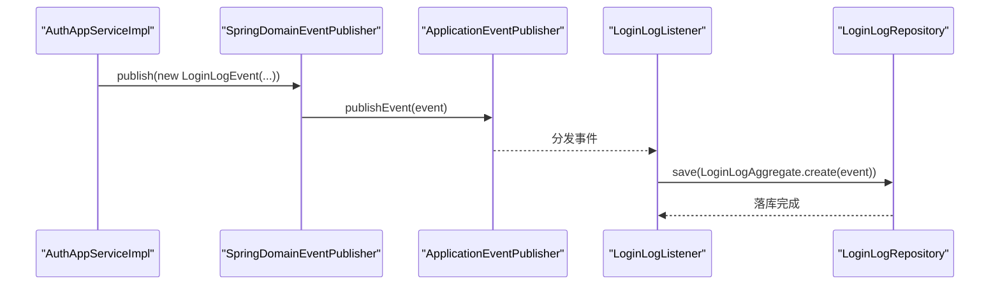
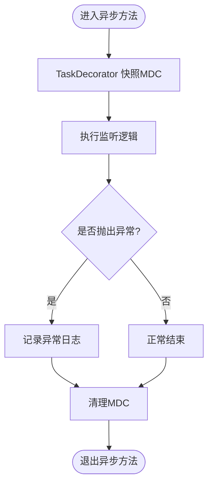
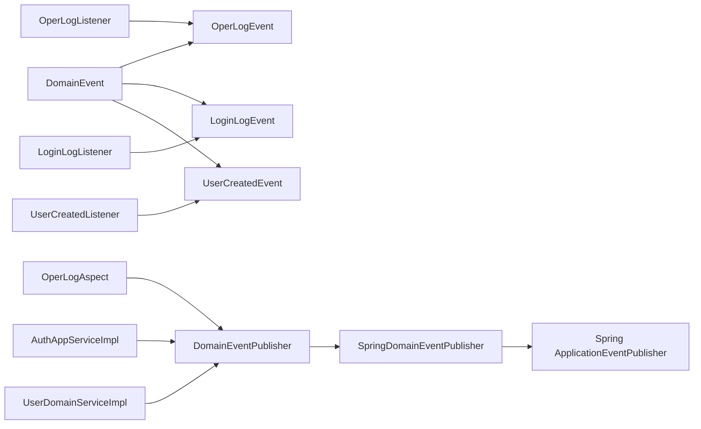

# 领域事件机制

<cite>
**本文引用的文件**   
- [DomainEvent.java](file://src/main/java/com/sunnao/spring/ddd/template/common/event/DomainEvent.java)
- [DomainEventPublisher.java](file://src/main/java/com/sunnao/spring/ddd/template/common/event/DomainEventPublisher.java)
- [SpringDomainEventPublisher.java](file://src/main/java/com/sunnao/spring/ddd/template/infrastructure/common/SpringDomainEventPublisher.java)
- [OperLogEvent.java](file://src/main/java/com/sunnao/spring/ddd/template/domain/system/log/event/OperLogEvent.java)
- [LoginLogEvent.java](file://src/main/java/com/sunnao/spring/ddd/template/domain/system/log/event/LoginLogEvent.java)
- [UserCreatedEvent.java](file://src/main/java/com/sunnao/spring/ddd/template/domain/system/user/event/UserCreatedEvent.java)
- [OperLogListener.java](file://src/main/java/com/sunnao/spring/ddd/template/application/system/log/listener/OperLogListener.java)
- [LoginLogListener.java](file://src/main/java/com/sunnao/spring/ddd/template/application/system/log/listener/LoginLogListener.java)
- [UserCreatedListener.java](file://src/main/java/com/sunnao/spring/ddd/template/application/system/user/listener/UserCreatedListener.java)
- [OperLogAspect.java](file://src/main/java/com/sunnao/spring/ddd/template/adaptor/common/OperLogAspect.java)
- [AuthAppServiceImpl.java](file://src/main/java/com/sunnao/spring/ddd/template/application/auth/scenario/AuthAppServiceImpl.java)
- [UserDomainServiceImpl.java](file://src/main/java/com/sunnao/spring/ddd/template/domain/system/user/service/UserDomainServiceImpl.java)
- [AsyncConfig.java](file://src/main/java/com/sunnao/spring/ddd/template/common/config/AsyncConfig.java)
</cite>

## 目录
1. [引言](#引言)
2. [项目结构](#项目结构)
3. [核心组件](#核心组件)
4. [架构总览](#架构总览)
5. [详细组件分析](#详细组件分析)
6. [依赖关系分析](#依赖关系分析)
7. [性能与监控](#性能与监控)
8. [故障排查指南](#故障排查指南)
9. [结论](#结论)
10. [附录：最佳实践与演进建议](#附录最佳实践与演进建议)

## 引言
本文件围绕仓库中的“领域事件机制”进行系统化技术文档化，覆盖设计原则、命名规范、数据结构、发布/订阅模式、异步处理流程、错误处理策略、最终一致性保障以及版本管理与迁移策略。通过以 OperLogEvent 为例的完整链路说明，帮助读者从事件定义到监听落库形成端到端理解。

## 项目结构
领域事件相关代码分布在 common（抽象与接口）、infrastructure（Spring 实现）、domain（事件定义）、application（监听器）与 adaptor（切面触发点）等层次中，遵循 DDD 分层与关注点分离原则。

图表来源
- [OperLogAspect.java:1-131](file://src/main/java/com/sunnao/spring/ddd/template/adaptor/common/OperLogAspect.java#L1-L131)
- [OperLogListener.java:1-36](file://src/main/java/com/sunnao/spring/ddd/template/application/system/log/listener/OperLogListener.java#L1-L36)
- [LoginLogListener.java:1-36](file://src/main/java/com/sunnao/spring/ddd/template/application/system/log/listener/LoginLogListener.java#L1-L36)
- [UserCreatedListener.java:1-31](file://src/main/java/com/sunnao/spring/ddd/template/application/system/user/listener/UserCreatedListener.java#L1-L31)
- [OperLogEvent.java:1-70](file://src/main/java/com/sunnao/spring/ddd/template/domain/system/log/event/OperLogEvent.java#L1-L70)
- [LoginLogEvent.java:1-64](file://src/main/java/com/sunnao/spring/ddd/template/domain/system/log/event/LoginLogEvent.java#L1-L64)
- [UserCreatedEvent.java:1-39](file://src/main/java/com/sunnao/spring/ddd/template/domain/system/user/event/UserCreatedEvent.java#L1-L39)
- [SpringDomainEventPublisher.java:1-35](file://src/main/java/com/sunnao/spring/ddd/template/infrastructure/common/SpringDomainEventPublisher.java#L1-L35)
- [DomainEvent.java:1-46](file://src/main/java/com/sunnao/spring/ddd/template/common/event/DomainEvent.java#L1-L46)
- [DomainEventPublisher.java:1-20](file://src/main/java/com/sunnao/spring/ddd/template/common/event/DomainEventPublisher.java#L1-L20)
- [AsyncConfig.java:1-69](file://src/main/java/com/sunnao/spring/ddd/template/common/config/AsyncConfig.java#L1-L69)

章节来源
- [OperLogAspect.java:1-131](file://src/main/java/com/sunnao/spring/ddd/template/adaptor/common/OperLogAspect.java#L1-L131)
- [OperLogListener.java:1-36](file://src/main/java/com/sunnao/spring/ddd/template/application/system/log/listener/OperLogListener.java#L1-L36)
- [LoginLogListener.java:1-36](file://src/main/java/com/sunnao/spring/ddd/template/application/system/log/listener/LoginLogListener.java#L1-L36)
- [UserCreatedListener.java:1-31](file://src/main/java/com/sunnao/spring/ddd/template/application/system/user/listener/UserCreatedListener.java#L1-L31)
- [OperLogEvent.java:1-70](file://src/main/java/com/sunnao/spring/ddd/template/domain/system/log/event/OperLogEvent.java#L1-L70)
- [LoginLogEvent.java:1-64](file://src/main/java/com/sunnao/spring/ddd/template/domain/system/log/event/LoginLogEvent.java#L1-L64)
- [UserCreatedEvent.java:1-39](file://src/main/java/com/sunnao/spring/ddd/template/domain/system/user/event/UserCreatedEvent.java#L1-L39)
- [SpringDomainEventPublisher.java:1-35](file://src/main/java/com/sunnao/spring/ddd/template/infrastructure/common/SpringDomainEventPublisher.java#L1-L35)
- [DomainEvent.java:1-46](file://src/main/java/com/sunnao/spring/ddd/template/common/event/DomainEvent.java#L1-L46)
- [DomainEventPublisher.java:1-20](file://src/main/java/com/sunnao/spring/ddd/template/common/event/DomainEventPublisher.java#L1-L20)
- [AsyncConfig.java:1-69](file://src/main/java/com/sunnao/spring/ddd/template/common/config/AsyncConfig.java#L1-L69)

## 核心组件
- 领域事件抽象基类 DomainEvent
  - 提供全局唯一 eventId、发生时间 occurredAt、可选 operatorId，保证事件可追踪与幂等基础能力。
  - 不依赖 Spring，便于在领域层使用。
- 发布器接口 DomainEventPublisher
  - 定义 publish(event) 方法；约定发布失败不抛异常、不影响主流程，内部记录日志。
- Spring 实现 SpringDomainEventPublisher
  - 基于 ApplicationEventPublisher 进程内广播；捕获异常仅记录日志，确保健壮性。
- 事件定义
  - OperLogEvent：操作日志事件，包含 traceId、module、action、uri、params、resultCode、costMs、ip 等。
  - LoginLogEvent：登录日志事件，包含 traceId、email、success、code、msg、ip、userAgent 等。
  - UserCreatedEvent：用户创建事件，包含 userId、email、nickname 等。
- 监听器
  - OperLogListener：异步消费操作日志事件，构建聚合根后落库。
  - LoginLogListener：异步消费登录日志事件，构建聚合根后落库。
  - UserCreatedListener：示例监听器，演示异步消费与扩展点。
- 触发点
  - OperLogAspect：环绕 @OperLog 标注的 Controller 方法，采集请求信息并发布 OperLogEvent。
  - AuthAppServiceImpl：认证场景成功后发布 LoginLogEvent。
  - UserDomainServiceImpl：用户创建成功后发布 UserCreatedEvent。
- 异步配置 AsyncConfig
  - 统一线程池与 MDC 透传，保证链路追踪贯穿异步消费。

章节来源
- [DomainEvent.java:1-46](file://src/main/java/com/sunnao/spring/ddd/template/common/event/DomainEvent.java#L1-L46)
- [DomainEventPublisher.java:1-20](file://src/main/java/com/sunnao/spring/ddd/template/common/event/DomainEventPublisher.java#L1-L20)
- [SpringDomainEventPublisher.java:1-35](file://src/main/java/com/sunnao/spring/ddd/template/infrastructure/common/SpringDomainEventPublisher.java#L1-L35)
- [OperLogEvent.java:1-70](file://src/main/java/com/sunnao/spring/ddd/template/domain/system/log/event/OperLogEvent.java#L1-L70)
- [LoginLogEvent.java:1-64](file://src/main/java/com/sunnao/spring/ddd/template/domain/system/log/event/LoginLogEvent.java#L1-L64)
- [UserCreatedEvent.java:1-39](file://src/main/java/com/sunnao/spring/ddd/template/domain/system/user/event/UserCreatedEvent.java#L1-L39)
- [OperLogListener.java:1-36](file://src/main/java/com/sunnao/spring/ddd/template/application/system/log/listener/OperLogListener.java#L1-L36)
- [LoginLogListener.java:1-36](file://src/main/java/com/sunnao/spring/ddd/template/application/system/log/listener/LoginLogListener.java#L1-L36)
- [UserCreatedListener.java:1-31](file://src/main/java/com/sunnao/spring/ddd/template/application/system/user/listener/UserCreatedListener.java#L1-L31)
- [OperLogAspect.java:1-131](file://src/main/java/com/sunnao/spring/ddd/template/adaptor/common/OperLogAspect.java#L1-L131)
- [AuthAppServiceImpl.java:1-196](file://src/main/java/com/sunnao/spring/ddd/template/application/auth/scenario/AuthAppServiceImpl.java#L1-L196)
- [UserDomainServiceImpl.java:1-204](file://src/main/java/com/sunnao/spring/ddd/template/domain/system/user/service/UserDomainServiceImpl.java#L1-L204)
- [AsyncConfig.java:1-69](file://src/main/java/com/sunnao/spring/ddd/template/common/config/AsyncConfig.java#L1-L69)

## 架构总览
下图展示从触发点到持久化的完整调用链，体现“发布-订阅-异步处理”的事件驱动模式。

图表来源
- [OperLogAspect.java:1-131](file://src/main/java/com/sunnao/spring/ddd/template/adaptor/common/OperLogAspect.java#L1-L131)
- [SpringDomainEventPublisher.java:1-35](file://src/main/java/com/sunnao/spring/ddd/template/infrastructure/common/SpringDomainEventPublisher.java#L1-L35)
- [OperLogListener.java:1-36](file://src/main/java/com/sunnao/spring/ddd/template/application/system/log/listener/OperLogListener.java#L1-L36)

## 详细组件分析

### 领域事件抽象与发布器接口
- DomainEvent
  - 字段：eventId（全局唯一）、occurredAt（发生时间）、operatorId（操作人）。
  - 作用：为所有领域事件提供统一的追踪与审计基础。
- DomainEventPublisher
  - 契约：publish(event)，失败不抛异常，内部记录日志。
  - 目的：将发布细节与业务解耦，屏蔽底层实现差异。

图表来源
- [DomainEvent.java:1-46](file://src/main/java/com/sunnao/spring/ddd/template/common/event/DomainEvent.java#L1-L46)
- [DomainEventPublisher.java:1-20](file://src/main/java/com/sunnao/spring/ddd/template/common/event/DomainEventPublisher.java#L1-L20)
- [SpringDomainEventPublisher.java:1-35](file://src/main/java/com/sunnao/spring/ddd/template/infrastructure/common/SpringDomainEventPublisher.java#L1-L35)

章节来源
- [DomainEvent.java:1-46](file://src/main/java/com/sunnao/spring/ddd/template/common/event/DomainEvent.java#L1-L46)
- [DomainEventPublisher.java:1-20](file://src/main/java/com/sunnao/spring/ddd/template/common/event/DomainEventPublisher.java#L1-L20)
- [SpringDomainEventPublisher.java:1-35](file://src/main/java/com/sunnao/spring/ddd/template/infrastructure/common/SpringDomainEventPublisher.java#L1-L35)

### 事件定义与数据传递：以 OperLogEvent 为例
- 命名规范
  - 采用“业务对象+动作+Event”形式，如 OperLogEvent、LoginLogEvent、UserCreatedEvent。
- 数据结构设计
  - 继承 DomainEvent，携带 eventId、occurredAt、operatorId。
  - 针对具体场景增加必要上下文：OperLogEvent 包含 traceId、module、action、uri、params、resultCode、costMs、ip；LoginLogEvent 包含 email、success、code、msg、ip、userAgent；UserCreatedEvent 包含 userId、email、nickname。
- 数据传递机制
  - 通过构造函数传入上下文，构造不可变事件对象，避免后续篡改。
  - 监听器通过 getter 读取事件属性，构建聚合根并持久化。

图表来源
- [OperLogEvent.java:1-70](file://src/main/java/com/sunnao/spring/ddd/template/domain/system/log/event/OperLogEvent.java#L1-L70)
- [LoginLogEvent.java:1-64](file://src/main/java/com/sunnao/spring/ddd/template/domain/system/log/event/LoginLogEvent.java#L1-L64)
- [UserCreatedEvent.java:1-39](file://src/main/java/com/sunnao/spring/ddd/template/domain/system/user/event/UserCreatedEvent.java#L1-L39)
- [DomainEvent.java:1-46](file://src/main/java/com/sunnao/spring/ddd/template/common/event/DomainEvent.java#L1-L46)

章节来源
- [OperLogEvent.java:1-70](file://src/main/java/com/sunnao/spring/ddd/template/domain/system/log/event/OperLogEvent.java#L1-L70)
- [LoginLogEvent.java:1-64](file://src/main/java/com/sunnao/spring/ddd/template/domain/system/log/event/LoginLogEvent.java#L1-L64)
- [UserCreatedEvent.java:1-39](file://src/main/java/com/sunnao/spring/ddd/template/domain/system/user/event/UserCreatedEvent.java#L1-L39)
- [DomainEvent.java:1-46](file://src/main/java/com/sunnao/spring/ddd/template/common/event/DomainEvent.java#L1-L46)

### 事件发布与订阅流程
- 发布侧
  - OperLogAspect：在 finally 块中采集并发布 OperLogEvent，失败不影响主流程。
  - AuthAppServiceImpl：登录成功/失败均发布 LoginLogEvent。
  - UserDomainServiceImpl：用户创建成功后发布 UserCreatedEvent。
- 订阅侧
  - OperLogListener、LoginLogListener、UserCreatedListener 使用 @Async + @EventListener 异步消费。
  - 监听器内部 try-catch 仅记录日志，确保最终一致性与容错。

图表来源
- [AuthAppServiceImpl.java:1-196](file://src/main/java/com/sunnao/spring/ddd/template/application/auth/scenario/AuthAppServiceImpl.java#L1-L196)
- [SpringDomainEventPublisher.java:1-35](file://src/main/java/com/sunnao/spring/ddd/template/infrastructure/common/SpringDomainEventPublisher.java#L1-L35)
- [LoginLogListener.java:1-36](file://src/main/java/com/sunnao/spring/ddd/template/application/system/log/listener/LoginLogListener.java#L1-L36)

章节来源
- [OperLogAspect.java:1-131](file://src/main/java/com/sunnao/spring/ddd/template/adaptor/common/OperLogAspect.java#L1-L131)
- [AuthAppServiceImpl.java:1-196](file://src/main/java/com/sunnao/spring/ddd/template/application/auth/scenario/AuthAppServiceImpl.java#L1-L196)
- [UserDomainServiceImpl.java:1-204](file://src/main/java/com/sunnao/spring/ddd/template/domain/system/user/service/UserDomainServiceImpl.java#L1-L204)
- [OperLogListener.java:1-36](file://src/main/java/com/sunnao/spring/ddd/template/application/system/log/listener/OperLogListener.java#L1-L36)
- [LoginLogListener.java:1-36](file://src/main/java/com/sunnao/spring/ddd/template/application/system/log/listener/LoginLogListener.java#L1-L36)
- [UserCreatedListener.java:1-31](file://src/main/java/com/sunnao/spring/ddd/template/application/system/user/listener/UserCreatedListener.java#L1-L31)

### 异步处理与链路追踪
- 线程池配置
  - AsyncConfig 提供统一线程池，设置核心/最大线程数、队列容量、拒绝策略等。
- MDC 透传
  - TaskDecorator 在任务提交时快照 MDC，执行时恢复，结束后清理，保证 traceId 贯穿异步链路。
- 异常处理
  - 异步未捕获异常由 AsyncUncaughtExceptionHandler 记录日志，避免静默失败。

图表来源
- [AsyncConfig.java:1-69](file://src/main/java/com/sunnao/spring/ddd/template/common/config/AsyncConfig.java#L1-L69)
- [OperLogListener.java:1-36](file://src/main/java/com/sunnao/spring/ddd/template/application/system/log/listener/OperLogListener.java#L1-L36)
- [LoginLogListener.java:1-36](file://src/main/java/com/sunnao/spring/ddd/template/application/system/log/listener/LoginLogListener.java#L1-L36)
- [UserCreatedListener.java:1-31](file://src/main/java/com/sunnao/spring/ddd/template/application/system/user/listener/UserCreatedListener.java#L1-L31)

章节来源
- [AsyncConfig.java:1-69](file://src/main/java/com/sunnao/spring/ddd/template/common/config/AsyncConfig.java#L1-L69)

## 依赖关系分析
- 耦合与内聚
  - 领域事件定义位于 domain 层，保持高内聚；监听器位于 application 层，负责编排与持久化。
  - 发布器接口位于 common 层，屏蔽基础设施细节，降低耦合。
- 直接依赖
  - 发布器实现依赖 Spring 的 ApplicationEventPublisher。
  - 监听器依赖各自领域的 Repository 与 Aggregate。
- 潜在循环依赖
  - 当前结构无循环依赖；事件单向传播，监听器不反向依赖发布者。

图表来源
- [DomainEvent.java:1-46](file://src/main/java/com/sunnao/spring/ddd/template/common/event/DomainEvent.java#L1-L46)
- [OperLogEvent.java:1-70](file://src/main/java/com/sunnao/spring/ddd/template/domain/system/log/event/OperLogEvent.java#L1-L70)
- [LoginLogEvent.java:1-64](file://src/main/java/com/sunnao/spring/ddd/template/domain/system/log/event/LoginLogEvent.java#L1-L64)
- [UserCreatedEvent.java:1-39](file://src/main/java/com/sunnao/spring/ddd/template/domain/system/user/event/UserCreatedEvent.java#L1-L39)
- [DomainEventPublisher.java:1-20](file://src/main/java/com/sunnao/spring/ddd/template/common/event/DomainEventPublisher.java#L1-L20)
- [SpringDomainEventPublisher.java:1-35](file://src/main/java/com/sunnao/spring/ddd/template/infrastructure/common/SpringDomainEventPublisher.java#L1-L35)
- [OperLogAspect.java:1-131](file://src/main/java/com/sunnao/spring/ddd/template/adaptor/common/OperLogAspect.java#L1-L131)
- [AuthAppServiceImpl.java:1-196](file://src/main/java/com/sunnao/spring/ddd/template/application/auth/scenario/AuthAppServiceImpl.java#L1-L196)
- [UserDomainServiceImpl.java:1-204](file://src/main/java/com/sunnao/spring/ddd/template/domain/system/user/service/UserDomainServiceImpl.java#L1-L204)
- [OperLogListener.java:1-36](file://src/main/java/com/sunnao/spring/ddd/template/application/system/log/listener/OperLogListener.java#L1-L36)
- [LoginLogListener.java:1-36](file://src/main/java/com/sunnao/spring/ddd/template/application/system/log/listener/LoginLogListener.java#L1-L36)
- [UserCreatedListener.java:1-31](file://src/main/java/com/sunnao/spring/ddd/template/application/system/user/listener/UserCreatedListener.java#L1-L31)

章节来源
- [OperLogAspect.java:1-131](file://src/main/java/com/sunnao/spring/ddd/template/adaptor/common/OperLogAspect.java#L1-L131)
- [AuthAppServiceImpl.java:1-196](file://src/main/java/com/sunnao/spring/ddd/template/application/auth/scenario/AuthAppServiceImpl.java#L1-L196)
- [UserDomainServiceImpl.java:1-204](file://src/main/java/com/sunnao/spring/ddd/template/domain/system/user/service/UserDomainServiceImpl.java#L1-L204)
- [OperLogListener.java:1-36](file://src/main/java/com/sunnao/spring/ddd/template/application/system/log/listener/OperLogListener.java#L1-L36)
- [LoginLogListener.java:1-36](file://src/main/java/com/sunnao/spring/ddd/template/application/system/log/listener/LoginLogListener.java#L1-L36)
- [UserCreatedListener.java:1-31](file://src/main/java/com/sunnao/spring/ddd/template/application/system/user/listener/UserCreatedListener.java#L1-L31)
- [SpringDomainEventPublisher.java:1-35](file://src/main/java/com/sunnao/spring/ddd/template/infrastructure/common/SpringDomainEventPublisher.java#L1-L35)

## 性能与监控
- 异步削峰
  - 使用独立线程池处理事件落库，避免阻塞主流程。
- 线程池参数
  - 核心/最大线程数与队列容量需根据 QPS 与 I/O 特征调优；拒绝策略采用 CallerRunsPolicy 可在过载时回退至调用线程执行，起到背压效果。
- 链路追踪
  - MDC 透传确保 traceId 在异步链路中可见，便于问题定位。
- 监控指标建议
  - 发布成功率、监听器消费延迟、落库失败率、线程池活跃/队列长度、拒绝次数等。
- 优化建议
  - 批量落库、去重写入、限流降级、热点键隔离等。

[本节为通用指导，无需特定文件引用]

## 故障排查指南
- 常见问题
  - 事件未落库：检查监听器是否启用 @Async/@EventListener、线程池是否耗尽、MDC 是否正确透传。
  - 主流程受影响：确认发布与监听器内部异常捕获策略，避免向上抛出。
  - 重复消费：利用 eventId 做幂等控制（建议在落库前校验）。
- 定位步骤
  - 通过 traceId 串联日志，查看 OperLogAspect 发布、SpringDomainEventPublisher 转发、监听器消费全链路。
  - 观察线程池状态与队列堆积情况，必要时扩容或调整拒绝策略。
- 修复建议
  - 对关键落库路径增加重试与死信队列；完善告警规则与仪表盘。

章节来源
- [OperLogAspect.java:1-131](file://src/main/java/com/sunnao/spring/ddd/template/adaptor/common/OperLogAspect.java#L1-L131)
- [SpringDomainEventPublisher.java:1-35](file://src/main/java/com/sunnao/spring/ddd/template/infrastructure/common/SpringDomainEventPublisher.java#L1-L35)
- [OperLogListener.java:1-36](file://src/main/java/com/sunnao/spring/ddd/template/application/system/log/listener/OperLogListener.java#L1-L36)
- [LoginLogListener.java:1-36](file://src/main/java/com/sunnao/spring/ddd/template/application/system/log/listener/LoginLogListener.java#L1-L36)
- [AsyncConfig.java:1-69](file://src/main/java/com/sunnao/spring/ddd/template/common/config/AsyncConfig.java#L1-L69)

## 结论
该项目的领域事件机制以简洁清晰的抽象与实现，实现了模块间解耦与异步削峰。通过统一的事件基类与发布器接口，结合 Spring 的 ApplicationEventPublisher 与 @Async 监听器，构建了稳定可靠的最终一致性方案。配合 MDC 透传与完善的异常处理，具备较好的可观测性与可维护性。

[本节为总结，无需特定文件引用]

## 附录：最佳实践与演进建议
- 事件命名规范
  - 采用“领域对象+动作+Event”，如 OperLogEvent、LoginLogEvent、UserCreatedEvent。
- 数据结构设计
  - 最小必要字段、不可变对象、携带 eventId/occurredAt/operatorId 用于追踪与审计。
- 发布与订阅
  - 发布失败不抛异常；监听器内部 try-catch 记录日志，确保主流程不受影响。
- 最终一致性
  - 借助 eventId 幂等、重试与死信队列，提升可靠性。
- 错误处理策略
  - 区分业务异常与系统异常；对关键路径引入补偿与人工介入通道。
- 事件版本管理
  - 向后兼容：新增字段默认值、废弃字段保留一段时间；变更版本号纳入事件元数据。
  - 迁移策略：灰度升级、双写兼容、离线回放工具。
- 完整流程示例（以 OperLogEvent 为例）
  - 定义事件：参见 [OperLogEvent.java:1-70](file://src/main/java/com/sunnao/spring/ddd/template/domain/system/log/event/OperLogEvent.java#L1-L70)。
  - 发布事件：参见 [OperLogAspect.java:1-131](file://src/main/java/com/sunnao/spring/ddd/template/adaptor/common/OperLogAspect.java#L1-L131)、[AuthAppServiceImpl.java:1-196](file://src/main/java/com/sunnao/spring/ddd/template/application/auth/scenario/AuthAppServiceImpl.java#L1-L196)、[UserDomainServiceImpl.java:1-204](file://src/main/java/com/sunnao/spring/ddd/template/domain/system/user/service/UserDomainServiceImpl.java#L1-L204)。
  - 监听处理：参见 [OperLogListener.java:1-36](file://src/main/java/com/sunnao/spring/ddd/template/application/system/log/listener/OperLogListener.java#L1-L36)、[LoginLogListener.java:1-36](file://src/main/java/com/sunnao/spring/ddd/template/application/system/log/listener/LoginLogListener.java#L1-L36)、[UserCreatedListener.java:1-31](file://src/main/java/com/sunnao/spring/ddd/template/application/system/user/listener/UserCreatedListener.java#L1-L31)。
  - 异步配置：参见 [AsyncConfig.java:1-69](file://src/main/java/com/sunnao/spring/ddd/template/common/config/AsyncConfig.java#L1-L69)。

[本节为概念性内容，无需特定文件引用]