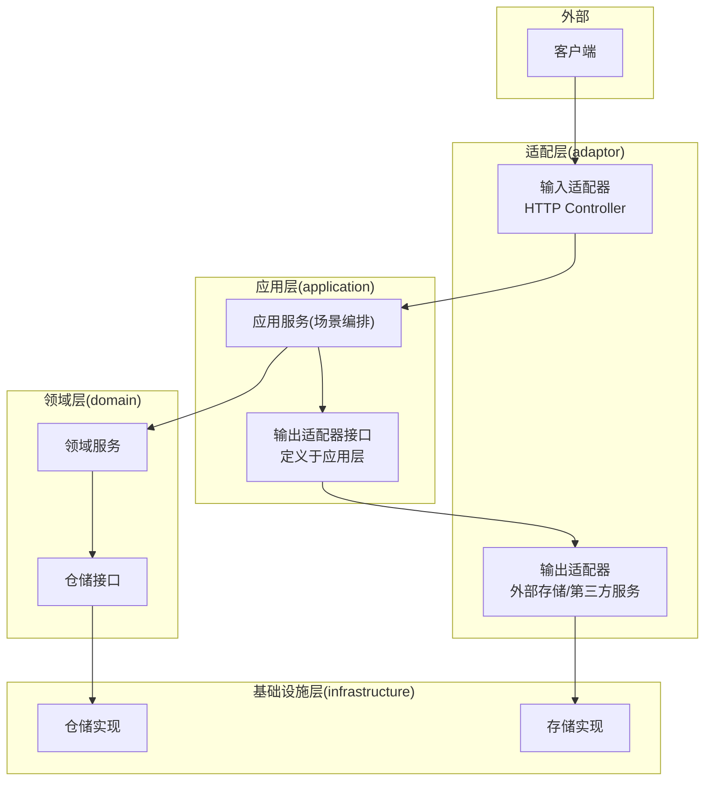
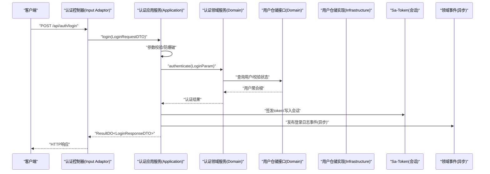
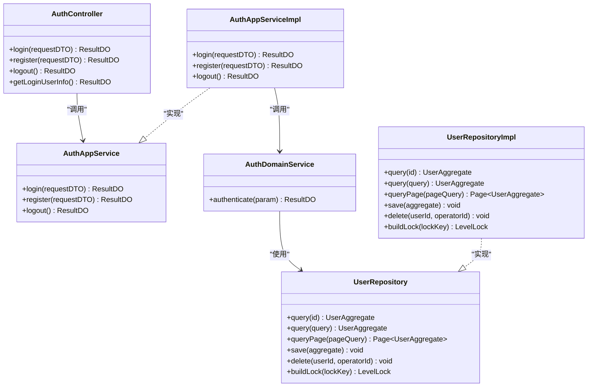
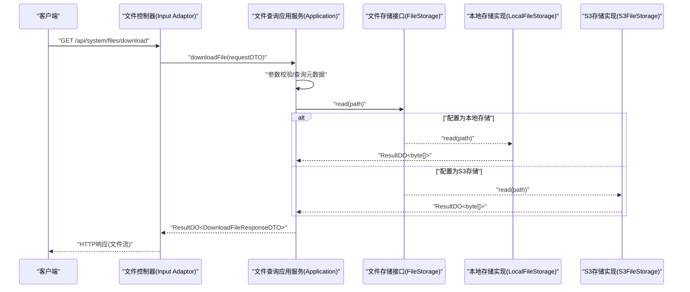
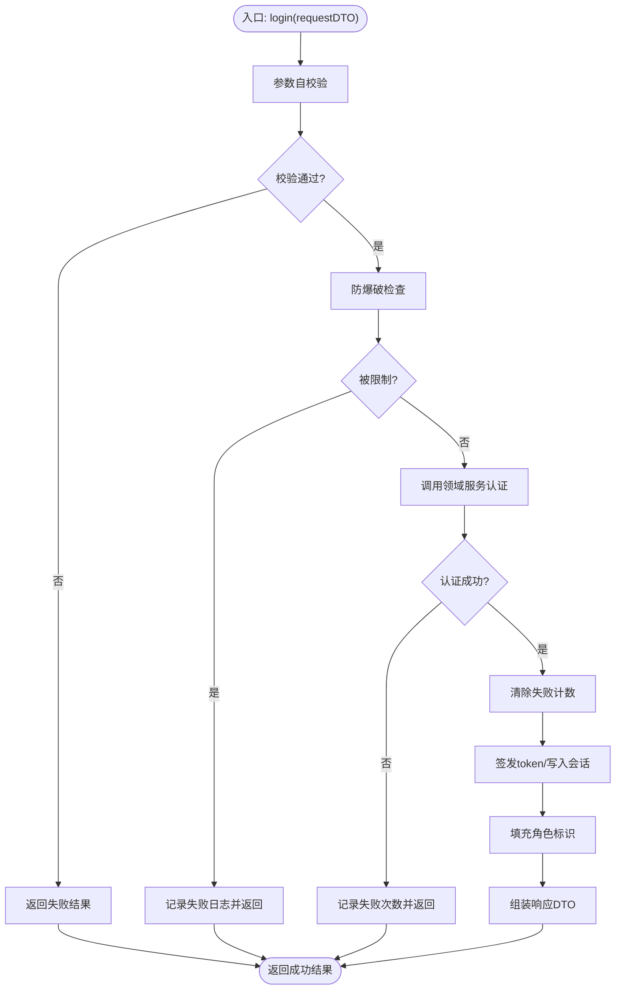
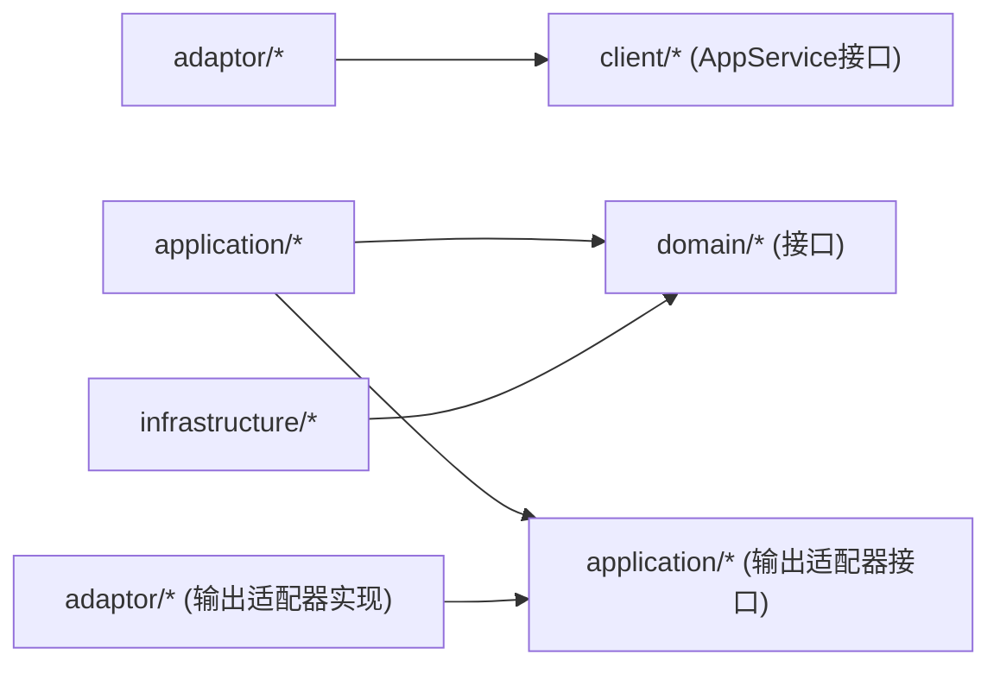

# 六边形架构详解

<cite>
**本文引用的文件**   
- [README.md](file://README.md)
- [ddd-adaptor-layer.md](file://docs/rule/ddd/ddd-adaptor-layer.md)
- [AuthController.java](file://src/main/java/com/sunnao/spring/ddd/template/adaptor/auth/input/AuthController.java)
- [AuthAppService.java](file://src/main/java/com/sunnao/spring/ddd/template/client/auth/AuthAppService.java)
- [AuthAppServiceImpl.java](file://src/main/java/com/sunnao/spring/ddd/template/application/auth/scenario/AuthAppServiceImpl.java)
- [AuthDomainService.java](file://src/main/java/com/sunnao/spring/ddd/template/domain/auth/service/AuthDomainService.java)
- [UserRepository.java](file://src/main/java/com/sunnao/spring/ddd/template/domain/system/user/repository/UserRepository.java)
- [UserRepositoryImpl.java](file://src/main/java/com/sunnao/spring/ddd/template/infrastructure/system/user/repository/UserRepositoryImpl.java)
- [FileStorage.java](file://src/main/java/com/sunnao/spring/ddd/template/application/system/file/FileStorage.java)
- [LocalFileStorage.java](file://src/main/java/com/sunnao/spring/ddd/template/adaptor/system/file/output/LocalFileStorage.java)
- [S3FileStorage.java](file://src/main/java/com/sunnao/spring/ddd/template/adaptor/system/file/output/S3FileStorage.java)
</cite>

## 目录
1. [引言](#引言)
2. [项目结构](#项目结构)
3. [核心组件](#核心组件)
4. [架构总览](#架构总览)
5. [详细组件分析](#详细组件分析)
6. [依赖关系分析](#依赖关系分析)
7. [性能与可扩展性](#性能与可扩展性)
8. [故障排查指南](#故障排查指南)
9. [结论](#结论)
10. [附录：接口与实现对照](#附录接口与实现对照)

## 引言
本文件围绕“六边形架构（Hexagonal Architecture）”在该工程中的落地实践，系统阐述其核心概念、设计原则与依赖倒置模式；明确各层职责边界：adaptor 适配层作为系统的端口和适配器，application 应用层负责场景编排和业务协调，domain 领域层包含核心业务逻辑，infrastructure 基础设施层提供技术实现。文档通过架构图和数据流向图展示请求从外部进入系统到返回响应的完整流程，并结合具体代码示例说明如何实现依赖倒置（接口定义在领域或应用层、实现在基础设施或适配层），解释防腐层的作用与实现方式，以及如何通过适配器模式隔离外部依赖的变化。

## 项目结构
本项目采用六边形架构的六层组织方式，调用顺序自外向内：adaptor(input) → application → domain → repository 接口（infrastructure 实现），同时 application 可定义输出适配器接口，由 adaptor(output) 实现，体现依赖倒置。

图示来源
- [README.md:19-35](file://README.md#L19-L35)
- [ddd-adaptor-layer.md:93-112](file://docs/rule/ddd/ddd-adaptor-layer.md#L93-L112)

章节来源
- [README.md:19-35](file://README.md#L19-L35)

## 核心组件
- 认证写流程（登录/注册/登出）
  - 输入适配器：认证控制器接收 HTTP 请求并转发至应用服务
  - 应用服务：参数校验、防爆破、会话签发、事件发布等编排
  - 领域服务：身份认证核心逻辑（凭证校验、账号状态校验）
  - 仓储接口：用户聚合根持久化与查询（接口定义在领域层）
  - 仓储实现：MyBatis-Flex 数据访问与对象转换（基础设施层）
- 文件下载读流程（跨层读取物理内容）
  - 应用服务：查询元数据 + 调用输出适配器读取物理内容
  - 输出适配器接口：定义于应用层（依赖倒置）
  - 输出适配器实现：本地磁盘或 S3 对象存储（适配层）

章节来源
- [AuthController.java:1-70](file://src/main/java/com/sunnao/spring/ddd/template/adaptor/auth/input/AuthController.java#L1-L70)
- [AuthAppService.java:1-39](file://src/main/java/com/sunnao/spring/ddd/template/client/auth/AuthAppService.java#L1-L39)
- [AuthAppServiceImpl.java:1-196](file://src/main/java/com/sunnao/spring/ddd/template/application/auth/scenario/AuthAppServiceImpl.java#L1-L196)
- [AuthDomainService.java:1-24](file://src/main/java/com/sunnao/spring/ddd/template/domain/auth/service/AuthDomainService.java#L1-L24)
- [UserRepository.java:1-65](file://src/main/java/com/sunnao/spring/ddd/template/domain/system/user/repository/UserRepository.java#L1-L65)
- [UserRepositoryImpl.java:1-191](file://src/main/java/com/sunnao/spring/ddd/template/infrastructure/system/user/repository/UserRepositoryImpl.java#L1-L191)
- [FileStorage.java:1-47](file://src/main/java/com/sunnao/spring/ddd/template/application/system/file/FileStorage.java#L1-L47)

## 架构总览
下图展示了典型写流程（登录）的数据与控制流，体现依赖倒置与内外分离：

图示来源
- [AuthController.java:32-40](file://src/main/java/com/sunnao/spring/ddd/template/adaptor/auth/input/AuthController.java#L32-L40)
- [AuthAppServiceImpl.java:66-113](file://src/main/java/com/sunnao/spring/ddd/template/application/auth/scenario/AuthAppServiceImpl.java#L66-L113)
- [AuthDomainService.java:14-23](file://src/main/java/com/sunnao/spring/ddd/template/domain/auth/service/AuthDomainService.java#L14-L23)
- [UserRepository.java:19-28](file://src/main/java/com/sunnao/spring/ddd/template/domain/system/user/repository/UserRepository.java#L19-L28)
- [UserRepositoryImpl.java:50-70](file://src/main/java/com/sunnao/spring/ddd/template/infrastructure/system/user/repository/UserRepositoryImpl.java#L50-L70)

## 详细组件分析

### 认证写流程（登录）
- 输入适配器（Input Adaptor）
  - 职责：接收 HTTP 请求，不做业务逻辑，仅转发至应用服务
  - 关键点：统一返回 ResultDO，便于全局异常处理与错误码收敛
- 应用服务（Application Service）
  - 职责：场景编排（参数校验、防爆破、领域服务调用、会话管理、事件发布）
  - 关键点：将 Sa-Token 等技术细节收敛在应用层，领域层不感知
- 领域服务（Domain Service）
  - 职责：封装身份认证核心业务逻辑（凭证校验、账号状态校验）
  - 关键点：纯业务语义，无技术耦合
- 仓储接口与实现（Repository Interface & Implementation）
  - 接口定义在领域层，实现在基础设施层
  - 实现类负责 PO 与聚合根转换、分页、事务组合等

图示来源
- [AuthController.java:1-70](file://src/main/java/com/sunnao/spring/ddd/template/adaptor/auth/input/AuthController.java#L1-L70)
- [AuthAppService.java:1-39](file://src/main/java/com/sunnao/spring/ddd/template/client/auth/AuthAppService.java#L1-L39)
- [AuthAppServiceImpl.java:1-196](file://src/main/java/com/sunnao/spring/ddd/template/application/auth/scenario/AuthAppServiceImpl.java#L1-L196)
- [AuthDomainService.java:1-24](file://src/main/java/com/sunnao/spring/ddd/template/domain/auth/service/AuthDomainService.java#L1-L24)
- [UserRepository.java:1-65](file://src/main/java/com/sunnao/spring/ddd/template/domain/system/user/repository/UserRepository.java#L1-L65)
- [UserRepositoryImpl.java:1-191](file://src/main/java/com/sunnao/spring/ddd/template/infrastructure/system/user/repository/UserRepositoryImpl.java#L1-L191)

章节来源
- [AuthController.java:1-70](file://src/main/java/com/sunnao/spring/ddd/template/adaptor/auth/input/AuthController.java#L1-L70)
- [AuthAppServiceImpl.java:66-113](file://src/main/java/com/sunnao/spring/ddd/template/application/auth/scenario/AuthAppServiceImpl.java#L66-L113)
- [AuthDomainService.java:14-23](file://src/main/java/com/sunnao/spring/ddd/template/domain/auth/service/AuthDomainService.java#L14-L23)
- [UserRepository.java:19-65](file://src/main/java/com/sunnao/spring/ddd/template/domain/system/user/repository/UserRepository.java#L19-L65)
- [UserRepositoryImpl.java:50-168](file://src/main/java/com/sunnao/spring/ddd/template/infrastructure/system/user/repository/UserRepositoryImpl.java#L50-L168)

### 文件下载读流程（输出适配器）
- 应用服务：查询文件元数据后，调用 FileStorage 读取物理内容
- 输出适配器接口：定义于应用层（依赖倒置）
- 输出适配器实现：LocalFileStorage（本地磁盘）、S3FileStorage（对象存储）

图示来源
- [FileStorage.java:1-47](file://src/main/java/com/sunnao/spring/ddd/template/application/system/file/FileStorage.java#L1-L47)
- [LocalFileStorage.java](file://src/main/java/com/sunnao/spring/ddd/template/adaptor/system/file/output/LocalFileStorage.java)
- [S3FileStorage.java](file://src/main/java/com/sunnao/spring/ddd/template/adaptor/system/file/output/S3FileStorage.java)

章节来源
- [FileStorage.java:1-47](file://src/main/java/com/sunnao/spring/ddd/template/application/system/file/FileStorage.java#L1-L47)

### 复杂逻辑流程图（登录主流程）

图示来源
- [AuthAppServiceImpl.java:66-113](file://src/main/java/com/sunnao/spring/ddd/template/application/auth/scenario/AuthAppServiceImpl.java#L66-L113)

## 依赖关系分析
- 依赖方向
  - adaptor 依赖 client 层的 AppService 接口
  - application 依赖 domain 层接口（领域服务、仓储接口）以及自身定义的输出适配器接口
  - infrastructure 依赖 domain 层接口并提供实现
  - model 层为内部共享模型，client 层禁止依赖 model 层
- 依赖倒置
  - 仓储接口定义在领域层，实现在基础设施层
  - 输出适配器接口定义在应用层，实现在适配层
- 可能的循环依赖
  - 通过接口解耦避免循环依赖；仓储组合方法委托其他仓储时需注意事务传播与边界

图示来源
- [README.md:19-35](file://README.md#L19-L35)
- [ddd-adaptor-layer.md:93-112](file://docs/rule/ddd/ddd-adaptor-layer.md#L93-L112)

章节来源
- [README.md:19-35](file://README.md#L19-L35)

## 性能与可扩展性
- 写模式标准流程
  - 领域服务先构建锁并尝试获取锁，再加载/构建聚合根、执行业务方法、持久化，最后释放锁，保证并发安全
- 审计字段自动填充
  - 通过全局监听器自动填充创建/更新时间与操作人，减少样板代码
- 分布式锁与缓存
  - 支持 Redis 分布式锁与 JVM 单机锁切换；字典等热点数据可走 Redis 缓存，写操作失效缓存
- 异步事件
  - 领域事件通过 Spring 异步监听器消费，降低主流程延迟
- 存储实现可插拔
  - 通过配置文件切换本地磁盘或 S3 对象存储，无需修改应用层逻辑

[本节为通用指导，不直接分析具体文件]

## 故障排查指南
- 全局异常处理
  - 统一捕获并转换为 ResultDO，避免上层抛出框架异常
- 登录失败与防爆破
  - 失败计数与窗口拒绝策略，结合登录日志事件进行审计
- 数据库异常
  - 仓储实现中统一包装为 RepositoryException，便于上层识别与处理
- 链路追踪
  - TraceIdFilter 生成并透传 X-Trace-Id，异步线程通过 TaskDecorator 传递

章节来源
- [AuthAppServiceImpl.java:107-113](file://src/main/java/com/sunnao/spring/ddd/template/application/auth/scenario/AuthAppServiceImpl.java#L107-L113)
- [UserRepositoryImpl.java:50-70](file://src/main/java/com/sunnao/spring/ddd/template/infrastructure/system/user/repository/UserRepositoryImpl.java#L50-L70)

## 结论
本项目以六边形架构为核心，清晰划分了适配层、应用层、领域层与基础设施层的职责边界，并通过依赖倒置实现了技术细节与业务逻辑的解耦。应用层定义输出适配器接口，适配层提供具体实现，从而隔离外部依赖变化；仓储接口定义在领域层，基础设施层实现，确保领域模型的稳定性。整体设计具备良好的可扩展性与可维护性，适合持续演进的业务系统。

[本节为总结性内容，不直接分析具体文件]

## 附录：接口与实现对照
- 仓储接口与实现
  - 接口：UserRepository（领域层）
  - 实现：UserRepositoryImpl（基础设施层）
- 输出适配器接口与实现
  - 接口：FileStorage（应用层）
  - 实现：LocalFileStorage、S3FileStorage（适配层）

章节来源
- [UserRepository.java:1-65](file://src/main/java/com/sunnao/spring/ddd/template/domain/system/user/repository/UserRepository.java#L1-L65)
- [UserRepositoryImpl.java:1-191](file://src/main/java/com/sunnao/spring/ddd/template/infrastructure/system/user/repository/UserRepositoryImpl.java#L1-L191)
- [FileStorage.java:1-47](file://src/main/java/com/sunnao/spring/ddd/template/application/system/file/FileStorage.java#L1-L47)
- [LocalFileStorage.java](file://src/main/java/com/sunnao/spring/ddd/template/adaptor/system/file/output/LocalFileStorage.java)
- [S3FileStorage.java](file://src/main/java/com/sunnao/spring/ddd/template/adaptor/system/file/output/S3FileStorage.java)