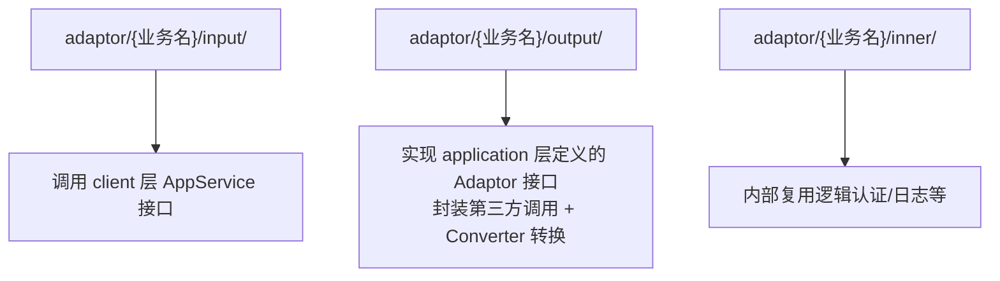
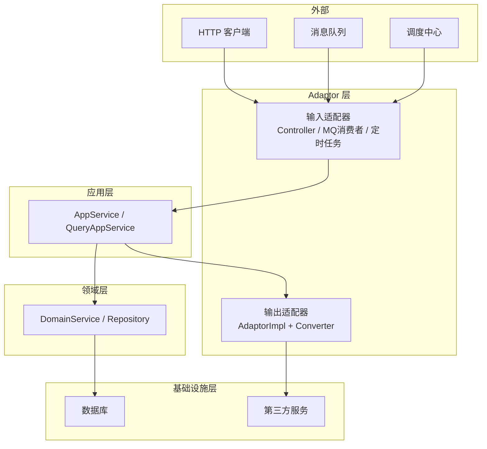
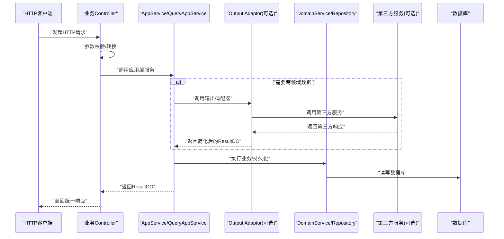
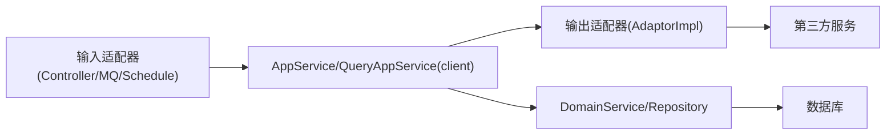

# Adaptor适配层规范

<cite>
**本文引用的文件**   
- [ddd-adaptor-layer.md](file://docs/rule/ddd/ddd-adaptor-layer.md)
- [package-info.java](file://src/main/java/com/sunnao/spring/ddd/template/adaptor/package-info.java)
- [AuthController.java](file://src/main/java/com/sunnao/spring/ddd/template/adaptor/auth/input/AuthController.java)
- [DictController.java](file://src/main/java/com/sunnao/spring/ddd/template/adaptor/system/dict/input/DictController.java)
- [FileController.java](file://src/main/java/com/sunnao/spring/ddd/template/adaptor/system/file/input/FileController.java)
- [LogController.java](file://src/main/java/com/sunnao/spring/ddd/template/adaptor/system/log/input/LogController.java)
- [OnlineController.java](file://src/main/java/com/sunnao/spring/ddd/template/adaptor/system/online/input/OnlineController.java)
- [RoleController.java](file://src/main/java/com/sunnao/spring/ddd/template/adaptor/system/role/input/RoleController.java)
</cite>

## 目录
1. [引言](#引言)
2. [项目结构](#项目结构)
3. [核心组件](#核心组件)
4. [架构总览](#架构总览)
5. [详细组件分析](#详细组件分析)
6. [依赖关系分析](#依赖关系分析)
7. [性能考虑](#性能考虑)
8. [故障排查指南](#故障排查指南)
9. [结论](#结论)
10. [附录](#附录)

## 引言
本规范面向Adaptor适配层，明确其作为防腐层（ACL）的职责与双向适配机制：输入适配器负责将外部协议请求转换为应用层可理解的指令；输出适配器负责将领域数据转换为外部服务所需协议。文档同时给出包结构、命名约定、依赖管理、四种入口类型实现规范与最佳实践，并说明转换类的设计模式与异常处理策略，帮助团队在不同模式下正确使用适配器模式进行技术适配。

## 项目结构
Adaptor层按业务领域划分顶层包，每个领域下包含input/output/inner子包，遵循“接口定义在Application层、实现在Adaptor层”的原则。

图示来源
- [package-info.java:1-27](file://src/main/java/com/sunnao/spring/ddd/template/adaptor/package-info.java#L1-L27)

章节来源
- [package-info.java:1-27](file://src/main/java/com/sunnao/spring/ddd/template/adaptor/package-info.java#L1-L27)

## 核心组件
- 输入适配器（Input Adaptor）
  - 职责：接收HTTP/MQ/定时任务等外部请求，做参数校验与格式转换，仅调用应用层服务，禁止编写业务逻辑。
  - 典型实现：各业务域下的Controller类。
- 输出适配器（Output Adaptor）
  - 职责：实现Application层定义的Adaptor接口，封装第三方服务调用，使用Converter完成协议转换，对调用方透明。
- 转换类（Converter）
  - 职责：负责第三方接口格式与业务DTO之间的互转，隔离外部依赖变化对上层的影响。

章节来源
- [ddd-adaptor-layer.md:1-124](file://docs/rule/ddd/ddd-adaptor-layer.md#L1-L124)
- [package-info.java:1-27](file://src/main/java/com/sunnao/spring/ddd/template/adaptor/package-info.java#L1-L27)

## 架构总览
Adaptor层位于系统边界，承担防腐与双向适配职责，统一通过ResultDO返回结果，屏蔽底层差异。

图示来源
- [ddd-adaptor-layer.md:93-141](file://docs/rule/ddd/ddd-adaptor-layer.md#L93-L141)
- [package-info.java:1-27](file://src/main/java/com/sunnao/spring/ddd/template/adaptor/package-info.java#L1-L27)

## 详细组件分析

### 输入适配器（HTTP Controller）通用规范
- 命名：{业务名}Controller
- 职责：接收HTTP请求，转换参数后调用应用层服务；不做业务逻辑；统一返回ResultDO
- 鉴权与审计：结合权限注解与操作日志切面
- 示例参考路径：
  - [登录/注册/登出/当前用户信息:1-70](file://src/main/java/com/sunnao/spring/ddd/template/adaptor/auth/input/AuthController.java#L1-L70)
  - [字典管理CRUD与查询:1-153](file://src/main/java/com/sunnao/spring/ddd/template/adaptor/system/dict/input/DictController.java#L1-L153)
  - [文件上传/下载/删除/分页:1-130](file://src/main/java/com/sunnao/spring/ddd/template/adaptor/system/file/input/FileController.java#L1-L130)
  - [系统日志查询:1-87](file://src/main/java/com/sunnao/spring/ddd/template/adaptor/system/log/input/LogController.java#L1-L87)
  - [在线用户管理与踢下线:1-77](file://src/main/java/com/sunnao/spring/ddd/template/adaptor/system/online/input/OnlineController.java#L1-L77)
  - [角色管理CRUD与授权:1-138](file://src/main/java/com/sunnao/spring/ddd/template/adaptor/system/role/input/RoleController.java#L1-L138)

图示来源
- [AuthController.java:1-70](file://src/main/java/com/sunnao/spring/ddd/template/adaptor/auth/input/AuthController.java#L1-L70)
- [DictController.java:1-153](file://src/main/java/com/sunnao/spring/ddd/template/adaptor/system/dict/input/DictController.java#L1-L153)
- [FileController.java:1-130](file://src/main/java/com/sunnao/spring/ddd/template/adaptor/system/file/input/FileController.java#L1-L130)
- [LogController.java:1-87](file://src/main/java/com/sunnao/spring/ddd/template/adaptor/system/log/input/LogController.java#L1-L87)
- [OnlineController.java:1-77](file://src/main/java/com/sunnao/spring/ddd/template/adaptor/system/online/input/OnlineController.java#L1-L77)
- [RoleController.java:1-138](file://src/main/java/com/sunnao/spring/ddd/template/adaptor/system/role/input/RoleController.java#L1-L138)

章节来源
- [AuthController.java:1-70](file://src/main/java/com/sunnao/spring/ddd/template/adaptor/auth/input/AuthController.java#L1-L70)
- [DictController.java:1-153](file://src/main/java/com/sunnao/spring/ddd/template/adaptor/system/dict/input/DictController.java#L1-L153)
- [FileController.java:1-130](file://src/main/java/com/sunnao/spring/ddd/template/adaptor/system/file/input/FileController.java#L1-L130)
- [LogController.java:1-87](file://src/main/java/com/sunnao/spring/ddd/template/adaptor/system/log/input/LogController.java#L1-L87)
- [OnlineController.java:1-77](file://src/main/java/com/sunnao/spring/ddd/template/adaptor/system/online/input/OnlineController.java#L1-L77)
- [RoleController.java:1-138](file://src/main/java/com/sunnao/spring/ddd/template/adaptor/system/role/input/RoleController.java#L1-L138)

### 输出适配器（Output Adaptor）设计原则
- 接口定义权归属Application层，方法签名体现业务语义而非第三方API名称
- 参数优先使用稳定基础类型以提高复用性；复杂参数可直接复用RequestDTO
- 返回值统一为ResultDO<T>，仅包含Application需要的字段（防腐简化）
- 允许在Adaptor实现中使用设计模式进行技术路由（如按渠道ID选择不同第三方实现）
- 第三方接口变化时，仅需修改Adaptor实现与Converter，不影响上层

章节来源
- [ddd-adaptor-layer.md:36-124](file://docs/rule/ddd/ddd-adaptor-layer.md#L36-L124)

### 转换类（Converter）设计与实现
- 命名：{业务名}Converter
- 职责：负责第三方接口格式与业务DTO的互转，隐藏协议差异
- 位置：通常位于Adaptor层的output或对应领域模块内
- 目标：确保Application层只关注业务模型，不感知外部协议细节

章节来源
- [ddd-adaptor-layer.md:120-124](file://docs/rule/ddd/ddd-adaptor-layer.md#L120-L124)

### 四种入口类型实现规范与最佳实践
- Controller（HTTP）
  - 命名：{业务名}Controller
  - 要点：只做参数转换与调用应用层；结合权限注解与操作日志；统一ResultDO返回
  - 参考：[AuthController.java:1-70](file://src/main/java/com/sunnao/spring/ddd/template/adaptor/auth/input/AuthController.java#L1-L70)、[DictController.java:1-153](file://src/main/java/com/sunnao/spring/ddd/template/adaptor/system/dict/input/DictController.java#L1-L153)、[FileController.java:1-130](file://src/main/java/com/sunnao/spring/ddd/template/adaptor/system/file/input/FileController.java#L1-L130)、[LogController.java:1-87](file://src/main/java/com/sunnao/spring/ddd/template/adaptor/system/log/input/LogController.java#L1-L87)、[OnlineController.java:1-77](file://src/main/java/com/sunnao/spring/ddd/template/adaptor/system/online/input/OnlineController.java#L1-L77)、[RoleController.java:1-138](file://src/main/java/com/sunnao/spring/ddd/template/adaptor/system/role/input/RoleController.java#L1-L138)
- HSF服务（RPC）
  - 命名：{业务名}HsfServiceImpl
  - 要点：HSF接口实现类作为输入适配器，参数转换后调用应用层服务
- RocketMQ消费者
  - 命名：{业务名}MessageConsumer
  - 要点：消费消息后转换为应用层指令，必要时触发异步流程
- ScheduleX任务
  - 命名：{业务名}ScheduleTask
  - 要点：定时任务作为输入适配器，组装参数后调用应用层服务

章节来源
- [ddd-adaptor-layer.md:124-141](file://docs/rule/ddd/ddd-adaptor-layer.md#L124-L141)

### 写模式、读模式、纯计算模式、规则+计算模式的调用链
- 写模式：Input → AppService → DomainService → Repository（直接操作自己的数据库）
- 读模式（领域内）：Input → QueryAppService → Repository
- 读模式（跨领域）：Input → QueryAppService → Output Adaptor
- 纯计算模式：Input → {动词}QueryAppService → DomainService → 计算并返回Result
- 规则+计算模式：Input → {动词}QueryAppService → DomainService → Repository查询规则聚合根 → 匹配规则/计算 → 返回Result

章节来源
- [ddd-adaptor-layer.md:143-188](file://docs/rule/ddd/ddd-adaptor-layer.md#L143-L188)
- [ddd-adaptor-layer.md:277-376](file://docs/rule/ddd/ddd-adaptor-layer.md#L277-L376)
- [ddd-adaptor-layer.md:379-479](file://docs/rule/ddd/ddd-adaptor-layer.md#L379-L479)

### 异常处理策略
- 在输出适配器中捕获第三方调用异常，记录错误日志并返回统一的失败ResultDO
- 在输入适配器中避免吞异常，尽量透传应用层异常；如需本地错误码映射，应在Adaptor层集中处理
- 建议建立全局异常处理器，统一包装为ResultDO，保证对外一致性

章节来源
- [ddd-adaptor-layer.md:190-231](file://docs/rule/ddd/ddd-adaptor-layer.md#L190-L231)

### 性能优化建议
- 读场景优先走领域内Repository；跨领域查询通过Output Adaptor获取必要字段，避免过度装配
- 对热点数据采用缓存（如Redis），并在Adaptor层控制缓存失效策略
- 大对象传输（如文件下载）在Adaptor层设置合适的Content-Type与附件头，减少额外序列化开销
- 批量操作与分页查询在应用层与领域层协同优化，避免N+1问题

章节来源
- [FileController.java:66-96](file://src/main/java/com/sunnao/spring/ddd/template/adaptor/system/file/input/FileController.java#L66-L96)
- [ddd-adaptor-layer.md:165-188](file://docs/rule/ddd/ddd-adaptor-layer.md#L165-L188)

### 常见问题与解决方案
- 问题：Adaptor中编写了业务逻辑
  - 解决：将业务逻辑下沉至DomainService/Aggregate，Adaptor仅做协议转换与调用编排
- 问题：Adaptor接口暴露第三方技术细节
  - 解决：接口定义基于Application层业务语义，第三方差异由Converter在实现类内部消化
- 问题：跨领域查询导致耦合扩散
  - 解决：通过Output Adaptor隔离第三方服务，Application层仅依赖Adaptor接口
- 问题：异常未统一处理
  - 解决：在Adaptor层捕获并转换为ResultDO，配合全局异常处理器统一返回

章节来源
- [ddd-adaptor-layer.md:36-124](file://docs/rule/ddd/ddd-adaptor-layer.md#L36-L124)
- [ddd-adaptor-layer.md:190-231](file://docs/rule/ddd/ddd-adaptor-layer.md#L190-L231)

## 依赖关系分析
- 输入适配器依赖client层AppService接口，不直接依赖领域层
- 输出适配器实现application层定义的Adaptor接口，依赖第三方客户端与Converter
- 领域层通过Repository访问自身数据库，不通过Adaptor
- 整体依赖方向：Adaptor → Application → Domain → Infrastructure

图示来源
- [ddd-adaptor-layer.md:93-141](file://docs/rule/ddd/ddd-adaptor-layer.md#L93-L141)
- [package-info.java:1-27](file://src/main/java/com/sunnao/spring/ddd/template/adaptor/package-info.java#L1-L27)

章节来源
- [ddd-adaptor-layer.md:93-141](file://docs/rule/ddd/ddd-adaptor-layer.md#L93-L141)
- [package-info.java:1-27](file://src/main/java/com/sunnao/spring/ddd/template/adaptor/package-info.java#L1-L27)

## 性能考虑
- 合理拆分读/写路径，读多写少场景优先考虑缓存与只读副本
- 文件下载等二进制流传输在Adaptor层直接返回字节流，避免二次序列化
- 跨领域查询按需拉取字段，减少不必要的数据搬运
- 对耗时第三方调用增加超时与重试策略，必要时引入熔断降级

## 故障排查指南
- 定位步骤
  - 检查输入适配器是否仅做参数转换与调用应用层
  - 核对输出适配器是否正确捕获异常并返回统一ResultDO
  - 确认Converter是否完整覆盖三方字段映射
  - 验证调用链是否符合写/读/计算/规则+计算的既定流程
- 常见错误码与提示
  - 第三方调用失败：记录错误上下文（参数、链路ID），返回失败码与可读消息
  - 文件读取失败：记录文件名与异常堆栈，返回具体错误码
  - 权限不足：在输入适配器前置鉴权，快速失败

章节来源
- [FileController.java:45-64](file://src/main/java/com/sunnao/spring/ddd/template/adaptor/system/file/input/FileController.java#L45-L64)
- [ddd-adaptor-layer.md:190-231](file://docs/rule/ddd/ddd-adaptor-layer.md#L190-L231)

## 结论
Adaptor适配层以防腐为核心，通过输入/输出双向适配将外部技术细节与核心业务解耦。遵循包结构、命名与依赖管理规范，结合统一的ResultDO与Converter，可在多种入口模式下稳定扩展。建议在实现中严格区分业务与技术分支，保持领域纯净，提升系统的可维护性与演进能力。

## 附录
- 参考规范全文：[ddd-adaptor-layer.md](file://docs/rule/ddd/ddd-adaptor-layer.md)
- 包级说明：[package-info.java](file://src/main/java/com/sunnao/spring/ddd/template/adaptor/package-info.java)
- 输入适配器示例：
  - [AuthController.java](file://src/main/java/com/sunnao/spring/ddd/template/adaptor/auth/input/AuthController.java)
  - [DictController.java](file://src/main/java/com/sunnao/spring/ddd/template/adaptor/system/dict/input/DictController.java)
  - [FileController.java](file://src/main/java/com/sunnao/spring/ddd/template/adaptor/system/file/input/FileController.java)
  - [LogController.java](file://src/main/java/com/sunnao/spring/ddd/template/adaptor/system/log/input/LogController.java)
  - [OnlineController.java](file://src/main/java/com/sunnao/spring/ddd/template/adaptor/system/online/input/OnlineController.java)
  - [RoleController.java](file://src/main/java/com/sunnao/spring/ddd/template/adaptor/system/role/input/RoleController.java)