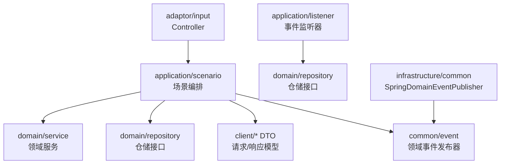
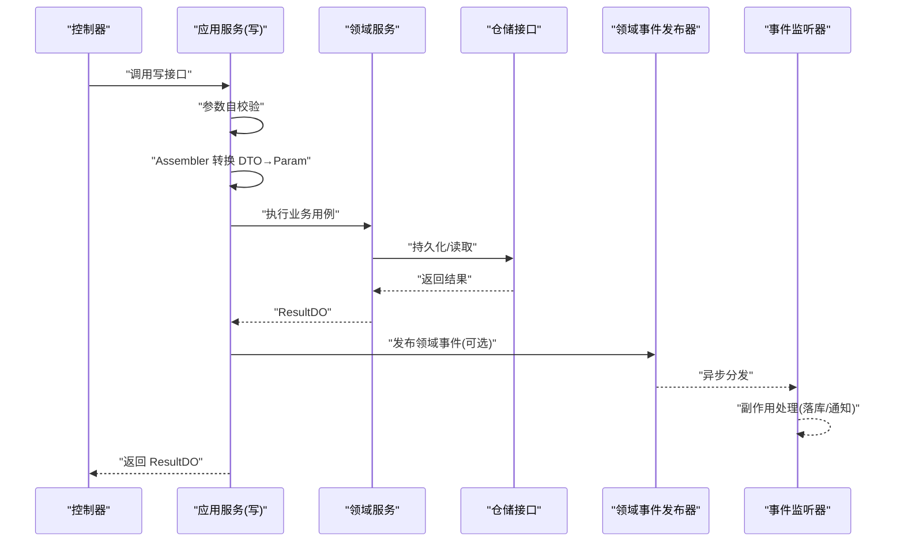
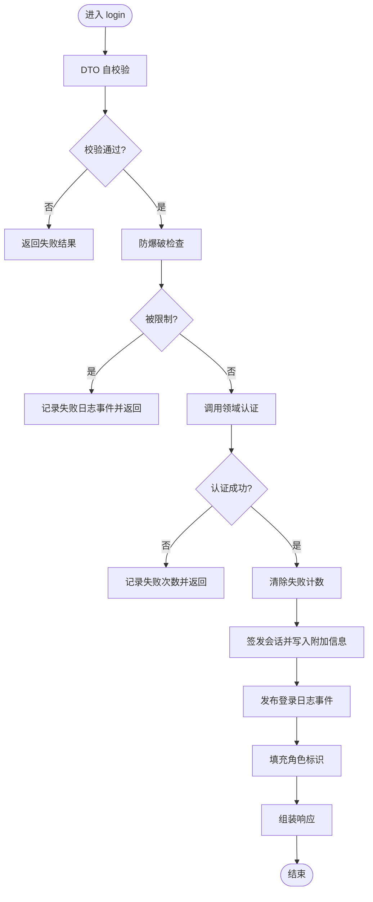
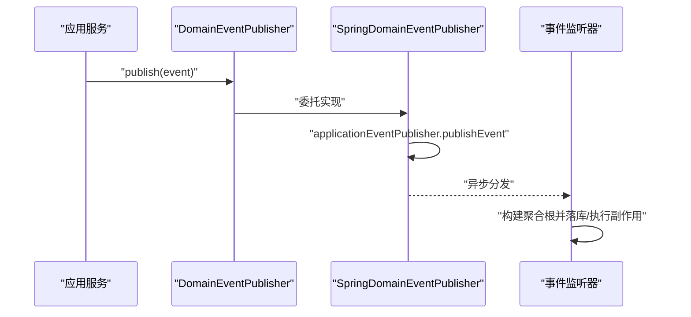
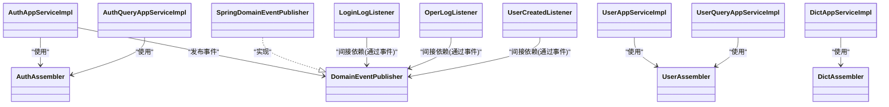

# Application应用层规范

<cite>
**本文引用的文件**   
- [README.md](file://README.md)
- [ApplicationCmdService.java](file://src/main/java/com/sunnao/spring/ddd/template/common/service/ApplicationCmdService.java)
- [ApplicationQueryService.java](file://src/main/java/com/sunnao/spring/ddd/template/common/service/ApplicationQueryService.java)
- [AuthAppServiceImpl.java](file://src/main/java/com/sunnao/spring/ddd/template/application/auth/scenario/AuthAppServiceImpl.java)
- [AuthQueryAppServiceImpl.java](file://src/main/java/com/sunnao/spring/ddd/template/application/auth/scenario/AuthQueryAppServiceImpl.java)
- [UserAppServiceImpl.java](file://src/main/java/com/sunnao/spring/ddd/template/application/system/user/scenario/UserAppServiceImpl.java)
- [UserQueryAppServiceImpl.java](file://src/main/java/com/sunnao/spring/ddd/template/application/system/user/scenario/UserQueryAppServiceImpl.java)
- [DictAppServiceImpl.java](file://src/main/java/com/sunnao/spring/ddd/template/application/system/dict/scenario/DictAppServiceImpl.java)
- [AuthAssembler.java](file://src/main/java/com/sunnao/spring/ddd/template/application/auth/assembler/AuthAssembler.java)
- [UserAssembler.java](file://src/main/java/com/sunnao/spring/ddd/template/application/system/user/assembler/UserAssembler.java)
- [DictAssembler.java](file://src/main/java/com/sunnao/spring/ddd/template/application/system/dict/assembler/DictAssembler.java)
- [DomainEventPublisher.java](file://src/main/java/com/sunnao/spring/ddd/template/common/event/DomainEventPublisher.java)
- [SpringDomainEventPublisher.java](file://src/main/java/com/sunnao/spring/ddd/template/infrastructure/common/SpringDomainEventPublisher.java)
- [LoginLogListener.java](file://src/main/java/com/sunnao/spring/ddd/template/application/system/log/listener/LoginLogListener.java)
- [OperLogListener.java](file://src/main/java/com/sunnao/spring/ddd/template/application/system/log/listener/OperLogListener.java)
- [UserCreatedListener.java](file://src/main/java/com/sunnao/spring/ddd/template/application/system/user/listener/UserCreatedListener.java)
</cite>

## 目录
1. [引言](#引言)
2. [项目结构](#项目结构)
3. [核心组件](#核心组件)
4. [架构总览](#架构总览)
5. [详细组件分析](#详细组件分析)
6. [依赖关系分析](#依赖关系分析)
7. [性能与事务边界](#性能与事务边界)
8. [故障排查指南](#故障排查指南)
9. [结论](#结论)
10. [附录：最佳实践清单](#附录最佳实践清单)

## 引言
本规范聚焦于 Application 应用层的职责定位与实践准则。应用层作为“场景编排中心”，承担以下关键职责：
- 命令服务与查询服务分离，明确写读路径与数据一致性策略
- 参数校验前置、DTO 转换（Assembler）、领域服务编排、外部系统调用收敛
- 事件发布与监听解耦，异步处理非关键路径
- 统一异常与结果封装，保障全链路稳定可观测
- 在必要时协调基础设施能力（如会话、锁、缓存），但保持对领域透明

## 项目结构
应用层按业务域组织，典型结构如下：
- application/{业务}/scenario：场景编排实现（命令/查询）
- application/{业务}/assembler：对象映射转换器（DTO ↔ 领域对象）
- application/{业务}/listener：事件监听器（可选）

图示来源
- [README.md:19-36](file://README.md#L19-L36)
- [AuthAppServiceImpl.java:1-196](file://src/main/java/com/sunnao/spring/ddd/template/application/auth/scenario/AuthAppServiceImpl.java#L1-L196)
- [DomainEventPublisher.java:1-20](file://src/main/java/com/sunnao/spring/ddd/template/common/event/DomainEventPublisher.java#L1-L20)
- [SpringDomainEventPublisher.java:1-35](file://src/main/java/com/sunnao/spring/ddd/template/infrastructure/common/SpringDomainEventPublisher.java#L1-L35)

章节来源
- [README.md:19-36](file://README.md#L19-L36)

## 核心组件
- 命令服务与查询服务
  - 通过命名与包结构区分：*AppServiceImpl 为写模式，*QueryAppServiceImpl 为读模式
  - 写模式遵循“校验 → 转换 → 领域服务 → 组装响应”的固定流程
  - 读模式遵循“校验 → 聚合根查询 → 填充跨域信息 → 组装响应”的固定流程
- Assembler（DTO 转换器）
  - 使用 MapStruct 生成 Spring Bean，负责 RequestDTO/ResponseDTO 与领域对象之间的转换
  - 复杂枚举映射、上下文注入（操作人等）通过 @Context/@Named/default 方法实现
- 领域事件与监听
  - 应用层或切面发布领域事件，基础设施层基于 Spring 事件机制异步消费
  - 监听器仅做副作用（落库、通知等），失败不阻断主流程

章节来源
- [AuthAppServiceImpl.java:1-196](file://src/main/java/com/sunnao/spring/ddd/template/application/auth/scenario/AuthAppServiceImpl.java#L1-L196)
- [AuthQueryAppServiceImpl.java:1-57](file://src/main/java/com/sunnao/spring/ddd/template/application/auth/scenario/AuthQueryAppServiceImpl.java#L1-L57)
- [UserAppServiceImpl.java:1-163](file://src/main/java/com/sunnao/spring/ddd/template/application/system/user/scenario/UserAppServiceImpl.java#L1-L163)
- [UserQueryAppServiceImpl.java:1-104](file://src/main/java/com/sunnao/spring/ddd/template/application/system/user/scenario/UserQueryAppServiceImpl.java#L1-L104)
- [DictAppServiceImpl.java:1-187](file://src/main/java/com/sunnao/spring/ddd/template/application/system/dict/scenario/DictAppServiceImpl.java#L1-L187)
- [AuthAssembler.java:1-99](file://src/main/java/com/sunnao/spring/ddd/template/application/auth/assembler/AuthAssembler.java#L1-L99)
- [UserAssembler.java:1-123](file://src/main/java/com/sunnao/spring/ddd/template/application/system/user/assembler/UserAssembler.java#L1-L123)
- [DictAssembler.java:1-178](file://src/main/java/com/sunnao/spring/ddd/template/application/system/dict/assembler/DictAssembler.java#L1-L178)
- [DomainEventPublisher.java:1-20](file://src/main/java/com/sunnao/spring/ddd/template/common/event/DomainEventPublisher.java#L1-L20)
- [SpringDomainEventPublisher.java:1-35](file://src/main/java/com/sunnao/spring/ddd/template/infrastructure/common/SpringDomainEventPublisher.java#L1-L35)
- [LoginLogListener.java:1-36](file://src/main/java/com/sunnao/spring/ddd/template/application/system/log/listener/LoginLogListener.java#L1-L36)
- [OperLogListener.java:1-36](file://src/main/java/com/sunnao/spring/ddd/template/application/system/log/listener/OperLogListener.java#L1-L36)
- [UserCreatedListener.java:1-31](file://src/main/java/com/sunnao/spring/ddd/template/application/system/user/listener/UserCreatedListener.java#L1-L31)

## 架构总览
应用层在六边形架构中的位置与交互：
- 接收来自 adaptor 的请求，完成参数校验与 DTO 转换
- 编排领域服务与仓储接口，必要时协调外部系统（如会话、锁）
- 通过领域事件发布器解耦副作用逻辑，由监听器异步执行

图示来源
- [AuthAppServiceImpl.java:66-113](file://src/main/java/com/sunnao/spring/ddd/template/application/auth/scenario/AuthAppServiceImpl.java#L66-L113)
- [DomainEventPublisher.java:11-19](file://src/main/java/com/sunnao/spring/ddd/template/common/event/DomainEventPublisher.java#L11-L19)
- [SpringDomainEventPublisher.java:23-33](file://src/main/java/com/sunnao/spring/ddd/template/infrastructure/common/SpringDomainEventPublisher.java#L23-L33)
- [LoginLogListener.java:25-34](file://src/main/java/com/sunnao/spring/ddd/template/application/system/log/listener/LoginLogListener.java#L25-L34)

## 详细组件分析

### 认证应用服务（写模式）
- 职责
  - 登录：参数校验 → 防爆破检查 → 领域认证 → 签发会话 → 写入会话附加信息 → 发布登录日志事件 → 组装响应
  - 注册：参数校验 → 创建用户 → 自动登录 → 组装响应
  - 登出：幂等处理，未登录视为成功
- 关键点
  - 参数校验在 DTO 中完成，应用层直接复用 check() 结果
  - 防爆破计数与清零逻辑在应用层控制，领域层专注认证规则
  - 会话相关调用收敛在应用层，领域层无感知
  - 登录日志以事件形式异步落库，失败不影响主流程

图示来源
- [AuthAppServiceImpl.java:66-113](file://src/main/java/com/sunnao/spring/ddd/template/application/auth/scenario/AuthAppServiceImpl.java#L66-L113)
- [AuthAppServiceImpl.java:166-180](file://src/main/java/com/sunnao/spring/ddd/template/application/auth/scenario/AuthAppServiceImpl.java#L166-L180)

章节来源
- [AuthAppServiceImpl.java:1-196](file://src/main/java/com/sunnao/spring/ddd/template/application/auth/scenario/AuthAppServiceImpl.java#L1-L196)

### 认证查询应用服务（读模式）
- 职责
  - 从会话获取当前用户 ID，查询用户聚合根，填充角色标识后转换为响应 DTO
- 关键点
  - 读路径不涉及写操作，避免引入写事务
  - 跨域信息（角色）批量填充，减少 N+1 查询

章节来源
- [AuthQueryAppServiceImpl.java:1-57](file://src/main/java/com/sunnao/spring/ddd/template/application/auth/scenario/AuthQueryAppServiceImpl.java#L1-L57)

### 用户应用服务（写模式）
- 职责
  - 创建/更新/变更状态/删除用户，均遵循“校验 → 转换 → 领域服务 → 组装响应”的流程
  - 禁用或删除成功后强制下线该用户全部会话，防止旧 token 继续访问
- 关键点
  - 操作人取自当前用户上下文，通过 Assembler 的 @Context 注入
  - 会话踢出失败仅记录日志，不阻断主流程

章节来源
- [UserAppServiceImpl.java:1-163](file://src/main/java/com/sunnao/spring/ddd/template/application/system/user/scenario/UserAppServiceImpl.java#L1-L163)

### 用户查询应用服务（读模式）
- 职责
  - 根据条件查询用户详情与分页列表，批量填充角色标识后组装响应
- 关键点
  - 分页索引从 1 开始，应用层转换为 startIndex
  - 批量查询角色键，避免逐条查询导致性能问题

章节来源
- [UserQueryAppServiceImpl.java:1-104](file://src/main/java/com/sunnao/spring/ddd/template/application/system/user/scenario/UserQueryAppServiceImpl.java#L1-L104)

### 字典应用服务（写模式）
- 职责
  - 类型与数据的增删改，遵循统一编排流程
- 关键点
  - 操作人由应用层注入，领域服务专注于业务规则
  - 状态码在 Assembler 中完成 model 与 client 的互转

章节来源
- [DictAppServiceImpl.java:1-187](file://src/main/java/com/sunnao/spring/ddd/template/application/system/dict/scenario/DictAppServiceImpl.java#L1-L187)

### Assembler（DTO 转换器）设计原则
- 职责边界
  - 仅负责对象映射与简单转换，不包含业务逻辑
- 技术选型
  - 使用 MapStruct 生成 Spring Bean，提升性能与可维护性
- 常用模式
  - 使用 @Context 注入上下文（如 operatorId）
  - 使用 default 方法与 @Named 处理枚举互转与复杂映射
  - 空值保护与集合默认值处理，避免下游 NPE

章节来源
- [AuthAssembler.java:1-99](file://src/main/java/com/sunnao/spring/ddd/template/application/auth/assembler/AuthAssembler.java#L1-L99)
- [UserAssembler.java:1-123](file://src/main/java/com/sunnao/spring/ddd/template/application/system/user/assembler/UserAssembler.java#L1-L123)
- [DictAssembler.java:1-178](file://src/main/java/com/sunnao/spring/ddd/template/application/system/dict/assembler/DictAssembler.java#L1-L178)

### 事件监听器与异步处理
- 发布机制
  - 应用层或切面通过 DomainEventPublisher 发布事件
  - 基础设施层基于 Spring ApplicationEventPublisher 广播
- 监听模式
  - 监听器使用 @Async + @EventListener 异步消费
  - 失败仅记录日志，不中断主流程
- 典型场景
  - 登录日志、操作日志、用户创建后的扩展动作

图示来源
- [DomainEventPublisher.java:11-19](file://src/main/java/com/sunnao/spring/ddd/template/common/event/DomainEventPublisher.java#L11-L19)
- [SpringDomainEventPublisher.java:23-33](file://src/main/java/com/sunnao/spring/ddd/template/infrastructure/common/SpringDomainEventPublisher.java#L23-L33)
- [LoginLogListener.java:25-34](file://src/main/java/com/sunnao/spring/ddd/template/application/system/log/listener/LoginLogListener.java#L25-L34)
- [OperLogListener.java:25-34](file://src/main/java/com/sunnao/spring/ddd/template/application/system/log/listener/OperLogListener.java#L25-L34)
- [UserCreatedListener.java:20-29](file://src/main/java/com/sunnao/spring/ddd/template/application/system/user/listener/UserCreatedListener.java#L20-L29)

章节来源
- [LoginLogListener.java:1-36](file://src/main/java/com/sunnao/spring/ddd/template/application/system/log/listener/LoginLogListener.java#L1-L36)
- [OperLogListener.java:1-36](file://src/main/java/com/sunnao/spring/ddd/template/application/system/log/listener/OperLogListener.java#L1-L36)
- [UserCreatedListener.java:1-31](file://src/main/java/com/sunnao/spring/ddd/template/application/system/user/listener/UserCreatedListener.java#L1-L31)

## 依赖关系分析
- 应用层对外暴露 client 接口定义，内部依赖 domain 层接口与 common 能力
- 基础设施层提供事件发布器的具体实现，应用层通过接口解耦
- 监听器位于 application 层，消费领域事件并调用领域仓储接口

图示来源
- [AuthAppServiceImpl.java:1-196](file://src/main/java/com/sunnao/spring/ddd/template/application/auth/scenario/AuthAppServiceImpl.java#L1-L196)
- [UserAppServiceImpl.java:1-163](file://src/main/java/com/sunnao/spring/ddd/template/application/system/user/scenario/UserAppServiceImpl.java#L1-L163)
- [DictAppServiceImpl.java:1-187](file://src/main/java/com/sunnao/spring/ddd/template/application/system/dict/scenario/DictAppServiceImpl.java#L1-L187)
- [AuthQueryAppServiceImpl.java:1-57](file://src/main/java/com/sunnao/spring/ddd/template/application/auth/scenario/AuthQueryAppServiceImpl.java#L1-L57)
- [UserQueryAppServiceImpl.java:1-104](file://src/main/java/com/sunnao/spring/ddd/template/application/system/user/scenario/UserQueryAppServiceImpl.java#L1-L104)
- [AuthAssembler.java:1-99](file://src/main/java/com/sunnao/spring/ddd/template/application/auth/assembler/AuthAssembler.java#L1-L99)
- [UserAssembler.java:1-123](file://src/main/java/com/sunnao/spring/ddd/template/application/system/user/assembler/UserAssembler.java#L1-L123)
- [DictAssembler.java:1-178](file://src/main/java/com/sunnao/spring/ddd/template/application/system/dict/assembler/DictAssembler.java#L1-L178)
- [DomainEventPublisher.java:1-20](file://src/main/java/com/sunnao/spring/ddd/template/common/event/DomainEventPublisher.java#L1-L20)
- [SpringDomainEventPublisher.java:1-35](file://src/main/java/com/sunnao/spring/ddd/template/infrastructure/common/SpringDomainEventPublisher.java#L1-L35)
- [LoginLogListener.java:1-36](file://src/main/java/com/sunnao/spring/ddd/template/application/system/log/listener/LoginLogListener.java#L1-L36)
- [OperLogListener.java:1-36](file://src/main/java/com/sunnao/spring/ddd/template/application/system/log/listener/OperLogListener.java#L1-L36)
- [UserCreatedListener.java:1-31](file://src/main/java/com/sunnao/spring/ddd/template/application/system/user/listener/UserCreatedListener.java#L1-L31)

## 性能与事务边界
- 读路径优化
  - 批量填充跨域信息（如角色），避免 N+1 查询
  - 分页查询时合理设置 startIndex 与 pageSize
- 写路径约束
  - 写模式标准流程：先加锁 → 加载/构建聚合根 → 执行业务方法 → 持久化 → finally 释放锁
  - 事务边界建议由领域服务或仓储实现管理，应用层不显式开启事务
- 异步副作用
  - 日志、通知等非关键路径采用事件驱动，降低主流程延迟
  - 监听器内异常捕获并记录日志，确保主流程不受影响

章节来源
- [UserQueryAppServiceImpl.java:68-102](file://src/main/java/com/sunnao/spring/ddd/template/application/system/user/scenario/UserQueryAppServiceImpl.java#L68-L102)
- [README.md:37-46](file://README.md#L37-L46)

## 故障排查指南
- 常见错误与处理
  - 参数校验失败：优先检查 DTO 的 check() 实现与错误码
  - 认证失败：关注防爆破计数是否达到阈值，以及领域认证返回的错误码
  - 会话踢出失败：仅记录日志，不影响主流程；检查 Sa-Token 配置与会话存储
  - 事件落库失败：查看监听器日志，确认线程池与数据库连接正常
- 可观测性
  - 全局异常处理器统一包装错误码与消息
  - TraceId 透传到异步线程，便于链路追踪
  - 操作日志注解自动采集关键信息（模块、动作、耗时、IP 等）

章节来源
- [AuthAppServiceImpl.java:107-113](file://src/main/java/com/sunnao/spring/ddd/template/application/auth/scenario/AuthAppServiceImpl.java#L107-L113)
- [UserAppServiceImpl.java:155-161](file://src/main/java/com/sunnao/spring/ddd/template/application/system/user/scenario/UserAppServiceImpl.java#L155-L161)
- [LoginLogListener.java:27-34](file://src/main/java/com/sunnao/spring/ddd/template/application/system/log/listener/LoginLogListener.java#L27-L34)
- [README.md:119-128](file://README.md#L119-L128)

## 结论
应用层应严格遵循“场景编排中心”的定位：
- 命令/查询分离，清晰表达写读意图
- 参数校验前置、DTO 转换集中、领域服务专注业务
- 事件驱动解耦副作用，异步处理提升吞吐
- 统一异常与结果封装，保障稳定性与可观测性
- 在必要时协调基础设施能力，但对领域保持透明

## 附录：最佳实践清单
- 参数验证
  - 所有 RequestDTO 覆写 check()，应用层直接复用校验结果
- 异常处理
  - 全链路返回 ResultDO，内部 catch 后转错误码，避免向上抛异常
- 日志记录
  - 关键路径记录入参与结果码，TraceId 透传至异步线程
- 性能监控
  - 操作日志注解自动采集耗时与 IP，结合链路追踪进行性能分析
- 事务边界
  - 写模式遵循“锁 → 聚合根 → 持久化 → 释放锁”，事务由领域/仓储管理
- 事件与监听
  - 非关键路径使用事件驱动，监听器内异常捕获并记录日志

章节来源
- [README.md:37-46](file://README.md#L37-L46)
- [README.md:119-128](file://README.md#L119-L128)