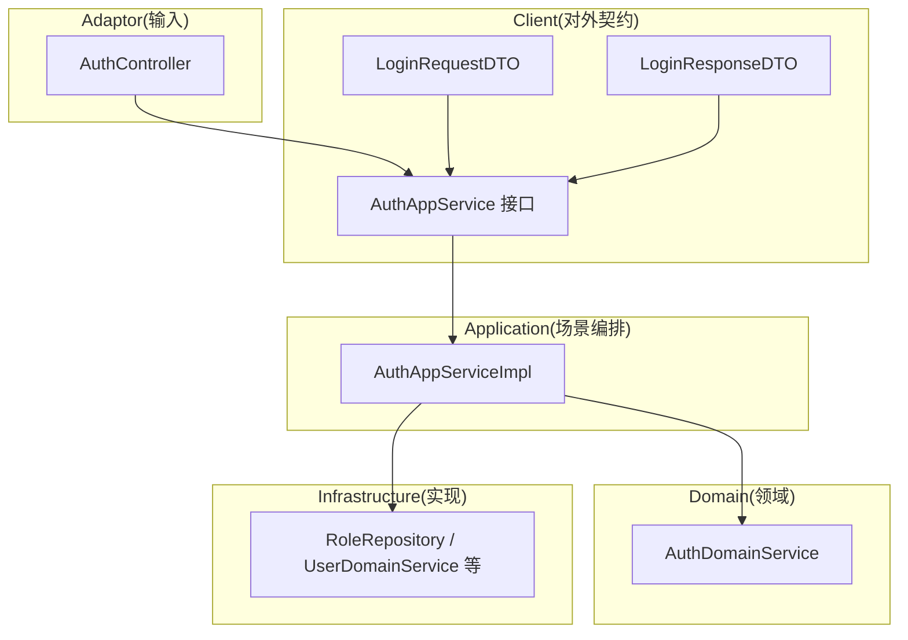
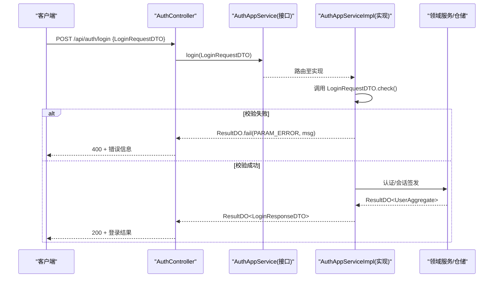
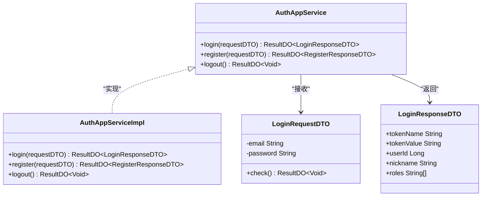
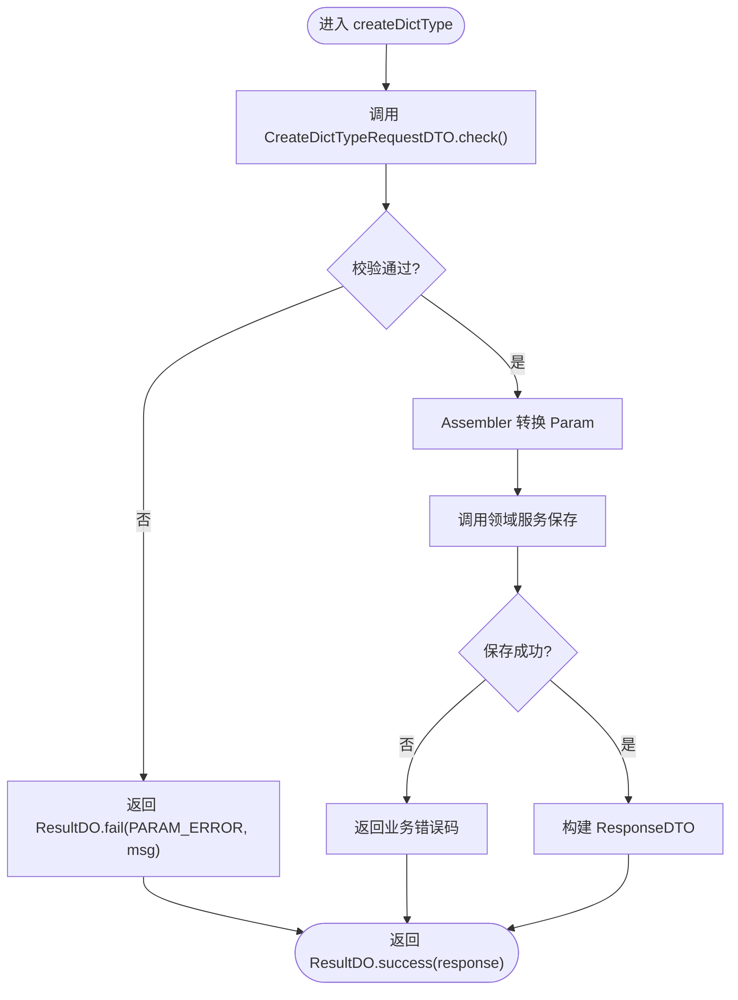
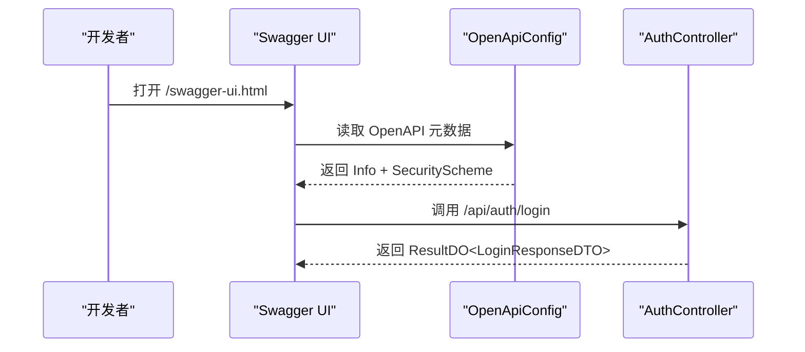
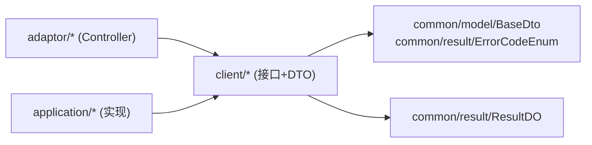

# Client客户端层规范

<cite>
**本文引用的文件列表**
- [README.md](file://README.md)
- [OpenApiConfig.java](file://src/main/java/com/sunnao/spring/ddd/template/common/config/OpenApiConfig.java)
- [BaseDto.java](file://src/main/java/com/sunnao/spring/ddd/template/common/model/BaseDto.java)
- [ErrorCodeEnum.java](file://src/main/java/com/sunnao/spring/ddd/template/common/result/ErrorCodeEnum.java)
- [AuthController.java](file://src/main/java/com/sunnao/spring/ddd/template/adaptor/auth/input/AuthController.java)
- [AuthAppService.java](file://src/main/java/com/sunnao/spring/ddd/template/client/auth/AuthAppService.java)
- [LoginRequestDTO.java](file://src/main/java/com/sunnao/spring/ddd/template/client/auth/req/LoginRequestDTO.java)
- [LoginResponseDTO.java](file://src/main/java/com/sunnao/spring/ddd/template/client/auth/res/LoginResponseDTO.java)
- [AuthAppServiceImpl.java](file://src/main/java/com/sunnao/spring/ddd/template/application/auth/scenario/AuthAppServiceImpl.java)
- [DictAppService.java](file://src/main/java/com/sunnao/spring/ddd/template/client/system/dict/DictAppService.java)
- [DictTypeDTO.java](file://src/main/java/com/sunnao/spring/ddd/template/client/system/dict/model/DictTypeDTO.java)
- [DictStatusEnum.java](file://src/main/java/com/sunnao/spring/ddd/template/client/system/dict/enums/DictStatusEnum.java)
</cite>

## 目录
1. [引言](#引言)
2. [项目结构](#项目结构)
3. [核心组件](#核心组件)
4. [架构总览](#架构总览)
5. [详细组件分析](#详细组件分析)
6. [依赖关系分析](#依赖关系分析)
7. [性能与兼容性考虑](#性能与兼容性考虑)
8. [故障排查指南](#故障排查指南)
9. [结论](#结论)
10. [附录：最佳实践清单](#附录最佳实践清单)

## 引言
本规范聚焦于 client 客户端层的职责定位与设计准则。client 层作为对外 API 契约定义的核心，承担以下关键职责：
- 定义应用服务接口（写模式与查询模式分离），明确输入输出契约
- 管理请求/响应 DTO、模型与枚举，确保数据传输对象的标准化与规范化
- 通过自校验机制保障入参合法性，避免在应用层散落校验逻辑
- 与 OpenAPI 文档配置联动，实现接口文档的自动生成与维护
- 统一错误码与结果封装，保证跨层一致的错误处理语义
- 提供版本管理与兼容策略建议，支撑长期演进

## 项目结构
client 层位于 src/main/java/com/sunnao/spring/ddd/template/client 下，按业务域组织，典型子包包括 req、res、model、enums 以及 AppService 接口。其调用方向为 adaptor → application → domain → infrastructure，client 仅暴露对外契约，不依赖领域或基础设施实现。

图示来源
- [AuthController.java:1-70](file://src/main/java/com/sunnao/spring/ddd/template/adaptor/auth/input/AuthController.java#L1-L70)
- [AuthAppService.java:1-39](file://src/main/java/com/sunnao/spring/ddd/template/client/auth/AuthAppService.java#L1-L39)
- [AuthAppServiceImpl.java:1-196](file://src/main/java/com/sunnao/spring/ddd/template/application/auth/scenario/AuthAppServiceImpl.java#L1-L196)
- [LoginRequestDTO.java:1-50](file://src/main/java/com/sunnao/spring/ddd/template/client/auth/req/LoginRequestDTO.java#L1-L50)
- [LoginResponseDTO.java:1-47](file://src/main/java/com/sunnao/spring/ddd/template/client/auth/res/LoginResponseDTO.java#L1-L47)

章节来源
- [README.md:19-36](file://README.md#L19-L36)

## 核心组件
本节从“接口契约”“DTO 设计”“枚举管理”“错误码与结果”“文档生成”五个维度阐述 client 层的关键构件与约定。

- 接口契约
  - 写模式接口继承 ApplicationCmdService，返回 ResultDO<T>，方法签名清晰表达意图与参数类型
  - 查询模式接口独立命名（如 XxxQueryAppService），与写操作解耦
  - 示例：认证写模式接口 AuthAppService 定义了登录、注册、登出；字典写模式接口 DictAppService 定义了类型与数据的增删改

- DTO 设计原则
  - 所有 DTO 继承 BaseDto，具备统一的 check() 自校验能力
  - RequestDTO 覆写 check() 完成字段非空、格式、一致性校验；ResponseDTO 仅承载展示数据
  - model 包用于跨接口共享的数据模型（如 DictTypeDTO）
  - 禁止在 DTO 中引入领域对象或基础设施依赖，保持自包含

- 枚举管理
  - 对外枚举置于 client/{业务}/enums，面向调用方稳定暴露
  - 每个枚举需包含 code 与 description，并提供 getByCode 等工具方法
  - 示例：DictStatusEnum 提供启用/禁用状态及反向查找

- 错误码与结果
  - 全局错误码集中定义于 ErrorCodeEnum，禁止散落的字符串字面量
  - 全链路统一返回 ResultDO，失败路径通过错误码与消息描述问题
  - 参数校验失败优先使用 PARAM_ERROR 并附带具体提示

- 文档生成
  - OpenAPI 配置集中于 OpenApiConfig，声明安全方案与 token 头名称
  - Controller 使用 @Operation/@Tag 标注，结合 OpenAPI 自动产出文档
  - 文档地址 /swagger-ui.html，需在 Authorize 中填写 sa-token 值以调试受保护接口

章节来源
- [AuthAppService.java:1-39](file://src/main/java/com/sunnao/spring/ddd/template/client/auth/AuthAppService.java#L1-L39)
- [DictAppService.java:1-62](file://src/main/java/com/sunnao/spring/ddd/template/client/system/dict/DictAppService.java#L1-L62)
- [BaseDto.java:1-23](file://src/main/java/com/sunnao/spring/ddd/template/common/model/BaseDto.java#L1-L23)
- [LoginRequestDTO.java:1-50](file://src/main/java/com/sunnao/spring/ddd/template/client/auth/req/LoginRequestDTO.java#L1-L50)
- [LoginResponseDTO.java:1-47](file://src/main/java/com/sunnao/spring/ddd/template/client/auth/res/LoginResponseDTO.java#L1-L47)
- [DictTypeDTO.java:1-36](file://src/main/java/com/sunnao/spring/ddd/template/client/system/dict/model/DictTypeDTO.java#L1-L36)
- [DictStatusEnum.java:1-43](file://src/main/java/com/sunnao/spring/ddd/template/client/system/dict/enums/DictStatusEnum.java#L1-L43)
- [ErrorCodeEnum.java:1-209](file://src/main/java/com/sunnao/spring/ddd/template/common/result/ErrorCodeEnum.java#L1-L209)
- [OpenApiConfig.java:1-42](file://src/main/java/com/sunnao/spring/ddd/template/common/config/OpenApiConfig.java#L1-L42)

## 架构总览
下图展示了从 HTTP 请求到应用层处理的完整流程，突出 client 层在契约定义中的位置。

图示来源
- [AuthController.java:32-40](file://src/main/java/com/sunnao/spring/ddd/template/adaptor/auth/input/AuthController.java#L32-L40)
- [AuthAppService.java:14-30](file://src/main/java/com/sunnao/spring/ddd/template/client/auth/AuthAppService.java#L14-L30)
- [AuthAppServiceImpl.java:66-113](file://src/main/java/com/sunnao/spring/ddd/template/application/auth/scenario/AuthAppServiceImpl.java#L66-L113)
- [LoginRequestDTO.java:36-48](file://src/main/java/com/sunnao/spring/ddd/template/client/auth/req/LoginRequestDTO.java#L36-L48)
- [LoginResponseDTO.java:17-46](file://src/main/java/com/sunnao/spring/ddd/template/client/auth/res/LoginResponseDTO.java#L17-L46)

## 详细组件分析

### 认证模块（auth）
- 接口契约
  - AuthAppService 定义登录、注册、登出三个写操作，统一返回 ResultDO<T>
  - 查询接口由 AuthQueryAppService 负责（当前用户信息等）
- DTO 设计
  - LoginRequestDTO 继承 BaseDto，覆写 check() 进行邮箱与密码校验，失败时返回带错误码的结果
  - LoginResponseDTO 包含 tokenName、tokenValue、userId、nickname、roles 等必要字段
- 应用层编排
  - AuthAppServiceImpl 执行：参数自校验 → 防爆破检查 → 领域认证 → 签发 token → 填充角色标识 → 组装响应
  - 异常统一捕获并转换为系统错误码，同时发布登录日志事件

图示来源
- [AuthAppService.java:14-38](file://src/main/java/com/sunnao/spring/ddd/template/client/auth/AuthAppService.java#L14-L38)
- [LoginRequestDTO.java:16-48](file://src/main/java/com/sunnao/spring/ddd/template/client/auth/req/LoginRequestDTO.java#L16-L48)
- [LoginResponseDTO.java:17-46](file://src/main/java/com/sunnao/spring/ddd/template/client/auth/res/LoginResponseDTO.java#L17-L46)
- [AuthAppServiceImpl.java:66-194](file://src/main/java/com/sunnao/spring/ddd/template/application/auth/scenario/AuthAppServiceImpl.java#L66-L194)

章节来源
- [AuthController.java:32-68](file://src/main/java/com/sunnao/spring/ddd/template/adaptor/auth/input/AuthController.java#L32-L68)
- [AuthAppService.java:14-38](file://src/main/java/com/sunnao/spring/ddd/template/client/auth/AuthAppService.java#L14-L38)
- [AuthAppServiceImpl.java:66-194](file://src/main/java/com/sunnao/spring/ddd/template/application/auth/scenario/AuthAppServiceImpl.java#L66-L194)
- [LoginRequestDTO.java:36-48](file://src/main/java/com/sunnao/spring/ddd/template/client/auth/req/LoginRequestDTO.java#L36-L48)
- [LoginResponseDTO.java:22-46](file://src/main/java/com/sunnao/spring/ddd/template/client/auth/res/LoginResponseDTO.java#L22-L46)

### 字典模块（system.dict）
- 接口契约
  - DictAppService 定义字典类型与数据的创建、更新、删除等操作，统一返回 ResultDO<T>
- DTO 设计
  - DictTypeDTO 作为共享模型，包含 id、typeKey、typeName、status、remark、createAt、updateAt 等字段
- 枚举管理
  - DictStatusEnum 提供启用/禁用状态，code 与 description 对应数据库存储与前端展示，并提供 getByCode 工具方法

图示来源
- [DictAppService.java:19-28](file://src/main/java/com/sunnao/spring/ddd/template/client/system/dict/DictAppService.java#L19-L28)
- [DictTypeDTO.java:17-35](file://src/main/java/com/sunnao/spring/ddd/template/client/system/dict/model/DictTypeDTO.java#L17-L35)
- [DictStatusEnum.java:9-41](file://src/main/java/com/sunnao/spring/ddd/template/client/system/dict/enums/DictStatusEnum.java#L9-L41)

章节来源
- [DictAppService.java:12-61](file://src/main/java/com/sunnao/spring/ddd/template/client/system/dict/DictAppService.java#L12-L61)
- [DictTypeDTO.java:17-35](file://src/main/java/com/sunnao/spring/ddd/template/client/system/dict/model/DictTypeDTO.java#L17-L35)
- [DictStatusEnum.java:9-41](file://src/main/java/com/sunnao/spring/ddd/template/client/system/dict/enums/DictStatusEnum.java#L9-L41)

### 接口文档与安全性
- OpenAPI 配置
  - OpenApiConfig 声明标题、版本与安全方案，要求请求头携带 sa-token
  - 文档访问路径 /swagger-ui.html，JSON 文档 /v3/api-docs
- Controller 注解
  - AuthController 使用 @Tag 与 @Operation 标注接口，便于文档生成
  - 写接口可附加 @OperLog 记录审计信息

图示来源
- [OpenApiConfig.java:26-40](file://src/main/java/com/sunnao/spring/ddd/template/common/config/OpenApiConfig.java#L26-L40)
- [AuthController.java:21-40](file://src/main/java/com/sunnao/spring/ddd/template/adaptor/auth/input/AuthController.java#L21-L40)

章节来源
- [OpenApiConfig.java:1-42](file://src/main/java/com/sunnao/spring/ddd/template/common/config/OpenApiConfig.java#L1-L42)
- [AuthController.java:21-40](file://src/main/java/com/sunnao/spring/ddd/template/adaptor/auth/input/AuthController.java#L21-L40)

## 依赖关系分析
- client 层对 common 的依赖
  - BaseDto：提供 check() 自校验基类
  - ErrorCodeEnum：统一错误码
  - ResultDO：统一结果封装
- client 层对 application 的解耦
  - client 仅定义接口，application 层实现，遵循依赖倒置
- 外部集成点
  - OpenAPI 文档生成与 Sa-Token 鉴权头配置

图示来源
- [BaseDto.java:1-23](file://src/main/java/com/sunnao/spring/ddd/template/common/model/BaseDto.java#L1-L23)
- [ErrorCodeEnum.java:1-209](file://src/main/java/com/sunnao/spring/ddd/template/common/result/ErrorCodeEnum.java#L1-L209)
- [AuthController.java:1-20](file://src/main/java/com/sunnao/spring/ddd/template/adaptor/auth/input/AuthController.java#L1-L20)
- [AuthAppServiceImpl.java:1-40](file://src/main/java/com/sunnao/spring/ddd/template/application/auth/scenario/AuthAppServiceImpl.java#L1-L40)

章节来源
- [BaseDto.java:1-23](file://src/main/java/com/sunnao/spring/ddd/template/common/model/BaseDto.java#L1-L23)
- [ErrorCodeEnum.java:1-209](file://src/main/java/com/sunnao/spring/ddd/template/common/result/ErrorCodeEnum.java#L1-L209)
- [AuthController.java:1-20](file://src/main/java/com/sunnao/spring/ddd/template/adaptor/auth/input/AuthController.java#L1-L20)
- [AuthAppServiceImpl.java:1-40](file://src/main/java/com/sunnao/spring/ddd/template/application/auth/scenario/AuthAppServiceImpl.java#L1-L40)

## 性能与兼容性考虑
- 性能
  - 参数自校验在 DTO 层完成，减少应用层分支判断开销
  - 登录流程中防爆破检查与异步日志事件不影响主流程性能
- 兼容性
  - 新增字段应向后兼容，避免破坏现有调用方解析
  - 变更枚举值需谨慎，必要时保留旧值映射或提供迁移脚本
  - 接口版本可通过 URL 前缀或请求头控制，逐步淘汰旧版本

[本节为通用指导，无需源码引用]

## 故障排查指南
- 常见错误码
  - PARAM_ERROR：参数校验失败，检查 DTO.check() 逻辑
  - AUTH_FAIL/AUTH_LOCKED：认证失败或防爆破触发
  - SYSTEM_ERROR：系统异常，查看应用日志与堆栈
- 排查步骤
  - 确认 OpenAPI 文档中接口定义与实际实现一致
  - 核对请求头是否携带正确的 sa-token
  - 检查 DTO 校验规则与业务约束是否匹配

章节来源
- [ErrorCodeEnum.java:14-98](file://src/main/java/com/sunnao/spring/ddd/template/common/result/ErrorCodeEnum.java#L14-L98)
- [AuthAppServiceImpl.java:107-113](file://src/main/java/com/sunnao/spring/ddd/template/application/auth/scenario/AuthAppServiceImpl.java#L107-L113)

## 结论
client 层作为对外 API 契约定义的核心，通过清晰的接口拆分、规范的 DTO 设计、集中的错误码与结果封装、以及自动化的文档生成，有效提升了系统的可维护性与协作效率。配合版本管理与兼容性策略，可在长期演进中保持稳定的对外契约。

[本节为总结性内容，无需源码引用]

## 附录：最佳实践清单
- 接口设计
  - 写/查分离，方法名体现意图，参数与返回值严格限定
- DTO 规范
  - 继承 BaseDto，覆写 check() 完成自校验；ResponseDTO 仅承载展示数据
- 枚举管理
  - 对外枚举包含 code 与 description，并提供 getByCode 工具方法
- 错误处理
  - 统一使用 ErrorCodeEnum 与 ResultDO，禁止散落字符串字面量
- 文档与安全
  - 使用 OpenAPI 注解与配置，确保文档与实现同步；正确配置 sa-token 头
- 版本与兼容
  - 新增字段向后兼容；变更枚举谨慎评估影响；通过 URL 或请求头控制版本

[本节为通用指导，无需源码引用]