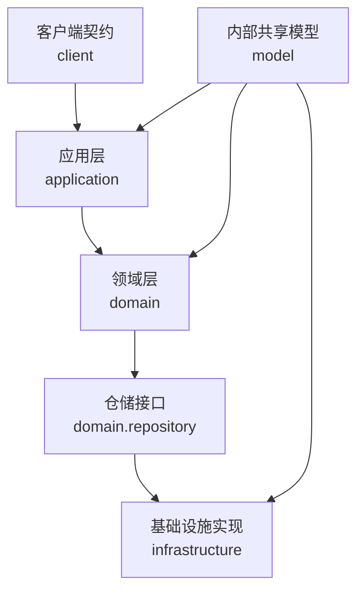
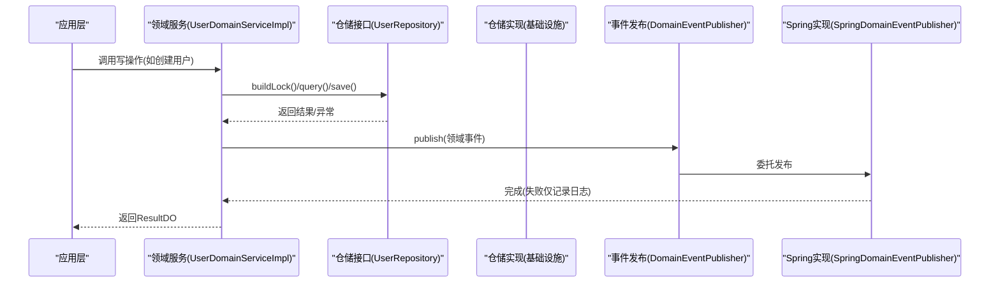
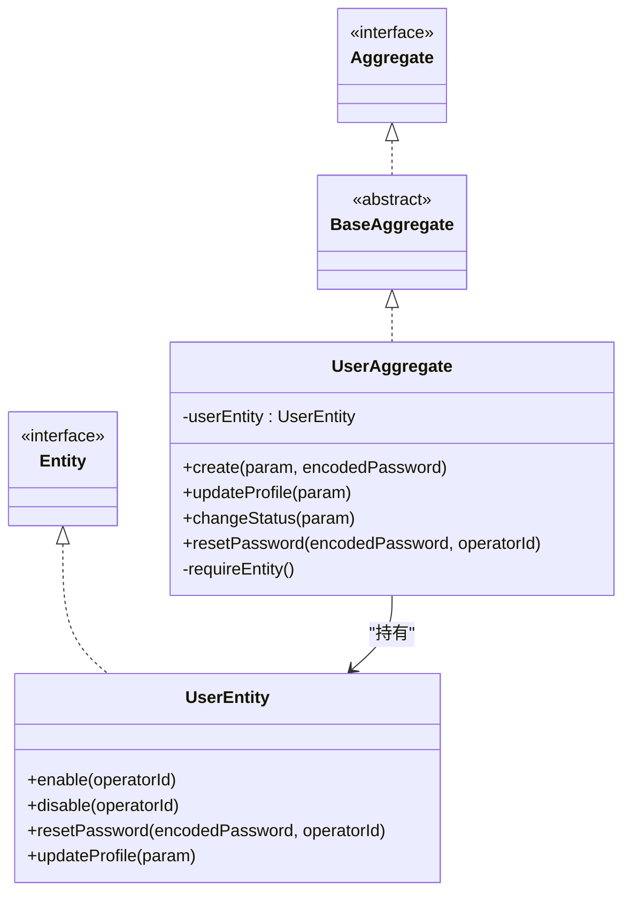
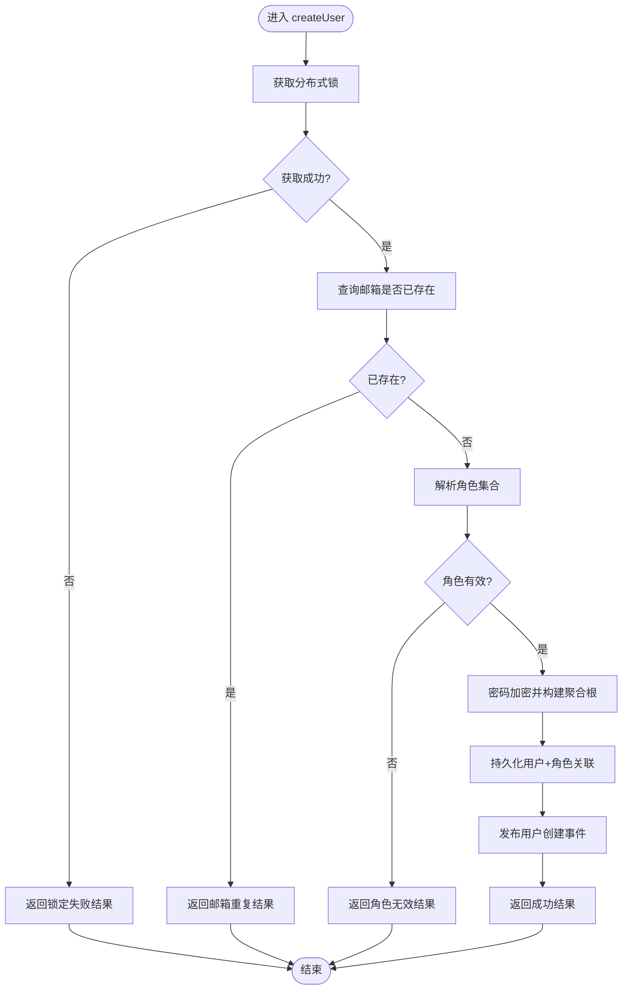
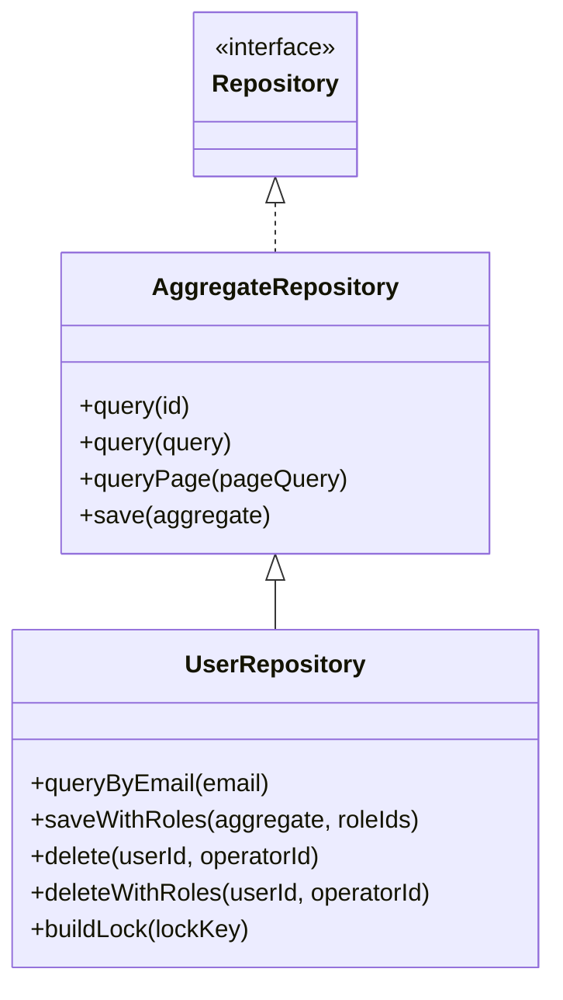
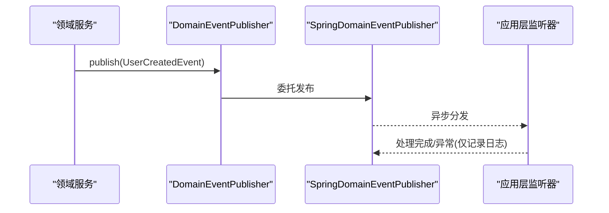
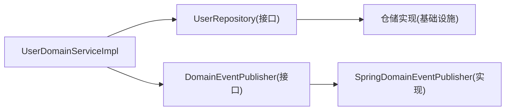

# Domain领域层规范

<cite>
**本文引用的文件**
- [README.md](file://README.md)
- [ddd-model-layer.md](file://docs/rule/ddd/ddd-model-layer.md)
- [Aggregate.java](file://src/main/java/com/sunnao/spring/ddd/template/common/model/Aggregate.java)
- [Entity.java](file://src/main/java/com/sunnao/spring/ddd/template/common/model/Entity.java)
- [BaseValue.java](file://src/main/java/com/sunnao/spring/ddd/template/common/model/BaseValue.java)
- [Value.java](file://src/main/java/com/sunnao/spring/ddd/template/common/model/Value.java)
- [BaseAggregate.java](file://src/main/java/com/sunnao/spring/ddd/template/common/model/BaseAggregate.java)
- [AggregateRepository.java](file://src/main/java/com/sunnao/spring/ddd/template/common/model/AggregateRepository.java)
- [UserAggregate.java](file://src/main/java/com/sunnao/spring/ddd/template/domain/system/user/model/aggregate/UserAggregate.java)
- [UserDomainServiceImpl.java](file://src/main/java/com/sunnao/spring/ddd/template/domain/system/user/service/UserDomainServiceImpl.java)
- [UserRepository.java](file://src/main/java/com/sunnao/spring/ddd/template/domain/system/user/repository/UserRepository.java)
- [UserCreatedEvent.java](file://src/main/java/com/sunnao/spring/ddd/template/domain/system/user/event/UserCreatedEvent.java)
- [DomainEventPublisher.java](file://src/main/java/com/sunnao/spring/ddd/template/common/event/DomainEventPublisher.java)
- [SpringDomainEventPublisher.java](file://src/main/java/com/sunnao/spring/ddd/template/infrastructure/common/SpringDomainEventPublisher.java)
</cite>

## 目录
1. [引言](#引言)
2. [项目结构](#项目结构)
3. [核心组件](#核心组件)
4. [架构总览](#架构总览)
5. [详细组件分析](#详细组件分析)
6. [依赖分析](#依赖分析)
7. [性能考虑](#性能考虑)
8. [故障排查指南](#故障排查指南)
9. [结论](#结论)
10. [附录](#附录)

## 引言
本规范聚焦于领域驱动设计（DDD）在领域层的落地实践，围绕聚合根、实体、值对象与领域服务的设计原则展开，结合仓库中用户域的实现，给出可操作的边界划分策略、业务内聚性保证方法、状态管理与规则封装方式、领域事件定义与发布机制、测试策略、重构指导与性能优化建议。同时明确禁止滥用“设计模式”的约束原因与替代方案，确保领域模型高内聚、低耦合、语义清晰。

## 项目结构
本项目遵循六边形架构与分层约定：adaptor → application → domain → repository（infrastructure 实现），并配套 client 与 model 共享层。领域层位于 domain/{业务}/model 与 service、repository 接口，承载聚合根、实体、值对象、领域服务与仓储契约。

图表来源
- [README.md:19-35](file://README.md#L19-L35)

章节来源
- [README.md:19-35](file://README.md#L19-L35)

## 核心组件
- 聚合根与实体
  - 聚合根负责维护业务不变量与一致性边界，对外暴露行为而非直接暴露属性；实体是聚合内的有标识对象，承载生命周期与状态变更。
  - 通过基类 Aggregate、BaseAggregate 与接口 Entity、Value、BaseValue 统一建模抽象，便于跨域复用与类型约束。
- 领域服务
  - 编排跨聚合或跨仓储的复杂流程，如加锁、加载聚合根、执行业务方法、持久化、发布事件等，保持领域逻辑的高内聚。
- 仓储接口
  - 以领域语言描述数据访问契约，屏蔽基础设施细节；提供分页、条件查询、保存与组合操作（如 saveWithRoles）。
- 领域事件
  - 用于解耦通信，领域服务在关键动作后发布事件，由监听器异步消费，失败不影响主流程。

章节来源
- [Aggregate.java:1-4](file://src/main/java/com/sunnao/spring/ddd/template/common/model/Aggregate.java#L1-L4)
- [BaseAggregate.java:1-5](file://src/main/java/com/sunnao/spring/ddd/template/common/model/BaseAggregate.java#L1-L5)
- [Entity.java:1-4](file://src/main/java/com/sunnao/spring/ddd/template/common/model/Entity.java#L1-L4)
- [Value.java:1-4](file://src/main/java/com/sunnao/spring/ddd/template/common/model/Value.java#L1-L4)
- [BaseValue.java:1-4](file://src/main/java/com/sunnao/spring/ddd/template/common/model/BaseValue.java#L1-L4)
- [AggregateRepository.java:1-43](file://src/main/java/com/sunnao/spring/ddd/template/common/model/AggregateRepository.java#L1-L43)
- [UserRepository.java:1-65](file://src/main/java/com/sunnao/spring/ddd/template/domain/system/user/repository/UserRepository.java#L1-L65)
- [UserDomainServiceImpl.java:1-204](file://src/main/java/com/sunnao/spring/ddd/template/domain/system/user/service/UserDomainServiceImpl.java#L1-L204)
- [UserCreatedEvent.java:1-39](file://src/main/java/com/sunnao/spring/ddd/template/domain/system/user/event/UserCreatedEvent.java#L1-L39)
- [DomainEventPublisher.java:1-20](file://src/main/java/com/sunnao/spring/ddd/template/common/event/DomainEventPublisher.java#L1-L20)
- [SpringDomainEventPublisher.java:1-35](file://src/main/java/com/sunnao/spring/ddd/template/infrastructure/common/SpringDomainEventPublisher.java#L1-L35)

## 架构总览
领域层通过仓储接口与基础设施解耦，通过领域事件与外部系统解耦；应用层仅做场景编排与转换，不承载业务规则。

图表来源
- [UserDomainServiceImpl.java:45-89](file://src/main/java/com/sunnao/spring/ddd/template/domain/system/user/service/UserDomainServiceImpl.java#L45-L89)
- [UserRepository.java:19-65](file://src/main/java/com/sunnao/spring/ddd/template/domain/system/user/repository/UserRepository.java#L19-L65)
- [DomainEventPublisher.java:11-19](file://src/main/java/com/sunnao/spring/ddd/template/common/event/DomainEventPublisher.java#L11-L19)
- [SpringDomainEventPublisher.java:23-33](file://src/main/java/com/sunnao/spring/ddd/template/infrastructure/common/SpringDomainEventPublisher.java#L23-L33)

## 详细组件分析

### 聚合根与实体：UserAggregate 与 UserEntity
- 聚合根职责
  - 作为一致性边界入口，对外暴露 create/updateProfile/changeStatus/resetPassword 等行为方法，内部委派给实体执行具体变更。
  - 通过 requireEntity 等方法保障前置条件与不变量。
- 实体职责
  - 承载用户属性与细粒度状态变更（如 enable/disable/resetPassword），对参数进行最小校验。
- 设计要点
  - 避免直接暴露实体属性，所有变更必须经过聚合根方法，保证业务语义与不变量。
  - 将跨实体的复杂规则下沉到领域服务，聚合根只关注自身一致性。

图表来源
- [BaseAggregate.java:1-5](file://src/main/java/com/sunnao/spring/ddd/template/common/model/BaseAggregate.java#L1-L5)
- [Aggregate.java:1-4](file://src/main/java/com/sunnao/spring/ddd/template/common/model/Aggregate.java#L1-L4)
- [UserAggregate.java:1-113](file://src/main/java/com/sunnao/spring/ddd/template/domain/system/user/model/aggregate/UserAggregate.java#L1-L113)
- [Entity.java:1-4](file://src/main/java/com/sunnao/spring/ddd/template/common/model/Entity.java#L1-L4)

章节来源
- [UserAggregate.java:1-113](file://src/main/java/com/sunnao/spring/ddd/template/domain/system/user/model/aggregate/UserAggregate.java#L1-L113)

### 领域服务：UserDomainServiceImpl
- 标准写模式流程
  - 获取锁 → 加载/构建聚合根 → 执行业务方法 → 持久化 → 发布领域事件 → 释放锁。
- 并发与一致性
  - 使用仓储提供的 LevelLock 按邮箱/用户ID加锁，防止重复创建与竞态更新。
- 异常与结果
  - 捕获业务异常与系统异常，统一转换为 ResultDO，不向上抛异常。
- 跨聚合协作
  - 解析角色集合时依赖 RoleRepository，但保持领域服务为唯一编排点，避免散落的跨域调用。

图表来源
- [UserDomainServiceImpl.java:45-89](file://src/main/java/com/sunnao/spring/ddd/template/domain/system/user/service/UserDomainServiceImpl.java#L45-L89)

章节来源
- [UserDomainServiceImpl.java:1-204](file://src/main/java/com/sunnao/spring/ddd/template/domain/system/user/service/UserDomainServiceImpl.java#L1-L204)

### 仓储接口：UserRepository 与 AggregateRepository
- 能力边界
  - 继承通用聚合仓储能力（按ID/条件/分页查询、保存），扩展用户特有查询与组合操作（如 queryByEmail、saveWithRoles、deleteWithRoles）。
- 锁能力
  - 提供 buildLock 工厂方法，使领域服务能构造合适的锁实例，屏蔽 Redis/JVM 差异。
- 事务与一致性
  - 组合操作在同一事务内完成，任一失败整体回滚，保证跨表/跨聚合的一致性。

图表来源
- [AggregateRepository.java:1-43](file://src/main/java/com/sunnao/spring/ddd/template/common/model/AggregateRepository.java#L1-L43)
- [UserRepository.java:1-65](file://src/main/java/com/sunnao/spring/ddd/template/domain/system/user/repository/UserRepository.java#L1-L65)

章节来源
- [UserRepository.java:1-65](file://src/main/java/com/sunnao/spring/ddd/template/domain/system/user/repository/UserRepository.java#L1-L65)
- [AggregateRepository.java:1-43](file://src/main/java/com/sunnao/spring/ddd/template/common/model/AggregateRepository.java#L1-L43)

### 领域事件：UserCreatedEvent 与发布机制
- 事件定义
  - 继承基础领域事件，携带必要上下文（userId、email、nickname、operatorId）。
- 发布与消费
  - 领域服务在持久化成功后发布事件；基础设施基于 Spring ApplicationEventPublisher 广播，监听器异步消费，失败仅记录日志，不影响主流程。
- 解耦通信
  - 通过事件将“用户创建”这一事实传播给其他子系统（如审计、通知、缓存刷新），降低模块间耦合。

图表来源
- [UserCreatedEvent.java:1-39](file://src/main/java/com/sunnao/spring/ddd/template/domain/system/user/event/UserCreatedEvent.java#L1-L39)
- [DomainEventPublisher.java:11-19](file://src/main/java/com/sunnao/spring/ddd/template/common/event/DomainEventPublisher.java#L11-L19)
- [SpringDomainEventPublisher.java:23-33](file://src/main/java/com/sunnao/spring/ddd/template/infrastructure/common/SpringDomainEventPublisher.java#L23-L33)

章节来源
- [UserCreatedEvent.java:1-39](file://src/main/java/com/sunnao/spring/ddd/template/domain/system/user/event/UserCreatedEvent.java#L1-L39)
- [DomainEventPublisher.java:1-20](file://src/main/java/com/sunnao/spring/ddd/template/common/event/DomainEventPublisher.java#L1-L20)
- [SpringDomainEventPublisher.java:1-35](file://src/main/java/com/sunnao/spring/ddd/template/infrastructure/common/SpringDomainEventPublisher.java#L1-L35)

### 值对象与共享模型
- 值对象
  - 通过 Value 与 BaseValue 抽象，强调不可变性与等价性比较，适合表达金额、地址、权限键集合等无标识概念。
- 共享模型
  - model 层存放跨模块共享枚举与通用业务概念，允许 domain/application/adaptor/infrastructure 依赖，但禁止 client 依赖，以避免对外暴露内部实现。

章节来源
- [Value.java:1-4](file://src/main/java/com/sunnao/spring/ddd/template/common/model/Value.java#L1-L4)
- [BaseValue.java:1-4](file://src/main/java/com/sunnao/spring/ddd/template/common/model/BaseValue.java#L1-L4)
- [ddd-model-layer.md:1-97](file://docs/rule/ddd/ddd-model-layer.md#L1-L97)

## 依赖分析
- 领域层依赖
  - 领域服务依赖仓储接口与领域事件发布器接口，不依赖基础设施实现。
  - 聚合根/实体依赖领域模型与公共基类，不依赖框架。
- 基础设施层依赖
  - 仓储实现依赖数据库与缓存技术栈，对领域层透明。
- 事件发布解耦
  - 领域服务仅依赖 DomainEventPublisher 接口，具体实现由基础设施注入，符合依赖倒置。

图表来源
- [UserDomainServiceImpl.java:1-204](file://src/main/java/com/sunnao/spring/ddd/template/domain/system/user/service/UserDomainServiceImpl.java#L1-L204)
- [UserRepository.java:1-65](file://src/main/java/com/sunnao/spring/ddd/template/domain/system/user/repository/UserRepository.java#L1-L65)
- [DomainEventPublisher.java:1-20](file://src/main/java/com/sunnao/spring/ddd/template/common/event/DomainEventPublisher.java#L1-L20)
- [SpringDomainEventPublisher.java:1-35](file://src/main/java/com/sunnao/spring/ddd/template/infrastructure/common/SpringDomainEventPublisher.java#L1-L35)

章节来源
- [UserDomainServiceImpl.java:1-204](file://src/main/java/com/sunnao/spring/ddd/template/domain/system/user/service/UserDomainServiceImpl.java#L1-L204)
- [UserRepository.java:1-65](file://src/main/java/com/sunnao/spring/ddd/template/domain/system/user/repository/UserRepository.java#L1-L65)
- [DomainEventPublisher.java:1-20](file://src/main/java/com/sunnao/spring/ddd/template/common/event/DomainEventPublisher.java#L1-L20)
- [SpringDomainEventPublisher.java:1-35](file://src/main/java/com/sunnao/spring/ddd/template/infrastructure/common/SpringDomainEventPublisher.java#L1-L35)

## 性能考虑
- 锁粒度与范围
  - 按邮箱/用户ID维度加锁，避免全局锁导致吞吐下降；尽量缩小临界区，减少锁持有时间。
- 事件异步化
  - 领域事件采用异步监听，避免阻塞主流程；发布失败仅记录日志，不影响业务正确性。
- 查询与分页
  - 使用仓储的分页能力，避免一次性加载大量数据；合理设计查询条件，减少全表扫描。
- 事务边界
  - 组合操作（如 saveWithRoles）在同一事务内完成，减少跨事务导致的额外补偿成本。

[本节为通用指导，无需特定文件引用]

## 故障排查指南
- 常见错误码与异常
  - 参数错误、数据不存在、邮箱重复、角色不存在、锁定失败、系统错误等，均通过 ResultDO 返回，便于上层统一处理。
- 事件发布失败
  - 发布失败仅记录日志，不中断主流程；需检查事件监听器配置与线程池资源。
- 锁冲突
  - 若频繁出现锁定失败，检查锁键设计与业务并发热点，必要时调整锁粒度或引入重试策略。

章节来源
- [UserDomainServiceImpl.java:45-89](file://src/main/java/com/sunnao/spring/ddd/template/domain/system/user/service/UserDomainServiceImpl.java#L45-L89)
- [SpringDomainEventPublisher.java:23-33](file://src/main/java/com/sunnao/spring/ddd/template/infrastructure/common/SpringDomainEventPublisher.java#L23-L33)

## 结论
本规范以用户域为例，系统化阐述了领域层的核心概念与实践路径：通过聚合根与实体封装业务不变量，领域服务编排跨聚合流程，仓储接口屏蔽技术细节，领域事件实现解耦通信。配合严格的依赖约束与统一的异常/结果约定，可实现高内聚、低耦合、语义清晰的领域模型。建议在新增业务时严格遵循本规范，持续演进领域边界与规则，保持模型的可维护性与可扩展性。

[本节为总结性内容，无需特定文件引用]

## 附录

### 领域模型测试策略
- 单元测试
  - 针对聚合根的业务规则编写单测，验证不变量与状态流转；针对领域服务使用 Mock 仓储，验证写模式流程与事件发布。
- 集成测试
  - 需要真实数据库与缓存时，通过环境变量控制启用；缺失环境自动跳过，保证本地开发体验。

章节来源
- [README.md:129-146](file://README.md#L129-L146)

### 重构指导
- 拆分过大的聚合
  - 当聚合根承担过多职责时，按业务不变量拆分为多个聚合，并通过领域事件协调。
- 提取值对象
  - 将重复出现的无标识概念抽取为值对象，提升可读性与复用性。
- 收敛领域服务
  - 将散落跨聚合的调用收敛到领域服务，避免在应用层或控制器中散布业务逻辑。

[本节为通用指导，无需特定文件引用]

### 禁止滥用“设计模式”的约束与替代方案
- 约束原因
  - 过度使用设计模式会导致领域模型被技术套路主导，掩盖真实业务语义，增加理解与维护成本。
- 替代方案
  - 优先使用领域语言与不变量表达意图；用值对象表达概念，用聚合根保护一致性，用领域服务编排复杂流程；仅在确有必要时使用模式，并以领域语义命名与组织代码。

[本节为通用指导，无需特定文件引用]