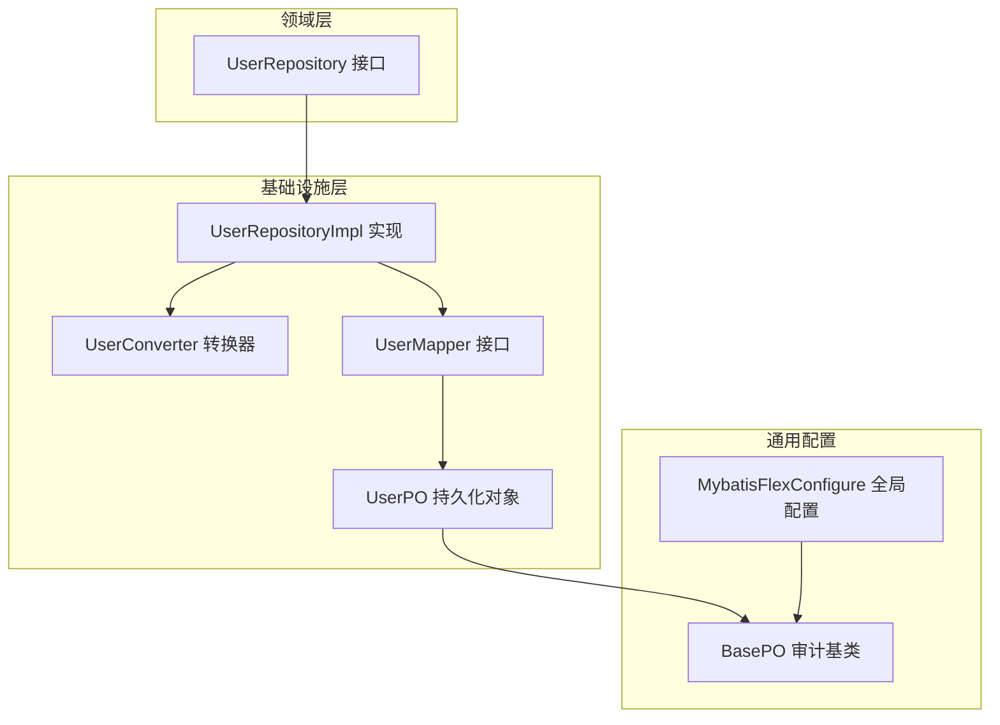
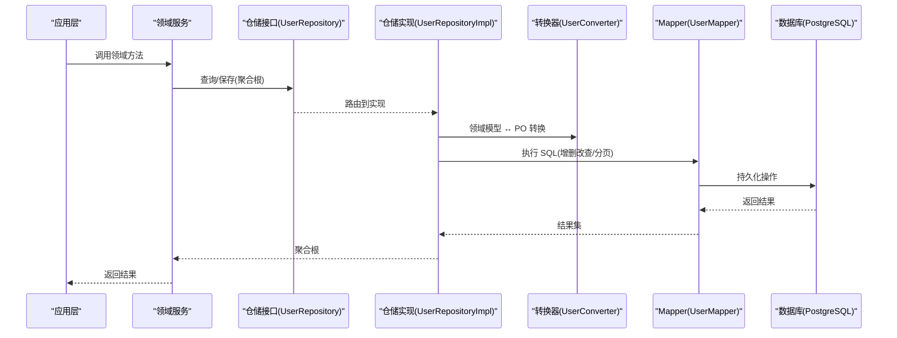
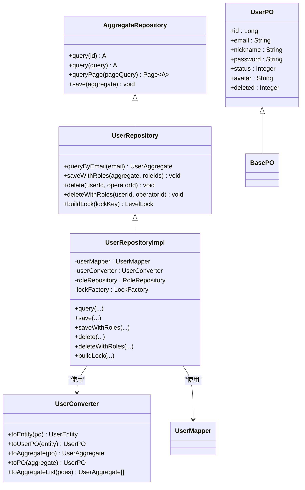
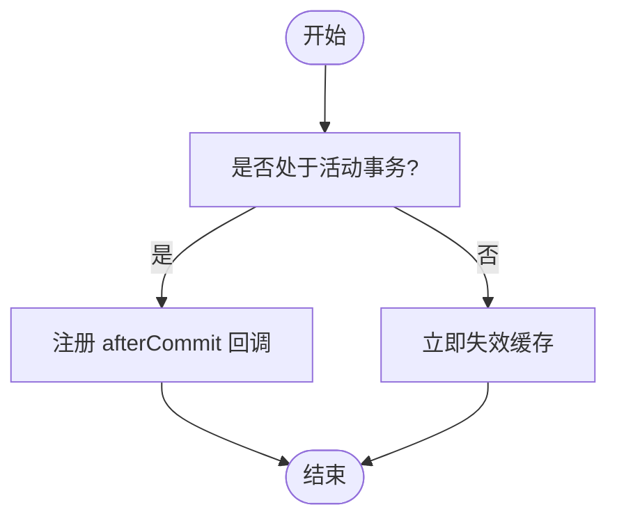
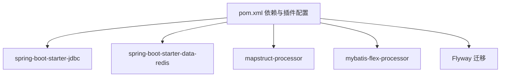

# Infrastructure基础设施层规范

<cite>
**本文引用的文件**
- [README.md](file://README.md)
- [MybatisFlexConfigure.java](file://src/main/java/com/sunnao/spring/ddd/template/common/config/MybatisFlexConfigure.java)
- [BasePO.java](file://src/main/java/com/sunnao/spring/ddd/template/common/model/BasePO.java)
- [AggregateRepository.java](file://src/main/java/com/sunnao/spring/ddd/template/common/model/AggregateRepository.java)
- [UserRepository.java](file://src/main/java/com/sunnao/spring/ddd/template/domain/system/user/repository/UserRepository.java)
- [UserRepositoryImpl.java](file://src/main/java/com/sunnao/spring/ddd/template/infrastructure/system/user/repository/UserRepositoryImpl.java)
- [UserConverter.java](file://src/main/java/com/sunnao/spring/ddd/template/infrastructure/system/user/converter/UserConverter.java)
- [UserMapper.java](file://src/main/java/com/sunnao/spring/ddd/template/infrastructure/system/user/mysql/mapper/UserMapper.java)
- [UserPO.java](file://src/main/java/com/sunnao/spring/ddd/template/infrastructure/system/user/mysql/po/UserPO.java)
- [application.yaml](file://src/main/resources/application.yaml)
- [pom.xml](file://pom.xml)
- [LockFactory.java](file://src/main/java/com/sunnao/spring/ddd/template/common/lock/LockFactory.java)
- [DictRepositoryImpl.java](file://src/main/java/com/sunnao/spring/ddd/template/infrastructure/system/dict/repository/DictRepositoryImpl.java)
</cite>

## 目录
1. [引言](#引言)
2. [项目结构](#项目结构)
3. [核心组件](#核心组件)
4. [架构总览](#架构总览)
5. [详细组件分析](#详细组件分析)
6. [依赖关系分析](#依赖关系分析)
7. [性能与优化实践](#性能与优化实践)
8. [故障排查指南](#故障排查指南)
9. [结论](#结论)
10. [附录：示例与最佳实践清单](#附录示例与最佳实践清单)

## 引言
本规范聚焦于基础设施层（Infrastructure）的技术实现职责，围绕仓储接口的具体实现、数据持久化策略、MyBatis-Flex 使用规范、PO 对象设计与 Mapper 接口定义、数据转换器（Converter）设计模式、第三方服务集成防腐层封装、异常处理、事务管理、缓存策略与性能优化等主题，提供可落地的指导与示例路径。

## 项目结构
基础设施层位于 infrastructure 包下，按业务域组织，典型子目录包括：
- repository：仓储实现类，负责聚合根与 PO 的转换及数据访问编排
- mysql/po：持久化对象（PO），继承 BasePO，声明表映射与审计字段
- mysql/mapper：MyBatis-Flex 的 Mapper 接口，仅被对应 Repository 实现调用
- converter：MapStruct 转换器，负责领域模型与 PO 之间的纯技术转换

图表来源
- [UserRepository.java:1-65](file://src/main/java/com/sunnao/spring/ddd/template/domain/system/user/repository/UserRepository.java#L1-L65)
- [UserRepositoryImpl.java:1-191](file://src/main/java/com/sunnao/spring/ddd/template/infrastructure/system/user/repository/UserRepositoryImpl.java#L1-L191)
- [UserConverter.java:1-85](file://src/main/java/com/sunnao/spring/ddd/template/infrastructure/system/user/converter/UserConverter.java#L1-L85)
- [UserMapper.java:1-12](file://src/main/java/com/sunnao/spring/ddd/template/infrastructure/system/user/mysql/mapper/UserMapper.java#L1-L12)
- [UserPO.java:1-60](file://src/main/java/com/sunnao/spring/ddd/template/infrastructure/system/user/mysql/po/UserPO.java#L1-L60)
- [MybatisFlexConfigure.java:1-73](file://src/main/java/com/sunnao/spring/ddd/template/common/config/MybatisFlexConfigure.java#L1-L73)
- [BasePO.java:1-41](file://src/main/java/com/sunnao/spring/ddd/template/common/model/BasePO.java#L1-L41)

章节来源
- [README.md:19-46](file://README.md#L19-L46)

## 核心组件
- 仓储接口与基类
  - AggregateRepository 定义通用的 query/save/queryPage 能力，所有领域仓储接口均继承该基类以复用基础能力。
  - 领域仓储接口（如 UserRepository）在 domain 层声明，关注“对外契约”，不包含实现细节。
- 仓储实现
  - 基础设施层的 RepositoryImpl 负责：
    - 通过 Converter 进行领域模型与 PO 的转换
    - 通过 Mapper 执行 MyBatis-Flex 的数据访问
    - 统一捕获并包装为 RepositoryException，保证上层稳定
    - 组合跨仓储操作时，使用 @Transactional 确保一致性
- 持久化对象与审计
  - PO 继承 BasePO，由 MybatisFlexConfigure 的全局监听器自动填充 createAt/updateAt/createBy/updateBy。
  - 逻辑删除通过 @Column(isLogicDelete = true) 配合 mybatis-flex.global-config 的 deleted-value-of-logic-delete 生效。
- 数据转换器（Converter）
  - 使用 MapStruct 注解 @Mapper(componentModel = "spring")，将枚举、时间等类型在领域模型与 PO 之间安全转换。
  - 转换器只承担纯技术转换，不承载业务规则。
- 锁与并发控制
  - 通过 LockFactory.buildLock 构建分布式或 JVM 级锁，仓储实现暴露 buildLock 供领域服务使用。

章节来源
- [AggregateRepository.java:1-43](file://src/main/java/com/sunnao/spring/ddd/template/common/model/AggregateRepository.java#L1-L43)
- [UserRepository.java:1-65](file://src/main/java/com/sunnao/spring/ddd/template/domain/system/user/repository/UserRepository.java#L1-L65)
- [UserRepositoryImpl.java:1-191](file://src/main/java/com/sunnao/spring/ddd/template/infrastructure/system/user/repository/UserRepositoryImpl.java#L1-L191)
- [BasePO.java:1-41](file://src/main/java/com/sunnao/spring/ddd/template/common/model/BasePO.java#L1-L41)
- [MybatisFlexConfigure.java:1-73](file://src/main/java/com/sunnao/spring/ddd/template/common/config/MybatisFlexConfigure.java#L1-L73)
- [UserConverter.java:1-85](file://src/main/java/com/sunnao/spring/ddd/template/infrastructure/system/user/converter/UserConverter.java#L1-L85)
- [LockFactory.java:1-40](file://src/main/java/com/sunnao/spring/ddd/template/common/lock/LockFactory.java#L1-L40)

## 架构总览
基础设施层作为“数据与外部系统”的适配边界，遵循依赖倒置原则：领域层定义仓储接口，基础设施层提供实现；应用层通过领域服务间接访问仓储，避免直接耦合数据库或第三方服务。

图表来源
- [UserRepository.java:1-65](file://src/main/java/com/sunnao/spring/ddd/template/domain/system/user/repository/UserRepository.java#L1-L65)
- [UserRepositoryImpl.java:1-191](file://src/main/java/com/sunnao/spring/ddd/template/infrastructure/system/user/repository/UserRepositoryImpl.java#L1-L191)
- [UserConverter.java:1-85](file://src/main/java/com/sunnao/spring/ddd/template/infrastructure/system/user/converter/UserConverter.java#L1-L85)
- [UserMapper.java:1-12](file://src/main/java/com/sunnao/spring/ddd/template/infrastructure/system/user/mysql/mapper/UserMapper.java#L1-L12)

## 详细组件分析

### 仓储接口与实现（用户域示例）
- 接口职责
  - 定义基于 ID、条件、分页的查询，以及 save、saveWithRoles、delete、deleteWithRoles 等写操作契约。
  - 提供 buildLock 用于获取分级锁实例。
- 实现要点
  - 查询：通过 UserMapper 执行 selectOneById/selectOneByQuery/paginate，再经 UserConverter 转换为聚合根。
  - 保存：新增时 insertSelective 回填 ID，更新时 update 非空字段；审计字段由全局监听器填充。
  - 事务性组合：saveWithRoles/deleteWithRoles 在同一事务内完成用户与角色关联的写入/清理。
  - 异常处理：统一捕获并抛出 RepositoryException，携带错误码与上下文信息。
  - 分页：将 PageQuery 转换为 MyBatis-Flex 的分页参数，最终包装为 Spring Data Page。

图表来源
- [AggregateRepository.java:1-43](file://src/main/java/com/sunnao/spring/ddd/template/common/model/AggregateRepository.java#L1-L43)
- [UserRepository.java:1-65](file://src/main/java/com/sunnao/spring/ddd/template/domain/system/user/repository/UserRepository.java#L1-L65)
- [UserRepositoryImpl.java:1-191](file://src/main/java/com/sunnao/spring/ddd/template/infrastructure/system/user/repository/UserRepositoryImpl.java#L1-L191)
- [UserConverter.java:1-85](file://src/main/java/com/sunnao/spring/ddd/template/infrastructure/system/user/converter/UserConverter.java#L1-L85)
- [UserMapper.java:1-12](file://src/main/java/com/sunnao/spring/ddd/template/infrastructure/system/user/mysql/mapper/UserMapper.java#L1-L12)
- [UserPO.java:1-60](file://src/main/java/com/sunnao/spring/ddd/template/infrastructure/system/user/mysql/po/UserPO.java#L1-L60)

章节来源
- [UserRepository.java:1-65](file://src/main/java/com/sunnao/spring/ddd/template/domain/system/user/repository/UserRepository.java#L1-L65)
- [UserRepositoryImpl.java:1-191](file://src/main/java/com/sunnao/spring/ddd/template/infrastructure/system/user/repository/UserRepositoryImpl.java#L1-L191)

### 数据转换器（Converter）设计规范
- 使用 MapStruct 注解 @Mapper(componentModel = "spring")，由 Spring 容器管理生命周期。
- 针对枚举类型，使用 @Named 自定义转换方法，实现 Integer ↔ 领域枚举的双向转换。
- 提供 toAggregate/toPO 默认方法，屏蔽内部实体与聚合根的组装细节。
- 列表转换提供 toAggregateList，简化批量场景。

章节来源
- [UserConverter.java:1-85](file://src/main/java/com/sunnao/spring/ddd/template/infrastructure/system/user/converter/UserConverter.java#L1-L85)

### MyBatis-Flex 使用规范
- Mapper 接口继承 BaseMapper<T>，无需手写 XML，即可使用内置 CRUD 与分页能力。
- 逻辑删除通过 @Column(isLogicDelete = true) 与全局配置 deleted-value-of-logic-delete 共同生效。
- 全局审计字段填充通过 MybatisFlexConfigure 注册 InsertListener/UpdateListener，对 BasePO 子类生效。

章节来源
- [UserMapper.java:1-12](file://src/main/java/com/sunnao/spring/ddd/template/infrastructure/system/user/mysql/mapper/UserMapper.java#L1-L12)
- [UserPO.java:1-60](file://src/main/java/com/sunnao/spring/ddd/template/infrastructure/system/user/mysql/po/UserPO.java#L1-L60)
- [MybatisFlexConfigure.java:1-73](file://src/main/java/com/sunnao/spring/ddd/template/common/config/MybatisFlexConfigure.java#L1-L73)
- [application.yaml:38-42](file://src/main/resources/application.yaml#L38-L42)

### PO 对象设计与审计字段
- 所有 PO 继承 BasePO，包含 createAt/updateAt/createBy/updateBy 审计字段。
- 主键使用 @Id(keyType = Auto)，自增策略由数据库驱动决定。
- 敏感字段可在 toString 中排除，避免日志泄露。

章节来源
- [BasePO.java:1-41](file://src/main/java/com/sunnao/spring/ddd/template/common/model/BasePO.java#L1-L41)
- [UserPO.java:1-60](file://src/main/java/com/sunnao/spring/ddd/template/infrastructure/system/user/mysql/po/UserPO.java#L1-L60)

### 事务管理与组合操作
- 对涉及多表或多仓储的组合写操作，使用 @Transactional(rollbackFor = Exception.class) 包裹，确保原子性。
- 示例：saveWithRoles 先保存用户，再委托 RoleRepository 保存角色关联；deleteWithRoles 先逻辑删除用户，再清理角色关联。

章节来源
- [UserRepositoryImpl.java:119-163](file://src/main/java/com/sunnao/spring/ddd/template/infrastructure/system/user/repository/UserRepositoryImpl.java#L119-L163)

### 缓存策略与失效时机
- 字典模块采用“提交后失效”策略：若存在活动事务，则注册 afterCommit 回调，在事务提交后失效缓存；无事务时立即失效。
- 失败降级：缓存失效失败仅记录警告日志，TTL 兜底保障可用性。

图表来源
- [DictRepositoryImpl.java:316-345](file://src/main/java/com/sunnao/spring/ddd/template/infrastructure/system/dict/repository/DictRepositoryImpl.java#L316-L345)

章节来源
- [DictRepositoryImpl.java:311-345](file://src/main/java/com/sunnao/spring/ddd/template/infrastructure/system/dict/repository/DictRepositoryImpl.java#L311-L345)

### 第三方服务集成防腐层
- 应用层定义外部服务接口（如 FileStorage），基础设施层提供具体实现（本地磁盘/S3）。
- 通过条件装配（@ConditionalOnProperty）切换实现，避免硬编码依赖。
- 存储类型随元数据落库，便于后续迁移与兼容。

章节来源
- [README.md:97-117](file://README.md#L97-L117)

## 依赖关系分析
- 编译期处理器
  - MapStruct 处理器与 MyBatis-Flex 处理器需在 maven-compiler-plugin 中显式配置，以保证生成代码可用。
- 运行时依赖
  - spring-boot-starter-jdbc 显式引入（Spring Boot 4.x 不再默认包含）。
  - spring-boot-starter-data-redis 提供 Redis 客户端与连接池。
  - Flyway 用于数据库迁移。

图表来源
- [pom.xml:35-62](file://pom.xml#L35-L62)
- [pom.xml:183-196](file://pom.xml#L183-L196)

章节来源
- [pom.xml:35-62](file://pom.xml#L35-L62)
- [pom.xml:183-196](file://pom.xml#L183-L196)

## 性能与优化实践
- 连接池与 Redis 连接池
  - 通过 application.yaml 配置 Redis Lettuce 连接池参数（max-active/max-idle/min-idle），结合业务 QPS 调整。
  - 数据库连接池由 Spring Boot 自动装配，建议根据实际负载调优 HikariCP 相关参数（未在仓库中显式配置）。
- 分页与查询
  - 使用 MyBatis-Flex 的 paginate 进行服务端分页，避免全量加载。
  - 查询条件尽量走索引列，减少 LIKE 前缀模糊匹配范围。
- 审计与转换开销
  - 审计字段由全局监听器填充，注意避免在热点路径上频繁创建大量 PO。
  - MapStruct 转换在启动期生成实现类，运行期开销低。
- 事务边界
  - 合理缩小事务范围，避免长事务导致连接占用与锁竞争。
- 缓存策略
  - 读多写少场景优先缓存；写操作采用“提交后失效”策略，防止脏读。

章节来源
- [application.yaml:14-31](file://src/main/resources/application.yaml#L14-L31)
- [UserRepositoryImpl.java:72-87](file://src/main/java/com/sunnao/spring/ddd/template/infrastructure/system/user/repository/UserRepositoryImpl.java#L72-L87)
- [DictRepositoryImpl.java:316-345](file://src/main/java/com/sunnao/spring/ddd/template/infrastructure/system/dict/repository/DictRepositoryImpl.java#L316-L345)

## 故障排查指南
- 常见异常
  - 查询/保存/删除失败：仓储实现会捕获底层异常并抛出 RepositoryException，携带错误码与上下文，便于定位。
  - 事务回滚：检查组合写方法是否标注 @Transactional，并确保抛出的异常属于 rollbackFor 范围。
  - 审计字段未填充：确认 PO 继承 BasePO，且 MybatisFlexConfigure 已启用。
- 排查步骤
  - 查看仓储实现中的日志输出，定位具体失败的 SQL 或参数。
  - 检查 application.yaml 中数据库与 Redis 连接配置是否正确。
  - 对于缓存问题，观察 afterCommit 回调是否触发，必要时增加调试日志。

章节来源
- [UserRepositoryImpl.java:50-117](file://src/main/java/com/sunnao/spring/ddd/template/infrastructure/system/user/repository/UserRepositoryImpl.java#L50-L117)
- [MybatisFlexConfigure.java:23-27](file://src/main/java/com/sunnao/spring/ddd/template/common/config/MybatisFlexConfigure.java#L23-L27)
- [application.yaml:9-21](file://src/main/resources/application.yaml#L9-L21)

## 结论
基础设施层通过清晰的职责划分与标准化实现，确保了领域模型的纯净性与数据访问的可维护性。依托 MyBatis-Flex 与 MapStruct，结合全局审计、事务与缓存策略，能够在保证一致性的同时提升开发效率与运行性能。建议在新增业务域时严格遵循本规范，保持仓储接口与实现的解耦、转换器的纯技术属性以及异常与事务的统一治理。

## 附录：示例与最佳实践清单
- 正确实现仓储接口
  - 参考路径：[UserRepositoryImpl.java:1-191](file://src/main/java/com/sunnao/spring/ddd/template/infrastructure/system/user/repository/UserRepositoryImpl.java#L1-L191)
- 处理数据访问异常
  - 参考路径：[UserRepositoryImpl.java:50-117](file://src/main/java/com/sunnao/spring/ddd/template/infrastructure/system/user/repository/UserRepositoryImpl.java#L50-L117)
- 使用 MyBatis-Flex 的 Mapper 与分页
  - 参考路径：[UserMapper.java:1-12](file://src/main/java/com/sunnao/spring/ddd/template/infrastructure/system/user/mysql/mapper/UserMapper.java#L1-L12)、[UserRepositoryImpl.java:72-87](file://src/main/java/com/sunnao/spring/ddd/template/infrastructure/system/user/repository/UserRepositoryImpl.java#L72-L87)
- PO 设计与审计字段
  - 参考路径：[UserPO.java:1-60](file://src/main/java/com/sunnao/spring/ddd/template/infrastructure/system/user/mysql/po/UserPO.java#L1-L60)、[BasePO.java:1-41](file://src/main/java/com/sunnao/spring/ddd/template/common/model/BasePO.java#L1-L41)、[MybatisFlexConfigure.java:23-27](file://src/main/java/com/sunnao/spring/ddd/template/common/config/MybatisFlexConfigure.java#L23-L27)
- 数据转换器（Converter）
  - 参考路径：[UserConverter.java:1-85](file://src/main/java/com/sunnao/spring/ddd/template/infrastructure/system/user/converter/UserConverter.java#L1-L85)
- 事务管理与组合操作
  - 参考路径：[UserRepositoryImpl.java:119-163](file://src/main/java/com/sunnao/spring/ddd/template/infrastructure/system/user/repository/UserRepositoryImpl.java#L119-L163)
- 缓存策略与失效时机
  - 参考路径：[DictRepositoryImpl.java:316-345](file://src/main/java/com/sunnao/spring/ddd/template/infrastructure/system/dict/repository/DictRepositoryImpl.java#L316-L345)
- 第三方服务集成防腐层
  - 参考路径：[README.md:97-117](file://README.md#L97-L117)
- 连接池与依赖配置
  - 参考路径：[application.yaml:14-31](file://src/main/resources/application.yaml#L14-L31)、[pom.xml:35-62](file://pom.xml#L35-L62)