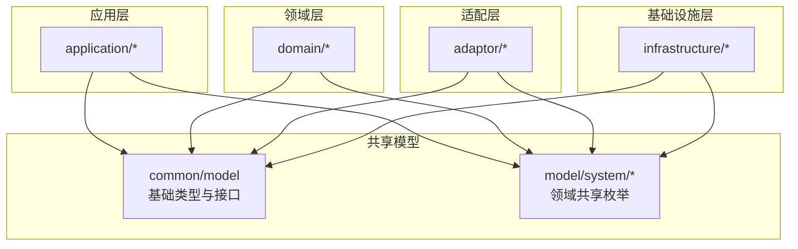
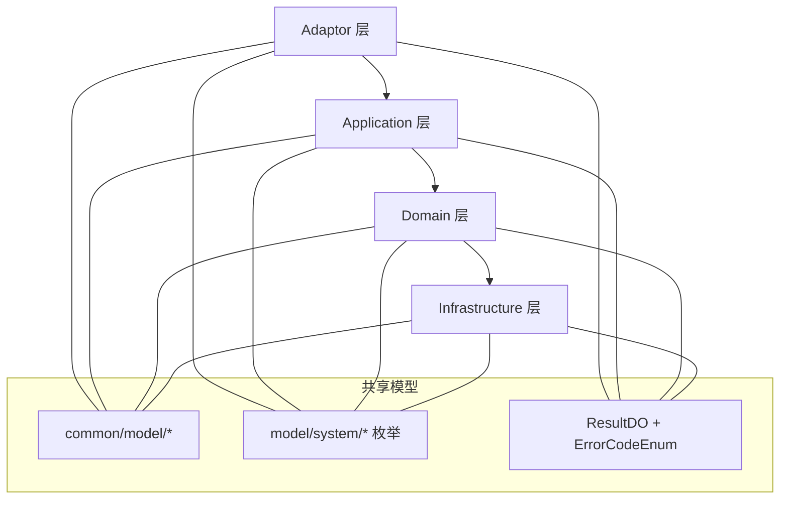
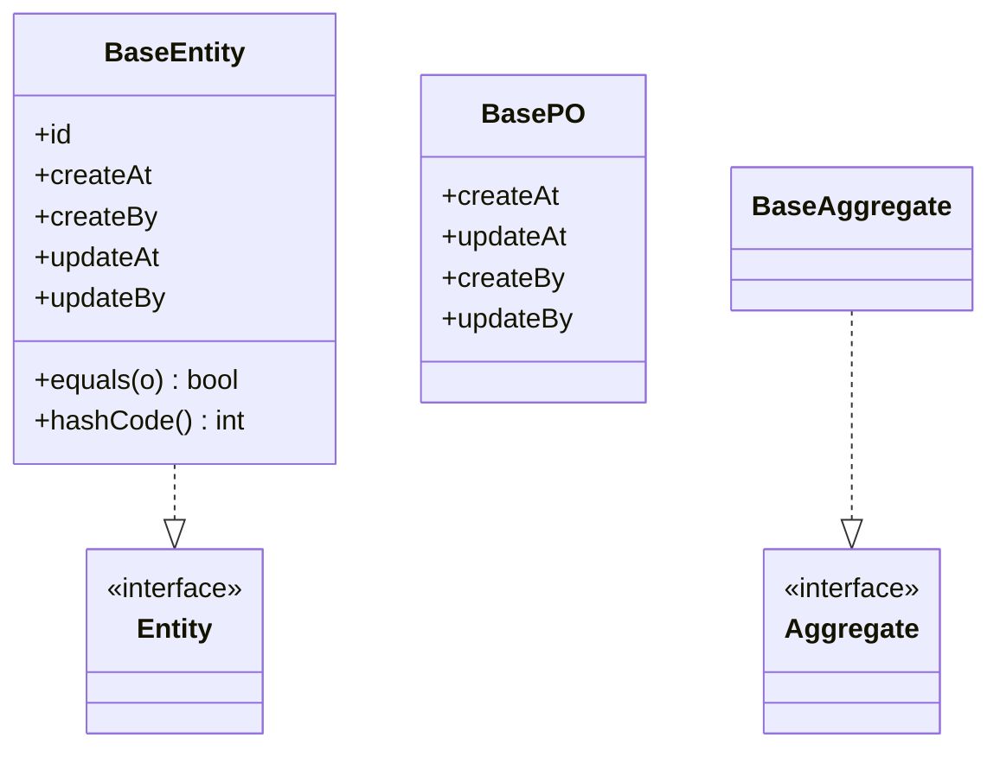
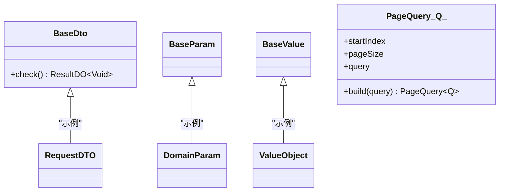
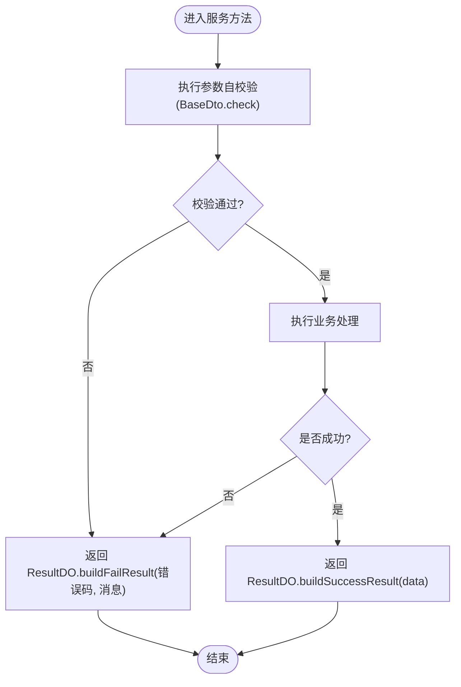
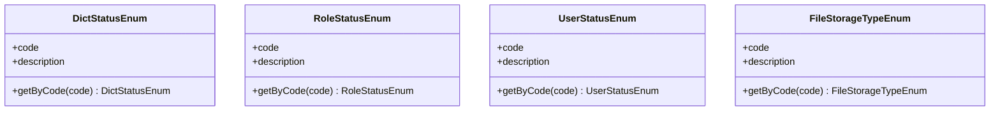
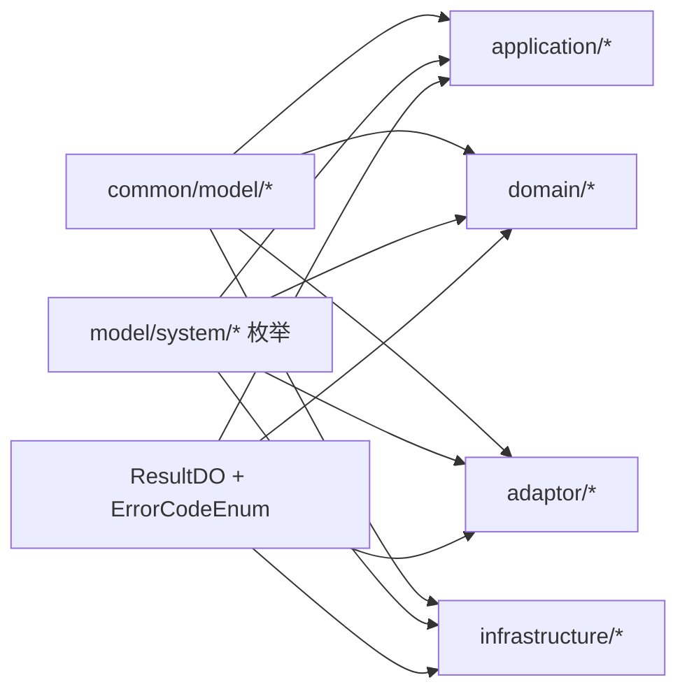

# Model共享模型规范

<cite>
**本文引用的文件**   
- [BaseEntity.java](file://src/main/java/com/sunnao/spring/ddd/template/common/model/BaseEntity.java)
- [BasePO.java](file://src/main/java/com/sunnao/spring/ddd/template/common/model/BasePO.java)
- [BaseAggregate.java](file://src/main/java/com/sunnao/spring/ddd/template/common/model/BaseAggregate.java)
- [BaseDto.java](file://src/main/java/com/sunnao/spring/ddd/template/common/model/BaseDto.java)
- [BaseParam.java](file://src/main/java/com/sunnao/spring/ddd/template/common/model/BaseParam.java)
- [BaseValue.java](file://src/main/java/com/sunnao/spring/ddd/template/common/model/BaseValue.java)
- [Entity.java](file://src/main/java/com/sunnao/spring/ddd/template/common/model/Entity.java)
- [Value.java](file://src/main/java/com/sunnao/spring/ddd/template/common/model/Value.java)
- [Aggregate.java](file://src/main/java/com/sunnao/spring/ddd/template/common/model/Aggregate.java)
- [Param.java](file://src/main/java/com/sunnao/spring/ddd/template/common/model/Param.java)
- [PageQuery.java](file://src/main/java/com/sunnao/spring/ddd/template/common/model/PageQuery.java)
- [Result.java](file://src/main/java/com/sunnao/spring/ddd/template/common/model/Result.java)
- [ErrorCodeEnum.java](file://src/main/java/com/sunnao/spring/ddd/template/common/result/ErrorCodeEnum.java)
- [ResultDO.java](file://src/main/java/com/sunnao/spring/ddd/template/common/result/ResultDO.java)
- [DictStatusEnum.java](file://src/main/java/com/sunnao/spring/ddd/template/model/system/dict/DictStatusEnum.java)
- [FileStorageTypeEnum.java](file://src/main/java/com/sunnao/spring/ddd/template/model/system/file/FileStorageTypeEnum.java)
- [RoleStatusEnum.java](file://src/main/java/com/sunnao/spring/ddd/template/model/system/role/RoleStatusEnum.java)
- [UserStatusEnum.java](file://src/main/java/com/sunnao/spring/ddd/template/model/system/user/UserStatusEnum.java)
</cite>

## 目录
1. [简介](#简介)
2. [项目结构](#项目结构)
3. [核心组件](#核心组件)
4. [架构总览](#架构总览)
5. [详细组件分析](#详细组件分析)
6. [依赖关系分析](#依赖关系分析)
7. [性能与一致性考量](#性能与一致性考量)
8. [故障排查指南](#故障排查指南)
9. [结论](#结论)
10. [附录：最佳实践与迁移指南](#附录最佳实践与迁移指南)

## 简介
本规范聚焦于“Model共享模型层”的设计与使用，目标是统一内部复用组件的抽象、定义通用基础类、规范枚举组织与命名、集中管理错误码与结果对象，确保跨模块数据一致性与可维护性。文档将围绕以下主题展开：
- 基础实体与聚合基类设计模式（BaseEntity、BasePO、BaseAggregate）
- DTO/Param/Value 等通用基类的职责边界与扩展点
- 枚举类型的组织结构、命名规范与防魔法值策略
- 公共工具与常量管理（错误码、结果封装）
- 版本兼容与向后兼容策略、迁移指南

## 项目结构
共享模型位于 common.model 与 model.system.* 两个层次：
- common.model：提供跨层复用的基础类型与接口（实体、值对象、参数、分页查询、结果封装等）
- model.system.*：按领域子域划分的共享枚举（字典、角色、用户、文件存储类型等），供 domain/application/adaptor/infrastructure 共同消费

[此图为概念结构示意，不直接映射具体源码文件]

## 核心组件
本节从“共享模型”的角度，梳理关键基础类与接口的职责与继承关系，并给出使用建议。

- 基础实体与持久化基类
  - BaseEntity：实现 Entity 接口，提供 id、审计字段及基于 id 的 equals/hashCode 约定，适合在领域层表示有标识的实体。
  - BasePO：面向持久化的审计字段基类（创建/更新时间、创建/更新人），配合全局监听器自动填充；逻辑删除字段不在本类中，按需在各 PO 声明。
  - BaseAggregate：实现 Aggregate 接口，作为聚合根的基础占位，便于后续扩展聚合共性能力。

- 数据传输与参数基类
  - BaseDto：实现 Serializable，并提供 check() 自校验入口，鼓励在 RequestDTO 内完成参数校验，避免在 AppService 散落校验逻辑。
  - BaseParam：实现 Param 接口，用于领域参数对象。
  - BaseValue：实现 Value 接口，用于值对象基类。

- 通用查询与结果
  - PageQuery<Q>：通用分页查询包装，包含 startIndex、pageSize 与 query 泛型。
  - ResultDO<T>：统一结果封装，结合 ErrorCodeEnum 构建成功/失败结果，禁止向调用方直接抛异常。
  - ErrorCodeEnum：全局错误码收敛入口，所有层构建失败结果或抛出业务异常时统一引用，禁止散落字符串字面量。

- 共享枚举
  - DictStatusEnum、RoleStatusEnum、UserStatusEnum、FileStorageTypeEnum：按子域划分，提供 code/description 与 getByCode 方法，消除魔法数字/字符串。

章节来源
- [BaseEntity.java:1-44](file://src/main/java/com/sunnao/spring/ddd/template/common/model/BaseEntity.java#L1-L44)
- [BasePO.java:1-41](file://src/main/java/com/sunnao/spring/ddd/template/common/model/BasePO.java#L1-L41)
- [BaseAggregate.java:1-5](file://src/main/java/com/sunnao/spring/ddd/template/common/model/BaseAggregate.java#L1-L5)
- [BaseDto.java:1-23](file://src/main/java/com/sunnao/spring/ddd/template/common/model/BaseDto.java#L1-L23)
- [BaseParam.java:1-4](file://src/main/java/com/sunnao/spring/ddd/template/common/model/BaseParam.java#L1-L4)
- [BaseValue.java:1-4](file://src/main/java/com/sunnao/spring/ddd/template/common/model/BaseValue.java#L1-L4)
- [Entity.java:1-4](file://src/main/java/com/sunnao/spring/ddd/template/common/model/Entity.java#L1-L4)
- [Value.java:1-4](file://src/main/java/com/sunnao/spring/ddd/template/common/model/Value.java#L1-L4)
- [Aggregate.java:1-4](file://src/main/java/com/sunnao/spring/ddd/template/common/model/Aggregate.java#L1-L4)
- [Param.java:1-4](file://src/main/java/com/sunnao/spring/ddd/template/common/model/Param.java#L1-L4)
- [PageQuery.java:1-22](file://src/main/java/com/sunnao/spring/ddd/template/common/model/PageQuery.java#L1-L22)
- [ResultDO.java:1-110](file://src/main/java/com/sunnao/spring/ddd/template/common/result/ResultDO.java#L1-L110)
- [ErrorCodeEnum.java:1-209](file://src/main/java/com/sunnao/spring/ddd/template/common/result/ErrorCodeEnum.java#L1-L209)
- [DictStatusEnum.java:1-43](file://src/main/java/com/sunnao/spring/ddd/template/model/system/dict/DictStatusEnum.java#L1-L43)
- [RoleStatusEnum.java:1-50](file://src/main/java/com/sunnao/spring/ddd/template/model/system/role/RoleStatusEnum.java#L1-L50)
- [UserStatusEnum.java:1-50](file://src/main/java/com/sunnao/spring/ddd/template/model/system/user/UserStatusEnum.java#L1-L50)
- [FileStorageTypeEnum.java:1-53](file://src/main/java/com/sunnao/spring/ddd/template/model/system/file/FileStorageTypeEnum.java#L1-L53)

## 架构总览
下图展示共享模型在分层中的位置与交互方式：各层通过 common.model 获取基础类型，通过 model.system.* 消费共享枚举，并通过 ResultDO/ErrorCodeEnum 统一返回结果。

[此图为概念结构示意，不直接映射具体源码文件]

## 详细组件分析

### 基础实体与聚合基类
- 设计要点
  - BaseEntity 以 id 为身份标识，重写 equals/hashCode 保证集合比较与缓存一致性。
  - BasePO 仅关注持久化审计字段，逻辑删除字段由各表 PO 自行声明，保持关注点分离。
  - BaseAggregate 作为聚合根基类，预留扩展点（如事件发布、状态机钩子等）。

图示来源
- [BaseEntity.java:1-44](file://src/main/java/com/sunnao/spring/ddd/template/common/model/BaseEntity.java#L1-L44)
- [BasePO.java:1-41](file://src/main/java/com/sunnao/spring/ddd/template/common/model/BasePO.java#L1-L41)
- [BaseAggregate.java:1-5](file://src/main/java/com/sunnao/spring/ddd/template/common/model/BaseAggregate.java#L1-L5)
- [Entity.java:1-4](file://src/main/java/com/sunnao/spring/ddd/template/common/model/Entity.java#L1-L4)
- [Aggregate.java:1-4](file://src/main/java/com/sunnao/spring/ddd/template/common/model/Aggregate.java#L1-L4)

章节来源
- [BaseEntity.java:1-44](file://src/main/java/com/sunnao/spring/ddd/template/common/model/BaseEntity.java#L1-L44)
- [BasePO.java:1-41](file://src/main/java/com/sunnao/spring/ddd/template/common/model/BasePO.java#L1-L41)
- [BaseAggregate.java:1-5](file://src/main/java/com/sunnao/spring/ddd/template/common/model/BaseAggregate.java#L1-L5)

### DTO/Param/Value 与分页查询
- BaseDto 提供 check() 自校验入口，鼓励在请求对象内完成校验，返回 ResultDO 表达校验结果。
- BaseParam 与 BaseValue 分别承载领域参数与值对象的通用语义。
- PageQuery<Q> 提供分页参数与查询条件的组合，简化查询构造。

图示来源
- [BaseDto.java:1-23](file://src/main/java/com/sunnao/spring/ddd/template/common/model/BaseDto.java#L1-L23)
- [BaseParam.java:1-4](file://src/main/java/com/sunnao/spring/ddd/template/common/model/BaseParam.java#L1-L4)
- [BaseValue.java:1-4](file://src/main/java/com/sunnao/spring/ddd/template/common/model/BaseValue.java#L1-L4)
- [PageQuery.java:1-22](file://src/main/java/com/sunnao/spring/ddd/template/common/model/PageQuery.java#L1-L22)

章节来源
- [BaseDto.java:1-23](file://src/main/java/com/sunnao/spring/ddd/template/common/model/BaseDto.java#L1-L23)
- [BaseParam.java:1-4](file://src/main/java/com/sunnao/spring/ddd/template/common/model/BaseParam.java#L1-L4)
- [BaseValue.java:1-4](file://src/main/java/com/sunnao/spring/ddd/template/common/model/BaseValue.java#L1-L4)
- [PageQuery.java:1-22](file://src/main/java/com/sunnao/spring/ddd/template/common/model/PageQuery.java#L1-L22)

### 统一结果与错误码
- ResultDO 提供多种便捷工厂方法，支持默认失败码、枚举失败码以及自定义消息。
- ErrorCodeEnum 是全局错误码收敛入口，覆盖通用、持久层、认证、用户、角色权限、字典、文件等场景。

图示来源
- [BaseDto.java:1-23](file://src/main/java/com/sunnao/spring/ddd/template/common/model/BaseDto.java#L1-L23)
- [ResultDO.java:1-110](file://src/main/java/com/sunnao/spring/ddd/template/common/result/ResultDO.java#L1-L110)
- [ErrorCodeEnum.java:1-209](file://src/main/java/com/sunnao/spring/ddd/template/common/result/ErrorCodeEnum.java#L1-L209)

章节来源
- [ResultDO.java:1-110](file://src/main/java/com/sunnao/spring/ddd/template/common/result/ResultDO.java#L1-L110)
- [ErrorCodeEnum.java:1-209](file://src/main/java/com/sunnao/spring/ddd/template/common/result/ErrorCodeEnum.java#L1-L209)

### 共享枚举的组织与命名规范
- 组织方式：按子域分包（system/dict、system/role、system/user、system/file），每个枚举对应一个业务概念。
- 命名规范：采用 XxxStatusEnum/XxxTypeEnum 形式，code 描述数据库存储值，description 提供可读文案。
- 防魔法值：提供 getByCode 静态方法，禁止在代码中使用硬编码数字/字符串。

图示来源
- [DictStatusEnum.java:1-43](file://src/main/java/com/sunnao/spring/ddd/template/model/system/dict/DictStatusEnum.java#L1-L43)
- [RoleStatusEnum.java:1-50](file://src/main/java/com/sunnao/spring/ddd/template/model/system/role/RoleStatusEnum.java#L1-L50)
- [UserStatusEnum.java:1-50](file://src/main/java/com/sunnao/spring/ddd/template/model/system/user/UserStatusEnum.java#L1-L50)
- [FileStorageTypeEnum.java:1-53](file://src/main/java/com/sunnao/spring/ddd/template/model/system/file/FileStorageTypeEnum.java#L1-L53)

章节来源
- [DictStatusEnum.java:1-43](file://src/main/java/com/sunnao/spring/ddd/template/model/system/dict/DictStatusEnum.java#L1-L43)
- [RoleStatusEnum.java:1-50](file://src/main/java/com/sunnao/spring/ddd/template/model/system/role/RoleStatusEnum.java#L1-L50)
- [UserStatusEnum.java:1-50](file://src/main/java/com/sunnao/spring/ddd/template/model/system/user/UserStatusEnum.java#L1-L50)
- [FileStorageTypeEnum.java:1-53](file://src/main/java/com/sunnao/spring/ddd/template/model/system/file/FileStorageTypeEnum.java#L1-L53)

## 依赖关系分析
- 低耦合高内聚
  - common.model 被 application/domain/adaptor/infrastructure 共同依赖，但不反向依赖任何业务层。
  - model.system.* 枚举被多模块共享，避免重复定义与不一致。
- 外部依赖
  - ResultDO 与 ErrorCodeEnum 构成统一的错误处理契约，降低上层对异常传播的依赖。
  - PageQuery 作为通用查询载体，减少各查询接口的样板代码。

[此图为概念依赖示意，不直接映射具体源码文件]

章节来源
- [BaseEntity.java:1-44](file://src/main/java/com/sunnao/spring/ddd/template/common/model/BaseEntity.java#L1-L44)
- [BasePO.java:1-41](file://src/main/java/com/sunnao/spring/ddd/template/common/model/BasePO.java#L1-L41)
- [BaseAggregate.java:1-5](file://src/main/java/com/sunnao/spring/ddd/template/common/model/BaseAggregate.java#L1-L5)
- [BaseDto.java:1-23](file://src/main/java/com/sunnao/spring/ddd/template/common/model/BaseDto.java#L1-L23)
- [BaseParam.java:1-4](file://src/main/java/com/sunnao/spring/ddd/template/common/model/BaseParam.java#L1-L4)
- [BaseValue.java:1-4](file://src/main/java/com/sunnao/spring/ddd/template/common/model/BaseValue.java#L1-L4)
- [PageQuery.java:1-22](file://src/main/java/com/sunnao/spring/ddd/template/common/model/PageQuery.java#L1-L22)
- [ResultDO.java:1-110](file://src/main/java/com/sunnao/spring/ddd/template/common/result/ResultDO.java#L1-L110)
- [ErrorCodeEnum.java:1-209](file://src/main/java/com/sunnao/spring/ddd/template/common/result/ErrorCodeEnum.java#L1-L209)
- [DictStatusEnum.java:1-43](file://src/main/java/com/sunnao/spring/ddd/template/model/system/dict/DictStatusEnum.java#L1-L43)
- [RoleStatusEnum.java:1-50](file://src/main/java/com/sunnao/spring/ddd/template/model/system/role/RoleStatusEnum.java#L1-L50)
- [UserStatusEnum.java:1-50](file://src/main/java/com/sunnao/spring/ddd/template/model/system/user/UserStatusEnum.java#L1-L50)
- [FileStorageTypeEnum.java:1-53](file://src/main/java/com/sunnao/spring/ddd/template/model/system/file/FileStorageTypeEnum.java#L1-L53)

## 性能与一致性考量
- 分页查询
  - 使用 PageQuery 统一分页参数，避免各查询接口重复定义分页字段，减少序列化/反序列化开销。
- 结果封装
  - 统一 ResultDO 返回，避免异常路径带来的额外栈跟踪成本；在必要处才抛出异常，常规失败走 ResultDO。
- 枚举查找
  - getByCode 遍历 values() 适用于小规模枚举；若未来枚举规模较大，可在枚举内部维护 Map 以提升查找性能。
- 审计字段
  - BasePO 配合全局监听器自动填充审计字段，减少手写赋值，提升一致性与性能。

[本节为通用指导，无需特定文件来源]

## 故障排查指南
- 参数校验失败
  - 检查 RequestDTO 是否正确覆写 check() 并返回 ResultDO 失败结果。
  - 参考：[BaseDto.java:1-23](file://src/main/java/com/sunnao/spring/ddd/template/common/model/BaseDto.java#L1-L23)
- 错误码不规范
  - 确认是否使用了 ErrorCodeEnum 中的条目，避免散落字符串字面量。
  - 参考：[ErrorCodeEnum.java:1-209](file://src/main/java/com/sunnao/spring/ddd/template/common/result/ErrorCodeEnum.java#L1-L209)
- 结果构建问题
  - 优先使用 ResultDO 的工厂方法构建成功/失败结果，避免手动设置字段导致遗漏。
  - 参考：[ResultDO.java:1-110](file://src/main/java/com/sunnao/spring/ddd/template/common/result/ResultDO.java#L1-L110)
- 枚举误用
  - 禁止直接使用数字/字符串，改用 getByCode 获取枚举实例。
  - 参考：[UserStatusEnum.java:1-50](file://src/main/java/com/sunnao/spring/ddd/template/model/system/user/UserStatusEnum.java#L1-L50)、[RoleStatusEnum.java:1-50](file://src/main/java/com/sunnao/spring/ddd/template/model/system/role/RoleStatusEnum.java#L1-L50)、[DictStatusEnum.java:1-43](file://src/main/java/com/sunnao/spring/ddd/template/model/system/dict/DictStatusEnum.java#L1-L43)、[FileStorageTypeEnum.java:1-53](file://src/main/java/com/sunnao/spring/ddd/template/model/system/file/FileStorageTypeEnum.java#L1-L53)

章节来源
- [BaseDto.java:1-23](file://src/main/java/com/sunnao/spring/ddd/template/common/model/BaseDto.java#L1-L23)
- [ErrorCodeEnum.java:1-209](file://src/main/java/com/sunnao/spring/ddd/template/common/result/ErrorCodeEnum.java#L1-L209)
- [ResultDO.java:1-110](file://src/main/java/com/sunnao/spring/ddd/template/common/result/ResultDO.java#L1-L110)
- [UserStatusEnum.java:1-50](file://src/main/java/com/sunnao/spring/ddd/template/model/system/user/UserStatusEnum.java#L1-L50)
- [RoleStatusEnum.java:1-50](file://src/main/java/com/sunnao/spring/ddd/template/model/system/role/RoleStatusEnum.java#L1-L50)
- [DictStatusEnum.java:1-43](file://src/main/java/com/sunnao/spring/ddd/template/model/system/dict/DictStatusEnum.java#L1-L43)
- [FileStorageTypeEnum.java:1-53](file://src/main/java/com/sunnao/spring/ddd/template/model/system/file/FileStorageTypeEnum.java#L1-L53)

## 结论
共享模型层通过统一的基础类、枚举与结果封装，显著提升了跨模块的一致性与可维护性。遵循本规范可有效避免魔法值、分散校验与不一致的错误处理，同时为后续扩展（如聚合增强、审计增强、错误码扩展）预留良好空间。

[本节为总结性内容，无需特定文件来源]

## 附录：最佳实践与迁移指南

### 如何正确继承基础类与扩展通用功能
- 实体与聚合
  - 领域实体继承 BaseEntity，确保 id 唯一性与相等性语义。
  - 聚合根继承 BaseAggregate，并在需要时扩展领域行为。
  - 参考：[BaseEntity.java:1-44](file://src/main/java/com/sunnao/spring/ddd/template/common/model/BaseEntity.java#L1-L44)、[BaseAggregate.java:1-5](file://src/main/java/com/sunnao/spring/ddd/template/common/model/BaseAggregate.java#L1-L5)
- 持久化对象
  - 数据库 PO 继承 BasePO，利用全局监听器自动填充审计字段；如需逻辑删除，在各自 PO 上声明 deleted 字段。
  - 参考：[BasePO.java:1-41](file://src/main/java/com/sunnao/spring/ddd/template/common/model/BasePO.java#L1-L41)
- 请求与参数
  - RequestDTO 继承 BaseDto 并覆写 check() 进行自校验，返回 ResultDO。
  - 领域参数继承 BaseParam，值对象继承 BaseValue。
  - 参考：[BaseDto.java:1-23](file://src/main/java/com/sunnao/spring/ddd/template/common/model/BaseDto.java#L1-L23)、[BaseParam.java:1-4](file://src/main/java/com/sunnao/spring/ddd/template/common/model/BaseParam.java#L1-L4)、[BaseValue.java:1-4](file://src/main/java/com/sunnao/spring/ddd/template/common/model/BaseValue.java#L1-L4)
- 分页查询
  - 使用 PageQuery<Q> 包装查询条件与分页参数。
  - 参考：[PageQuery.java:1-22](file://src/main/java/com/sunnao/spring/ddd/template/common/model/PageQuery.java#L1-L22)
- 结果与错误码
  - 使用 ResultDO 的工厂方法构建结果，错误码来自 ErrorCodeEnum。
  - 参考：[ResultDO.java:1-110](file://src/main/java/com/sunnao/spring/ddd/template/common/result/ResultDO.java#L1-L110)、[ErrorCodeEnum.java:1-209](file://src/main/java/com/sunnao/spring/ddd/template/common/result/ErrorCodeEnum.java#L1-L209)
- 枚举使用
  - 新增枚举遵循现有分包与命名规范，提供 code/description 与 getByCode。
  - 参考：[UserStatusEnum.java:1-50](file://src/main/java/com/sunnao/spring/ddd/template/model/system/user/UserStatusEnum.java#L1-L50)、[RoleStatusEnum.java:1-50](file://src/main/java/com/sunnao/spring/ddd/template/model/system/role/RoleStatusEnum.java#L1-L50)、[DictStatusEnum.java:1-43](file://src/main/java/com/sunnao/spring/ddd/template/model/system/dict/DictStatusEnum.java#L1-L43)、[FileStorageTypeEnum.java:1-53](file://src/main/java/com/sunnao/spring/ddd/template/model/system/file/FileStorageTypeEnum.java#L1-L53)

### 模型版本兼容与向后兼容策略
- 新增字段
  - 在 DTO/PO 中新增字段时，保持旧客户端/旧版本的兼容性：默认值需合理，避免破坏既有序列化/反序列化。
- 移除字段
  - 废弃字段保留一段时间并标记为 deprecated，逐步清理引用后再移除。
- 变更枚举
  - 新增枚举项时保持已有 code 不变；如需重排顺序，应通过 code 而非索引访问。
- 错误码演进
  - 新增错误码到 ErrorCodeEnum，避免散落的字符串；对历史错误码保持兼容，必要时增加新码替代旧码。
- 迁移步骤
  - 评估影响范围 → 在共享模型中添加新字段/枚举项 → 在相关层引入并使用 → 灰度发布 → 清理旧引用 → 归档变更记录。

[本节为通用指导，无需特定文件来源]