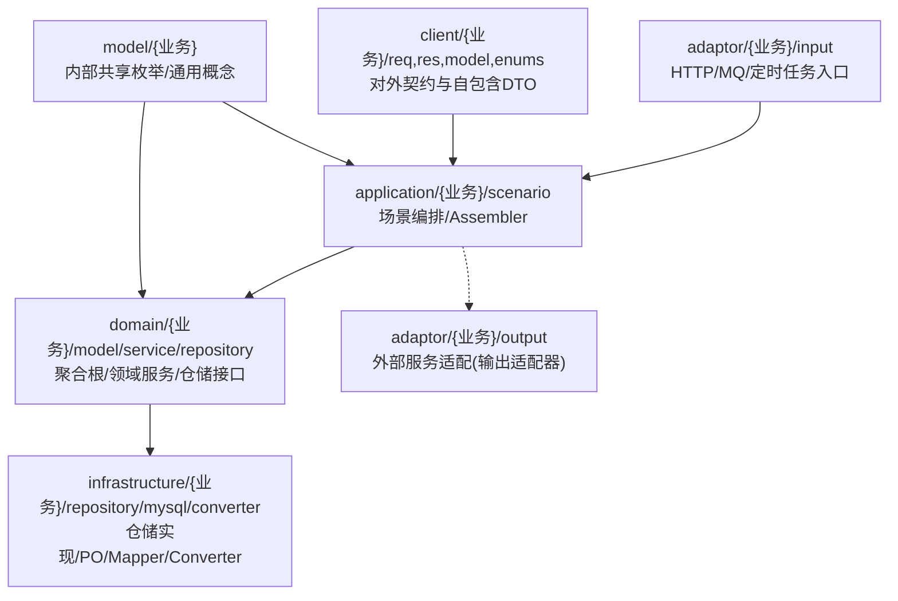
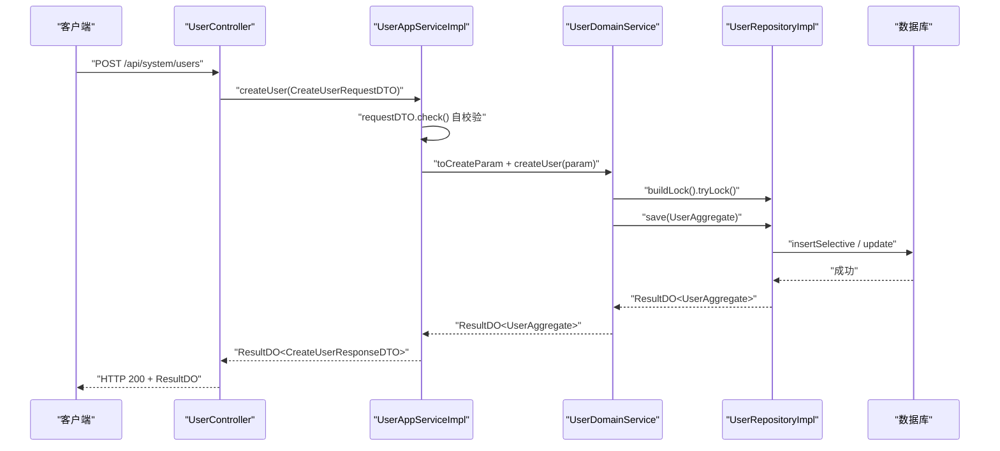
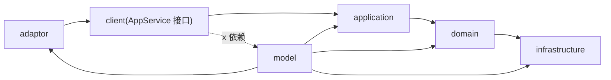

# 分层架构规范

<cite>
**本文引用的文件**
- [README.md](file://README.md)
- [ddd-adaptor-layer.md](file://docs/rule/ddd/ddd-adaptor-layer.md)
- [ddd-model-layer.md](file://docs/rule/ddd/ddd-model-layer.md)
- [UserController.java](file://src/main/java/com/sunnao/spring/ddd/template/adaptor/system/user/input/UserController.java)
- [UserAppServiceImpl.java](file://src/main/java/com/sunnao/spring/ddd/template/application/system/user/scenario/UserAppServiceImpl.java)
- [UserAggregate.java](file://src/main/java/com/sunnao/spring/ddd/template/domain/system/user/model/aggregate/UserAggregate.java)
- [UserRepositoryImpl.java](file://src/main/java/com/sunnao/spring/ddd/template/infrastructure/system/user/repository/UserRepositoryImpl.java)
- [UserAppService.java](file://src/main/java/com/sunnao/spring/ddd/template/client/system/user/UserAppService.java)
- [BasePO.java](file://src/main/java/com/sunnao/spring/ddd/template/common/model/BasePO.java)
- [ResultDO.java](file://src/main/java/com/sunnao/spring/ddd/template/common/result/ResultDO.java)
</cite>

## 目录
1. [引言](#引言)
2. [项目结构](#项目结构)
3. [核心组件](#核心组件)
4. [架构总览](#架构总览)
5. [详细组件分析](#详细组件分析)
6. [依赖关系分析](#依赖关系分析)
7. [性能考量](#性能考量)
8. [故障排查指南](#故障排查指南)
9. [结论](#结论)
10. [附录](#附录)

## 引言
本规范面向基于六边形架构的 Spring Boot DDD 工程，明确六个分层的职责、包结构、命名约定、依赖注入方式与异常处理策略；阐述层间通信最佳实践（DTO 转换、参数校验、事务管理），并提供完整调用链示例与防腐层设计模式说明。目标是帮助团队在“知道理论”的基础上，快速落地到代码结构与实现细节。

## 项目结构
整体采用自外向内的调用顺序：adaptor(input) → application → domain → repository 接口（由 infrastructure 实现）；同时通过 adaptor(output) 将应用层对外部服务的调用进行适配隔离。

图示来源
- [README.md:28-35](file://README.md#L28-L35)
- [ddd-adaptor-layer.md:18-34](file://docs/rule/ddd/ddd-adaptor-layer.md#L18-L34)

章节来源
- [README.md:28-35](file://README.md#L28-L35)
- [ddd-adaptor-layer.md:18-34](file://docs/rule/ddd/ddd-adaptor-layer.md#L18-L34)

## 核心组件
- 统一结果对象 ResultDO：全链路不抛异常，各层方法返回 ResultDO，内部捕获并转错误码。
- 持久化基类 BasePO：审计字段自动填充（createAt/updateAt/createBy/updateBy），由全局监听器完成。
- 用户域模型 UserAggregate：承载用户创建、更新资料、状态变更等核心业务规则。
- 用户仓储实现 UserRepositoryImpl：负责 PO 与聚合根互转、分页查询、组合写入（用户+角色）及分布式锁构建。
- 用户应用服务 UserAppServiceImpl：场景编排（校验→Assembler→领域服务→组装响应），并在禁用/删除后踢出会话。
- 用户控制器 UserController：Input Adaptor，接收 HTTP 请求，鉴权与日志注解，调用 AppService。
- 对外接口契约 UserAppService：定义写操作接口，供 adaptor 与外部系统调用。

章节来源
- [ResultDO.java:1-110](file://src/main/java/com/sunnao/spring/ddd/template/common/result/ResultDO.java#L1-L110)
- [BasePO.java:1-41](file://src/main/java/com/sunnao/spring/ddd/template/common/model/BasePO.java#L1-L41)
- [UserAggregate.java:1-113](file://src/main/java/com/sunnao/spring/ddd/template/domain/system/user/model/aggregate/UserAggregate.java#L1-L113)
- [UserRepositoryImpl.java:1-191](file://src/main/java/com/sunnao/spring/ddd/template/infrastructure/system/user/repository/UserRepositoryImpl.java#L1-L191)
- [UserAppServiceImpl.java:1-163](file://src/main/java/com/sunnao/spring/ddd/template/application/system/user/scenario/UserAppServiceImpl.java#L1-L163)
- [UserController.java:1-115](file://src/main/java/com/sunnao/spring/ddd/template/adaptor/system/user/input/UserController.java#L1-L115)
- [UserAppService.java:1-52](file://src/main/java/com/sunnao/spring/ddd/template/client/system/user/UserAppService.java#L1-L52)

## 架构总览
下图展示一次“创建用户”的端到端调用链，体现 Input Adaptor → Application → Domain → Infrastructure 的流转，以及 ResultDO 的全链路返回策略。

图示来源
- [UserController.java:35-41](file://src/main/java/com/sunnao/spring/ddd/template/adaptor/system/user/input/UserController.java#L35-L41)
- [UserAppServiceImpl.java:40-62](file://src/main/java/com/sunnao/spring/ddd/template/application/system/user/scenario/UserAppServiceImpl.java#L40-L62)
- [UserRepositoryImpl.java:90-117](file://src/main/java/com/sunnao/spring/ddd/template/infrastructure/system/user/repository/UserRepositoryImpl.java#L90-L117)

## 详细组件分析

### 适配层（Adaptor）
- 职责定位
  - 输入适配：接收 HTTP/MQ/定时任务等外部请求，转换为应用层可理解的指令，禁止编写业务逻辑。
  - 输出适配：实现应用层定义的对外服务接口，封装第三方技术细节，对调用方透明。
- 包结构与命名
  - 按业务域划分顶层包，子包 input/output/inner 保持不变；Controller 命名为 {业务名}Controller。
- 依赖关系
  - 仅依赖 client 层 AppService 接口，禁止绕过应用层直接调用领域层。
- 异常与日志
  - 使用全局异常处理器兜底；写接口建议标注 @OperLog 记录操作日志。
- 参考实现
  - 用户管理 Controller 作为 Input Adaptor 示例，负责参数绑定、权限校验与日志注解，然后调用 AppService。

章节来源
- [ddd-adaptor-layer.md:18-34](file://docs/rule/ddd/ddd-adaptor-layer.md#L18-L34)
- [UserController.java:1-115](file://src/main/java/com/sunnao/spring/ddd/template/adaptor/system/user/input/UserController.java#L1-L115)

### 应用层（Application）
- 职责定位
  - 场景编排：参数自校验 → DTO 转 Param → 调用领域服务 → 组装响应；不包含核心业务规则。
- 包结构与命名
  - scenario 存放 AppService 实现；assembler 存放 DTO ↔ 领域对象转换；内部 model 仅限应用层使用。
- 依赖关系
  - 允许依赖 domain、client、model；禁止依赖其他业务域二方包与中间件。
- 入参与返回
  - RequestDTO 覆写 check() 自校验；返回值统一 ResultDO<ResponseDTO>。
- 参考实现
  - 用户写场景 UserAppServiceImpl：校验、Assembler 转换、调用领域服务、组装响应，并在禁用/删除后踢出会话。

章节来源
- [UserAppServiceImpl.java:1-163](file://src/main/java/com/sunnao/spring/ddd/template/application/system/user/scenario/UserAppServiceImpl.java#L1-L163)

### 领域层（Domain）
- 职责定位
  - 聚合根/实体承载核心业务逻辑；领域服务编排“锁 → 聚合根 → 持久化”；仓储只定义接口。
- 包结构与命名
  - model/aggregate、entity、param、result；service 为领域服务；repository 为仓储接口。
- 依赖关系
  - 仅包含纯业务代码，可依赖 model 层共享枚举/通用概念；禁止使用设计模式，分支用 if/else 内聚处理。
- 异常策略
  - 聚合根/实体校验失败抛 AggregateException，领域服务统一捕获并转换为 ResultDO。
- 参考实现
  - 用户聚合根 UserAggregate：提供 create/updateProfile/changeStatus/resetPassword 等方法，维护状态与不变式。

章节来源
- [UserAggregate.java:1-113](file://src/main/java/com/sunnao/spring/ddd/template/domain/system/user/model/aggregate/UserAggregate.java#L1-L113)

### 基础设施层（Infrastructure）
- 职责定位
  - 仓储实现、PO 与聚合根互转、缓存读写；纯技术转换，无业务逻辑。
- 包结构与命名
  - repository 实现仓储接口；mysql/po/mapper 数据访问；converter 负责对象映射。
- 事务与锁
  - 组合写入（如用户+角色）在同一事务内；通过 buildLock 获取分布式锁，遵循“先锁 → 再执行业务 → finally 释放”。
- 参考实现
  - 用户仓储实现 UserRepositoryImpl：分页查询、保存/更新、组合写入、逻辑删除、锁构建。

章节来源
- [UserRepositoryImpl.java:1-191](file://src/main/java/com/sunnao/spring/ddd/template/infrastructure/system/user/repository/UserRepositoryImpl.java#L1-L191)

### 客户端接口层（Client）
- 职责定位
  - 对外 RPC 接口定义与自包含 DTO；禁止依赖 model 层，避免依赖扩散。
- 包结构与命名
  - enums/model/req/res 按分类组织；AppService 接口定义在本层，继承 ApplicationCmdService/ApplicationQueryService。
- 参考实现
  - 用户写接口 UserAppService：声明 createUser/updateUser/changeUserStatus/deleteUser 等方法。

章节来源
- [UserAppService.java:1-52](file://src/main/java/com/sunnao/spring/ddd/template/client/system/user/UserAppService.java#L1-L52)

### 共享模型层（Model）
- 职责定位
  - 跨模块共享枚举与通用业务概念；client 层禁止依赖 model 层。
- 依赖关系
  - domain/application/adaptor/infrastructure 可依赖；client 不可依赖。
- 参考规范
  - 详见 model 层开发规范文档。

章节来源
- [ddd-model-layer.md:1-97](file://docs/rule/ddd/ddd-model-layer.md#L1-L97)

## 依赖关系分析
- 依赖方向
  - adaptor → client(AppService 接口) → application → domain → infrastructure
  - application 可通过 output adaptor 调用外部服务
  - model 被多向引用，但 client 不得依赖 model
- 关键约束
  - 禁止绕过应用层直接调用领域层
  - 禁止在 adaptor 中编写业务逻辑
  - 禁止在领域层引入框架或第三方库（Spring 与静态工具除外）

图示来源
- [ddd-adaptor-layer.md:18-34](file://docs/rule/ddd/ddd-adaptor-layer.md#L18-L34)
- [ddd-model-layer.md:14-29](file://docs/rule/ddd/ddd-model-layer.md#L14-L29)

## 性能考量
- 读路径优化
  - 使用 Repository 的分页查询接口，减少内存占用与网络传输。
- 写路径优化
  - 严格遵循“锁 → 聚合根 → 持久化”流程，避免长事务与热点键竞争。
- 转换开销
  - Assembler/Converter 尽量轻量，避免在热路径中进行复杂计算。
- 异步与事件
  - 非关键路径（如审计日志、通知）通过领域事件异步消费，降低主流程延迟。

[本节为通用指导，无需源码引用]

## 故障排查指南
- 统一结果对象
  - 全链路返回 ResultDO，优先检查 code/msg 与 success 标志定位问题。
- 持久化异常
  - Repository 层捕获底层异常并包装为 RepositoryException，结合日志中的上下文信息（ID/Query）快速定位。
- 审计字段未填充
  - 确认 PO 继承 BasePO，且全局监听器已启用；检查 CurrentUserContext 是否可用。
- 权限与鉴权
  - 若出现 401/403，检查 Sa-Token 配置与权限点是否正确设置。

章节来源
- [ResultDO.java:1-110](file://src/main/java/com/sunnao/spring/ddd/template/common/result/ResultDO.java#L1-L110)
- [BasePO.java:1-41](file://src/main/java/com/sunnao/spring/ddd/template/common/model/BasePO.java#L1-L41)

## 结论
本规范以六边形架构为核心，明确了六层职责边界与依赖方向，提供了从 API 到存储的完整调用链示例与防腐层设计思路。遵循该规范可在保证业务内核稳定的前提下，灵活替换外部依赖与实现细节，提升系统的可测试性与可演进性。

## 附录

### 层间通信最佳实践
- DTO 转换
  - application 层使用 Assembler 完成 DTO ↔ 领域对象转换；infrastructure 层使用 Converter 完成 PO ↔ 聚合根转换。
- 参数校验
  - RequestDTO 覆写 check() 自校验，AppService 不再重复校验。
- 事务管理
  - 组合写入（如用户+角色）在 Repository 层使用 @Transactional 保证一致性。
- 异常处理
  - 全链路不抛异常，统一通过 ResultDO 返回；领域层抛 AggregateException，由上层捕获并转为 ResultDO。

章节来源
- [UserAppServiceImpl.java:40-62](file://src/main/java/com/sunnao/spring/ddd/template/application/system/user/scenario/UserAppServiceImpl.java#L40-L62)
- [UserRepositoryImpl.java:119-125](file://src/main/java/com/sunnao/spring/ddd/template/infrastructure/system/user/repository/UserRepositoryImpl.java#L119-L125)
- [ResultDO.java:1-110](file://src/main/java/com/sunnao/spring/ddd/template/common/result/ResultDO.java#L1-L110)

### 防腐层设计与实现
- 原则
  - 输出适配器接口定义在 application 层，方法签名反映业务语义而非第三方技术细节。
- 典型用法
  - 在写模式前置校验或读模式跨领域查询时，通过 Output Adaptor 获取外部数据，再由 Application 层编排。
- 参考规范
  - 参见 adaptor 层开发规范文档。

章节来源
- [ddd-adaptor-layer.md:36-52](file://docs/rule/ddd/ddd-adaptor-layer.md#L36-L52)