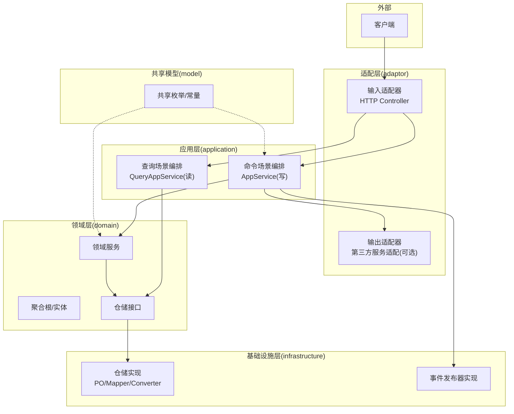
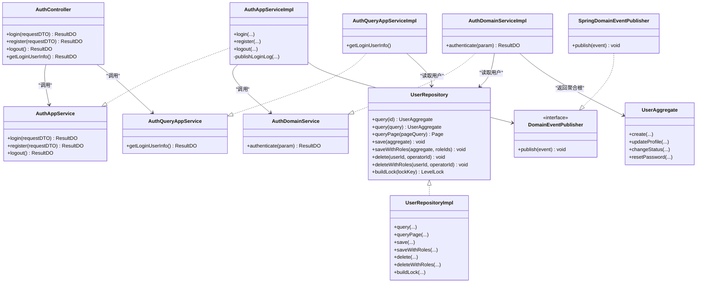
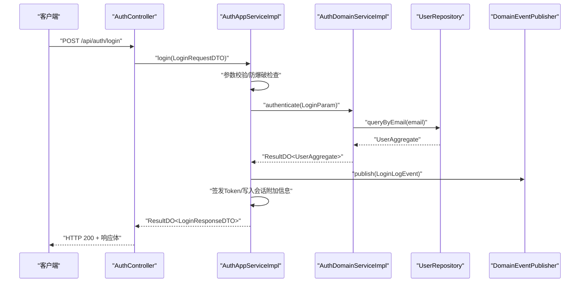
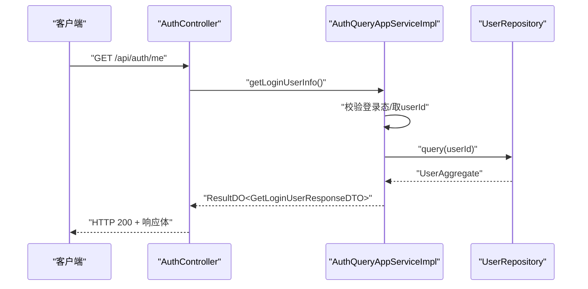
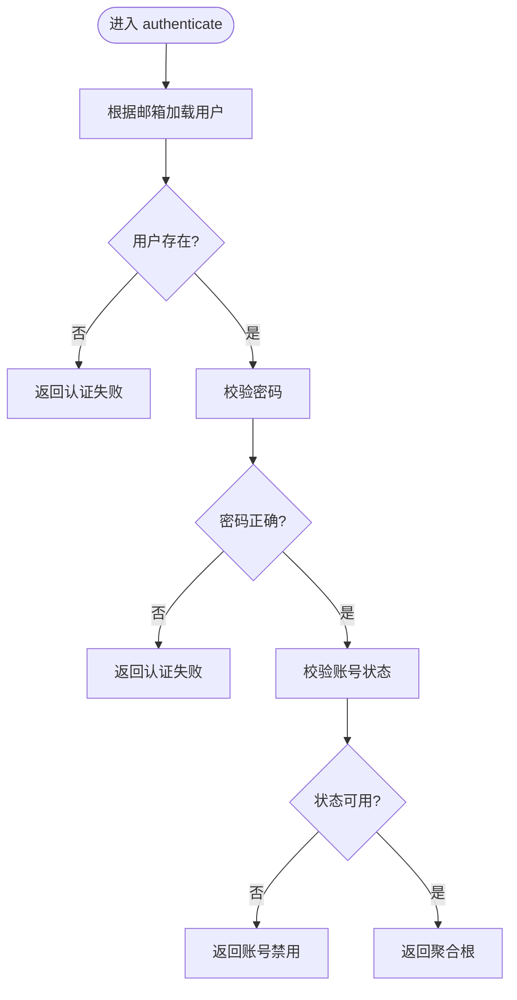
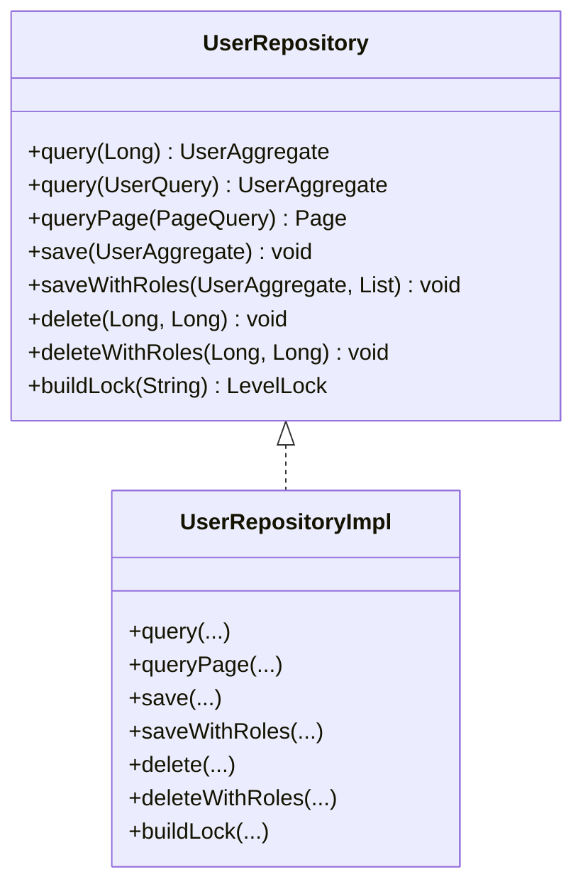
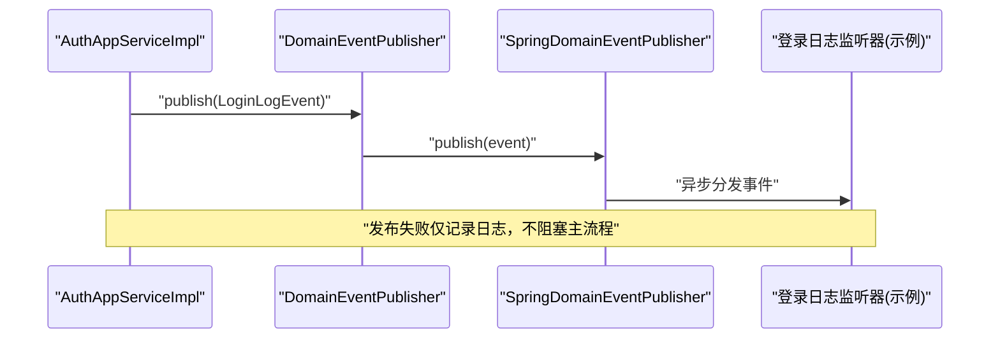
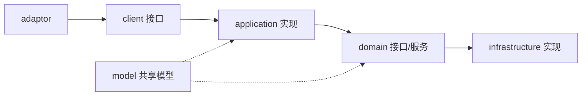

# 架构设计

<cite>
**本文引用的文件**
- [README.md](file://README.md)
- [SpringDddTemplateApplication.java](file://src/main/java/com/sunnao/spring/ddd/template/SpringDddTemplateApplication.java)
- [AuthController.java](file://src/main/java/com/sunnao/spring/ddd/template/adaptor/auth/input/AuthController.java)
- [AuthAppService.java](file://src/main/java/com/sunnao/spring/ddd/template/client/auth/AuthAppService.java)
- [AuthAppServiceImpl.java](file://src/main/java/com/sunnao/spring/ddd/template/application/auth/scenario/AuthAppServiceImpl.java)
- [AuthQueryAppServiceImpl.java](file://src/main/java/com/sunnao/spring/ddd/template/application/auth/scenario/AuthQueryAppServiceImpl.java)
- [AuthDomainServiceImpl.java](file://src/main/java/com/sunnao/spring/ddd/template/domain/auth/service/AuthDomainServiceImpl.java)
- [UserAggregate.java](file://src/main/java/com/sunnao/spring/ddd/template/domain/system/user/model/aggregate/UserAggregate.java)
- [UserRepository.java](file://src/main/java/com/sunnao/spring/ddd/template/domain/system/user/repository/UserRepository.java)
- [UserRepositoryImpl.java](file://src/main/java/com/sunnao/spring/ddd/template/infrastructure/system/user/repository/UserRepositoryImpl.java)
- [DomainEventPublisher.java](file://src/main/java/com/sunnao/spring/ddd/template/common/event/DomainEventPublisher.java)
- [SpringDomainEventPublisher.java](file://src/main/java/com/sunnao/spring/ddd/template/infrastructure/common/SpringDomainEventPublisher.java)
- [ddd-adaptor-layer.md](file://docs/rule/ddd/ddd-adaptor-layer.md)
- [ddd-model-layer.md](file://docs/rule/ddd/ddd-model-layer.md)
</cite>

## 目录
1. [引言](#引言)
2. [项目结构](#项目结构)
3. [核心组件](#核心组件)
4. [架构总览](#架构总览)
5. [详细组件分析](#详细组件分析)
6. [依赖关系分析](#依赖关系分析)
7. [性能与可扩展性](#性能与可扩展性)
8. [故障排查指南](#故障排查指南)
9. [结论](#结论)
10. [附录](#附录)

## 引言
本项目基于六边形架构（Hexagonal Architecture）与领域驱动设计（DDD），采用“自外向内”的调用方向与依赖倒置原则，将技术实现与业务逻辑解耦。系统内置认证、用户、角色（RBAC）、字典、操作日志、文件上传等模块，提供开箱即用的能力与清晰的边界：adaptor 适配层、application 应用层、domain 领域层、infrastructure 基础设施层、client 客户端接口层、model 共享模型层。文档围绕分层职责、数据与控制流向、事件机制、CQRS 读/写模式、防腐层设计展开，并给出架构图与关键流程时序图，帮助读者快速理解与扩展。

## 项目结构
整体包结构与分层约定遵循规范文档与 README 说明，典型调用顺序为：
- 输入适配 → 应用编排 → 领域服务/聚合根 → 仓储接口（由基础设施实现）
- 输出适配在应用层通过接口定义并由适配器实现，体现依赖倒置

图表来源
- [README.md:19-35](file://README.md#L19-L35)
- [ddd-adaptor-layer.md:1-120](file://docs/rule/ddd/ddd-adaptor-layer.md#L1-L120)

章节来源
- [README.md:19-35](file://README.md#L19-L35)
- [SpringDddTemplateApplication.java:1-16](file://src/main/java/com/sunnao/spring/ddd/template/SpringDddTemplateApplication.java#L1-L16)

## 核心组件
- 入口与路由
  - 启动类扫描 MyBatis-Flex Mapper，完成基础设施装配。
  - 认证控制器作为输入适配器，仅做参数接收与结果包装，不承载业务规则。
- 应用编排
  - 写模式：登录/注册/登出等会话变更；读模式：获取当前登录用户信息。
  - 负责参数校验、跨域协作（如角色领域）、事件发布、响应组装。
- 领域服务与聚合根
  - 认证领域服务封装密码校验与账号状态检查；用户聚合根封装创建、更新资料、状态变更、重置密码等业务方法。
- 仓储接口与实现
  - 仓储接口定义在领域层，实现位于基础设施层；支持分页、按条件查询、事务组合保存/删除、分布式锁构建。
- 事件机制
  - 领域事件发布器接口定义在通用层，Spring 实现位于基础设施层；监听器异步消费，失败不影响主流程。

章节来源
- [SpringDddTemplateApplication.java:1-16](file://src/main/java/com/sunnao/spring/ddd/template/SpringDddTemplateApplication.java#L1-L16)
- [AuthController.java:1-70](file://src/main/java/com/sunnao/spring/ddd/template/adaptor/auth/input/AuthController.java#L1-L70)
- [AuthAppService.java:1-39](file://src/main/java/com/sunnao/spring/ddd/template/client/auth/AuthAppService.java#L1-L39)
- [AuthAppServiceImpl.java:1-196](file://src/main/java/com/sunnao/spring/ddd/template/application/auth/scenario/AuthAppServiceImpl.java#L1-L196)
- [AuthQueryAppServiceImpl.java:1-57](file://src/main/java/com/sunnao/spring/ddd/template/application/auth/scenario/AuthQueryAppServiceImpl.java#L1-L57)
- [AuthDomainServiceImpl.java:1-58](file://src/main/java/com/sunnao/spring/ddd/template/domain/auth/service/AuthDomainServiceImpl.java#L1-L58)
- [UserAggregate.java:1-113](file://src/main/java/com/sunnao/spring/ddd/template/domain/system/user/model/aggregate/UserAggregate.java#L1-L113)
- [UserRepository.java:1-65](file://src/main/java/com/sunnao/spring/ddd/template/domain/system/user/repository/UserRepository.java#L1-L65)
- [UserRepositoryImpl.java:1-191](file://src/main/java/com/sunnao/spring/ddd/template/infrastructure/system/user/repository/UserRepositoryImpl.java#L1-L191)
- [DomainEventPublisher.java:1-20](file://src/main/java/com/sunnao/spring/ddd/template/common/event/DomainEventPublisher.java#L1-L20)
- [SpringDomainEventPublisher.java:1-35](file://src/main/java/com/sunnao/spring/ddd/template/infrastructure/common/SpringDomainEventPublisher.java#L1-L35)

## 架构总览
六边形架构在本项目的落地要点：
- 依赖倒置：应用层与领域层只依赖接口（仓储接口、事件发布器接口），具体实现由基础设施层提供。
- 防腐层：输入/输出适配器隔离外部协议与技术细节，避免污染上层。
- CQRS：写模式通过命令 AppService 编排，读模式通过查询 AppService 直接走仓储或跨领域查询。
- 事件驱动：登录成功/失败均发布登录日志事件，异步落库，提升主流程吞吐与可观测性。

图表来源
- [AuthController.java:1-70](file://src/main/java/com/sunnao/spring/ddd/template/adaptor/auth/input/AuthController.java#L1-L70)
- [AuthAppService.java:1-39](file://src/main/java/com/sunnao/spring/ddd/template/client/auth/AuthAppService.java#L1-L39)
- [AuthAppServiceImpl.java:1-196](file://src/main/java/com/sunnao/spring/ddd/template/application/auth/scenario/AuthAppServiceImpl.java#L1-L196)
- [AuthQueryAppServiceImpl.java:1-57](file://src/main/java/com/sunnao/spring/ddd/template/application/auth/scenario/AuthQueryAppServiceImpl.java#L1-L57)
- [AuthDomainServiceImpl.java:1-58](file://src/main/java/com/sunnao/spring/ddd/template/domain/auth/service/AuthDomainServiceImpl.java#L1-L58)
- [UserRepository.java:1-65](file://src/main/java/com/sunnao/spring/ddd/template/domain/system/user/repository/UserRepository.java#L1-L65)
- [UserRepositoryImpl.java:1-191](file://src/main/java/com/sunnao/spring/ddd/template/infrastructure/system/user/repository/UserRepositoryImpl.java#L1-L191)
- [DomainEventPublisher.java:1-20](file://src/main/java/com/sunnao/spring/ddd/template/common/event/DomainEventPublisher.java#L1-L20)
- [SpringDomainEventPublisher.java:1-35](file://src/main/java/com/sunnao/spring/ddd/template/infrastructure/common/SpringDomainEventPublisher.java#L1-L35)
- [UserAggregate.java:1-113](file://src/main/java/com/sunnao/spring/ddd/template/domain/system/user/model/aggregate/UserAggregate.java#L1-L113)

## 详细组件分析

### 认证写模式流程（登录/注册/登出）
- 控制流
  - 输入适配器接收请求，调用命令 AppService。
  - 应用层进行参数校验、防爆破检查、领域认证、会话签发、事件发布与响应组装。
  - 领域服务执行密码与状态校验，返回聚合根。
  - 应用层通过仓储接口读取角色标识，最终返回结果。
- 数据流
  - 请求 DTO → 领域参数 → 聚合根 → PO（持久化）→ 响应 DTO。
- 事件驱动
  - 登录成功/失败均发布登录日志事件，基础设施层基于 Spring 事件异步落库。

图表来源
- [AuthController.java:1-70](file://src/main/java/com/sunnao/spring/ddd/template/adaptor/auth/input/AuthController.java#L1-L70)
- [AuthAppServiceImpl.java:1-196](file://src/main/java/com/sunnao/spring/ddd/template/application/auth/scenario/AuthAppServiceImpl.java#L1-L196)
- [AuthDomainServiceImpl.java:1-58](file://src/main/java/com/sunnao/spring/ddd/template/domain/auth/service/AuthDomainServiceImpl.java#L1-L58)
- [UserRepository.java:1-65](file://src/main/java/com/sunnao/spring/ddd/template/domain/system/user/repository/UserRepository.java#L1-L65)
- [DomainEventPublisher.java:1-20](file://src/main/java/com/sunnao/spring/ddd/template/common/event/DomainEventPublisher.java#L1-L20)

章节来源
- [AuthController.java:1-70](file://src/main/java/com/sunnao/spring/ddd/template/adaptor/auth/input/AuthController.java#L1-L70)
- [AuthAppServiceImpl.java:1-196](file://src/main/java/com/sunnao/spring/ddd/template/application/auth/scenario/AuthAppServiceImpl.java#L1-L196)
- [AuthDomainServiceImpl.java:1-58](file://src/main/java/com/sunnao/spring/ddd/template/domain/auth/service/AuthDomainServiceImpl.java#L1-L58)
- [UserRepository.java:1-65](file://src/main/java/com/sunnao/spring/ddd/template/domain/system/user/repository/UserRepository.java#L1-L65)
- [DomainEventPublisher.java:1-20](file://src/main/java/com/sunnao/spring/ddd/template/common/event/DomainEventPublisher.java#L1-L20)

### 认证读模式流程（获取当前登录用户）
- 控制流
  - 输入适配器调用查询 AppService。
  - 应用层从会话取登录ID，通过仓储接口查询用户聚合根，填充角色标识后组装响应。
- 数据流
  - 会话ID → 聚合根 → 响应 DTO。

图表来源
- [AuthController.java:1-70](file://src/main/java/com/sunnao/spring/ddd/template/adaptor/auth/input/AuthController.java#L1-L70)
- [AuthQueryAppServiceImpl.java:1-57](file://src/main/java/com/sunnao/spring/ddd/template/application/auth/scenario/AuthQueryAppServiceImpl.java#L1-L57)
- [UserRepository.java:1-65](file://src/main/java/com/sunnao/spring/ddd/template/domain/system/user/repository/UserRepository.java#L1-L65)

章节来源
- [AuthController.java:1-70](file://src/main/java/com/sunnao/spring/ddd/template/adaptor/auth/input/AuthController.java#L1-L70)
- [AuthQueryAppServiceImpl.java:1-57](file://src/main/java/com/sunnao/spring/ddd/template/application/auth/scenario/AuthQueryAppServiceImpl.java#L1-L57)
- [UserRepository.java:1-65](file://src/main/java/com/sunnao/spring/ddd/template/domain/system/user/repository/UserRepository.java#L1-L65)

### 领域服务与聚合根
- 认证领域服务
  - 职责：加载用户、校验密码、校验账号状态；异常统一捕获并转换为结果对象，不向上抛。
- 用户聚合根
  - 职责：封装用户实体的创建、更新资料、状态变更、重置密码等方法；对外暴露业务语义方法，内部维护实体一致性。

图表来源
- [AuthDomainServiceImpl.java:1-58](file://src/main/java/com/sunnao/spring/ddd/template/domain/auth/service/AuthDomainServiceImpl.java#L1-L58)

章节来源
- [AuthDomainServiceImpl.java:1-58](file://src/main/java/com/sunnao/spring/ddd/template/domain/auth/service/AuthDomainServiceImpl.java#L1-L58)
- [UserAggregate.java:1-113](file://src/main/java/com/sunnao/spring/ddd/template/domain/system/user/model/aggregate/UserAggregate.java#L1-L113)

### 仓储接口与基础设施实现
- 仓储接口
  - 定义在领域层，包含基础 CRUD、分页、按条件查询、事务组合保存/删除、分布式锁构建。
- 基础设施实现
  - 负责 PO 与聚合根的转换、MyBatis-Flex 查询构造、分页映射、审计字段自动填充、事务边界与异常转换。

图表来源
- [UserRepository.java:1-65](file://src/main/java/com/sunnao/spring/ddd/template/domain/system/user/repository/UserRepository.java#L1-L65)
- [UserRepositoryImpl.java:1-191](file://src/main/java/com/sunnao/spring/ddd/template/infrastructure/system/user/repository/UserRepositoryImpl.java#L1-L191)

章节来源
- [UserRepository.java:1-65](file://src/main/java/com/sunnao/spring/ddd/template/domain/system/user/repository/UserRepository.java#L1-L65)
- [UserRepositoryImpl.java:1-191](file://src/main/java/com/sunnao/spring/ddd/template/infrastructure/system/user/repository/UserRepositoryImpl.java#L1-L191)

### 事件驱动与防腐层
- 事件发布器
  - 接口定义在通用层，Spring 实现位于基础设施层；发布失败记录日志，不影响主流程。
- 防腐层（ACL）
  - 输入/输出适配器隔离外部协议与技术细节；输出适配器接口由应用层定义，实现位于适配器层，体现依赖倒置。

图表来源
- [AuthAppServiceImpl.java:1-196](file://src/main/java/com/sunnao/spring/ddd/template/application/auth/scenario/AuthAppServiceImpl.java#L1-L196)
- [DomainEventPublisher.java:1-20](file://src/main/java/com/sunnao/spring/ddd/template/common/event/DomainEventPublisher.java#L1-L20)
- [SpringDomainEventPublisher.java:1-35](file://src/main/java/com/sunnao/spring/ddd/template/infrastructure/common/SpringDomainEventPublisher.java#L1-L35)

章节来源
- [AuthAppServiceImpl.java:1-196](file://src/main/java/com/sunnao/spring/ddd/template/application/auth/scenario/AuthAppServiceImpl.java#L1-L196)
- [DomainEventPublisher.java:1-20](file://src/main/java/com/sunnao/spring/ddd/template/common/event/DomainEventPublisher.java#L1-L20)
- [SpringDomainEventPublisher.java:1-35](file://src/main/java/com/sunnao/spring/ddd/template/infrastructure/common/SpringDomainEventPublisher.java#L1-L35)
- [ddd-adaptor-layer.md:1-120](file://docs/rule/ddd/ddd-adaptor-layer.md#L1-L120)

## 依赖关系分析
- 依赖方向
  - adaptor → client 接口 → application 实现 → domain 接口/服务 → infrastructure 实现
  - model 被多模块共享，但 client 禁止依赖 model，保持对外契约自包含
- 耦合与内聚
  - 仓储接口与实现分离，降低耦合；应用层通过接口依赖，提高可替换性
  - 事件发布器接口与实现分离，便于替换为 MQ 或其他后端
- 潜在循环依赖
  - 通过接口与分层约束避免循环；领域层不依赖基础设施与适配层

图表来源
- [README.md:19-35](file://README.md#L19-L35)
- [ddd-model-layer.md:1-97](file://docs/rule/ddd/ddd-model-layer.md#L1-L97)

章节来源
- [README.md:19-35](file://README.md#L19-L35)
- [ddd-model-layer.md:1-97](file://docs/rule/ddd/ddd-model-layer.md#L1-L97)

## 性能与可扩展性
- 读写分离与 CQRS
  - 写路径通过领域服务与仓储保证一致性与事务；读路径可直接走仓储或跨领域查询，减少不必要的状态变更。
- 异步事件
  - 登录日志等旁路处理通过事件异步落库，降低主流程延迟。
- 分布式锁
  - 仓储接口提供锁构建能力，写模式可在领域服务中先加锁再执行业务，避免并发冲突。
- 存储抽象
  - 文件存储通过应用层接口抽象，适配器层提供本地/对象存储实现，可按需切换。
- 可扩展点
  - 新增业务模块时，遵循分层与命名规范，新增领域服务、仓储接口及实现、应用编排与适配器即可。

[本节为通用指导，无需特定文件引用]

## 故障排查指南
- 全局异常处理
  - 适配层统一捕获框架异常与业务异常，转换为标准结果对象返回，避免异常泄漏到客户端。
- 事件发布失败
  - 事件发布失败仅记录日志，不影响主流程；若出现大量失败，检查事件监听器配置与异步线程池。
- 数据库访问异常
  - 仓储实现将底层异常转换为仓储异常，结合错误码定位问题；关注分页与条件查询构造是否正确。
- 防爆破与限流
  - 登录失败计数达到阈值会拒绝登录；确认 Redis 连接与会话键空间是否充足。

章节来源
- [AuthAppServiceImpl.java:1-196](file://src/main/java/com/sunnao/spring/ddd/template/application/auth/scenario/AuthAppServiceImpl.java#L1-L196)
- [UserRepositoryImpl.java:1-191](file://src/main/java/com/sunnao/spring/ddd/template/infrastructure/system/user/repository/UserRepositoryImpl.java#L1-L191)
- [SpringDomainEventPublisher.java:1-35](file://src/main/java/com/sunnao/spring/ddd/template/infrastructure/common/SpringDomainEventPublisher.java#L1-L35)

## 结论
本项目以六边形架构为核心，结合 DDD 的分层与领域建模思想，清晰划分了各层职责与依赖方向。通过仓储接口与基础设施实现的解耦、事件驱动的异步处理、以及适配层的防腐设计，系统在可维护性、可扩展性与稳定性方面具备良好基础。建议在后续演进中持续遵循分层规范，逐步引入更丰富的领域事件与跨领域协作模式，并在高并发场景下评估缓存与分库分表策略。

[本节为总结性内容，无需特定文件引用]

## 附录
- 开发模式选择
  - 写模式：聚合根/实体承载业务逻辑，修改状态
  - 读模式：聚合根作为数据载体，无状态变更
  - 纯计算模式：领域服务承载计算逻辑
  - 规则+计算模式：聚合根匹配规则并计算
- 编码约定
  - 全链路使用统一结果对象，不抛异常
  - 入参 DTO 自校验，应用层不写校验逻辑
  - Assembler/Converter 手写，明确职责边界
  - 审计字段自动填充，操作人来自上下文

章节来源
- [README.md:37-46](file://README.md#L37-L46)
- [ddd-adaptor-layer.md:1-120](file://docs/rule/ddd/ddd-adaptor-layer.md#L1-L120)
- [ddd-model-layer.md:1-97](file://docs/rule/ddd/ddd-model-layer.md#L1-L97)