# 设计模式与最佳实践

<cite>
**本文引用的文件**
- [README.md](file://README.md)
- [FileStorage.java](file://src/main/java/com/sunnao/spring/ddd/template/application/system/file/FileStorage.java)
- [LockFactory.java](file://src/main/java/com/sunnao/spring/ddd/template/common/lock/LockFactory.java)
- [DomainEventPublisher.java](file://src/main/java/com/sunnao/spring/ddd/template/common/event/DomainEventPublisher.java)
- [SpringDomainEventPublisher.java](file://src/main/java/com/sunnao/spring/ddd/template/infrastructure/common/SpringDomainEventPublisher.java)
- [UserRepository.java](file://src/main/java/com/sunnao/spring/ddd/template/domain/system/user/repository/UserRepository.java)
- [UserRepositoryImpl.java](file://src/main/java/com/sunnao/spring/ddd/template/infrastructure/system/user/repository/UserRepositoryImpl.java)
- [AuthAssembler.java](file://src/main/java/com/sunnao/spring/ddd/template/application/auth/assembler/AuthAssembler.java)
- [FileAppServiceImpl.java](file://src/main/java/com/sunnao/spring/ddd/template/application/system/file/scenario/FileAppServiceImpl.java)
- [FileController.java](file://src/main/java/com/sunnao/spring/ddd/template/adaptor/system/file/input/FileController.java)
- [LoginLogListener.java](file://src/main/java/com/sunnao/spring/ddd/template/application/system/log/listener/LoginLogListener.java)
- [OperLogListener.java](file://src/main/java/com/sunnao/spring/ddd/template/application/system/log/listener/OperLogListener.java)
- [UserCreatedListener.java](file://src/main/java/com/sunnao/spring/ddd/template/application/system/user/listener/UserCreatedListener.java)
</cite>

## 目录
1. [引言](#引言)
2. [项目结构](#项目结构)
3. [核心组件](#核心组件)
4. [架构总览](#架构总览)
5. [详细组件分析](#详细组件分析)
6. [依赖关系分析](#依赖关系分析)
7. [性能考虑](#性能考虑)
8. [故障排查指南](#故障排查指南)
9. [结论](#结论)
10. [附录](#附录)

## 引言
本文件面向希望在本项目中落地“设计模式与最佳实践”的工程师，围绕以下主题展开：策略模式（文件存储后端切换）、工厂模式（分布式锁创建）、观察者模式（领域事件处理）、模板方法模式（基础服务类体现）、仓储模式（接口抽象解耦数据访问）、装配器模式（Assembler 在 DTO 与领域对象转换中的作用）、防腐层模式（保护领域层免受外部系统变化影响），以及异步事件处理的完整方案（发布、监听、错误处理与重试机制）。同时给出性能优化建议、重构指南与常见反模式的避免方法。

## 项目结构
本项目遵循六边形架构，调用顺序自外向内：adaptor(input) → application → domain → repository 接口（infrastructure 实现）→ adaptor(output)。应用层定义对外部系统的接口（如 FileStorage），具体实现在 adaptor 层；领域层仅依赖接口，不感知基础设施细节。

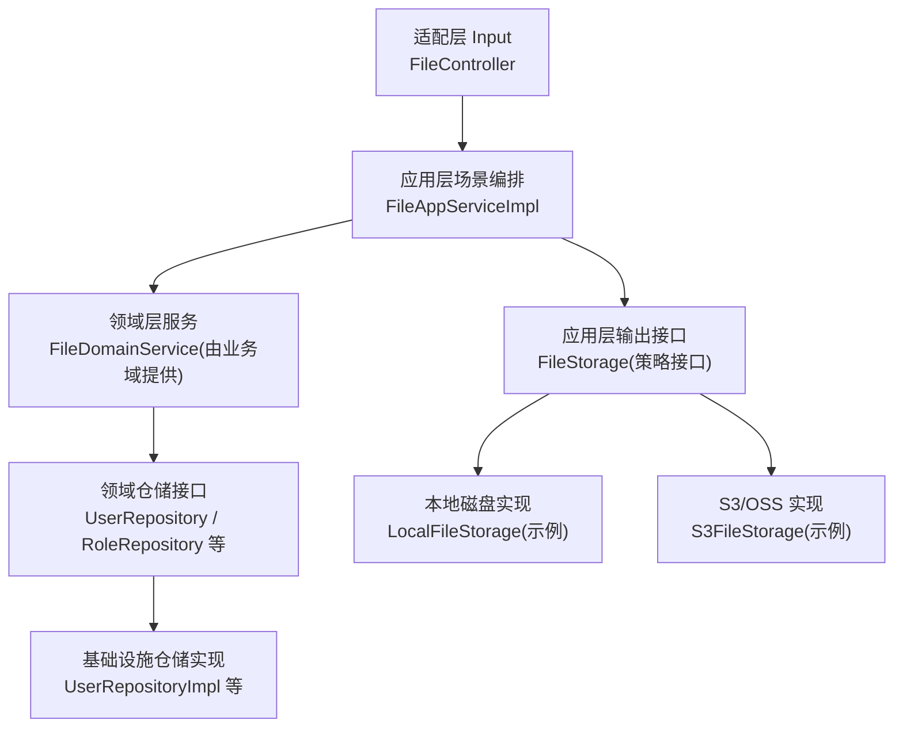

图示来源
- [FileController.java:1-130](file://src/main/java/com/sunnao/spring/ddd/template/adaptor/system/file/input/FileController.java#L1-L130)
- [FileAppServiceImpl.java:1-107](file://src/main/java/com/sunnao/spring/ddd/template/application/system/file/scenario/FileAppServiceImpl.java#L1-L107)
- [FileStorage.java:1-47](file://src/main/java/com/sunnao/spring/ddd/template/application/system/file/FileStorage.java#L1-L47)
- [UserRepository.java:1-65](file://src/main/java/com/sunnao/spring/ddd/template/domain/system/user/repository/UserRepository.java#L1-L65)
- [UserRepositoryImpl.java:1-191](file://src/main/java/com/sunnao/spring/ddd/template/infrastructure/system/user/repository/UserRepositoryImpl.java#L1-L191)

章节来源
- [README.md:19-46](file://README.md#L19-L46)

## 核心组件
- 策略模式：通过 application 层定义的 FileStorage 接口，配合配置项 app.file.storage-type 选择不同实现（本地磁盘或 S3 兼容对象存储），实现存储后端的可插拔切换。
- 工厂模式：LockFactory 根据配置 app.lock.type 返回 RedisLevelLock 或 JvmLevelLock，屏蔽锁实现的差异，供仓储构建锁实例。
- 观察者模式：DomainEventPublisher 作为进程内事件发布器接口，SpringDomainEventPublisher 基于 ApplicationEventPublisher 实现；监听器以 @Async 异步消费，失败不影响主流程。
- 模板方法模式：AggregateRepository 基类统一了 query/save/queryPage 等通用能力，各仓储接口继承并扩展特定方法，减少重复代码。
- 仓储模式：领域层只声明 Repository 接口，基础设施层提供实现，完成 PO ↔ 聚合根的技术转换与持久化细节封装。
- 装配器模式：Assembler（如 AuthAssembler）负责 RequestDTO/ResponseDTO 与领域 Param/Aggregate 之间的映射，保持应用层无侵入的业务规则。
- 防腐层模式：adaptor 层将 HTTP/Multipart 等外部协议转换为自包含 DTO，禁止越界携带技术细节进入应用/领域层。

章节来源
- [FileStorage.java:1-47](file://src/main/java/com/sunnao/spring/ddd/template/application/system/file/FileStorage.java#L1-L47)
- [LockFactory.java:1-41](file://src/main/java/com/sunnao/spring/ddd/template/common/lock/LockFactory.java#L1-L41)
- [DomainEventPublisher.java:1-20](file://src/main/java/com/sunnao/spring/ddd/template/common/event/DomainEventPublisher.java#L1-L20)
- [SpringDomainEventPublisher.java:1-35](file://src/main/java/com/sunnao/spring/ddd/template/infrastructure/common/SpringDomainEventPublisher.java#L1-L35)
- [UserRepository.java:1-65](file://src/main/java/com/sunnao/spring/ddd/template/domain/system/user/repository/UserRepository.java#L1-L65)
- [UserRepositoryImpl.java:1-191](file://src/main/java/com/sunnao/spring/ddd/template/infrastructure/system/user/repository/UserRepositoryImpl.java#L1-L191)
- [AuthAssembler.java:1-99](file://src/main/java/com/sunnao/spring/ddd/template/application/auth/assembler/AuthAssembler.java#L1-L99)
- [FileController.java:1-130](file://src/main/java/com/sunnao/spring/ddd/template/adaptor/system/file/input/FileController.java#L1-L130)

## 架构总览
下图展示了从 HTTP 请求到领域持久化的端到端路径，以及策略与工厂的注入点。

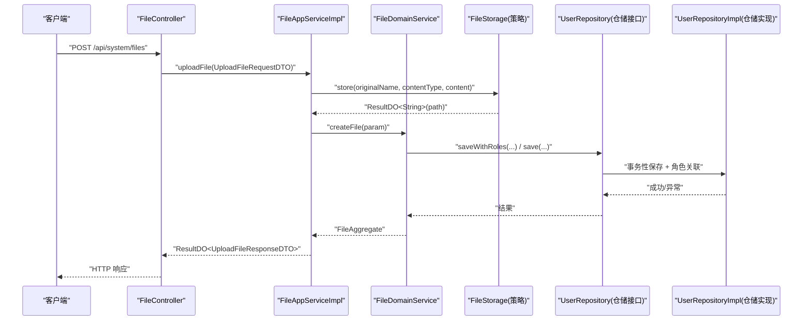

图示来源
- [FileController.java:1-130](file://src/main/java/com/sunnao/spring/ddd/template/adaptor/system/file/input/FileController.java#L1-L130)
- [FileAppServiceImpl.java:1-107](file://src/main/java/com/sunnao/spring/ddd/template/application/system/file/scenario/FileAppServiceImpl.java#L1-L107)
- [FileStorage.java:1-47](file://src/main/java/com/sunnao/spring/ddd/template/application/system/file/FileStorage.java#L1-L47)
- [UserRepository.java:1-65](file://src/main/java/com/sunnao/spring/ddd/template/domain/system/user/repository/UserRepository.java#L1-L65)
- [UserRepositoryImpl.java:1-191](file://src/main/java/com/sunnao/spring/ddd/template/infrastructure/system/user/repository/UserRepositoryImpl.java#L1-L191)

## 详细组件分析

### 策略模式：文件存储后端切换
- 设计要点
  - 接口定义在 application 层（FileStorage），具体实现位于 adaptor 层（本地磁盘、S3 兼容对象存储），通过配置项 app.file.storage-type 条件装配。
  - 所有方法返回 ResultDO，不向调用方抛出异常，保证上层稳定。
- 使用方式
  - 应用层场景编排中直接依赖 FileStorage 接口，无需关心具体实现。
  - 上传流程：先存物理文件，再登记元数据；若元数据登记失败，尽力而为回滚物理文件。
- 优势
  - 存储后端可插拔，便于多环境或多云部署。
  - 上层对底层实现零耦合，测试时可用 Mock 替换。

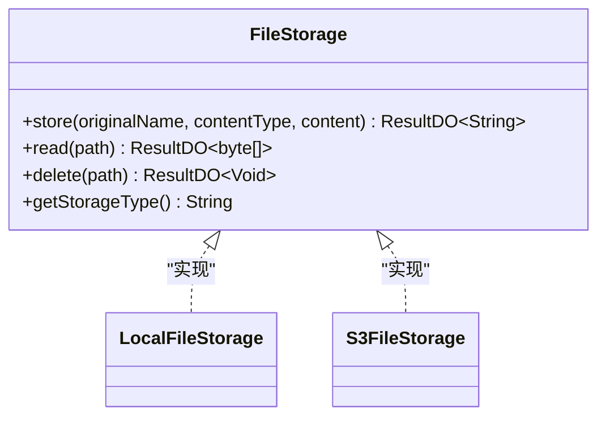

图示来源
- [FileStorage.java:1-47](file://src/main/java/com/sunnao/spring/ddd/template/application/system/file/FileStorage.java#L1-L47)

章节来源
- [FileStorage.java:1-47](file://src/main/java/com/sunnao/spring/ddd/template/application/system/file/FileStorage.java#L1-L47)
- [FileAppServiceImpl.java:1-107](file://src/main/java/com/sunnao/spring/ddd/template/application/system/file/scenario/FileAppServiceImpl.java#L1-L107)
- [README.md:97-117](file://README.md#L97-L117)

### 工厂模式：分布式锁创建
- 设计要点
  - LockFactory 根据配置 app.lock.type 返回 RedisLevelLock 或 JvmLevelLock，仓储实现通过 buildLock(lockKey) 暴露给领域服务。
  - 领域服务只依赖 LevelLock 接口，不感知锁的具体实现。
- 使用方式
  - 写模式标准流程：领域服务先 buildLock().tryLock()，再加载/构建聚合根、执行业务方法、repository.save()，finally 释放锁。
- 优势
  - 单机与分布式锁无缝切换，便于开发与生产环境一致体验。

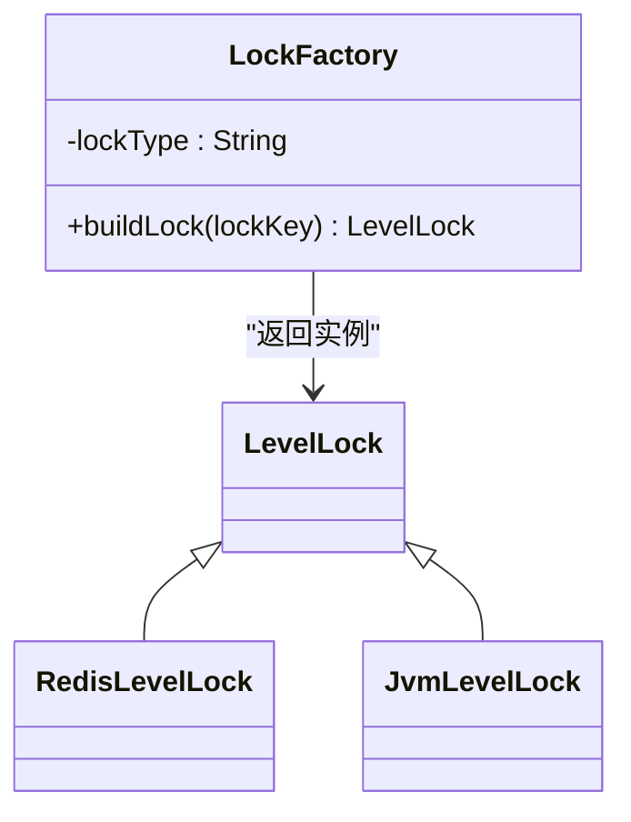

图示来源
- [LockFactory.java:1-41](file://src/main/java/com/sunnao/spring/ddd/template/common/lock/LockFactory.java#L1-L41)
- [UserRepository.java:57-64](file://src/main/java/com/sunnao/spring/ddd/template/domain/system/user/repository/UserRepository.java#L57-L64)
- [UserRepositoryImpl.java:165-168](file://src/main/java/com/sunnao/spring/ddd/template/infrastructure/system/user/repository/UserRepositoryImpl.java#L165-L168)

章节来源
- [LockFactory.java:1-41](file://src/main/java/com/sunnao/spring/ddd/template/common/lock/LockFactory.java#L1-L41)
- [UserRepository.java:57-64](file://src/main/java/com/sunnao/spring/ddd/template/domain/system/user/repository/UserRepository.java#L57-L64)
- [UserRepositoryImpl.java:165-168](file://src/main/java/com/sunnao/spring/ddd/template/infrastructure/system/user/repository/UserRepositoryImpl.java#L165-L168)
- [README.md:119-127](file://README.md#L119-L127)

### 观察者模式：领域事件处理
- 设计要点
  - DomainEventPublisher 为进程内事件发布器接口，SpringDomainEventPublisher 基于 ApplicationEventPublisher 实现。
  - 监听器以 @Async 异步消费，失败仅记录日志，不影响主流程。
- 典型事件
  - 登录日志：LoginLogListener 异步落库。
  - 操作日志：OperLogListener 异步落库。
  - 用户创建：UserCreatedListener 示例消费（可扩展邮件、初始化等）。
- 发布失败处理
  - 发布失败不抛异常、不影响主流程，实现内部自行记录日志。

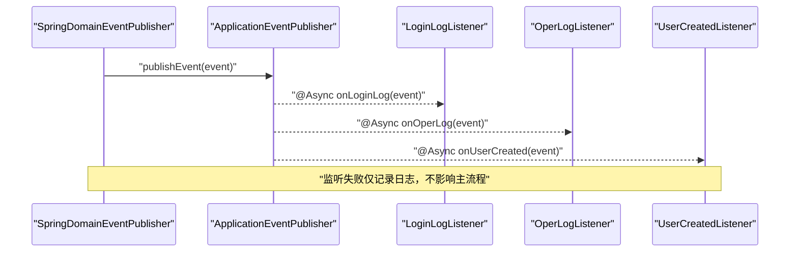

图示来源
- [SpringDomainEventPublisher.java:1-35](file://src/main/java/com/sunnao/spring/ddd/template/infrastructure/common/SpringDomainEventPublisher.java#L1-L35)
- [LoginLogListener.java:1-36](file://src/main/java/com/sunnao/spring/ddd/template/application/system/log/listener/LoginLogListener.java#L1-L36)
- [OperLogListener.java:1-36](file://src/main/java/com/sunnao/spring/ddd/template/application/system/log/listener/OperLogListener.java#L1-L36)
- [UserCreatedListener.java:1-31](file://src/main/java/com/sunnao/spring/ddd/template/application/system/user/listener/UserCreatedListener.java#L1-L31)

章节来源
- [DomainEventPublisher.java:1-20](file://src/main/java/com/sunnao/spring/ddd/template/common/event/DomainEventPublisher.java#L1-L20)
- [SpringDomainEventPublisher.java:1-35](file://src/main/java/com/sunnao/spring/ddd/template/infrastructure/common/SpringDomainEventPublisher.java#L1-L35)
- [LoginLogListener.java:1-36](file://src/main/java/com/sunnao/spring/ddd/template/application/system/log/listener/LoginLogListener.java#L1-L36)
- [OperLogListener.java:1-36](file://src/main/java/com/sunnao/spring/ddd/template/application/system/log/listener/OperLogListener.java#L1-L36)
- [UserCreatedListener.java:1-31](file://src/main/java/com/sunnao/spring/ddd/template/application/system/user/listener/UserCreatedListener.java#L1-L31)

### 模板方法模式：基础服务类体现
- 设计要点
  - AggregateRepository 基类统一 query/save/queryPage 等通用能力，各仓储接口继承并扩展特定方法（如 saveWithRoles、deleteWithRoles、queryByEmail）。
  - 仓储实现复用基类逻辑，聚焦领域特有查询与组合写入。
- 价值
  - 降低重复代码，提升一致性；新增仓储只需关注差异化部分。

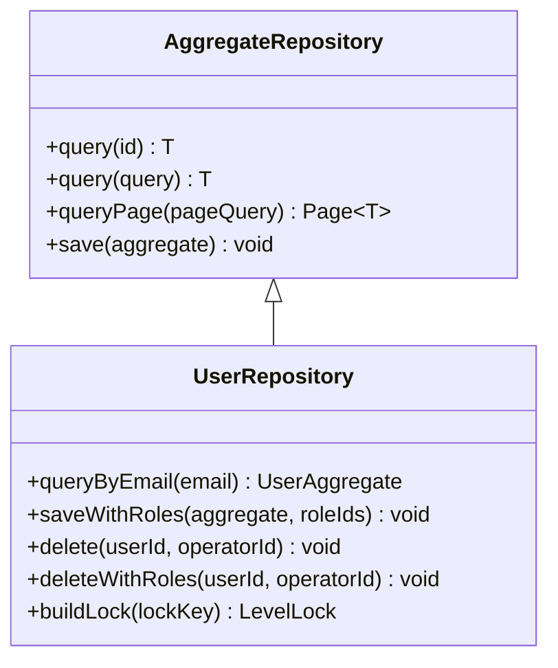

图示来源
- [UserRepository.java:1-65](file://src/main/java/com/sunnao/spring/ddd/template/domain/system/user/repository/UserRepository.java#L1-L65)

章节来源
- [UserRepository.java:1-65](file://src/main/java/com/sunnao/spring/ddd/template/domain/system/user/repository/UserRepository.java#L1-L65)

### 仓储模式：接口抽象与解耦
- 设计理念
  - 领域层只依赖 Repository 接口，基础设施层提供实现，完成 PO ↔ 聚合根的技术转换与持久化细节封装。
  - 跨仓储组合方法（如 saveWithRoles/deleteWithRoles）在同一事务内保证一致性。
- 实现要点
  - 分页查询：将自定义 PageQuery 转换为 MyBatis-Flex 分页参数。
  - 审计字段：由全局监听器自动填充 createAt/updateAt/createBy/updateBy。
  - 异常包装：数据库异常统一包装为 RepositoryException，携带错误码。

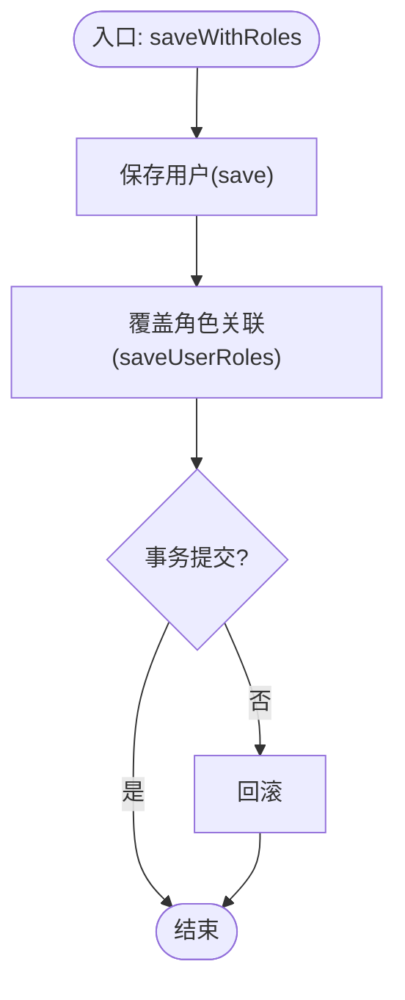

图示来源
- [UserRepositoryImpl.java:119-125](file://src/main/java/com/sunnao/spring/ddd/template/infrastructure/system/user/repository/UserRepositoryImpl.java#L119-L125)

章节来源
- [UserRepositoryImpl.java:1-191](file://src/main/java/com/sunnao/spring/ddd/template/infrastructure/system/user/repository/UserRepositoryImpl.java#L1-L191)

### 装配器模式：Assembler 在 DTO 与领域对象转换中的作用
- 职责边界
  - application 层的 Assembler 负责 RequestDTO/ResponseDTO 与领域 Param/Aggregate 的映射。
  - infrastructure 层的 Converter 负责 PO 与领域对象的纯技术转换。
- 示例
  - AuthAssembler 提供登录、注册、当前用户信息的转换方法，支持枚举映射与默认值处理。

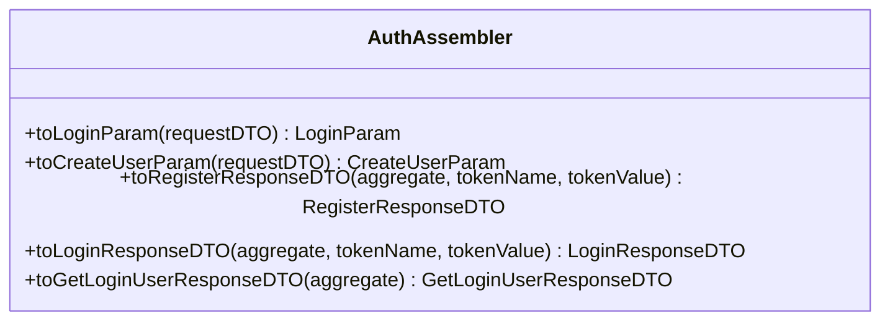

图示来源
- [AuthAssembler.java:1-99](file://src/main/java/com/sunnao/spring/ddd/template/application/auth/assembler/AuthAssembler.java#L1-L99)

章节来源
- [AuthAssembler.java:1-99](file://src/main/java/com/sunnao/spring/ddd/template/application/auth/assembler/AuthAssembler.java#L1-L99)

### 防腐层模式：保护领域层免受外部系统变化影响
- 设计要点
  - adaptor 层将 HTTP/Multipart 等外部协议转换为自包含 DTO，禁止越界携带技术细节进入应用/领域层。
  - 权限控制、日志采集、异常兜底均在适配层集中处理。
- 示例
  - FileController 将 MultipartFile 转为 UploadFileRequestDTO，再交由应用层处理。

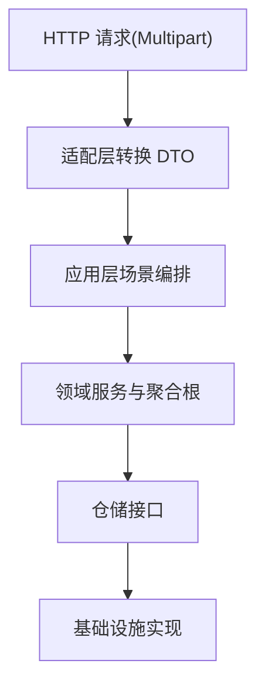

图示来源
- [FileController.java:1-130](file://src/main/java/com/sunnao/spring/ddd/template/adaptor/system/file/input/FileController.java#L1-L130)

章节来源
- [FileController.java:1-130](file://src/main/java/com/sunnao/spring/ddd/template/adaptor/system/file/input/FileController.java#L1-L130)

### 异步事件处理的完整实现方案
- 事件发布
  - 通过 DomainEventPublisher.publish(event) 发布，SpringDomainEventPublisher 基于 ApplicationEventPublisher 广播。
- 监听器注册
  - 监听器使用 @Component + @EventListener + @Async 注册，线程池由 AsyncConfig 管理，MDC 透传 traceId。
- 错误处理
  - 监听器内部 try-catch 记录日志，不影响主流程；发布器捕获异常仅记录日志。
- 重试机制（建议）
  - 当前实现未内置重试；可在监听器中引入幂等键与重试队列（如 Redis List/RabbitMQ），结合指数退避与死信队列。
  - 对于关键事件（如计费、通知），建议采用可靠投递与补偿任务。

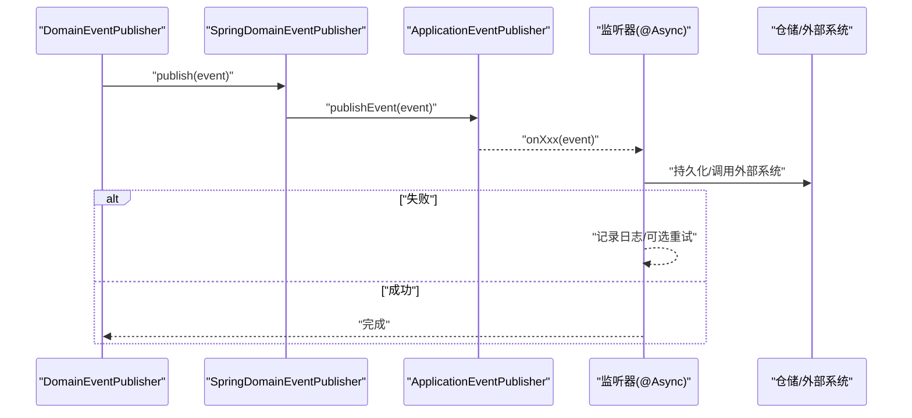

图示来源
- [SpringDomainEventPublisher.java:1-35](file://src/main/java/com/sunnao/spring/ddd/template/infrastructure/common/SpringDomainEventPublisher.java#L1-L35)
- [LoginLogListener.java:1-36](file://src/main/java/com/sunnao/spring/ddd/template/application/system/log/listener/LoginLogListener.java#L1-L36)
- [OperLogListener.java:1-36](file://src/main/java/com/sunnao/spring/ddd/template/application/system/log/listener/OperLogListener.java#L1-L36)
- [UserCreatedListener.java:1-31](file://src/main/java/com/sunnao/spring/ddd/template/application/system/user/listener/UserCreatedListener.java#L1-L31)

章节来源
- [DomainEventPublisher.java:1-20](file://src/main/java/com/sunnao/spring/ddd/template/common/event/DomainEventPublisher.java#L1-L20)
- [SpringDomainEventPublisher.java:1-35](file://src/main/java/com/sunnao/spring/ddd/template/infrastructure/common/SpringDomainEventPublisher.java#L1-L35)
- [LoginLogListener.java:1-36](file://src/main/java/com/sunnao/spring/ddd/template/application/system/log/listener/LoginLogListener.java#L1-L36)
- [OperLogListener.java:1-36](file://src/main/java/com/sunnao/spring/ddd/template/application/system/log/listener/OperLogListener.java#L1-L36)
- [UserCreatedListener.java:1-31](file://src/main/java/com/sunnao/spring/ddd/template/application/system/user/listener/UserCreatedListener.java#L1-L31)

## 依赖关系分析
- 组件耦合与内聚
  - 应用层依赖领域接口与外部系统接口（FileStorage），不依赖基础设施实现。
  - 仓储接口在领域层，实现位于基础设施层，形成清晰的依赖倒置。
- 外部依赖
  - Redis（会话/分布式锁/字典缓存）、PostgreSQL（持久化）、Sa-Token（认证鉴权）、MyBatis-Flex（ORM）。
- 潜在循环依赖
  - 仓储实现可能依赖其他仓储（如 saveWithRoles 委托 RoleRepository），需确保事务传播正确，避免循环调用。

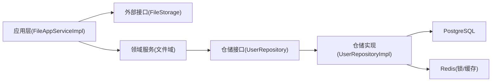

图示来源
- [FileAppServiceImpl.java:1-107](file://src/main/java/com/sunnao/spring/ddd/template/application/system/file/scenario/FileAppServiceImpl.java#L1-L107)
- [FileStorage.java:1-47](file://src/main/java/com/sunnao/spring/ddd/template/application/system/file/FileStorage.java#L1-L47)
- [UserRepository.java:1-65](file://src/main/java/com/sunnao/spring/ddd/template/domain/system/user/repository/UserRepository.java#L1-L65)
- [UserRepositoryImpl.java:1-191](file://src/main/java/com/sunnao/spring/ddd/template/infrastructure/system/user/repository/UserRepositoryImpl.java#L1-L191)

章节来源
- [README.md:6-18](file://README.md#L6-L18)

## 性能考虑
- 缓存策略
  - 字典按 typeKey 查启用数据走 Redis 缓存，写操作自动失效缓存，兼顾读性能与一致性。
- 连接池配置
  - PostgreSQL 与 Redis 连接池建议根据 QPS 与延迟目标调优；生产环境建议使用环境变量注入敏感信息。
- 批量操作优化
  - 分页查询使用 MyBatis-Flex 分页，避免全表扫描；复杂查询尽量下推到数据库。
- 异步与并发
  - 日志与审计事件异步落库，降低主流程延迟；注意线程池大小与背压策略。
- 锁粒度
  - 使用分级锁（LockFactory）控制热点资源，避免过度细粒度导致上下文切换开销。

[本节为通用指导，不直接分析具体文件]

## 故障排查指南
- 事件发布失败
  - SpringDomainEventPublisher 捕获异常仅记录日志，检查监听器是否启用 @Async 与线程池配置。
- 监听器消费失败
  - 监听器内部 try-catch 记录日志，确认仓储/外部系统可用性；必要时引入重试与死信队列。
- 分布式锁问题
  - 检查 app.lock.type 配置与 Redis 连通性；确认锁 key 唯一性与超时时间设置合理。
- 文件存储异常
  - 检查 FileStorage 实现与存储后端连通性；上传失败时查看元数据登记与物理文件清理的幂等性。

章节来源
- [SpringDomainEventPublisher.java:1-35](file://src/main/java/com/sunnao/spring/ddd/template/infrastructure/common/SpringDomainEventPublisher.java#L1-L35)
- [LoginLogListener.java:1-36](file://src/main/java/com/sunnao/spring/ddd/template/application/system/log/listener/LoginLogListener.java#L1-L36)
- [OperLogListener.java:1-36](file://src/main/java/com/sunnao/spring/ddd/template/application/system/log/listener/OperLogListener.java#L1-L36)
- [UserCreatedListener.java:1-31](file://src/main/java/com/sunnao/spring/ddd/template/application/system/user/listener/UserCreatedListener.java#L1-L31)
- [LockFactory.java:1-41](file://src/main/java/com/sunnao/spring/ddd/template/common/lock/LockFactory.java#L1-L41)
- [FileAppServiceImpl.java:1-107](file://src/main/java/com/sunnao/spring/ddd/template/application/system/file/scenario/FileAppServiceImpl.java#L1-L107)

## 结论
本项目以六边形架构为基础，通过策略、工厂、观察者、模板方法与仓储等设计模式，实现了高内聚、低耦合的系统结构。应用层定义外部接口，领域层专注业务规则，基础设施层提供实现细节；装配器与防腐层进一步提升了可维护性与可测试性。异步事件处理保障了主流程性能，结合合理的缓存、连接池与批量优化策略，整体具备良好的扩展性与稳定性。

[本节为总结性内容，不直接分析具体文件]

## 附录
- 代码重构指南
  - 将业务规则收敛至聚合根与领域服务，避免在应用层编写规则。
  - 使用 Assembler/Converter 明确 DTO/PO 转换边界，避免在仓储中混入业务逻辑。
  - 对跨仓储组合操作使用事务注解包裹，确保一致性。
- 常见反模式与避免方法
  - 反模式：在 Controller 中写业务逻辑。避免：仅做协议转换与权限校验。
  - 反模式：仓储实现中掺杂业务判断。避免：仓储只做技术转换与持久化。
  - 反模式：事件监听同步阻塞主流程。避免：@Async 异步消费，失败记录日志并引入重试。
  - 反模式：硬编码外部系统地址与密钥。避免：使用环境变量与配置中心管理。

[本节为通用指导，不直接分析具体文件]