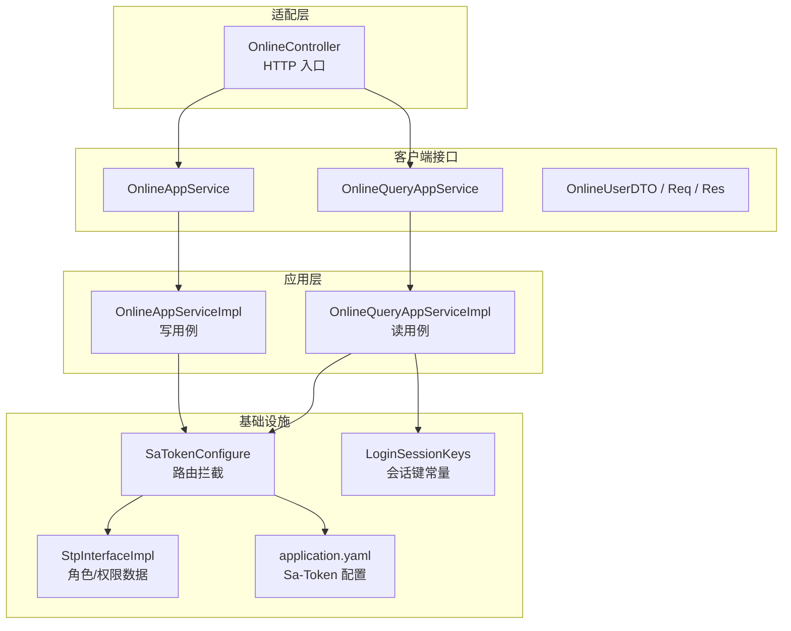
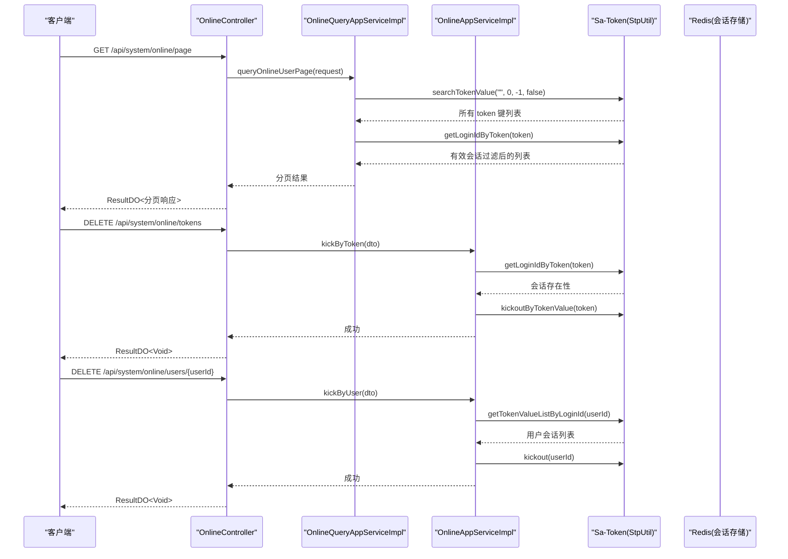
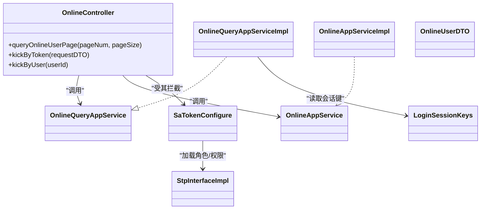

# 在线用户管理模块

<cite>
**本文引用的文件**   
- [OnlineController.java](file://src/main/java/com/sunnao/spring/ddd/template/adaptor/system/online/input/OnlineController.java)
- [OnlineAppServiceImpl.java](file://src/main/java/com/sunnao/spring/ddd/template/application/system/online/scenario/OnlineAppServiceImpl.java)
- [OnlineQueryAppServiceImpl.java](file://src/main/java/com/sunnao/spring/ddd/template/application/system/online/scenario/OnlineQueryAppServiceImpl.java)
- [OnlineAppService.java](file://src/main/java/com/sunnao/spring/ddd/template/client/system/online/OnlineAppService.java)
- [OnlineQueryAppService.java](file://src/main/java/com/sunnao/spring/ddd/template/client/system/online/OnlineQueryAppService.java)
- [OnlineUserDTO.java](file://src/main/java/com/sunnao/spring/ddd/template/client/system/online/model/OnlineUserDTO.java)
- [QueryOnlineUserPageRequestDTO.java](file://src/main/java/com/sunnao/spring/ddd/template/client/system/online/req/QueryOnlineUserPageRequestDTO.java)
- [KickOnlineUserByTokenRequestDTO.java](file://src/main/java/com/sunnao/spring/ddd/template/client/system/online/req/KickOnlineUserByTokenRequestDTO.java)
- [KickOnlineUserByUserRequestDTO.java](file://src/main/java/com/sunnao/spring/ddd/template/client/system/online/req/KickOnlineUserByUserRequestDTO.java)
- [QueryOnlineUserPageResponseDTO.java](file://src/main/java/com/sunnao/spring/ddd/template/client/system/online/res/QueryOnlineUserPageResponseDTO.java)
- [SaTokenConfigure.java](file://src/main/java/com/sunnao/spring/ddd/template/common/config/SaTokenConfigure.java)
- [StpInterfaceImpl.java](file://src/main/java/com/sunnao/spring/ddd/template/infrastructure/auth/StpInterfaceImpl.java)
- [LoginSessionKeys.java](file://src/main/java/com/sunnao/spring/ddd/template/common/context/LoginSessionKeys.java)
- [application.yaml](file://src/main/resources/application.yaml)
</cite>

## 目录
1. [简介](#简介)
2. [项目结构](#项目结构)
3. [核心组件](#核心组件)
4. [架构总览](#架构总览)
5. [详细组件分析](#详细组件分析)
6. [依赖关系分析](#依赖关系分析)
7. [性能与容量特性](#性能与容量特性)
8. [故障排查指南](#故障排查指南)
9. [结论](#结论)
10. [附录：接口定义](#附录接口定义)

## 简介
本模块提供“在线用户（会话）”的管理能力，包括分页查询在线会话、按会话踢下线、按用户踢下线全部会话。该模块基于 Sa-Token 的 Redis 会话实现，不依赖数据库持久化；权限控制通过 Sa-Token 的角色注解完成，仅管理员可访问。

## 项目结构
在线用户管理模块遵循 DDD 分层与适配器模式：
- 适配层（Adaptor/Input）：对外暴露 HTTP 接口，负责参数转换与鉴权注解
- 应用层（Application）：编排业务用例，封装 Sa-Token 调用，统一异常与结果包装
- 客户端接口（Client）：面向上层或跨进程的服务契约（DTO、请求/响应对象）
- 基础设施（Infrastructure）：Sa-Token 路由拦截与权限数据提供

图表来源
- [OnlineController.java:1-77](file://src/main/java/com/sunnao/spring/ddd/template/adaptor/system/online/input/OnlineController.java#L1-L77)
- [OnlineQueryAppServiceImpl.java:1-107](file://src/main/java/com/sunnao/spring/ddd/template/application/system/online/scenario/OnlineQueryAppServiceImpl.java#L1-L107)
- [OnlineAppServiceImpl.java:1-71](file://src/main/java/com/sunnao/spring/ddd/template/application/system/online/scenario/OnlineAppServiceImpl.java#L1-L71)
- [OnlineQueryAppService.java:1-22](file://src/main/java/com/sunnao/spring/ddd/template/client/system/online/OnlineQueryAppService.java#L1-L22)
- [OnlineAppService.java:1-30](file://src/main/java/com/sunnao/spring/ddd/template/client/system/online/OnlineAppService.java#L1-L30)
- [SaTokenConfigure.java:1-31](file://src/main/java/com/sunnao/spring/ddd/template/common/config/SaTokenConfigure.java#L1-L31)
- [StpInterfaceImpl.java:1-54](file://src/main/java/com/sunnao/spring/ddd/template/infrastructure/auth/StpInterfaceImpl.java#L1-L54)
- [LoginSessionKeys.java:1-36](file://src/main/java/com/sunnao/spring/ddd/template/common/context/LoginSessionKeys.java#L1-L36)
- [application.yaml:44-56](file://src/main/resources/application.yaml#L44-L56)

章节来源
- [OnlineController.java:1-77](file://src/main/java/com/sunnao/spring/ddd/template/adaptor/system/online/input/OnlineController.java#L1-L77)
- [SaTokenConfigure.java:1-31](file://src/main/java/com/sunnao/spring/ddd/template/common/config/SaTokenConfigure.java#L1-L31)

## 核心组件
- OnlineController：在线用户 HTTP 入口，限定 admin 角色访问，聚合读/写应用服务
- OnlineQueryAppServiceImpl：从 Sa-Token Redis 会话扫描并内存分页，返回在线会话列表
- OnlineAppServiceImpl：封装 Sa-Token 踢人逻辑（按 token 或按用户），包含参数校验与会话有效性检查
- 客户端接口与 DTO：定义分页查询、踢人操作的请求/响应契约
- Sa-Token 集成：全局登录态拦截、角色/权限数据提供、会话键常量与配置

章节来源
- [OnlineController.java:1-77](file://src/main/java/com/sunnao/spring/ddd/template/adaptor/system/online/input/OnlineController.java#L1-L77)
- [OnlineQueryAppServiceImpl.java:1-107](file://src/main/java/com/sunnao/spring/ddd/template/application/system/online/scenario/OnlineQueryAppServiceImpl.java#L1-L107)
- [OnlineAppServiceImpl.java:1-71](file://src/main/java/com/sunnao/spring/ddd/template/application/system/online/scenario/OnlineAppServiceImpl.java#L1-L71)
- [OnlineQueryAppService.java:1-22](file://src/main/java/com/sunnao/spring/ddd/template/client/system/online/OnlineQueryAppService.java#L1-L22)
- [OnlineAppService.java:1-30](file://src/main/java/com/sunnao/spring/ddd/template/client/system/online/OnlineAppService.java#L1-L30)
- [OnlineUserDTO.java:1-59](file://src/main/java/com/sunnao/spring/ddd/template/client/system/online/model/OnlineUserDTO.java#L1-L59)
- [QueryOnlineUserPageRequestDTO.java:1-44](file://src/main/java/com/sunnao/spring/ddd/template/client/system/online/req/QueryOnlineUserPageRequestDTO.java#L1-L44)
- [KickOnlineUserByTokenRequestDTO.java:1-36](file://src/main/java/com/sunnao/spring/ddd/template/client/system/online/req/KickOnlineUserByTokenRequestDTO.java#L1-L36)
- [KickOnlineUserByUserRequestDTO.java:1-36](file://src/main/java/com/sunnao/spring/ddd/template/client/system/online/req/KickOnlineUserByUserRequestDTO.java#L1-L36)
- [QueryOnlineUserPageResponseDTO.java:1-33](file://src/main/java/com/sunnao/spring/ddd/template/client/system/online/res/QueryOnlineUserPageResponseDTO.java#L1-L33)
- [SaTokenConfigure.java:1-31](file://src/main/java/com/sunnao/spring/ddd/template/common/config/SaTokenConfigure.java#L1-L31)
- [StpInterfaceImpl.java:1-54](file://src/main/java/com/sunnao/spring/ddd/template/infrastructure/auth/StpInterfaceImpl.java#L1-L54)
- [LoginSessionKeys.java:1-36](file://src/main/java/com/sunnao/spring/ddd/template/common/context/LoginSessionKeys.java#L1-L36)
- [application.yaml:44-56](file://src/main/resources/application.yaml#L44-L56)

## 架构总览
在线用户管理采用“无领域层”的轻量设计：所有在线会话数据来源于 Sa-Token 的 Redis 会话存储，应用层直接调用 Sa-Token API 完成读写与踢人操作。

图表来源
- [OnlineController.java:44-75](file://src/main/java/com/sunnao/spring/ddd/template/adaptor/system/online/input/OnlineController.java#L44-L75)
- [OnlineQueryAppServiceImpl.java:32-69](file://src/main/java/com/sunnao/spring/ddd/template/application/system/online/scenario/OnlineQueryAppServiceImpl.java#L32-L69)
- [OnlineAppServiceImpl.java:24-69](file://src/main/java/com/sunnao/spring/ddd/template/application/system/online/scenario/OnlineAppServiceImpl.java#L24-L69)

## 详细组件分析

### 控制器：OnlineController
- 职责：接收 HTTP 请求，进行参数组装与转换，调用应用层服务；使用 @SaCheckRole("admin") 限制管理员访问
- 关键接口
  - GET /api/system/online/page：分页查询在线用户（会话）
  - DELETE /api/system/online/tokens：按会话 token 踢下线
  - DELETE /api/system/online/users/{userId}：按用户踢下线全部会话
- 安全与日志：结合 OperLog 注解记录操作日志；token 走请求体避免进入 URL/访问日志

章节来源
- [OnlineController.java:29-75](file://src/main/java/com/sunnao/spring/ddd/template/adaptor/system/online/input/OnlineController.java#L29-L75)

### 应用服务（写）：OnlineAppServiceImpl
- 职责：封装踢人用例，统一参数校验、会话有效性检查与异常处理
- 关键流程
  - 按 token 踢人：校验 token -> 验证会话存在 -> 执行 kickoutByTokenValue
  - 按用户踢人：校验 userId -> 获取用户会话列表 -> 若为空则提示不在线 -> 执行 kickout(userId)
- 错误处理：捕获异常并返回系统错误码

章节来源
- [OnlineAppServiceImpl.java:24-69](file://src/main/java/com/sunnao/spring/ddd/template/application/system/online/scenario/OnlineAppServiceImpl.java#L24-L69)

### 应用服务（读）：OnlineQueryAppServiceImpl
- 职责：从 Sa-Token Redis 会话中全量扫描 token 键，过滤无效会话后在内存分页
- 关键流程
  - 参数校验：pageNum >= 1，pageSize ∈ [1, 100]
  - 全量扫描：searchTokenValue("", 0, -1, false)
  - 构建会话信息：根据 token 读取 loginId 与 Token-Session 附加字段（邮箱、昵称、IP、UA、登录时间）
  - 内存分页：计算起止索引，返回 total 与当前页数据
- 注意：适用于中小规模会话量；大规模场景需考虑优化策略

章节来源
- [OnlineQueryAppServiceImpl.java:32-105](file://src/main/java/com/sunnao/spring/ddd/template/application/system/online/scenario/OnlineQueryAppServiceImpl.java#L32-L105)
- [LoginSessionKeys.java:10-33](file://src/main/java/com/sunnao/spring/ddd/template/common/context/LoginSessionKeys.java#L10-L33)

### 客户端接口与 DTO
- 接口契约
  - OnlineQueryAppService：定义分页查询在线用户
  - OnlineAppService：定义按 token 与按用户踢下线
- 数据模型
  - OnlineUserDTO：会话标识、用户ID、邮箱、昵称、IP、UA、登录时间
  - 请求 DTO：分页查询、按 token 踢人、按用户踢人（均含自校验 check()）
  - 响应 DTO：分页总数与在线用户列表

章节来源
- [OnlineQueryAppService.java:12-21](file://src/main/java/com/sunnao/spring/ddd/template/client/system/online/OnlineQueryAppService.java#L12-L21)
- [OnlineAppService.java:12-29](file://src/main/java/com/sunnao/spring/ddd/template/client/system/online/OnlineAppService.java#L12-L29)
- [OnlineUserDTO.java:18-57](file://src/main/java/com/sunnao/spring/ddd/template/client/system/online/model/OnlineUserDTO.java#L18-L57)
- [QueryOnlineUserPageRequestDTO.java:18-42](file://src/main/java/com/sunnao/spring/ddd/template/client/system/online/req/QueryOnlineUserPageRequestDTO.java#L18-L42)
- [KickOnlineUserByTokenRequestDTO.java:18-34](file://src/main/java/com/sunnao/spring/ddd/template/client/system/online/req/KickOnlineUserByTokenRequestDTO.java#L18-L34)
- [KickOnlineUserByUserRequestDTO.java:18-34](file://src/main/java/com/sunnao/spring/ddd/template/client/system/online/req/KickOnlineUserByUserRequestDTO.java#L18-L34)
- [QueryOnlineUserPageResponseDTO.java:18-31](file://src/main/java/com/sunnao/spring/ddd/template/client/system/online/res/QueryOnlineUserPageResponseDTO.java#L18-L31)

### 安全与权限
- 路由拦截：除登录相关与 OpenAPI 路径外，/api/** 均需登录态
- 角色鉴权：@SaCheckRole("admin") 保护在线用户接口
- 权限数据：StpInterfaceImpl 从 RBAC 表加载角色与权限点，失败降级为空集合

章节来源
- [SaTokenConfigure.java:20-29](file://src/main/java/com/sunnao/spring/ddd/template/common/config/SaTokenConfigure.java#L20-L29)
- [OnlineController.java:29-33](file://src/main/java/com/sunnao/spring/ddd/template/adaptor/system/online/input/OnlineController.java#L29-L33)
- [StpInterfaceImpl.java:26-52](file://src/main/java/com/sunnao/spring/ddd/template/infrastructure/auth/StpInterfaceImpl.java#L26-L52)

## 依赖关系分析
- 控制器依赖应用服务接口
- 应用服务依赖 Sa-Token 运行时（StpUtil）与上下文常量（LoginSessionKeys）
- 安全拦截由 SaTokenConfigure 注入，角色/权限数据由 StpInterfaceImpl 提供
- 运行期行为受 application.yaml 中 Sa-Token 配置影响（并发登录、token 风格、有效期等）

图表来源
- [OnlineController.java:33-75](file://src/main/java/com/sunnao/spring/ddd/template/adaptor/system/online/input/OnlineController.java#L33-L75)
- [OnlineQueryAppServiceImpl.java:28-105](file://src/main/java/com/sunnao/spring/ddd/template/application/system/online/scenario/OnlineQueryAppServiceImpl.java#L28-L105)
- [OnlineAppServiceImpl.java:20-69](file://src/main/java/com/sunnao/spring/ddd/template/application/system/online/scenario/OnlineAppServiceImpl.java#L20-L69)
- [SaTokenConfigure.java:17-29](file://src/main/java/com/sunnao/spring/ddd/template/common/config/SaTokenConfigure.java#L17-L29)
- [StpInterfaceImpl.java:19-52](file://src/main/java/com/sunnao/spring/ddd/template/infrastructure/auth/StpInterfaceImpl.java#L19-L52)
- [LoginSessionKeys.java:8-33](file://src/main/java/com/sunnao/spring/ddd/template/common/context/LoginSessionKeys.java#L8-L33)

## 性能与容量特性
- 读操作为“全量扫描 + 内存分页”，total 与当页数据一致，适合中小规模会话量
- 建议
  - 监控 Redis 会话总量，超过阈值时考虑引入缓存或增量扫描方案
  - 合理设置 pageSize 上限，避免过大导致内存压力
  - 关注 Sa-Token 的 is-concurrent 与 timeout 配置对会话数量的影响

章节来源
- [OnlineQueryAppServiceImpl.java:32-69](file://src/main/java/com/sunnao/spring/ddd/template/application/system/online/scenario/OnlineQueryAppServiceImpl.java#L32-L69)
- [application.yaml:44-56](file://src/main/resources/application.yaml#L44-L56)

## 故障排查指南
- 无法访问在线用户接口
  - 确认已登录且具备 admin 角色
  - 检查 Sa-Token 路由拦截是否放行 OpenAPI 路径
- 按 token 踢人失败
  - 检查 token 是否为空或已失效
  - 查看系统错误日志定位异常
- 按用户踢人失败
  - 确认用户是否存在在线会话
  - 检查 Redis 连接与会话数据是否正常
- 分页查询结果为空或 total 不一致
  - 确认 Redis 中会话键前缀与剥离逻辑一致
  - 检查会话附加信息是否写入完整

章节来源
- [SaTokenConfigure.java:20-29](file://src/main/java/com/sunnao/spring/ddd/template/common/config/SaTokenConfigure.java#L20-L29)
- [OnlineAppServiceImpl.java:41-69](file://src/main/java/com/sunnao/spring/ddd/template/application/system/online/scenario/OnlineAppServiceImpl.java#L41-L69)
- [OnlineQueryAppServiceImpl.java:71-105](file://src/main/java/com/sunnao/spring/ddd/template/application/system/online/scenario/OnlineQueryAppServiceImpl.java#L71-L105)

## 结论
在线用户管理模块以最小侵入的方式复用 Sa-Token 的会话能力，提供简洁易用的在线会话查询与强制下线功能。通过应用层收敛外部依赖、统一的参数校验与异常处理，保证了接口的稳定性与可维护性。对于大规模会话场景，可在读侧引入更高效的检索策略以提升性能。

## 附录：接口定义
- GET /api/system/online/page
  - 说明：分页查询在线用户（会话）
  - 入参：pageNum、pageSize
  - 出参：ResultDO<QueryOnlineUserPageResponseDTO>
- DELETE /api/system/online/tokens
  - 说明：按会话 token 踢下线
  - 入参：KickOnlineUserByTokenRequestDTO（tokenValue）
  - 出参：ResultDO<Void>
- DELETE /api/system/online/users/{userId}
  - 说明：按用户踢下线全部会话
  - 入参：userId（路径参数）
  - 出参：ResultDO<Void>

章节来源
- [OnlineController.java:44-75](file://src/main/java/com/sunnao/spring/ddd/template/adaptor/system/online/input/OnlineController.java#L44-L75)
- [QueryOnlineUserPageRequestDTO.java:18-42](file://src/main/java/com/sunnao/spring/ddd/template/client/system/online/req/QueryOnlineUserPageRequestDTO.java#L18-L42)
- [KickOnlineUserByTokenRequestDTO.java:18-34](file://src/main/java/com/sunnao/spring/ddd/template/client/system/online/req/KickOnlineUserByTokenRequestDTO.java#L18-L34)
- [KickOnlineUserByUserRequestDTO.java:18-34](file://src/main/java/com/sunnao/spring/ddd/template/client/system/online/req/KickOnlineUserByUserRequestDTO.java#L18-L34)
- [QueryOnlineUserPageResponseDTO.java:18-31](file://src/main/java/com/sunnao/spring/ddd/template/client/system/online/res/QueryOnlineUserPageResponseDTO.java#L18-L31)