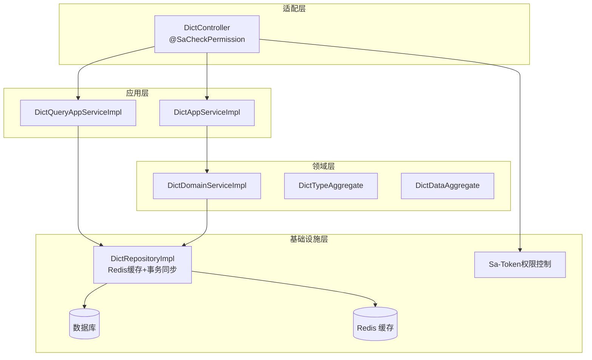
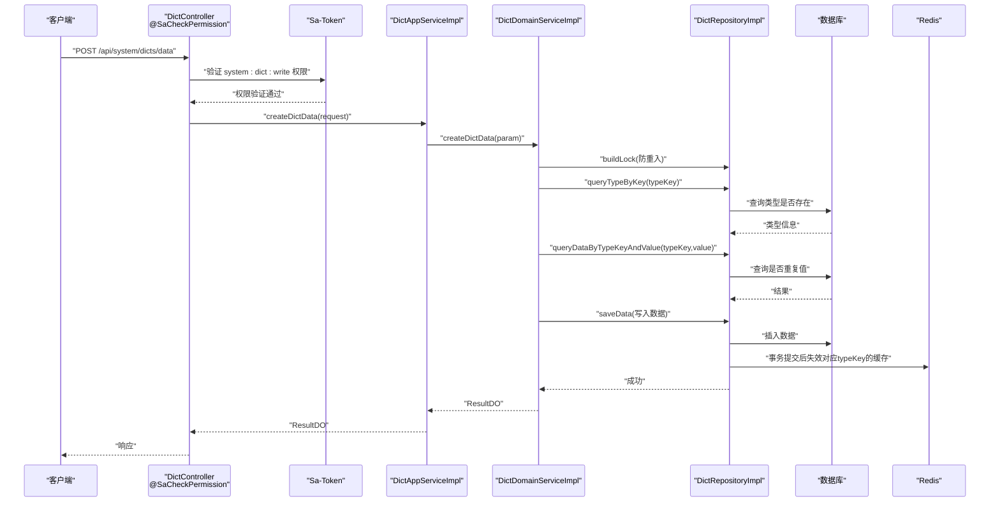
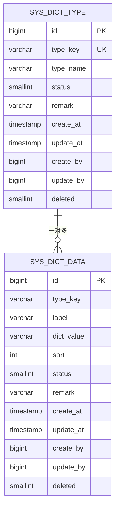
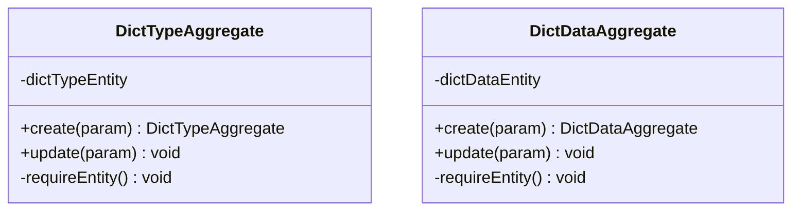
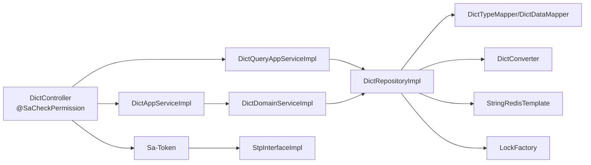
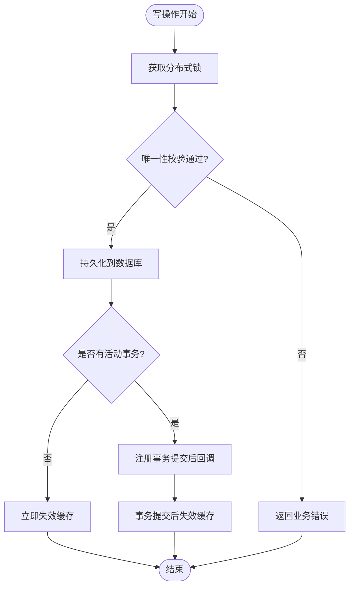

# 字典管理模块

<cite>
**本文引用的文件列表**
- [DictController.java](file://src/main/java/com/sunnao/spring/ddd/template/adaptor/system/dict/input/DictController.java)
- [DictAppServiceImpl.java](file://src/main/java/com/sunnao/spring/ddd/template/application/system/dict/scenario/DictAppServiceImpl.java)
- [DictQueryAppServiceImpl.java](file://src/main/java/com/sunnao/spring/ddd/template/application/system/dict/scenario/DictQueryAppServiceImpl.java)
- [DictDomainServiceImpl.java](file://src/main/java/com/sunnao/spring/ddd/template/domain/system/dict/service/DictDomainServiceImpl.java)
- [DictRepositoryImpl.java](file://src/main/java/com/sunnao/spring/ddd/template/infrastructure/system/dict/repository/DictRepositoryImpl.java)
- [DictTypeAggregate.java](file://src/main/java/com/sunnao/spring/ddd/template/domain/system/dict/model/aggregate/DictTypeAggregate.java)
- [DictDataAggregate.java](file://src/main/java/com/sunnao/spring/ddd/template/domain/system/dict/model/aggregate/DictDataAggregate.java)
- [SaTokenConfigure.java](file://src/main/java/com/sunnao/spring/ddd/template/common/config/SaTokenConfigure.java)
- [StpInterfaceImpl.java](file://src/main/java/com/sunnao/spring/ddd/template/infrastructure/auth/StpInterfaceImpl.java)
- [application.yaml](file://src/main/resources/application.yaml)
- [V4__init_dict.sql](file://src/main/resources/db/migration/V4__init_dict.sql)
</cite>

## 更新摘要
**变更内容**
- 增强了权限控制机制，实现了细粒度的接口级权限验证
- 优化了Redis缓存策略，提升了缓存一致性和性能
- 完善了事务同步机制，确保缓存失效的准确性
- 增强了异常处理和降级策略

## 目录
1. [简介](#简介)
2. [项目结构](#项目结构)
3. [核心组件](#核心组件)
4. [架构总览](#架构总览)
5. [详细组件分析](#详细组件分析)
6. [依赖关系分析](#依赖关系分析)
7. [性能与缓存策略](#性能与缓存策略)
8. [事件驱动与一致性](#事件驱动与一致性)
9. [导入导出与批量操作](#导入导出与批量操作)
10. [与其他模块集成与最佳实践](#与其他模块集成与最佳实践)
11. [故障排查指南](#故障排查指南)
12. [结论](#结论)

## 简介
本模块提供"字典类型"和"字典数据"的双层管理能力，覆盖完整的增删改查、状态管理与分页查询。**已增强权限控制和缓存机制**，通过Sa-Token实现细粒度的接口级权限验证（system:dict:read/write），采用Redis缓存提升读性能，并通过事务同步机制保证缓存一致性。读路径针对"按类型键查询启用数据"走 Redis 缓存，写路径通过领域服务加锁保证并发安全，并在仓储层实现事务提交后失效缓存的一致性策略。对外暴露 REST API，结合权限控制与操作日志记录，便于前后端协作与运维审计。

## 项目结构
字典模块遵循 DDD 分层：
- 适配层（Adaptor）：HTTP 控制器，负责参数绑定、鉴权与调用应用服务
- 应用层（Application）：场景编排，DTO 与 Param 转换，调用领域服务
- 领域层（Domain）：聚合根与领域服务，封装业务规则与一致性约束
- 基础设施层（Infrastructure）：仓储实现，持久化与缓存细节

**图表来源**
- [DictController.java:1-153](file://src/main/java/com/sunnao/spring/ddd/template/adaptor/system/dict/input/DictController.java#L1-L153)
- [DictAppServiceImpl.java:1-187](file://src/main/java/com/sunnao/spring/ddd/template/application/system/dict/scenario/DictAppServiceImpl.java#L1-L187)
- [DictQueryAppServiceImpl.java:1-108](file://src/main/java/com/sunnao/spring/ddd/template/application/system/dict/scenario/DictQueryAppServiceImpl.java#L1-L108)
- [DictDomainServiceImpl.java:1-234](file://src/main/java/com/sunnao/spring/ddd/template/domain/system/dict/service/DictDomainServiceImpl.java#L1-L234)
- [DictRepositoryImpl.java:1-368](file://src/main/java/com/sunnao/spring/ddd/template/infrastructure/system/dict/repository/DictRepositoryImpl.java#L1-L368)
- [SaTokenConfigure.java:1-31](file://src/main/java/com/sunnao/spring/ddd/template/common/config/SaTokenConfigure.java#L1-L31)

## 核心组件
- **聚合根**
  - 字典类型聚合根：负责创建与更新字典类型的业务校验与状态设置
  - 字典数据聚合根：负责创建与更新字典数据的业务校验与默认值处理
- **应用服务**
  - 写模式应用服务：编排参数校验、领域服务调用与响应组装
  - 读模式应用服务：构建分页条件、调用仓储并返回 DTO
- **领域服务**
  - 统一加锁、唯一性校验、聚合根方法调用与异常归一化
- **仓储实现**
  - **增强版读写分离**：读侧按 typeKey 的启用数据走 Redis 缓存；写侧在事务提交后失效缓存
  - **增强的缓存策略**：支持TTL过期时间配置、缓存失败降级、事务同步失效
  - 分页查询、条件构造、PO 与聚合根转换

**章节来源**
- [DictTypeAggregate.java:1-84](file://src/main/java/com/sunnao/spring/ddd/template/domain/system/dict/model/aggregate/DictTypeAggregate.java#L1-L84)
- [DictDataAggregate.java:1-82](file://src/main/java/com/sunnao/spring/ddd/template/domain/system/dict/model/aggregate/DictDataAggregate.java#L1-L82)
- [DictAppServiceImpl.java:1-187](file://src/main/java/com/sunnao/spring/ddd/template/application/system/dict/scenario/DictAppServiceImpl.java#L1-L187)
- [DictQueryAppServiceImpl.java:1-108](file://src/main/java/com/sunnao/spring/ddd/template/application/system/dict/scenario/DictQueryAppServiceImpl.java#L1-L108)
- [DictDomainServiceImpl.java:1-234](file://src/main/java/com/sunnao/spring/ddd/template/domain/system/dict/service/DictDomainServiceImpl.java#L1-L234)
- [DictRepositoryImpl.java:1-368](file://src/main/java/com/sunnao/spring/ddd/template/infrastructure/system/dict/repository/DictRepositoryImpl.java#L1-L368)

## 架构总览
从请求到落库与缓存失效的整体流程如下：

**图表来源**
- [DictController.java:90-125](file://src/main/java/com/sunnao/spring/ddd/template/adaptor/system/dict/input/DictController.java#L90-L125)
- [DictAppServiceImpl.java:109-133](file://src/main/java/com/sunnao/spring/ddd/template/application/system/dict/scenario/DictAppServiceImpl.java#L109-L133)
- [DictDomainServiceImpl.java:124-160](file://src/main/java/com/sunnao/spring/ddd/template/domain/system/dict/service/DictDomainServiceImpl.java#L124-L160)
- [DictRepositoryImpl.java:201-231](file://src/main/java/com/sunnao/spring/ddd/template/infrastructure/system/dict/repository/DictRepositoryImpl.java#L201-L231)
- [SaTokenConfigure.java:20-29](file://src/main/java/com/sunnao/spring/ddd/template/common/config/SaTokenConfigure.java#L20-L29)

## 详细组件分析

### 数据模型与表结构
- 字典类型表：包含类型键、名称、状态、备注、审计字段与逻辑删除标记，并对 type_key 建立唯一索引
- 字典数据表：包含类型键、标签、值、排序、状态、备注、审计字段与逻辑删除标记，对 type_key 建普通索引，对 (type_key, dict_value) 建唯一索引

**图表来源**
- [V4__init_dict.sql:1-95](file://src/main/resources/db/migration/V4__init_dict.sql#L1-L95)

**章节来源**
- [V4__init_dict.sql:1-95](file://src/main/resources/db/migration/V4__init_dict.sql#L1-L95)

### 聚合根设计
- 字典类型聚合根
  - 创建时校验 type_key 格式与必填项，设置初始状态为启用
  - 更新时仅允许修改名称、状态、备注等字段
- 字典数据聚合根
  - 创建时校验 type_key、label、value 必填，设置默认排序与启用状态
  - 更新时允许修改标签、值、排序、状态、备注

**图表来源**
- [DictTypeAggregate.java:1-84](file://src/main/java/com/sunnao/spring/ddd/template/domain/system/dict/model/aggregate/DictTypeAggregate.java#L1-L84)
- [DictDataAggregate.java:1-82](file://src/main/java/com/sunnao/spring/ddd/template/domain/system/dict/model/aggregate/DictDataAggregate.java#L1-L82)

**章节来源**
- [DictTypeAggregate.java:1-84](file://src/main/java/com/sunnao/spring/ddd/template/domain/system/dict/model/aggregate/DictTypeAggregate.java#L1-L84)
- [DictDataAggregate.java:1-82](file://src/main/java/com/sunnao/spring/ddd/template/domain/system/dict/model/aggregate/DictDataAggregate.java#L1-L82)

### 应用服务（写/读）
- 写模式应用服务
  - 参数自校验 → 转换为领域 Param → 调用领域服务 → 组装响应
  - 统一捕获系统异常并返回错误码
- 读模式应用服务
  - 构建分页查询条件 → 调用仓储获取聚合根 → 转换为 DTO
  - 区分"启用数据列表（走缓存）"与"全部数据列表（管理端，不走缓存）"

**章节来源**
- [DictAppServiceImpl.java:1-187](file://src/main/java/com/sunnao/spring/ddd/template/application/system/dict/scenario/DictAppServiceImpl.java#L1-L187)
- [DictQueryAppServiceImpl.java:1-108](file://src/main/java/com/sunnao/spring/ddd/template/application/system/dict/scenario/DictQueryAppServiceImpl.java#L1-L108)

### 领域服务（并发与一致性）
- 标准流程：获取分布式锁 → 加载聚合根 → 执行业务方法 → 持久化 → 释放锁
- 关键约束
  - 类型键唯一性
  - 同类型下字典值唯一性
  - 删除类型时级联逻辑删除其下数据
- 异常归一化：将业务异常与系统异常分别包装为 ResultDO

**章节来源**
- [DictDomainServiceImpl.java:1-234](file://src/main/java/com/sunnao/spring/ddd/template/domain/system/dict/service/DictDomainServiceImpl.java#L1-L234)

### 仓储实现（持久化与缓存）
- **增强的写路径**
  - save/saveData：新增回填 ID，更新不变更创建信息；写后失效对应 typeKey 的缓存
  - deleteType/deleteData：逻辑删除，使用事务同步机制在提交后失效缓存，避免"失效→提交"窗口内回源旧数据
  - **事务同步失效**：通过 TransactionSynchronizationManager 确保缓存失效在事务提交后执行
- **增强的读路径**
  - queryEnabledDataByTypeKey：优先读 Redis，失败降级直查数据库；若类型不存在或禁用则返回空列表；成功后写缓存并设置 TTL
  - queryAllDataByTypeKey：管理端全量查询，不走缓存
  - **缓存降级策略**：Redis 读取失败自动降级为直接查询数据库
- **锁能力**
  - buildLock：基于 LockFactory 构建分布式锁，用于写路径防重入

**章节来源**
- [DictRepositoryImpl.java:1-368](file://src/main/java/com/sunnao/spring/ddd/template/infrastructure/system/dict/repository/DictRepositoryImpl.java#L1-L368)

### 权限控制机制
- **接口级权限验证**
  - 写操作接口：`@SaCheckPermission("system:dict:write")`
  - 读操作接口：`@SaCheckPermission("system:dict:read")`
- **全局拦截器配置**
  - 除登录/注册接口外，/api/** 全部要求登录态
  - OpenAPI 文档路径放行
- **权限数据提供**
  - 从 RBAC 表动态获取用户权限
  - 查询失败降级为空集合（表现为无权限）

**章节来源**
- [DictController.java:21-153](file://src/main/java/com/sunnao/spring/ddd/template/adaptor/system/dict/input/DictController.java#L21-L153)
- [SaTokenConfigure.java:17-31](file://src/main/java/com/sunnao/spring/ddd/template/common/config/SaTokenConfigure.java#L17-L31)
- [StpInterfaceImpl.java:19-54](file://src/main/java/com/sunnao/spring/ddd/template/infrastructure/auth/StpInterfaceImpl.java#L19-L54)

## 依赖关系分析
- 控制器依赖应用服务接口
- 应用服务依赖领域服务与转换器
- 领域服务依赖仓储接口
- 仓储实现依赖 MyBatis-Flex Mapper、转换器、Redis 模板与锁工厂
- **权限控制依赖 Sa-Token 框架**

**图表来源**
- [DictController.java:1-153](file://src/main/java/com/sunnao/spring/ddd/template/adaptor/system/dict/input/DictController.java#L1-L153)
- [DictAppServiceImpl.java:1-187](file://src/main/java/com/sunnao/spring/ddd/template/application/system/dict/scenario/DictAppServiceImpl.java#L1-L187)
- [DictQueryAppServiceImpl.java:1-108](file://src/main/java/com/sunnao/spring/ddd/template/application/system/dict/scenario/DictQueryAppServiceImpl.java#L1-L108)
- [DictDomainServiceImpl.java:1-234](file://src/main/java/com/sunnao/spring/ddd/template/domain/system/dict/service/DictDomainServiceImpl.java#L1-L234)
- [DictRepositoryImpl.java:1-368](file://src/main/java/com/sunnao/spring/ddd/template/infrastructure/system/dict/repository/DictRepositoryImpl.java#L1-L368)
- [SaTokenConfigure.java:17-31](file://src/main/java/com/sunnao/spring/ddd/template/common/config/SaTokenConfigure.java#L17-L31)
- [StpInterfaceImpl.java:19-54](file://src/main/java/com/sunnao/spring/ddd/template/infrastructure/auth/StpInterfaceImpl.java#L19-L54)

## 性能与缓存策略
- **增强的读路径优化**
  - 按 typeKey 查询启用数据优先命中 Redis，降低数据库压力
  - **缓存降级策略**：Redis 读取失败自动降级为直接查询数据库
  - 未命中时回源数据库并按 sort 升序、id 升序返回，提升展示稳定性
  - **TTL 过期保护**：设置 1 小时过期时间，防止脏数据长存
- **增强的写路径优化**
  - 分布式锁避免高并发下的重复写入与竞态条件
  - **事务同步失效**：确保缓存失效在事务提交后执行，避免"先失效后提交"导致的脏读回填
  - **异步失效机制**：通过 TransactionSynchronizationManager 注册提交后回调
- **建议**
  - 热点 typeKey 可考虑预热缓存（如启动时加载常用字典）
  - 大字典类型可考虑分片或懒加载，减少单次序列化体积
  - 监控 Redis 命中率与延迟，必要时调整 TTL 与批量读取策略

**章节来源**
- [DictRepositoryImpl.java:254-295](file://src/main/java/com/sunnao/spring/ddd/template/infrastructure/system/dict/repository/DictRepositoryImpl.java#L254-L295)
- [DictRepositoryImpl.java:316-345](file://src/main/java/com/sunnao/spring/ddd/template/infrastructure/system/dict/repository/DictRepositoryImpl.java#L316-L345)
- [application.yaml:14-27](file://src/main/resources/application.yaml#L14-L27)

## 事件驱动与一致性
- **增强的事务同步机制**
  - 写操作完成后，在事务提交后失效对应 typeKey 的缓存 key
  - 读操作在缓存缺失时回源数据库并重建缓存
  - **双重保障**：事务同步失效 + TTL 过期兜底
- **一致性保障要点**
  - 分布式锁确保写操作的串行化与唯一性校验
  - **事务同步避免脏读**：确保"失效→提交"窗口内的并发读不会回填旧数据
  - **缓存失败不影响主流程**：TTL 作为最终一致性兜底
  - **降级策略**：Redis 操作失败自动降级为直接数据库访问

**图表来源**
- [DictDomainServiceImpl.java:30-60](file://src/main/java/com/sunnao/spring/ddd/template/domain/system/dict/service/DictDomainServiceImpl.java#L30-L60)
- [DictRepositoryImpl.java:316-345](file://src/main/java/com/sunnao/spring/ddd/template/infrastructure/system/dict/repository/DictRepositoryImpl.java#L316-L345)

**章节来源**
- [DictDomainServiceImpl.java:1-234](file://src/main/java/com/sunnao/spring/ddd/template/domain/system/dict/service/DictDomainServiceImpl.java#L1-L234)
- [DictRepositoryImpl.java:316-345](file://src/main/java/com/sunnao/spring/ddd/template/infrastructure/system/dict/repository/DictRepositoryImpl.java#L316-L345)

## 导入导出与批量操作
- 当前仓库未提供专门的导入导出与批量操作接口
- 可通过现有单条接口组合实现：
  - 导入：逐条调用"创建字典类型/数据"接口，注意幂等与唯一性校验
  - 导出：调用"按类型键查询全部数据"接口拉取数据，前端或批处理工具进行导出
- 扩展建议
  - 在应用层增加批量创建/更新接口，内部复用领域服务与仓储
  - 引入异步任务与进度反馈，提升大批量导入体验
  - 增加导入模板与校验报告，提高容错与可追溯性

**章节来源**
- [DictController.java:1-153](file://src/main/java/com/sunnao/spring/ddd/template/adaptor/system/dict/input/DictController.java#L1-L153)
- [DictQueryAppServiceImpl.java:86-106](file://src/main/java/com/sunnao/spring/ddd/template/application/system/dict/scenario/DictQueryAppServiceImpl.java#L86-L106)

## 与其他模块集成与最佳实践
- **增强的权限与审计**
  - 控制器使用 `@SaCheckPermission` 注解进行细粒度访问控制
  - 读需 `system:dict:read`，写需 `system:dict:write`
  - 写操作标注操作日志注解，便于审计追踪
  - **全局权限拦截**：所有 /api/** 接口都需要登录态
- **前端对接**
  - 管理端页面使用"查询全部数据"接口（含禁用项），业务表单下拉使用"查询启用数据"接口（走缓存）
  - **权限控制**：前端根据用户权限动态显示操作按钮
- **最佳实践**
  - 严格区分"管理端查询"与"业务端查询"，避免误用导致缓存不一致或性能问题
  - 对高频使用的字典类型，建议在启动阶段预热缓存，降低冷启动抖动
  - 对大型字典类型，考虑分页或懒加载，避免一次性加载过多数据
  - **权限管理**：合理分配 system:dict:read 和 system:dict:write 权限

**章节来源**
- [DictController.java:21-153](file://src/main/java/com/sunnao/spring/ddd/template/adaptor/system/dict/input/DictController.java#L21-L153)
- [DictQueryAppServiceImpl.java:64-106](file://src/main/java/com/sunnao/spring/ddd/template/application/system/dict/scenario/DictQueryAppServiceImpl.java#L64-L106)
- [SaTokenConfigure.java:17-31](file://src/main/java/com/sunnao/spring/ddd/template/common/config/SaTokenConfigure.java#L17-L31)

## 故障排查指南
- **常见问题**
  - **权限相关问题**：检查用户是否拥有对应的 permission 权限点，确认 Sa-Token 配置是否正确
  - **缓存未命中或脏数据**：检查写路径是否在事务提交后失效缓存；确认 Redis 连接与权限
  - **重复值报错**：确认同类型下字典值唯一性校验与分布式锁生效
  - **类型不存在**：读路径会返回空列表，确认类型键是否正确且处于启用状态
- **定位步骤**
  - 查看应用日志中的错误码与堆栈，确认异常发生在应用层还是仓储层
  - 核对 Redis 中对应 typeKey 的缓存 key 是否存在与过期时间
  - 检查数据库索引与唯一约束，确认数据一致性与性能
  - **权限调试**：检查用户的角色和权限分配，确认 @SaCheckPermission 注解配置

**章节来源**
- [DictRepositoryImpl.java:254-295](file://src/main/java/com/sunnao/spring/ddd/template/infrastructure/system/dict/repository/DictRepositoryImpl.java#L254-L295)
- [DictRepositoryImpl.java:316-345](file://src/main/java/com/sunnao/spring/ddd/template/infrastructure/system/dict/repository/DictRepositoryImpl.java#L316-L345)
- [StpInterfaceImpl.java:27-38](file://src/main/java/com/sunnao/spring/ddd/template/infrastructure/auth/StpInterfaceImpl.java#L27-L38)

## 结论
字典管理模块以 DDD 分层组织代码，清晰划分职责；**已显著增强权限控制和缓存机制**。通过 Sa-Token 实现细粒度的接口级权限验证，确保只有授权用户才能访问相应功能；读路径通过 Redis 缓存显著提升性能，写路径通过分布式锁与事务同步保证一致性与并发安全。**增强的缓存策略包括**：TTL 过期保护、缓存失败降级、事务同步失效等机制。当前未内置导入导出与批量操作，但可基于现有接口快速扩展。建议在生产环境关注缓存命中率、锁竞争与数据库索引，持续优化性能与稳定性。