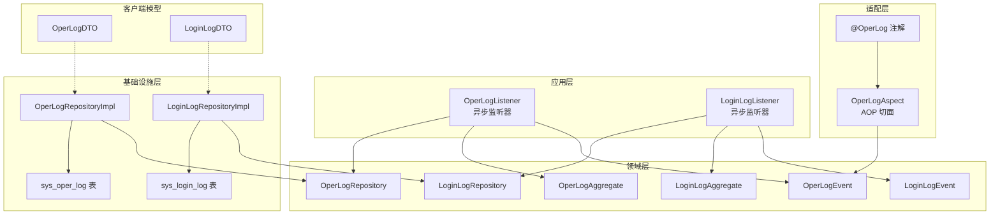
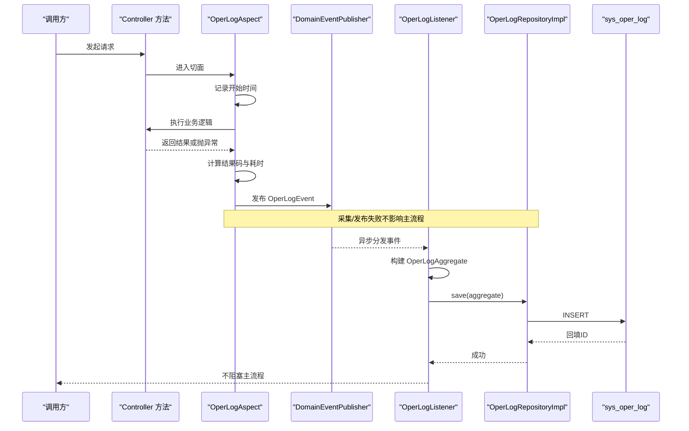
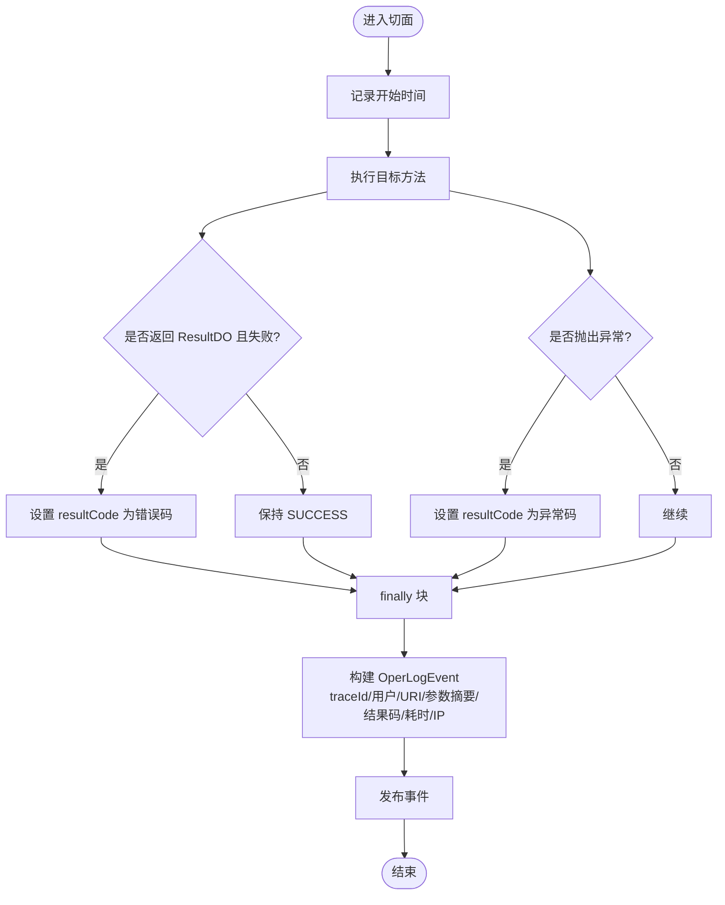
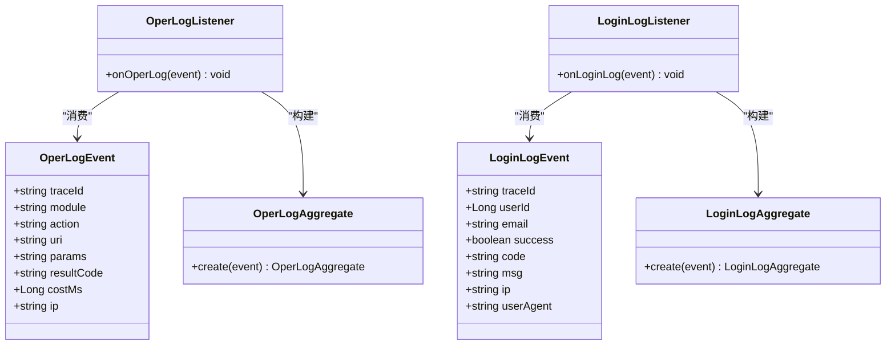
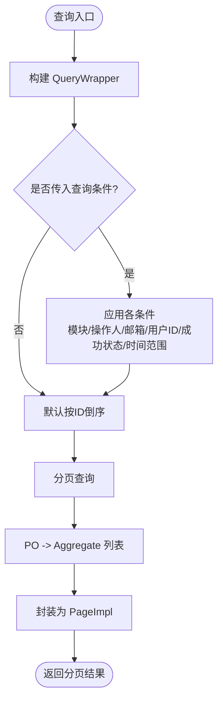
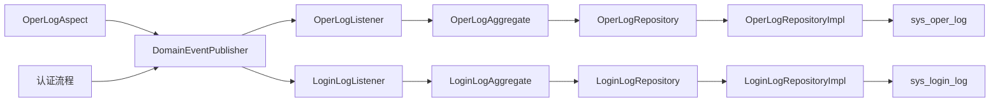

# 操作日志模块

<cite>
**本文引用的文件**
- [OperLogAspect.java](file://src/main/java/com/sunnao/spring/ddd/template/adaptor/common/OperLogAspect.java)
- [OperLog.java](file://src/main/java/com/sunnao/spring/ddd/template/common/annotation/OperLog.java)
- [OperLogListener.java](file://src/main/java/com/sunnao/spring/ddd/template/application/system/log/listener/OperLogListener.java)
- [LoginLogListener.java](file://src/main/java/com/sunnao/spring/ddd/template/application/system/log/listener/LoginLogListener.java)
- [OperLogEvent.java](file://src/main/java/com/sunnao/spring/ddd/template/domain/system/log/event/OperLogEvent.java)
- [LoginLogEvent.java](file://src/main/java/com/sunnao/spring/ddd/template/domain/system/log/event/LoginLogEvent.java)
- [OperLogAggregate.java](file://src/main/java/com/sunnao/spring/ddd/template/domain/system/log/model/aggregate/OperLogAggregate.java)
- [LoginLogAggregate.java](file://src/main/java/com/sunnao/spring/ddd/template/domain/system/log/model/aggregate/LoginLogAggregate.java)
- [OperLogRepository.java](file://src/main/java/com/sunnao/spring/ddd/template/domain/system/log/repository/OperLogRepository.java)
- [LoginLogRepository.java](file://src/main/java/com/sunnao/spring/ddd/template/domain/system/log/repository/LoginLogRepository.java)
- [OperLogRepositoryImpl.java](file://src/main/java/com/sunnao/spring/ddd/template/infrastructure/system/log/repository/OperLogRepositoryImpl.java)
- [LoginLogRepositoryImpl.java](file://src/main/java/com/sunnao/spring/ddd/template/infrastructure/system/log/repository/LoginLogRepositoryImpl.java)
- [OperLogDTO.java](file://src/main/java/com/sunnao/spring/ddd/template/client/system/log/model/OperLogDTO.java)
- [LoginLogDTO.java](file://src/main/java/com/sunnao/spring/ddd/template/client/system/log/model/LoginLogDTO.java)
- [V3__init_sys_oper_log.sql](file://src/main/resources/db/migration/V3__init_sys_oper_log.sql)
- [V6__init_sys_login_log.sql](file://src/main/resources/db/migration/V6__init_sys_login_log.sql)
</cite>

## 目录
1. [简介](#简介)
2. [项目结构](#项目结构)
3. [核心组件](#核心组件)
4. [架构总览](#架构总览)
5. [详细组件分析](#详细组件分析)
6. [依赖关系分析](#依赖关系分析)
7. [性能与高可用](#性能与高可用)
8. [故障排查指南](#故障排查指南)
9. [结论](#结论)
10. [附录](#附录)

## 简介
本章节面向“操作日志模块”，系统性阐述基于 AOP 的自动采集机制、异步事件驱动落库、登录日志与操作日志的差异与协同、查询与统计分析能力、存储策略与清理建议，以及配置与扩展点。目标是帮助读者快速理解并高效使用该模块进行审计与安全监控。

## 项目结构
该模块遵循 DDD 分层与横切关注点分离：
- 适配层（adaptor）：通过注解与切面在 Controller 方法上无侵入地采集操作日志。
- 应用层（application）：监听领域事件，异步构建聚合根并持久化。
- 领域层（domain）：定义事件、聚合根与仓储接口，表达业务语义与不变式。
- 基础设施层（infrastructure）：实现仓储，完成对象到数据库 PO 的转换与分页查询。
- 客户端模型（client）：对外暴露 DTO，用于查询与展示。
- 数据迁移（db/migration）：定义日志表结构与索引。

图表来源
- [OperLogAspect.java:1-131](file://src/main/java/com/sunnao/spring/ddd/template/adaptor/common/OperLogAspect.java#L1-L131)
- [OperLog.java:1-27](file://src/main/java/com/sunnao/spring/ddd/template/common/annotation/OperLog.java#L1-L27)
- [OperLogListener.java:1-36](file://src/main/java/com/sunnao/spring/ddd/template/application/system/log/listener/OperLogListener.java#L1-L36)
- [LoginLogListener.java:1-36](file://src/main/java/com/sunnao/spring/ddd/template/application/system/log/listener/LoginLogListener.java#L1-L36)
- [OperLogEvent.java:1-70](file://src/main/java/com/sunnao/spring/ddd/template/domain/system/log/event/OperLogEvent.java#L1-L70)
- [LoginLogEvent.java:1-64](file://src/main/java/com/sunnao/spring/ddd/template/domain/system/log/event/LoginLogEvent.java#L1-L64)
- [OperLogAggregate.java:1-58](file://src/main/java/com/sunnao/spring/ddd/template/domain/system/log/model/aggregate/OperLogAggregate.java#L1-L58)
- [LoginLogAggregate.java:1-57](file://src/main/java/com/sunnao/spring/ddd/template/domain/system/log/model/aggregate/LoginLogAggregate.java#L1-L57)
- [OperLogRepository.java:1-35](file://src/main/java/com/sunnao/spring/ddd/template/domain/system/log/repository/OperLogRepository.java#L1-L35)
- [LoginLogRepository.java:1-35](file://src/main/java/com/sunnao/spring/ddd/template/domain/system/log/repository/LoginLogRepository.java#L1-L35)
- [OperLogRepositoryImpl.java:1-96](file://src/main/java/com/sunnao/spring/ddd/template/infrastructure/system/log/repository/OperLogRepositoryImpl.java#L1-L96)
- [LoginLogRepositoryImpl.java:1-99](file://src/main/java/com/sunnao/spring/ddd/template/infrastructure/system/log/repository/LoginLogRepositoryImpl.java#L1-L99)
- [OperLogDTO.java:1-77](file://src/main/java/com/sunnao/spring/ddd/template/client/system/log/model/OperLogDTO.java#L1-L77)
- [LoginLogDTO.java:1-72](file://src/main/java/com/sunnao/spring/ddd/template/client/system/log/model/LoginLogDTO.java#L1-L72)
- [V3__init_sys_oper_log.sql:1-45](file://src/main/resources/db/migration/V3__init_sys_oper_log.sql#L1-L45)
- [V6__init_sys_login_log.sql:1-42](file://src/main/resources/db/migration/V6__init_sys_login_log.sql#L1-L42)

章节来源
- [OperLogAspect.java:1-131](file://src/main/java/com/sunnao/spring/ddd/template/adaptor/common/OperLogAspect.java#L1-L131)
- [OperLogRepositoryImpl.java:1-96](file://src/main/java/com/sunnao/spring/ddd/template/infrastructure/system/log/repository/OperLogRepositoryImpl.java#L1-L96)
- [LoginLogRepositoryImpl.java:1-99](file://src/main/java/com/sunnao/spring/ddd/template/infrastructure/system/log/repository/LoginLogRepositoryImpl.java#L1-L99)
- [V3__init_sys_oper_log.sql:1-45](file://src/main/resources/db/migration/V3__init_sys_oper_log.sql#L1-L45)
- [V6__init_sys_login_log.sql:1-42](file://src/main/resources/db/migration/V6__init_sys_login_log.sql#L1-L42)

## 核心组件
- @OperLog 注解：声明在写接口方法上，提供 module 与 action 两个必填属性，作为审计维度。
- OperLogAspect 切面：环绕标注方法，采集 traceId、操作人、URI、参数摘要、结果码、耗时、IP，并发布 OperLogEvent；失败不影响主流程。
- 事件与监听器：OperLogEvent/LoginLogEvent 由适配层或认证流程发布；OperLogListener/LoginLogListener 异步消费，构建聚合根后落库。
- 聚合根与实体：OperLogAggregate/LoginLogAggregate 负责从事件构造实体并进行必要校验。
- 仓储接口与实现：OperLogRepository/LoginLogRepository 定义保存与分页查询；RepositoryImpl 使用 MyBatis-Flex 分页与条件构建。
- 客户端 DTO：OperLogDTO/LoginLogDTO 用于查询返回。

章节来源
- [OperLog.java:1-27](file://src/main/java/com/sunnao/spring/ddd/template/common/annotation/OperLog.java#L1-L27)
- [OperLogAspect.java:1-131](file://src/main/java/com/sunnao/spring/ddd/template/adaptor/common/OperLogAspect.java#L1-L131)
- [OperLogEvent.java:1-70](file://src/main/java/com/sunnao/spring/ddd/template/domain/system/log/event/OperLogEvent.java#L1-L70)
- [LoginLogEvent.java:1-64](file://src/main/java/com/sunnao/spring/ddd/template/domain/system/log/event/LoginLogEvent.java#L1-L64)
- [OperLogListener.java:1-36](file://src/main/java/com/sunnao/spring/ddd/template/application/system/log/listener/OperLogListener.java#L1-L36)
- [LoginLogListener.java:1-36](file://src/main/java/com/sunnao/spring/ddd/template/application/system/log/listener/LoginLogListener.java#L1-L36)
- [OperLogAggregate.java:1-58](file://src/main/java/com/sunnao/spring/ddd/template/domain/system/log/model/aggregate/OperLogAggregate.java#L1-L58)
- [LoginLogAggregate.java:1-57](file://src/main/java/com/sunnao/spring/ddd/template/domain/system/log/model/aggregate/LoginLogAggregate.java#L1-L57)
- [OperLogRepository.java:1-35](file://src/main/java/com/sunnao/spring/ddd/template/domain/system/log/repository/OperLogRepository.java#L1-L35)
- [LoginLogRepository.java:1-35](file://src/main/java/com/sunnao/spring/ddd/template/domain/system/log/repository/LoginLogRepository.java#L1-L35)
- [OperLogRepositoryImpl.java:1-96](file://src/main/java/com/sunnao/spring/ddd/template/infrastructure/system/log/repository/OperLogRepositoryImpl.java#L1-L96)
- [LoginLogRepositoryImpl.java:1-99](file://src/main/java/com/sunnao/spring/ddd/template/infrastructure/system/log/repository/LoginLogRepositoryImpl.java#L1-L99)
- [OperLogDTO.java:1-77](file://src/main/java/com/sunnao/spring/ddd/template/client/system/log/model/OperLogDTO.java#L1-L77)
- [LoginLogDTO.java:1-72](file://src/main/java/com/sunnao/spring/ddd/template/client/system/log/model/LoginLogDTO.java#L1-L72)

## 架构总览
操作日志采用“注解+AOP+事件+异步监听”的解耦架构：
- 采集阶段：切面在方法执行前后收集上下文信息，计算耗时与结果码，封装为事件。
- 处理阶段：监听器在独立线程池中异步消费事件，构建聚合根并调用仓储持久化。
- 查询阶段：仓储实现基于 MyBatis-Flex 分页与动态条件，支持按模块、操作人、时间范围等筛选。

图表来源
- [OperLogAspect.java:1-131](file://src/main/java/com/sunnao/spring/ddd/template/adaptor/common/OperLogAspect.java#L1-L131)
- [OperLogListener.java:1-36](file://src/main/java/com/sunnao/spring/ddd/template/application/system/log/listener/OperLogListener.java#L1-L36)
- [OperLogRepositoryImpl.java:1-96](file://src/main/java/com/sunnao/spring/ddd/template/infrastructure/system/log/repository/OperLogRepositoryImpl.java#L1-L96)
- [V3__init_sys_oper_log.sql:1-45](file://src/main/resources/db/migration/V3__init_sys_oper_log.sql#L1-L45)

## 详细组件分析

### 注解与切面：@OperLog 与 OperLogAspect
- 注解设计：module 标识业务域，action 描述具体动作，便于后续统计与审计。
- 切面职责：
  - 采集 traceId、操作人、URI、参数摘要、结果码、耗时、IP。
  - 参数摘要策略：优先使用入参 toString（敏感字段可通过注解排除），跳过 MultipartFile、byte[]、HttpServletRequest 等类型，超长截断至固定长度。
  - 结果码判定：若返回 ResultDO 且非成功，则取错误码；未捕获异常统一标记为特定错误码。
  - 容错：采集与发布失败仅记录日志，不中断业务。

图表来源
- [OperLogAspect.java:1-131](file://src/main/java/com/sunnao/spring/ddd/template/adaptor/common/OperLogAspect.java#L1-L131)
- [OperLog.java:1-27](file://src/main/java/com/sunnao/spring/ddd/template/common/annotation/OperLog.java#L1-L27)

章节来源
- [OperLogAspect.java:1-131](file://src/main/java/com/sunnao/spring/ddd/template/adaptor/common/OperLogAspect.java#L1-L131)
- [OperLog.java:1-27](file://src/main/java/com/sunnao/spring/ddd/template/common/annotation/OperLog.java#L1-L27)

### 事件与监听器：异步落库
- 事件模型：
  - OperLogEvent：包含 traceId、operatorId、module、action、uri、params、resultCode、costMs、ip。
  - LoginLogEvent：包含 traceId、userId、email、success、code、msg、ip、userAgent。
- 监听器：
  - OperLogListener：异步消费 OperLogEvent，构建 OperLogAggregate 并调用仓储保存。
  - LoginLogListener：异步消费 LoginLogEvent，构建 LoginLogAggregate 并调用仓储保存。
- 线程模型：监听器使用 @Async 在独立线程池执行，MDC 透传链路追踪信息。

图表来源
- [OperLogEvent.java:1-70](file://src/main/java/com/sunnao/spring/ddd/template/domain/system/log/event/OperLogEvent.java#L1-L70)
- [LoginLogEvent.java:1-64](file://src/main/java/com/sunnao/spring/ddd/template/domain/system/log/event/LoginLogEvent.java#L1-L64)
- [OperLogListener.java:1-36](file://src/main/java/com/sunnao/spring/ddd/template/application/system/log/listener/OperLogListener.java#L1-L36)
- [LoginLogListener.java:1-36](file://src/main/java/com/sunnao/spring/ddd/template/application/system/log/listener/LoginLogListener.java#L1-L36)
- [OperLogAggregate.java:1-58](file://src/main/java/com/sunnao/spring/ddd/template/domain/system/log/model/aggregate/OperLogAggregate.java#L1-L58)
- [LoginLogAggregate.java:1-57](file://src/main/java/com/sunnao/spring/ddd/template/domain/system/log/model/aggregate/LoginLogAggregate.java#L1-L57)

章节来源
- [OperLogListener.java:1-36](file://src/main/java/com/sunnao/spring/ddd/template/application/system/log/listener/OperLogListener.java#L1-L36)
- [LoginLogListener.java:1-36](file://src/main/java/com/sunnao/spring/ddd/template/application/system/log/listener/LoginLogListener.java#L1-L36)
- [OperLogEvent.java:1-70](file://src/main/java/com/sunnao/spring/ddd/template/domain/system/log/event/OperLogEvent.java#L1-L70)
- [LoginLogEvent.java:1-64](file://src/main/java/com/sunnao/spring/ddd/template/domain/system/log/event/LoginLogEvent.java#L1-L64)
- [OperLogAggregate.java:1-58](file://src/main/java/com/sunnao/spring/ddd/template/domain/system/log/model/aggregate/OperLogAggregate.java#L1-L58)
- [LoginLogAggregate.java:1-57](file://src/main/java/com/sunnao/spring/ddd/template/domain/system/log/model/aggregate/LoginLogAggregate.java#L1-L57)

### 仓储与持久化：只增不改与分页查询
- 仓储接口：
  - OperLogRepository：save、queryPage。
  - LoginLogRepository：save、queryPage。
- 仓储实现：
  - 使用 MyBatis-Flex 分页与 QueryWrapper 动态拼接条件。
  - 登录日志支持按邮箱、用户ID、成功状态、时间范围过滤。
  - 操作日志支持按模块、操作人、时间范围过滤。
  - 插入后回填 ID，异常统一包装为 RepositoryException。

图表来源
- [OperLogRepositoryImpl.java:1-96](file://src/main/java/com/sunnao/spring/ddd/template/infrastructure/system/log/repository/OperLogRepositoryImpl.java#L1-L96)
- [LoginLogRepositoryImpl.java:1-99](file://src/main/java/com/sunnao/spring/ddd/template/infrastructure/system/log/repository/LoginLogRepositoryImpl.java#L1-L99)

章节来源
- [OperLogRepository.java:1-35](file://src/main/java/com/sunnao/spring/ddd/template/domain/system/log/repository/OperLogRepository.java#L1-L35)
- [LoginLogRepository.java:1-35](file://src/main/java/com/sunnao/spring/ddd/template/domain/system/log/repository/LoginLogRepository.java#L1-L35)
- [OperLogRepositoryImpl.java:1-96](file://src/main/java/com/sunnao/spring/ddd/template/infrastructure/system/log/repository/OperLogRepositoryImpl.java#L1-L96)
- [LoginLogRepositoryImpl.java:1-99](file://src/main/java/com/sunnao/spring/ddd/template/infrastructure/system/log/repository/LoginLogRepositoryImpl.java#L1-L99)

### 登录日志 vs 操作日志
- 登录日志：
  - 关注认证行为：邮箱、成功与否、错误码与原因、User-Agent、IP、traceId。
  - 用途：登录安全监控、暴力破解检测、账号风险画像。
- 操作日志：
  - 关注业务变更：模块、动作、URI、参数摘要、结果码、耗时、IP、traceId。
  - 用途：操作审计、问题回溯、性能瓶颈定位。
- 联系：
  - 均通过事件驱动异步落库，保证主流程低延迟。
  - 均具备 traceId 贯穿，便于跨系统关联分析。

章节来源
- [LoginLogEvent.java:1-64](file://src/main/java/com/sunnao/spring/ddd/template/domain/system/log/event/LoginLogEvent.java#L1-L64)
- [OperLogEvent.java:1-70](file://src/main/java/com/sunnao/spring/ddd/template/domain/system/log/event/OperLogEvent.java#L1-L70)
- [LoginLogDTO.java:1-72](file://src/main/java/com/sunnao/spring/ddd/template/client/system/log/model/LoginLogDTO.java#L1-L72)
- [OperLogDTO.java:1-77](file://src/main/java/com/sunnao/spring/ddd/template/client/system/log/model/OperLogDTO.java#L1-L77)

### 查询与统计分析
- 分页查询：
  - 登录日志：支持邮箱、用户ID、成功状态、时间范围筛选，默认按创建时间倒序。
  - 操作日志：支持模块、操作人、时间范围筛选，默认按创建时间倒序。
- 统计建议：
  - 结合模块与动作维度做频次统计，识别热点接口与高风险操作。
  - 结合耗时字段定位慢接口，结合结果码分析失败率。
  - 结合 IP 与 User-Agent 进行异常访问模式识别。

章节来源
- [LoginLogRepositoryImpl.java:1-99](file://src/main/java/com/sunnao/spring/ddd/template/infrastructure/system/log/repository/LoginLogRepositoryImpl.java#L1-L99)
- [OperLogRepositoryImpl.java:1-96](file://src/main/java/com/sunnao/spring/ddd/template/infrastructure/system/log/repository/OperLogRepositoryImpl.java#L1-L96)

### 存储策略与清理机制
- 表结构：
  - sys_oper_log：包含 traceId、operatorId、module、action、uri、params、result_code、cost_ms、ip、create_at，并提供 create_at、operator_id、module 索引。
  - sys_login_log：包含 traceId、user_id、email、success、code、msg、ip、user_agent、create_at，并提供 create_at、user_id、email 索引。
- 运维建议（通用实践）：
  - 归档与压缩：对历史数据进行冷热分离，将旧数据归档至低成本存储并压缩。
  - 定期清理：依据保留策略删除过期数据，避免表膨胀影响查询性能。
  - 索引优化：根据实际查询热点调整索引，必要时建立复合索引。
  - 容量规划：预估日增量与增长曲线，提前扩容或分库分表。

章节来源
- [V3__init_sys_oper_log.sql:1-45](file://src/main/resources/db/migration/V3__init_sys_oper_log.sql#L1-L45)
- [V6__init_sys_login_log.sql:1-42](file://src/main/resources/db/migration/V6__init_sys_login_log.sql#L1-L42)

## 依赖关系分析
- 耦合与内聚：
  - 切面与业务解耦，仅依赖事件发布与上下文工具。
  - 监听器与仓储解耦，仅依赖领域聚合与仓储接口。
  - 仓储实现与数据库技术细节解耦，通过转换器完成对象映射。
- 外部依赖：
  - 事件发布：通过 DomainEventPublisher 发布领域事件。
  - 异步执行：Spring @Async 与自定义线程池。
  - 持久化：MyBatis-Flex 分页与条件构建。

图表来源
- [OperLogAspect.java:1-131](file://src/main/java/com/sunnao/spring/ddd/template/adaptor/common/OperLogAspect.java#L1-L131)
- [OperLogListener.java:1-36](file://src/main/java/com/sunnao/spring/ddd/template/application/system/log/listener/OperLogListener.java#L1-L36)
- [LoginLogListener.java:1-36](file://src/main/java/com/sunnao/spring/ddd/template/application/system/log/listener/LoginLogListener.java#L1-L36)
- [OperLogRepositoryImpl.java:1-96](file://src/main/java/com/sunnao/spring/ddd/template/infrastructure/system/log/repository/OperLogRepositoryImpl.java#L1-L96)
- [LoginLogRepositoryImpl.java:1-99](file://src/main/java/com/sunnao/spring/ddd/template/infrastructure/system/log/repository/LoginLogRepositoryImpl.java#L1-L99)

章节来源
- [OperLogAspect.java:1-131](file://src/main/java/com/sunnao/spring/ddd/template/adaptor/common/OperLogAspect.java#L1-L131)
- [OperLogRepositoryImpl.java:1-96](file://src/main/java/com/sunnao/spring/ddd/template/infrastructure/system/log/repository/OperLogRepositoryImpl.java#L1-L96)
- [LoginLogRepositoryImpl.java:1-99](file://src/main/java/com/sunnao/spring/ddd/template/infrastructure/system/log/repository/LoginLogRepositoryImpl.java#L1-L99)

## 性能与高可用
- 异步削峰：事件监听器在独立线程池执行，避免阻塞主流程。
- 参数摘要限制：超长参数截断，降低存储与序列化开销。
- 幂等与重试：当前实现为尽力而为，失败仅记录日志；如需强一致可引入消息队列与重试补偿。
- 批量写入：当前为单条插入；在高吞吐场景可考虑批处理以提升吞吐。
- 索引与排序：按 create_at 倒序查询已建索引，注意复合索引覆盖常见查询组合。

[本节为通用性能建议，无需源码引用]

## 故障排查指南
- 常见问题：
  - 日志未落库：检查监听器是否被启用、线程池是否耗尽、数据库连接是否正常。
  - 参数为空或过长：确认入参 toString 是否屏蔽敏感字段，注意超长截断阈值。
  - 结果码异常：确认业务返回是否为 ResultDO 且正确设置错误码。
- 定位手段：
  - 利用 traceId 串联请求链路，结合日志输出定位失败环节。
  - 观察监听器错误日志，定位持久化异常与堆栈。

章节来源
- [OperLogAspect.java:1-131](file://src/main/java/com/sunnao/spring/ddd/template/adaptor/common/OperLogAspect.java#L1-L131)
- [OperLogListener.java:1-36](file://src/main/java/com/sunnao/spring/ddd/template/application/system/log/listener/OperLogListener.java#L1-L36)
- [LoginLogListener.java:1-36](file://src/main/java/com/sunnao/spring/ddd/template/application/system/log/listener/LoginLogListener.java#L1-L36)

## 结论
本模块以注解+AOP+事件+异步监听为核心，实现了低侵入、高性能的操作与登录日志采集与存储。通过清晰的 DDD 分层与仓储抽象，具备良好的可扩展性与可维护性。配合合理的索引与运维策略，可满足审计、安全监控与性能分析的多样化需求。

[本节为总结性内容，无需源码引用]

## 附录
- 配置与扩展要点（通用建议）：
  - 线程池：合理配置 @Async 线程池大小与队列容量，避免任务堆积。
  - 参数脱敏：在入参类上使用注解排除敏感字段，确保 toString 安全。
  - 查询扩展：在仓储实现中按需增加更多过滤条件与排序选项。
  - 清理策略：制定数据保留周期与归档方案，定期执行清理任务。

[本节为通用配置建议，无需源码引用]