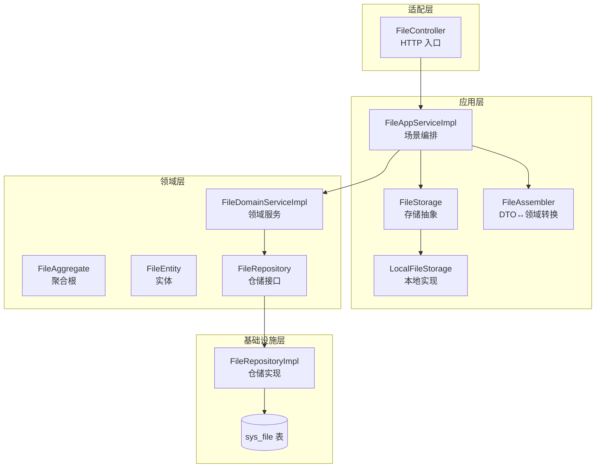
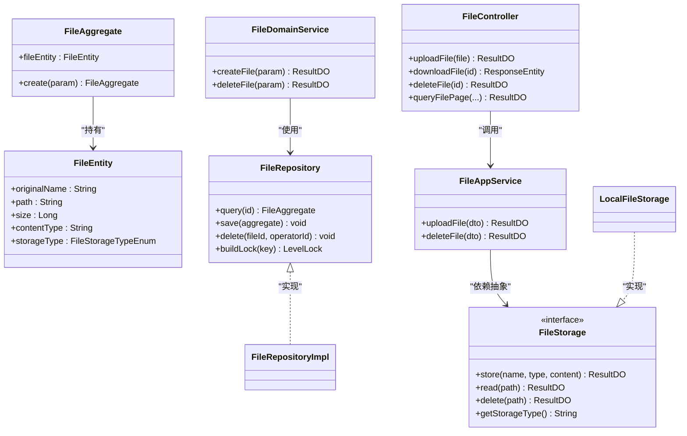
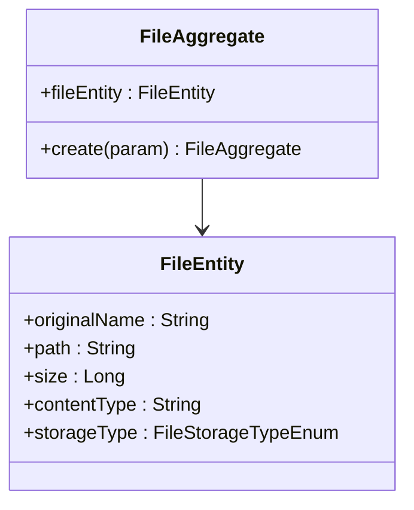
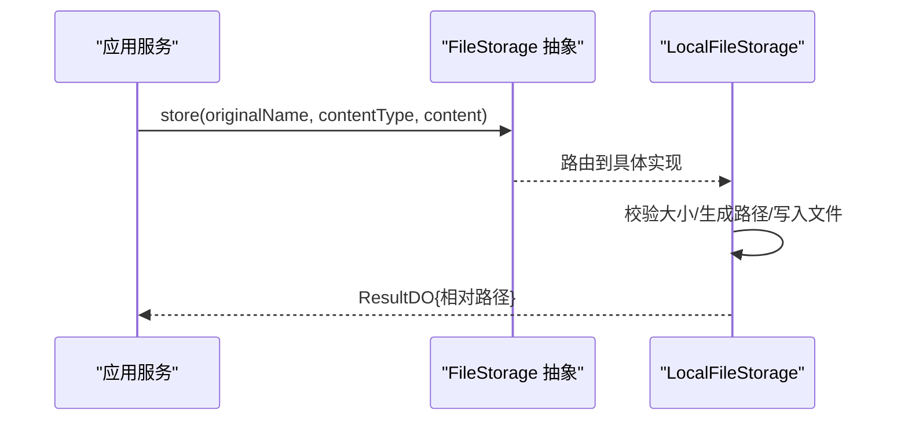
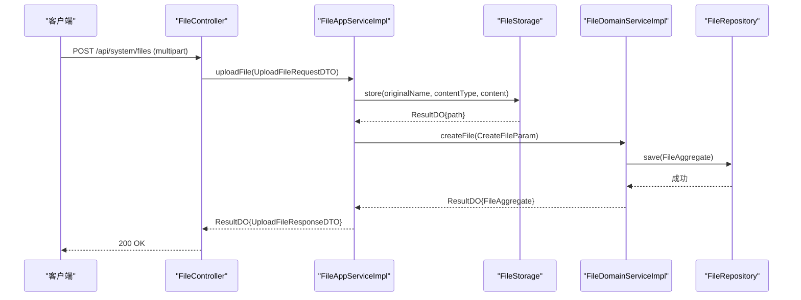
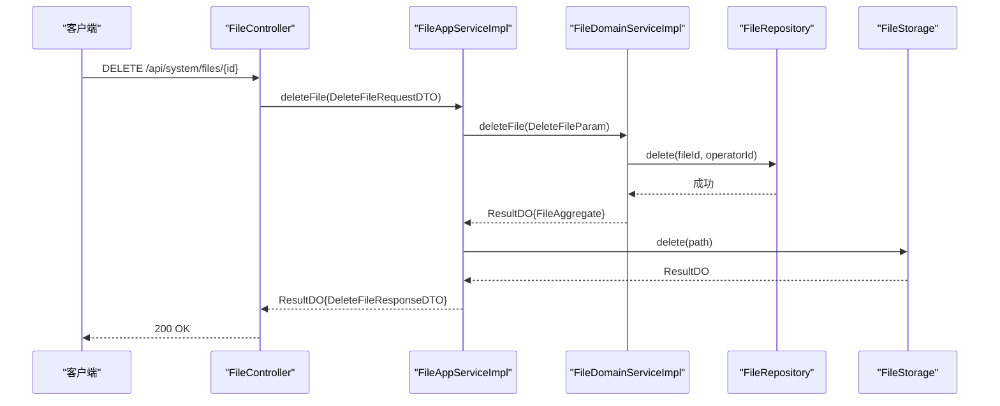
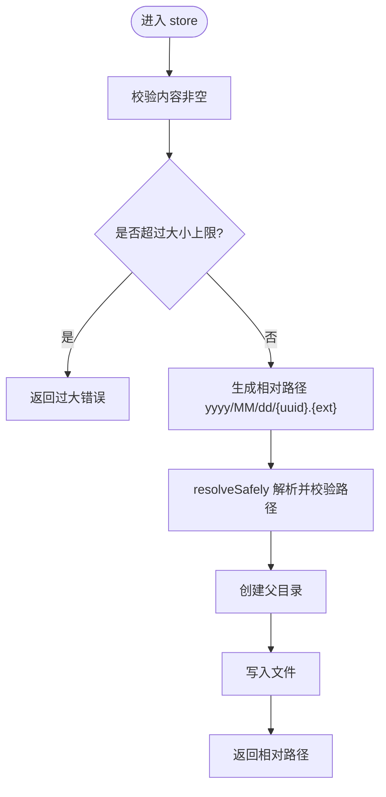
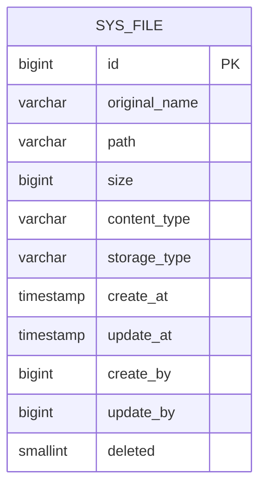
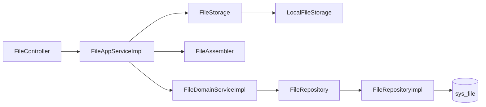

# 文件管理模块

<cite>
**本文引用的文件**   
- [FileAggregate.java](file://src/main/java/com/sunnao/spring/ddd/template/domain/system/file/model/aggregate/FileAggregate.java)
- [FileEntity.java](file://src/main/java/com/sunnao/spring/ddd/template/domain/system/file/model/entity/FileEntity.java)
- [CreateFileParam.java](file://src/main/java/com/sunnao/spring/ddd/template/domain/system/file/model/param/CreateFileParam.java)
- [DeleteFileParam.java](file://src/main/java/com/sunnao/spring/ddd/template/domain/system/file/model/param/DeleteFileParam.java)
- [FileRepository.java](file://src/main/java/com/sunnao/spring/ddd/template/domain/system/file/repository/FileRepository.java)
- [FileDomainServiceImpl.java](file://src/main/java/com/sunnao/spring/ddd/template/domain/system/file/service/FileDomainServiceImpl.java)
- [FileAppServiceImpl.java](file://src/main/java/com/sunnao/spring/ddd/template/application/system/file/scenario/FileAppServiceImpl.java)
- [FileStorage.java](file://src/main/java/com/sunnao/spring/ddd/template/application/system/file/FileStorage.java)
- [LocalFileStorage.java](file://src/main/java/com/sunnao/spring/ddd/template/adaptor/system/file/output/LocalFileStorage.java)
- [FileController.java](file://src/main/java/com/sunnao/spring/ddd/template/adaptor/system/file/input/FileController.java)
- [UploadFileRequestDTO.java](file://src/main/java/com/sunnao/spring/ddd/template/client/system/file/req/UploadFileRequestDTO.java)
- [UploadFileResponseDTO.java](file://src/main/java/com/sunnao/spring/ddd/template/client/system/file/res/UploadFileResponseDTO.java)
- [FileAssembler.java](file://src/main/java/com/sunnao/spring/ddd/template/application/system/file/assembler/FileAssembler.java)
- [FileRepositoryImpl.java](file://src/main/java/com/sunnao/spring/ddd/template/infrastructure/system/file/repository/FileRepositoryImpl.java)
- [V5__init_sys_file.sql](file://src/main/resources/db/migration/V5__init_sys_file.sql)
- [FileStorageTypeEnum.java](file://src/main/java/com/sunnao/spring/ddd/template/model/system/file/FileStorageTypeEnum.java)
</cite>

## 目录
1. [简介](#简介)
2. [项目结构](#项目结构)
3. [核心组件](#核心组件)
4. [架构总览](#架构总览)
5. [详细组件分析](#详细组件分析)
6. [依赖关系分析](#依赖关系分析)
7. [性能与扩展性](#性能与扩展性)
8. [故障排查指南](#故障排查指南)
9. [结论](#结论)
10. [附录：配置与存储后端切换](#附录配置与存储后端切换)

## 简介
本文件管理模块基于 DDD 分层设计，围绕“文件聚合根”组织领域模型与应用编排，提供上传、下载、删除与分页查询能力。物理文件通过应用层抽象 FileStorage 接入不同存储后端（本地磁盘、S3 兼容对象存储），实现策略模式与可插拔切换；元数据持久化由仓储层负责，领域服务在写路径上引入分布式锁保证幂等与一致性。

## 项目结构
文件模块按 DDD 分层组织：
- 适配层（Adaptor）：HTTP 控制器接收请求并转换为 DTO，调用应用服务。
- 应用层（Application）：场景编排，协调存储后端与领域服务，处理异常与响应组装。
- 领域层（Domain）：聚合根、实体、参数、仓储接口与领域服务，封装业务规则。
- 基础设施层（Infrastructure）：仓储实现、数据库映射与转换。
- 共享模型（Model）：跨层枚举与通用类型。

图表来源
- [FileController.java:1-130](file://src/main/java/com/sunnao/spring/ddd/template/adaptor/system/file/input/FileController.java#L1-L130)
- [FileAppServiceImpl.java:1-107](file://src/main/java/com/sunnao/spring/ddd/template/application/system/file/scenario/FileAppServiceImpl.java#L1-L107)
- [FileStorage.java:1-47](file://src/main/java/com/sunnao/spring/ddd/template/application/system/file/FileStorage.java#L1-L47)
- [LocalFileStorage.java:1-115](file://src/main/java/com/sunnao/spring/ddd/template/adaptor/system/file/output/LocalFileStorage.java#L1-L115)
- [FileAssembler.java:1-123](file://src/main/java/com/sunnao/spring/ddd/template/application/system/file/assembler/FileAssembler.java#L1-L123)
- [FileAggregate.java:1-69](file://src/main/java/com/sunnao/spring/ddd/template/domain/system/file/model/aggregate/FileAggregate.java#L1-L69)
- [FileEntity.java:1-43](file://src/main/java/com/sunnao/spring/ddd/template/domain/system/file/model/entity/FileEntity.java#L1-L43)
- [FileDomainServiceImpl.java:1-84](file://src/main/java/com/sunnao/spring/ddd/template/domain/system/file/service/FileDomainServiceImpl.java#L1-L84)
- [FileRepository.java:1-34](file://src/main/java/com/sunnao/spring/ddd/template/domain/system/file/repository/FileRepository.java#L1-L34)
- [FileRepositoryImpl.java:1-152](file://src/main/java/com/sunnao/spring/ddd/template/infrastructure/system/file/repository/FileRepositoryImpl.java#L1-L152)
- [V5__init_sys_file.sql:1-43](file://src/main/resources/db/migration/V5__init_sys_file.sql#L1-L43)

章节来源
- [FileController.java:1-130](file://src/main/java/com/sunnao/spring/ddd/template/adaptor/system/file/input/FileController.java#L1-L130)
- [FileAppServiceImpl.java:1-107](file://src/main/java/com/sunnao/spring/ddd/template/application/system/file/scenario/FileAppServiceImpl.java#L1-L107)
- [FileStorage.java:1-47](file://src/main/java/com/sunnao/spring/ddd/template/application/system/file/FileStorage.java#L1-L47)
- [LocalFileStorage.java:1-115](file://src/main/java/com/sunnao/spring/ddd/template/adaptor/system/file/output/LocalFileStorage.java#L1-L115)
- [FileAssembler.java:1-123](file://src/main/java/com/sunnao/spring/ddd/template/application/system/file/assembler/FileAssembler.java#L1-L123)
- [FileAggregate.java:1-69](file://src/main/java/com/sunnao/spring/ddd/template/domain/system/file/model/aggregate/FileAggregate.java#L1-L69)
- [FileEntity.java:1-43](file://src/main/java/com/sunnao/spring/ddd/template/domain/system/file/model/entity/FileEntity.java#L1-L43)
- [FileDomainServiceImpl.java:1-84](file://src/main/java/com/sunnao/spring/ddd/template/domain/system/file/service/FileDomainServiceImpl.java#L1-L84)
- [FileRepository.java:1-34](file://src/main/java/com/sunnao/spring/ddd/template/domain/system/file/repository/FileRepository.java#L1-L34)
- [FileRepositoryImpl.java:1-152](file://src/main/java/com/sunnao/spring/ddd/template/infrastructure/system/file/repository/FileRepositoryImpl.java#L1-L152)
- [V5__init_sys_file.sql:1-43](file://src/main/resources/db/migration/V5__init_sys_file.sql#L1-L43)

## 核心组件
- 文件聚合根与实体
  - 聚合根负责创建与校验文件元数据，不直接持有物理内容，仅持有 FileEntity。
  - 实体承载原始文件名、存储路径、大小、MIME 类型与存储类型标识。
- 应用服务与装配器
  - 应用服务编排上传流程：先存物理文件，再登记元数据；失败时尽力回滚物理文件。
  - 装配器负责 DTO 与领域对象的转换。
- 领域服务与仓储
  - 领域服务在写路径加锁，确保同一路径或同一文件的并发安全。
  - 仓储接口定义元数据的增删改查与锁构建；实现类完成 PO 与聚合根的转换与分页。
- 存储抽象与本地实现
  - 存储抽象定义 store/read/delete/getStorageType 方法，返回统一结果对象。
  - 本地实现提供路径生成、大小限制、路径穿越防护与读写删除逻辑。

章节来源
- [FileAggregate.java:1-69](file://src/main/java/com/sunnao/spring/ddd/template/domain/system/file/model/aggregate/FileAggregate.java#L1-L69)
- [FileEntity.java:1-43](file://src/main/java/com/sunnao/spring/ddd/template/domain/system/file/model/entity/FileEntity.java#L1-L43)
- [FileAppServiceImpl.java:1-107](file://src/main/java/com/sunnao/spring/ddd/template/application/system/file/scenario/FileAppServiceImpl.java#L1-L107)
- [FileAssembler.java:1-123](file://src/main/java/com/sunnao/spring/ddd/template/application/system/file/assembler/FileAssembler.java#L1-L123)
- [FileDomainServiceImpl.java:1-84](file://src/main/java/com/sunnao/spring/ddd/template/domain/system/file/service/FileDomainServiceImpl.java#L1-L84)
- [FileRepository.java:1-34](file://src/main/java/com/sunnao/spring/ddd/template/domain/system/file/repository/FileRepository.java#L1-L34)
- [FileRepositoryImpl.java:1-152](file://src/main/java/com/sunnao/spring/ddd/template/infrastructure/system/file/repository/FileRepositoryImpl.java#L1-L152)
- [FileStorage.java:1-47](file://src/main/java/com/sunnao/spring/ddd/template/application/system/file/FileStorage.java#L1-L47)
- [LocalFileStorage.java:1-115](file://src/main/java/com/sunnao/spring/ddd/template/adaptor/system/file/output/LocalFileStorage.java#L1-L115)

## 架构总览
文件模块采用“应用层抽象 + 适配层实现”的策略模式，将物理文件存储与领域解耦；写路径通过领域服务加锁保障幂等与一致性；读路径通过控制器直连查询服务返回流式响应。

图表来源
- [FileAggregate.java:1-69](file://src/main/java/com/sunnao/spring/ddd/template/domain/system/file/model/aggregate/FileAggregate.java#L1-L69)
- [FileEntity.java:1-43](file://src/main/java/com/sunnao/spring/ddd/template/domain/system/file/model/entity/FileEntity.java#L1-L43)
- [FileDomainServiceImpl.java:1-84](file://src/main/java/com/sunnao/spring/ddd/template/domain/system/file/service/FileDomainServiceImpl.java#L1-L84)
- [FileRepository.java:1-34](file://src/main/java/com/sunnao/spring/ddd/template/domain/system/file/repository/FileRepository.java#L1-L34)
- [FileRepositoryImpl.java:1-152](file://src/main/java/com/sunnao/spring/ddd/template/infrastructure/system/file/repository/FileRepositoryImpl.java#L1-L152)
- [FileStorage.java:1-47](file://src/main/java/com/sunnao/spring/ddd/template/application/system/file/FileStorage.java#L1-L47)
- [LocalFileStorage.java:1-115](file://src/main/java/com/sunnao/spring/ddd/template/adaptor/system/file/output/LocalFileStorage.java#L1-L115)
- [FileAppServiceImpl.java:1-107](file://src/main/java/com/sunnao/spring/ddd/template/application/system/file/scenario/FileAppServiceImpl.java#L1-L107)
- [FileController.java:1-130](file://src/main/java/com/sunnao/spring/ddd/template/adaptor/system/file/input/FileController.java#L1-L130)

## 详细组件分析

### 文件聚合根与实体
- 职责边界
  - 聚合根仅负责元数据创建与校验，不感知物理存储细节。
  - 实体承载字段语义与约束，配合枚举存储类型进行落库。
- 关键行为
  - create：校验必填项、大小、存储类型合法性，填充操作人信息。
  - 外部只能通过聚合根访问实体，避免绕过校验。

图表来源
- [FileAggregate.java:1-69](file://src/main/java/com/sunnao/spring/ddd/template/domain/system/file/model/aggregate/FileAggregate.java#L1-L69)
- [FileEntity.java:1-43](file://src/main/java/com/sunnao/spring/ddd/template/domain/system/file/model/entity/FileEntity.java#L1-L43)

章节来源
- [FileAggregate.java:1-69](file://src/main/java/com/sunnao/spring/ddd/template/domain/system/file/model/aggregate/FileAggregate.java#L1-L69)
- [FileEntity.java:1-43](file://src/main/java/com/sunnao/spring/ddd/template/domain/system/file/model/entity/FileEntity.java#L1-L43)

### 多存储后端支持（策略模式）
- 抽象与实现
  - FileStorage 定义统一的 store/read/delete/getStorageType 契约。
  - LocalFileStorage 提供本地磁盘实现，包含大小限制、路径生成、路径穿越防护。
- 切换机制
  - 通过条件注解与配置 app.file.storage-type 选择具体实现（默认 local）。
  - 新增 S3 实现后，仅需注册 Bean 并修改配置即可切换。

图表来源
- [FileStorage.java:1-47](file://src/main/java/com/sunnao/spring/ddd/template/application/system/file/FileStorage.java#L1-L47)
- [LocalFileStorage.java:1-115](file://src/main/java/com/sunnao/spring/ddd/template/adaptor/system/file/output/LocalFileStorage.java#L1-L115)

章节来源
- [FileStorage.java:1-47](file://src/main/java/com/sunnao/spring/ddd/template/application/system/file/FileStorage.java#L1-L47)
- [LocalFileStorage.java:1-115](file://src/main/java/com/sunnao/spring/ddd/template/adaptor/system/file/output/LocalFileStorage.java#L1-L115)
- [FileStorageTypeEnum.java:1-53](file://src/main/java/com/sunnao/spring/ddd/template/model/system/file/FileStorageTypeEnum.java#L1-L53)

### 文件上传下载流程
- 上传流程
  - 控制器读取 MultipartFile 转为自包含 DTO。
  - 应用服务先调用存储抽象保存物理文件，再调用领域服务登记元数据；若登记失败则尽力回滚物理文件。
- 下载流程
  - 控制器根据 ID 调用查询服务获取元数据与内容，设置响应头并以二进制流返回。

图表来源
- [FileController.java:1-130](file://src/main/java/com/sunnao/spring/ddd/template/adaptor/system/file/input/FileController.java#L1-L130)
- [FileAppServiceImpl.java:1-107](file://src/main/java/com/sunnao/spring/ddd/template/application/system/file/scenario/FileAppServiceImpl.java#L1-L107)
- [FileStorage.java:1-47](file://src/main/java/com/sunnao/spring/ddd/template/application/system/file/FileStorage.java#L1-L47)
- [FileDomainServiceImpl.java:1-84](file://src/main/java/com/sunnao/spring/ddd/template/domain/system/file/service/FileDomainServiceImpl.java#L1-L84)
- [FileRepository.java:1-34](file://src/main/java/com/sunnao/spring/ddd/template/domain/system/file/repository/FileRepository.java#L1-L34)

章节来源
- [FileController.java:1-130](file://src/main/java/com/sunnao/spring/ddd/template/adaptor/system/file/input/FileController.java#L1-L130)
- [FileAppServiceImpl.java:1-107](file://src/main/java/com/sunnao/spring/ddd/template/application/system/file/scenario/FileAppServiceImpl.java#L1-L107)
- [UploadFileRequestDTO.java:1-54](file://src/main/java/com/sunnao/spring/ddd/template/client/system/file/req/UploadFileRequestDTO.java#L1-54)
- [UploadFileResponseDTO.java:1-36](file://src/main/java/com/sunnao/spring/ddd/template/client/system/file/res/UploadFileResponseDTO.java#L1-36)

### 文件删除流程
- 应用服务调用领域服务执行逻辑删除，随后尽力清理物理文件；即使清理失败也不影响删除结果。

图表来源
- [FileController.java:1-130](file://src/main/java/com/sunnao/spring/ddd/template/adaptor/system/file/input/FileController.java#L1-L130)
- [FileAppServiceImpl.java:1-107](file://src/main/java/com/sunnao/spring/ddd/template/application/system/file/scenario/FileAppServiceImpl.java#L1-L107)
- [FileDomainServiceImpl.java:1-84](file://src/main/java/com/sunnao/spring/ddd/template/domain/system/file/service/FileDomainServiceImpl.java#L1-L84)
- [FileRepository.java:1-34](file://src/main/java/com/sunnao/spring/ddd/template/domain/system/file/repository/FileRepository.java#L1-L34)

章节来源
- [FileController.java:1-130](file://src/main/java/com/sunnao/spring/ddd/template/adaptor/system/file/input/FileController.java#L1-L130)
- [FileAppServiceImpl.java:1-107](file://src/main/java/com/sunnao/spring/ddd/template/application/system/file/scenario/FileAppServiceImpl.java#L1-L107)
- [FileDomainServiceImpl.java:1-84](file://src/main/java/com/sunnao/spring/ddd/template/domain/system/file/service/FileDomainServiceImpl.java#L1-L84)

### 复杂逻辑：本地存储路径生成与安全校验
- 路径生成
  - 采用日期分目录与 UUID 命名，降低单目录文件数量，提升文件系统性能。
- 安全校验
  - 解析相对路径为绝对路径并进行归一化，防止路径穿越逃逸出存储根目录。
  - 对非法路径抛出异常并返回错误码。

图表来源
- [LocalFileStorage.java:1-115](file://src/main/java/com/sunnao/spring/ddd/template/adaptor/system/file/output/LocalFileStorage.java#L1-L115)

章节来源
- [LocalFileStorage.java:1-115](file://src/main/java/com/sunnao/spring/ddd/template/adaptor/system/file/output/LocalFileStorage.java#L1-L115)

### 数据模型与持久化
- 表结构
  - sys_file 包含 id、original_name、path、size、content_type、storage_type、审计字段与 deleted 逻辑删除标记。
- 仓储实现
  - 查询、分页、插入更新、逻辑删除均封装于仓储实现，PO 与聚合根之间通过转换器进行纯技术转换。

图表来源
- [V5__init_sys_file.sql:1-43](file://src/main/resources/db/migration/V5__init_sys_file.sql#L1-L43)

章节来源
- [V5__init_sys_file.sql:1-43](file://src/main/resources/db/migration/V5__init_sys_file.sql#L1-L43)
- [FileRepositoryImpl.java:1-152](file://src/main/java/com/sunnao/spring/ddd/template/infrastructure/system/file/repository/FileRepositoryImpl.java#L1-L152)

## 依赖关系分析
- 耦合与内聚
  - 应用层仅依赖 FileStorage 抽象，内聚于场景编排；领域层聚焦聚合根与领域服务；基础设施层专注数据存取。
- 外部依赖
  - 文件系统 API、MyBatis-Flex、Sa-Token 权限控制、MapStruct 转换。
- 潜在循环依赖
  - 当前分层清晰，未见循环导入；存储实现通过条件注解注入，避免硬编码耦合。

图表来源
- [FileController.java:1-130](file://src/main/java/com/sunnao/spring/ddd/template/adaptor/system/file/input/FileController.java#L1-L130)
- [FileAppServiceImpl.java:1-107](file://src/main/java/com/sunnao/spring/ddd/template/application/system/file/scenario/FileAppServiceImpl.java#L1-L107)
- [FileStorage.java:1-47](file://src/main/java/com/sunnao/spring/ddd/template/application/system/file/FileStorage.java#L1-L47)
- [LocalFileStorage.java:1-115](file://src/main/java/com/sunnao/spring/ddd/template/adaptor/system/file/output/LocalFileStorage.java#L1-L115)
- [FileAssembler.java:1-123](file://src/main/java/com/sunnao/spring/ddd/template/application/system/file/assembler/FileAssembler.java#L1-L123)
- [FileDomainServiceImpl.java:1-84](file://src/main/java/com/sunnao/spring/ddd/template/domain/system/file/service/FileDomainServiceImpl.java#L1-L84)
- [FileRepository.java:1-34](file://src/main/java/com/sunnao/spring/ddd/template/domain/system/file/repository/FileRepository.java#L1-L34)
- [FileRepositoryImpl.java:1-152](file://src/main/java/com/sunnao/spring/ddd/template/infrastructure/system/file/repository/FileRepositoryImpl.java#L1-L152)

章节来源
- [FileController.java:1-130](file://src/main/java/com/sunnao/spring/ddd/template/adaptor/system/file/input/FileController.java#L1-L130)
- [FileAppServiceImpl.java:1-107](file://src/main/java/com/sunnao/spring/ddd/template/application/system/file/scenario/FileAppServiceImpl.java#L1-L107)
- [FileRepositoryImpl.java:1-152](file://src/main/java/com/sunnao/spring/ddd/template/infrastructure/system/file/repository/FileRepositoryImpl.java#L1-L152)

## 性能与扩展性
- 大文件与分片上传
  - 当前实现以字节数组形式传输，适合中小文件；大文件建议在上层网关或客户端侧实现分片与断点续传，服务端可扩展为分片合并接口。
- 并发与锁
  - 写路径通过领域服务加锁（按路径或文件 ID），避免重复登记与竞态条件。
- 存储优化
  - 本地存储采用日期分目录与 UUID 命名，减少单目录文件数；对象存储可实现 CDN 加速与冷热分层。
- 扩展点
  - 新增 S3 实现：实现 FileStorage 接口，注册 Bean，并通过配置切换；领域与仓储无需改动。

[本节为通用指导，不涉及具体文件分析]

## 故障排查指南
- 常见错误
  - 文件为空或过大：检查请求内容与配置的大小上限。
  - 路径非法或不存在：确认相对路径未逃逸根目录且目标存在。
  - 元数据登记失败：查看领域服务日志与仓储异常，必要时回滚物理文件。
- 定位要点
  - 控制器日志记录读取失败与系统异常。
  - 应用服务在异常分支记录请求上下文。
  - 领域服务捕获业务异常与系统异常并返回统一结果。
  - 仓储实现包装数据库异常为仓储异常。

章节来源
- [FileController.java:1-130](file://src/main/java/com/sunnao/spring/ddd/template/adaptor/system/file/input/FileController.java#L1-L130)
- [FileAppServiceImpl.java:1-107](file://src/main/java/com/sunnao/spring/ddd/template/application/system/file/scenario/FileAppServiceImpl.java#L1-L107)
- [FileDomainServiceImpl.java:1-84](file://src/main/java/com/sunnao/spring/ddd/template/domain/system/file/service/FileDomainServiceImpl.java#L1-L84)
- [FileRepositoryImpl.java:1-152](file://src/main/java/com/sunnao/spring/ddd/template/infrastructure/system/file/repository/FileRepositoryImpl.java#L1-L152)

## 结论
该文件管理模块以聚合根为核心，结合策略模式与仓储抽象，实现了可插拔的存储后端与清晰的职责边界。写路径通过锁保障一致性，读路径以流式响应提升体验。后续可在应用层扩展分片上传、病毒扫描、访问控制与审计增强，同时保持领域不变性与存储无关性。

[本节为总结，不涉及具体文件分析]

## 附录：配置与存储后端切换
- 配置项
  - 本地存储根目录：app.file.local.base-path（默认 ./data/files）
  - 单文件大小上限：app.file.max-size（默认 10MB）
  - 存储类型切换：app.file.storage-type（local 默认；s3 用于对象存储实现）
- 切换步骤
  - 新增 S3 实现类并实现 FileStorage 接口。
  - 通过条件注解或配置激活对应实现。
  - 修改 app.file.storage-type 为 s3，重启生效。
- 安全与合规
  - 文件名校验：拒绝包含路径分隔符与上级目录符号。
  - 路径穿越防护：解析相对路径并校验位于存储根目录下。
  - 访问控制：控制器通过权限点 system:file:read/write 控制读写。

章节来源
- [LocalFileStorage.java:1-115](file://src/main/java/com/sunnao/spring/ddd/template/adaptor/system/file/output/LocalFileStorage.java#L1-L115)
- [UploadFileRequestDTO.java:1-54](file://src/main/java/com/sunnao/spring/ddd/template/client/system/file/req/UploadFileRequestDTO.java#L1-54)
- [FileController.java:1-130](file://src/main/java/com/sunnao/spring/ddd/template/adaptor/system/file/input/FileController.java#L1-L130)
- [FileStorageTypeEnum.java:1-53](file://src/main/java/com/sunnao/spring/ddd/template/model/system/file/FileStorageTypeEnum.java#L1-L53)