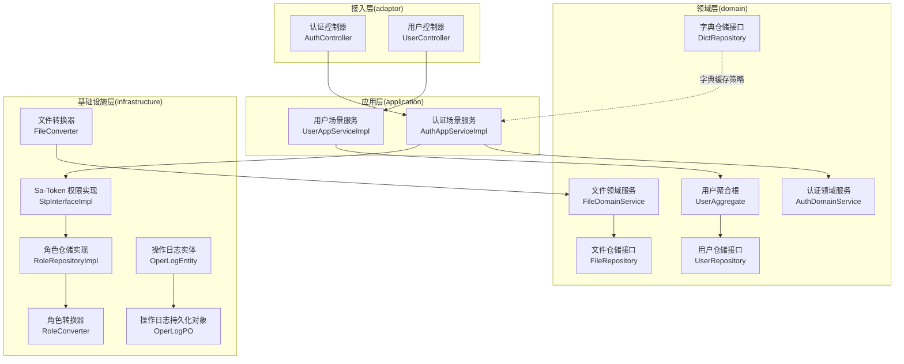
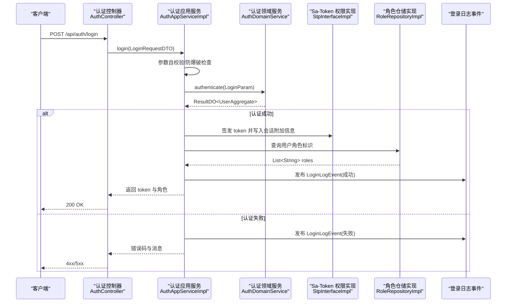
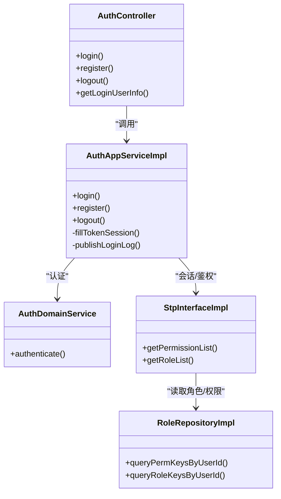
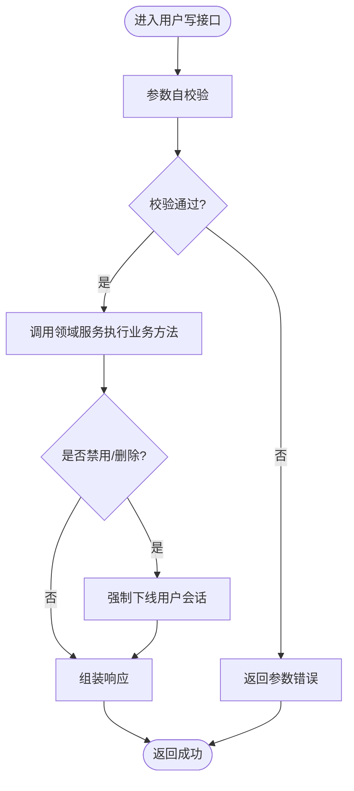
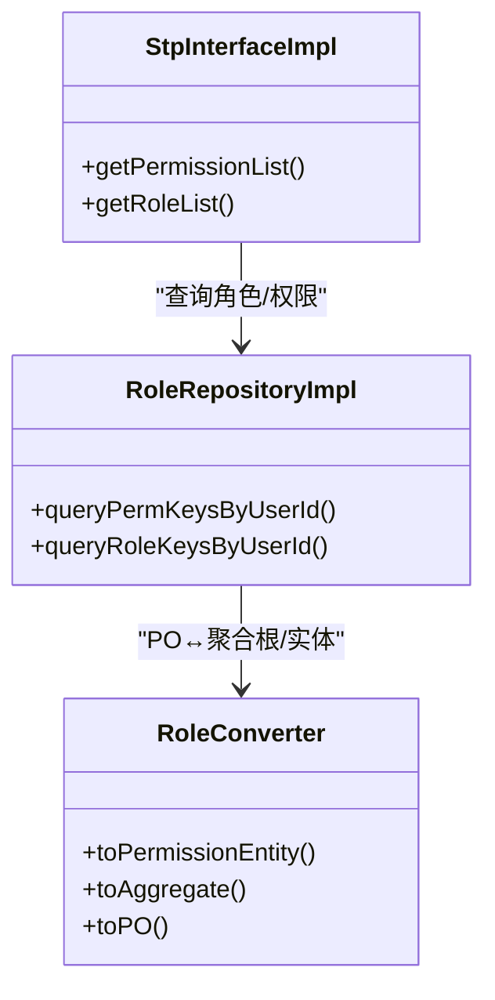
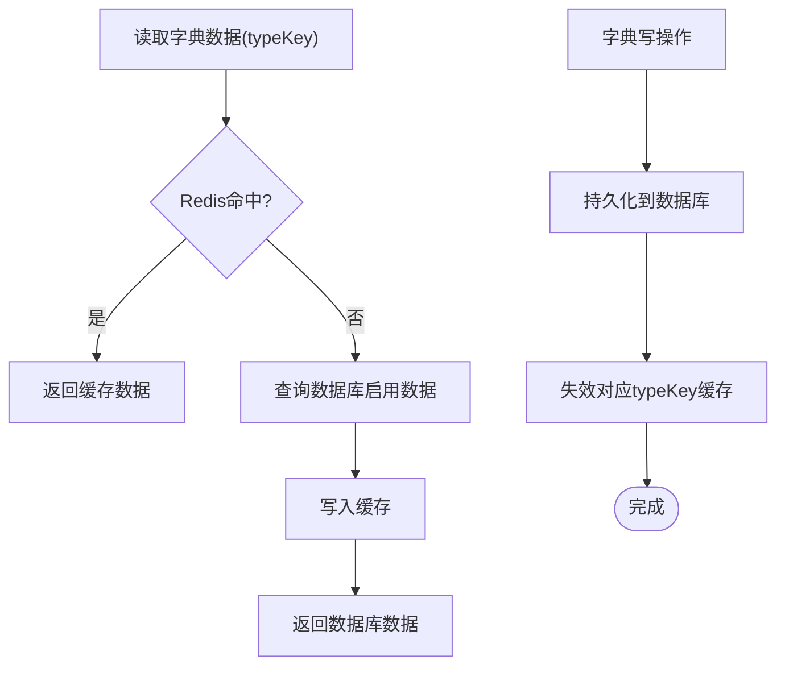
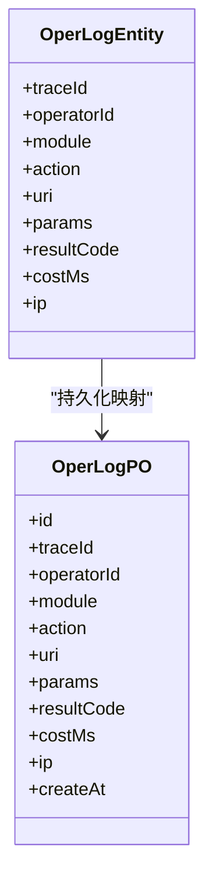
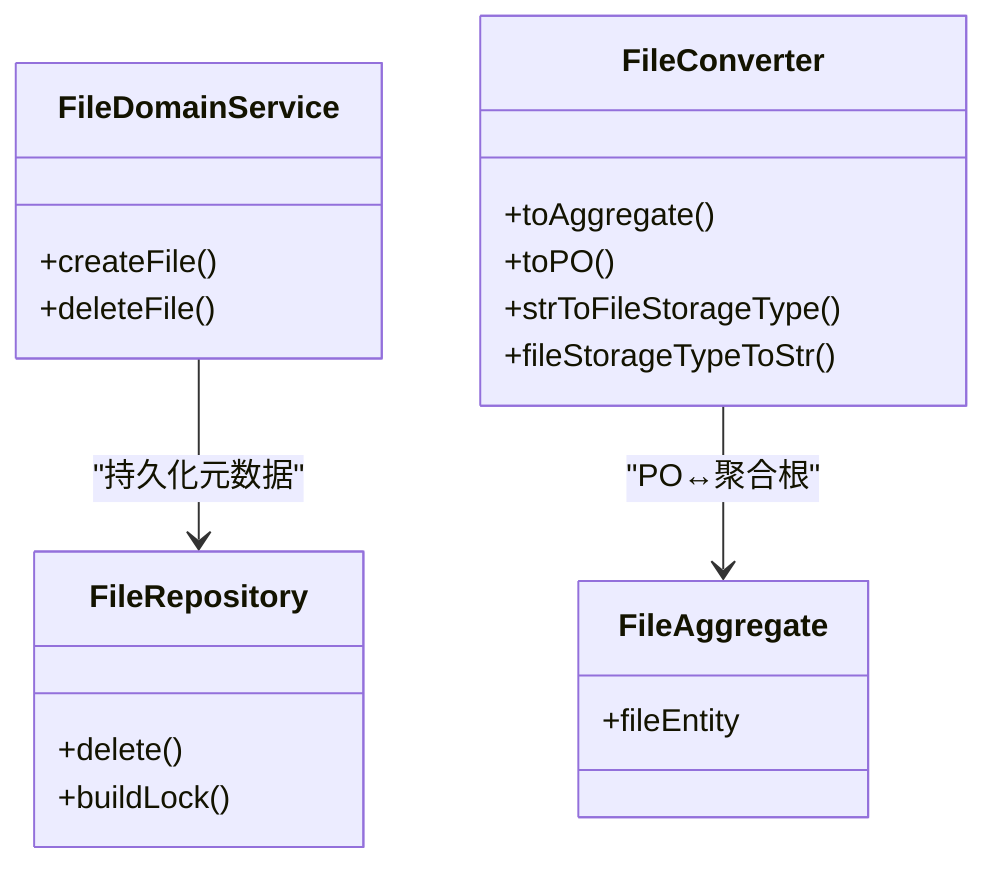
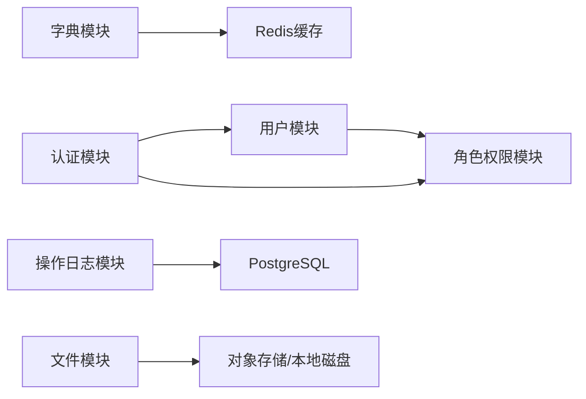

# 核心业务模块

<cite>
**本文引用的文件**   
- [README.md](file://README.md)
- [AuthController.java](file://src/main/java/com/sunnao/spring/ddd/template/adaptor/auth/input/AuthController.java)
- [AuthAppServiceImpl.java](file://src/main/java/com/sunnao/spring/ddd/template/application/auth/scenario/AuthAppServiceImpl.java)
- [AuthDomainService.java](file://src/main/java/com/sunnao/spring/ddd/template/domain/auth/service/AuthDomainService.java)
- [StpInterfaceImpl.java](file://src/main/java/com/sunnao/spring/ddd/template/infrastructure/auth/StpInterfaceImpl.java)
- [UserController.java](file://src/main/java/com/sunnao/spring/ddd/template/adaptor/system/user/input/UserController.java)
- [UserAppServiceImpl.java](file://src/main/java/com/sunnao/spring/ddd/template/application/system/user/scenario/UserAppServiceImpl.java)
- [UserAggregate.java](file://src/main/java/com/sunnao/spring/ddd/template/domain/system/user/model/aggregate/UserAggregate.java)
- [UserRepository.java](file://src/main/java/com/sunnao/spring/ddd/template/domain/system/user/repository/UserRepository.java)
- [RoleRepositoryImpl.java](file://src/main/java/com/sunnao/spring/ddd/template/infrastructure/system/role/repository/RoleRepositoryImpl.java)
- [RoleConverter.java](file://src/main/java/com/sunnao/spring/ddd/template/infrastructure/system/role/converter/RoleConverter.java)
- [DictRepository.java](file://src/main/java/com/sunnao/spring/ddd/template/domain/system/dict/repository/DictRepository.java)
- [OperLogEntity.java](file://src/main/java/com/sunnao/spring/ddd/template/domain/system/log/model/entity/OperLogEntity.java)
- [OperLogPO.java](file://src/main/java/com/sunnao/spring/ddd/template/infrastructure/system/log/mysql/po/OperLogPO.java)
- [FileAggregate.java](file://src/main/java/com/sunnao/spring/ddd/template/domain/system/file/model/aggregate/FileAggregate.java)
- [FileRepository.java](file://src/main/java/com/sunnao/spring/ddd/template/domain/system/file/repository/FileRepository.java)
- [FileDomainService.java](file://src/main/java/com/sunnao/spring/ddd/template/domain/system/file/service/FileDomainService.java)
- [FileConverter.java](file://src/main/java/com/sunnao/spring/ddd/template/infrastructure/system/file/converter/FileConverter.java)
- [frontend-development-guide.md](file://docs/frontend-development-guide.md)
</cite>

## 目录
1. [简介](#简介)
2. [项目结构](#项目结构)
3. [核心组件](#核心组件)
4. [架构总览](#架构总览)
5. [详细组件分析](#详细组件分析)
6. [依赖关系分析](#依赖关系分析)
7. [性能考虑](#性能考虑)
8. [故障排查指南](#故障排查指南)
9. [结论](#结论)
10. [附录](#附录)

## 简介
本仓库基于六边形架构与 DDD 分层，内置六大系统模块：认证授权、用户管理、角色权限（RBAC）、字典管理、操作日志、文件管理。各模块均提供完整 CRUD、权限控制与业务规则校验；应用层负责编排与 DTO 转换，领域层承载聚合根与业务规则，基础设施层实现仓储与外部适配。

## 项目结构
整体遵循“adaptor → application → domain → repository(接口) → infrastructure(实现)”的调用方向，client 层定义对外 AppService 接口与自包含 DTO，model 层共享枚举等内部模型。

图表来源
- [AuthController.java:1-70](file://src/main/java/com/sunnao/spring/ddd/template/adaptor/auth/input/AuthController.java#L1-L70)
- [AuthAppServiceImpl.java:1-196](file://src/main/java/com/sunnao/spring/ddd/template/application/auth/scenario/AuthAppServiceImpl.java#L1-L196)
- [AuthDomainService.java:1-24](file://src/main/java/com/sunnao/spring/ddd/template/domain/auth/service/AuthDomainService.java#L1-L24)
- [StpInterfaceImpl.java:1-54](file://src/main/java/com/sunnao/spring/ddd/template/infrastructure/auth/StpInterfaceImpl.java#L1-L54)
- [UserController.java:1-115](file://src/main/java/com/sunnao/spring/ddd/template/adaptor/system/user/input/UserController.java#L1-L115)
- [UserAppServiceImpl.java:1-163](file://src/main/java/com/sunnao/spring/ddd/template/application/system/user/scenario/UserAppServiceImpl.java#L1-L163)
- [UserAggregate.java:1-113](file://src/main/java/com/sunnao/spring/ddd/template/domain/system/user/model/aggregate/UserAggregate.java#L1-L113)
- [UserRepository.java:1-65](file://src/main/java/com/sunnao/spring/ddd/template/domain/system/user/repository/UserRepository.java#L1-L65)
- [RoleRepositoryImpl.java:1-21](file://src/main/java/com/sunnao/spring/ddd/template/infrastructure/system/role/repository/RoleRepositoryImpl.java#L1-L21)
- [RoleConverter.java:36-83](file://src/main/java/com/sunnao/spring/ddd/template/infrastructure/system/role/converter/RoleConverter.java#L36-L83)
- [FileRepository.java:1-33](file://src/main/java/com/sunnao/spring/ddd/template/domain/system/file/repository/FileRepository.java#L1-L33)
- [FileDomainService.java:1-31](file://src/main/java/com/sunnao/spring/ddd/template/domain/system/file/service/FileDomainService.java#L1-L31)
- [FileConverter.java:34-83](file://src/main/java/com/sunnao/spring/ddd/template/infrastructure/system/file/converter/FileConverter.java#L34-L83)
- [OperLogEntity.java:1-61](file://src/main/java/com/sunnao/spring/ddd/template/domain/system/log/model/entity/OperLogEntity.java#L1-L61)
- [OperLogPO.java:1-78](file://src/main/java/com/sunnao/spring/ddd/template/infrastructure/system/log/mysql/po/OperLogPO.java#L1-L78)

章节来源
- [README.md:19-46](file://README.md#L19-L46)

## 核心组件
- 认证授权模块：登录/注册/登出/当前用户信息，集成防爆破与会话附加信息写入，通过 Sa-Token 鉴权。
- 用户管理模块：用户增删改查、启用/禁用、逻辑删除；状态变更时强制下线会话。
- 角色权限模块：角色与权限点查询，Sa-Token 从 RBAC 表动态加载角色与权限集合。
- 字典管理模块：类型/数据 CRUD，按 typeKey 读启用项走 Redis 缓存，写后失效。
- 操作日志模块：注解采集 + 异步落库，记录 traceId、操作人、参数摘要、结果码、耗时、IP。
- 文件管理模块：上传/下载/分页/删除，元数据持久化与物理存储解耦，支持本地与 S3 协议。

章节来源
- [README.md:84-118](file://README.md#L84-L118)

## 架构总览
下图展示一次“登录”请求在系统中的端到端流程，体现应用层编排、领域层校验、基础设施层鉴权与事件落库。

图表来源
- [AuthController.java:32-40](file://src/main/java/com/sunnao/spring/ddd/template/adaptor/auth/input/AuthController.java#L32-L40)
- [AuthAppServiceImpl.java:67-113](file://src/main/java/com/sunnao/spring/ddd/template/application/auth/scenario/AuthAppServiceImpl.java#L67-L113)
- [AuthDomainService.java:14-23](file://src/main/java/com/sunnao/spring/ddd/template/domain/auth/service/AuthDomainService.java#L14-L23)
- [StpInterfaceImpl.java:27-38](file://src/main/java/com/sunnao/spring/ddd/template/infrastructure/auth/StpInterfaceImpl.java#L27-L38)
- [RoleRepositoryImpl.java:1-21](file://src/main/java/com/sunnao/spring/ddd/template/infrastructure/system/role/repository/RoleRepositoryImpl.java#L1-L21)

## 详细组件分析

### 认证授权模块
- API 设计
  - 登录：POST /api/auth/login
  - 注册：POST /api/auth/register
  - 登出：POST /api/auth/logout
  - 当前用户：GET /api/auth/me
- 业务流程
  - 参数自校验 → 防爆破检查 → 领域服务凭证与状态校验 → 签发 token 并写入会话附加信息 → 查询角色标识 → 返回响应
  - 登录成功/失败均发布登录日志事件异步落库
- 数据模型
  - 领域层：LoginParam、UserAggregate
  - 应用层：LoginRequestDTO/RegisterRequestDTO/LoginResponseDTO/RegisterResponseDTO/GetLoginUserResponseDTO
- 权限控制
  - 登录/注册无需鉴权；后续接口由 Sa-Token 拦截器统一校验
  - 权限点与角色由 StpInterfaceImpl 从 RBAC 表动态加载
- 安全与健壮性
  - 防爆破：凭证失败计数达限则拒绝登录
  - 会话附加信息：IP、UA、登录时间等写入 Token-Session
  - 异常兜底：统一返回 ResultDO，避免上层抛异常

图表来源
- [AuthController.java:1-70](file://src/main/java/com/sunnao/spring/ddd/template/adaptor/auth/input/AuthController.java#L1-L70)
- [AuthAppServiceImpl.java:1-196](file://src/main/java/com/sunnao/spring/ddd/template/application/auth/scenario/AuthAppServiceImpl.java#L1-L196)
- [AuthDomainService.java:1-24](file://src/main/java/com/sunnao/spring/ddd/template/domain/auth/service/AuthDomainService.java#L1-L24)
- [StpInterfaceImpl.java:1-54](file://src/main/java/com/sunnao/spring/ddd/template/infrastructure/auth/StpInterfaceImpl.java#L1-L54)
- [RoleRepositoryImpl.java:1-21](file://src/main/java/com/sunnao/spring/ddd/template/infrastructure/system/role/repository/RoleRepositoryImpl.java#L1-L21)

章节来源
- [AuthController.java:1-70](file://src/main/java/com/sunnao/spring/ddd/template/adaptor/auth/input/AuthController.java#L1-L70)
- [AuthAppServiceImpl.java:67-113](file://src/main/java/com/sunnao/spring/ddd/template/application/auth/scenario/AuthAppServiceImpl.java#L67-L113)
- [AuthDomainService.java:14-23](file://src/main/java/com/sunnao/spring/ddd/template/domain/auth/service/AuthDomainService.java#L14-L23)
- [StpInterfaceImpl.java:27-52](file://src/main/java/com/sunnao/spring/ddd/template/infrastructure/auth/StpInterfaceImpl.java#L27-L52)

### 用户管理模块
- API 设计
  - 创建用户：POST /api/system/users
  - 修改资料：PUT /api/system/users/{id}
  - 变更状态：PUT /api/system/users/{id}/status
  - 删除用户：DELETE /api/system/users/{id}
  - 详情：GET /api/system/users/{id}
  - 分页列表：GET /api/system/users/page
- 业务流程
  - 参数自校验 → 领域服务执行业务方法 → 组装响应
  - 禁用/删除成功后强制下线该用户全部会话
- 数据模型
  - 聚合根：UserAggregate（封装 UserEntity 与业务方法）
  - 仓储接口：UserRepository（含 saveWithRoles/deleteWithRoles 跨关联事务）
- 权限控制
  - 读：system:user:read；写：system:user:write
- 最佳实践
  - 使用 CurrentUserContext 获取操作人
  - 状态变更后踢人保证旧 token 立即失效

图表来源
- [UserAppServiceImpl.java:90-149](file://src/main/java/com/sunnao/spring/ddd/template/application/system/user/scenario/UserAppServiceImpl.java#L90-L149)
- [UserAggregate.java:72-105](file://src/main/java/com/sunnao/spring/ddd/template/domain/system/user/model/aggregate/UserAggregate.java#L72-L105)
- [UserRepository.java:31-55](file://src/main/java/com/sunnao/spring/ddd/template/domain/system/user/repository/UserRepository.java#L31-L55)

章节来源
- [UserController.java:32-113](file://src/main/java/com/sunnao/spring/ddd/template/adaptor/system/user/input/UserController.java#L32-L113)
- [UserAppServiceImpl.java:40-149](file://src/main/java/com/sunnao/spring/ddd/template/application/system/user/scenario/UserAppServiceImpl.java#L40-L149)
- [UserAggregate.java:38-105](file://src/main/java/com/sunnao/spring/ddd/template/domain/system/user/model/aggregate/UserAggregate.java#L38-L105)
- [UserRepository.java:19-65](file://src/main/java/com/sunnao/spring/ddd/template/domain/system/user/repository/UserRepository.java#L19-L65)

### 角色权限管理模块（RBAC）
- 能力说明
  - 角色与权限点查询：供前端展示与后端鉴权
  - Sa-Token 集成：StpInterfaceImpl 从 sys_role/sys_permission 及关联表加载角色与权限点
- 数据模型
  - 角色聚合根与权限实体：RoleAggregate、PermissionEntity
  - 转换器：RoleConverter（PO ↔ 聚合根/实体）
- 权限点命名约定
  - 格式：{模块}:{read|write}，例如 system:user:read/system:user:write
- 前端提示
  - 当前“获取当前用户信息”仅返回角色标识，未返回具体权限点列表；建议后端补充“获取当前用户权限点列表”接口以支撑按钮级显隐

图表来源
- [StpInterfaceImpl.java:27-52](file://src/main/java/com/sunnao/spring/ddd/template/infrastructure/auth/StpInterfaceImpl.java#L27-L52)
- [RoleRepositoryImpl.java:1-21](file://src/main/java/com/sunnao/spring/ddd/template/infrastructure/system/role/repository/RoleRepositoryImpl.java#L1-L21)
- [RoleConverter.java:36-83](file://src/main/java/com/sunnao/spring/ddd/template/infrastructure/system/role/converter/RoleConverter.java#L36-L83)

章节来源
- [StpInterfaceImpl.java:1-54](file://src/main/java/com/sunnao/spring/ddd/template/infrastructure/auth/StpInterfaceImpl.java#L1-L54)
- [RoleRepositoryImpl.java:1-21](file://src/main/java/com/sunnao/spring/ddd/template/infrastructure/system/role/repository/RoleRepositoryImpl.java#L1-L21)
- [RoleConverter.java:36-83](file://src/main/java/com/sunnao/spring/ddd/template/infrastructure/system/role/converter/RoleConverter.java#L36-L83)
- [frontend-development-guide.md:33-46](file://docs/frontend-development-guide.md#L33-L46)

### 字典管理模块
- 能力说明
  - 类型/数据 CRUD；按 typeKey 查询启用数据走 Redis 缓存；写操作自动失效对应类型缓存
- 关键接口
  - 类型：分页/新增/更新/删除
  - 数据：新增/更新/删除/按 typeKey 查询（管理端全量/业务端仅启用）
- 数据模型
  - 仓储接口：DictRepository（含 deleteType/queryData/queryDataByTypeKeyAndValue/saveData 等）
- 缓存策略
  - 读路径：优先 Redis 缓存（typeKey→启用数据映射）
  - 写路径：保存后主动失效对应 typeKey 缓存键

图表来源
- [DictRepository.java:30-65](file://src/main/java/com/sunnao/spring/ddd/template/domain/system/dict/repository/DictRepository.java#L30-L65)

章节来源
- [DictRepository.java:30-65](file://src/main/java/com/sunnao/spring/ddd/template/domain/system/dict/repository/DictRepository.java#L30-L65)
- [frontend-development-guide.md:214-228](file://docs/frontend-development-guide.md#L214-L228)

### 操作日志模块
- 能力说明
  - 注解 @OperLog(module, action) 采集；异步落库；分页查询
- 数据模型
  - 领域实体：OperLogEntity（traceId、operatorId、module、action、uri、params、resultCode、costMs、ip）
  - 持久化对象：OperLogPO（与 sys_oper_log 表一一对应）
- 采集时机
  - 写接口标注注解即可自动记录；登录成功/失败也通过事件异步落库

图表来源
- [OperLogEntity.java:1-61](file://src/main/java/com/sunnao/spring/ddd/template/domain/system/log/model/entity/OperLogEntity.java#L1-L61)
- [OperLogPO.java:1-78](file://src/main/java/com/sunnao/spring/ddd/template/infrastructure/system/log/mysql/po/OperLogPO.java#L1-L78)

章节来源
- [OperLogEntity.java:1-61](file://src/main/java/com/sunnao/spring/ddd/template/domain/system/log/model/entity/OperLogEntity.java#L1-L61)
- [OperLogPO.java:1-78](file://src/main/java/com/sunnao/spring/ddd/template/infrastructure/system/log/mysql/po/OperLogPO.java#L1-L78)

### 文件管理模块
- 能力说明
  - 上传/下载/分页查询/删除；元数据持久化，物理文件读写与应用层 FileStorage 抽象解耦
- 数据模型
  - 聚合根：FileAggregate（仅持有 FileEntity 元数据）
  - 仓储接口：FileRepository（buildLock 用于并发保护）
  - 领域服务：FileDomainService（登记/删除元数据）
  - 转换器：FileConverter（PO ↔ 聚合根/实体，含存储类型枚举转换）
- 存储实现
  - 本地磁盘与 S3 协议通用客户端（阿里云 OSS/腾讯云 COS/MinIO/七牛云 Kodo 等）

图表来源
- [FileAggregate.java:1-26](file://src/main/java/com/sunnao/spring/ddd/template/domain/system/file/model/aggregate/FileAggregate.java#L1-L26)
- [FileRepository.java:1-33](file://src/main/java/com/sunnao/spring/ddd/template/domain/system/file/repository/FileRepository.java#L1-L33)
- [FileDomainService.java:1-31](file://src/main/java/com/sunnao/spring/ddd/template/domain/system/file/service/FileDomainService.java#L1-L31)
- [FileConverter.java:34-83](file://src/main/java/com/sunnao/spring/ddd/template/infrastructure/system/file/converter/FileConverter.java#L34-L83)

章节来源
- [FileAggregate.java:1-26](file://src/main/java/com/sunnao/spring/ddd/template/domain/system/file/model/aggregate/FileAggregate.java#L1-L26)
- [FileRepository.java:1-33](file://src/main/java/com/sunnao/spring/ddd/template/domain/system/file/repository/FileRepository.java#L1-L33)
- [FileDomainService.java:1-31](file://src/main/java/com/sunnao/spring/ddd/template/domain/system/file/service/FileDomainService.java#L1-L31)
- [FileConverter.java:34-83](file://src/main/java/com/sunnao/spring/ddd/template/infrastructure/system/file/converter/FileConverter.java#L34-L83)
- [frontend-development-guide.md:229-242](file://docs/frontend-development-guide.md#L229-L242)

## 依赖关系分析
- 模块间耦合
  - 认证模块依赖用户领域（创建用户后自动登录）与角色仓储（填充角色标识）
  - 用户模块依赖角色仓储（分配角色）与 Sa-Token（强制下线）
  - 字典模块通过仓储接口暴露缓存失效点，应用层可据此维护 Redis
  - 操作日志通过事件机制与认证/用户/文件等写流程松耦合
  - 文件模块将物理存储细节下沉至应用层 FileStorage 抽象，领域层只关心元数据
- 外部依赖
  - Sa-Token：会话与注解鉴权
  - Redis：会话存储、分布式锁、字典缓存
  - PostgreSQL：持久化存储
  - Flyway：数据库迁移

[此图为概念性依赖图，不直接映射具体源码文件]

## 性能考虑
- 字典缓存：读多写少场景下，按 typeKey 缓存启用数据，写后失效，降低数据库压力
- 异步落库：操作日志与登录日志采用事件驱动异步落库，避免阻塞主流程
- 分布式锁：写模式标准流程“构建锁 → 执行业务 → 释放锁”，防止并发冲突
- 会话优化：登录成功后写入必要会话字段，减少后续重复查询
- 连接池与索引：合理配置数据库连接池与索引，提升分页与模糊查询性能

[本节为通用指导，不直接分析具体文件]

## 故障排查指南
- 登录失败
  - 检查防爆破限制是否触发（AUTH_LOCKED）
  - 核对凭证错误是否计入失败次数（AUTH_FAIL）
  - 查看登录日志事件是否成功发布
- 鉴权异常
  - 确认 StpInterfaceImpl 是否正确注入 RoleRepository
  - 检查角色/权限数据是否存在且启用
- 用户状态变更无效
  - 确认禁用/删除后是否执行强制下线
  - 检查会话是否仍有效或已过期
- 字典数据不一致
  - 确认写操作后是否失效对应 typeKey 缓存
- 文件上传/下载失败
  - 检查存储类型配置与凭据
  - 确认原存储介质仍可访问（切换实现后存量文件需兼容）

章节来源
- [AuthAppServiceImpl.java:67-113](file://src/main/java/com/sunnao/spring/ddd/template/application/auth/scenario/AuthAppServiceImpl.java#L67-L113)
- [StpInterfaceImpl.java:27-52](file://src/main/java/com/sunnao/spring/ddd/template/infrastructure/auth/StpInterfaceImpl.java#L27-L52)
- [UserAppServiceImpl.java:106-149](file://src/main/java/com/sunnao/spring/ddd/template/application/system/user/scenario/UserAppServiceImpl.java#L106-L149)
- [DictRepository.java:30-65](file://src/main/java/com/sunnao/spring/ddd/template/domain/system/dict/repository/DictRepository.java#L30-L65)

## 结论
六大核心模块围绕 DDD 与六边形架构组织，职责清晰、边界明确：应用层编排、领域层约束、基础设施层实现。通过 Sa-Token、Redis、事件与锁等横切能力，形成高内聚、低耦合的系统。建议在现有基础上补齐“当前用户权限点列表”接口，以完善前端细粒度权限控制。

## 附录
- 前端开发参考：权限模型与页面所需接口清单
  - 用户管理、字典数据、文件管理、操作日志页的接口与权限点要求详见前端开发指南

章节来源
- [frontend-development-guide.md:166-257](file://docs/frontend-development-guide.md#L166-L257)