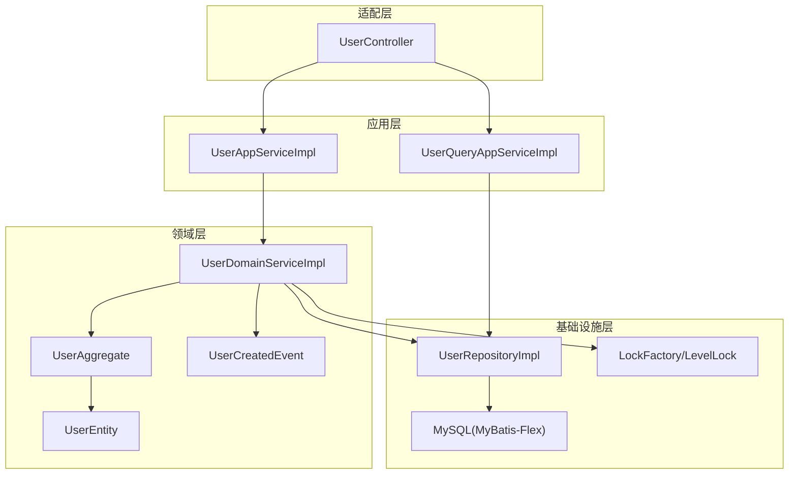
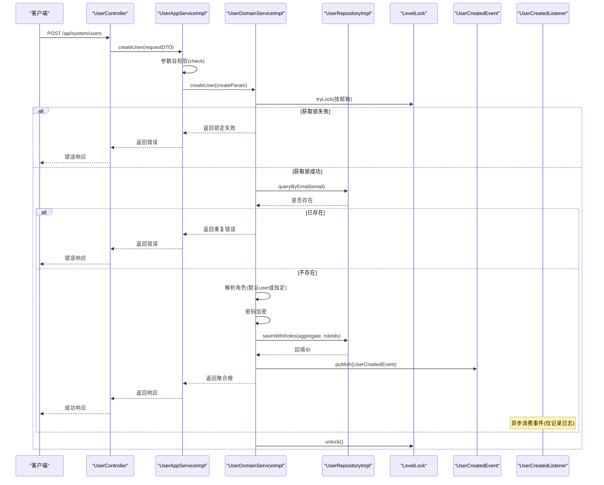
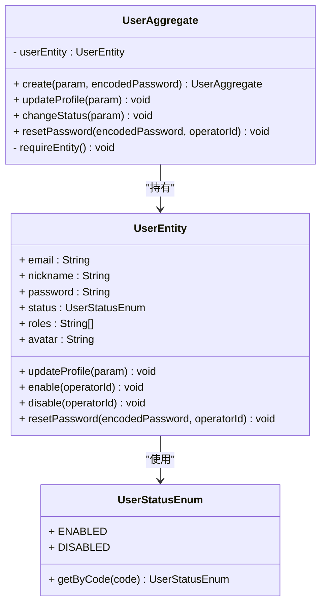
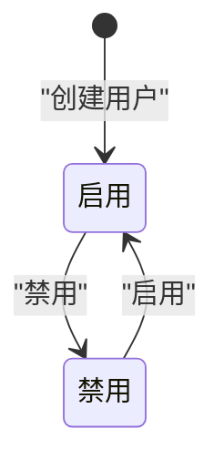
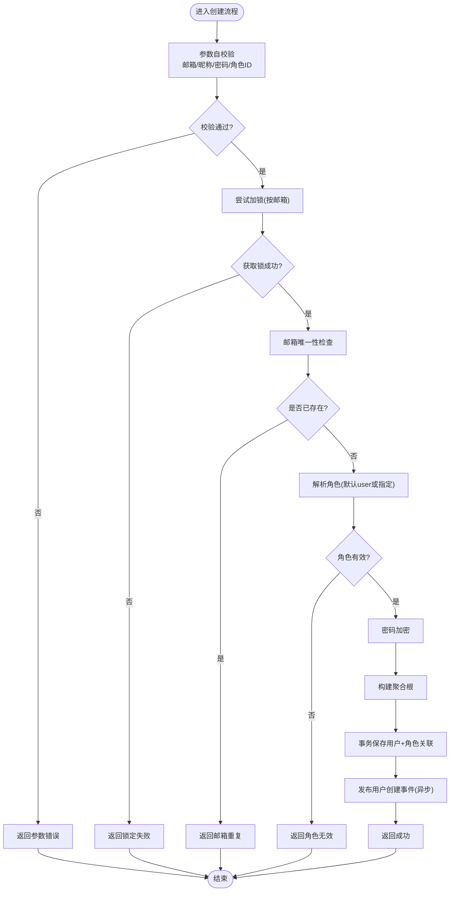
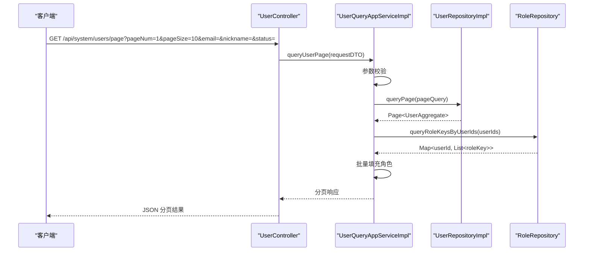
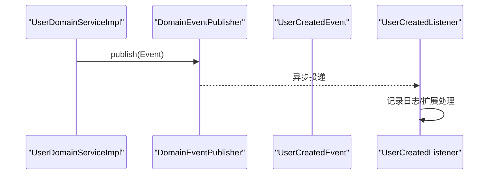
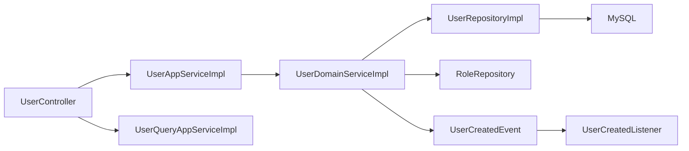

# 用户管理模块

<cite>
**本文引用的文件**   
- [UserAggregate.java](file://src/main/java/com/sunnao/spring/ddd/template/domain/system/user/model/aggregate/UserAggregate.java)
- [UserEntity.java](file://src/main/java/com/sunnao/spring/ddd/template/domain/system/user/model/entity/UserEntity.java)
- [UserDomainServiceImpl.java](file://src/main/java/com/sunnao/spring/ddd/template/domain/system/user/service/UserDomainServiceImpl.java)
- [UserRepositoryImpl.java](file://src/main/java/com/sunnao/spring/ddd/template/infrastructure/system/user/repository/UserRepositoryImpl.java)
- [UserController.java](file://src/main/java/com/sunnao/spring/ddd/template/adaptor/system/user/input/UserController.java)
- [UserAppServiceImpl.java](file://src/main/java/com/sunnao/spring/ddd/template/application/system/user/scenario/UserAppServiceImpl.java)
- [UserQueryAppServiceImpl.java](file://src/main/java/com/sunnao/spring/ddd/template/application/system/user/scenario/UserQueryAppServiceImpl.java)
- [UserCreatedEvent.java](file://src/main/java/com/sunnao/spring/ddd/template/domain/system/user/event/UserCreatedEvent.java)
- [UserCreatedListener.java](file://src/main/java/com/sunnao/spring/ddd/template/application/system/user/listener/UserCreatedListener.java)
- [UserStatusEnum.java](file://src/main/java/com/sunnao/spring/ddd/template/client/system/user/enums/UserStatusEnum.java)
- [CreateUserRequestDTO.java](file://src/main/java/com/sunnao/spring/ddd/template/client/system/user/req/CreateUserRequestDTO.java)
- [UpdateUserRequestDTO.java](file://src/main/java/com/sunnao/spring/ddd/template/client/system/user/req/UpdateUserRequestDTO.java)
- [ChangeUserStatusRequestDTO.java](file://src/main/java/com/sunnao/spring/ddd/template/client/system/user/req/ChangeUserStatusRequestDTO.java)
- [DeleteUserRequestDTO.java](file://src/main/java/com/sunnao/spring/ddd/template/client/system/user/req/DeleteUserRequestDTO.java)
- [GetUserDetailRequestDTO.java](file://src/main/java/com/sunnao/spring/ddd/template/client/system/user/req/GetUserDetailRequestDTO.java)
- [QueryUserPageRequestDTO.java](file://src/main/java/com/sunnao/spring/ddd/template/client/system/user/req/QueryUserPageRequestDTO.java)
</cite>

## 目录
1. [简介](#简介)
2. [项目结构](#项目结构)
3. [核心组件](#核心组件)
4. [架构总览](#架构总览)
5. [详细组件分析](#详细组件分析)
6. [依赖关系分析](#依赖关系分析)
7. [性能考虑](#性能考虑)
8. [故障排查指南](#故障排查指南)
9. [结论](#结论)
10. [附录：API 接口文档与使用示例](#附录api-接口文档与使用示例)

## 简介
本章节面向“用户管理模块”，围绕 DDD 分层与聚合根设计，系统阐述用户实体的生命周期、状态机（启用/禁用）、业务规则校验、CRUD 全流程（从 HTTP 到持久化）、分页查询与优化策略、领域事件机制以及数据模型设计与约束。文档同时提供完整的 API 接口说明与使用示例，便于快速集成与排障。

## 项目结构
用户管理模块遵循 DDD 分层：
- 适配层（Adaptor）：HTTP 控制器接收请求并委派应用服务
- 应用层（Application）：场景编排、参数校验、调用领域服务、组装响应
- 领域层（Domain）：聚合根与实体承载核心业务逻辑与不变式
- 基础设施层（Infrastructure）：仓储实现、数据库访问、锁与事件发布等横切能力

图表来源
- [UserController.java:1-115](file://src/main/java/com/sunnao/spring/ddd/template/adaptor/system/user/input/UserController.java#L1-L115)
- [UserAppServiceImpl.java:1-163](file://src/main/java/com/sunnao/spring/ddd/template/application/system/user/scenario/UserAppServiceImpl.java#L1-L163)
- [UserQueryAppServiceImpl.java:1-104](file://src/main/java/com/sunnao/spring/ddd/template/application/system/user/scenario/UserQueryAppServiceImpl.java#L1-L104)
- [UserDomainServiceImpl.java:1-204](file://src/main/java/com/sunnao/spring/ddd/template/domain/system/user/service/UserDomainServiceImpl.java#L1-L204)
- [UserAggregate.java:1-113](file://src/main/java/com/sunnao/spring/ddd/template/domain/system/user/model/aggregate/UserAggregate.java#L1-L113)
- [UserEntity.java:1-119](file://src/main/java/com/sunnao/spring/ddd/template/domain/system/user/model/entity/UserEntity.java#L1-L119)
- [UserRepositoryImpl.java:1-191](file://src/main/java/com/sunnao/spring/ddd/template/infrastructure/system/user/repository/UserRepositoryImpl.java#L1-L191)
- [UserCreatedEvent.java:1-39](file://src/main/java/com/sunnao/spring/ddd/template/domain/system/user/event/UserCreatedEvent.java#L1-L39)

章节来源
- [UserController.java:1-115](file://src/main/java/com/sunnao/spring/ddd/template/adaptor/system/user/input/UserController.java#L1-L115)
- [UserAppServiceImpl.java:1-163](file://src/main/java/com/sunnao/spring/ddd/template/application/system/user/scenario/UserAppServiceImpl.java#L1-L163)
- [UserQueryAppServiceImpl.java:1-104](file://src/main/java/com/sunnao/spring/ddd/template/application/system/user/scenario/UserQueryAppServiceImpl.java#L1-L104)
- [UserDomainServiceImpl.java:1-204](file://src/main/java/com/sunnao/spring/ddd/template/domain/system/user/service/UserDomainServiceImpl.java#L1-L204)
- [UserAggregate.java:1-113](file://src/main/java/com/sunnao/spring/ddd/template/domain/system/user/model/aggregate/UserAggregate.java#L1-L113)
- [UserEntity.java:1-119](file://src/main/java/com/sunnao/spring/ddd/template/domain/system/user/model/entity/UserEntity.java#L1-L119)
- [UserRepositoryImpl.java:1-191](file://src/main/java/com/sunnao/spring/ddd/template/infrastructure/system/user/repository/UserRepositoryImpl.java#L1-L191)
- [UserCreatedEvent.java:1-39](file://src/main/java/com/sunnao/spring/ddd/template/domain/system/user/event/UserCreatedEvent.java#L1-L39)

## 核心组件
- 用户聚合根 UserAggregate：对外暴露创建、更新资料、变更状态、重置密码等一致性边界方法，内部持有 UserEntity，禁止外部直接修改实体属性。
- 用户实体 UserEntity：承载用户属性与状态变更逻辑，包含启用/禁用、资料更新、密码重置等方法，维护状态不变式。
- 领域服务 UserDomainServiceImpl：写模式编排，负责加锁、加载聚合根、执行业务、持久化、发布事件与异常处理。
- 仓储实现 UserRepositoryImpl：PO 与聚合根的转换、分页查询、事务性组合写入/删除（含角色关联）。
- 应用服务 UserAppServiceImpl / UserQueryAppServiceImpl：读/写场景编排、参数校验、RBAC 角色填充、强制下线会话等。
- 领域事件 UserCreatedEvent 与监听器 UserCreatedListener：异步消费用户创建事件，扩展点用于邮件、审计等。

章节来源
- [UserAggregate.java:1-113](file://src/main/java/com/sunnao/spring/ddd/template/domain/system/user/model/aggregate/UserAggregate.java#L1-L113)
- [UserEntity.java:1-119](file://src/main/java/com/sunnao/spring/ddd/template/domain/system/user/model/entity/UserEntity.java#L1-L119)
- [UserDomainServiceImpl.java:1-204](file://src/main/java/com/sunnao/spring/ddd/template/domain/system/user/service/UserDomainServiceImpl.java#L1-L204)
- [UserRepositoryImpl.java:1-191](file://src/main/java/com/sunnao/spring/ddd/template/infrastructure/system/user/repository/UserRepositoryImpl.java#L1-L191)
- [UserAppServiceImpl.java:1-163](file://src/main/java/com/sunnao/spring/ddd/template/application/system/user/scenario/UserAppServiceImpl.java#L1-L163)
- [UserQueryAppServiceImpl.java:1-104](file://src/main/java/com/sunnao/spring/ddd/template/application/system/user/scenario/UserQueryAppServiceImpl.java#L1-L104)
- [UserCreatedEvent.java:1-39](file://src/main/java/com/sunnao/spring/ddd/template/domain/system/user/event/UserCreatedEvent.java#L1-L39)
- [UserCreatedListener.java:1-31](file://src/main/java/com/sunnao/spring/ddd/template/application/system/user/listener/UserCreatedListener.java#L1-L31)

## 架构总览
下图展示一次“创建用户”的端到端流程，涵盖权限校验、参数校验、加锁、唯一性检查、默认角色解析、密码加密、聚合根构建、持久化、事件发布与响应组装。

图表来源
- [UserController.java:35-41](file://src/main/java/com/sunnao/spring/ddd/template/adaptor/system/user/input/UserController.java#L35-L41)
- [UserAppServiceImpl.java:40-62](file://src/main/java/com/sunnao/spring/ddd/template/application/system/user/scenario/UserAppServiceImpl.java#L40-L62)
- [UserDomainServiceImpl.java:46-89](file://src/main/java/com/sunnao/spring/ddd/template/domain/system/user/service/UserDomainServiceImpl.java#L46-L89)
- [UserRepositoryImpl.java:119-125](file://src/main/java/com/sunnao/spring/ddd/template/infrastructure/system/user/repository/UserRepositoryImpl.java#L119-L125)
- [UserCreatedEvent.java:1-39](file://src/main/java/com/sunnao/spring/ddd/template/domain/system/user/event/UserCreatedEvent.java#L1-L39)
- [UserCreatedListener.java:18-30](file://src/main/java/com/sunnao/spring/ddd/template/application/system/user/listener/UserCreatedListener.java#L18-L30)

## 详细组件分析

### 用户聚合根与实体（类图）

图表来源
- [UserAggregate.java:1-113](file://src/main/java/com/sunnao/spring/ddd/template/domain/system/user/model/aggregate/UserAggregate.java#L1-L113)
- [UserEntity.java:1-119](file://src/main/java/com/sunnao/spring/ddd/template/domain/system/user/model/entity/UserEntity.java#L1-L119)
- [UserStatusEnum.java:1-52](file://src/main/java/com/sunnao/spring/ddd/template/client/system/user/enums/UserStatusEnum.java#L1-L52)

章节来源
- [UserAggregate.java:1-113](file://src/main/java/com/sunnao/spring/ddd/template/domain/system/user/model/aggregate/UserAggregate.java#L1-L113)
- [UserEntity.java:1-119](file://src/main/java/com/sunnao/spring/ddd/template/domain/system/user/model/entity/UserEntity.java#L1-L119)
- [UserStatusEnum.java:1-52](file://src/main/java/com/sunnao/spring/ddd/template/client/system/user/enums/UserStatusEnum.java#L1-L52)

### 用户状态机（启用/禁用）
- 初始状态：创建时默认为“启用”。
- 状态流转：
  - 启用：仅允许从“禁用”切换到“启用”，否则抛出状态不合法异常。
  - 禁用：仅允许从“启用”切换到“禁用”，否则抛出状态不合法异常。
- 操作人追踪：每次状态变更都会记录操作人。

图表来源
- [UserEntity.java:82-102](file://src/main/java/com/sunnao/spring/ddd/template/domain/system/user/model/entity/UserEntity.java#L82-L102)
- [UserAggregate.java:83-93](file://src/main/java/com/sunnao/spring/ddd/template/domain/system/user/model/aggregate/UserAggregate.java#L83-L93)

章节来源
- [UserEntity.java:82-102](file://src/main/java/com/sunnao/spring/ddd/template/domain/system/user/model/entity/UserEntity.java#L82-L102)
- [UserAggregate.java:83-93](file://src/main/java/com/sunnao/spring/ddd/template/domain/system/user/model/aggregate/UserAggregate.java#L83-L93)

### 用户创建流程（算法流程图）

图表来源
- [UserAppServiceImpl.java:40-62](file://src/main/java/com/sunnao/spring/ddd/template/application/system/user/scenario/UserAppServiceImpl.java#L40-L62)
- [UserDomainServiceImpl.java:46-89](file://src/main/java/com/sunnao/spring/ddd/template/domain/system/user/service/UserDomainServiceImpl.java#L46-L89)
- [UserRepositoryImpl.java:119-125](file://src/main/java/com/sunnao/spring/ddd/template/infrastructure/system/user/repository/UserRepositoryImpl.java#L119-L125)
- [UserCreatedEvent.java:1-39](file://src/main/java/com/sunnao/spring/ddd/template/domain/system/user/event/UserCreatedEvent.java#L1-L39)

章节来源
- [UserAppServiceImpl.java:40-62](file://src/main/java/com/sunnao/spring/ddd/template/application/system/user/scenario/UserAppServiceImpl.java#L40-L62)
- [UserDomainServiceImpl.java:46-89](file://src/main/java/com/sunnao/spring/ddd/template/domain/system/user/service/UserDomainServiceImpl.java#L46-L89)
- [UserRepositoryImpl.java:119-125](file://src/main/java/com/sunnao/spring/ddd/template/infrastructure/system/user/repository/UserRepositoryImpl.java#L119-L125)
- [UserCreatedEvent.java:1-39](file://src/main/java/com/sunnao/spring/ddd/template/domain/system/user/event/UserCreatedEvent.java#L1-L39)

### 用户查询与分页（读模式）
- 详情查询：根据用户ID查询聚合根，再批量填充角色标识后转换为响应 DTO。
- 分页查询：
  - 将 pageNum/pageSize 转换为 startIndex/pageSize；
  - 使用 MyBatis-Flex 分页查询 PO 列表，转换为聚合根集合；
  - 批量填充角色标识，避免 N+1 查询；
  - 封装为 Spring Data Page 返回。

图表来源
- [UserController.java:99-113](file://src/main/java/com/sunnao/spring/ddd/template/adaptor/system/user/input/UserController.java#L99-L113)
- [UserQueryAppServiceImpl.java:68-102](file://src/main/java/com/sunnao/spring/ddd/template/application/system/user/scenario/UserQueryAppServiceImpl.java#L68-L102)
- [UserRepositoryImpl.java:73-87](file://src/main/java/com/sunnao/spring/ddd/template/infrastructure/system/user/repository/UserRepositoryImpl.java#L73-L87)

章节来源
- [UserQueryAppServiceImpl.java:68-102](file://src/main/java/com/sunnao/spring/ddd/template/application/system/user/scenario/UserQueryAppServiceImpl.java#L68-L102)
- [UserRepositoryImpl.java:73-87](file://src/main/java/com/sunnao/spring/ddd/template/infrastructure/system/user/repository/UserRepositoryImpl.java#L73-L87)

### 用户事件机制（创建事件）
- 事件定义：UserCreatedEvent 携带 userId、email、nickname、operatorId。
- 发布时机：在用户创建成功后由领域服务发布。
- 监听处理：UserCreatedListener 异步消费，当前示例仅记录日志，可扩展为发送邮件、初始化配置等。

图表来源
- [UserDomainServiceImpl.java:75-78](file://src/main/java/com/sunnao/spring/ddd/template/domain/system/user/service/UserDomainServiceImpl.java#L75-L78)
- [UserCreatedEvent.java:1-39](file://src/main/java/com/sunnao/spring/ddd/template/domain/system/user/event/UserCreatedEvent.java#L1-L39)
- [UserCreatedListener.java:18-30](file://src/main/java/com/sunnao/spring/ddd/template/application/system/user/listener/UserCreatedListener.java#L18-L30)

章节来源
- [UserDomainServiceImpl.java:75-78](file://src/main/java/com/sunnao/spring/ddd/template/domain/system/user/service/UserDomainServiceImpl.java#L75-L78)
- [UserCreatedEvent.java:1-39](file://src/main/java/com/sunnao/spring/ddd/template/domain/system/user/event/UserCreatedEvent.java#L1-L39)
- [UserCreatedListener.java:18-30](file://src/main/java/com/sunnao/spring/ddd/template/application/system/user/listener/UserCreatedListener.java#L18-L30)

## 依赖关系分析
- 耦合与内聚：
  - 聚合根与实体高内聚，外部通过聚合根方法访问，保证不变式。
  - 领域服务依赖仓储与角色仓储，完成跨聚合协作（用户-角色）。
  - 应用服务依赖领域服务与 Assembler，屏蔽技术细节。
- 外部依赖：
  - 锁：基于 LockFactory/LevelLock 实现分布式/进程级锁。
  - 事件：基于 Spring 事件机制异步消费。
  - 数据库：MyBatis-Flex 分页与条件构造。

图表来源
- [UserController.java:1-115](file://src/main/java/com/sunnao/spring/ddd/template/adaptor/system/user/input/UserController.java#L1-L115)
- [UserAppServiceImpl.java:1-163](file://src/main/java/com/sunnao/spring/ddd/template/application/system/user/scenario/UserAppServiceImpl.java#L1-L163)
- [UserQueryAppServiceImpl.java:1-104](file://src/main/java/com/sunnao/spring/ddd/template/application/system/user/scenario/UserQueryAppServiceImpl.java#L1-L104)
- [UserDomainServiceImpl.java:1-204](file://src/main/java/com/sunnao/spring/ddd/template/domain/system/user/service/UserDomainServiceImpl.java#L1-L204)
- [UserRepositoryImpl.java:1-191](file://src/main/java/com/sunnao/spring/ddd/template/infrastructure/system/user/repository/UserRepositoryImpl.java#L1-L191)
- [UserCreatedEvent.java:1-39](file://src/main/java/com/sunnao/spring/ddd/template/domain/system/user/event/UserCreatedEvent.java#L1-L39)
- [UserCreatedListener.java:1-31](file://src/main/java/com/sunnao/spring/ddd/template/application/system/user/listener/UserCreatedListener.java#L1-L31)

章节来源
- [UserController.java:1-115](file://src/main/java/com/sunnao/spring/ddd/template/adaptor/system/user/input/UserController.java#L1-L115)
- [UserAppServiceImpl.java:1-163](file://src/main/java/com/sunnao/spring/ddd/template/application/system/user/scenario/UserAppServiceImpl.java#L1-L163)
- [UserQueryAppServiceImpl.java:1-104](file://src/main/java/com/sunnao/spring/ddd/template/application/system/user/scenario/UserQueryAppServiceImpl.java#L1-L104)
- [UserDomainServiceImpl.java:1-204](file://src/main/java/com/sunnao/spring/ddd/template/domain/system/user/service/UserDomainServiceImpl.java#L1-L204)
- [UserRepositoryImpl.java:1-191](file://src/main/java/com/sunnao/spring/ddd/template/infrastructure/system/user/repository/UserRepositoryImpl.java#L1-L191)
- [UserCreatedEvent.java:1-39](file://src/main/java/com/sunnao/spring/ddd/template/domain/system/user/event/UserCreatedEvent.java#L1-L39)
- [UserCreatedListener.java:1-31](file://src/main/java/com/sunnao/spring/ddd/template/application/system/user/listener/UserCreatedListener.java#L1-L31)

## 性能考虑
- 并发控制：创建用户按邮箱加锁，避免重复注册；更新/状态变更/删除按用户 ID 加锁，防止竞态。
- 幂等与唯一性：创建前进行邮箱唯一性检查，结合锁保障强一致。
- 批量填充角色：分页查询后一次性拉取角色映射，避免逐条查询导致 N+1。
- 分页策略：使用 startIndex/pageSize 与 MyBatis-Flex 分页，减少内存占用。
- 异步事件：用户创建事件异步消费，降低主流程延迟。
- 事务边界：saveWithRoles/deleteWithRoles 保证用户与角色关联在同一事务中，提升数据一致性。

[本节为通用指导，无需具体文件引用]

## 故障排查指南
- 常见错误码与定位：
  - 参数错误：检查 DTO 的 check() 校验逻辑（邮箱格式、长度、必填项）。
  - 邮箱重复：确认唯一性检查与锁是否生效。
  - 角色无效：检查 resolveRoles 逻辑与默认角色是否存在。
  - 状态非法：确认目标状态与当前状态是否允许流转。
  - 锁定失败：检查锁工厂配置与锁键生成是否正确。
  - 数据库异常：查看仓储层的异常包装与日志。
- 建议排查步骤：
  - 核对请求参数是否符合 DTO 校验规则。
  - 观察领域服务日志输出，定位异常分支。
  - 检查仓储层 SQL 与分页参数。
  - 验证事件监听器是否被触发（异步线程池配置）。

章节来源
- [CreateUserRequestDTO.java:54-71](file://src/main/java/com/sunnao/spring/ddd/template/client/system/user/req/CreateUserRequestDTO.java#L54-L71)
- [UpdateUserRequestDTO.java:39-49](file://src/main/java/com/sunnao/spring/ddd/template/client/system/user/req/UpdateUserRequestDTO.java#L39-L49)
- [ChangeUserStatusRequestDTO.java:35-43](file://src/main/java/com/sunnao/spring/ddd/template/client/system/user/req/ChangeUserStatusRequestDTO.java#L35-L43)
- [QueryUserPageRequestDTO.java:50-61](file://src/main/java/com/sunnao/spring/ddd/template/client/system/user/req/QueryUserPageRequestDTO.java#L50-L61)
- [UserDomainServiceImpl.java:80-88](file://src/main/java/com/sunnao/spring/ddd/template/domain/system/user/service/UserDomainServiceImpl.java#L80-L88)
- [UserRepositoryImpl.java:51-87](file://src/main/java/com/sunnao/spring/ddd/template/infrastructure/system/user/repository/UserRepositoryImpl.java#L51-L87)

## 结论
用户管理模块以聚合根为核心，严格封装状态机与业务规则，配合应用层场景编排与仓储事务性组合操作，实现了高内聚、低耦合的可维护架构。通过锁、唯一性校验、批量填充与异步事件等手段，兼顾了正确性与性能。API 层职责清晰，便于扩展与维护。

[本节为总结，无需具体文件引用]

## 附录：API 接口文档与使用示例

### 接口概览
- 基础路径：/api/system/users
- 鉴权要求：
  - 查询接口需权限 system:user:read
  - 写操作接口需权限 system:user:write

### 接口清单与示例

- 创建用户
  - 方法：POST /api/system/users
  - 请求体：CreateUserRequestDTO
    - 字段：email、nickname、password、avatar、roleIds
    - 校验：邮箱非空且格式正确；昵称非空；密码长度不小于6；角色ID非空值
  - 响应：CreateUserResponseDTO（包含 userId）
  - 行为：参数校验 → 领域服务创建（加锁、唯一性、默认角色、加密、持久化、事件发布）→ 返回成功

- 修改用户资料
  - 方法：PUT /api/system/users/{id}
  - 请求体：UpdateUserRequestDTO
    - 字段：userId、nickname、avatar
    - 校验：userId 必填；nickname 与 avatar 不能同时为空
  - 响应：UpdateUserResponseDTO（包含 userId）
  - 行为：参数校验 → 领域服务更新资料 → 返回成功

- 变更用户状态（启用/禁用）
  - 方法：PUT /api/system/users/{id}/status
  - 请求体：ChangeUserStatusRequestDTO
    - 字段：userId、status（1-启用，0-禁用）
    - 校验：userId 必填；status 取值合法
  - 响应：ChangeUserStatusResponseDTO（包含 userId、status）
  - 行为：参数校验 → 领域服务变更状态 → 若禁用则强制下线该用户全部会话 → 返回成功

- 删除用户（逻辑删除）
  - 方法：DELETE /api/system/users/{id}
  - 请求体：DeleteUserRequestDTO
    - 字段：userId
    - 校验：userId 必填
  - 响应：DeleteUserResponseDTO（包含 userId）
  - 行为：参数校验 → 领域服务逻辑删除并清理角色关联 → 强制下线该用户全部会话 → 返回成功

- 获取用户详情
  - 方法：GET /api/system/users/{id}
  - 请求体：GetUserDetailRequestDTO
    - 字段：userId
    - 校验：userId 必填
  - 响应：GetUserDetailResponseDTO（包含用户信息与角色标识）
  - 行为：参数校验 → 查询聚合根 → 批量填充角色标识 → 返回成功

- 分页查询用户列表
  - 方法：GET /api/system/users/page
  - 查询参数：pageNum、pageSize、email、nickname、status
    - 校验：pageNum≥1；pageSize∈[1,100]；status 取值合法
  - 响应：QueryUserPageResponseDTO（分页数据与总数）
  - 行为：参数校验 → 分页查询 → 批量填充角色标识 → 返回成功

章节来源
- [UserController.java:35-113](file://src/main/java/com/sunnao/spring/ddd/template/adaptor/system/user/input/UserController.java#L35-L113)
- [CreateUserRequestDTO.java:1-73](file://src/main/java/com/sunnao/spring/ddd/template/client/system/user/req/CreateUserRequestDTO.java#L1-L73)
- [UpdateUserRequestDTO.java:1-51](file://src/main/java/com/sunnao/spring/ddd/template/client/system/user/req/UpdateUserRequestDTO.java#L1-L51)
- [ChangeUserStatusRequestDTO.java:1-45](file://src/main/java/com/sunnao/spring/ddd/template/client/system/user/req/ChangeUserStatusRequestDTO.java#L1-L45)
- [DeleteUserRequestDTO.java:1-36](file://src/main/java/com/sunnao/spring/ddd/template/client/system/user/req/DeleteUserRequestDTO.java#L1-L36)
- [GetUserDetailRequestDTO.java:1-36](file://src/main/java/com/sunnao/spring/ddd/template/client/system/user/req/GetUserDetailRequestDTO.java#L1-L36)
- [QueryUserPageRequestDTO.java:1-63](file://src/main/java/com/sunnao/spring/ddd/template/client/system/user/req/QueryUserPageRequestDTO.java#L1-L63)