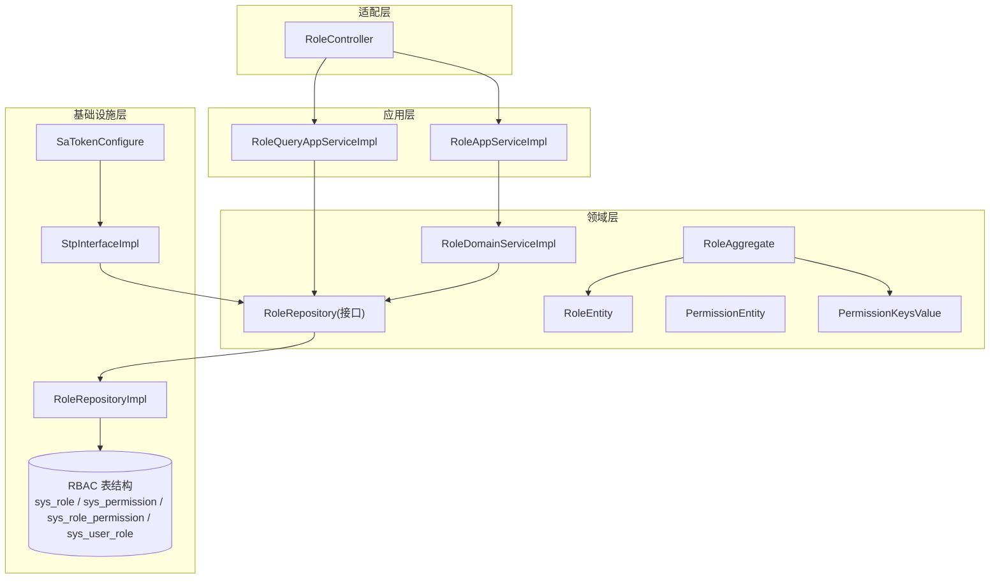
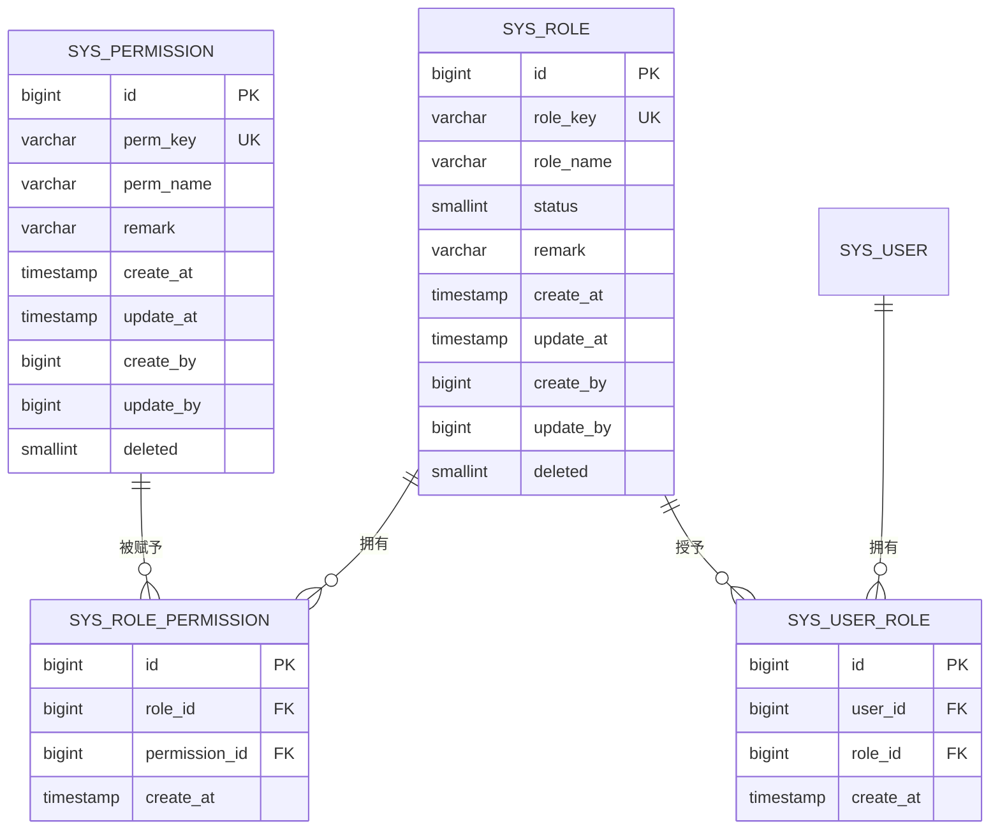
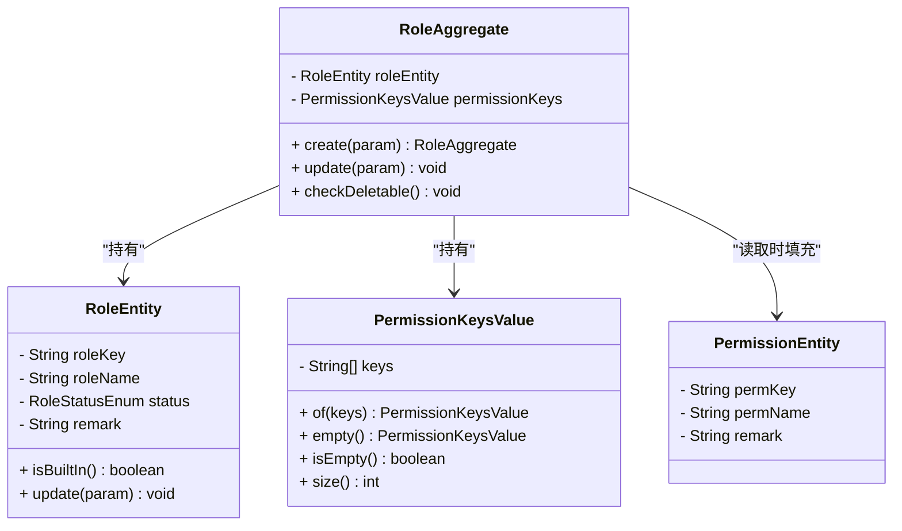
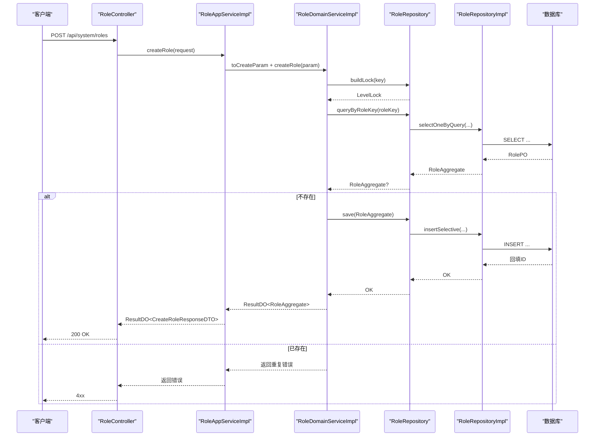
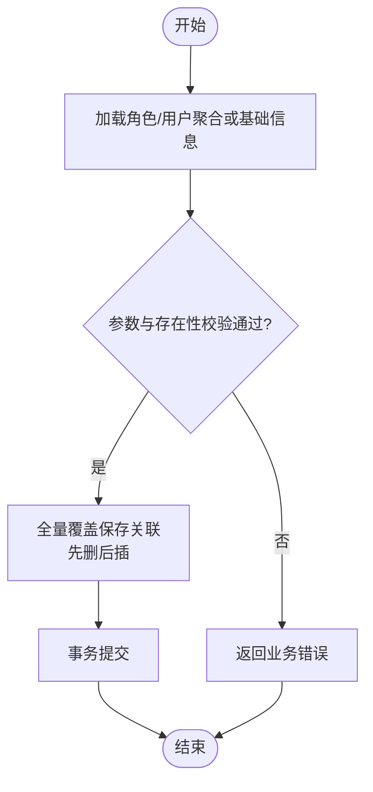
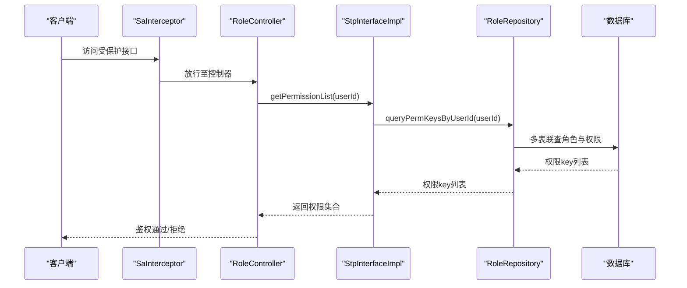
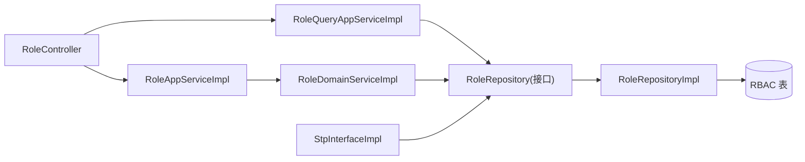

# 角色权限管理模块

<cite>
**本文引用的文件**   
- [RoleAggregate.java](file://src/main/java/com/sunnao/spring/ddd/template/domain/system/role/model/aggregate/RoleAggregate.java)
- [RoleEntity.java](file://src/main/java/com/sunnao/spring/ddd/template/domain/system/role/model/entity/RoleEntity.java)
- [PermissionEntity.java](file://src/main/java/com/sunnao/spring/ddd/template/domain/system/role/model/entity/PermissionEntity.java)
- [PermissionKeysValue.java](file://src/main/java/com/sunnao/spring/ddd/template/domain/system/role/model/value/PermissionKeysValue.java)
- [RoleRepository.java](file://src/main/java/com/sunnao/spring/ddd/template/domain/system/role/repository/RoleRepository.java)
- [RoleRepositoryImpl.java](file://src/main/java/com/sunnao/spring/ddd/template/infrastructure/system/role/repository/RoleRepositoryImpl.java)
- [RoleDomainServiceImpl.java](file://src/main/java/com/sunnao/spring/ddd/template/domain/system/role/service/RoleDomainServiceImpl.java)
- [RoleAppServiceImpl.java](file://src/main/java/com/sunnao/spring/ddd/template/application/system/role/scenario/RoleAppServiceImpl.java)
- [RoleQueryAppServiceImpl.java](file://src/main/java/com/sunnao/spring/ddd/template/application/system/role/scenario/RoleQueryAppServiceImpl.java)
- [RoleController.java](file://src/main/java/com/sunnao/spring/ddd/template/adaptor/system/role/input/RoleController.java)
- [StpInterfaceImpl.java](file://src/main/java/com/sunnao/spring/ddd/template/infrastructure/auth/StpInterfaceImpl.java)
- [SaTokenConfigure.java](file://src/main/java/com/sunnao/spring/ddd/template/common/config/SaTokenConfigure.java)
- [V2__init_rbac.sql](file://src/main/resources/db/migration/V2__init_rbac.sql)
- [AssignPermissionRequestDTO.java](file://src/main/java/com/sunnao/spring/ddd/template/client/system/role/req/AssignPermissionRequestDTO.java)
- [AssignUserRoleRequestDTO.java](file://src/main/java/com/sunnao/spring/ddd/template/client/system/role/req/AssignUserRoleRequestDTO.java)
</cite>

## 目录
1. [简介](#简介)
2. [项目结构](#项目结构)
3. [核心组件](#核心组件)
4. [架构总览](#架构总览)
5. [详细组件分析](#详细组件分析)
6. [依赖关系分析](#依赖关系分析)
7. [性能与一致性](#性能与一致性)
8. [故障排查指南](#故障排查指南)
9. [结论](#结论)
10. [附录](#附录)

## 简介
本模块基于 DDD 分层与 RBAC（基于角色的访问控制）模型，提供角色、权限、用户-角色-权限关系的完整实现。通过聚合根封装领域规则，仓储负责持久化与关联维护，应用层编排场景，适配层暴露 HTTP API；同时与 Sa-Token 集成，完成方法级鉴权与数据级权限过滤的支撑能力。

## 项目结构
角色权限相关代码按 DDD 分层组织：
- 适配层（adaptor）：HTTP 控制器，接收请求并调用应用服务
- 应用层（application）：场景编排、参数校验、DTO 转换
- 领域层（domain）：聚合根、实体、值对象、领域服务、仓储接口
- 基础设施层（infrastructure）：仓储实现、数据库映射、锁工厂、认证对接

图表来源
- [RoleController.java](file://src/main/java/com/sunnao/spring/ddd/template/adaptor/system/role/input/RoleController.java)
- [RoleAppServiceImpl.java](file://src/main/java/com/sunnao/spring/ddd/template/application/system/role/scenario/RoleAppServiceImpl.java)
- [RoleQueryAppServiceImpl.java](file://src/main/java/com/sunnao/spring/ddd/template/application/system/role/scenario/RoleQueryAppServiceImpl.java)
- [RoleDomainServiceImpl.java](file://src/main/java/com/sunnao/spring/ddd/template/domain/system/role/service/RoleDomainServiceImpl.java)
- [RoleRepository.java](file://src/main/java/com/sunnao/spring/ddd/template/domain/system/role/repository/RoleRepository.java)
- [RoleRepositoryImpl.java](file://src/main/java/com/sunnao/spring/ddd/template/infrastructure/system/role/repository/RoleRepositoryImpl.java)
- [StpInterfaceImpl.java](file://src/main/java/com/sunnao/spring/ddd/template/infrastructure/auth/StpInterfaceImpl.java)
- [SaTokenConfigure.java](file://src/main/java/com/sunnao/spring/ddd/template/common/config/SaTokenConfigure.java)
- [V2__init_rbac.sql](file://src/main/resources/db/migration/V2__init_rbac.sql)

章节来源
- [RoleController.java](file://src/main/java/com/sunnao/spring/ddd/template/adaptor/system/role/input/RoleController.java)
- [RoleAppServiceImpl.java](file://src/main/java/com/sunnao/spring/ddd/template/application/system/role/scenario/RoleAppServiceImpl.java)
- [RoleQueryAppServiceImpl.java](file://src/main/java/com/sunnao/spring/ddd/template/application/system/role/scenario/RoleQueryAppServiceImpl.java)
- [RoleDomainServiceImpl.java](file://src/main/java/com/sunnao/spring/ddd/template/domain/system/role/service/RoleDomainServiceImpl.java)
- [RoleRepository.java](file://src/main/java/com/sunnao/spring/ddd/template/domain/system/role/repository/RoleRepository.java)
- [RoleRepositoryImpl.java](file://src/main/java/com/sunnao/spring/ddd/template/infrastructure/system/role/repository/RoleRepositoryImpl.java)
- [StpInterfaceImpl.java](file://src/main/java/com/sunnao/spring/ddd/template/infrastructure/auth/StpInterfaceImpl.java)
- [SaTokenConfigure.java](file://src/main/java/com/sunnao/spring/ddd/template/common/config/SaTokenConfigure.java)
- [V2__init_rbac.sql](file://src/main/resources/db/migration/V2__init_rbac.sql)

## 核心组件
- 角色聚合根 RoleAggregate：对外暴露创建、更新、删除前校验等聚合行为，持有角色实体与权限 key 集合值对象，保证领域不变式。
- 角色实体 RoleEntity：承载角色属性与状态变更逻辑，内置角色保护策略（不可删除、管理员禁用限制）。
- 权限实体 PermissionEntity：只读数据载体，配合迁移脚本维护种子数据，作为分配权限时的存在性校验依据。
- 权限键集合值对象 PermissionKeysValue：封装角色拥有的权限 key 列表，不可变。
- 角色仓储接口 RoleRepository：定义聚合根 CRUD、角色-权限/用户-角色关联维护、按用户维度查询角色与权限标识。
- 角色仓储实现 RoleRepositoryImpl：MyBatis-Flex 实现，负责 PO 与领域对象转换、全量覆盖保存、分页查询、填充权限 key 集合等。
- 领域服务 RoleDomainServiceImpl：写模式编排，加锁→加载聚合根→执行业务→持久化→释放锁，统一异常处理。
- 应用服务 RoleAppServiceImpl/RoleQueryAppServiceImpl：场景编排、参数自校验、DTO↔Param 转换、响应组装。
- 控制器 RoleController：HTTP 入口，注解鉴权，操作日志记录。
- 认证对接 StpInterfaceImpl：为 Sa-Token 提供用户角色与权限点集合。
- 安全配置 SaTokenConfigure：全局登录拦截与路由放行策略。

章节来源
- [RoleAggregate.java](file://src/main/java/com/sunnao/spring/ddd/template/domain/system/role/model/aggregate/RoleAggregate.java)
- [RoleEntity.java](file://src/main/java/com/sunnao/spring/ddd/template/domain/system/role/model/entity/RoleEntity.java)
- [PermissionEntity.java](file://src/main/java/com/sunnao/spring/ddd/template/domain/system/role/model/entity/PermissionEntity.java)
- [PermissionKeysValue.java](file://src/main/java/com/sunnao/spring/ddd/template/domain/system/role/model/value/PermissionKeysValue.java)
- [RoleRepository.java](file://src/main/java/com/sunnao/spring/ddd/template/domain/system/role/repository/RoleRepository.java)
- [RoleRepositoryImpl.java](file://src/main/java/com/sunnao/spring/ddd/template/infrastructure/system/role/repository/RoleRepositoryImpl.java)
- [RoleDomainServiceImpl.java](file://src/main/java/com/sunnao/spring/ddd/template/domain/system/role/service/RoleDomainServiceImpl.java)
- [RoleAppServiceImpl.java](file://src/main/java/com/sunnao/spring/ddd/template/application/system/role/scenario/RoleAppServiceImpl.java)
- [RoleQueryAppServiceImpl.java](file://src/main/java/com/sunnao/spring/ddd/template/application/system/role/scenario/RoleQueryAppServiceImpl.java)
- [RoleController.java](file://src/main/java/com/sunnao/spring/ddd/template/adaptor/system/role/input/RoleController.java)
- [StpInterfaceImpl.java](file://src/main/java/com/sunnao/spring/ddd/template/infrastructure/auth/StpInterfaceImpl.java)
- [SaTokenConfigure.java](file://src/main/java/com/sunnao/spring/ddd/template/common/config/SaTokenConfigure.java)

## 架构总览
RBAC 数据模型与运行时鉴权链路如下：

图表来源
- [V2__init_rbac.sql](file://src/main/resources/db/migration/V2__init_rbac.sql)

## 详细组件分析

### 角色聚合根与实体设计
- 聚合根 RoleAggregate 提供 create/update/checkDeletable 等方法，内部委托 RoleEntity 执行具体变更，并通过 PermissionKeysValue 表达“角色-权限”的语义集合。
- RoleEntity 内置内置角色常量集，禁止删除 admin/user，且禁止禁用 admin；update 方法对空参组合进行校验，确保至少修改一项有效字段。
- PermissionKeysValue 是不可变值对象，封装 keys 列表并提供 isEmpty/size 等便捷方法。

图表来源
- [RoleAggregate.java](file://src/main/java/com/sunnao/spring/ddd/template/domain/system/role/model/aggregate/RoleAggregate.java)
- [RoleEntity.java](file://src/main/java/com/sunnao/spring/ddd/template/domain/system/role/model/entity/RoleEntity.java)
- [PermissionEntity.java](file://src/main/java/com/sunnao/spring/ddd/template/domain/system/role/model/entity/PermissionEntity.java)
- [PermissionKeysValue.java](file://src/main/java/com/sunnao/spring/ddd/template/domain/system/role/model/value/PermissionKeysValue.java)

章节来源
- [RoleAggregate.java](file://src/main/java/com/sunnao/spring/ddd/template/domain/system/role/model/aggregate/RoleAggregate.java)
- [RoleEntity.java](file://src/main/java/com/sunnao/spring/ddd/template/domain/system/role/model/entity/RoleEntity.java)
- [PermissionEntity.java](file://src/main/java/com/sunnao/spring/ddd/template/domain/system/role/model/entity/PermissionEntity.java)
- [PermissionKeysValue.java](file://src/main/java/com/sunnao/spring/ddd/template/domain/system/role/model/value/PermissionKeysValue.java)

### 角色 CRUD 与权限分配流程
- 创建角色：唯一性校验 → 构建聚合根 → 持久化回填 ID
- 更新角色：加载聚合根 → 执行业务更新 → 持久化
- 删除角色：内置角色保护 → 逻辑删除 → 清理关联
- 分配权限：校验权限存在性 → 全量覆盖保存
- 授予角色：校验用户与角色存在性 → 全量覆盖保存

图表来源
- [RoleController.java](file://src/main/java/com/sunnao/spring/ddd/template/adaptor/system/role/input/RoleController.java)
- [RoleAppServiceImpl.java](file://src/main/java/com/sunnao/spring/ddd/template/application/system/role/scenario/RoleAppServiceImpl.java)
- [RoleDomainServiceImpl.java](file://src/main/java/com/sunnao/spring/ddd/template/domain/system/role/service/RoleDomainServiceImpl.java)
- [RoleRepository.java](file://src/main/java/com/sunnao/spring/ddd/template/domain/system/role/repository/RoleRepository.java)
- [RoleRepositoryImpl.java](file://src/main/java/com/sunnao/spring/ddd/template/infrastructure/system/role/repository/RoleRepositoryImpl.java)

章节来源
- [RoleController.java](file://src/main/java/com/sunnao/spring/ddd/template/adaptor/system/role/input/RoleController.java)
- [RoleAppServiceImpl.java](file://src/main/java/com/sunnao/spring/ddd/template/application/system/role/scenario/RoleAppServiceImpl.java)
- [RoleDomainServiceImpl.java](file://src/main/java/com/sunnao/spring/ddd/template/domain/system/role/service/RoleDomainServiceImpl.java)
- [RoleRepository.java](file://src/main/java/com/sunnao/spring/ddd/template/domain/system/role/repository/RoleRepository.java)
- [RoleRepositoryImpl.java](file://src/main/java/com/sunnao/spring/ddd/template/infrastructure/system/role/repository/RoleRepositoryImpl.java)

### 权限分配算法与用户角色关联管理
- 权限分配：先校验权限 ID 有效性，再全量覆盖保存角色-权限关联（先删后插），保证最终一致。
- 用户授角色：先校验用户与角色存在性，再全量覆盖保存用户-角色关联（先删后插）。

图表来源
- [RoleDomainServiceImpl.java](file://src/main/java/com/sunnao/spring/ddd/template/domain/system/role/service/RoleDomainServiceImpl.java)
- [RoleRepositoryImpl.java](file://src/main/java/com/sunnao/spring/ddd/template/infrastructure/system/role/repository/RoleRepositoryImpl.java)
- [AssignPermissionRequestDTO.java](file://src/main/java/com/sunnao/spring/ddd/template/client/system/role/req/AssignPermissionRequestDTO.java)
- [AssignUserRoleRequestDTO.java](file://src/main/java/com/sunnao/spring/ddd/template/client/system/role/req/AssignUserRoleRequestDTO.java)

章节来源
- [RoleDomainServiceImpl.java](file://src/main/java/com/sunnao/spring/ddd/template/domain/system/role/service/RoleDomainServiceImpl.java)
- [RoleRepositoryImpl.java](file://src/main/java/com/sunnao/spring/ddd/template/infrastructure/system/role/repository/RoleRepositoryImpl.java)
- [AssignPermissionRequestDTO.java](file://src/main/java/com/sunnao/spring/ddd/template/client/system/role/req/AssignPermissionRequestDTO.java)
- [AssignUserRoleRequestDTO.java](file://src/main/java/com/sunnao/spring/ddd/template/client/system/role/req/AssignUserRoleRequestDTO.java)

### 权限点层级结构与继承机制
- 当前实现中，权限点以扁平化的 perm_key 表示，未显式建模父子层级与继承关系。
- 建议扩展：在 PermissionEntity 增加 parent_id 与 path 字段，结合树形查询与路径匹配实现继承；或在权限校验层实现“父节点包含子节点”的推导逻辑。

章节来源
- [PermissionEntity.java](file://src/main/java/com/sunnao/spring/ddd/template/domain/system/role/model/entity/PermissionEntity.java)
- [V2__init_rbac.sql](file://src/main/resources/db/migration/V2__init_rbac.sql)

### 权限缓存策略与一致性保证
- 现状：鉴权链路直接查询数据库，未引入本地/分布式缓存。
- 建议方案：
  - 缓存粒度：按用户维度缓存“角色标识集合”和“权限标识集合”，TTL 短周期（如 5 分钟）+ 事件失效。
  - 一致性：当发生“分配权限/授予角色/启用禁用角色”等变更时，主动失效对应用户的缓存键；必要时采用延迟双删或消息驱动失效。
  - 降级：缓存不可用时回退直查数据库，保障可用性。

章节来源
- [StpInterfaceImpl.java](file://src/main/java/com/sunnao/spring/ddd/template/infrastructure/auth/StpInterfaceImpl.java)
- [RoleRepositoryImpl.java](file://src/main/java/com/sunnao/spring/ddd/template/infrastructure/system/role/repository/RoleRepositoryImpl.java)

### 权限验证实现原理
- 方法级权限控制：
  - 控制器使用 @SaCheckPermission 注解声明所需权限点（如 system:role:read/write）。
  - Sa-Token 拦截器在请求进入时检查登录态，并在需要时调用 StpInterfaceImpl 获取用户权限集合进行匹配。
- 数据级权限过滤：
  - 可在应用层或领域层根据当前用户角色/权限对查询结果进行二次过滤（例如仅允许查看本部门数据）。
  - 也可在仓储层通过上下文注入条件，自动附加数据范围过滤。

图表来源
- [SaTokenConfigure.java](file://src/main/java/com/sunnao/spring/ddd/template/common/config/SaTokenConfigure.java)
- [RoleController.java](file://src/main/java/com/sunnao/spring/ddd/template/adaptor/system/role/input/RoleController.java)
- [StpInterfaceImpl.java](file://src/main/java/com/sunnao/spring/ddd/template/infrastructure/auth/StpInterfaceImpl.java)
- [RoleRepositoryImpl.java](file://src/main/java/com/sunnao/spring/ddd/template/infrastructure/system/role/repository/RoleRepositoryImpl.java)

章节来源
- [SaTokenConfigure.java](file://src/main/java/com/sunnao/spring/ddd/template/common/config/SaTokenConfigure.java)
- [RoleController.java](file://src/main/java/com/sunnao/spring/ddd/template/adaptor/system/role/input/RoleController.java)
- [StpInterfaceImpl.java](file://src/main/java/com/sunnao/spring/ddd/template/infrastructure/auth/StpInterfaceImpl.java)
- [RoleRepositoryImpl.java](file://src/main/java/com/sunnao/spring/ddd/template/infrastructure/system/role/repository/RoleRepositoryImpl.java)

### 与认证模块的协作与同步机制
- 协作方式：
  - Sa-Token 通过 StpInterfaceImpl 从 RBAC 表动态拉取用户角色与权限集合，无需硬编码。
  - 登录成功后，后续每次鉴权均会触发权限集合查询。
- 同步机制：
  - 当前为实时查询，天然一致；若引入缓存，需建立“变更→失效”的事件通道（例如在分配权限/授予角色后发布领域事件，监听者失效缓存）。

章节来源
- [StpInterfaceImpl.java](file://src/main/java/com/sunnao/spring/ddd/template/infrastructure/auth/StpInterfaceImpl.java)
- [RoleRepositoryImpl.java](file://src/main/java/com/sunnao/spring/ddd/template/infrastructure/system/role/repository/RoleRepositoryImpl.java)

## 依赖关系分析

图表来源
- [RoleController.java](file://src/main/java/com/sunnao/spring/ddd/template/adaptor/system/role/input/RoleController.java)
- [RoleAppServiceImpl.java](file://src/main/java/com/sunnao/spring/ddd/template/application/system/role/scenario/RoleAppServiceImpl.java)
- [RoleQueryAppServiceImpl.java](file://src/main/java/com/sunnao/spring/ddd/template/application/system/role/scenario/RoleQueryAppServiceImpl.java)
- [RoleDomainServiceImpl.java](file://src/main/java/com/sunnao/spring/ddd/template/domain/system/role/service/RoleDomainServiceImpl.java)
- [RoleRepository.java](file://src/main/java/com/sunnao/spring/ddd/template/domain/system/role/repository/RoleRepository.java)
- [RoleRepositoryImpl.java](file://src/main/java/com/sunnao/spring/ddd/template/infrastructure/system/role/repository/RoleRepositoryImpl.java)
- [StpInterfaceImpl.java](file://src/main/java/com/sunnao/spring/ddd/template/infrastructure/auth/StpInterfaceImpl.java)

章节来源
- [RoleController.java](file://src/main/java/com/sunnao/spring/ddd/template/adaptor/system/role/input/RoleController.java)
- [RoleAppServiceImpl.java](file://src/main/java/com/sunnao/spring/ddd/template/application/system/role/scenario/RoleAppServiceImpl.java)
- [RoleQueryAppServiceImpl.java](file://src/main/java/com/sunnao/spring/ddd/template/application/system/role/scenario/RoleQueryAppServiceImpl.java)
- [RoleDomainServiceImpl.java](file://src/main/java/com/sunnao/spring/ddd/template/domain/system/role/service/RoleDomainServiceImpl.java)
- [RoleRepository.java](file://src/main/java/com/sunnao/spring/ddd/template/domain/system/role/repository/RoleRepository.java)
- [RoleRepositoryImpl.java](file://src/main/java/com/sunnao/spring/ddd/template/infrastructure/system/role/repository/RoleRepositoryImpl.java)
- [StpInterfaceImpl.java](file://src/main/java/com/sunnao/spring/ddd/template/infrastructure/auth/StpInterfaceImpl.java)

## 性能与一致性
- 并发控制：写操作通过分布式锁（按角色/用户维度）避免竞态与重复写入。
- 批量操作：关联保存采用“先删后插”的批处理，减少多次往返。
- 查询优化：分页查询与索引（角色唯一键、权限唯一键、用户-角色联合唯一键与用户索引）提升检索效率。
- 一致性：事务包裹关键写操作；若引入缓存，需配套失效策略以保证最终一致。

章节来源
- [RoleDomainServiceImpl.java](file://src/main/java/com/sunnao/spring/ddd/template/domain/system/role/service/RoleDomainServiceImpl.java)
- [RoleRepositoryImpl.java](file://src/main/java/com/sunnao/spring/ddd/template/infrastructure/system/role/repository/RoleRepositoryImpl.java)
- [V2__init_rbac.sql](file://src/main/resources/db/migration/V2__init_rbac.sql)

## 故障排查指南
- 常见错误码与定位：
  - 参数错误：请求体缺失或格式不合法，优先检查 DTO.check() 返回。
  - 角色/权限不存在：分配权限或授予角色时，确认 ID 有效且未被删除。
  - 内置角色保护：尝试删除 admin/user 或禁用 admin 将触发内置保护。
  - 锁失败：高并发下 tryLock 失败，稍后重试或降低并发。
- 排查步骤：
  - 查看应用日志中的异常堆栈与入参。
  - 核对数据库记录是否存在（角色/权限/关联表）。
  - 检查 Sa-Token 鉴权是否命中对应权限点。

章节来源
- [RoleDomainServiceImpl.java](file://src/main/java/com/sunnao/spring/ddd/template/domain/system/role/service/RoleDomainServiceImpl.java)
- [RoleRepositoryImpl.java](file://src/main/java/com/sunnao/spring/ddd/template/infrastructure/system/role/repository/RoleRepositoryImpl.java)
- [RoleController.java](file://src/main/java/com/sunnao/spring/ddd/template/adaptor/system/role/input/RoleController.java)

## 结论
本模块以 DDD 思想落地 RBAC，职责清晰、边界明确：聚合根封装领域规则，仓储专注持久化细节，应用层编排场景，适配层暴露接口；与 Sa-Token 无缝集成，满足方法级鉴权需求。建议在现有基础上补充权限层级与缓存策略，进一步提升可维护性与性能。

## 附录

### 权限配置示例与管理界面集成方案
- 权限点命名规范：模块:资源:动作（如 system:role:read/write）
- 初始化数据：通过 V2__init_rbac.sql 提供种子角色与权限，admin 默认拥有全部权限，user 具备基础读写能力
- 管理界面集成建议：
  - 角色管理页：支持增删改查、启用/禁用、分配权限（树形展示可选）、给用户授角色
  - 权限点管理：只读展示，新增权限点通过迁移脚本或后台受限入口添加
  - 用户管理：支持查看用户角色、批量授角色
  - 操作审计：结合 OperLog 记录关键变更

章节来源
- [V2__init_rbac.sql](file://src/main/resources/db/migration/V2__init_rbac.sql)
- [RoleController.java](file://src/main/java/com/sunnao/spring/ddd/template/adaptor/system/role/input/RoleController.java)
- [RoleQueryAppServiceImpl.java](file://src/main/java/com/sunnao/spring/ddd/template/application/system/role/scenario/RoleQueryAppServiceImpl.java)