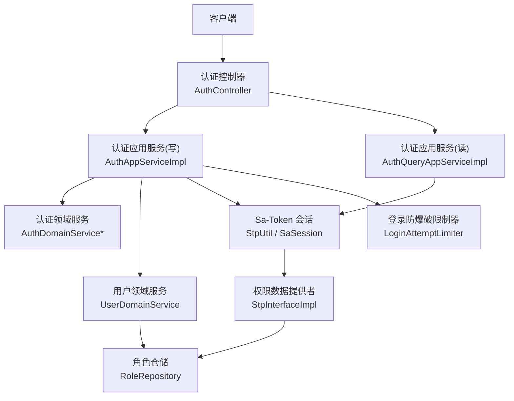
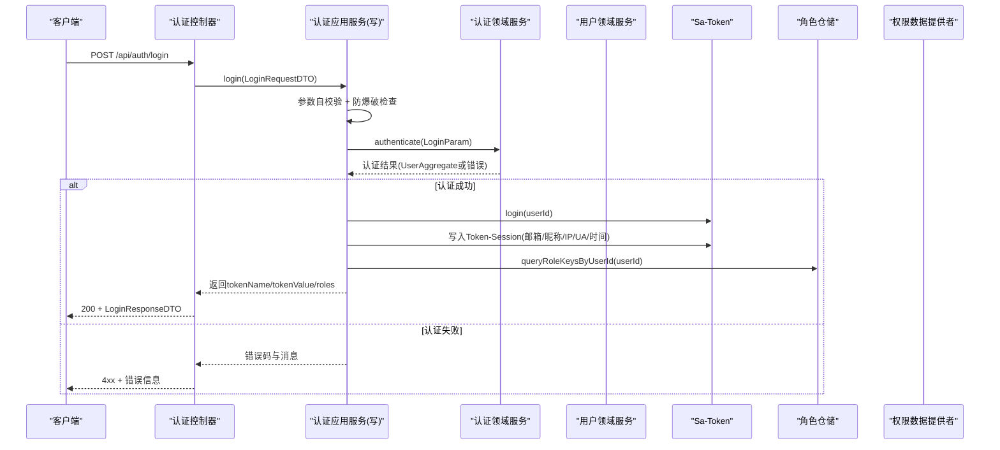
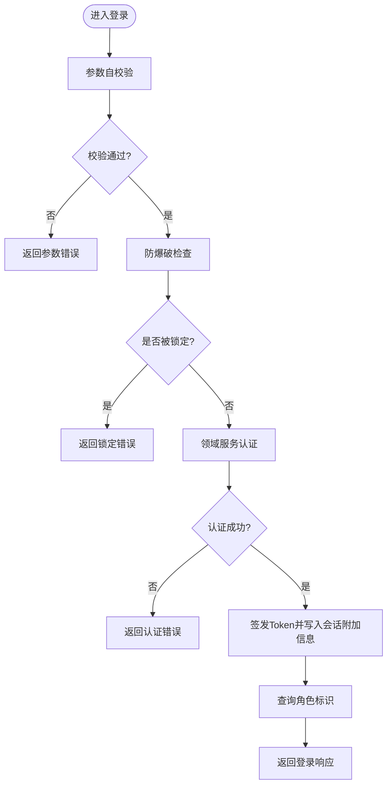
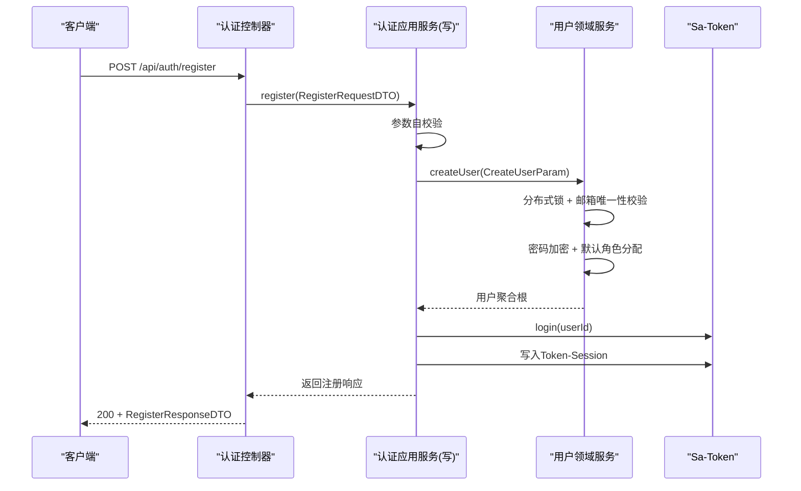
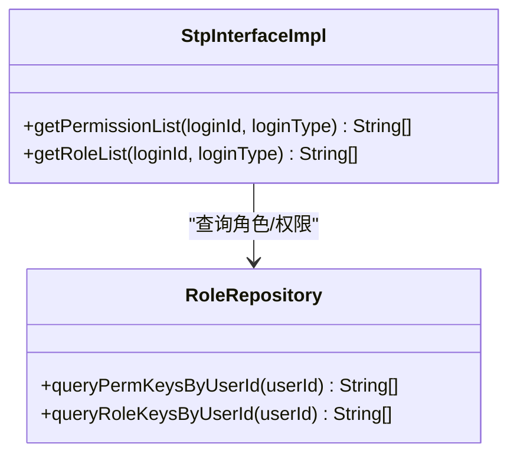
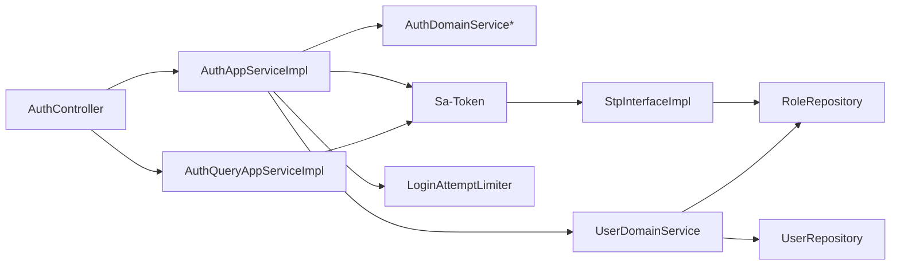

# 认证授权模块

<cite>
**本文引用的文件**
- [AuthController.java](file://src/main/java/com/sunnao/spring/ddd/template/adaptor/auth/input/AuthController.java)
- [AuthAppServiceImpl.java](file://src/main/java/com/sunnao/spring/ddd/template/application/auth/scenario/AuthAppServiceImpl.java)
- [AuthQueryAppServiceImpl.java](file://src/main/java/com/sunnao/spring/ddd/template/application/auth/scenario/AuthQueryAppServiceImpl.java)
- [AuthDomainService.java](file://src/main/java/com/sunnao/spring/ddd/template/domain/auth/service/AuthDomainService.java)
- [AuthDomainServiceImpl.java](file://src/main/java/com/sunnao/spring/ddd/template/domain/auth/service/AuthDomainServiceImpl.java)
- [SaTokenConfigure.java](file://src/main/java/com/sunnao/spring/ddd/template/common/config/SaTokenConfigure.java)
- [StpInterfaceImpl.java](file://src/main/java/com/sunnao/spring/ddd/template/infrastructure/auth/StpInterfaceImpl.java)
- [LoginAttemptLimiter.java](file://src/main/java/com/sunnao/spring/ddd/template/common/security/LoginAttemptLimiter.java)
- [AuthAppService.java](file://src/main/java/com/sunnao/spring/ddd/template/client/auth/AuthAppService.java)
- [AuthQueryAppService.java](file://src/main/java/com/sunnao/spring/ddd/template/client/auth/AuthQueryAppService.java)
- [LoginRequestDTO.java](file://src/main/java/com/sunnao/spring/ddd/template/client/auth/req/LoginRequestDTO.java)
- [RegisterRequestDTO.java](file://src/main/java/com/sunnao/spring/ddd/template/client/auth/req/RegisterRequestDTO.java)
- [LoginResponseDTO.java](file://src/main/java/com/sunnao/spring/ddd/template/client/auth/res/LoginResponseDTO.java)
- [RegisterResponseDTO.java](file://src/main/java/com/sunnao/spring/ddd/template/client/auth/res/RegisterResponseDTO.java)
- [GetLoginUserResponseDTO.java](file://src/main/java/com/sunnao/spring/ddd/template/client/auth/res/GetLoginUserResponseDTO.java)
- [UserDomainService.java](file://src/main/java/com/sunnao/spring/ddd/template/domain/system/user/service/UserDomainService.java)
- [UserDomainServiceImpl.java](file://src/main/java/com/sunnao/spring/ddd/template/domain/system/user/service/UserDomainServiceImpl.java)
- [AuthAssembler.java](file://src/main/java/com/sunnao/spring/ddd/template/application/auth/assembler/AuthAssembler.java)
- [ErrorCodeEnum.java](file://src/main/java/com/sunnao/spring/ddd/template/common/result/ErrorCodeEnum.java)
- [AuthRegisterIntegrationTest.java](file://src/test/java/com/sunnao/spring/ddd/template/integration/AuthRegisterIntegrationTest.java)
</cite>

## 更新摘要
**变更内容**
- 新增完整的用户注册功能，包含请求响应对象和集成测试
- 增强安全机制，实现基于Redis的登录失败次数限制
- 完善注册后自动登录流程，提升用户体验
- 优化错误处理和安全策略

## 目录
1. [简介](#简介)
2. [项目结构](#项目结构)
3. [核心组件](#核心组件)
4. [架构总览](#架构总览)
5. [详细组件分析](#详细组件分析)
6. [依赖关系分析](#依赖关系分析)
7. [性能与安全考虑](#性能与安全考虑)
8. [故障排查指南](#故障排查指南)
9. [结论](#结论)
10. [附录：API 使用示例](#附录api-使用示例)

## 简介
本章节聚焦于基于 Sa-Token 的认证与授权实现，覆盖用户登录、注册、登出流程，Token 管理与会话控制；RBAC 权限模型（角色与权限点）的设计与落地；在线用户管理的数据来源；以及认证流程中的安全策略（密码加密、登录尝试限制、Token 过期处理等）。文档同时给出 API 调用约定与错误码语义说明，并总结最佳实践与性能优化建议。

**更新** 新增了完整的用户注册功能和增强的安全机制，包括基于Redis的登录失败次数限制和注册后自动登录功能。

## 项目结构
认证授权相关代码遵循 DDD 分层组织：
- 适配层（Adaptor）：HTTP 控制器暴露接口，仅做参数接收与响应包装。
- 应用层（Application）：编排业务场景，协调领域服务与基础设施（如 Sa-Token），封装 Token 签发与会话写入。
- 领域层（Domain）：承载身份认证与用户创建的核心规则，不感知会话技术细节。
- 基础设施层（Infrastructure）：提供 Sa-Token 权限数据接入（角色/权限点查询）。

**图表来源**
- [AuthController.java:1-70](file://src/main/java/com/sunnao/spring/ddd/template/adaptor/auth/input/AuthController.java#L1-L70)
- [AuthAppServiceImpl.java:1-196](file://src/main/java/com/sunnao/spring/ddd/template/application/auth/scenario/AuthAppServiceImpl.java#L1-L196)
- [AuthQueryAppServiceImpl.java:1-57](file://src/main/java/com/sunnao/spring/ddd/template/application/auth/scenario/AuthQueryAppServiceImpl.java#L1-L57)
- [AuthDomainService.java:1-24](file://src/main/java/com/sunnao/spring/ddd/template/domain/auth/service/AuthDomainService.java#L1-L24)
- [AuthDomainServiceImpl.java:1-58](file://src/main/java/com/sunnao/spring/ddd/template/domain/auth/service/AuthDomainServiceImpl.java#L1-L58)
- [StpInterfaceImpl.java:1-54](file://src/main/java/com/sunnao/spring/ddd/template/infrastructure/auth/StpInterfaceImpl.java#L1-L54)
- [LoginAttemptLimiter.java:1-96](file://src/main/java/com/sunnao/spring/ddd/template/common/security/LoginAttemptLimiter.java#L1-L96)

**章节来源**
- [AuthController.java:1-70](file://src/main/java/com/sunnao/spring/ddd/template/adaptor/auth/input/AuthController.java#L1-L70)
- [AuthAppServiceImpl.java:1-196](file://src/main/java/com/sunnao/spring/ddd/template/application/auth/scenario/AuthAppServiceImpl.java#L1-L196)
- [AuthQueryAppServiceImpl.java:1-57](file://src/main/java/com/sunnao/spring/ddd/template/application/auth/scenario/AuthQueryAppServiceImpl.java#L1-L57)
- [AuthDomainService.java:1-24](file://src/main/java/com/sunnao/spring/ddd/template/domain/auth/service/AuthDomainService.java#L1-L24)
- [AuthDomainServiceImpl.java:1-58](file://src/main/java/com/sunnao/spring/ddd/template/domain/auth/service/AuthDomainServiceImpl.java#L1-L58)
- [StpInterfaceImpl.java:1-54](file://src/main/java/com/sunnao/spring/ddd/template/infrastructure/auth/StpInterfaceImpl.java#L1-L54)
- [LoginAttemptLimiter.java:1-96](file://src/main/java/com/sunnao/spring/ddd/template/common/security/LoginAttemptLimiter.java#L1-L96)

## 核心组件
- 认证控制器：定义登录、注册、登出、获取当前用户信息四个 HTTP 端点，统一返回 ResultDO 包装。
- 认证应用服务（写）：负责登录、注册、登出的场景编排，集成防爆破、事件发布、Token 签发与会话附加信息写入。
- 认证应用服务（读）：从 Sa-Token 会话取登录 ID，查询用户聚合根并填充角色标识后返回。
- 认证领域服务：完成凭证校验与账号状态校验，屏蔽会话技术细节。
- 用户领域服务：处理用户创建、修改、删除等业务逻辑，支持分布式锁和默认角色分配。
- Sa-Token 配置与权限数据提供者：全局拦截器要求登录态；角色与权限点通过 StpInterface 从 RBAC 表加载。
- 登录防爆破限制器：基于 Redis 固定窗口计数，按邮箱+IP维度限制失败次数。

**更新** 新增了用户领域服务的完整实现，支持分布式锁、默认角色分配和密码加密等功能。

**章节来源**
- [AuthController.java:1-70](file://src/main/java/com/sunnao/spring/ddd/template/adaptor/auth/input/AuthController.java#L1-L70)
- [AuthAppServiceImpl.java:1-196](file://src/main/java/com/sunnao/spring/ddd/template/application/auth/scenario/AuthAppServiceImpl.java#L1-L196)
- [AuthQueryAppServiceImpl.java:1-57](file://src/main/java/com/sunnao/spring/ddd/template/application/auth/scenario/AuthQueryAppServiceImpl.java#L1-L57)
- [AuthDomainService.java:1-24](file://src/main/java/com/sunnao/spring/ddd/template/domain/auth/service/AuthDomainService.java#L1-L24)
- [AuthDomainServiceImpl.java:1-58](file://src/main/java/com/sunnao/spring/ddd/template/domain/auth/service/AuthDomainServiceImpl.java#L1-L58)
- [UserDomainService.java:1-50](file://src/main/java/com/sunnao/spring/ddd/template/domain/system/user/service/UserDomainService.java#L1-L50)
- [UserDomainServiceImpl.java:1-204](file://src/main/java/com/sunnao/spring/ddd/template/domain/system/user/service/UserDomainServiceImpl.java#L1-L204)
- [SaTokenConfigure.java:1-31](file://src/main/java/com/sunnao/spring/ddd/template/common/config/SaTokenConfigure.java#L1-L31)
- [StpInterfaceImpl.java:1-54](file://src/main/java/com/sunnao/spring/ddd/template/infrastructure/auth/StpInterfaceImpl.java#L1-L54)
- [LoginAttemptLimiter.java:1-96](file://src/main/java/com/sunnao/spring/ddd/template/common/security/LoginAttemptLimiter.java#L1-L96)

## 架构总览
下图展示了从请求进入、应用层编排、领域层校验到 Sa-Token 会话与 RBAC 权限数据的完整链路。

**图表来源**
- [AuthController.java:1-70](file://src/main/java/com/sunnao/spring/ddd/template/adaptor/auth/input/AuthController.java#L1-L70)
- [AuthAppServiceImpl.java:1-196](file://src/main/java/com/sunnao/spring/ddd/template/application/auth/scenario/AuthAppServiceImpl.java#L1-L196)
- [AuthDomainService.java:1-24](file://src/main/java/com/sunnao/spring/ddd/template/domain/auth/service/AuthDomainService.java#L1-L24)
- [AuthDomainServiceImpl.java:1-58](file://src/main/java/com/sunnao/spring/ddd/template/domain/auth/service/AuthDomainServiceImpl.java#L1-L58)
- [StpInterfaceImpl.java:1-54](file://src/main/java/com/sunnao/spring/ddd/template/infrastructure/auth/StpInterfaceImpl.java#L1-L54)

## 详细组件分析

### 登录流程
- 入口：POST /api/auth/login
- 步骤要点：
  - 参数自校验（邮箱格式、非空等）
  - 防爆破检查（Redis 固定窗口计数，达到上限则拒绝）
  - 领域服务认证（邮箱+密码校验、账号状态校验）
  - 成功：签发 Token，向 Token-Session 写入附加信息（邮箱、昵称、IP、UA、登录时间）
  - 成功：查询角色标识集合，组装响应
  - 失败：记录登录日志事件（异步落库），返回错误码
- 安全要点：
  - 密码采用 BCrypt 比对密文
  - 凭证失败计入次数，成功清零
  - 未登录时登出视为幂等成功

**图表来源**
- [AuthController.java:1-70](file://src/main/java/com/sunnao/spring/ddd/template/adaptor/auth/input/AuthController.java#L1-L70)
- [AuthAppServiceImpl.java:1-196](file://src/main/java/com/sunnao/spring/ddd/template/application/auth/scenario/AuthAppServiceImpl.java#L1-L196)
- [AuthDomainServiceImpl.java:1-58](file://src/main/java/com/sunnao/spring/ddd/template/domain/auth/service/AuthDomainServiceImpl.java#L1-L58)
- [LoginAttemptLimiter.java:1-96](file://src/main/java/com/sunnao/spring/ddd/template/common/security/LoginAttemptLimiter.java#L1-L96)

**章节来源**
- [AuthController.java:1-70](file://src/main/java/com/sunnao/spring/ddd/template/adaptor/auth/input/AuthController.java#L1-L70)
- [AuthAppServiceImpl.java:1-196](file://src/main/java/com/sunnao/spring/ddd/template/application/auth/scenario/AuthAppServiceImpl.java#L1-L196)
- [AuthDomainServiceImpl.java:1-58](file://src/main/java/com/sunnao/spring/ddd/template/domain/auth/service/AuthDomainServiceImpl.java#L1-L58)
- [LoginAttemptLimiter.java:1-96](file://src/main/java/com/sunnao/spring/ddd/template/common/security/LoginAttemptLimiter.java#L1-L96)

### 注册流程
- 入口：POST /api/auth/register
- 步骤要点：
  - 参数自校验（邮箱、昵称、密码长度、两次密码一致性）
  - 调用用户领域服务创建用户（含唯一性、分布式锁、密码加密、事件发布）
  - 注册成功后自动登录：签发 Token 并写入会话附加信息
  - 返回 tokenName/tokenValue 与用户基础信息（包含默认角色）

**更新** 注册流程现已完全实现，支持自助注册和自动登录功能。

**图表来源**
- [AuthController.java:1-70](file://src/main/java/com/sunnao/spring/ddd/template/adaptor/auth/input/AuthController.java#L1-L70)
- [AuthAppServiceImpl.java:1-196](file://src/main/java/com/sunnao/spring/ddd/template/application/auth/scenario/AuthAppServiceImpl.java#L1-L196)
- [UserDomainServiceImpl.java:1-204](file://src/main/java/com/sunnao/spring/ddd/template/domain/system/user/service/UserDomainServiceImpl.java#L1-L204)

**章节来源**
- [AuthController.java:1-70](file://src/main/java/com/sunnao/spring/ddd/template/adaptor/auth/input/AuthController.java#L1-L70)
- [AuthAppServiceImpl.java:1-196](file://src/main/java/com/sunnao/spring/ddd/template/application/auth/scenario/AuthAppServiceImpl.java#L1-L196)
- [UserDomainServiceImpl.java:1-204](file://src/main/java/com/sunnao/spring/ddd/template/domain/system/user/service/UserDomainServiceImpl.java#L1-L204)
- [AuthRegisterIntegrationTest.java:1-127](file://src/test/java/com/sunnao/spring/ddd/template/integration/AuthRegisterIntegrationTest.java#L1-L127)

### 登出流程
- 入口：POST /api/auth/logout
- 行为：若已登录则注销会话；未登录视为幂等成功。

**章节来源**
- [AuthController.java:1-70](file://src/main/java/com/sunnao/spring/ddd/template/adaptor/auth/input/AuthController.java#L1-L70)
- [AuthAppServiceImpl.java:1-196](file://src/main/java/com/sunnao/spring/ddd/template/application/auth/scenario/AuthAppServiceImpl.java#L1-196)

### 获取当前登录用户信息
- 入口：GET /api/auth/me
- 行为：从 Sa-Token 会话取登录 ID，查询用户聚合根，填充角色标识后返回。

**章节来源**
- [AuthController.java:1-70](file://src/main/java/com/sunnao/spring/ddd/template/adaptor/auth/input/AuthController.java#L1-L70)
- [AuthQueryAppServiceImpl.java:1-57](file://src/main/java/com/sunnao/spring/ddd/template/application/auth/scenario/AuthQueryAppServiceImpl.java#L1-L57)

### RBAC 权限模型设计与实现
- 角色与权限点来源：通过 StpInterface 实现从 RBAC 表加载用户的角色键与权限键集合。
- 路由级鉴权：SaInterceptor 对 /api/** 进行登录态检查，注解鉴权（@SaCheckRole/@SaCheckPermission）由 Sa-Token 启用。
- 在线用户管理：登录成功后向 Token-Session 写入邮箱、昵称、IP、UA、登录时间等信息，供在线用户模块展示。

**图表来源**
- [StpInterfaceImpl.java:1-54](file://src/main/java/com/sunnao/spring/ddd/template/infrastructure/auth/StpInterfaceImpl.java#L1-L54)

**章节来源**
- [StpInterfaceImpl.java:1-54](file://src/main/java/com/sunnao/spring/ddd/template/infrastructure/auth/StpInterfaceImpl.java#L1-L54)
- [SaTokenConfigure.java:1-31](file://src/main/java/com/sunnao/spring/ddd/template/common/config/SaTokenConfigure.java#L1-L31)
- [AuthAppServiceImpl.java:1-196](file://src/main/java/com/sunnao/spring/ddd/template/application/auth/scenario/AuthAppServiceImpl.java#L1-196)

### 安全考虑
- 密码加密：领域层使用 BCrypt 比对密文，避免明文存储与比较。
- 登录尝试限制：基于 Redis 固定窗口计数，按邮箱+IP维度统计失败次数，达到上限后在窗口内拒绝登录；成功即清零。
- Token 过期处理：Sa-Token 会话过期后，后续请求将被拦截器判定为未登录，需重新登录。
- 防枚举：用户不存在与密码错误统一返回相同提示，降低账号枚举风险。
- 异常降级：登录防爆破读取/写入 Redis 异常时降级放行，仅记录日志，不影响主流程。
- 分布式锁：用户创建时使用分布式锁防止并发重复注册。
- 默认角色：新用户注册时自动授予 user 角色。

**更新** 新增了分布式锁保护、默认角色分配和更完善的错误处理机制。

**章节来源**
- [AuthDomainServiceImpl.java:1-58](file://src/main/java/com/sunnao/spring/ddd/template/domain/auth/service/AuthDomainServiceImpl.java#L1-L58)
- [LoginAttemptLimiter.java:1-96](file://src/main/java/com/sunnao/spring/ddd/template/common/security/LoginAttemptLimiter.java#L1-L96)
- [UserDomainServiceImpl.java:1-204](file://src/main/java/com/sunnao/spring/ddd/template/domain/system/user/service/UserDomainServiceImpl.java#L1-L204)
- [SaTokenConfigure.java:1-31](file://src/main/java/com/sunnao/spring/ddd/template/common/config/SaTokenConfigure.java#L1-L31)

## 依赖关系分析
- 控制器依赖应用服务接口（写/读），应用服务依赖领域服务与 Sa-Token。
- 权限数据提供者依赖角色仓储，用于加载角色与权限键集合。
- 登录防爆破限制器依赖 Redis，作为外部依赖进行计数与过期控制。
- 用户领域服务依赖角色仓储和用户仓储，支持分布式锁和事件发布。

**图表来源**
- [AuthController.java:1-70](file://src/main/java/com/sunnao/spring/ddd/template/adaptor/auth/input/AuthController.java#L1-L70)
- [AuthAppServiceImpl.java:1-196](file://src/main/java/com/sunnao/spring/ddd/template/application/auth/scenario/AuthAppServiceImpl.java#L1-L196)
- [AuthQueryAppServiceImpl.java:1-57](file://src/main/java/com/sunnao/spring/ddd/template/application/auth/scenario/AuthQueryAppServiceImpl.java#L1-L57)
- [AuthDomainService.java:1-24](file://src/main/java/com/sunnao/spring/ddd/template/domain/auth/service/AuthDomainService.java#L1-L24)
- [UserDomainService.java:1-50](file://src/main/java/com/sunnao/spring/ddd/template/domain/system/user/service/UserDomainService.java#L1-L50)
- [UserDomainServiceImpl.java:1-204](file://src/main/java/com/sunnao/spring/ddd/template/domain/system/user/service/UserDomainServiceImpl.java#L1-L204)
- [StpInterfaceImpl.java:1-54](file://src/main/java/com/sunnao/spring/ddd/template/infrastructure/auth/StpInterfaceImpl.java#L1-L54)
- [LoginAttemptLimiter.java:1-96](file://src/main/java/com/sunnao/spring/ddd/template/common/security/LoginAttemptLimiter.java#L1-L96)

## 性能与安全考虑
- 性能优化建议
  - 将登录日志事件异步落库，避免阻塞主流程。
  - 防爆破计数使用 Redis 原子操作，减少竞争开销。
  - 角色与权限点查询可结合缓存（例如本地缓存或 Redis 缓存）以降低数据库压力。
  - Token-Session 写入失败不应影响登录主流程，确保高可用。
  - 用户创建使用分布式锁保证并发安全，避免重复注册。
- 安全最佳实践
  - 始终使用 BCrypt 存储与校验密码。
  - 对外统一错误提示，防止账号枚举。
  - 合理设置登录失败阈值与锁定窗口时长，平衡安全性与用户体验。
  - 严格配置 Sa-Token 拦截路径，仅放行必要公开接口与文档路径。
  - 生产环境开启 HTTPS，避免 Token 明文传输。
  - 使用分布式锁防止并发重复注册。
  - 新用户自动授予默认角色，简化初始权限管理。

**更新** 新增了分布式锁性能和默认角色管理的最佳实践建议。

## 故障排查指南
- 登录失败频繁触发锁定
  - 检查 Redis 中对应 key 的计数与过期时间，确认防爆破配置是否过严。
  - 关注系统日志中降级告警，确认 Redis 可用性。
  - 检查 `app.security.login-max-failures` 和 `app.security.login-lock-minutes` 配置。
- 登录后无法访问受保护接口
  - 确认请求头携带了正确的 tokenName 与 tokenValue。
  - 检查 Sa-Token 拦截器配置是否误放行了敏感路径或未放行必要路径。
- 权限不足
  - 核对 StpInterface 是否正确加载角色与权限键集合。
  - 检查目标接口是否使用了注解鉴权且用户具备相应角色/权限。
- 注册失败问题
  - 检查邮箱唯一性约束和分布式锁状态。
  - 确认默认角色 user 是否存在于数据库中。
  - 验证密码强度要求和两次密码一致性校验。
- 自动登录失效
  - 检查注册成功后 Token 签发逻辑。
  - 确认 Token-Session 写入是否成功。
  - 验证前端是否正确保存和使用返回的 token。

**更新** 新增了注册和自动登录相关的故障排查指导。

**章节来源**
- [LoginAttemptLimiter.java:1-96](file://src/main/java/com/sunnao/spring/ddd/template/common/security/LoginAttemptLimiter.java#L1-L96)
- [SaTokenConfigure.java:1-31](file://src/main/java/com/sunnao/spring/ddd/template/common/config/SaTokenConfigure.java#L1-L31)
- [StpInterfaceImpl.java:1-54](file://src/main/java/com/sunnao/spring/ddd/template/infrastructure/auth/StpInterfaceImpl.java#L1-L54)
- [UserDomainServiceImpl.java:1-204](file://src/main/java/com/sunnao/spring/ddd/template/domain/system/user/service/UserDomainServiceImpl.java#L1-L204)

## 结论
本模块以 DDD 分层为基础，将认证与授权逻辑清晰分离：应用层收敛 Sa-Token 调用，领域层专注认证规则，基础设施层提供权限数据。通过防爆破、BCrypt 密码校验、Token 会话与 RBAC 权限模型，实现了安全、可扩展的认证授权体系。配合异步事件与降级策略，系统在稳定性与安全性之间取得良好平衡。

**更新** 新增的注册功能和增强的安全机制进一步提升了系统的完整性和用户体验，分布式锁和默认角色管理确保了数据一致性和易用性。

## 附录：API 使用示例
以下列出认证相关接口的请求参数、响应字段与常见错误处理要点。为避免泄露敏感信息，此处不展示具体 JSON 内容，仅提供字段说明与调用约定。

- 登录
  - 方法：POST /api/auth/login
  - 请求体字段：email、password
  - 响应体字段：tokenName、tokenValue、userId、nickname、roles
  - 错误处理：参数错误、锁定、认证失败、系统错误等统一返回 ResultDO 包装的错误码与消息
- 注册
  - 方法：POST /api/auth/register
  - 请求体字段：email、nickname、password、confirmPassword
  - 响应体字段：tokenName、tokenValue、userId、nickname、roles
  - 错误处理：参数错误、用户已存在、系统错误等
  - **更新** 注册成功后自动登录，直接返回可用的 token
- 登出
  - 方法：POST /api/auth/logout
  - 响应体：无业务数据，统一 ResultDO 包装
  - 错误处理：系统错误
- 获取当前登录用户信息
  - 方法：GET /api/auth/me
  - 响应体字段：userId、email、nickname、avatar、roles、status
  - 错误处理：未登录、用户不存在、系统错误

**更新** 注册 API 现已支持自动登录功能，注册成功后可直接使用返回的 token 访问需要认证的接口。

**章节来源**
- [AuthController.java:1-70](file://src/main/java/com/sunnao/spring/ddd/template/adaptor/auth/input/AuthController.java#L1-L70)
- [LoginRequestDTO.java:1-50](file://src/main/java/com/sunnao/spring/ddd/template/client/auth/req/LoginRequestDTO.java#L1-L50)
- [RegisterRequestDTO.java:1-67](file://src/main/java/com/sunnao/spring/ddd/template/client/auth/req/RegisterRequestDTO.java#L1-L67)
- [LoginResponseDTO.java:1-47](file://src/main/java/com/sunnao/spring/ddd/template/client/auth/res/LoginResponseDTO.java#L1-L47)
- [RegisterResponseDTO.java:1-49](file://src/main/java/com/sunnao/spring/ddd/template/client/auth/res/RegisterResponseDTO.java#L1-L49)
- [GetLoginUserResponseDTO.java:1-52](file://src/main/java/com/sunnao/spring/ddd/template/client/auth/res/GetLoginUserResponseDTO.java#L1-L52)
- [AuthRegisterIntegrationTest.java:1-127](file://src/test/java/com/sunnao/spring/ddd/template/integration/AuthRegisterIntegrationTest.java#L1-L127)