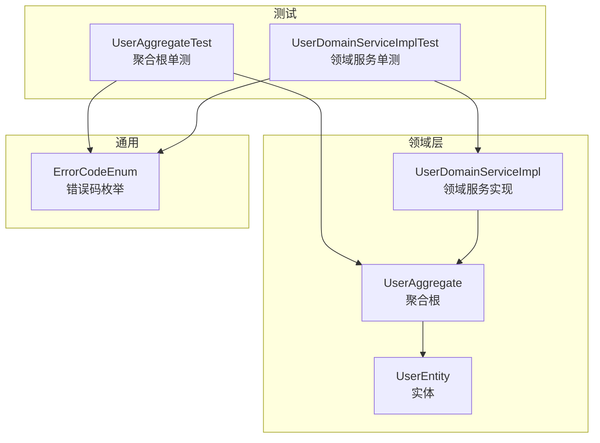
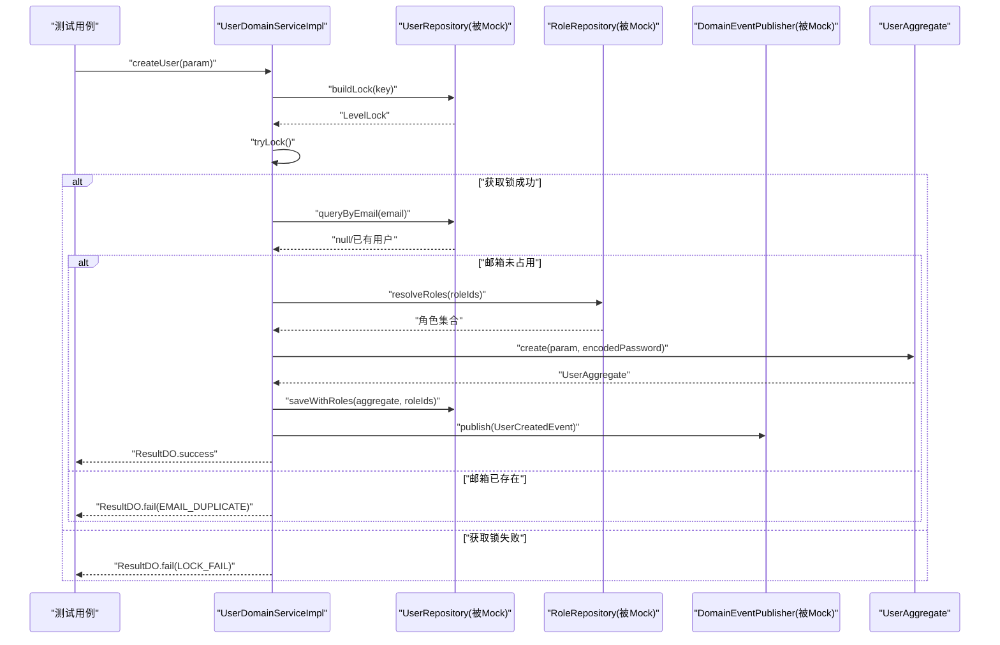
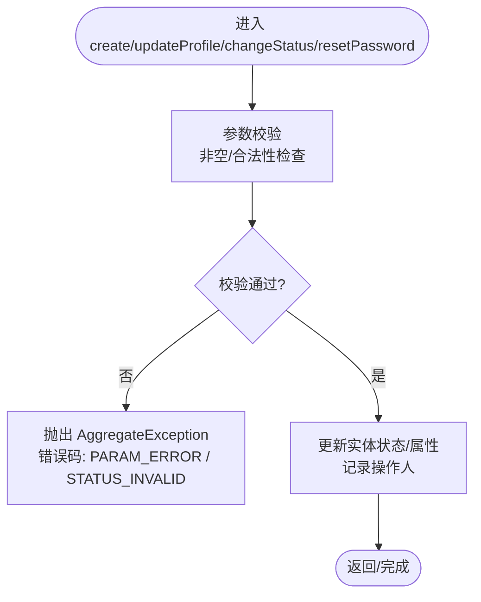
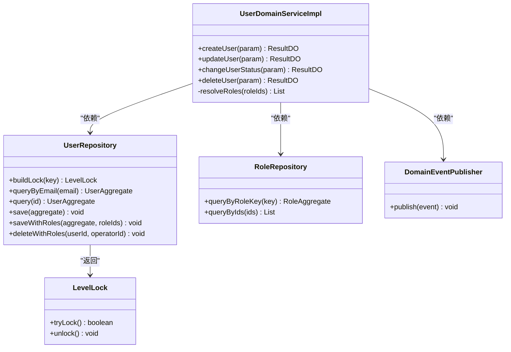
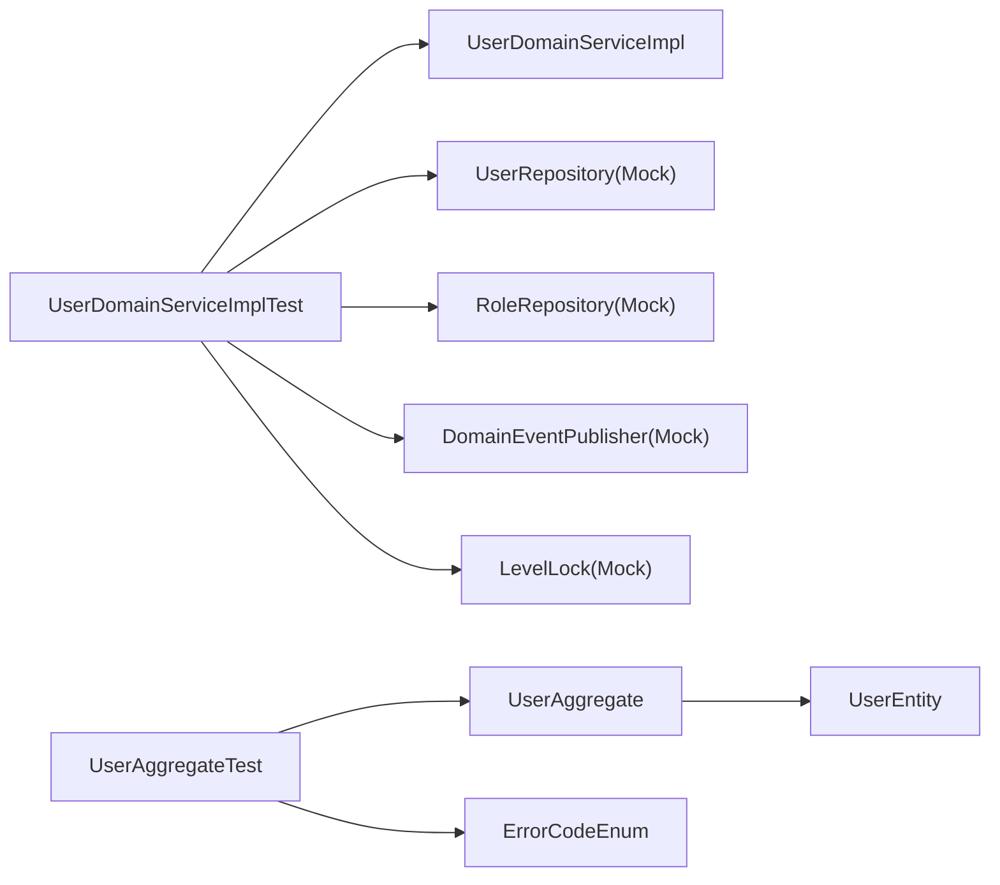

# 单元测试

<cite>
**本文引用的文件列表**
- [UserAggregateTest.java](file://src/test/java/com/sunnao/spring/ddd/template/domain/system/user/model/aggregate/UserAggregateTest.java)
- [UserDomainServiceImplTest.java](file://src/test/java/com/sunnao/spring/ddd/template/domain/system/user/service/UserDomainServiceImplTest.java)
- [UserAggregate.java](file://src/main/java/com/sunnao/spring/ddd/template/domain/system/user/model/aggregate/UserAggregate.java)
- [UserEntity.java](file://src/main/java/com/sunnao/spring/ddd/template/domain/system/user/model/entity/UserEntity.java)
- [UserDomainServiceImpl.java](file://src/main/java/com/sunnao/spring/ddd/template/domain/system/user/service/UserDomainServiceImpl.java)
- [ErrorCodeEnum.java](file://src/main/java/com/sunnao/spring/ddd/template/common/result/ErrorCodeEnum.java)
- [CreateUserParam.java](file://src/main/java/com/sunnao/spring/ddd/template/domain/system/user/model/param/CreateUserParam.java)
- [SpringDddTemplateApplicationTests.java](file://src/test/java/com/sunnao/spring/ddd/template/SpringDddTemplateApplicationTests.java)
</cite>

## 目录
1. [引言](#引言)
2. [项目结构](#项目结构)
3. [核心组件](#核心组件)
4. [架构总览](#架构总览)
5. [详细组件分析](#详细组件分析)
6. [依赖关系分析](#依赖关系分析)
7. [性能与并发考量](#性能与并发考量)
8. [故障排查指南](#故障排查指南)
9. [结论](#结论)
10. [附录：最佳实践清单](#附录最佳实践清单)

## 引言
本指导文档面向领域层聚合根与业务服务层的单元测试，围绕用户域（User）展开。以 UserAggregateTest 为例，系统讲解如何测试用户创建、更新、状态变更和密码重置等核心业务逻辑；并以 UserDomainServiceImplTest 为例，说明 Mock 对象的使用、数据验证与异常场景覆盖。同时总结 JUnit5 注解的最佳实践、测试数据构建模式（如 buildCreateParam）、命名约定与覆盖率要求，帮助团队建立稳定、可维护的测试体系。

## 项目结构
本项目采用 DDD 分层组织代码，测试位于 src/test 下，按领域与集成维度划分。与本次文档相关的核心位置如下：
- 领域聚合根与实体：domain/system/user/model/aggregate, domain/system/user/model/entity
- 领域服务实现：domain/system/user/service
- 错误码定义：common/result
- 测试用例：domain/system/user/model/aggregate, domain/system/user/service, integration

图表来源
- [UserAggregate.java:1-113](file://src/main/java/com/sunnao/spring/ddd/template/domain/system/user/model/aggregate/UserAggregate.java#L1-L113)
- [UserEntity.java:1-119](file://src/main/java/com/sunnao/spring/ddd/template/domain/system/user/model/entity/UserEntity.java#L1-L119)
- [UserDomainServiceImpl.java:1-204](file://src/main/java/com/sunnao/spring/ddd/template/domain/system/user/service/UserDomainServiceImpl.java#L1-L204)
- [ErrorCodeEnum.java:1-209](file://src/main/java/com/sunnao/spring/ddd/template/common/result/ErrorCodeEnum.java#L1-L209)
- [UserAggregateTest.java:1-141](file://src/test/java/com/sunnao/spring/ddd/template/domain/system/user/model/aggregate/UserAggregateTest.java#L1-L141)
- [UserDomainServiceImplTest.java:1-254](file://src/test/java/com/sunnao/spring/ddd/template/domain/system/user/service/UserDomainServiceImplTest.java#L1-L254)

章节来源
- [UserAggregate.java:1-113](file://src/main/java/com/sunnao/spring/ddd/template/domain/system/user/model/aggregate/UserAggregate.java#L1-L113)
- [UserEntity.java:1-119](file://src/main/java/com/sunnao/spring/ddd/template/domain/system/user/model/entity/UserEntity.java#L1-L119)
- [UserDomainServiceImpl.java:1-204](file://src/main/java/com/sunnao/spring/ddd/template/domain/system/user/service/UserDomainServiceImpl.java#L1-L204)
- [ErrorCodeEnum.java:1-209](file://src/main/java/com/sunnao/spring/ddd/template/common/result/ErrorCodeEnum.java#L1-L209)
- [UserAggregateTest.java:1-141](file://src/test/java/com/sunnao/spring/ddd/template/domain/system/user/model/aggregate/UserAggregateTest.java#L1-L141)
- [UserDomainServiceImplTest.java:1-254](file://src/test/java/com/sunnao/spring/ddd/template/domain/system/user/service/UserDomainServiceImplTest.java#L1-L254)

## 核心组件
- 聚合根 UserAggregate：封装用户实体的创建、资料更新、状态变更、密码重置等核心行为，并在参数校验失败时抛出 AggregateException。
- 实体 UserEntity：承载用户属性与状态机方法（enable/disable），以及密码重置等细粒度操作。
- 领域服务 UserDomainServiceImpl：编排写流程（加锁 → 加载聚合根 → 执行业务 → 持久化 → 释放锁），统一捕获异常并返回 ResultDO。
- 错误码 ErrorCodeEnum：集中管理所有错误码与默认文案，测试断言中通过 code 进行一致性校验。

章节来源
- [UserAggregate.java:1-113](file://src/main/java/com/sunnao/spring/ddd/template/domain/system/user/model/aggregate/UserAggregate.java#L1-L113)
- [UserEntity.java:1-119](file://src/main/java/com/sunnao/spring/ddd/template/domain/system/user/model/entity/UserEntity.java#L1-L119)
- [UserDomainServiceImpl.java:1-204](file://src/main/java/com/sunnao/spring/ddd/template/domain/system/user/service/UserDomainServiceImpl.java#L1-L204)
- [ErrorCodeEnum.java:1-209](file://src/main/java/com/sunnao/spring/ddd/template/common/result/ErrorCodeEnum.java#L1-L209)

## 架构总览
下图展示用户写操作的典型调用链与异常处理路径，体现“锁 → 聚合根 → 仓储 → 事件”的标准流程。

图表来源
- [UserDomainServiceImpl.java:46-89](file://src/main/java/com/sunnao/spring/ddd/template/domain/system/user/service/UserDomainServiceImpl.java#L46-L89)
- [UserAggregate.java:38-64](file://src/main/java/com/sunnao/spring/ddd/template/domain/system/user/model/aggregate/UserAggregate.java#L38-L64)
- [ErrorCodeEnum.java:100-117](file://src/main/java/com/sunnao/spring/ddd/template/common/result/ErrorCodeEnum.java#L100-L117)

## 详细组件分析

### 聚合根单元测试策略（UserAggregateTest）
- 目标：纯领域逻辑验证，不依赖 Spring 容器与外部资源。
- 关键场景
  - 创建用户：合法参数应初始化启用状态与审计字段；邮箱或密码为空应抛出 AggregateException。
  - 修改资料：至少提供昵称或头像之一；两者同时为空应抛出 AggregateException。
  - 状态变更：从禁用到启用、从启用到禁用的流转校验；重复启用应抛出 AggregateException。
  - 重置密码：新密码非空校验；成功后更新密码与操作人。
- 断言使用
  - 正常路径：使用 assertNotNull、assertEquals 断言实体字段与状态。
  - 异常路径：使用 assertThrows 捕获 AggregateException，并通过 e.getCode() 断言错误码为 PARAM_ERROR 或 STATUS_INVALID。
- 测试数据构建
  - 使用私有方法 buildCreateParam 构造最小可用参数，避免在每个用例中重复拼装。
  - 常量 ENCODED_PASSWORD 用于模拟已加密密码，确保聚合根创建分支无需真实加密器。

图表来源
- [UserAggregate.java:38-105](file://src/main/java/com/sunnao/spring/ddd/template/domain/system/user/model/aggregate/UserAggregate.java#L38-L105)
- [UserEntity.java:60-117](file://src/main/java/com/sunnao/spring/ddd/template/domain/system/user/model/entity/UserEntity.java#L60-L117)
- [ErrorCodeEnum.java:24-64](file://src/main/java/com/sunnao/spring/ddd/template/common/result/ErrorCodeEnum.java#L24-L64)

章节来源
- [UserAggregateTest.java:1-141](file://src/test/java/com/sunnao/spring/ddd/template/domain/system/user/model/aggregate/UserAggregateTest.java#L1-L141)
- [UserAggregate.java:1-113](file://src/main/java/com/sunnao/spring/ddd/template/domain/system/user/model/aggregate/UserAggregate.java#L1-L113)
- [UserEntity.java:1-119](file://src/main/java/com/sunnao/spring/ddd/template/domain/system/user/model/entity/UserEntity.java#L1-L119)
- [ErrorCodeEnum.java:1-209](file://src/main/java/com/sunnao/spring/ddd/template/common/result/ErrorCodeEnum.java#L1-L209)

### 领域服务单元测试实现（UserDomainServiceImplTest）
- 目标：验证写模式标准流程与失败分支，包括锁、唯一性校验、角色解析、持久化与事件发布。
- Mock 对象
  - UserRepository：mock queryByEmail/query/save/saveWithRoles/deleteWithRoles/buildLock。
  - RoleRepository：mock queryByRoleKey/queryByIds。
  - DomainEventPublisher：验证是否发布 UserCreatedEvent。
  - LevelLock：mock tryLock/unlock，控制并发分支。
- 关键场景
  - 创建用户成功：回填ID、默认授予 user 角色、发布事件、最终释放锁。
  - 邮箱重复：返回 EMAIL_DUPLICATE，不调用保存。
  - 获取锁失败：返回 LOCK_FAIL，不调用保存。
  - 指定角色无效：返回 ROLE_NOT_FOUND，不调用保存。
  - 修改资料：用户不存在返回 USER_NOT_FOUND；成功则持久化变更。
  - 变更状态：非法流转返回 STATUS_INVALID；成功则持久化变更。
  - 删除用户：成功清理关联；仓储异常转换为 DB_QUERY_ERROR 且不向上抛异常。
- 断言与验证
  - 使用 assertTrue/assertFalse 判断 ResultDO 成功与否。
  - 使用 assertEquals 断言结果中的 code/data 与实体状态。
  - 使用 verify 验证仓储与事件发布器的调用次数与参数匹配。

图表来源
- [UserDomainServiceImpl.java:46-204](file://src/main/java/com/sunnao/spring/ddd/template/domain/system/user/service/UserDomainServiceImpl.java#L46-L204)
- [UserDomainServiceImplTest.java:1-254](file://src/test/java/com/sunnao/spring/ddd/template/domain/system/user/service/UserDomainServiceImplTest.java#L1-L254)

章节来源
- [UserDomainServiceImplTest.java:1-254](file://src/test/java/com/sunnao/spring/ddd/template/domain/system/user/service/UserDomainServiceImplTest.java#L1-L254)
- [UserDomainServiceImpl.java:1-204](file://src/main/java/com/sunnao/spring/ddd/template/domain/system/user/service/UserDomainServiceImpl.java#L1-L204)

### JUnit5 注解最佳实践
- @Test：标记测试方法，保持方法名语义化，描述具体场景。
- @DisplayName：为测试用例提供可读性强的中文名称，便于在测试报告中快速定位问题。
- @ExtendWith(MockitoExtension.class)：在领域服务单测中启用 Mockito，简化 @Mock/@InjectMocks 注入。
- @BeforeEach：初始化共享配置，例如 mock 锁构建行为。
- @EnabledIfEnvironmentVariable：在集成测试中根据环境变量条件启用，避免本地无依赖环境导致失败。

章节来源
- [UserAggregateTest.java:1-141](file://src/test/java/com/sunnao/spring/ddd/template/domain/system/user/model/aggregate/UserAggregateTest.java#L1-L141)
- [UserDomainServiceImplTest.java:1-254](file://src/test/java/com/sunnao/spring/ddd/template/domain/system/user/service/UserDomainServiceImplTest.java#L1-L254)
- [SpringDddTemplateApplicationTests.java:1-24](file://src/test/java/com/sunnao/spring/ddd/template/SpringDddTemplateApplicationTests.java#L1-L24)

### 测试数据构建模式（buildCreateParam）
- 设计原则
  - 最小可用：仅填充必要字段，减少无关干扰。
  - 可复用：在多个用例中复用同一构造方法，降低重复代码。
  - 易扩展：新增字段时在构造方法内设置默认值，保证现有用例不受影响。
  - 安全打印：参数类对敏感字段（如 password）使用 toString 排除，避免日志泄露。
- 示例参考
  - 聚合根单测与服务单测均定义了各自的 buildCreateParam，分别服务于不同上下文的最小数据集。

章节来源
- [UserAggregateTest.java:23-30](file://src/test/java/com/sunnao/spring/ddd/template/domain/system/user/model/aggregate/UserAggregateTest.java#L23-L30)
- [UserDomainServiceImplTest.java:61-68](file://src/test/java/com/sunnao/spring/ddd/template/domain/system/user/service/UserDomainServiceImplTest.java#L61-L68)
- [CreateUserParam.java:1-47](file://src/main/java/com/sunnao/spring/ddd/template/domain/system/user/model/param/CreateUserParam.java#L1-L47)

## 依赖关系分析
- 耦合与内聚
  - 聚合根与实体高内聚，对外暴露有限且语义化的方法，测试聚焦于这些方法的输入输出与异常。
  - 领域服务依赖仓储与事件发布器，测试通过 Mock 隔离外部依赖，关注编排逻辑与异常转换。
- 直接依赖
  - UserDomainServiceImplTest 直接依赖 UserRepository、RoleRepository、DomainEventPublisher、LevelLock。
  - UserAggregateTest 直接依赖 UserAggregate、UserEntity、ErrorCodeEnum。
- 潜在循环依赖
  - 当前结构未见循环依赖；仓储与领域服务之间通过接口解耦。

图表来源
- [UserDomainServiceImplTest.java:1-254](file://src/test/java/com/sunnao/spring/ddd/template/domain/system/user/service/UserDomainServiceImplTest.java#L1-L254)
- [UserAggregateTest.java:1-141](file://src/test/java/com/sunnao/spring/ddd/template/domain/system/user/model/aggregate/UserAggregateTest.java#L1-L141)

章节来源
- [UserDomainServiceImplTest.java:1-254](file://src/test/java/com/sunnao/spring/ddd/template/domain/system/user/service/UserDomainServiceImplTest.java#L1-L254)
- [UserAggregateTest.java:1-141](file://src/test/java/com/sunnao/spring/ddd/template/domain/system/user/model/aggregate/UserAggregateTest.java#L1-L141)

## 性能与并发考量
- 锁策略：写操作通过 LevelLock 按邮箱或用户ID加锁，防止并发重复创建或竞态更新。
- 测试覆盖：通过 mock tryLock 返回 false 验证 LOCK_FAIL 分支；返回 true 验证正常流程。
- 建议
  - 在领域服务单测中增加并发场景的时序验证（如多次 tryLock 竞争）。
  - 对持久化耗时路径引入超时断言，避免测试挂起。

[本节为通用指导，不直接分析具体文件]

## 故障排查指南
- 常见错误码
  - PARAM_ERROR：参数校验失败（如空邮箱、空密码、同时为空等）。
  - STATUS_INVALID：状态机流转冲突（如重复启用）。
  - EMAIL_DUPLICATE：邮箱已被注册。
  - LOCK_FAIL：获取锁失败。
  - USER_NOT_FOUND：用户不存在。
  - ROLE_NOT_FOUND：角色不存在或无效。
  - DB_QUERY_ERROR：数据库查询异常。
- 断言要点
  - 使用 assertThrows 捕获异常后断言 e.getCode()。
  - 使用 verify 确认仓储与事件发布器未被调用（失败分支）。
  - 使用 assertEquals 断言 ResultDO.code 与 data 字段。

章节来源
- [ErrorCodeEnum.java:1-209](file://src/main/java/com/sunnao/spring/ddd/template/common/result/ErrorCodeEnum.java#L1-L209)
- [UserAggregateTest.java:45-62](file://src/test/java/com/sunnao/spring/ddd/template/domain/system/user/model/aggregate/UserAggregateTest.java#L45-L62)
- [UserDomainServiceImplTest.java:112-152](file://src/test/java/com/sunnao/spring/ddd/template/domain/system/user/service/UserDomainServiceImplTest.java#L112-L152)

## 结论
通过对聚合根与服务层的单元测试设计与实现，可以清晰验证用户域的核心业务规则与写流程编排。结合 JUnit5 注解、Mock 技术与统一的错误码体系，测试具备高可读性与强稳定性。建议在后续迭代中持续完善边界与异常场景，提升整体覆盖率与回归效率。

[本节为总结，不直接分析具体文件]

## 附录：最佳实践清单
- 命名约定
  - 测试类与方法名采用动词+场景的描述风格，如 createShouldInitEnabledUser。
  - @DisplayName 使用中文，明确表达预期行为。
- 断言规范
  - 正常路径断言字段与状态；异常路径断言错误码与消息。
  - 使用 verify 验证副作用（持久化、事件发布、锁释放）。
- 测试数据
  - 使用 buildCreateParam 等工厂方法构建最小可用数据。
  - 对敏感字段使用 toString 排除，避免日志泄露。
- 覆盖率要求
  - 聚合根：核心方法与异常分支覆盖率 ≥ 90%。
  - 领域服务：成功/失败分支、锁与事件发布覆盖率 ≥ 90%。
  - 集成测试：关键入口（登录、注册、CRUD）覆盖率 ≥ 80%。
- 条件测试
  - 使用 @EnabledIfEnvironmentVariable 控制需要外部依赖的测试执行。

[本节为通用指导，不直接分析具体文件]