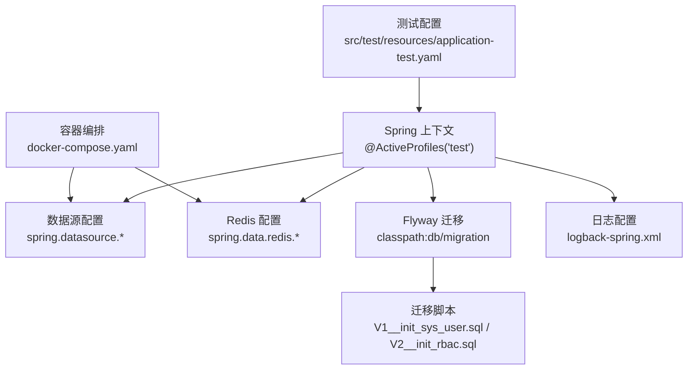
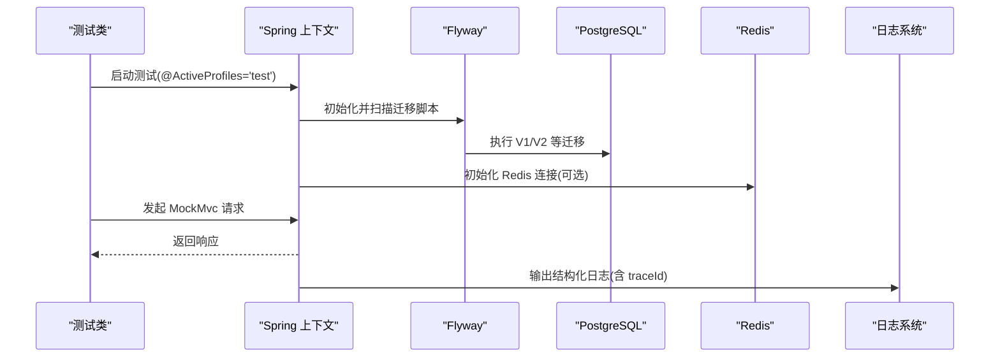
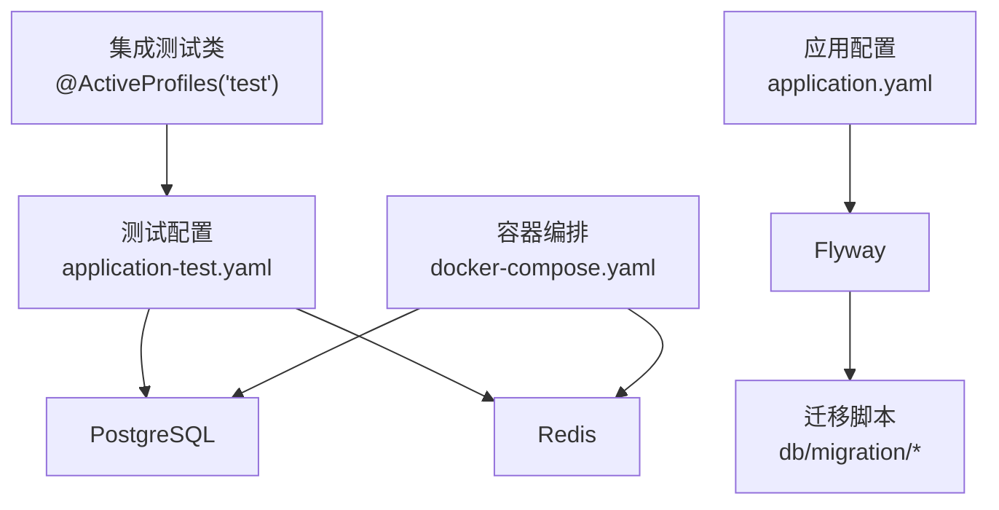

# 测试环境配置

<cite>
**本文引用的文件**   
- [application-test.yaml](file://src/test/resources/application-test.yaml)
- [application.yaml](file://src/main/resources/application.yaml)
- [logback-spring.xml](file://src/main/resources/logback-spring.xml)
- [SpringDddTemplateApplicationTests.java](file://src/test/java/com/sunnao/spring/ddd/template/SpringDddTemplateApplicationTests.java)
- [AuthLoginIntegrationTest.java](file://src/test/java/com/sunnao/spring/ddd/template/integration/AuthLoginIntegrationTest.java)
- [AuthRegisterIntegrationTest.java](file://src/test/java/com/sunnao/spring/ddd/template/integration/AuthRegisterIntegrationTest.java)
- [UserCrudIntegrationTest.java](file://src/test/java/com/sunnao/spring/ddd/template/integration/UserCrudIntegrationTest.java)
- [V1__init_sys_user.sql](file://src/main/resources/db/migration/V1__init_sys_user.sql)
- [V2__init_rbac.sql](file://src/main/resources/db/migration/V2__init_rbac.sql)
- [docker-compose.yaml](file://docker-compose.yaml)
- [UserDomainServiceImplTest.java](file://src/test/java/com/sunnao/spring/ddd/template/domain/system/user/service/UserDomainServiceImplTest.java)
- [UserAggregateTest.java](file://src/test/java/com/sunnao/spring/ddd/template/domain/system/user/model/aggregate/UserAggregateTest.java)
</cite>

## 目录
1. [简介](#简介)
2. [项目结构](#项目结构)
3. [核心组件](#核心组件)
4. [架构总览](#架构总览)
5. [详细组件分析](#详细组件分析)
6. [依赖关系分析](#依赖关系分析)
7. [性能考虑](#性能考虑)
8. [故障排查指南](#故障排查指南)
9. [结论](#结论)
10. [附录](#附录)

## 简介
本文件面向测试环境配置，聚焦以下目标：
- 详解测试配置文件 application-test.yaml 的结构与参数（数据库、Redis、文件存储路径）
- 说明测试启动类的配置选项与环境变量控制（容器管理、Bean覆盖机制）
- 解释不同测试类型的隔离策略（单元测试、集成测试、性能测试）
- 给出测试数据库初始化脚本管理与 Flyway 迁移执行方法
- 说明测试日志配置与输出格式定制
- 提供测试资源文件的组织结构与命名约定
- 汇总常见问题与解决方案

## 项目结构
测试相关的关键位置与职责：
- src/test/resources/application-test.yaml：测试环境配置（PostgreSQL/Redis 连接通过环境变量注入）
- src/test/java/**：测试代码
  - integration/*：集成测试，使用 @ActiveProfiles("test") 加载测试配置，依赖真实外部服务
  - domain/**：领域层单元测试，不依赖 Spring 容器与外部资源
- src/main/resources/db/migration/*：Flyway 迁移脚本，应用启动时自动执行
- src/main/resources/logback-spring.xml：统一日志配置（控制台与滚动文件）
- docker-compose.yaml：本地开发依赖的 PostgreSQL 与 Redis 容器编排

图表来源
- [application-test.yaml:1-18](file://src/test/resources/application-test.yaml#L1-L18)
- [application.yaml:32-36](file://src/main/resources/application.yaml#L32-L36)
- [V1__init_sys_user.sql:1-51](file://src/main/resources/db/migration/V1__init_sys_user.sql#L1-L51)
- [V2__init_rbac.sql:1-158](file://src/main/resources/db/migration/V2__init_rbac.sql#L1-L158)
- [docker-compose.yaml:1-36](file://docker-compose.yaml#L1-L36)

章节来源
- [application-test.yaml:1-18](file://src/test/resources/application-test.yaml#L1-L18)
- [application.yaml:1-88](file://src/main/resources/application.yaml#L1-L88)
- [logback-spring.xml:1-43](file://src/main/resources/logback-spring.xml#L1-L43)
- [docker-compose.yaml:1-36](file://docker-compose.yaml#L1-L36)

## 核心组件
- 测试配置 application-test.yaml
  - 通过环境变量占位符注入 PostgreSQL 与 Redis 连接信息
  - 当关键环境变量缺失时，集成测试将自动跳过，避免误连或失败
- 测试启动类与集成测试
  - 使用 @ActiveProfiles("test") 激活测试配置
  - 使用 @EnabledIfEnvironmentVariable 在缺少必要环境变量时跳过测试
  - 集成测试基于 MockMvc 发起 HTTP 请求，验证登录、注册、用户 CRUD 等流程
- 数据库迁移与种子数据
  - Flyway 启用并指向 classpath:db/migration
  - 首次运行会执行 V1/V2 等迁移脚本，包含表结构与种子管理员数据
- 日志配置
  - logback-spring.xml 定义控制台与滚动文件输出，支持 traceId 透传

章节来源
- [application-test.yaml:1-18](file://src/test/resources/application-test.yaml#L1-L18)
- [SpringDddTemplateApplicationTests.java:1-25](file://src/test/java/com/sunnao/spring/ddd/template/SpringDddTemplateApplicationTests.java#L1-L25)
- [AuthLoginIntegrationTest.java:1-98](file://src/test/java/com/sunnao/spring/ddd/template/integration/AuthLoginIntegrationTest.java#L1-L98)
- [AuthRegisterIntegrationTest.java:1-127](file://src/test/java/com/sunnao/spring/ddd/template/integration/AuthRegisterIntegrationTest.java#L1-L127)
- [UserCrudIntegrationTest.java:1-144](file://src/test/java/com/sunnao/spring/ddd/template/integration/UserCrudIntegrationTest.java#L1-L144)
- [application.yaml:32-36](file://src/main/resources/application.yaml#L32-L36)
- [V1__init_sys_user.sql:48-51](file://src/main/resources/db/migration/V1__init_sys_user.sql#L48-L51)
- [logback-spring.xml:1-43](file://src/main/resources/logback-spring.xml#L1-L43)

## 架构总览
测试环境整体工作流如下：
- 测试类通过 @ActiveProfiles("test") 加载 application-test.yaml
- 应用启动时 Flyway 执行 db/migration 下的迁移脚本，完成建表与种子数据
- 集成测试使用 MockMvc 调用控制器接口，验证业务逻辑
- 日志按 logback-spring.xml 输出到控制台与文件

图表来源
- [application-test.yaml:1-18](file://src/test/resources/application-test.yaml#L1-L18)
- [application.yaml:32-36](file://src/main/resources/application.yaml#L32-L36)
- [V1__init_sys_user.sql:1-51](file://src/main/resources/db/migration/V1__init_sys_user.sql#L1-L51)
- [V2__init_rbac.sql:1-158](file://src/main/resources/db/migration/V2__init_rbac.sql#L1-L158)
- [logback-spring.xml:1-43](file://src/main/resources/logback-spring.xml#L1-L43)

## 详细组件分析

### 测试配置文件 application-test.yaml
- 作用：为测试环境提供数据库与 Redis 的连接参数，全部通过环境变量注入
- 关键字段
  - spring.datasource.url：测试数据库 JDBC URL（由 TEST_PG_URL 注入）
  - spring.datasource.username/password：数据库用户名与密码（默认值可配置）
  - spring.data.redis.host/port/password/database：Redis 连接参数（由 TEST_REDIS_* 注入）
- 行为特性
  - 当 TEST_PG_URL 或 TEST_REDIS_HOST 缺失时，集成测试通过 @EnabledIfEnvironmentVariable 自动跳过，避免无意义的失败
- 建议
  - 在 CI/CD 或本地调试中集中维护这些环境变量，避免硬编码敏感信息

章节来源
- [application-test.yaml:1-18](file://src/test/resources/application-test.yaml#L1-L18)
- [SpringDddTemplateApplicationTests.java:14-17](file://src/test/java/com/sunnao/spring/ddd/template/SpringDddTemplateApplicationTests.java#L14-L17)
- [AuthLoginIntegrationTest.java:28-32](file://src/test/java/com/sunnao/spring/ddd/template/integration/AuthLoginIntegrationTest.java#L28-L32)
- [AuthRegisterIntegrationTest.java:29-33](file://src/test/java/com/sunnao/spring/ddd/template/integration/AuthRegisterIntegrationTest.java#L29-L33)
- [UserCrudIntegrationTest.java:28-32](file://src/test/java/com/sunnao/spring/ddd/template/integration/UserCrudIntegrationTest.java#L28-L32)

### 测试启动类与 Bean 覆盖机制
- 冒烟测试 SpringDddTemplateApplicationTests
  - 使用 @ActiveProfiles("test") 激活测试配置
  - 使用 @EnabledIfEnvironmentVariable 校验必需环境变量，未满足则跳过
  - 用于快速验证 Spring 上下文能否正常启动（包括 Flyway 迁移）
- 集成测试
  - 均使用 @ActiveProfiles("test") 与 @SpringBootTest
  - 使用 @AutoConfigureMockMvc 启用 MockMvc，进行 HTTP 层测试
  - 同样通过 @EnabledIfEnvironmentVariable 控制是否执行
- Bean 覆盖机制
  - 当前仓库未显式实现测试专用的 Bean 覆盖；如需替换外部依赖（如 Redis、文件存储），可在测试包下提供同名 @Bean 或使用 @TestConfiguration 进行覆盖
  - 对于仅单元测试（domain/**），通过 Mockito 对仓储与事件发布器进行 mock，无需 Spring 容器

章节来源
- [SpringDddTemplateApplicationTests.java:1-25](file://src/test/java/com/sunnao/spring/ddd/template/SpringDddTemplateApplicationTests.java#L1-L25)
- [AuthLoginIntegrationTest.java:1-98](file://src/test/java/com/sunnao/spring/ddd/template/integration/AuthLoginIntegrationTest.java#L1-L98)
- [AuthRegisterIntegrationTest.java:1-127](file://src/test/java/com/sunnao/spring/ddd/template/integration/AuthRegisterIntegrationTest.java#L1-L127)
- [UserCrudIntegrationTest.java:1-144](file://src/test/java/com/sunnao/spring/ddd/template/integration/UserCrudIntegrationTest.java#L1-L144)
- [UserDomainServiceImplTest.java:1-77](file://src/test/java/com/sunnao/spring/ddd/template/domain/system/user/service/UserDomainServiceImplTest.java#L1-L77)
- [UserAggregateTest.java:1-35](file://src/test/java/com/sunnao/spring/ddd/template/domain/system/user/model/aggregate/UserAggregateTest.java#L1-L35)

### 不同测试类型的配置隔离策略
- 单元测试（domain/**）
  - 不依赖 Spring 容器与外部资源
  - 使用 Mockito 对仓储与事件发布器进行模拟，验证聚合根与领域服务逻辑
  - 无需 application-test.yaml，也不触发 Flyway 迁移
- 集成测试（integration/*）
  - 需要真实 PostgreSQL 与 Redis（可通过 docker-compose 或云实例）
  - 使用 @ActiveProfiles("test"）加载 application-test.yaml
  - 通过 @EnabledIfEnvironmentVariable 控制是否执行，避免在无外部依赖时失败
- 性能测试
  - 仓库未提供专用性能测试模块；可按需新增独立包（如 perf/*）并使用 JMH 或自定义压测工具
  - 建议复用 application-test.yaml 或通过新的 profile（如 perf）隔离配置，确保与集成测试环境解耦

章节来源
- [UserDomainServiceImplTest.java:1-77](file://src/test/java/com/sunnao/spring/ddd/template/domain/system/user/service/UserDomainServiceImplTest.java#L1-L77)
- [UserAggregateTest.java:1-35](file://src/test/java/com/sunnao/spring/ddd/template/domain/system/user/model/aggregate/UserAggregateTest.java#L1-L35)
- [AuthLoginIntegrationTest.java:1-98](file://src/test/java/com/sunnao/spring/ddd/template/integration/AuthLoginIntegrationTest.java#L1-L98)
- [AuthRegisterIntegrationTest.java:1-127](file://src/test/java/com/sunnao/spring/ddd/template/integration/AuthRegisterIntegrationTest.java#L1-L127)
- [UserCrudIntegrationTest.java:1-144](file://src/test/java/com/sunnao/spring/ddd/template/integration/UserCrudIntegrationTest.java#L1-L144)

### 测试数据库初始化与 Flyway 迁移
- 迁移脚本位置：src/main/resources/db/migration
- 关键脚本
  - V1__init_sys_user.sql：创建用户表与索引，并插入种子管理员账号
  - V2__init_rbac.sql：创建角色、权限及关联表，并初始化 admin/user 角色与权限点
- 迁移策略
  - application.yaml 中启用 Flyway，locations 指向 classpath:db/migration
  - baseline-on-migrate=true：兼容已有库，非空 schema 以当前版本为基线，全新库从 V1 开始迁移
- 测试执行
  - 集成测试启动时会触发 Flyway 迁移，确保表结构与种子数据就绪
  - 若仅需单元测试，可不触发迁移（不加载 test profile）

章节来源
- [application.yaml:32-36](file://src/main/resources/application.yaml#L32-L36)
- [V1__init_sys_user.sql:1-51](file://src/main/resources/db/migration/V1__init_sys_user.sql#L1-L51)
- [V2__init_rbac.sql:1-158](file://src/main/resources/db/migration/V2__init_rbac.sql#L1-L158)

### 测试日志配置与输出格式定制
- 日志框架：Logback（logback-spring.xml）
- 输出目标
  - 控制台：彩色输出，便于本地调试
  - 文件：按天与大小滚动，保留 30 天，总量上限 3GB
- 格式化
  - 统一 pattern 包含 %X{traceId}，结合 TraceIdFilter 与异步线程透传，便于链路追踪
- 覆盖方式
  - 可通过 logging.file.path 与 spring.application.name 覆盖日志目录与应用名
  - 测试环境下可将日志级别调整为 DEBUG 或 TRACE 以便定位问题

章节来源
- [logback-spring.xml:1-43](file://src/main/resources/logback-spring.xml#L1-L43)

### 测试资源文件组织结构与命名约定
- 测试配置
  - src/test/resources/application-test.yaml：测试环境配置，使用环境变量占位
- 迁移脚本
  - src/main/resources/db/migration/Vn__描述.sql：按版本号递增命名，语义化描述变更内容
- 测试用例
  - src/test/java/**
    - integration/*：集成测试，按功能域划分包（如 auth、system）
    - domain/**：领域层单元测试，对应领域模型与服务
- 建议
  - 保持测试资源与主资源分离，避免污染生产配置
  - 迁移脚本严格遵循语义化命名与幂等性原则

章节来源
- [application-test.yaml:1-18](file://src/test/resources/application-test.yaml#L1-L18)
- [V1__init_sys_user.sql:1-51](file://src/main/resources/db/migration/V1__init_sys_user.sql#L1-L51)
- [V2__init_rbac.sql:1-158](file://src/main/resources/db/migration/V2__init_rbac.sql#L1-L158)

### 常见测试环境问题与解决方案
- 问题：集成测试因缺少环境变量被跳过
  - 现象：测试显示“已跳过”
  - 原因：未设置 TEST_PG_URL 或 TEST_REDIS_HOST
  - 解决：在运行前设置相应环境变量，或在 IDE 运行配置中添加
- 问题：数据库连接失败或迁移报错
  - 现象：启动时报错或迁移失败
  - 原因：JDBC URL、用户名、密码不正确；或数据库未就绪
  - 解决：检查 TEST_PG_URL、TEST_PG_USERNAME、TEST_PG_PASSWORD；确认 PostgreSQL 可用且端口可达
- 问题：Redis 连接失败
  - 现象：启动时报 Redis 连接异常
  - 原因：未设置 TEST_REDIS_HOST 或网络不可达
  - 解决：设置 TEST_REDIS_HOST、TEST_REDIS_PORT、TEST_REDIS_PASSWORD；或使用 docker-compose 启动本地 Redis
- 问题：种子管理员无法登录
  - 现象：登录失败或找不到管理员
  - 原因：迁移未执行或数据不一致
  - 解决：确认 Flyway 已执行 V1/V2；必要时清理数据库后重新运行
- 问题：日志未输出或格式不符合预期
  - 现象：控制台无彩色日志或文件未生成
  - 原因：logging.file.path 未正确设置或权限不足
  - 解决：调整 logging.file.path；确保目录存在且有写入权限

章节来源
- [application-test.yaml:1-18](file://src/test/resources/application-test.yaml#L1-L18)
- [application.yaml:32-36](file://src/main/resources/application.yaml#L32-L36)
- [V1__init_sys_user.sql:48-51](file://src/main/resources/db/migration/V1__init_sys_user.sql#L48-L51)
- [logback-spring.xml:1-43](file://src/main/resources/logback-spring.xml#L1-L43)
- [docker-compose.yaml:1-36](file://docker-compose.yaml#L1-L36)

## 依赖关系分析
- 测试类与配置
  - 集成测试通过 @ActiveProfiles("test") 加载 application-test.yaml
  - 通过 @EnabledIfEnvironmentVariable 控制执行条件
- 外部依赖
  - PostgreSQL：由 application-test.yaml 的 spring.datasource.* 指定
  - Redis：由 application-test.yaml 的 spring.data.redis.* 指定
  - Flyway：由 application.yaml 的 flyway.* 指定迁移脚本位置与策略
- 容器编排
  - docker-compose.yaml 提供本地 PostgreSQL 与 Redis 的快速启动能力

图表来源
- [application-test.yaml:1-18](file://src/test/resources/application-test.yaml#L1-L18)
- [application.yaml:32-36](file://src/main/resources/application.yaml#L32-L36)
- [docker-compose.yaml:1-36](file://docker-compose.yaml#L1-L36)

章节来源
- [AuthLoginIntegrationTest.java:1-98](file://src/test/java/com/sunnao/spring/ddd/template/integration/AuthLoginIntegrationTest.java#L1-L98)
- [AuthRegisterIntegrationTest.java:1-127](file://src/test/java/com/sunnao/spring/ddd/template/integration/AuthRegisterIntegrationTest.java#L1-L127)
- [UserCrudIntegrationTest.java:1-144](file://src/test/java/com/sunnao/spring/ddd/template/integration/UserCrudIntegrationTest.java#L1-L144)
- [application.yaml:32-36](file://src/main/resources/application.yaml#L32-L36)
- [docker-compose.yaml:1-36](file://docker-compose.yaml#L1-L36)

## 性能考虑
- 集成测试应避免频繁重启容器与全量迁移，建议在 CI 中缓存镜像与数据库状态
- 合理设置 Redis 连接池与超时参数，避免测试阻塞
- 日志级别在测试环境中可适当提高，但注意磁盘占用与 I/O 影响
- 如需性能测试，建议使用独立环境与数据集，避免干扰集成测试稳定性

[本节为通用指导，不涉及具体文件分析]

## 故障排查指南
- 快速定位
  - 查看测试日志（控制台与文件），关注 traceId 与错误堆栈
  - 检查环境变量是否完整（TEST_PG_URL、TEST_REDIS_HOST 等）
  - 确认数据库与 Redis 连通性与权限
- 常用命令
  - 使用 docker-compose 启动依赖服务，观察健康检查日志
  - 手动执行迁移脚本验证 SQL 语法与数据一致性
- 回滚策略
  - 谨慎处理迁移脚本，尽量保证幂等与可回滚
  - 测试数据库建议定期重建，避免脏数据影响

章节来源
- [logback-spring.xml:1-43](file://src/main/resources/logback-spring.xml#L1-L43)
- [docker-compose.yaml:1-36](file://docker-compose.yaml#L1-L36)

## 结论
- 测试环境通过 application-test.yaml 与环境变量实现灵活配置
- 集成测试借助 Flyway 自动完成数据库初始化与种子数据准备
- 单元测试与集成测试采用清晰的隔离策略，提升可维护性与执行效率
- 统一的日志配置有助于问题定位与链路追踪
- 建议持续完善测试资源组织与命名规范，并在 CI/CD 中固化最佳实践

[本节为总结，不涉及具体文件分析]

## 附录
- 环境变量清单（示例）
  - TEST_PG_URL：测试数据库 JDBC URL
  - TEST_PG_USERNAME：数据库用户名
  - TEST_PG_PASSWORD：数据库密码
  - TEST_REDIS_HOST：Redis 主机地址
  - TEST_REDIS_PORT：Redis 端口
  - TEST_REDIS_PASSWORD：Redis 密码
  - TEST_REDIS_DATABASE：Redis 数据库编号
- 本地依赖启动
  - 使用 docker-compose up -d 启动 PostgreSQL 与 Redis
  - 应用启动时 Flyway 自动执行迁移脚本

章节来源
- [application-test.yaml:1-18](file://src/test/resources/application-test.yaml#L1-L18)
- [docker-compose.yaml:1-36](file://docker-compose.yaml#L1-L36)