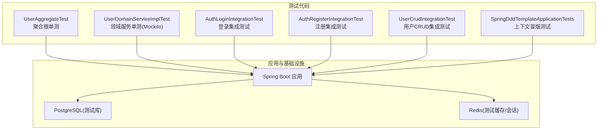
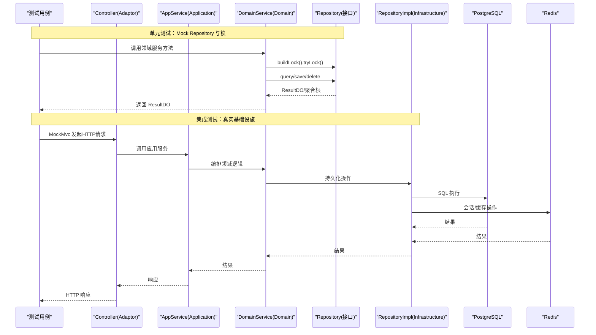
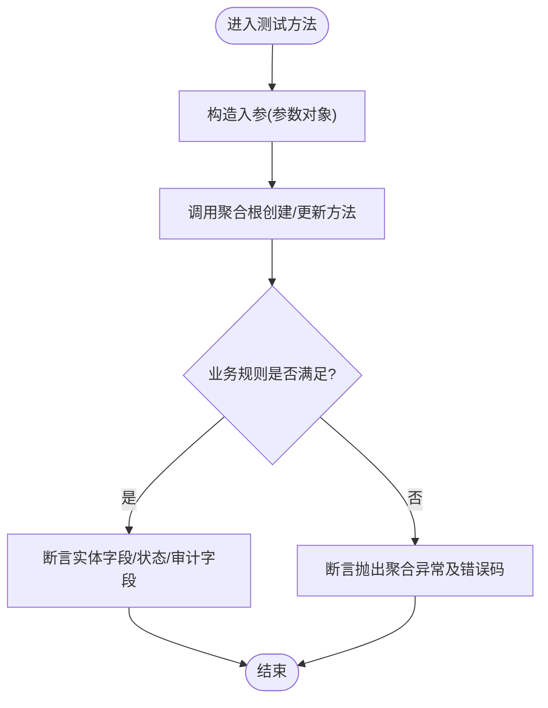
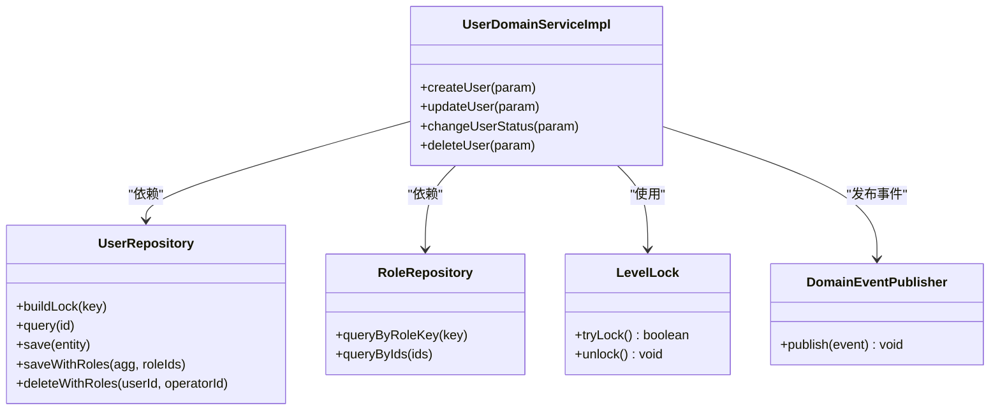
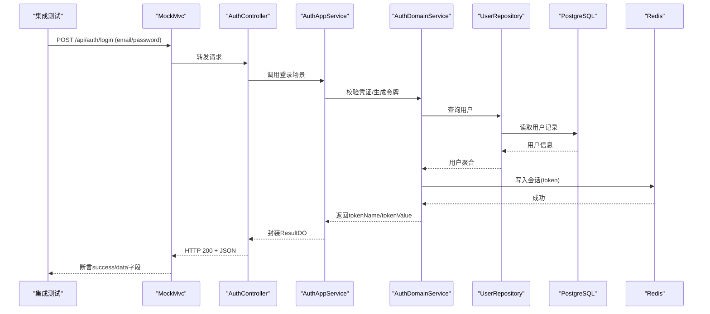
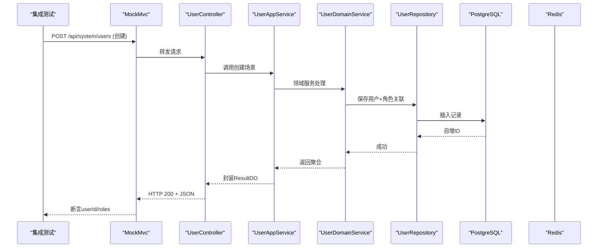
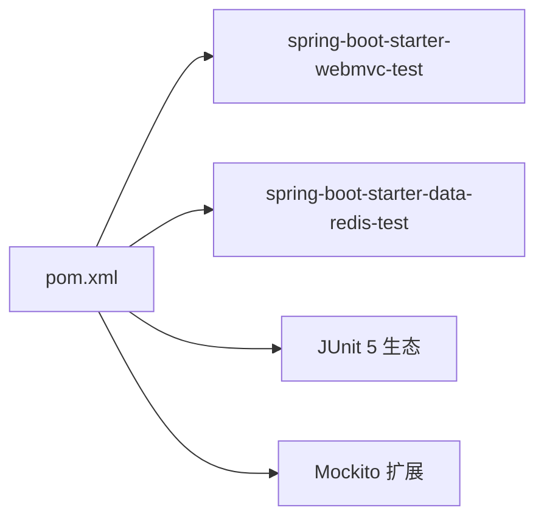

# 测试策略

<cite>
**本文引用的文件列表**
- [README.md](file://README.md)
- [pom.xml](file://pom.xml)
- [application-test.yaml](file://src/test/resources/application-test.yaml)
- [UserAggregateTest.java](file://src/test/java/com/sunnao/spring/ddd/template/domain/system/user/model/aggregate/UserAggregateTest.java)
- [UserDomainServiceImplTest.java](file://src/test/java/com/sunnao/spring/ddd/template/domain/system/user/service/UserDomainServiceImplTest.java)
- [AuthLoginIntegrationTest.java](file://src/test/java/com/sunnao/spring/ddd/template/integration/AuthLoginIntegrationTest.java)
- [AuthRegisterIntegrationTest.java](file://src/test/java/com/sunnao/spring/ddd/template/integration/AuthRegisterIntegrationTest.java)
- [UserCrudIntegrationTest.java](file://src/test/java/com/sunnao/spring/ddd/template/integration/UserCrudIntegrationTest.java)
- [SpringDddTemplateApplicationTests.java](file://src/test/java/com/sunnao/spring/ddd/template/SpringDddTemplateApplicationTests.java)
</cite>

## 目录
1. [引言](#引言)
2. [项目结构](#项目结构)
3. [核心组件](#核心组件)
4. [架构总览](#架构总览)
5. [详细组件分析](#详细组件分析)
6. [依赖分析](#依赖分析)
7. [性能考虑](#性能考虑)
8. [故障排查指南](#故障排查指南)
9. [结论](#结论)
10. [附录](#附录)

## 引言
本测试策略文档面向该 Spring Boot DDD 模板项目的测试体系建设，覆盖单元测试、集成测试、环境配置与条件跳过、命名约定、覆盖率要求、性能与压力测试方法，以及持续集成中的自动化执行与结果分析。目标是帮助团队在六边形架构下建立稳定、可维护、可度量的测试体系。

## 项目结构
本项目采用分层与领域驱动设计（DDD）组织代码，测试代码位于 src/test 下，按“领域层单测 + 集成测试”划分：
- 单元测试：聚焦聚合根业务规则与领域服务流程，使用 Mockito 隔离外部依赖。
- 集成测试：基于 SpringBootTest + MockMvc 验证完整 HTTP 链路，依赖真实 PostgreSQL 与 Redis，并通过环境变量控制连接与自动跳过。

图表来源
- [UserAggregateTest.java:1-141](file://src/test/java/com/sunnao/spring/ddd/template/domain/system/user/model/aggregate/UserAggregateTest.java#L1-L141)
- [UserDomainServiceImplTest.java:1-254](file://src/test/java/com/sunnao/spring/ddd/template/domain/system/user/service/UserDomainServiceImplTest.java#L1-L254)
- [AuthLoginIntegrationTest.java:1-98](file://src/test/java/com/sunnao/spring/ddd/template/integration/AuthLoginIntegrationTest.java#L1-L98)
- [AuthRegisterIntegrationTest.java:1-127](file://src/test/java/com/sunnao/spring/ddd/template/integration/AuthRegisterIntegrationTest.java#L1-L127)
- [UserCrudIntegrationTest.java:1-144](file://src/test/java/com/sunnao/spring/ddd/template/integration/UserCrudIntegrationTest.java#L1-L144)
- [SpringDddTemplateApplicationTests.java:1-24](file://src/test/java/com/sunnao/spring/ddd/template/SpringDddTemplateApplicationTests.java#L1-L24)

章节来源
- [README.md:135-146](file://README.md#L135-L146)
- [pom.xml:153-214](file://pom.xml#L153-L214)

## 核心组件
本节概述测试套件的核心组成与职责边界：
- 聚合根单测：验证领域不变量与状态流转，不依赖 Spring 容器与外部资源。
- 领域服务单测：使用 Mockito 模拟仓储与锁，验证写模式标准流程（锁 → 聚合根 → 持久化），并断言事件发布与错误码转换。
- 集成测试：通过 MockMvc 发起 HTTP 请求，端到端验证认证、授权、CRUD 等场景；依赖真实数据库与 Redis，缺失环境变量时自动跳过。
- 上下文冒烟测试：确保 Spring 上下文能正常加载，依赖真实外部资源。

章节来源
- [UserAggregateTest.java:1-141](file://src/test/java/com/sunnao/spring/ddd/template/domain/system/user/model/aggregate/UserAggregateTest.java#L1-L141)
- [UserDomainServiceImplTest.java:1-254](file://src/test/java/com/sunnao/spring/ddd/template/domain/system/user/service/UserDomainServiceImplTest.java#L1-L254)
- [AuthLoginIntegrationTest.java:1-98](file://src/test/java/com/sunnao/spring/ddd/template/integration/AuthLoginIntegrationTest.java#L1-L98)
- [AuthRegisterIntegrationTest.java:1-127](file://src/test/java/com/sunnao/spring/ddd/template/integration/AuthRegisterIntegrationTest.java#L1-L127)
- [UserCrudIntegrationTest.java:1-144](file://src/test/java/com/sunnao/spring/ddd/template/integration/UserCrudIntegrationTest.java#L1-L144)
- [SpringDddTemplateApplicationTests.java:1-24](file://src/test/java/com/sunnao/spring/ddd/template/SpringDddTemplateApplicationTests.java#L1-L24)

## 架构总览
下图展示测试在不同层次上的交互关系与数据流向，体现“无外部依赖的单测”和“需要真实外部资源的集成测试”的边界。

图表来源
- [UserDomainServiceImplTest.java:1-254](file://src/test/java/com/sunnao/spring/ddd/template/domain/system/user/service/UserDomainServiceImplTest.java#L1-L254)
- [AuthLoginIntegrationTest.java:1-98](file://src/test/java/com/sunnao/spring/ddd/template/integration/AuthLoginIntegrationTest.java#L1-L98)
- [UserCrudIntegrationTest.java:1-144](file://src/test/java/com/sunnao/spring/ddd/template/integration/UserCrudIntegrationTest.java#L1-L144)

## 详细组件分析

### 单元测试策略：聚合根（UserAggregateTest）
- 目标：验证聚合根的不变量与状态机，如创建用户默认启用、邮箱必填、密码非空、更新资料校验、状态变更合法性、重置密码校验等。
- 要点：
  - 纯 Java 对象测试，无需 Spring 容器与外部依赖。
  - 断言领域异常与错误码，保证业务规则被正确抛出。
  - 使用 JUnit 5 注解与断言 API，保持可读性与稳定性。

图表来源
- [UserAggregateTest.java:1-141](file://src/test/java/com/sunnao/spring/ddd/template/domain/system/user/model/aggregate/UserAggregateTest.java#L1-L141)

章节来源
- [UserAggregateTest.java:1-141](file://src/test/java/com/sunnao/spring/ddd/template/domain/system/user/model/aggregate/UserAggregateTest.java#L1-L141)

### 单元测试策略：领域服务（UserDomainServiceImplTest）
- 目标：验证写模式标准流程与失败分支，包括加锁、查询、构建聚合根、持久化、角色分配、事件发布、异常转错误码等。
- 要点：
  - 使用 @ExtendWith(MockitoExtension.class) 与 @Mock/@InjectMocks 注入依赖。
  - 对仓储与锁进行 stubbing，验证方法调用次数与参数匹配。
  - 断言 ResultDO 成功/失败分支与错误码映射。

图表来源
- [UserDomainServiceImplTest.java:1-254](file://src/test/java/com/sunnao/spring/ddd/template/domain/system/user/service/UserDomainServiceImplTest.java#L1-L254)

章节来源
- [UserDomainServiceImplTest.java:1-254](file://src/test/java/com/sunnao/spring/ddd/template/domain/system/user/service/UserDomainServiceImplTest.java#L1-L254)

### 集成测试设计：认证（AuthLoginIntegrationTest、AuthRegisterIntegrationTest）
- 目标：端到端验证登录、当前用户、登出与会话失效；匿名注册→自动登录→携带 token 访问受保护接口；重复注册与参数校验错误路径。
- 要点：
  - 使用 @ActiveProfiles("test") 激活测试配置。
  - 使用 @EnabledIfEnvironmentVariable 条件跳过，避免本地缺少外部依赖导致失败。
  - 使用 MockMvc 发送 JSON 请求，解析响应体并断言业务语义。

图表来源
- [AuthLoginIntegrationTest.java:1-98](file://src/test/java/com/sunnao/spring/ddd/template/integration/AuthLoginIntegrationTest.java#L1-L98)
- [AuthRegisterIntegrationTest.java:1-127](file://src/test/java/com/sunnao/spring/ddd/template/integration/AuthRegisterIntegrationTest.java#L1-L127)

章节来源
- [AuthLoginIntegrationTest.java:1-98](file://src/test/java/com/sunnao/spring/ddd/template/integration/AuthLoginIntegrationTest.java#L1-L98)
- [AuthRegisterIntegrationTest.java:1-127](file://src/test/java/com/sunnao/spring/ddd/template/integration/AuthRegisterIntegrationTest.java#L1-L127)

### 集成测试设计：用户管理（UserCrudIntegrationTest）
- 目标：管理员登录后完成创建、详情、修改、禁用、删除与二次查询确认不存在的全流程；分页查询包含种子数据。
- 要点：
  - 前置登录获取 token，后续请求携带鉴权头。
  - 断言业务错误码与响应结构一致性。
  - 利用 Flyway 迁移脚本初始化基础数据。

图表来源
- [UserCrudIntegrationTest.java:1-144](file://src/test/java/com/sunnao/spring/ddd/template/integration/UserCrudIntegrationTest.java#L1-L144)

章节来源
- [UserCrudIntegrationTest.java:1-144](file://src/test/java/com/sunnao/spring/ddd/template/integration/UserCrudIntegrationTest.java#L1-L144)

### 测试环境配置与条件跳过
- 测试配置文件 application-test.yaml 通过环境变量占位方式注入 PostgreSQL 与 Redis 连接信息。
- 集成测试类使用 @EnabledIfEnvironmentVariable 检查 TEST_PG_URL 与 TEST_REDIS_HOST，缺失则自动跳过，避免本地运行失败。
- 上下文冒烟测试同样遵循该条件跳过策略。

章节来源
- [application-test.yaml:1-18](file://src/test/resources/application-test.yaml#L1-L18)
- [AuthLoginIntegrationTest.java:28-32](file://src/test/java/com/sunnao/spring/ddd/template/integration/AuthLoginIntegrationTest.java#L28-L32)
- [AuthRegisterIntegrationTest.java:29-33](file://src/test/java/com/sunnao/spring/ddd/template/integration/AuthRegisterIntegrationTest.java#L29-L33)
- [UserCrudIntegrationTest.java:28-32](file://src/test/java/com/sunnao/spring/ddd/template/integration/UserCrudIntegrationTest.java#L28-L32)
- [SpringDddTemplateApplicationTests.java:14-17](file://src/test/java/com/sunnao/spring/ddd/template/SpringDddTemplateApplicationTests.java#L14-L17)

### 测试命名约定与规范
- 测试类命名：以被测类名 + Test 结尾，如 UserAggregateTest、UserDomainServiceImplTest。
- 测试方法命名：使用动词短语描述行为与预期，如 createShouldInitEnabledUser、loginShouldFailWithWrongPassword。
- 使用 @DisplayName 提供人类可读的描述，便于 CI 报告阅读。
- 断言优先使用 JUnit 5 提供的 assertThrows、assertEquals、assertTrue 等，明确表达期望。

章节来源
- [UserAggregateTest.java:32-139](file://src/test/java/com/sunnao/spring/ddd/template/domain/system/user/model/aggregate/UserAggregateTest.java#L32-L139)
- [UserDomainServiceImplTest.java:90-252](file://src/test/java/com/sunnao/spring/ddd/template/domain/system/user/service/UserDomainServiceImplTest.java#L90-L252)
- [AuthLoginIntegrationTest.java:41-96](file://src/test/java/com/sunnao/spring/ddd/template/integration/AuthLoginIntegrationTest.java#L41-L96)
- [AuthRegisterIntegrationTest.java:39-125](file://src/test/java/com/sunnao/spring/ddd/template/integration/AuthRegisterIntegrationTest.java#L39-L125)
- [UserCrudIntegrationTest.java:59-142](file://src/test/java/com/sunnao/spring/ddd/template/integration/UserCrudIntegrationTest.java#L59-L142)

### Mockito 使用方法与最佳实践
- 使用 @ExtendWith(MockitoExtension.class) 启用 Mockito 支持。
- 使用 @Mock 声明依赖，@InjectMocks 注入到被测实例。
- 使用 when(...).thenReturn(...) 或 doAnswer(...) 定制返回值与副作用。
- 使用 verify(...) 验证方法调用次数与参数匹配，确保流程完整性。
- 针对仓储异常，断言其被转换为统一错误码，不向上抛出。

章节来源
- [UserDomainServiceImplTest.java:38-59](file://src/test/java/com/sunnao/spring/ddd/template/domain/system/user/service/UserDomainServiceImplTest.java#L38-L59)
- [UserDomainServiceImplTest.java:90-252](file://src/test/java/com/sunnao/spring/ddd/template/domain/system/user/service/UserDomainServiceImplTest.java#L90-L252)

### 外部依赖的模拟策略
- 仓储与锁：在领域服务单测中通过 Mockito 模拟，避免真实 IO。
- 事件发布：模拟 DomainEventPublisher，仅验证 publish 被调用。
- 集成测试：不模拟外部依赖，使用真实 PostgreSQL 与 Redis，通过环境变量注入连接信息。

章节来源
- [UserDomainServiceImplTest.java:41-59](file://src/test/java/com/sunnao/spring/ddd/template/domain/system/user/service/UserDomainServiceImplTest.java#L41-L59)
- [application-test.yaml:1-18](file://src/test/resources/application-test.yaml#L1-L18)

### 测试覆盖率要求
- 建议指标：
  - 行覆盖率 ≥ 80%
  - 分支覆盖率 ≥ 70%
  - 方法覆盖率 ≥ 85%
  - 聚合根与领域服务关键路径覆盖率 ≥ 90%
- 说明：当前仓库未内置覆盖率插件配置，建议在 CI 中引入 JaCoCo 并设置阈值门控。

[本节为通用指导，不涉及具体源码文件]

### 性能测试与压力测试实施方法
- 工具建议：JMeter、Gatling 或 k6。
- 关注点：
  - 登录/注册接口在高并发下的成功率与延迟分布。
  - 用户 CRUD 接口的吞吐与错误率。
  - Redis 与数据库的连接池与慢查询影响。
- 基线设定：定义 SLA（如 P95 < 200ms，错误率 < 0.1%），在压测后对比回归。

[本节为通用指导，不涉及具体源码文件]

### 持续集成中的测试自动化与结果分析
- Maven 命令：mvn test 执行全部测试。
- 条件跳过：在 CI 中设置 TEST_PG_URL 与 TEST_REDIS_HOST 环境变量，使集成测试运行；否则仅运行单测。
- 结果分析：
  - 输出 JUnit XML 报告，便于 CI 平台可视化。
  - 结合覆盖率报告（JaCoCo）进行质量门禁。
  - 对失败用例进行日志收集与快照留存，定位问题。

章节来源
- [README.md:129-146](file://README.md#L129-L146)
- [pom.xml:153-214](file://pom.xml#L153-L214)

## 依赖分析
测试相关依赖集中在 pom.xml 的 test scope 中，主要包括：
- spring-boot-starter-webmvc-test：提供 MockMvc 能力。
- spring-boot-starter-data-redis-test：提供 Redis 测试支持。
- JUnit 5 与 Mockito 扩展：由 Spring Boot 父 POM 管理版本。

图表来源
- [pom.xml:55-74](file://pom.xml#L55-L74)

章节来源
- [pom.xml:55-74](file://pom.xml#L55-L74)

## 性能考虑
- 单测应快速执行，避免 IO 与网络调用，必要时使用内存数据结构替代。
- 集成测试应避免频繁启动容器，复用已运行的测试数据库与 Redis。
- 合理拆分测试套件，将耗时较长的集成测试放在独立阶段执行。

[本节为通用指导，不涉及具体源码文件]

## 故障排查指南
- 集成测试跳过：检查是否设置了 TEST_PG_URL 与 TEST_REDIS_HOST 环境变量。
- 登录失败：确认 V1 迁移脚本的种子管理员账号与密码是否正确。
- 权限与鉴权：检查 Sa-Token 配置与全局异常处理器返回的错误码。
- 上下文加载失败：查看 Flyway 迁移是否成功，数据库与 Redis 连通性是否正常。

章节来源
- [AuthLoginIntegrationTest.java:28-32](file://src/test/java/com/sunnao/spring/ddd/template/integration/AuthLoginIntegrationTest.java#L28-L32)
- [AuthRegisterIntegrationTest.java:29-33](file://src/test/java/com/sunnao/spring/ddd/template/integration/AuthRegisterIntegrationTest.java#L29-L33)
- [UserCrudIntegrationTest.java:28-32](file://src/test/java/com/sunnao/spring/ddd/template/integration/UserCrudIntegrationTest.java#L28-L32)
- [SpringDddTemplateApplicationTests.java:14-17](file://src/test/java/com/sunnao/spring/ddd/template/SpringDddTemplateApplicationTests.java#L14-L17)

## 结论
本测试策略围绕“领域层强约束 + 集成层全链路验证”展开，通过清晰的边界划分与环境控制，确保测试的可维护性与稳定性。建议逐步完善覆盖率门控与性能基线，并在 CI 中固化执行与分析流程，持续提升交付质量。

## 附录
- 常用命令：
  - 执行测试：mvn test
  - 指定环境：设置 SPRING_PROFILES_ACTIVE=test（如需）
- 参考文档：
  - README 中的“测试”章节提供了环境与运行说明。

章节来源
- [README.md:129-146](file://README.md#L129-L146)