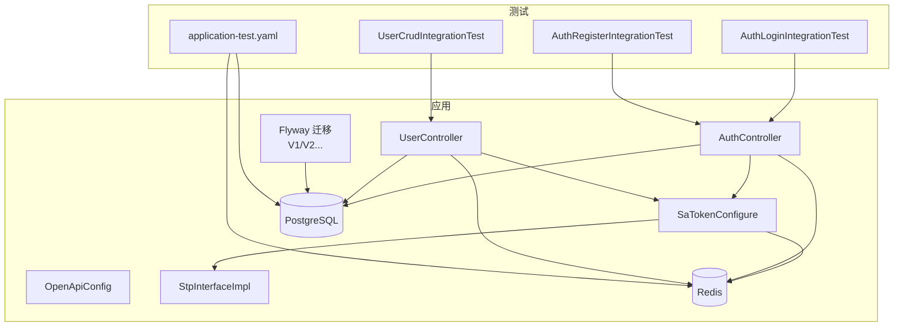
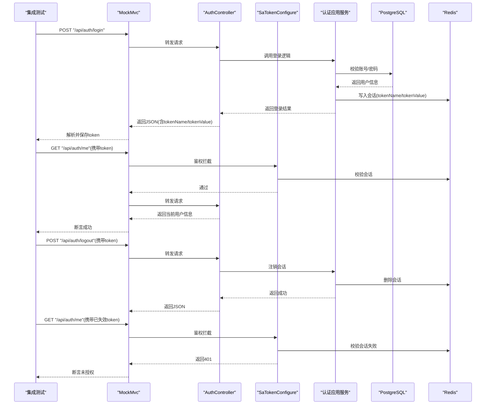
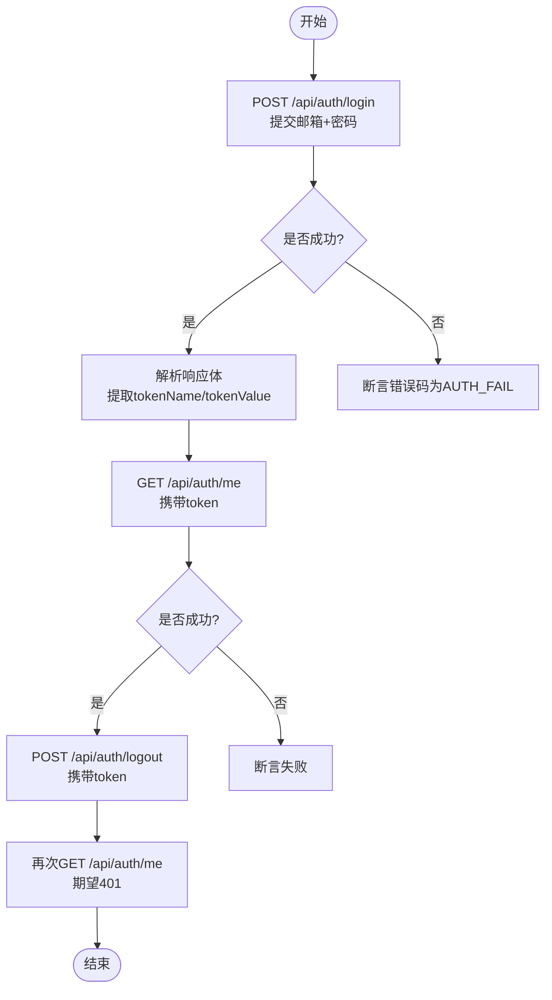
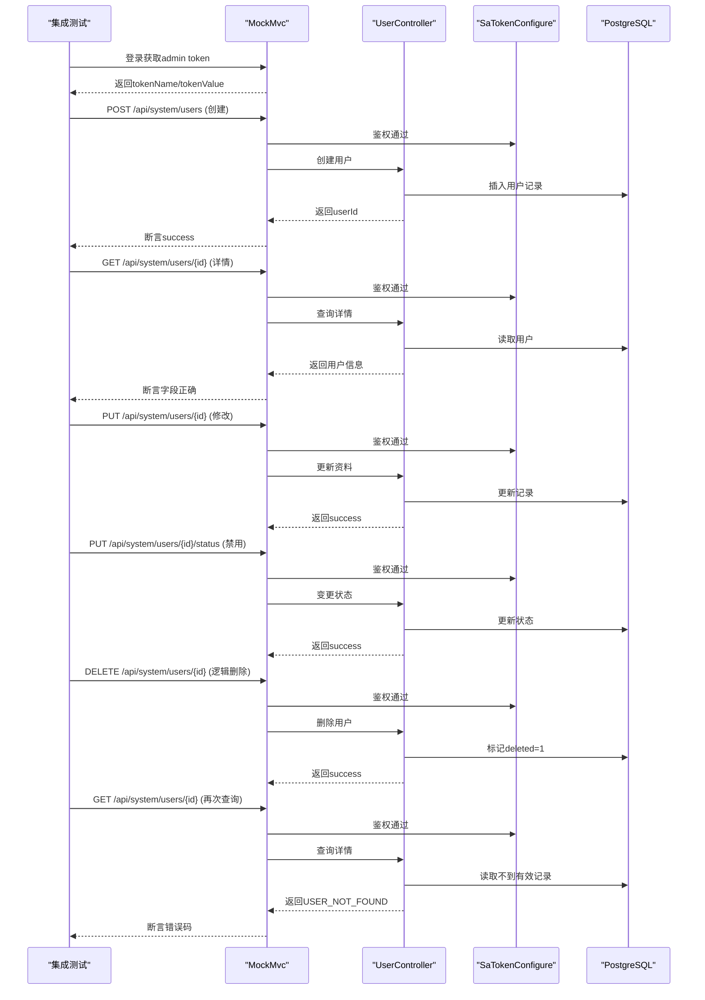
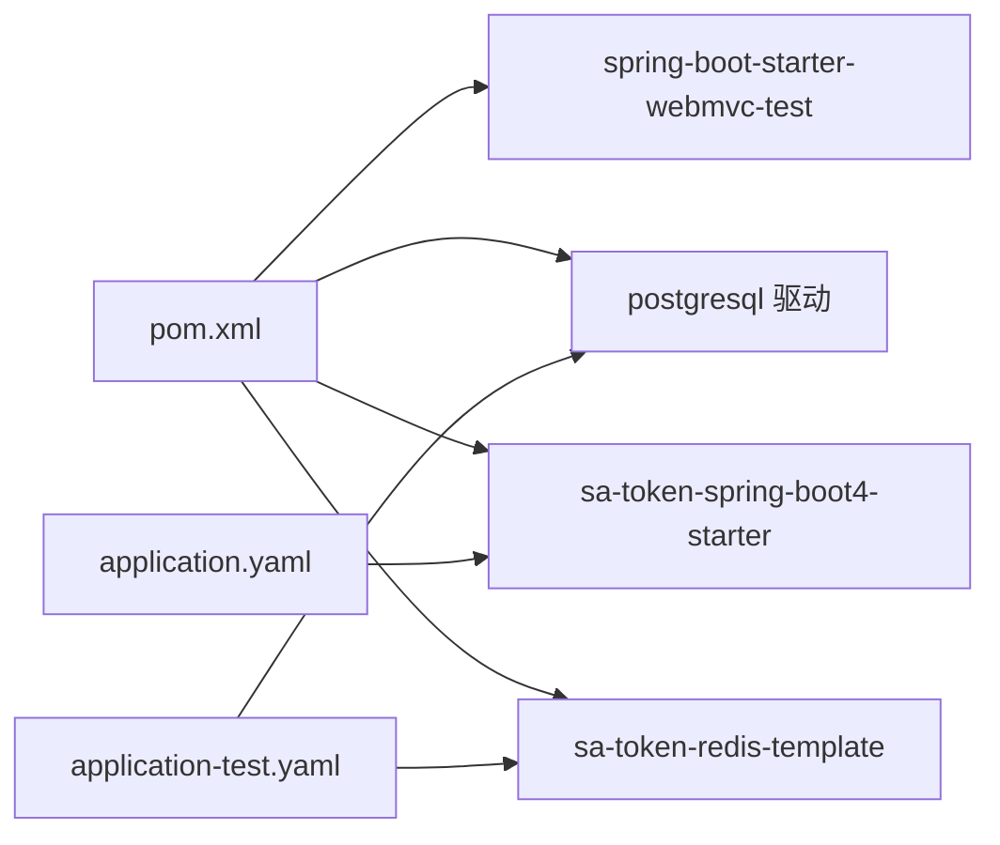

# 集成测试

<cite>
**本文引用的文件**   
- [AuthLoginIntegrationTest.java](file://src/test/java/com/sunnao/spring/ddd/template/integration/AuthLoginIntegrationTest.java)
- [UserCrudIntegrationTest.java](file://src/test/java/com/sunnao/spring/ddd/template/integration/UserCrudIntegrationTest.java)
- [AuthRegisterIntegrationTest.java](file://src/test/java/com/sunnao/spring/ddd/template/integration/AuthRegisterIntegrationTest.java)
- [application-test.yaml](file://src/test/resources/application-test.yaml)
- [application.yaml](file://src/main/resources/application.yaml)
- [AuthController.java](file://src/main/java/com/sunnao/spring/ddd/template/adaptor/auth/input/AuthController.java)
- [UserController.java](file://src/main/java/com/sunnao/spring/ddd/template/adaptor/system/user/input/UserController.java)
- [SaTokenConfigure.java](file://src/main/java/com/sunnao/spring/ddd/template/common/config/SaTokenConfigure.java)
- [OpenApiConfig.java](file://src/main/java/com/sunnao/spring/ddd/template/common/config/OpenApiConfig.java)
- [StpInterfaceImpl.java](file://src/main/java/com/sunnao/spring/ddd/template/infrastructure/auth/StpInterfaceImpl.java)
- [V1__init_sys_user.sql](file://src/main/resources/db/migration/V1__init_sys_user.sql)
- [V2__init_rbac.sql](file://src/main/resources/db/migration/V2__init_rbac.sql)
- [pom.xml](file://pom.xml)
</cite>

## 目录
1. [简介](#简介)
2. [项目结构](#项目结构)
3. [核心组件](#核心组件)
4. [架构总览](#架构总览)
5. [详细组件分析](#详细组件分析)
6. [依赖分析](#依赖分析)
7. [性能考虑](#性能考虑)
8. [故障排查指南](#故障排查指南)
9. [结论](#结论)
10. [附录](#附录)

## 简介
本指导文档面向集成测试，围绕认证与用户管理两大场景，系统阐述基于 Spring Boot + MockMvc 的 HTTP 请求-响应测试设计模式。以 AuthLoginIntegrationTest 和 UserCrudIntegrationTest 为例，完整演示登录、鉴权、会话管理与 CRUD 流程；说明测试环境配置（@SpringBootTest、@ActiveProfiles）、外部依赖隔离策略（PostgreSQL、Redis、文件存储）、测试数据准备与清理机制、异步操作与超时处理、条件跳过与 Profile 配置等最佳实践。

## 项目结构
集成测试位于 test 目录，使用 application-test.yaml 提供测试环境的数据库与 Redis 连接信息，并通过环境变量占位实现环境隔离。主应用通过 Flyway 在启动时执行 db/migration 下的迁移脚本完成建表与种子数据初始化。

图表来源
- [AuthLoginIntegrationTest.java:1-98](file://src/test/java/com/sunnao/spring/ddd/template/integration/AuthLoginIntegrationTest.java#L1-L98)
- [UserCrudIntegrationTest.java:1-144](file://src/test/java/com/sunnao/spring/ddd/template/integration/UserCrudIntegrationTest.java#L1-L144)
- [AuthRegisterIntegrationTest.java:1-42](file://src/test/java/com/sunnao/spring/ddd/template/integration/AuthRegisterIntegrationTest.java#L1-L42)
- [application-test.yaml:1-18](file://src/test/resources/application-test.yaml#L1-L18)
- [AuthController.java:1-70](file://src/main/java/com/sunnao/spring/ddd/template/adaptor/auth/input/AuthController.java#L1-L70)
- [UserController.java:1-115](file://src/main/java/com/sunnao/spring/ddd/template/adaptor/system/user/input/UserController.java#L1-L115)
- [SaTokenConfigure.java:1-31](file://src/main/java/com/sunnao/spring/ddd/template/common/config/SaTokenConfigure.java#L1-L31)
- [OpenApiConfig.java:1-41](file://src/main/java/com/sunnao/spring/ddd/template/common/config/OpenApiConfig.java#L1-L41)
- [StpInterfaceImpl.java:1-53](file://src/main/java/com/sunnao/spring/ddd/template/infrastructure/auth/StpInterfaceImpl.java#L1-L53)
- [V1__init_sys_user.sql:1-51](file://src/main/resources/db/migration/V1__init_sys_user.sql#L1-L51)
- [V2__init_rbac.sql:122-157](file://src/main/resources/db/migration/V2__init_rbac.sql#L122-L157)

章节来源
- [application-test.yaml:1-18](file://src/test/resources/application-test.yaml#L1-L18)
- [application.yaml:1-88](file://src/main/resources/application.yaml#L1-L88)

## 核心组件
- 认证接口控制器：提供登录、注册、登出、当前用户信息查询等能力，作为集成测试的请求入口。
- 用户管理接口控制器：提供用户的增删改查与状态变更，受权限控制。
- Sa-Token 拦截器：对 /api/** 进行统一鉴权，放行登录/注册与 OpenAPI 路径。
- 权限数据提供者：从 RBAC 表加载角色与权限点，支撑注解式鉴权。
- 测试类：基于 @SpringBootTest + @AutoConfigureMockMvc 发起真实 HTTP 调用，验证端到端行为。

章节来源
- [AuthController.java:1-70](file://src/main/java/com/sunnao/spring/ddd/template/adaptor/auth/input/AuthController.java#L1-L70)
- [UserController.java:1-115](file://src/main/java/com/sunnao/spring/ddd/template/adaptor/system/user/input/UserController.java#L1-L115)
- [SaTokenConfigure.java:1-31](file://src/main/java/com/sunnao/spring/ddd/template/common/config/SaTokenConfigure.java#L1-L31)
- [StpInterfaceImpl.java:1-53](file://src/main/java/com/sunnao/spring/ddd/template/infrastructure/auth/StpInterfaceImpl.java#L1-L53)

## 架构总览
下图展示一次“登录 → 查询当前用户 → 登出 → 会话失效”的端到端交互流程，涵盖 MockMvc 发起请求、Sa-Token 鉴权、Redis 会话存储与数据库校验。

图表来源
- [AuthLoginIntegrationTest.java:41-79](file://src/test/java/com/sunnao/spring/ddd/template/integration/AuthLoginIntegrationTest.java#L41-L79)
- [AuthController.java:32-68](file://src/main/java/com/sunnao/spring/ddd/template/adaptor/auth/input/AuthController.java#L32-L68)
- [SaTokenConfigure.java:20-29](file://src/main/java/com/sunnao/spring/ddd/template/common/config/SaTokenConfigure.java#L20-L29)
- [application.yaml:44-56](file://src/main/resources/application.yaml#L44-L56)

## 详细组件分析

### 认证登录集成测试（AuthLoginIntegrationTest）
- 目标：覆盖“登录 → 获取当前用户 → 登出 → 会话失效”的完整链路，并验证错误密码场景的安全提示策略。
- 关键点：
  - 使用 @EnabledIfEnvironmentVariable 确保在缺少 TEST_PG_URL / TEST_REDIS_HOST 时自动跳过。
  - 使用 @ActiveProfiles("test") 加载 application-test.yaml。
  - 使用 @AutoConfigureMockMvc 注入 MockMvc，直接发起 HTTP 请求。
  - 登录成功后从响应体中解析 tokenName 与 tokenValue，并在后续请求中以请求头形式传递。
  - 登出后再次访问需鉴权的接口应返回 401。

图表来源
- [AuthLoginIntegrationTest.java:41-96](file://src/test/java/com/sunnao/spring/ddd/template/integration/AuthLoginIntegrationTest.java#L41-L96)

章节来源
- [AuthLoginIntegrationTest.java:1-98](file://src/test/java/com/sunnao/spring/ddd/template/integration/AuthLoginIntegrationTest.java#L1-L98)

### 用户管理CRUD集成测试（UserCrudIntegrationTest）
- 目标：以管理员身份完成“创建 → 详情 → 修改 → 禁用 → 删除 → 确认不存在”的全流程，并验证分页查询包含种子管理员。
- 关键点：
  - 在每个测试用例前通过 @BeforeEach 登录获取 token，复用该 token 访问受保护接口。
  - 使用唯一标识生成随机邮箱，避免重复冲突。
  - 删除为逻辑删除，再次查询应返回 USER_NOT_FOUND。
  - 分页查询支持按邮箱过滤，断言总数至少包含种子管理员。

图表来源
- [UserCrudIntegrationTest.java:42-142](file://src/test/java/com/sunnao/spring/ddd/template/integration/UserCrudIntegrationTest.java#L42-L142)
- [UserController.java:35-113](file://src/main/java/com/sunnao/spring/ddd/template/adaptor/system/user/input/UserController.java#L35-L113)
- [SaTokenConfigure.java:20-29](file://src/main/java/com/sunnao/spring/ddd/template/common/config/SaTokenConfigure.java#L20-L29)

章节来源
- [UserCrudIntegrationTest.java:1-144](file://src/test/java/com/sunnao/spring/ddd/template/integration/UserCrudIntegrationTest.java#L1-L144)

### 匿名注册与自动登录（AuthRegisterIntegrationTest）
- 目标：验证匿名注册成功并自动登录，随后携带 token 查询当前用户，且默认授予 user 角色。
- 关键点：
  - 注册接口在 SaTokenConfigure 中放行，无需登录态即可访问。
  - 注册成功后响应体包含 tokenName/tokenValue 与 userId、roles。

章节来源
- [AuthRegisterIntegrationTest.java:1-42](file://src/test/java/com/sunnao/spring/ddd/template/integration/AuthRegisterIntegrationTest.java#L1-L42)
- [SaTokenConfigure.java:20-29](file://src/main/java/com/sunnao/spring/ddd/template/common/config/SaTokenConfigure.java#L20-L29)

### 认证与鉴权配置
- Sa-Token 全局拦截：除 /api/auth/** 外，所有 /api/** 均需登录态；OpenAPI 路径放行。
- 权限数据源：StpInterfaceImpl 从 RBAC 表加载用户角色与权限点，查询失败降级为空集合。
- OpenAPI 安全方案：定义请求头 sa-token，与 sa-token.token-name 保持一致。

章节来源
- [SaTokenConfigure.java:1-31](file://src/main/java/com/sunnao/spring/ddd/template/common/config/SaTokenConfigure.java#L1-L31)
- [StpInterfaceImpl.java:1-53](file://src/main/java/com/sunnao/spring/ddd/template/infrastructure/auth/StpInterfaceImpl.java#L1-L53)
- [OpenApiConfig.java:1-41](file://src/main/java/com/sunnao/spring/ddd/template/common/config/OpenApiConfig.java#L1-L41)
- [application.yaml:44-56](file://src/main/resources/application.yaml#L44-L56)

### 测试环境与外部依赖隔离
- 测试 Profile：@ActiveProfiles("test") 激活 application-test.yaml。
- 环境变量驱动：application-test.yaml 通过 ${TEST_PG_URL}、${TEST_REDIS_HOST} 等占位符连接外部 PostgreSQL 与 Redis。
- 条件跳过：@EnabledIfEnvironmentVariable 在未配置必要环境变量时自动跳过测试，避免本地无依赖时报错。
- 数据库迁移：Flyway 启用并指向 classpath:db/migration，启动即执行 V1/V2 等脚本完成建表与种子数据。

章节来源
- [application-test.yaml:1-18](file://src/test/resources/application-test.yaml#L1-L18)
- [application.yaml:32-36](file://src/main/resources/application.yaml#L32-L36)
- [V1__init_sys_user.sql:48-51](file://src/main/resources/db/migration/V1__init_sys_user.sql#L48-L51)
- [V2__init_rbac.sql:122-157](file://src/main/resources/db/migration/V2__init_rbac.sql#L122-L157)

### 测试数据准备与清理机制
- 种子数据：V1 插入管理员账户，V2 初始化 RBAC 权限点与角色关系，保证集成测试具备基础数据。
- 事务回滚：仓储层方法标注 @Transactional(rollbackFor = Exception.class)，在异常时回滚，保障测试间数据隔离。
- 数据工厂模式：测试中使用 IdUtil 生成唯一邮箱，避免重复；建议将常用构造封装为工厂或夹具，提升可读性与复用性。

章节来源
- [V1__init_sys_user.sql:48-51](file://src/main/resources/db/migration/V1__init_sys_user.sql#L48-L51)
- [V2__init_rbac.sql:122-157](file://src/main/resources/db/migration/V2__init_rbac.sql#L122-L157)
- [UserRepositoryImpl.java:118-156](file://src/main/java/com/sunnao/spring/ddd/template/infrastructure/system/user/repository/UserRepositoryImpl.java#L118-L156)

### 认证授权接口的测试方法
- Token 获取：登录接口返回 tokenName 与 tokenValue，后续请求以请求头方式携带。
- 权限验证：用户管理接口通过 @SaCheckPermission 控制 read/write 粒度，测试需确保 admin 拥有相应权限。
- 会话管理：登录后会话写入 Redis，登出后删除；再次访问需鉴权接口应返回 401。

章节来源
- [AuthController.java:32-68](file://src/main/java/com/sunnao/spring/ddd/template/adaptor/auth/input/AuthController.java#L32-L68)
- [UserController.java:35-113](file://src/main/java/com/sunnao/spring/ddd/template/adaptor/system/user/input/UserController.java#L35-L113)
- [application.yaml:44-56](file://src/main/resources/application.yaml#L44-L56)

### 异步操作的测试策略与超时处理
- 登录日志事件：登录成功/失败均发布登录日志事件，采用异步落库。集成测试可关注最终一致性，必要时增加等待或重试断言。
- 超时处理：若涉及长耗时异步任务，可在测试中设置合理超时或使用同步化替代（如临时关闭异步），以保证测试稳定性。

章节来源
- [AuthController.java:32-68](file://src/main/java/com/sunnao/spring/ddd/template/adaptor/auth/input/AuthController.java#L32-L68)

### 测试环境的条件跳过机制与Profile配置
- 条件跳过：@EnabledIfEnvironmentVariable 用于检测 TEST_PG_URL 与 TEST_REDIS_HOST，缺失则跳过测试。
- Profile：@ActiveProfiles("test") 指定 application-test.yaml，确保使用测试环境的数据库与 Redis 配置。

章节来源
- [AuthLoginIntegrationTest.java:28-32](file://src/test/java/com/sunnao/spring/ddd/template/integration/AuthLoginIntegrationTest.java#L28-L32)
- [UserCrudIntegrationTest.java:28-32](file://src/test/java/com/sunnao/spring/ddd/template/integration/UserCrudIntegrationTest.java#L28-L32)
- [application-test.yaml:1-18](file://src/test/resources/application-test.yaml#L1-L18)

## 依赖分析
- 测试依赖：spring-boot-starter-webmvc-test 提供 MockMvc 能力。
- 运行时依赖：PostgreSQL 驱动、Sa-Token 及其 Redis 集成，支撑认证与会话持久化。
- 配置依赖：application.yaml 与 application-test.yaml 分别定义生产与测试环境参数。

图表来源
- [pom.xml:70-112](file://pom.xml#L70-L112)
- [application.yaml:1-88](file://src/main/resources/application.yaml#L1-L88)
- [application-test.yaml:1-18](file://src/test/resources/application-test.yaml#L1-L18)

章节来源
- [pom.xml:70-112](file://pom.xml#L70-L112)

## 性能考虑
- 集成测试应避免不必要的网络开销，尽量复用 MockMvc 实例与登录态。
- 合理使用分页与过滤参数，减少大数据量查询带来的测试时间波动。
- 对于异步落库场景，可通过短暂等待或调整测试策略降低偶发失败概率。

## 故障排查指南
- 401 未授权：检查是否在请求头正确携带 tokenName/tokenValue，以及 SaTokenConfigure 的路径放行规则。
- 登录失败：核对 application-test.yaml 的环境变量是否正确，确认 Flyway 迁移是否执行成功，种子管理员是否存在。
- 权限不足：确认 RBAC 数据已初始化，用户角色与权限点映射正确。
- 上下文启动失败：检查 PostgreSQL/Redis 连通性，确保环境变量齐全。

章节来源
- [SaTokenConfigure.java:20-29](file://src/main/java/com/sunnao/spring/ddd/template/common/config/SaTokenConfigure.java#L20-L29)
- [application-test.yaml:1-18](file://src/test/resources/application-test.yaml#L1-L18)
- [V1__init_sys_user.sql:48-51](file://src/main/resources/db/migration/V1__init_sys_user.sql#L48-L51)
- [V2__init_rbac.sql:122-157](file://src/main/resources/db/migration/V2__init_rbac.sql#L122-L157)

## 结论
通过 @SpringBootTest + @AutoConfigureMockMvc 的组合，结合 application-test.yaml 与 @EnabledIfEnvironmentVariable，可以构建稳定、可移植的集成测试套件。以认证与用户管理为核心场景，能够全面覆盖登录、鉴权、会话与 CRUD 流程。借助 Flyway 与事务回滚，测试数据具备良好隔离性与可重复性。建议在团队内推广统一的测试夹具与数据工厂模式，进一步提升测试的可维护性与可读性。

## 附录
- 关键注解速览：
  - @SpringBootTest：加载完整 Spring 上下文，启动 Web 容器。
  - @AutoConfigureMockMvc：注入 MockMvc，便于发起 HTTP 请求。
  - @ActiveProfiles("test")：激活测试配置文件。
  - @EnabledIfEnvironmentVariable：根据环境变量决定是否运行测试。
- 参考路径：
  - 认证接口：/api/auth/login、/api/auth/register、/api/auth/logout、/api/auth/me
  - 用户管理接口：/api/system/users/*