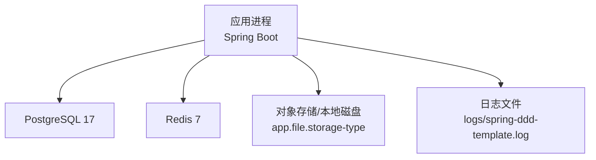
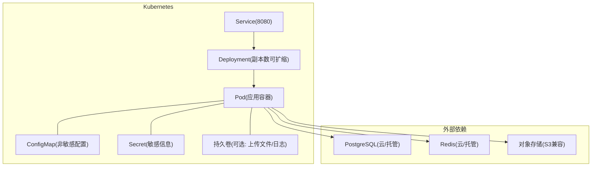
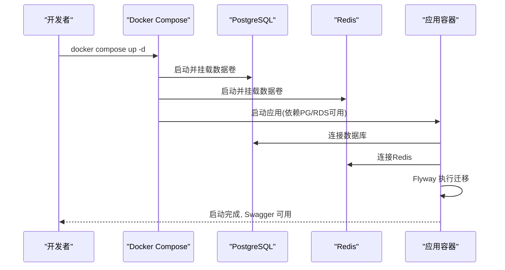
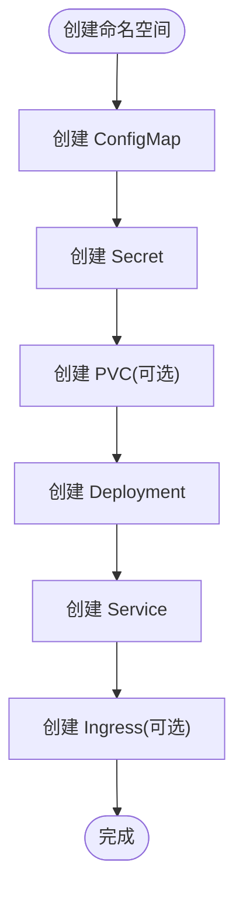
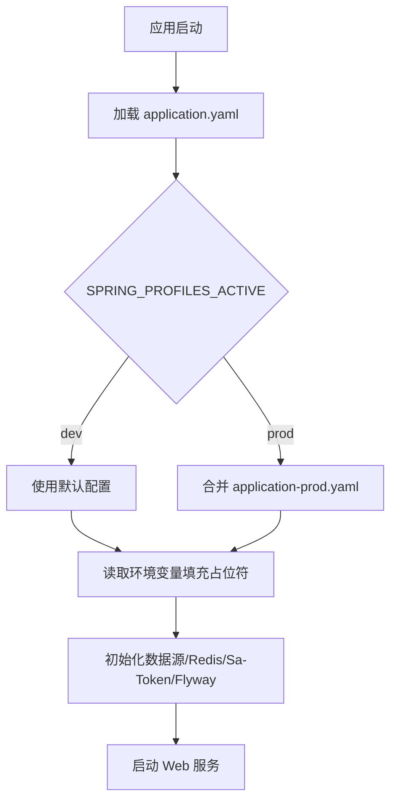
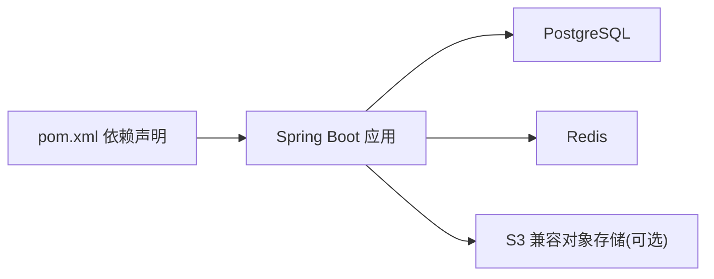

# 容器化部署

<cite>
**本文引用的文件列表**
- [README.md](file://README.md)
- [docker-compose.yaml](file://docker-compose.yaml)
- [pom.xml](file://pom.xml)
- [application.yaml](file://src/main/resources/application.yaml)
- [application-prod.yaml](file://src/main/resources/application-prod.yaml)
- [logback-spring.xml](file://src/main/resources/logback-spring.xml)
</cite>

## 目录
1. [简介](#简介)
2. [项目结构](#项目结构)
3. [核心组件](#核心组件)
4. [架构总览](#架构总览)
5. [详细组件分析](#详细组件分析)
6. [依赖关系分析](#依赖关系分析)
7. [性能与容量规划](#性能与容量规划)
8. [故障排查指南](#故障排查指南)
9. [结论](#结论)
10. [附录](#附录)

## 简介
本指南面向生产与测试环境的容器化交付，围绕以下目标展开：
- Docker 镜像构建流程与优化（多阶段构建、分层策略）
- Docker Compose 编排（服务依赖、环境变量、数据卷、网络）
- Kubernetes 部署方案（Deployment、Service、ConfigMap、Secret、健康检查、滚动更新）
- 本地开发快速启动与测试环境部署流程
- 生产最佳实践与常见问题排查

说明：当前仓库未包含 Dockerfile 与 K8s 清单。本节提供基于现有配置与依赖的落地方案与示例路径，便于直接复用。

## 项目结构
本项目为 Spring Boot 应用，使用 PostgreSQL 与 Redis 作为外部依赖，通过 Flyway 进行数据库迁移，日志采用 Logback 输出到文件与控制台。

**图示来源**
- [application.yaml:1-88](file://src/main/resources/application.yaml#L1-L88)
- [logback-spring.xml:1-43](file://src/main/resources/logback-spring.xml#L1-L43)

**章节来源**
- [README.md:1-182](file://README.md#L1-L182)
- [application.yaml:1-88](file://src/main/resources/application.yaml#L1-L88)
- [logback-spring.xml:1-43](file://src/main/resources/logback-spring.xml#L1-L43)

## 核心组件
- 应用运行期依赖
  - Java 25 + Spring Boot 4.x
  - MyBatis-Flex + PostgreSQL JDBC
  - Sa-Token（会话存 Redis）
  - springdoc-openapi（Swagger UI）
  - Flyway（数据库迁移）
  - AWS SDK v2 S3（可选对象存储）
- 运行时配置
  - 数据源、Redis、Sa-Token、springdoc、Flyway、文件存储等全部通过 application.yaml 与环境变量注入
  - 生产环境关闭 swagger-ui 与 api-docs

**章节来源**
- [pom.xml:1-217](file://pom.xml#L1-L217)
- [application.yaml:1-88](file://src/main/resources/application.yaml#L1-L88)
- [application-prod.yaml:1-7](file://src/main/resources/application-prod.yaml#L1-L7)

## 架构总览
下图展示容器化后的典型部署形态：Kubernetes 中运行应用 Pod，通过 Service 暴露 HTTP；应用连接外部 PostgreSQL 与 Redis；日志落盘并通过 Sidecar 或 DaemonSet 采集。

[此图为概念性架构图，不映射具体源码文件]

## 详细组件分析

### Docker 镜像构建与优化
建议采用多阶段构建，将编译产物与运行环境分离，减小最终镜像体积并提升安全性。

- 构建阶段
  - 使用 JDK 25 镜像执行 Maven 构建，生成可执行的 fat jar
  - 仅保留必要的构建缓存层，利用 .m2 缓存加速重复构建
- 运行阶段
  - 使用精简 JRE 基础镜像（如 Eclipse Temurin JRE 25）
  - 设置时区、JVM 参数（G1GC、堆大小）、用户权限
  - 以非 root 用户运行，最小化文件系统权限
- 分层策略
  - 将依赖层与应用代码层拆分，提高缓存命中率
  - 将配置文件与二进制分离，便于热更新配置
- 安全加固
  - 扫描镜像漏洞，定期更新基础镜像
  - 禁用不必要的系统包与工具
- 示例参考路径
  - 构建脚本与插件：[pom.xml:153-214](file://pom.xml#L153-L214)
  - 应用入口与属性加载：[application.yaml:1-20](file://src/main/resources/application.yaml#L1-L20)

[本节为通用指导，不直接分析具体源码文件]

### Docker Compose 编排
仓库已提供本地开发编排，用于一键拉起 PostgreSQL 与 Redis，配合 Flyway 自动建表与种子数据。

- 服务定义
  - postgres: 端口 5432，数据持久化卷，健康检查
  - redis: 端口 6379，数据持久化卷，健康检查
- 环境变量
  - 数据库名、用户名、密码通过 POSTGRES_* 注入
  - 应用侧通过 application.yaml 的环境变量占位读取
- 数据卷
  - postgres-data、redis-data 持久化
- 网络
  - 默认 bridge 网络，服务间通过服务名访问
- 使用方式
  - docker compose up -d
  - 应用启动后 Flyway 自动执行 db/migration 下的脚本

**图示来源**
- [docker-compose.yaml:1-37](file://docker-compose.yaml#L1-L37)
- [application.yaml:9-20](file://src/main/resources/application.yaml#L9-L20)
- [README.md:64-74](file://README.md#L64-L74)

**章节来源**
- [docker-compose.yaml:1-37](file://docker-compose.yaml#L1-L37)
- [application.yaml:1-88](file://src/main/resources/application.yaml#L1-L88)
- [README.md:64-74](file://README.md#L64-L74)

### Kubernetes 部署方案
以下为生产环境推荐资源清单要点（示例字段与命名空间需按实际调整）。

- Deployment
  - 副本数：根据 QPS 与 CPU/内存限制设定
  - 镜像：从私有镜像仓库拉取
  - 环境变量：通过 ConfigMap/Secret 注入
  - 健康检查：liveness/readiness/probe
  - 资源限制：requests/limits（CPU、内存）
  - 滚动更新：strategy.rollingUpdate
- Service
  - ClusterIP 暴露 8080 端口
- ConfigMap
  - 非敏感配置：如 app.file.local.base-path、springdoc 开关等
- Secret
  - 敏感信息：DB_USERNAME、DB_PASSWORD、REDIS_PASSWORD、S3_ACCESS_KEY、S3_SECRET_KEY 等
- 持久卷（可选）
  - 若启用本地文件存储，挂载 PVC 到 app.file.local.base-path
- Ingress（可选）
  - 对外暴露 HTTPS，配置域名与证书

[此图为概念性流程图，不映射具体源码文件]

**章节来源**
- [application.yaml:1-88](file://src/main/resources/application.yaml#L1-L88)
- [application-prod.yaml:1-7](file://src/main/resources/application-prod.yaml#L1-L7)

### 环境变量与配置管理
- 数据源与 Redis
  - DB_HOST、DB_PORT、DB_NAME、DB_USERNAME、DB_PASSWORD
  - REDIS_HOST、REDIS_PORT、REDIS_PASSWORD、REDIS_DATABASE、REDIS_SSL
- Sa-Token
  - token-name、timeout、is-read-header 等由 application.yaml 固定或通过覆盖
- 文件存储
  - app.file.storage-type: local|s3
  - 本地：app.file.local.base-path
  - S3：S3_ENDPOINT、S3_REGION、S3_ACCESS_KEY、S3_SECRET_KEY、S3_BUCKET、S3_PATH_STYLE_ACCESS
- 日志
  - logging.file.path（默认 logs），结合 logback-spring.xml 输出到文件与控制台
- 生产开关
  - application-prod.yaml 关闭 swagger-ui 与 api-docs

**图示来源**
- [application.yaml:1-20](file://src/main/resources/application.yaml#L1-L20)
- [application.yaml:9-20](file://src/main/resources/application.yaml#L9-L20)
- [application.yaml:64-88](file://src/main/resources/application.yaml#L64-L88)
- [application-prod.yaml:1-7](file://src/main/resources/application-prod.yaml#L1-L7)

**章节来源**
- [application.yaml:1-88](file://src/main/resources/application.yaml#L1-L88)
- [application-prod.yaml:1-7](file://src/main/resources/application-prod.yaml#L1-L7)

### 健康检查与就绪探针
- LivenessProbe
  - 探测 /actuator/health 或自定义 /healthz，失败则重启容器
- ReadinessProbe
  - 探测 /actuator/health 或 /readyz，失败则从 Service 摘除流量
- StartupProbe
  - 针对冷启动较慢场景，避免 liveness 误杀
- 探针实现建议
  - 在应用内暴露轻量端点，返回 200 表示存活/就绪
  - 结合数据库/Redis 连通性检测，确保真正可用

[本节为通用指导，不直接分析具体源码文件]

### 资源限制与弹性伸缩
- requests/limits
  - 根据压测结果设置合理的 CPU/内存请求与限制
- 水平扩展
  - 基于 HPA 按 CPU/内存或自定义指标扩容
- 优雅停机
  - 合理设置 terminationGracePeriodSeconds，确保请求处理完成

[本节为通用指导，不直接分析具体源码文件]

### 滚动更新策略
- strategy.rollingUpdate
  - maxSurge/maxUnavailable 控制发布节奏
- 蓝绿/金丝雀
  - 借助 Ingress 权重或 ServiceSelector 切换流量
- 回滚
  - kubectl rollout undo 快速回退

[本节为通用指导，不直接分析具体源码文件]

### 本地开发快速启动
- 启动依赖
  - docker compose up -d
- 启动应用
  - mvn spring-boot:run（默认 dev 环境）
- 验证
  - 访问 Swagger UI：http://localhost:8080/swagger-ui.html
  - 使用内置管理员账号登录

**章节来源**
- [README.md:64-74](file://README.md#L64-L74)
- [docker-compose.yaml:1-37](file://docker-compose.yaml#L1-L37)

### 测试环境部署流程
- 准备测试数据库与 Redis（或使用独立 K8s 命名空间）
- 通过环境变量注入 TEST_PG_URL、TEST_REDIS_HOST 等
- 运行集成测试：mvn test
- 自动化流水线
  - 构建镜像 → 推送镜像仓库 → 部署到测试命名空间 → 执行冒烟测试

**章节来源**
- [README.md:129-146](file://README.md#L129-L146)
- [application-test.yaml:1-17](file://src/test/resources/application-test.yaml#L1-L17)

## 依赖关系分析
- 运行时依赖
  - PostgreSQL：JDBC 驱动与 Flyway 迁移
  - Redis：Sa-Token 会话、分布式锁、字典缓存
  - 对象存储：S3 兼容（可选）
- 构建依赖
  - Spring Boot Maven Plugin 打包
  - MapStruct、MyBatis-Flex、Lombok 注解处理器

**图示来源**
- [pom.xml:28-151](file://pom.xml#L28-L151)
- [application.yaml:9-20](file://src/main/resources/application.yaml#L9-L20)
- [application.yaml:64-88](file://src/main/resources/application.yaml#L64-L88)

**章节来源**
- [pom.xml:1-217](file://pom.xml#L1-L217)
- [application.yaml:1-88](file://src/main/resources/application.yaml#L1-L88)

## 性能与容量规划
- JVM 调优
  - 使用 G1GC，合理设置堆大小与元空间
  - 开启容器感知参数（-XX:+UseContainerSupport）
- 连接池
  - 根据并发与延迟要求调整 Redis Lettuce 连接池与数据库连接池
- 日志
  - 生产环境降低日志级别，控制文件大小与保留天数
- 存储
  - 本地文件存储需评估 IOPS 与容量；优先使用对象存储

[本节为通用指导，不直接分析具体源码文件]

## 故障排查指南
- 启动失败
  - 检查数据库/Redis 连通性与凭据
  - 查看 Flyway 迁移是否成功
- 鉴权异常
  - 确认 Sa-Token 头 satoken 是否正确传递
  - 检查 Redis 中会话是否过期或被清理
- 文件上传失败
  - 校验 app.file.max-size 与 multipart 限制一致
  - 本地存储检查 base-path 权限；S3 检查 endpoint/bucket/密钥
- 日志定位
  - 查看 logs/spring-ddd-template.log，关注 traceId 链路
- 常见错误码
  - 全局异常处理统一返回 ResultDO，结合操作日志切面定位问题

**章节来源**
- [application.yaml:27-36](file://src/main/resources/application.yaml#L27-L36)
- [application.yaml:64-88](file://src/main/resources/application.yaml#L64-L88)
- [logback-spring.xml:1-43](file://src/main/resources/logback-spring.xml#L1-L43)
- [README.md:119-128](file://README.md#L119-L128)

## 结论
通过多阶段构建与精简运行镜像，结合 Compose/K8s 的标准化编排，可实现从本地到生产的统一交付体验。生产环境应严格遵循健康检查、资源限制、滚动更新与安全加固的最佳实践，并以环境变量与配置中心化管理配置与密钥，保障可观测性与可运维性。

## 附录
- 关键配置项速查
  - 数据源：DB_HOST、DB_PORT、DB_NAME、DB_USERNAME、DB_PASSWORD
  - Redis：REDIS_HOST、REDIS_PORT、REDIS_PASSWORD、REDIS_DATABASE、REDIS_SSL
  - 文件存储：app.file.storage-type、app.file.local.base-path、S3_*
  - 日志：logging.file.path
  - 环境激活：SPRING_PROFILES_ACTIVE=prod

**章节来源**
- [application.yaml:1-88](file://src/main/resources/application.yaml#L1-L88)
- [application-prod.yaml:1-7](file://src/main/resources/application-prod.yaml#L1-L7)