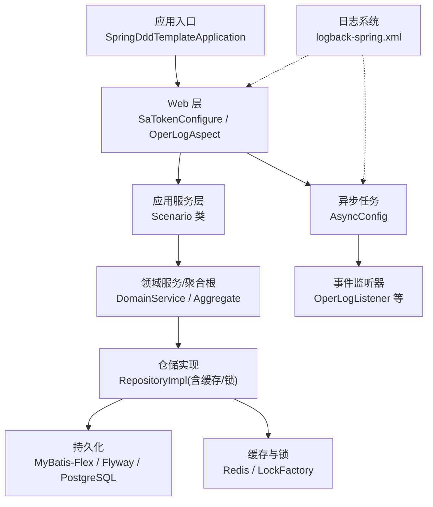
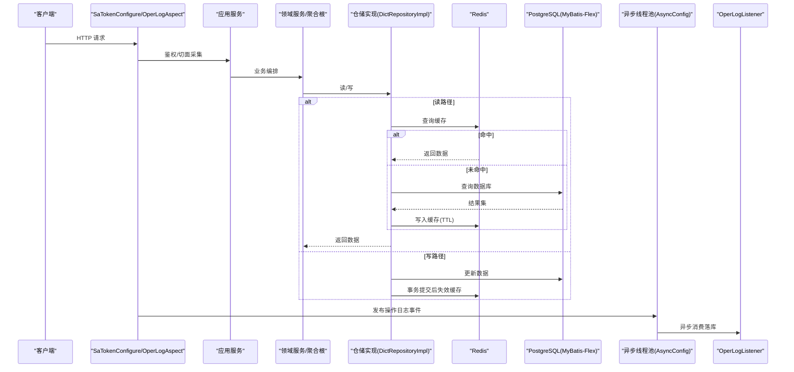
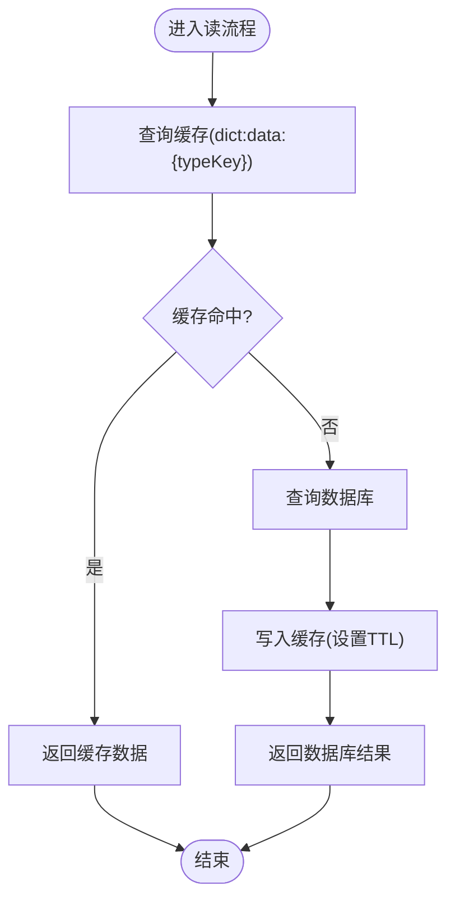
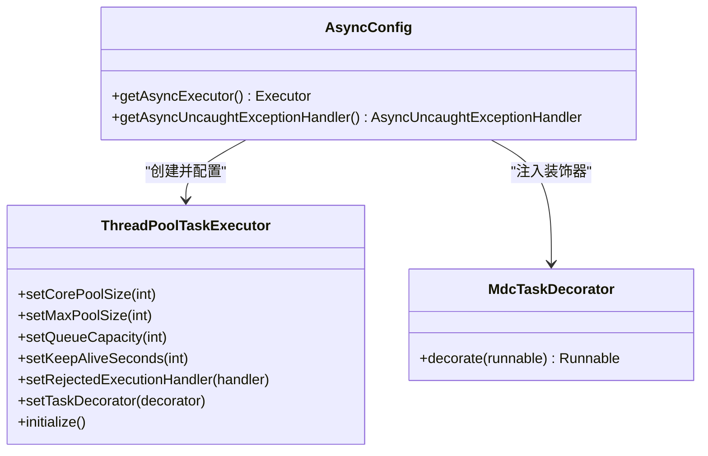
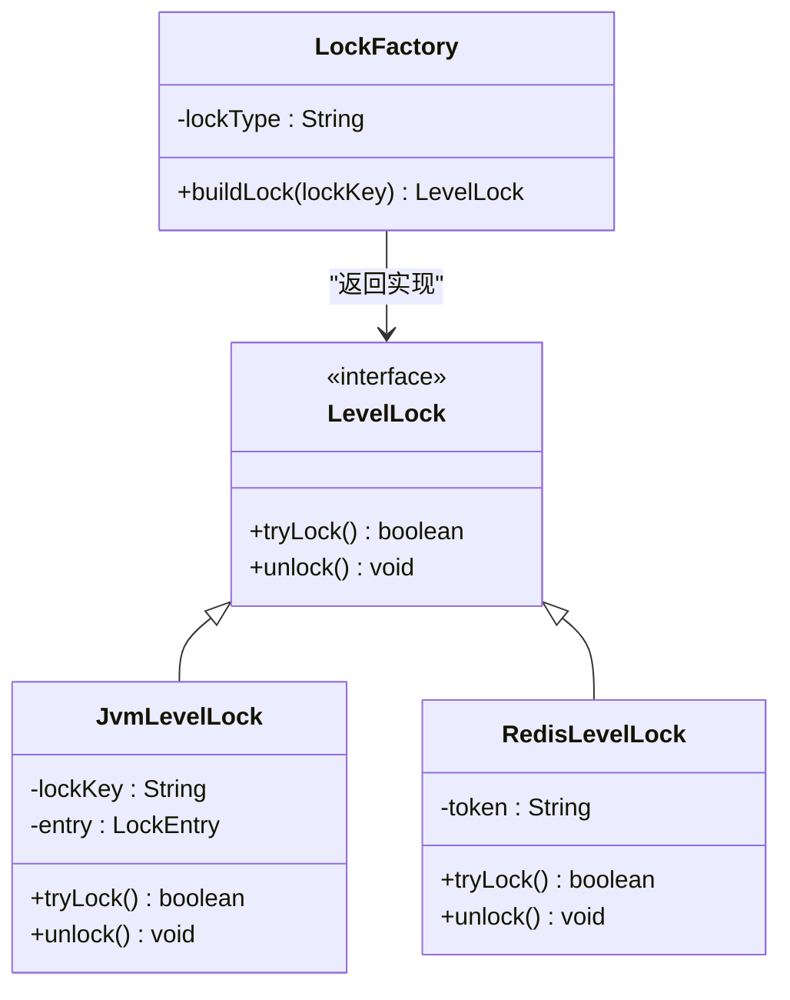
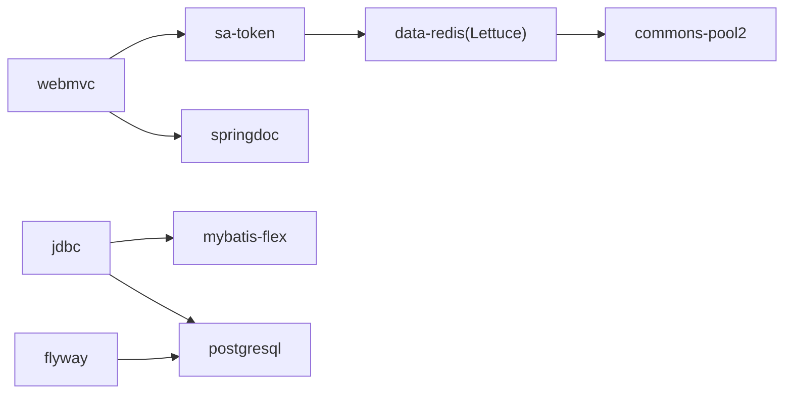

# 性能优化

<cite>
**本文引用的文件**
- [pom.xml](file://pom.xml)
- [application.yaml](file://src/main/resources/application.yaml)
- [application-prod.yaml](file://src/main/resources/application-prod.yaml)
- [AsyncConfig.java](file://src/main/java/com/sunnao/spring/ddd/template/common/config/AsyncConfig.java)
- [MybatisFlexConfigure.java](file://src/main/java/com/sunnao/spring/ddd/template/common/config/MybatisFlexConfigure.java)
- [SaTokenConfigure.java](file://src/main/java/com/sunnao/spring/ddd/template/common/config/SaTokenConfigure.java)
- [DictRepositoryImpl.java](file://src/main/java/com/sunnao/spring/ddd/template/infrastructure/system/dict/repository/DictRepositoryImpl.java)
- [LoginAttemptLimiter.java](file://src/main/java/com/sunnao/spring/ddd/template/common/security/LoginAttemptLimiter.java)
- [LockFactory.java](file://src/main/java/com/sunnao/spring/ddd/template/common/lock/LockFactory.java)
- [JvmLevelLock.java](file://src/main/java/com/sunnao/spring/ddd/template/common/lock/JvmLevelLock.java)
- [RedisLevelLock.java](file://src/main/java/com/sunnao/spring/ddd/template/common/lock/RedisLevelLock.java)
- [OperLogAspect.java](file://src/main/java/com/sunnao/spring/ddd/template/adaptor/common/OperLogAspect.java)
- [logback-spring.xml](file://src/main/resources/logback-spring.xml)
- [README.md](file://README.md)
</cite>

## 目录
1. [简介](#简介)
2. [项目结构](#项目结构)
3. [核心组件](#核心组件)
4. [架构总览](#架构总览)
5. [详细组件分析](#详细组件分析)
6. [依赖分析](#依赖分析)
7. [性能考虑](#性能考虑)
8. [故障排查指南](#故障排查指南)
9. [结论](#结论)
10. [附录](#附录)

## 简介
本指南面向生产环境的性能调优，围绕 JVM、数据库连接池与 SQL、Redis 缓存、Web 层（Tomcat）、异步处理与消息化、以及性能测试方法展开。文档结合仓库现有配置与实现，给出可落地的参数建议、流程优化与排障要点，帮助在保障一致性与稳定性的前提下提升吞吐与降低延迟。

## 项目结构
本项目基于 Spring Boot 4.x + MyBatis-Flex + Redis + PostgreSQL，采用 DDD 分层组织代码。与性能相关的关键位置包括：
- Web 与安全拦截：Sa-Token 路由拦截、全局异常、操作日志切面
- 数据访问：MyBatis-Flex 审计监听、Flyway 迁移、PostgreSQL 驱动
- 缓存与锁：Redis 缓存读写、分布式/单机锁工厂
- 异步：统一线程池与 MDC 透传
- 日志：Logback 滚动策略与 traceId 链路

图表来源
- [SaTokenConfigure.java:17-31](file://src/main/java/com/sunnao/spring/ddd/template/common/config/SaTokenConfigure.java#L17-L31)
- [OperLogAspect.java:75-99](file://src/main/java/com/sunnao/spring/ddd/template/adaptor/common/OperLogAspect.java#L75-L99)
- [AsyncConfig.java:28-40](file://src/main/java/com/sunnao/spring/ddd/template/common/config/AsyncConfig.java#L28-L40)
- [DictRepositoryImpl.java:311-345](file://src/main/java/com/sunnao/spring/ddd/template/infrastructure/system/dict/repository/DictRepositoryImpl.java#L311-L345)
- [MybatisFlexConfigure.java:20-27](file://src/main/java/com/sunnao/spring/ddd/template/common/config/MybatisFlexConfigure.java#L20-L27)
- [logback-spring.xml:23-42](file://src/main/resources/logback-spring.xml#L23-L42)

章节来源
- [pom.xml:1-217](file://pom.xml#L1-L217)
- [application.yaml:1-88](file://src/main/resources/application.yaml#L1-L88)

## 核心组件
- 异步线程池：提供统一的 @Async 执行器，设置核心/最大线程数、队列容量、保活时间、拒绝策略与 MDC 透传，确保日志链路完整并具备背压能力。
- 安全与鉴权：Sa-Token 对 /api/** 进行登录态校验，开放 OpenAPI 路径；支持信任 X-Forwarded-For（需显式开启）。
- 数据访问：MyBatis-Flex 自动填充审计字段；Flyway 管理脚本；PostgreSQL 驱动。
- 缓存与一致性：字典数据按 typeKey 缓存，写后事务提交再失效；失败降级直查 DB。
- 锁机制：通过 LockFactory 选择 Redis 或 JVM 锁，避免热点并发冲突。
- 日志：Logback 按天+大小滚动，保留周期与总量上限可控，输出包含 traceId。

章节来源
- [AsyncConfig.java:28-40](file://src/main/java/com/sunnao/spring/ddd/template/common/config/AsyncConfig.java#L28-L40)
- [SaTokenConfigure.java:17-31](file://src/main/java/com/sunnao/spring/ddd/template/common/config/SaTokenConfigure.java#L17-L31)
- [MybatisFlexConfigure.java:20-27](file://src/main/java/com/sunnao/spring/ddd/template/common/config/MybatisFlexConfigure.java#L20-L27)
- [DictRepositoryImpl.java:311-345](file://src/main/java/com/sunnao/spring/ddd/template/infrastructure/system/dict/repository/DictRepositoryImpl.java#L311-L345)
- [LockFactory.java:16-40](file://src/main/java/com/sunnao/spring/ddd/template/common/lock/LockFactory.java#L16-L40)
- [logback-spring.xml:23-42](file://src/main/resources/logback-spring.xml#L23-L42)

## 架构总览
下图展示一次典型请求从接入到落库/缓存的调用链，以及异步日志落库的流程。

图表来源
- [SaTokenConfigure.java:17-31](file://src/main/java/com/sunnao/spring/ddd/template/common/config/SaTokenConfigure.java#L17-L31)
- [OperLogAspect.java:75-99](file://src/main/java/com/sunnao/spring/ddd/template/adaptor/common/OperLogAspect.java#L75-L99)
- [AsyncConfig.java:28-40](file://src/main/java/com/sunnao/spring/ddd/template/common/config/AsyncConfig.java#L28-L40)
- [DictRepositoryImpl.java:311-345](file://src/main/java/com/sunnao/spring/ddd/template/infrastructure/system/dict/repository/DictRepositoryImpl.java#L311-L345)

## 详细组件分析

### 1) JVM 参数调优（堆内存与 GC）
说明
- 当前仓库未内嵌 JVM 启动参数，建议在容器或进程管理器中传入。
- 推荐基线（可按 CPU 核数与负载微调）：
  - 堆大小：-Xms 与 -Xmx 设为相同值，避免运行时扩容抖动
  - 新生代比例：-XX:NewRatio=2（经验值，视对象分配特征调整）
  - 元空间：-XX:MetaspaceSize=256m -XX:MaxMetaspaceSize=512m
  - GC 日志：-Xlog:gc*:file=logs/gc.log:time,uptime,level,tags:filecount=7,filesize=100M
  - 关闭不必要的调试开关，减少额外开销
- 监控与验证：结合 GC 日志与外部监控（如 Prometheus/Grafana）观察停顿时间与吞吐量。

章节来源
- [README.md:117-146](file://README.md#L117-L146)

### 2) 数据库连接池与 SQL 优化
现状
- 使用 spring-boot-starter-jdbc + mybatis-flex-spring-boot4-starter + PostgreSQL 驱动；默认连接池由 Spring Boot 自动装配（非 HikariCP）。
- 已启用 Flyway 迁移，便于版本演进与回滚。

建议
- 连接池选型
  - 若希望使用 HikariCP，可在依赖中引入对应 starter 并覆盖 DataSource 配置；否则沿用默认连接池并按其属性调优。
  - 关键参数方向：最大连接数、空闲超时、连接存活时间、获取连接超时、SQL 超时等。
- SQL 与索引
  - 针对高频查询建立合适索引，避免全表扫描；分页查询尽量使用覆盖索引或延迟关联。
  - 避免 N+1 查询，批量读取与合并结果。
- 审计与通用字段
  - 利用 MyBatis-Flex 插入/更新监听器自动填充审计字段，减少手写样板代码带来的性能损耗。

章节来源
- [pom.xml:28-80](file://pom.xml#L28-L80)
- [application.yaml:32-36](file://src/main/resources/application.yaml#L32-L36)
- [MybatisFlexConfigure.java:20-27](file://src/main/java/com/sunnao/spring/ddd/template/common/config/MybatisFlexConfigure.java#L20-L27)

### 3) Redis 缓存优化
现状
- 使用 spring-boot-starter-data-redis，客户端为 Lettuce，内置连接池参数（max-active/max-idle/min-idle）。
- 字典数据按 typeKey 缓存，写后在事务提交后失效，失败降级直查 DB。
- 登录防爆破限制器基于 Redis 固定窗口计数，异常时 fail-open。

建议
- 连接池
  - 根据并发度与 Redis 实例规格调整 max-active/max-idle/min-idle，避免连接耗尽或过多上下文切换。
- 缓存穿透防护
  - 对不存在的数据写入空值短 TTL，或使用布隆过滤器前置拦截。
- 热点数据
  - 热点 key 加本地二级缓存（注意一致性边界），或采用随机过期时间分散雪崩风险。
- 一致性保证
  - 采用“先更新 DB，再删除缓存”的策略；本项目已在事务提交后失效缓存，避免脏读窗口。
- 限流与熔断
  - 对 Redis 敏感操作增加重试与熔断降级，防止级联故障。

图表来源
- [DictRepositoryImpl.java:311-345](file://src/main/java/com/sunnao/spring/ddd/template/infrastructure/system/dict/repository/DictRepositoryImpl.java#L311-L345)
- [application.yaml:14-26](file://src/main/resources/application.yaml#L14-L26)

章节来源
- [application.yaml:14-26](file://src/main/resources/application.yaml#L14-L26)
- [DictRepositoryImpl.java:311-345](file://src/main/java/com/sunnao/spring/ddd/template/infrastructure/system/dict/repository/DictRepositoryImpl.java#L311-L345)
- [LoginAttemptLimiter.java:1-41](file://src/main/java/com/sunnao/spring/ddd/template/common/security/LoginAttemptLimiter.java#L1-L41)

### 4) Web 层性能优化（Tomcat 连接器、静态资源、压缩）
现状
- 使用 spring-boot-starter-webmvc，默认嵌入 Tomcat。
- 上传大小限制在 servlet.multipart 中配置。
- 生产环境关闭 swagger-ui 与 api-docs。

建议
- Tomcat 连接器
  - 调整 max-threads、accept-count、connection-timeout、keep-alive-timeout 等，匹配 CPU 核数与网络模型。
  - 合理设置 keep-alive 以复用连接，减少握手开销。
- 静态资源
  - 将静态资源交由反向代理（Nginx）缓存与压缩，后端仅处理动态接口。
- 响应压缩
  - 开启 gzip/br 压缩，优先压缩文本型响应体，二进制大文件建议前端或 CDN 侧处理。

章节来源
- [application.yaml:27-31](file://src/main/resources/application.yaml#L27-L31)
- [application-prod.yaml:1-7](file://src/main/resources/application-prod.yaml#L1-L7)

### 5) 异步处理优化（线程池、消息队列、批处理）
现状
- 统一异步线程池：core=4、max=8、queue=200、keepAlive=60s，拒绝策略 CallerRunsPolicy，MDC 透传。
- 操作日志通过事件发布，@Async 监听器消费落库，不阻塞主流程。

建议
- 线程池
  - 根据任务类型（CPU/IO）与 QPS 调整 core/max/queue；对 IO 密集可适当增大线程数。
  - 保持 CallerRunsPolicy 作为背压手段，避免任务丢失。
- 消息队列集成
  - 对于高吞吐场景，可将事件投递至 MQ（如 Kafka/RabbitMQ），消费者独立扩缩容。
- 批处理
  - 批量入库/批量更新，减少往返次数；分片写入避免单条过大事务。

图表来源
- [AsyncConfig.java:28-40](file://src/main/java/com/sunnao/spring/ddd/template/common/config/AsyncConfig.java#L28-L40)
- [AsyncConfig.java:50-67](file://src/main/java/com/sunnao/spring/ddd/template/common/config/AsyncConfig.java#L50-L67)

章节来源
- [AsyncConfig.java:28-40](file://src/main/java/com/sunnao/spring/ddd/template/common/config/AsyncConfig.java#L28-L40)
- [OperLogAspect.java:75-99](file://src/main/java/com/sunnao/spring/ddd/template/adaptor/common/OperLogAspect.java#L75-L99)

### 6) 锁与一致性
现状
- 通过 LockFactory 选择 Redis 或 JVM 锁；JVM 锁使用引用计数清理注册表条目，避免无界增长。
- Redis 锁使用 SET NX PX + Lua 释放，异常不影响主流程。

建议
- 热点键竞争
  - 对热点资源加细粒度锁，缩短持锁时间，避免长事务。
- 锁超时与幂等
  - 设置合理的锁过期时间，配合业务幂等设计，防止死锁与重复执行。

图表来源
- [LockFactory.java:16-40](file://src/main/java/com/sunnao/spring/ddd/template/common/lock/LockFactory.java#L16-L40)
- [JvmLevelLock.java:33-87](file://src/main/java/com/sunnao/spring/ddd/template/common/lock/JvmLevelLock.java#L33-L87)
- [RedisLevelLock.java:43-74](file://src/main/java/com/sunnao/spring/ddd/template/common/lock/RedisLevelLock.java#L43-L74)

章节来源
- [LockFactory.java:16-40](file://src/main/java/com/sunnao/spring/ddd/template/common/lock/LockFactory.java#L16-L40)
- [JvmLevelLock.java:33-87](file://src/main/java/com/sunnao/spring/ddd/template/common/lock/JvmLevelLock.java#L33-L87)
- [RedisLevelLock.java:43-74](file://src/main/java/com/sunnao/spring/ddd/template/common/lock/RedisLevelLock.java#L43-L74)

## 依赖分析
- Web 栈：spring-boot-starter-webmvc
- 数据访问：mybatis-flex-spring-boot4-starter、spring-boot-starter-jdbc、postgresql
- 缓存：spring-boot-starter-data-redis（Lettuce + commons-pool2）
- 安全：sa-token-spring-boot4-starter、sa-token-redis-template
- 文档：springdoc-openapi-starter-webmvc-ui
- 迁移：spring-boot-starter-flyway、flyway-database-postgresql

图表来源
- [pom.xml:28-151](file://pom.xml#L28-L151)

章节来源
- [pom.xml:28-151](file://pom.xml#L28-L151)

## 性能考虑
- 日志开销控制
  - 生产建议 INFO 级别，必要时按需提高；控制日志体积与保留策略，避免磁盘 IO 成为瓶颈。
- 连接与线程
  - 线程池与数据库连接池需协同评估，避免线程等待连接或连接被线程争用。
- 缓存命中率
  - 关注热点 key 分布与过期策略，避免雪崩与穿透。
- 序列化与传输
  - 减少大对象序列化成本，合理使用 DTO 裁剪字段；开启压缩降低带宽占用。

[本节为通用指导，无需源码引用]

## 故障排查指南
- 异步任务异常
  - 检查自定义异常处理器是否记录 method 名与堆栈，确认 CallerRunsPolicy 背压是否生效。
- 日志链路断裂
  - 确认 TraceIdFilter 写入 MDC，AsyncConfig 的 TaskDecorator 是否正确透传。
- 锁问题
  - Redis 锁异常不影响主流程，但需关注失败率；JVM 锁需确认引用计数归零清理。
- 缓存不一致
  - 确认写后是否在事务提交后失效；失败降级是否导致脏读窗口扩大。
- 登录防爆破
  - 检查 Redis 可用性，fail-open 策略下仍需记录告警。

章节来源
- [AsyncConfig.java:42-45](file://src/main/java/com/sunnao/spring/ddd/template/common/config/AsyncConfig.java#L42-L45)
- [logback-spring.xml:8-13](file://src/main/resources/logback-spring.xml#L8-L13)
- [RedisLevelLock.java:65-74](file://src/main/java/com/sunnao/spring/ddd/template/common/lock/RedisLevelLock.java#L65-L74)
- [JvmLevelLock.java:68-76](file://src/main/java/com/sunnao/spring/ddd/template/common/lock/JvmLevelLock.java#L68-L76)
- [DictRepositoryImpl.java:336-345](file://src/main/java/com/sunnao/spring/ddd/template/infrastructure/system/dict/repository/DictRepositoryImpl.java#L336-L345)
- [LoginAttemptLimiter.java:1-41](file://src/main/java/com/sunnao/spring/ddd/template/common/security/LoginAttemptLimiter.java#L1-L41)

## 结论
通过合理配置 JVM、数据库连接池、Redis 缓存、Web 层与异步线程池，并结合完善的日志与链路追踪，可以在保证一致性与可用性的同时显著提升系统吞吐与稳定性。建议在生产环境持续观测关键指标，依据实际负载迭代调优。

[本节为总结性内容，无需源码引用]

## 附录
- 性能测试方法与工具
  - 压测工具：JMeter、wrk、hey 等，模拟真实流量模型（峰值/均值/突发）。
  - 基准测试：JMH 用于方法级微基准；集成测试参考 README 中的环境变量方式运行。
  - 指标采集：GC 日志、慢查询日志、Redis 监控、线程池队列长度与拒绝次数。
  - 回归对比：变更前后在同一硬件与数据规模下进行对比，关注 P95/P99 延迟与错误率。

章节来源
- [README.md:129-146](file://README.md#L129-L146)