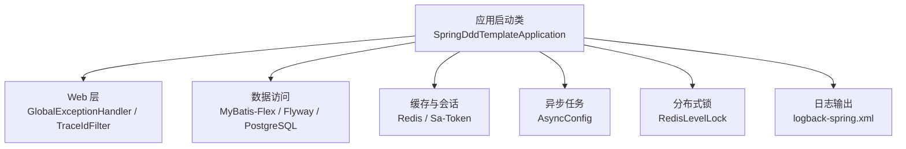
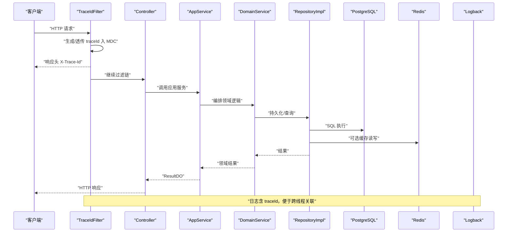
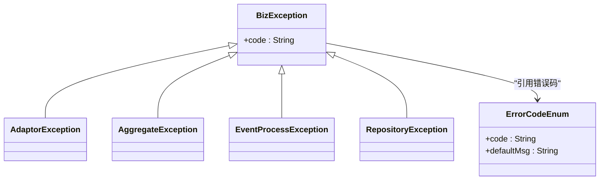
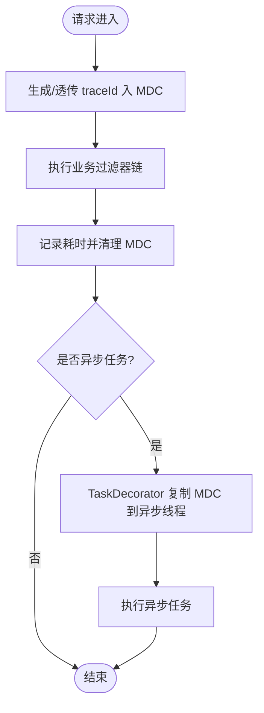
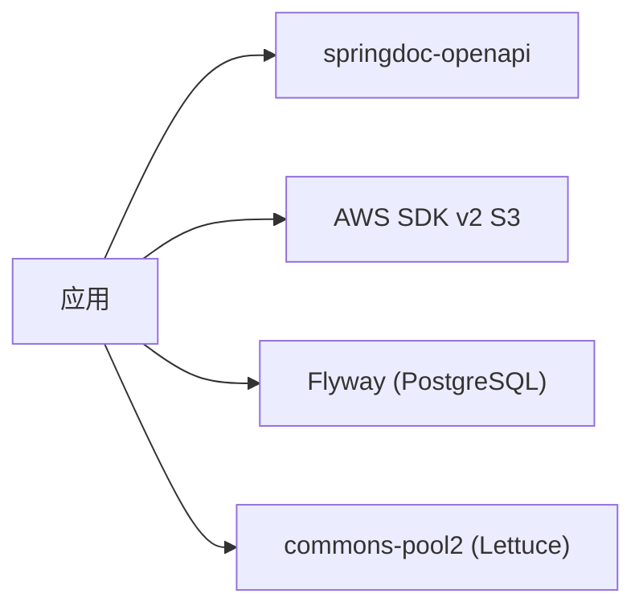
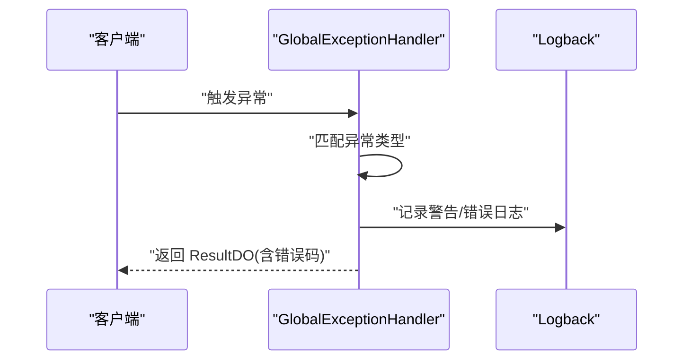

# 故障排查

<cite>
**本文引用的文件**   
- [README.md](file://README.md)
- [SpringDddTemplateApplication.java](file://src/main/java/com/sunnao/spring/ddd/template/SpringDddTemplateApplication.java)
- [application.yaml](file://src/main/resources/application.yaml)
- [application-prod.yaml](file://src/main/resources/application-prod.yaml)
- [logback-spring.xml](file://src/main/resources/logback-spring.xml)
- [TraceIdFilter.java](file://src/main/java/com/sunnao/spring/ddd/template/common/filter/TraceIdFilter.java)
- [AsyncConfig.java](file://src/main/java/com/sunnao/spring/ddd/template/common/config/AsyncConfig.java)
- [GlobalExceptionHandler.java](file://src/main/java/com/sunnao/spring/ddd/template/adaptor/common/GlobalExceptionHandler.java)
- [ErrorCodeEnum.java](file://src/main/java/com/sunnao/spring/ddd/template/common/result/ErrorCodeEnum.java)
- [BizException.java](file://src/main/java/com/sunnao/spring/ddd/template/common/exception/BizException.java)
- [AdaptorException.java](file://src/main/java/com/sunnao/spring/ddd/template/common/exception/AdaptorException.java)
- [AggregateException.java](file://src/main/java/com/sunnao/spring/ddd/template/common/exception/AggregateException.java)
- [EventProcessException.java](file://src/main/java/com/sunnao/spring/ddd/template/common/exception/EventProcessException.java)
- [RepositoryException.java](file://src/main/java/com/sunnao/spring/ddd/template/common/exception/RepositoryException.java)
- [RedisLevelLock.java](file://src/main/java/com/sunnao/spring/ddd/template/common/lock/RedisLevelLock.java)
- [MybatisFlexConfigure.java](file://src/main/java/com/sunnao/spring/ddd/template/common/config/MybatisFlexConfigure.java)
- [UserMapper.java](file://src/main/java/com/sunnao/spring/ddd/template/infrastructure/system/user/mysql/mapper/UserMapper.java)
- [docker-compose.yaml](file://docker-compose.yaml)
- [pom.xml](file://pom.xml)
- [spring-ddd-template-fixes-handover.md](file://docs/handover/spring-ddd-template-fixes-handover.md)
</cite>

## 目录
1. [简介](#简介)
2. [项目结构](#项目结构)
3. [核心组件](#核心组件)
4. [架构总览](#架构总览)
5. [详细组件分析](#详细组件分析)
6. [依赖分析](#依赖分析)
7. [性能考虑](#性能考虑)
8. [故障排查指南](#故障排查指南)
9. [结论](#结论)
10. [附录](#附录)

## 简介
本指南面向生产与测试环境的运维与研发人员，聚焦于“启动问题、运行时异常、性能问题、分布式问题”的实战诊断方法。结合本项目的全局异常处理、链路追踪、异步线程池、数据库与缓存配置、错误码体系等能力，提供可操作的步骤、关键字搜索策略与工具使用建议，并给出问题上报模板与协作流程。

## 项目结构
本项目采用六边形架构（adaptor → application → domain → repository 接口，infrastructure 实现），横切能力包括全局异常、traceId 链路、异步任务、分布式锁、操作日志等。这些能力为故障定位提供了统一入口与线索。

图示来源
- [SpringDddTemplateApplication.java:1-16](file://src/main/java/com/sunnao/spring/ddd/template/SpringDddTemplateApplication.java#L1-L16)
- [application.yaml:1-42](file://src/main/resources/application.yaml#L1-L42)
- [logback-spring.xml:1-43](file://src/main/resources/logback-spring.xml#L1-L43)

章节来源
- [README.md:19-46](file://README.md#L19-L46)
- [README.md:119-128](file://README.md#L119-L128)

## 核心组件
- 全局异常处理：统一捕获鉴权、参数解析、资源不存在与未预期异常，返回标准 ResultDO，避免堆栈外泄。
- 链路追踪：TraceIdFilter 生成/透传 traceId，写入 MDC，并在响应头回写 X-Trace-Id；异步线程通过 TaskDecorator 透传 MDC。
- 异步任务：自定义线程池与拒绝策略，异步异常统一记录。
- 错误码体系：ErrorCodeEnum 集中管理错误码与默认文案，配合 BizException 及其子类在各层抛出或包装。
- 数据库与迁移：Flyway 自动建表与基线兼容；MyBatis-Flex 审计字段自动填充。
- 分布式锁：RedisLevelLock 基于 SET NX PX + Lua 释放，失败有日志兜底。

章节来源
- [GlobalExceptionHandler.java:1-98](file://src/main/java/com/sunnao/spring/ddd/template/adaptor/common/GlobalExceptionHandler.java#L1-L98)
- [TraceIdFilter.java:1-60](file://src/main/java/com/sunnao/spring/ddd/template/common/filter/TraceIdFilter.java#L1-L60)
- [AsyncConfig.java:1-69](file://src/main/java/com/sunnao/spring/ddd/template/common/config/AsyncConfig.java#L1-L69)
- [ErrorCodeEnum.java:1-209](file://src/main/java/com/sunnao/spring/ddd/template/common/result/ErrorCodeEnum.java#L1-L209)
- [BizException.java:1-27](file://src/main/java/com/sunnao/spring/ddd/template/common/exception/BizException.java#L1-L27)
- [AdaptorException.java:1-21](file://src/main/java/com/sunnao/spring/ddd/template/common/exception/AdaptorException.java#L1-L21)
- [AggregateException.java:1-21](file://src/main/java/com/sunnao/spring/ddd/template/common/exception/AggregateException.java#L1-L21)
- [EventProcessException.java:1-21](file://src/main/java/com/sunnao/spring/ddd/template/common/exception/EventProcessException.java#L1-L21)
- [RepositoryException.java:1-21](file://src/main/java/com/sunnao/spring/ddd/template/common/exception/RepositoryException.java#L1-L21)
- [RedisLevelLock.java:43-74](file://src/main/java/com/sunnao/spring/ddd/template/common/lock/RedisLevelLock.java#L43-L74)
- [MybatisFlexConfigure.java:1-73](file://src/main/java/com/sunnao/spring/ddd/template/common/config/MybatisFlexConfigure.java#L1-L73)

## 架构总览
下图展示一次典型请求从进入 Web 到落库/缓存的关键路径，以及异常与日志的统一出口。

图示来源
- [TraceIdFilter.java:1-60](file://src/main/java/com/sunnao/spring/ddd/template/common/filter/TraceIdFilter.java#L1-L60)
- [logback-spring.xml:1-43](file://src/main/resources/logback-spring.xml#L1-L43)
- [UserMapper.java:1-11](file://src/main/java/com/sunnao/spring/ddd/template/infrastructure/system/user/mysql/mapper/UserMapper.java#L1-L11)

## 详细组件分析

### 全局异常处理与错误码
- 作用：统一拦截鉴权异常、参数解析异常、资源不存在与未预期异常，返回标准 ResultDO，不暴露内部堆栈。
- 关键点：
  - 鉴权相关异常映射为 NOT_LOGIN/NO_PERMISSION。
  - 参数解析异常映射为 BAD_REQUEST。
  - 兜底异常映射为 SYSTEM_ERROR。
  - 所有业务异常通过 ErrorCodeEnum 统一管理，禁止散落字符串。

图示来源
- [ErrorCodeEnum.java:1-209](file://src/main/java/com/sunnao/spring/ddd/template/common/result/ErrorCodeEnum.java#L1-L209)
- [BizException.java:1-27](file://src/main/java/com/sunnao/spring/ddd/template/common/exception/BizException.java#L1-L27)
- [AdaptorException.java:1-21](file://src/main/java/com/sunnao/spring/ddd/template/common/exception/AdaptorException.java#L1-L21)
- [AggregateException.java:1-21](file://src/main/java/com/sunnao/spring/ddd/template/common/exception/AggregateException.java#L1-L21)
- [EventProcessException.java:1-21](file://src/main/java/com/sunnao/spring/ddd/template/common/exception/EventProcessException.java#L1-L21)
- [RepositoryException.java:1-21](file://src/main/java/com/sunnao/spring/ddd/template/common/exception/RepositoryException.java#L1-L21)

章节来源
- [GlobalExceptionHandler.java:1-98](file://src/main/java/com/sunnao/spring/ddd/template/adaptor/common/GlobalExceptionHandler.java#L1-L98)
- [ErrorCodeEnum.java:1-209](file://src/main/java/com/sunnao/spring/ddd/template/common/result/ErrorCodeEnum.java#L1-L209)

### 链路追踪与异步上下文透传
- TraceIdFilter：每个请求生成或透传 traceId 至 MDC，并在响应头回写 X-Trace-Id；请求结束时记录 method、uri、status、耗时。
- AsyncConfig：为 @Async 提供统一线程池，并通过 TaskDecorator 将 MDC 快照透传到异步线程，保证日志链路完整。

图示来源
- [TraceIdFilter.java:1-60](file://src/main/java/com/sunnao/spring/ddd/template/common/filter/TraceIdFilter.java#L1-L60)
- [AsyncConfig.java:1-69](file://src/main/java/com/sunnao/spring/ddd/template/common/config/AsyncConfig.java#L1-L69)
- [logback-spring.xml:1-43](file://src/main/resources/logback-spring.xml#L1-L43)

章节来源
- [TraceIdFilter.java:1-60](file://src/main/java/com/sunnao/spring/ddd/template/common/filter/TraceIdFilter.java#L1-L60)
- [AsyncConfig.java:1-69](file://src/main/java/com/sunnao/spring/ddd/template/common/config/AsyncConfig.java#L1-L69)

### 数据库与迁移
- Flyway：应用启动时执行 db/migration 脚本，支持 baseline-on-migrate 兼容已有库。
- MyBatis-Flex：BasePO 审计字段自动填充（createAt/updateAt/createBy/updateBy）。
- 连接信息：由 application.yaml 中的环境变量注入，本地开发可通过 docker-compose 一键拉起 PostgreSQL。

章节来源
- [application.yaml:1-42](file://src/main/resources/application.yaml#L1-L42)
- [MybatisFlexConfigure.java:1-73](file://src/main/java/com/sunnao/spring/ddd/template/common/config/MybatisFlexConfigure.java#L1-L73)
- [docker-compose.yaml:1-36](file://docker-compose.yaml#L1-L36)

### 分布式锁与缓存
- RedisLevelLock：SET NX PX + Lua 释放，加锁/解锁异常均记录日志；释放失败不影响主流程，锁到期自动过期。
- Redis 连接：host/port/password/database 由 application.yaml 注入；lettuce 连接池大小可配置。

章节来源
- [RedisLevelLock.java:43-74](file://src/main/java/com/sunnao/spring/ddd/template/common/lock/RedisLevelLock.java#L43-L74)
- [application.yaml:14-26](file://src/main/resources/application.yaml#L14-L26)

## 依赖分析
- 外部依赖要点：
  - springdoc-openapi：API 文档（生产环境需关闭）。
  - AWS SDK v2 S3：对象存储客户端（仅同步 HTTP 客户端，排除 Netty NIO）。
  - Flyway：数据库迁移（spring-boot-starter-flyway + flyway-database-postgresql）。
  - commons-pool2：Lettuce 连接池。

图示来源
- [pom.xml:114-151](file://pom.xml#L114-L151)

章节来源
- [pom.xml:114-151](file://pom.xml#L114-L151)

## 性能考虑
- 异步线程池：核心/最大线程数、队列容量、存活时间、拒绝策略（CallerRunsPolicy）影响背压与吞吐。
- 日志滚动：按天+大小切分，保留天数与总量上限控制磁盘占用。
- 数据库连接池：Lettuce 连接池大小与超时设置需与负载匹配。
- 文件上传限制：servlet.multipart 与 app.file.max-size 保持一致，避免后端重复校验开销。

[本节为通用指导，无需源码引用]

## 故障排查指南

### 一、启动问题排查
- 端口冲突
  - 现象：启动时报端口占用或无法绑定。
  - 排查：检查本机已占用端口；确认 Spring Boot 默认端口未被其他进程占用；必要时调整端口或停止冲突进程。
- 数据库连接失败
  - 现象：启动阶段 Flyway 迁移失败或数据源初始化失败。
  - 排查：
    - 核对 application.yaml 中数据库 URL、用户名、密码是否正确（优先检查环境变量）。
    - 本地开发使用 docker-compose 拉起 PostgreSQL，确认健康检查通过。
    - 若为已有库，确认 baseline-on-migrate 生效，避免重复迁移。
- Redis 连接失败
  - 现象：会话、锁、字典缓存不可用。
  - 排查：
    - 检查 host/port/password/database 配置。
    - 本地使用 docker-compose 拉起 Redis，确认 ping 正常。
- 配置文件错误
  - 现象：启动报配置缺失或类型转换异常。
  - 排查：
    - 确认 .env 导入生效（optional 模式不会因缺失报错）。
    - 多环境激活 profiles 是否正确。
    - 生产环境确保 swagger 关闭（application-prod.yaml）。

章节来源
- [application.yaml:1-42](file://src/main/resources/application.yaml#L1-L42)
- [application-prod.yaml:1-7](file://src/main/resources/application-prod.yaml#L1-L7)
- [docker-compose.yaml:1-36](file://docker-compose.yaml#L1-L36)

### 二、运行时异常诊断流程
- 异常堆栈分析
  - 全局异常处理器会统一捕获未预期异常并记录 ERROR 日志，同时返回 SYSTEM_ERROR。
  - 业务异常通过 BizException 及其子类携带 ErrorCodeEnum，便于前端提示与后端统计。
- 日志关键字搜索
  - 使用 traceId 在日志中快速聚合一次请求的所有日志片段。
  - 关注关键词：未登录、角色鉴权未通过、权限鉴权未通过、请求体解析失败、请求参数类型不正确、请求资源不存在、未预期的系统异常、Redis 加锁异常、Redis 释放锁异常、异步任务执行异常。
- 常见错误码定位
  - 参考 ErrorCodeEnum 中的分类（通用、持久层、认证、用户、角色权限、字典、文件等），快速判断问题域。

图示来源
- [GlobalExceptionHandler.java:1-98](file://src/main/java/com/sunnao/spring/ddd/template/adaptor/common/GlobalExceptionHandler.java#L1-L98)
- [ErrorCodeEnum.java:1-209](file://src/main/java/com/sunnao/spring/ddd/template/common/result/ErrorCodeEnum.java#L1-L209)

章节来源
- [GlobalExceptionHandler.java:1-98](file://src/main/java/com/sunnao/spring/ddd/template/adaptor/common/GlobalExceptionHandler.java#L1-L98)
- [ErrorCodeEnum.java:1-209](file://src/main/java/com/sunnao/spring/ddd/template/common/result/ErrorCodeEnum.java#L1-L209)

### 三、性能问题排查
- CPU 占用过高
  - 定位热点方法：结合 traceId 筛选慢请求日志，定位耗时点。
  - 线程状态分析：使用 jstack 抓取线程快照，观察阻塞/等待热点。
  - 异步任务：检查 AsyncConfig 线程池队列堆积情况与拒绝策略行为。
- 内存溢出（OOM）
  - 堆转储：使用 jmap 导出堆快照，分析大对象与泄漏嫌疑。
  - 监控 GC：结合 GC 日志与 JVM 参数，评估堆大小与回收效率。
- 数据库慢查询
  - SQL 定位：根据 RepositoryImpl 与 Mapper 调用链，结合 MyBatis-Flex 日志定位慢 SQL。
  - 索引与分页：检查查询条件与分页参数，优化索引与查询语句。
  - 连接池：检查 Lettuce 连接池配置与数据库连接数。

章节来源
- [AsyncConfig.java:1-69](file://src/main/java/com/sunnao/spring/ddd/template/common/config/AsyncConfig.java#L1-L69)
- [UserMapper.java:1-11](file://src/main/java/com/sunnao/spring/ddd/template/infrastructure/system/user/mysql/mapper/UserMapper.java#L1-L11)
- [application.yaml:14-26](file://src/main/resources/application.yaml#L14-L26)

### 四、分布式环境问题定位
- 服务间调用失败
  - 通过 traceId 串联上下游日志，确认失败发生在哪个环节。
  - 检查网络连通性、证书与超时配置。
- 缓存连接异常
  - 现象：Sa-Token 会话、分布式锁、字典缓存不可用。
  - 排查：Redis 连接配置、网络可达性、账号权限、SSL 开关。
- 消息队列积压（如后续引入 MQ）
  - 现象：消费者处理缓慢导致积压。
  - 排查：消费者线程池、重试与死信策略、下游依赖可用性。

章节来源
- [application.yaml:14-26](file://src/main/resources/application.yaml#L14-L26)
- [RedisLevelLock.java:43-74](file://src/main/java/com/sunnao/spring/ddd/template/common/lock/RedisLevelLock.java#L43-L74)

### 五、常用诊断工具与命令
- jstack
  - 用途：抓取线程快照，分析死锁、阻塞、CPU 热点。
  - 用法：jstack <pid> > thread_dump.txt
- jmap
  - 用途：导出堆转储，分析内存占用与潜在泄漏。
  - 用法：jmap -dump:format=b,file=heap.hprof <pid>
- Arthas
  - 用途：在线诊断（热更新、方法耗时、类加载、JVM 信息等）。
  - 常用命令：dashboard、thread、trace、watch、vmtool、heapdump
- 日志检索
  - 使用 grep/awk 按 traceId 过滤日志，快速还原请求链路。
  - 关注 logback 输出 pattern 中的 %X{traceId}。

[本节为通用指导，无需源码引用]

### 六、问题上报模板与团队协作流程
- 问题上报模板
  - 基本信息：应用名、版本、部署环境（dev/test/prod）、节点 IP/容器 ID。
  - 时间线：问题发生时间、持续时间、影响范围。
  - 关键指标：CPU/内存/磁盘/网络、GC 次数与停顿、数据库连接池使用率、Redis 延迟。
  - 日志与链路：traceId、错误码、关键日志片段（脱敏）。
  - 复现步骤：最小复现场景、请求样例（URL/Headers/Body，脱敏）。
  - 初步结论与临时措施：已采取的回滚/扩容/限流等。
- 协作流程
  - 发现与分级：一线值班依据错误码与指标进行分级。
  - 定位与验证：使用 traceId 拉齐日志，结合工具定位根因，必要时灰度验证修复。
  - 修复与发布：提交变更、回归测试、灰度发布、全量上线。
  - 复盘与改进：沉淀知识库、完善监控告警与自动化预案。

[本节为通用指导，无需源码引用]

## 结论
通过统一异常处理、链路追踪、异步线程池、错误码体系与完善的日志滚动策略，本项目具备良好的可观测性与可维护性。按照本指南的流程与工具方法，可高效定位启动、运行、性能与分布式问题，提升团队协同排障效率。

## 附录
- 生产安全与配置
  - 生产环境务必关闭 swagger-ui 与 api-docs，避免接口暴露。
  - 异步线程池拒绝策略已设置为 CallerRunsPolicy，队列满时由提交线程执行任务提供背压。

章节来源
- [application-prod.yaml:1-7](file://src/main/resources/application-prod.yaml#L1-L7)
- [spring-ddd-template-fixes-handover.md:127-154](file://docs/handover/spring-ddd-template-fixes-handover.md#L127-L154)