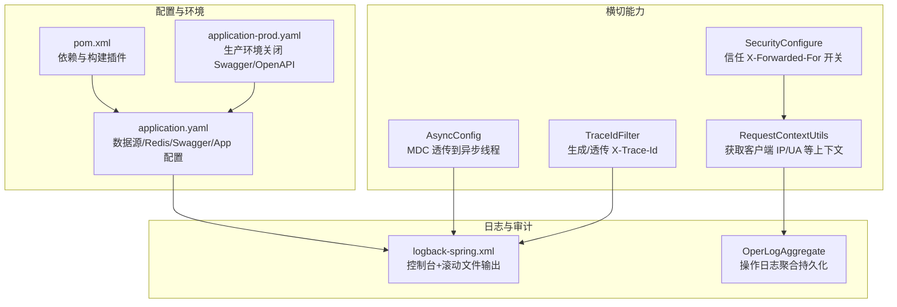
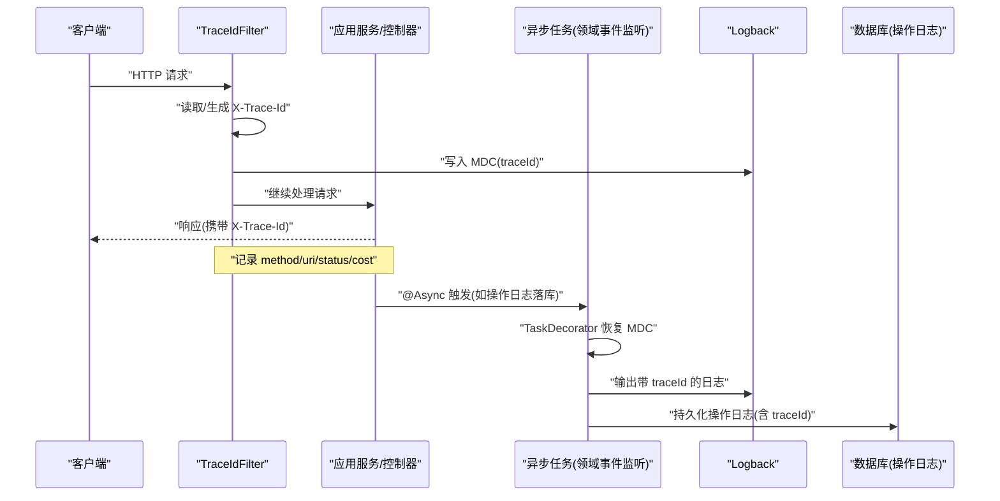
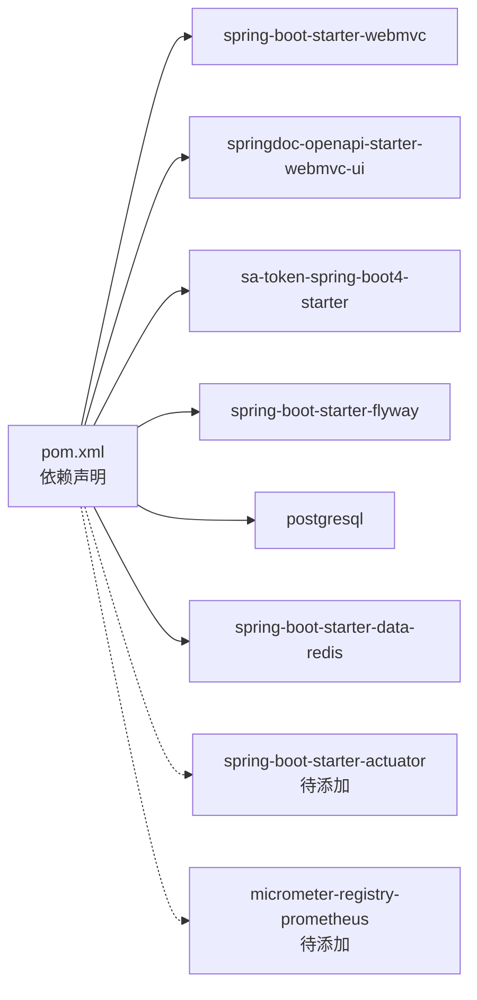

# 监控告警

<cite>
**本文引用的文件**   
- [README.md](file://README.md)
- [pom.xml](file://pom.xml)
- [application.yaml](file://src/main/resources/application.yaml)
- [application-prod.yaml](file://src/main/resources/application-prod.yaml)
- [logback-spring.xml](file://src/main/resources/logback-spring.xml)
- [TraceIdFilter.java](file://src/main/java/com/sunnao/spring/ddd/template/common/filter/TraceIdFilter.java)
- [AsyncConfig.java](file://src/main/java/com/sunnao/spring/ddd/template/common/config/AsyncConfig.java)
- [SecurityConfigure.java](file://src/main/java/com/sunnao/spring/ddd/template/common/config/SecurityConfigure.java)
- [RequestContextUtils.java](file://src/main/java/com/sunnao/spring/ddd/template/common/context/RequestContextUtils.java)
- [OperLogAggregate.java](file://src/main/java/com/sunnao/spring/ddd/template/domain/system/log/model/aggregate/OperLogAggregate.java)
</cite>

## 目录
1. [简介](#简介)
2. [项目结构](#项目结构)
3. [核心组件](#核心组件)
4. [架构总览](#架构总览)
5. [详细组件分析](#详细组件分析)
6. [依赖分析](#依赖分析)
7. [性能考虑](#性能考虑)
8. [故障排查指南](#故障排查指南)
9. [结论](#结论)
10. [附录](#附录)

## 简介
本指南面向“监控告警系统”的落地与扩展，结合当前 Spring Boot DDD 模板项目的既有能力，提供从应用性能监控、日志收集与分析、分布式链路追踪、告警规则到可视化展示与扩展开发的完整配置与实践建议。重点覆盖：
- 应用性能监控集成（Spring Boot Actuator、自定义指标、JVM 监控）
- 日志收集与分析（Logback 优化、结构化输出、级别管理）
- 分布式链路追踪（请求 ID 传递、关键业务节点埋点）
- 告警规则设置（错误率、性能指标、业务异常）
- 可视化展示（Grafana 仪表板、关键图表设计）
- 扩展方法与自定义监控组件开发

## 项目结构
本项目采用六边形架构，横切能力集中在 common 层，包括全局异常处理、traceId 链路透传、异步线程池 MDC 透传、安全相关配置等；日志通过 Logback 统一输出并包含 traceId；操作日志以领域事件驱动异步落库，便于后续接入日志采集与告警。

图示来源
- [TraceIdFilter.java:1-61](file://src/main/java/com/sunnao/spring/ddd/template/common/filter/TraceIdFilter.java#L1-L61)
- [AsyncConfig.java:1-69](file://src/main/java/com/sunnao/spring/ddd/template/common/config/AsyncConfig.java#L1-L69)
- [SecurityConfigure.java:1-28](file://src/main/java/com/sunnao/spring/ddd/template/common/config/SecurityConfigure.java#L1-L28)
- [RequestContextUtils.java:1-33](file://src/main/java/com/sunnao/spring/ddd/template/common/context/RequestContextUtils.java#L1-L33)
- [logback-spring.xml:1-43](file://src/main/resources/logback-spring.xml#L1-L43)
- [OperLogAggregate.java:41-57](file://src/main/java/com/sunnao/spring/ddd/template/domain/system/log/model/aggregate/OperLogAggregate.java#L41-L57)
- [application.yaml:1-88](file://src/main/resources/application.yaml#L1-L88)
- [application-prod.yaml:1-7](file://src/main/resources/application-prod.yaml#L1-L7)
- [pom.xml:1-217](file://pom.xml#L1-L217)

章节来源
- [README.md:1-182](file://README.md#L1-L182)

## 核心组件
- 链路追踪与上下文
  - TraceIdFilter：在每个 HTTP 请求中生成或透传 X-Trace-Id，写入 MDC，并在响应头回写；记录方法、URI、状态码与耗时。
  - AsyncConfig：为 @Async 提供统一线程池，并通过 TaskDecorator 将 MDC 透传到异步线程，保证日志链路完整。
  - SecurityConfigure：启动时注入是否信任 X-Forwarded-For 的配置项，影响 RequestContextUtils 解析真实客户端 IP。
  - RequestContextUtils：封装 RequestContextHolder，提供客户端 IP、User-Agent 等元信息获取，非 Web 线程返回空值需容忍。
- 日志与审计
  - logback-spring.xml：定义控制台彩色输出与按天/大小滚动的文件输出，保留策略与总量上限，pattern 中包含 %X{traceId}。
  - OperLogAggregate：将操作日志事件转换为实体并持久化，字段包含 traceId、模块、动作、URI、参数摘要、结果码、耗时、IP 等。
- 配置与环境
  - application.yaml：数据库、Redis、Flyway、Sa-Token、springdoc-openapi、app 自定义配置（锁类型、文件存储等）。
  - application-prod.yaml：生产环境禁用 swagger-ui 与 api-docs，避免接口暴露。
  - pom.xml：引入 spring-boot-starter-webmvc、springdoc-openapi、sa-token、flyway 等依赖，未显式引入 actuator 与 micrometer。

章节来源
- [TraceIdFilter.java:1-61](file://src/main/java/com/sunnao/spring/ddd/template/common/filter/TraceIdFilter.java#L1-L61)
- [AsyncConfig.java:1-69](file://src/main/java/com/sunnao/spring/ddd/template/common/config/AsyncConfig.java#L1-L69)
- [SecurityConfigure.java:1-28](file://src/main/java/com/sunnao/spring/ddd/template/common/config/SecurityConfigure.java#L1-L28)
- [RequestContextUtils.java:1-33](file://src/main/java/com/sunnao/spring/ddd/template/common/context/RequestContextUtils.java#L1-L33)
- [logback-spring.xml:1-43](file://src/main/resources/logback-spring.xml#L1-L43)
- [OperLogAggregate.java:41-57](file://src/main/java/com/sunnao/spring/ddd/template/domain/system/log/model/aggregate/OperLogAggregate.java#L41-L57)
- [application.yaml:1-88](file://src/main/resources/application.yaml#L1-L88)
- [application-prod.yaml:1-7](file://src/main/resources/application-prod.yaml#L1-L7)
- [pom.xml:1-217](file://pom.xml#L1-L217)

## 架构总览
下图展示了请求进入后，链路追踪、日志输出与操作日志落库的整体流程，以及异步线程中的 MDC 透传机制。

图示来源
- [TraceIdFilter.java:1-61](file://src/main/java/com/sunnao/spring/ddd/template/common/filter/TraceIdFilter.java#L1-L61)
- [AsyncConfig.java:1-69](file://src/main/java/com/sunnao/spring/ddd/template/common/config/AsyncConfig.java#L1-L69)
- [logback-spring.xml:1-43](file://src/main/resources/logback-spring.xml#L1-L43)
- [OperLogAggregate.java:41-57](file://src/main/java/com/sunnao/spring/ddd/template/domain/system/log/model/aggregate/OperLogAggregate.java#L41-L57)

## 详细组件分析

### 应用性能监控集成（Actuator、Micrometer、JVM）
现状与建议
- 当前依赖未引入 spring-boot-starter-actuator 与 micrometer，无法直接暴露 /actuator 端点与标准指标。
- 建议步骤：
  1) 在 pom.xml 中添加 actuator 与 micrometer 依赖（web + prometheus），以便暴露 JVM、HTTP、线程池等指标。
  2) 在 application.yaml 中启用并白名单暴露必要端点（info、health、prometheus、metrics）。
  3) 自定义指标：对关键业务路径（登录、注册、文件上传、RBAC 授权）使用 MeterRegistry 计数与计时。
  4) JVM 监控：利用 Micrometer 自动收集的 GC、堆内存、线程数、类加载等指标。
  5) 外部对接：Prometheus 抓取 /actuator/prometheus，Grafana 展示。

实施要点（不粘贴代码，仅给出路径参考）
- 依赖添加位置：[pom.xml:1-217](file://pom.xml#L1-L217)
- 端点与指标配置位置：[application.yaml:1-88](file://src/main/resources/application.yaml#L1-L88)
- 自定义指标埋点位置：建议在 adaptor 层控制器或 application 层场景入口处，基于 URL 与业务维度打点。

章节来源
- [pom.xml:1-217](file://pom.xml#L1-L217)
- [application.yaml:1-88](file://src/main/resources/application.yaml#L1-L88)

### 日志收集与分析方案（Logback、结构化、级别管理）
现有能力
- Logback 已配置控制台彩色输出与滚动文件输出，pattern 包含 %X{traceId}，支持按天/大小切分与总量上限控制。
- TraceIdFilter 负责写入 MDC，AsyncConfig 确保异步线程也具备 traceId。
- 操作日志通过领域事件异步落库，包含 traceId、模块、动作、URI、参数摘要、结果码、耗时、IP 等。

优化建议
- 结构化输出：在 Logback 中增加 JSON appender（例如 JsonLayout），将 traceId、level、logger、message、thread、ip、userAgent 等作为字段输出，便于 ELK/Loki 解析。
- 级别管理：根级别 INFO，针对第三方包降低级别；对审计与安全相关日志单独命名空间并提升级别。
- 采样与脱敏：对大请求体/敏感字段进行脱敏与采样，避免日志膨胀。
- 采集与转发：本地文件由 Filebeat/Fluent Bit 采集至 ES/Loki；容器环境可直接 stdout 给侧车或平台日志系统。

章节来源
- [logback-spring.xml:1-43](file://src/main/resources/logback-spring.xml#L1-L43)
- [TraceIdFilter.java:1-61](file://src/main/java/com/sunnao/spring/ddd/template/common/filter/TraceIdFilter.java#L1-L61)
- [AsyncConfig.java:1-69](file://src/main/java/com/sunnao/spring/ddd/template/common/config/AsyncConfig.java#L1-L69)
- [OperLogAggregate.java:41-57](file://src/main/java/com/sunnao/spring/ddd/template/domain/system/log/model/aggregate/OperLogAggregate.java#L41-L57)

### 分布式链路追踪集成（请求 ID 传递、关键节点埋点）
现有能力
- TraceIdFilter 实现 X-Trace-Id 的生成/透传与响应头回写，MDC 贯穿同步调用链。
- AsyncConfig 的 TaskDecorator 将 MDC 透传到异步线程，保障异步链路可观测性。
- 操作日志持久化包含 traceId，便于跨服务/跨阶段关联。

扩展建议
- 跨进程/跨服务：上游网关或调用方传入 X-Trace-Id，下游保持透传；若使用 OpenTelemetry，可将 traceId 映射到 W3C Trace Context。
- 关键业务节点埋点：在登录、鉴权、文件上传、角色分配等关键路径记录开始/结束时间，计算耗时并上报指标。
- 链路聚合：将日志与指标通过 traceId 关联，在 Grafana 或日志系统中实现一键定位。

章节来源
- [TraceIdFilter.java:1-61](file://src/main/java/com/sunnao/spring/ddd/template/common/filter/TraceIdFilter.java#L1-L61)
- [AsyncConfig.java:1-69](file://src/main/java/com/sunnao/spring/ddd/template/common/config/AsyncConfig.java#L1-L69)
- [OperLogAggregate.java:41-57](file://src/main/java/com/sunnao/spring/ddd/template/domain/system/log/model/aggregate/OperLogAggregate.java#L41-L57)

### 告警规则设置指南（错误率、性能指标、业务异常）
建议规则（示例阈值可按实际基线调整）
- 错误率告警
  - 条件：HTTP 5xx 比例 > 1%（5 分钟窗口）
  - 指标来源：/actuator/prometheus 的 http_server_requests 指标
  - 通知：企业微信/钉钉/邮件
- 性能指标告警
  - 条件：P95/P99 延迟超过阈值（如 P95>500ms，P99>1000ms）
  - 指标来源：http_server_requests 的 duration 分位统计
- 业务异常告警
  - 条件：特定错误码出现频率突增（如登录失败、权限拒绝）
  - 指标来源：自定义计数器（按错误码/模块维度）
- 资源与健康
  - 条件：JVM GC 次数/耗时突增、堆内存使用率超阈值、线程池队列堆积
  - 指标来源：JVM 与线程池指标

说明
- 指标采集：Prometheus 抓取 /actuator/prometheus
- 告警引擎：Prometheus Alertmanager 或云原生告警平台
- 可视化联动：Grafana 面板与告警联动，点击告警跳转对应仪表板

章节来源
- [application.yaml:1-88](file://src/main/resources/application.yaml#L1-L88)

### 监控数据的可视化展示（Grafana 仪表板、关键图表）
建议仪表板
- 概览页
  - QPS、错误率、P95/P99 延迟、活跃线程数、连接池使用率
- 业务页
  - 登录成功率、注册成功率、文件上传成功率、RBAC 授权成功率
  - 各模块耗时 TopN、错误码分布
- 资源页
  - JVM 堆/非堆、GC 次数/耗时、CPU 使用率、磁盘 IO、网络 IO

数据来源
- Prometheus 指标（/actuator/prometheus）
- 日志系统（ELK/Loki）通过 traceId 关联查询

章节来源
- [application.yaml:1-88](file://src/main/resources/application.yaml#L1-L88)

### 扩展方法与自定义监控组件开发
- 自定义指标组件
  - 基于 MeterRegistry 创建计数器、计时器、分布直方图，按模块/接口/业务维度打点。
  - 在适配器层或应用层入口统一埋点，避免侵入业务逻辑。
- 自定义日志处理器
  - 新增 JSON Appender，统一结构化输出；对敏感字段脱敏。
  - 异步落库的操作日志可扩展更多维度（租户、环境、版本）。
- 链路增强
  - 引入 OpenTelemetry，统一 trace/span 生命周期管理，兼容多后端（Jaeger/Zipkin）。
- 健康检查与就绪探针
  - 暴露 /actuator/health 与 /actuator/info，供 K8s 探针与运维平台使用。

章节来源
- [AsyncConfig.java:1-69](file://src/main/java/com/sunnao/spring/ddd/template/common/config/AsyncConfig.java#L1-L69)
- [logback-spring.xml:1-43](file://src/main/resources/logback-spring.xml#L1-L43)
- [OperLogAggregate.java:41-57](file://src/main/java/com/sunnao/spring/ddd/template/domain/system/log/model/aggregate/OperLogAggregate.java#L41-L57)

## 依赖分析
当前项目依赖关系与监控相关要点
- 未引入 actuator/micrometer，需按需添加
- 已引入 springdoc-openapi（Swagger UI 与 API 文档），生产环境已关闭
- 已引入 Sa-Token、MyBatis-Flex、Flyway、PostgreSQL、Redis 等基础依赖

图示来源
- [pom.xml:1-217](file://pom.xml#L1-L217)

章节来源
- [pom.xml:1-217](file://pom.xml#L1-L217)
- [application-prod.yaml:1-7](file://src/main/resources/application-prod.yaml#L1-L7)

## 性能考虑
- 日志滚动策略：按天+大小切分，保留天数与总量上限需根据磁盘容量与合规要求评估。
- 异步线程池：核心/最大线程数、队列容量与拒绝策略应结合业务峰值与 SLA 调优。
- 指标采样：高吞吐场景下可对慢请求采样上报，避免指标采集开销过大。
- 对象存储与文件上传：大文件上传需配合网关限流与超时配置，避免阻塞线程池。

章节来源
- [logback-spring.xml:1-43](file://src/main/resources/logback-spring.xml#L1-L43)
- [AsyncConfig.java:1-69](file://src/main/java/com/sunnao/spring/ddd/template/common/config/AsyncConfig.java#L1-L69)
- [application.yaml:1-88](file://src/main/resources/application.yaml#L1-L88)

## 故障排查指南
- 链路问题定位
  - 通过响应头 X-Trace-Id 与日志 pattern 中的 traceId 快速定位全链路日志。
  - 确认 TraceIdFilter 是否生效，检查 MDC 是否在异步线程中正确透传。
- 日志问题
  - 检查 Logback 输出路径与滚动策略，确认磁盘空间与权限。
  - 如需结构化日志，新增 JSON Appender 并确保字段齐全。
- 指标缺失
  - 确认是否引入 actuator 与 micrometer，/actuator/prometheus 是否可达。
  - 检查防火墙/反向代理是否放行 /actuator 路径。
- 安全与 IP 识别
  - 若前置可信反向代理，开启 trust-x-forwarded-for，否则可能误判客户端 IP。

章节来源
- [TraceIdFilter.java:1-61](file://src/main/java/com/sunnao/spring/ddd/template/common/filter/TraceIdFilter.java#L1-L61)
- [AsyncConfig.java:1-69](file://src/main/java/com/sunnao/spring/ddd/template/common/config/AsyncConfig.java#L1-L69)
- [SecurityConfigure.java:1-28](file://src/main/java/com/sunnao/spring/ddd/template/common/config/SecurityConfigure.java#L1-L28)
- [RequestContextUtils.java:1-33](file://src/main/java/com/sunnao/spring/ddd/template/common/context/RequestContextUtils.java#L1-L33)
- [logback-spring.xml:1-43](file://src/main/resources/logback-spring.xml#L1-L43)

## 结论
本项目已具备完善的链路追踪与日志基础设施，结合操作日志的异步落库，为监控与告警提供了良好基础。下一步建议优先引入 Actuator 与 Micrometer，完善指标采集与可视化，再逐步建立告警规则与 Grafana 仪表板，最终形成“指标+日志+链路”三位一体的可观测体系。

## 附录
- 关键配置项参考
  - 应用名与日志路径：见 [application.yaml:1-88](file://src/main/resources/application.yaml#L1-L88)、[logback-spring.xml:1-43](file://src/main/resources/logback-spring.xml#L1-L43)
  - 生产环境开关：见 [application-prod.yaml:1-7](file://src/main/resources/application-prod.yaml#L1-L7)
  - 依赖清单：见 [pom.xml:1-217](file://pom.xml#L1-L217)