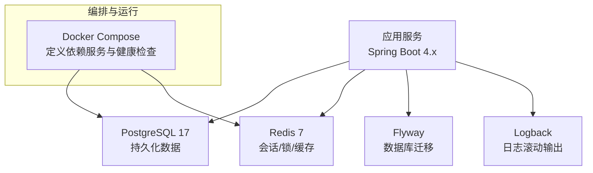
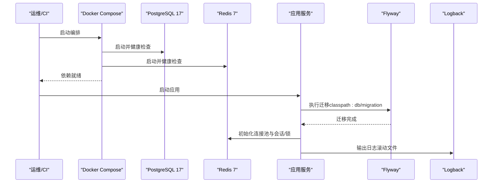
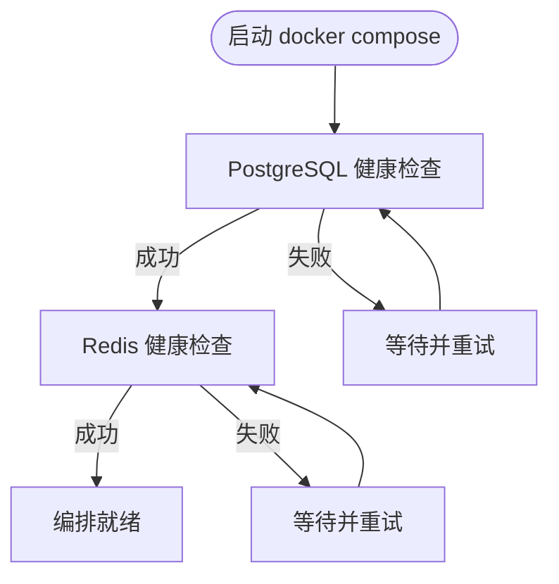
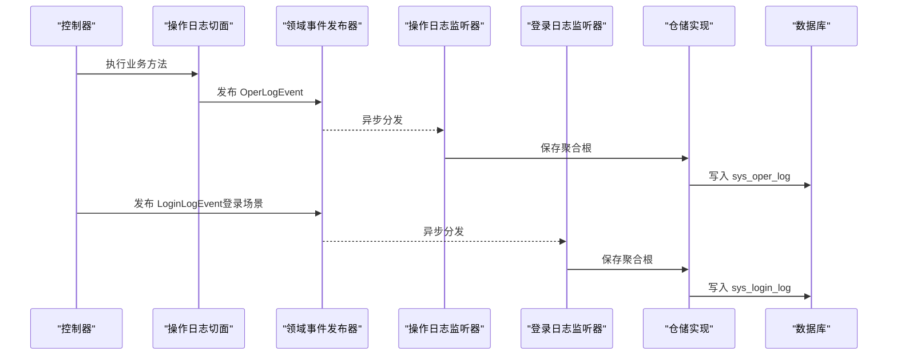
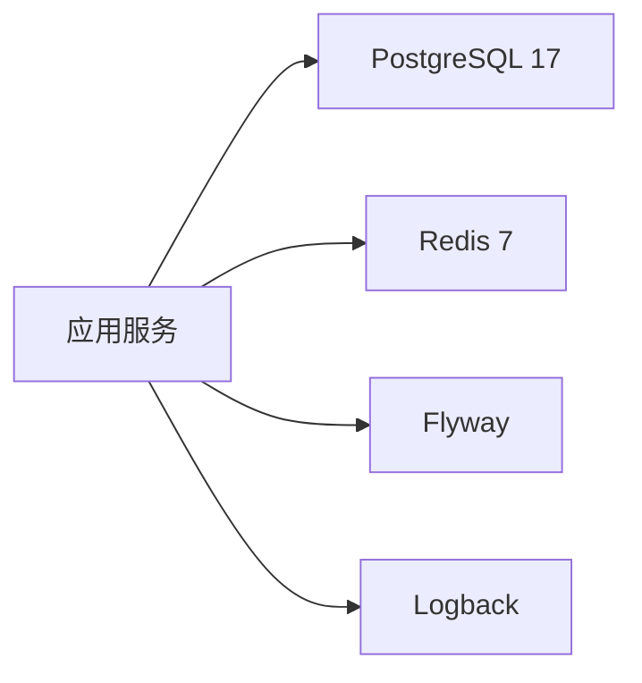

# 部署运维

<cite>
**本文引用的文件**
- [README.md](file://README.md)
- [docker-compose.yaml](file://docker-compose.yaml)
- [application.yaml](file://src/main/resources/application.yaml)
- [application-prod.yaml](file://src/main/resources/application-prod.yaml)
- [logback-spring.xml](file://src/main/resources/logback-spring.xml)
- [OperLogListener.java](file://src/main/java/com/sunnao/spring/ddd/template/application/system/log/listener/OperLogListener.java)
- [LoginLogListener.java](file://src/main/java/com/sunnao/spring/ddd/template/application/system/log/listener/LoginLogListener.java)
- [V6__init_sys_login_log.sql](file://src/main/resources/db/migration/V6__init_sys_login_log.sql)
</cite>

## 目录
1. [简介](#简介)
2. [项目结构](#项目结构)
3. [核心组件](#核心组件)
4. [架构总览](#架构总览)
5. [详细组件分析](#详细组件分析)
6. [依赖分析](#依赖分析)
7. [性能考虑](#性能考虑)
8. [故障排查指南](#故障排查指南)
9. [结论](#结论)
10. [附录](#附录)

## 简介
本指南面向部署与运维人员，围绕容器化部署、生产环境最佳实践、监控告警集成、性能优化、备份恢复与灾难恢复、故障排查以及版本升级与回滚策略，提供可操作的落地方案。项目基于 Spring Boot 4.x + PostgreSQL 17 + Redis 7，使用 Flyway 进行数据库迁移，支持多环境配置与环境变量注入，具备操作日志与登录日志的异步落库能力，便于在生产环境中进行问题定位与审计。

## 项目结构
- 应用通过 Docker Compose 启动本地依赖（PostgreSQL 17、Redis 7），应用启动时由 Flyway 自动执行 db/migration 脚本完成建表与初始化。
- 配置文件采用 application.yaml 作为基础配置，并通过环境变量覆盖；生产环境通过 application-prod.yaml 关闭 Swagger UI 与 OpenAPI 文档暴露。
- 日志输出采用 Logback，按天与大小滚动，保留 30 天且总量不超过 3GB。

图表来源
- [docker-compose.yaml:1-36](file://docker-compose.yaml#L1-L36)
- [application.yaml:32-36](file://src/main/resources/application.yaml#L32-L36)
- [logback-spring.xml:23-42](file://src/main/resources/logback-spring.xml#L23-L42)

章节来源
- [README.md:64-82](file://README.md#L64-L82)
- [docker-compose.yaml:1-36](file://docker-compose.yaml#L1-L36)
- [application.yaml:1-37](file://src/main/resources/application.yaml#L1-L37)
- [application-prod.yaml:1-7](file://src/main/resources/application-prod.yaml#L1-L7)
- [logback-spring.xml:23-42](file://src/main/resources/logback-spring.xml#L23-L42)

## 核心组件
- 数据库与迁移：PostgreSQL 17，Flyway 启用并指向 classpath:db/migration，支持 baseline-on-migrate 兼容已有库。
- 缓存与会话：Redis 7，用于 Sa-Token 会话存储、分布式锁与字典缓存等。
- 安全与鉴权：Sa-Token，token 存 Redis，支持注解鉴权。
- 日志系统：Logback 滚动输出，结合 TraceId 透传，便于链路追踪。
- 健康检查：Docker Compose 为 PostgreSQL 与 Redis 定义了 healthcheck，便于编排层感知依赖可用性。

章节来源
- [application.yaml:9-26](file://src/main/resources/application.yaml#L9-L26)
- [application.yaml:32-36](file://src/main/resources/application.yaml#L32-L36)
- [application.yaml:44-56](file://src/main/resources/application.yaml#L44-L56)
- [docker-compose.yaml:15-32](file://docker-compose.yaml#L15-L32)

## 架构总览
下图展示了容器编排与应用在运行时的关键交互关系，包括依赖服务的健康检查、应用启动时的数据库迁移、以及日志输出路径。

图表来源
- [docker-compose.yaml:1-36](file://docker-compose.yaml#L1-L36)
- [application.yaml:32-36](file://src/main/resources/application.yaml#L32-L36)
- [logback-spring.xml:23-42](file://src/main/resources/logback-spring.xml#L23-L42)

## 详细组件分析

### 容器化与编排（Docker Compose）
- 依赖服务：PostgreSQL 17 与 Redis 7，均声明了健康检查，确保应用启动前依赖可用。
- 数据持久化：通过命名卷 postgres-data 与 redis-data 持久化数据。
- 端口映射：默认映射 5432 与 6379，便于本地开发调试。

图表来源
- [docker-compose.yaml:15-32](file://docker-compose.yaml#L15-L32)

章节来源
- [docker-compose.yaml:1-36](file://docker-compose.yaml#L1-L36)

### 生产环境部署最佳实践
- 环境变量管理
  - 应用配置通过 application.yaml 中的 ${VAR:default} 形式读取环境变量，如 DB_HOST、DB_PORT、DB_NAME、DB_USERNAME、DB_PASSWORD、REDIS_HOST、REDIS_PORT、REDIS_PASSWORD、REDIS_DATABASE、REDIS_SSL 等。
  - 支持可选导入 .env 文件（spring.config.import: optional:file:.env[.properties]），便于本地或 CI 注入。
- 配置文件加密
  - 建议将敏感信息（数据库密码、Redis 密码、S3 密钥等）通过外部密钥管理服务注入到环境变量中，避免落盘。
- 健康检查配置
  - 依赖服务已在 Compose 中定义健康检查；应用侧可通过 Actuator 暴露 /actuator/health 端点（需引入相关依赖并在生产环境按需开启）。
- 生产开关
  - application-prod.yaml 已显式关闭 swagger-ui 与 api-docs，减少攻击面。

章节来源
- [application.yaml:1-22](file://src/main/resources/application.yaml#L1-L22)
- [application.yaml:32-36](file://src/main/resources/application.yaml#L32-L36)
- [application-prod.yaml:1-7](file://src/main/resources/application-prod.yaml#L1-L7)

### 监控与告警集成
- 应用性能监控（APM）
  - 建议在 JVM 启动参数中启用 APM Agent（如 SkyWalking、Pinpoint、Arms 等），并结合 Kubernetes 的 Sidecar 模式采集指标。
- 日志收集与分析
  - 应用日志通过 Logback 滚动输出至文件，建议挂载宿主目录或使用容器日志驱动（json-file/file）配合日志采集器（Fluent Bit/Filebeat）统一收集至 ELK/Loki。
  - 操作日志与登录日志通过事件监听器异步落库，便于业务审计与检索。
- 告警规则设置
  - 针对错误率、慢请求、资源使用率（CPU/内存）、数据库连接池、Redis 连接数等设定阈值告警。
  - 结合 Prometheus/Grafana 或云厂商监控平台实现可视化与告警通知。

章节来源
- [logback-spring.xml:23-42](file://src/main/resources/logback-spring.xml#L23-L42)
- [OperLogListener.java:1-35](file://src/main/java/com/sunnao/spring/ddd/template/application/system/log/listener/OperLogListener.java#L1-L35)
- [LoginLogListener.java:1-35](file://src/main/java/com/sunnao/spring/ddd/template/application/system/log/listener/LoginLogListener.java#L1-L35)

### 性能优化策略
- JVM 调优参数
  - 根据容器资源限制合理设置堆大小（-Xms/-Xmx）、GC 类型（G1/ZGC）、元空间（-XX:MetaspaceSize）等。
  - 启用 GC 日志与 APM 指标，持续观察并调整。
- 数据库连接池配置
  - 当前使用 MyBatis-Flex + JDBC，连接池由底层驱动/框架管理；建议根据并发量与数据库容量调整最大连接数、空闲连接与超时时间。
- Redis 缓存优化
  - 应用内已配置 Lettuce 连接池（max-active/max-idle/min-idle），可根据热点访问与内存占用调优。
  - 注意键过期策略与序列化体积控制，避免大对象缓存导致内存压力。

章节来源
- [application.yaml:14-26](file://src/main/resources/application.yaml#L14-L26)

### 备份恢复与灾难恢复
- 数据库备份
  - 定期执行 pg_dump 全量备份，增量可采用 WAL 归档或逻辑复制。
  - 建议异地容灾与跨地域副本，保留 N 份历史快照。
- 缓存与文件
  - Redis 数据可持久化（RDB/AOF），但通常以热数据为主，重要状态应落库。
  - 文件存储建议使用对象存储（S3/OSS/COS），自带高可用与版本控制。
- 灾难恢复演练
  - 制定 RTO/RPO 目标，定期进行恢复演练，验证备份有效性。

章节来源
- [README.md:95-96](file://README.md#L95-L96)

### 版本升级流程与回滚策略
- 升级流程
  - 构建镜像 → 推送镜像仓库 → 更新 Compose/K8s 配置 → 灰度发布 → 验证健康与指标 → 全量发布。
  - 数据库变更通过 Flyway 迁移脚本管理，确保向后兼容。
- 回滚策略
  - 镜像级回滚：快速切回上一稳定版本镜像。
  - 数据回滚：谨慎评估，必要时准备反向迁移脚本或从备份恢复。

章节来源
- [application.yaml:32-36](file://src/main/resources/application.yaml#L32-L36)

### 日志与审计链路（代码级）
操作日志与登录日志通过事件机制异步落库，保证主流程性能与稳定性。

图表来源
- [OperLogListener.java:1-35](file://src/main/java/com/sunnao/spring/ddd/template/application/system/log/listener/OperLogListener.java#L1-L35)
- [LoginLogListener.java:1-35](file://src/main/java/com/sunnao/spring/ddd/template/application/system/log/listener/LoginLogListener.java#L1-L35)
- [V6__init_sys_login_log.sql:1-41](file://src/main/resources/db/migration/V6__init_sys_login_log.sql#L1-L41)

## 依赖分析
- 运行时依赖
  - PostgreSQL 17：主数据存储，Flyway 负责迁移。
  - Redis 7：会话、锁、缓存。
- 配置依赖
  - application.yaml 集中定义数据源、Redis、Flyway、Sa-Token、springdoc 等。
  - application-prod.yaml 仅包含生产开关项。
- 日志依赖
  - logback-spring.xml 定义滚动策略与输出格式。

图表来源
- [application.yaml:9-26](file://src/main/resources/application.yaml#L9-L26)
- [application.yaml:32-36](file://src/main/resources/application.yaml#L32-L36)
- [logback-spring.xml:23-42](file://src/main/resources/logback-spring.xml#L23-L42)

章节来源
- [application.yaml:1-37](file://src/main/resources/application.yaml#L1-L37)
- [application-prod.yaml:1-7](file://src/main/resources/application-prod.yaml#L1-L7)
- [logback-spring.xml:23-42](file://src/main/resources/logback-spring.xml#L23-L42)

## 性能考虑
- 连接池与线程池
  - Redis 连接池已配置，建议根据 QPS 与延迟目标调优 max-active 与超时。
  - 异步任务线程池拒绝策略已设置为 CallerRunsPolicy，避免队列满时直接丢弃任务。
- 日志与 I/O
  - 日志滚动策略已配置，建议在生产环境将日志输出到独立磁盘或远端收集，避免影响应用 I/O。
- 缓存与锁
  - 分布式锁与字典缓存依赖 Redis，注意热点键与锁粒度，避免热点竞争。

章节来源
- [application.yaml:14-26](file://src/main/resources/application.yaml#L14-L26)
- [OperLogListener.java:1-35](file://src/main/java/com/sunnao/spring/ddd/template/application/system/log/listener/OperLogListener.java#L1-L35)
- [LoginLogListener.java:1-35](file://src/main/java/com/sunnao/spring/ddd/template/application/system/log/listener/LoginLogListener.java#L1-L35)

## 故障排查指南
- 依赖不可用
  - 检查 Compose 健康检查是否通过，确认端口映射与网络连通性。
- 数据库迁移失败
  - 查看 Flyway 日志，确认迁移脚本顺序与兼容性；baseline-on-migrate 可避免对已有库重复执行。
- 登录与权限异常
  - 检查 Sa-Token 配置与 Redis 连通性；核对 token 名称与有效期。
- 日志缺失或过大
  - 检查 Logback 配置与磁盘空间；确认日志路径与滚动策略。
- 操作/登录日志未落库
  - 检查异步监听器是否正常消费事件；关注错误日志与仓储实现。

章节来源
- [docker-compose.yaml:15-32](file://docker-compose.yaml#L15-L32)
- [application.yaml:32-36](file://src/main/resources/application.yaml#L32-L36)
- [application.yaml:44-56](file://src/main/resources/application.yaml#L44-L56)
- [logback-spring.xml:23-42](file://src/main/resources/logback-spring.xml#L23-L42)
- [OperLogListener.java:1-35](file://src/main/java/com/sunnao/spring/ddd/template/application/system/log/listener/OperLogListener.java#L1-L35)
- [LoginLogListener.java:1-35](file://src/main/java/com/sunnao/spring/ddd/template/application/system/log/listener/LoginLogListener.java#L1-L35)

## 结论
本项目提供了开箱即用的容器化编排与多环境配置能力，结合 Flyway 迁移、Sa-Token 鉴权与异步日志落库，具备良好的生产可观测性与可维护性。建议在生产环境完善密钥管理、APM 接入、日志收集与告警体系，并建立完善的备份恢复与回滚流程，保障系统的高可用与数据安全。

## 附录
- 常用命令
  - 启动依赖：docker compose up -d
  - 启动应用：mvnw spring-boot:run（或 mvn spring-boot:run）
  - 运行测试：mvnw test
- 参考说明
  - README 中包含快速开始、多环境配置与模块说明，可作为部署前的必读材料。

章节来源
- [README.md:64-82](file://README.md#L64-L82)