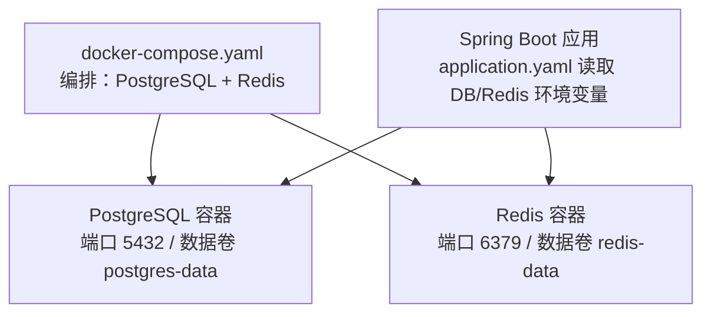
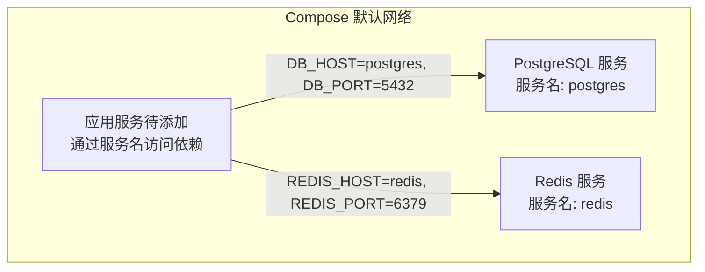
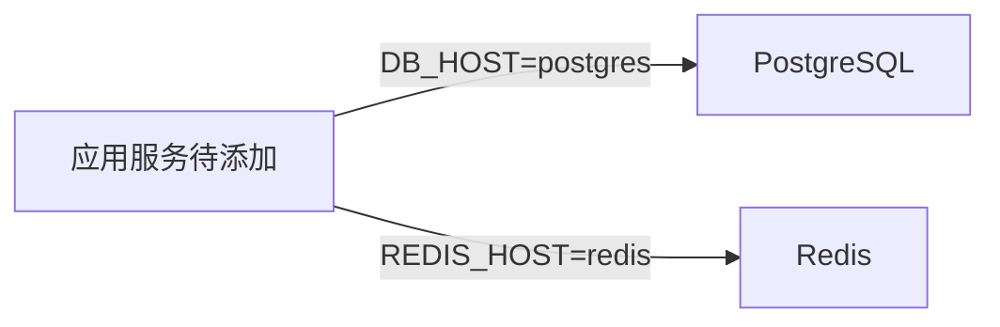

# 容器化配置

<cite>
**本文引用的文件**   
- [docker-compose.yaml](file://docker-compose.yaml)
- [application.yaml](file://src/main/resources/application.yaml)
- [application-prod.yaml](file://src/main/resources/application-prod.yaml)
- [README.md](file://README.md)
</cite>

## 目录
1. [简介](#简介)
2. [项目结构](#项目结构)
3. [核心组件](#核心组件)
4. [架构总览](#架构总览)
5. [详细组件分析](#详细组件分析)
6. [依赖关系分析](#依赖关系分析)
7. [性能与资源调优](#性能与资源调优)
8. [高可用与负载均衡扩展](#高可用与负载均衡扩展)
9. [故障排查指南](#故障排查指南)
10. [监控集成方案](#监控集成方案)
11. [结论](#结论)

## 简介
本文件面向容器化部署，围绕 docker-compose.yaml 的编排能力，系统说明应用服务、PostgreSQL 数据库、Redis 缓存服务的容器定义、网络通信、环境变量、数据卷挂载、健康检查与重启策略，并提供资源限制、性能调优、高可用扩展、故障排查与监控集成的实践建议。

## 项目结构
仓库根目录包含 docker-compose.yaml 用于本地开发环境一键拉起 PostgreSQL 与 Redis；应用通过 Spring Boot 多环境配置文件读取连接信息并自动执行数据库迁移。

图示来源
- [docker-compose.yaml:1-36](file://docker-compose.yaml#L1-L36)
- [application.yaml:9-26](file://src/main/resources/application.yaml#L9-L26)

章节来源
- [docker-compose.yaml:1-36](file://docker-compose.yaml#L1-L36)
- [application.yaml:1-88](file://src/main/resources/application.yaml#L1-L88)
- [README.md:76-82](file://README.md#L76-L82)

## 核心组件
- 数据库服务（PostgreSQL）
  - 镜像版本：postgres:17
  - 初始化参数：数据库名、用户名、密码
  - 端口映射：宿主机 5432 → 容器 5432
  - 数据持久化：命名卷 postgres-data 挂载至 /var/lib/postgresql/data
  - 健康检查：使用 pg_isready 探测数据库可用性
- 缓存服务（Redis）
  - 镜像版本：redis:7
  - 端口映射：宿主机 6379 → 容器 6379
  - 数据持久化：命名卷 redis-data 挂载至 /data
  - 健康检查：使用 redis-cli ping 探测服务可用性
- 应用服务（Spring Boot）
  - 当前仓库未提供应用容器的 compose 定义，但应用通过 application.yaml 读取环境变量连接数据库与 Redis，并在启动时由 Flyway 自动执行迁移脚本

章节来源
- [docker-compose.yaml:4-32](file://docker-compose.yaml#L4-L32)
- [application.yaml:9-26](file://src/main/resources/application.yaml#L9-L26)
- [application.yaml:32-36](file://src/main/resources/application.yaml#L32-L36)
- [README.md:64-70](file://README.md#L64-L70)

## 架构总览
下图展示容器间网络与服务发现机制：在默认 Compose 网络中，服务名称即 DNS 名称，应用可通过服务名访问数据库与缓存。

图示来源
- [docker-compose.yaml:4-32](file://docker-compose.yaml#L4-L32)
- [application.yaml:9-26](file://src/main/resources/application.yaml#L9-L26)

章节来源
- [docker-compose.yaml:1-36](file://docker-compose.yaml#L1-L36)
- [application.yaml:9-26](file://src/main/resources/application.yaml#L9-L26)

## 详细组件分析

### PostgreSQL 容器
- 镜像与版本：postgres:17
- 环境变量
  - POSTGRES_DB：数据库名
  - POSTGRES_USER：数据库用户
  - POSTGRES_PASSWORD：数据库密码
- 端口映射：宿主机 5432 暴露到容器 5432
- 数据卷：postgres-data 持久化至 /var/lib/postgresql/data
- 健康检查：pg_isready -U postgres -d spring_ddd_template，间隔 5s，超时 3s，重试 10 次

章节来源
- [docker-compose.yaml:4-19](file://docker-compose.yaml#L4-L19)

### Redis 容器
- 镜像与版本：redis:7
- 端口映射：宿主机 6379 暴露到容器 6379
- 数据卷：redis-data 持久化至 /data
- 健康检查：redis-cli ping，间隔 5s，超时 3s，重试 10 次

章节来源
- [docker-compose.yaml:21-32](file://docker-compose.yaml#L21-L32)

### 应用服务（Spring Boot）
- 运行方式
  - 本地开发：mvnw spring-boot:run 或 mvnw.cmd spring-boot:run
  - 容器化：需补充应用服务定义（见“高可用与负载均衡扩展”）
- 连接配置
  - 数据库：通过环境变量 DB_HOST、DB_PORT、DB_NAME、DB_USERNAME、DB_PASSWORD 注入
  - Redis：通过环境变量 REDIS_HOST、REDIS_PORT、REDIS_PASSWORD、REDIS_DATABASE 注入
  - 生产环境：通过 SPRING_PROFILES_ACTIVE=prod 激活 application-prod.yaml，关闭 Swagger UI 与 OpenAPI
- 数据库迁移：Flyway 启用，扫描 db/migration 目录，支持 baseline-on-migrate 兼容已有库

章节来源
- [application.yaml:9-26](file://src/main/resources/application.yaml#L9-L26)
- [application.yaml:32-36](file://src/main/resources/application.yaml#L32-L36)
- [application-prod.yaml:1-7](file://src/main/resources/application-prod.yaml#L1-L7)
- [README.md:64-70](file://README.md#L64-L70)
- [README.md:76-82](file://README.md#L76-L82)

### 环境变量与数据卷策略
- 环境变量
  - 数据库：DB_HOST、DB_PORT、DB_NAME、DB_USERNAME、DB_PASSWORD
  - Redis：REDIS_HOST、REDIS_PORT、REDIS_PASSWORD、REDIS_DATABASE
  - 其他：SPRING_PROFILES_ACTIVE（切换 dev/prod/test）
- 数据卷
  - postgres-data：PostgreSQL 数据目录
  - redis-data：Redis 数据目录
- 注意：当前 compose 仅定义了依赖服务，未定义应用服务的数据卷挂载；若后续引入应用容器，建议为应用日志与本地文件存储路径挂载独立卷

章节来源
- [application.yaml:9-26](file://src/main/resources/application.yaml#L9-L26)
- [docker-compose.yaml:13-27](file://docker-compose.yaml#L13-L27)

### 网络通信与服务发现
- 默认网络：compose 自动创建 bridge 网络，服务名即为 DNS 名称
- 应用侧通过服务名访问依赖：
  - DB_HOST=postgres
  - REDIS_HOST=redis
- 端口映射：仅在需要宿主机直连调试时暴露 5432/6379，生产环境建议不暴露对外端口

章节来源
- [docker-compose.yaml:11-25](file://docker-compose.yaml#L11-L25)
- [application.yaml:9-26](file://src/main/resources/application.yaml#L9-L26)

### 健康检查与重启策略
- 健康检查
  - PostgreSQL：pg_isready 探测
  - Redis：redis-cli ping 探测
- 重启策略
  - 当前 compose 未显式设置 restart 策略；可按需添加 on-failure 或 unless-stopped 等策略以增强稳定性

章节来源
- [docker-compose.yaml:15-32](file://docker-compose.yaml#L15-L32)

## 依赖关系分析
- 应用对数据库与 Redis 的依赖通过环境变量注入，结合 Compose 默认网络的服务发现完成连接
- 当前 compose 未定义应用服务，因此不存在容器间的 depends_on 顺序控制；实际部署时应根据应用启动耗时与依赖就绪情况配置 depends_on 与 healthcheck

图示来源
- [application.yaml:9-26](file://src/main/resources/application.yaml#L9-L26)
- [docker-compose.yaml:4-32](file://docker-compose.yaml#L4-L32)

章节来源
- [application.yaml:9-26](file://src/main/resources/application.yaml#L9-L26)
- [docker-compose.yaml:4-32](file://docker-compose.yaml#L4-L32)

## 性能与资源调优
- 连接池与线程池
  - Redis Lettuce 连接池：max-active、max-idle、min-idle 已在 application.yaml 中配置，可根据 QPS 与延迟目标调整
- 文件上传大小
  - multipart 最大请求大小与单文件大小上限已配置，应与业务存储实现的最大值保持一致
- 锁与并发
  - 分布式锁类型可配置为 redis 或 jvm，生产建议使用 redis 以实现跨实例一致性
- 资源限制（建议在应用容器中添加）
  - CPU 与内存限制：通过 deploy.resources.limits 与 reservations 进行约束
  - 磁盘 I/O：将日志与文件存储挂载到高性能卷或独立磁盘分区
- 网络优化
  - 避免在生产环境暴露数据库与缓存端口，仅通过内部网络通信
  - 合理设置连接超时与重试策略，提升弹性

章节来源
- [application.yaml:22-26](file://src/main/resources/application.yaml#L22-L26)
- [application.yaml:27-31](file://src/main/resources/application.yaml#L27-L31)
- [application.yaml:64-70](file://src/main/resources/application.yaml#L64-L70)

## 高可用与负载均衡扩展
- 应用服务容器化
  - 在 docker-compose.yaml 中新增应用服务定义，指定镜像或构建上下文，并通过环境变量注入 DB/Redis 连接信息
  - 使用 depends_on 与 condition: service_healthy 确保依赖就绪后再启动应用
- 多副本与负载均衡
  - 增加应用副本数，配合反向代理（如 Nginx/Traefik）进行流量分发与健康检查
  - 使用外部负载均衡器（云 LB/Ingress）暴露应用入口，后端指向多个应用实例
- 数据库高可用
  - 使用主从复制、读写分离或托管数据库服务（如云 RDS），应用侧通过只读连接池分流查询
- 缓存高可用
  - 使用 Redis Sentinel 或 Redis Cluster，应用侧配置集群连接参数
- 数据持久化与备份
  - 为 PostgreSQL 与 Redis 数据卷配置定期快照与异地备份策略
- 安全加固
  - 生产环境禁用 Swagger/OpenAPI（application-prod.yaml 已提供开关）
  - 使用密钥管理（KMS/Secrets）注入敏感信息，避免明文写入 compose 或镜像

章节来源
- [application-prod.yaml:1-7](file://src/main/resources/application-prod.yaml#L1-L7)
- [application.yaml:9-26](file://src/main/resources/application.yaml#L9-L26)

## 故障排查指南
- 常见连接问题
  - 现象：无法解析 REDIS_HOST 或连接超时
  - 排查：确认应用容器与依赖容器在同一 Compose 网络；检查环境变量是否覆盖为服务名而非 localhost
- 数据库迁移失败
  - 现象：Flyway 基线或迁移报错
  - 排查：确认数据库已存在且版本匹配；baseline-on-migrate 行为与现有 schema 一致
- 健康检查失败
  - 现象：容器状态 unhealthy
  - 排查：查看容器日志与健康检查命令输出，确认端口监听与认证参数正确
- 文件上传失败
  - 现象：超过大小限制或被拒绝
  - 排查：核对 multipart 与 app.file.max-size 配置一致性，检查存储路径权限
- 日志定位
  - 使用 traceId 链路透传，结合全局异常处理与操作日志切面快速定位问题

章节来源
- [application.yaml:32-36](file://src/main/resources/application.yaml#L32-L36)
- [application.yaml:27-31](file://src/main/resources/application.yaml#L27-L31)
- [README.md:119-127](file://README.md#L119-L127)

## 监控集成方案
- 指标采集
  - 接入 Micrometer + Prometheus，暴露 /actuator/prometheus 端点
  - 收集 JVM、Tomcat、数据库连接池、Redis 客户端等关键指标
- 日志聚合
  - 将应用日志输出到标准输出，由 Docker 日志驱动或 sidecar（如 Fluent Bit）采集至 ELK/Loki
- 健康与就绪探针
  - 应用层暴露 /actuator/health 与自定义就绪检查（如依赖连通性），供编排平台或反向代理使用
- 告警规则
  - 基于指标阈值（CPU、内存、错误率、慢查询、连接池耗尽）配置告警

[本节为通用指导，无需源码引用]

## 结论
当前仓库提供了完善的本地开发依赖编排（PostgreSQL + Redis）与应用的环境变量化配置。生产部署建议补充应用服务容器定义，完善健康检查、重启策略、资源限制与监控集成，并结合反向代理与外部负载均衡实现高可用与弹性伸缩。