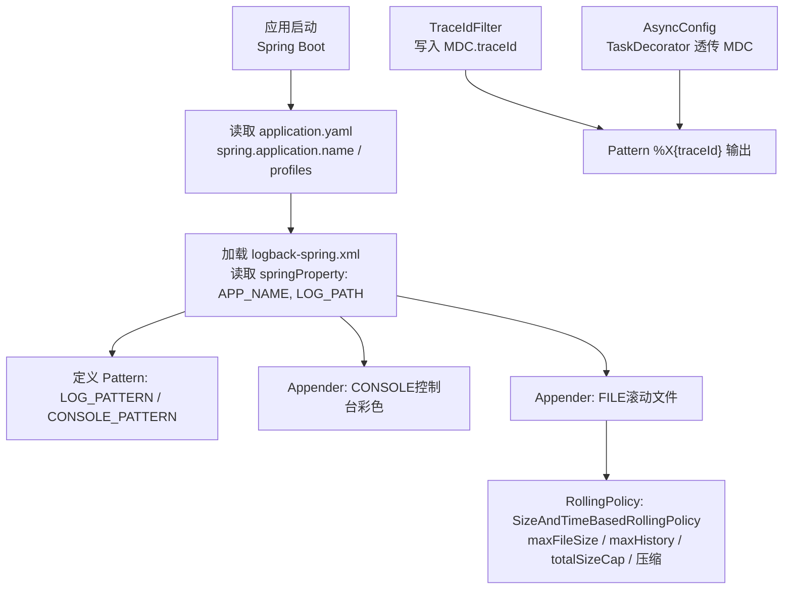
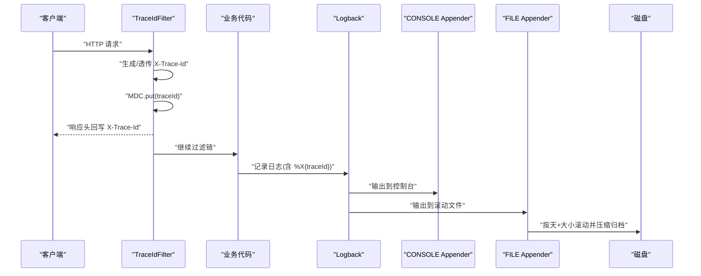
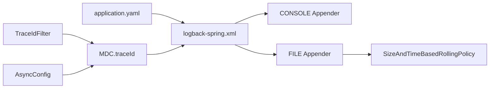

# 日志配置

<cite>
**本文引用的文件**
- [logback-spring.xml](file://src/main/resources/logback-spring.xml)
- [application.yaml](file://src/main/resources/application.yaml)
- [application-prod.yaml](file://src/main/resources/application-prod.yaml)
- [TraceIdFilter.java](file://src/main/java/com/sunnao/spring/ddd/template/common/filter/TraceIdFilter.java)
- [AsyncConfig.java](file://src/main/java/com/sunnao/spring/ddd/template/common/config/AsyncConfig.java)
</cite>

## 目录
1. [简介](#简介)
2. [项目结构](#项目结构)
3. [核心组件](#核心组件)
4. [架构总览](#架构总览)
5. [详细组件分析](#详细组件分析)
6. [依赖关系分析](#依赖关系分析)
7. [性能考虑](#性能考虑)
8. [故障排查指南](#故障排查指南)
9. [结论](#结论)
10. [附录](#附录)

## 简介
本文件面向日志配置系统，围绕 logback-spring.xml 的配置结构与各组件职责进行系统化说明。内容涵盖：
- 日志级别设置（DEBUG、INFO、WARN、ERROR）与默认策略
- 不同环境的输出策略与可覆盖点
- 滚动文件策略（按天+按大小切分、保留天数、压缩、总量上限）
- 控制台与文件输出的格式字段定义（时间戳、线程名、类名、消息等）
- 异步日志处理与链路追踪（MDC 透传）
- 日志查询与分析最佳实践（关键业务埋点建议与排障技巧）

## 项目结构
本项目采用 Spring Boot + Logback 的日志体系，核心配置文件位于 resources 下；链路追踪由过滤器注入 MDC；异步任务通过统一线程池并透传 MDC，确保跨线程日志链路完整。

图表来源
- [logback-spring.xml:1-43](file://src/main/resources/logback-spring.xml#L1-L43)
- [application.yaml:1-10](file://src/main/resources/application.yaml#L1-L10)
- [TraceIdFilter.java:1-61](file://src/main/java/com/sunnao/spring/ddd/template/common/filter/TraceIdFilter.java#L1-L61)
- [AsyncConfig.java:1-69](file://src/main/java/com/sunnao/spring/ddd/template/common/config/AsyncConfig.java#L1-L69)

章节来源
- [logback-spring.xml:1-43](file://src/main/resources/logback-spring.xml#L1-L43)
- [application.yaml:1-10](file://src/main/resources/application.yaml#L1-L10)

## 核心组件
- 属性与模式
  - 应用名与应用日志路径通过 springProperty 注入，支持外部覆盖
  - 定义统一的日志格式 LOG_PATTERN 与控制台彩色格式 CONSOLE_PATTERN
- Appender
  - CONSOLE：控制台输出，带颜色便于本地开发阅读
  - FILE：滚动文件输出，按天+按大小切分，自动压缩，限制历史数量与总容量
- Root Logger
  - 根级别为 INFO，同时输出到控制台与文件
- 链路追踪
  - TraceIdFilter 在请求入口生成或透传 traceId 写入 MDC
  - AsyncConfig 通过 TaskDecorator 将 MDC 透传到异步线程，保证跨线程日志包含 traceId

章节来源
- [logback-spring.xml:1-43](file://src/main/resources/logback-spring.xml#L1-L43)
- [TraceIdFilter.java:1-61](file://src/main/java/com/sunnao/spring/ddd/template/common/filter/TraceIdFilter.java#L1-L61)
- [AsyncConfig.java:1-69](file://src/main/java/com/sunnao/spring/ddd/template/common/config/AsyncConfig.java#L1-L69)

## 架构总览
下图展示了从请求进入、MDC 注入、日志格式化到落盘的全链路过程。

图表来源
- [TraceIdFilter.java:1-61](file://src/main/java/com/sunnao/spring/ddd/template/common/filter/TraceIdFilter.java#L1-L61)
- [logback-spring.xml:1-43](file://src/main/resources/logback-spring.xml#L1-L43)

## 详细组件分析

### 1) 日志级别与环境策略
- 根级别
  - 根日志级别设置为 INFO，即默认仅输出 INFO、WARN、ERROR
- 环境差异
  - 当前未提供 dev/test/prod 多套 logback 配置，所有环境共用同一份 logback-spring.xml
  - 可通过外部化参数覆盖日志路径与应用名，从而在不同环境使用不同的日志目录
- 覆盖点
  - logging.file.path：覆盖日志输出目录
  - spring.application.name：覆盖应用名（影响日志文件名前缀）

章节来源
- [logback-spring.xml:38-41](file://src/main/resources/logback-spring.xml#L38-L41)
- [logback-spring.xml:4-6](file://src/main/resources/logback-spring.xml#L4-L6)
- [application.yaml:1-10](file://src/main/resources/application.yaml#L1-L10)

### 2) 滚动文件配置（文件大小、保留天数、压缩、总量上限）
- 滚动策略
  - 使用 SizeAndTimeBasedRollingPolicy：按天滚动，并在同一天内按大小切分
- 关键参数
  - 单文件大小上限：100MB
  - 保留天数：30 天
  - 总容量上限：3GB（超过后按策略清理旧文件）
  - 压缩策略：归档文件以 .gz 压缩存储
- 命名模式
  - 归档文件名包含日期与序号，便于定位时间与轮转次序

章节来源
- [logback-spring.xml:24-36](file://src/main/resources/logback-spring.xml#L24-L36)

### 3) 输出格式（控制台与文件）
- 通用格式（LOG_PATTERN）
  - 包含：时间戳（毫秒）、线程名、日志级别、traceId（来自 MDC）、logger 名称（最多 50 字符）、消息内容、换行
- 控制台彩色格式（CONSOLE_PATTERN）
  - 在通用基础上对线程名、级别、traceId 进行高亮显示，便于本地调试
- 编码
  - 统一使用 UTF-8 编码，避免中文乱码

章节来源
- [logback-spring.xml:8-13](file://src/main/resources/logback-spring.xml#L8-L13)
- [logback-spring.xml:16-21](file://src/main/resources/logback-spring.xml#L16-L21)
- [logback-spring.xml:32-35](file://src/main/resources/logback-spring.xml#L32-L35)

### 4) 链路追踪与异步透传
- 链路追踪
  - TraceIdFilter 在每个请求入口处生成或透传 X-Trace-Id，并将其写入 MDC
  - 日志 pattern 通过 %X{traceId} 输出，实现全链路关联
- 异步透传
  - AsyncConfig 启用 @EnableAsync，并提供统一线程池
  - 通过 TaskDecorator 在提交任务时快照当前线程 MDC，执行时恢复，结束后清理，确保异步线程也能输出 traceId
- 异常处理
  - 异步任务异常处理器会记录错误日志，便于发现异步场景问题

章节来源
- [TraceIdFilter.java:1-61](file://src/main/java/com/sunnao/spring/ddd/template/common/filter/TraceIdFilter.java#L1-L61)
- [AsyncConfig.java:1-69](file://src/main/java/com/sunnao/spring/ddd/template/common/config/AsyncConfig.java#L1-L69)

### 5) 生产环境相关
- 当前生产环境配置主要用于关闭 Swagger UI 与 OpenAPI 文档暴露，避免接口信息泄露
- 日志配置在生产环境与开发环境保持一致，如需差异化可在不改动 logback 的前提下通过外部参数调整日志路径与级别

章节来源
- [application-prod.yaml:1-7](file://src/main/resources/application-prod.yaml#L1-L7)

## 依赖关系分析
- 配置依赖
  - logback-spring.xml 通过 springProperty 读取 Spring 配置项（应用名、日志路径）
- 运行时依赖
  - TraceIdFilter 负责 MDC 注入，被 Spring MVC 过滤器链调用
  - AsyncConfig 为 @Async 提供线程池与 MDC 透传能力
- 输出依赖
  - Logback 根据 root level 将日志分发至 CONSOLE 与 FILE Appender
  - FILE Appender 基于 SizeAndTimeBasedRollingPolicy 进行滚动与归档

图表来源
- [application.yaml:1-10](file://src/main/resources/application.yaml#L1-L10)
- [logback-spring.xml:1-43](file://src/main/resources/logback-spring.xml#L1-L43)
- [TraceIdFilter.java:1-61](file://src/main/java/com/sunnao/spring/ddd/template/common/filter/TraceIdFilter.java#L1-L61)
- [AsyncConfig.java:1-69](file://src/main/java/com/sunnao/spring/ddd/template/common/config/AsyncConfig.java#L1-L69)

## 性能考虑
- 滚动策略
  - 单文件 100MB、30 天保留、3GB 总量上限，有助于控制磁盘占用与 IO 压力
- 压缩归档
  - 归档文件使用 gzip 压缩，降低长期存储成本
- 异步与 MDC
  - 异步任务通过 TaskDecorator 透传 MDC，避免额外同步开销的同时保持链路完整
- 建议
  - 在高吞吐场景下，可将根级别调整为 WARN 以减少日志量
  - 针对热点模块单独设置更细粒度的 logger 级别，避免全局降级导致信息不足

[本节为通用指导，无需源码引用]

## 故障排查指南
- 快速定位
  - 利用日志中的 traceId 串联一次请求的完整链路，结合控制台彩色输出快速筛选
- 常见问题
  - 日志缺失 traceId：检查是否经过 TraceIdFilter 以及异步线程是否正确透传 MDC
  - 磁盘增长过快：检查滚动策略与总量上限是否符合预期，必要时调小 maxFileSize 或缩短 maxHistory
  - 中文乱码：确认 encoder charset 为 UTF-8
- 建议步骤
  - 先通过 traceId 在文件中检索该请求的所有日志
  - 关注 ERROR 级别日志与异常堆栈
  - 若涉及异步流程，确认异步线程池队列与拒绝策略，避免任务堆积导致延迟

章节来源
- [logback-spring.xml:8-13](file://src/main/resources/logback-spring.xml#L8-L13)
- [logback-spring.xml:24-36](file://src/main/resources/logback-spring.xml#L24-L36)
- [TraceIdFilter.java:1-61](file://src/main/java/com/sunnao/spring/ddd/template/common/filter/TraceIdFilter.java#L1-L61)
- [AsyncConfig.java:1-69](file://src/main/java/com/sunnao/spring/ddd/template/common/config/AsyncConfig.java#L1-L69)

## 结论
本项目日志体系以 logback-spring.xml 为核心，结合 Spring 外部化配置实现了灵活的环境适配；通过 TraceIdFilter 与 AsyncConfig 的协作，保证了跨线程链路追踪的完整性；滚动策略兼顾了可观测性与资源占用。建议在后续迭代中按需细化不同环境的日志级别与输出策略，并结合业务指标完善关键埋点。

[本节为总结性内容，无需源码引用]

## 附录

### A. 配置项速查
- 应用名与日志路径
  - spring.application.name：用于日志文件前缀
  - logging.file.path：日志输出目录
- 日志级别
  - root level：INFO
- 滚动策略
  - 单文件大小：100MB
  - 保留天数：30 天
  - 总容量上限：3GB
  - 压缩：gzip
- 输出格式
  - 通用：时间戳、线程名、级别、traceId、logger、消息
  - 控制台：在上述基础上增加颜色高亮

章节来源
- [logback-spring.xml:4-13](file://src/main/resources/logback-spring.xml#L4-L13)
- [logback-spring.xml:24-36](file://src/main/resources/logback-spring.xml#L24-L36)
- [logback-spring.xml:38-41](file://src/main/resources/logback-spring.xml#L38-L41)

### B. 关键业务日志埋点建议
- 在核心业务流程入口与出口处记录关键状态与耗时
- 在异常分支记录错误上下文（如用户标识、操作类型、关键参数摘要）
- 在异步任务边界记录开始、完成与异常，确保 traceId 贯穿始终
- 对敏感信息进行脱敏后再输出

[本节为通用指导，无需源码引用]