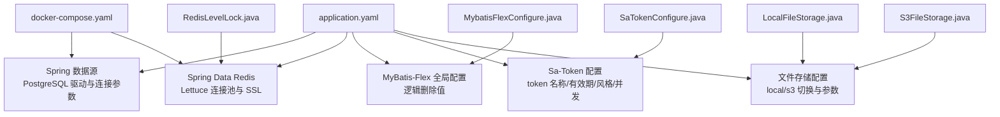
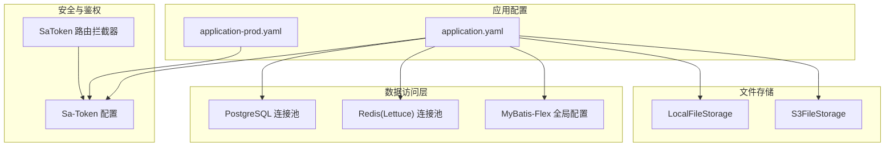
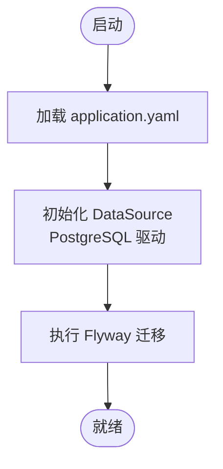
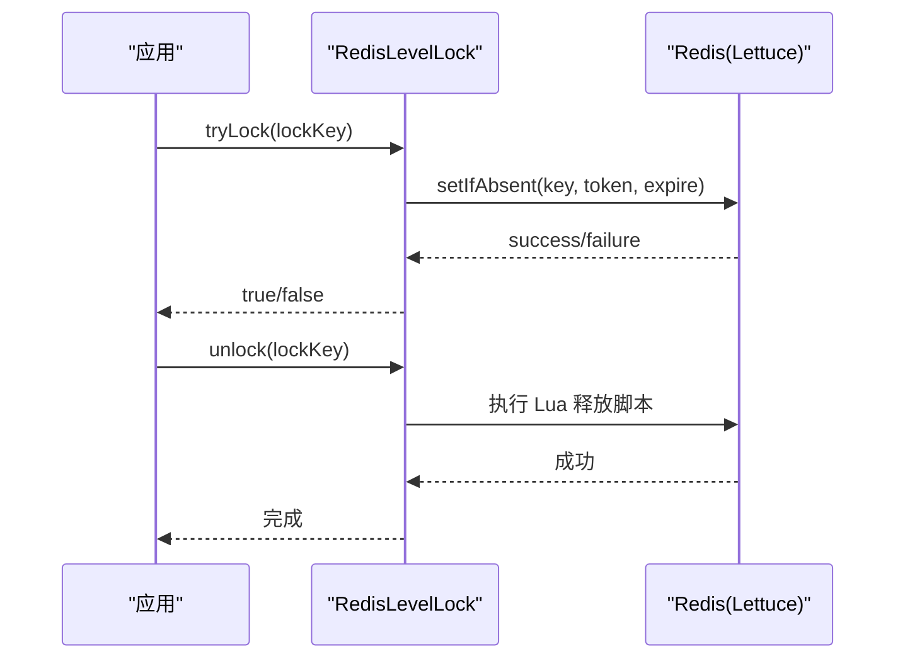
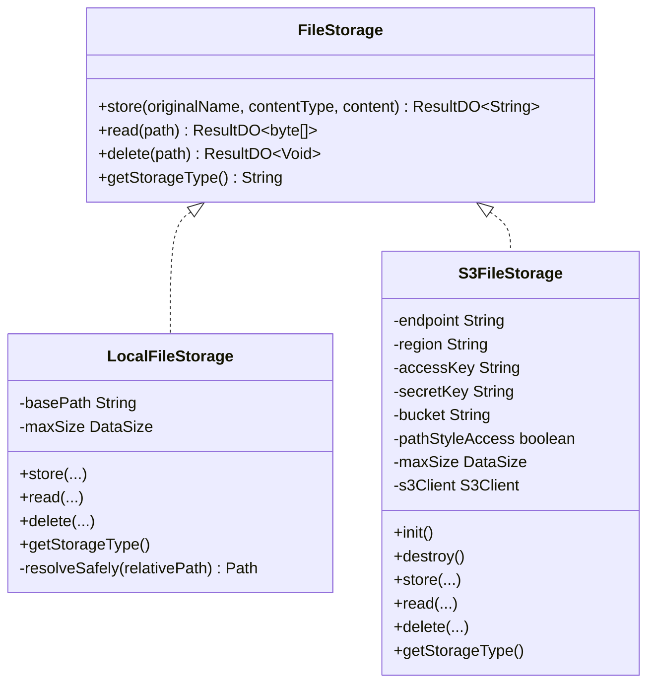
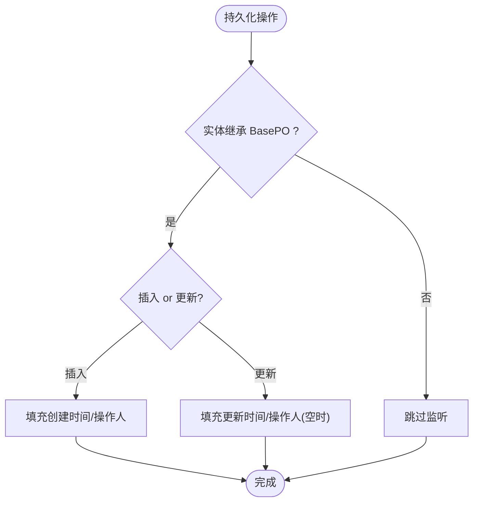
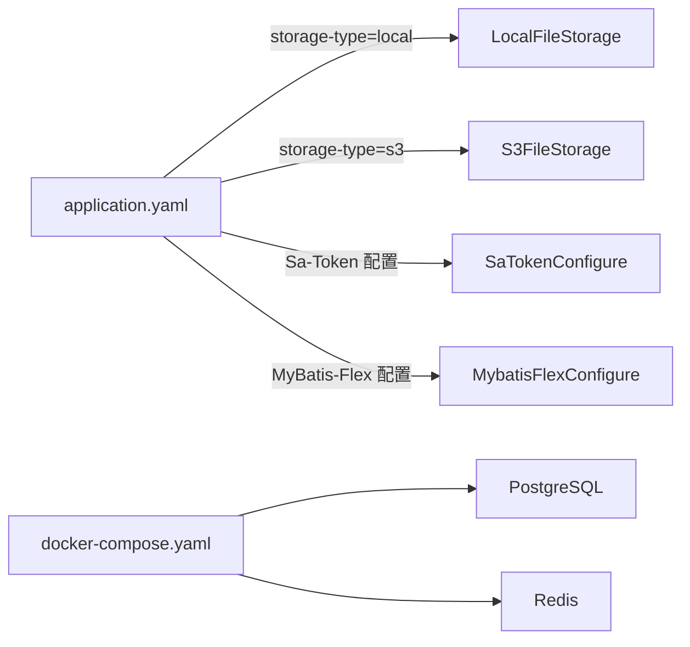

# 核心配置详解

<cite>
**本文引用的文件列表**
- [application.yaml](file://src/main/resources/application.yaml)
- [application-prod.yaml](file://src/main/resources/application-prod.yaml)
- [SaTokenConfigure.java](file://src/main/java/com/sunnao/spring/ddd/template/common/config/SaTokenConfigure.java)
- [MybatisFlexConfigure.java](file://src/main/java/com/sunnao/spring/ddd/template/common/config/MybatisFlexConfigure.java)
- [LocalFileStorage.java](file://src/main/java/com/sunnao/spring/ddd/template/adaptor/system/file/output/LocalFileStorage.java)
- [S3FileStorage.java](file://src/main/java/com/sunnao/spring/ddd/template/adaptor/system/file/output/S3FileStorage.java)
- [FileStorage.java](file://src/main/java/com/sunnao/spring/ddd/template/application/system/file/FileStorage.java)
- [RedisLevelLock.java](file://src/main/java/com/sunnao/spring/ddd/template/common/lock/RedisLevelLock.java)
- [docker-compose.yaml](file://docker-compose.yaml)
</cite>

## 目录
1. [简介](#简介)
2. [项目结构](#项目结构)
3. [核心组件](#核心组件)
4. [架构总览](#架构总览)
5. [详细组件分析](#详细组件分析)
6. [依赖关系分析](#依赖关系分析)
7. [性能考虑与调优建议](#性能考虑与调优建议)
8. [故障排查指南](#故障排查指南)
9. [结论](#结论)

## 简介
本文件聚焦于项目的“核心配置”，围绕以下方面提供系统化说明：
- 数据库连接池配置（PostgreSQL 驱动、连接参数）
- Redis 缓存配置（连接参数、SSL、连接池、库选择）
- 文件存储配置（本地磁盘与 S3 兼容对象存储）
- Sa-Token 认证框架配置（token 有效期、并发登录、token 风格等）
- MyBatis-Flex ORM 配置（逻辑删除、全局审计填充）
并提供各配置项的参数说明与性能调优建议。

## 项目结构
核心配置集中在资源配置文件与若干配置类中，关键位置如下：
- 应用主配置：application.yaml
- 生产环境覆盖：application-prod.yaml
- 安全与鉴权：SaTokenConfigure.java
- ORM 与审计：MybatisFlexConfigure.java
- 文件存储实现：LocalFileStorage.java、S3FileStorage.java
- 分布式锁（基于 Redis）：RedisLevelLock.java
- 开发环境依赖编排：docker-compose.yaml

图表来源
- [application.yaml:1-88](file://src/main/resources/application.yaml#L1-L88)
- [SaTokenConfigure.java:1-31](file://src/main/java/com/sunnao/spring/ddd/template/common/config/SaTokenConfigure.java#L1-L31)
- [MybatisFlexConfigure.java:1-73](file://src/main/java/com/sunnao/spring/ddd/template/common/config/MybatisFlexConfigure.java#L1-L73)
- [LocalFileStorage.java:1-115](file://src/main/java/com/sunnao/spring/ddd/template/adaptor/system/file/output/LocalFileStorage.java#L1-L115)
- [S3FileStorage.java:1-190](file://src/main/java/com/sunnao/spring/ddd/template/adaptor/system/file/output/S3FileStorage.java#L1-L190)
- [RedisLevelLock.java:43-74](file://src/main/java/com/sunnao/spring/ddd/template/common/lock/RedisLevelLock.java#L43-L74)
- [docker-compose.yaml:1-36](file://docker-compose.yaml#L1-L36)

章节来源
- [application.yaml:1-88](file://src/main/resources/application.yaml#L1-L88)
- [application-prod.yaml:1-7](file://src/main/resources/application-prod.yaml#L1-L7)

## 核心组件
本节对核心配置进行概览式解读，后续章节将逐项深入。

- 数据库连接池（PostgreSQL）
  - 驱动：org.postgresql.Driver
  - URL：jdbc:postgresql://${DB_HOST:localhost}:${DB_PORT:5432}/${DB_NAME:spring_ddd_template}
  - 用户名/密码：通过环境变量注入
  - 说明：未显式配置 HikariCP 参数时，使用 Spring Boot 默认连接池；可通过扩展配置调整最大连接数、空闲超时等

- Redis 缓存
  - 主机/端口/密码/库号：通过环境变量注入
  - SSL：可启用
  - 连接池（Lettuce）：max-active、max-idle、min-idle 已配置
  - 使用场景：会话/权限缓存、分布式锁、字典缓存失效等

- 文件存储
  - 类型切换：app.file.storage-type=local|s3
  - 本地存储：根路径 app.file.local.base-path，单文件大小上限 app.file.max-size
  - S3 兼容：endpoint、region、access-key、secret-key、bucket、path-style-access

- Sa-Token
  - token-name、timeout、is-read-header/is-read-cookie、token-style、is-concurrent
  - 路由拦截：除 /api/auth/** 外，/api/** 需登录态；OpenAPI 路径放行

- MyBatis-Flex
  - 逻辑删除：normal-value-of-logic-delete=0，deleted-value-of-logic-delete=1
  - 审计字段自动填充：插入/更新时自动填充 createAt/updateAt/createBy/updateBy

章节来源
- [application.yaml:9-26](file://src/main/resources/application.yaml#L9-L26)
- [application.yaml:38-42](file://src/main/resources/application.yaml#L38-L42)
- [application.yaml:44-56](file://src/main/resources/application.yaml#L44-L56)
- [application.yaml:64-87](file://src/main/resources/application.yaml#L64-L87)
- [MybatisFlexConfigure.java:20-27](file://src/main/java/com/sunnao/spring/ddd/template/common/config/MybatisFlexConfigure.java#L20-L27)
- [SaTokenConfigure.java:17-30](file://src/main/java/com/sunnao/spring/ddd/template/common/config/SaTokenConfigure.java#L17-L30)

## 架构总览
下图展示了核心配置在运行期如何影响系统行为：

图表来源
- [application.yaml:1-88](file://src/main/resources/application.yaml#L1-L88)
- [application-prod.yaml:1-7](file://src/main/resources/application-prod.yaml#L1-L7)
- [SaTokenConfigure.java:17-30](file://src/main/java/com/sunnao/spring/ddd/template/common/config/SaTokenConfigure.java#L17-L30)
- [LocalFileStorage.java:26-28](file://src/main/java/com/sunnao/spring/ddd/template/adaptor/system/file/output/LocalFileStorage.java#L26-L28)
- [S3FileStorage.java:40-42](file://src/main/java/com/sunnao/spring/ddd/template/adaptor/system/file/output/S3FileStorage.java#L40-L42)

## 详细组件分析

### 数据库连接池（PostgreSQL）
- 驱动与连接参数
  - 驱动类：org.postgresql.Driver
  - JDBC URL：包含主机、端口、库名，均支持环境变量占位
  - 用户名/密码：通过环境变量注入
- 连接池
  - 未显式配置 HikariCP 参数，采用 Spring Boot 默认值
  - 如需调优，可在 application.yaml 的 spring.datasource.hikari.* 下补充（如 maximum-pool-size、idle-timeout、connection-timeout 等）
- 初始化与迁移
  - Flyway 启用，迁移脚本位于 classpath:db/migration
  - baseline-on-migrate=true，兼容已有库

图表来源
- [application.yaml:9-13](file://src/main/resources/application.yaml#L9-L13)
- [application.yaml:32-36](file://src/main/resources/application.yaml#L32-L36)
- [docker-compose.yaml:4-20](file://docker-compose.yaml#L4-L20)

章节来源
- [application.yaml:9-13](file://src/main/resources/application.yaml#L9-L13)
- [application.yaml:32-36](file://src/main/resources/application.yaml#L32-L36)
- [docker-compose.yaml:1-20](file://docker-compose.yaml#L1-L20)

### Redis 缓存配置
- 连接参数
  - host/port/password/database 均支持环境变量注入
- SSL
  - data.redis.ssl.enabled 支持开关
- 连接池（Lettuce）
  - max-active/max-idle/min-idle 已配置
- 使用点
  - 分布式锁（RedisLevelLock）
  - 字典缓存失效（事务提交后失效）

图表来源
- [RedisLevelLock.java:43-74](file://src/main/java/com/sunnao/spring/ddd/template/common/lock/RedisLevelLock.java#L43-L74)
- [application.yaml:14-26](file://src/main/resources/application.yaml#L14-L26)

章节来源
- [application.yaml:14-26](file://src/main/resources/application.yaml#L14-L26)
- [RedisLevelLock.java:43-74](file://src/main/java/com/sunnao/spring/ddd/template/common/lock/RedisLevelLock.java#L43-L74)

### 文件存储配置
- 类型切换
  - app.file.storage-type=local（默认）或 s3
- 本地存储（LocalFileStorage）
  - 根路径：app.file.local.base-path
  - 单文件大小上限：app.file.max-size
  - 路径生成规则：按日期分目录 + UUID，避免单目录文件过多
  - 安全性：解析相对路径并校验不逃逸出根目录
- S3 兼容存储（S3FileStorage）
  - endpoint/region/access-key/secret-key/bucket/path-style-access
  - 客户端初始化失败会直接抛出异常，避免运行期才暴露问题
  - 关闭第三方 S3 兼容服务不支持的 CRC 强制校验

图表来源
- [FileStorage.java:12-46](file://src/main/java/com/sunnao/spring/ddd/template/application/system/file/FileStorage.java#L12-L46)
- [LocalFileStorage.java:26-115](file://src/main/java/com/sunnao/spring/ddd/template/adaptor/system/file/output/LocalFileStorage.java#L26-L115)
- [S3FileStorage.java:40-190](file://src/main/java/com/sunnao/spring/ddd/template/adaptor/system/file/output/S3FileStorage.java#L40-L190)

章节来源
- [application.yaml:64-87](file://src/main/resources/application.yaml#L64-L87)
- [LocalFileStorage.java:26-115](file://src/main/java/com/sunnao/spring/ddd/template/adaptor/system/file/output/LocalFileStorage.java#L26-L115)
- [S3FileStorage.java:40-190](file://src/main/java/com/sunnao/spring/ddd/template/adaptor/system/file/output/S3FileStorage.java#L40-L190)

### Sa-Token 认证框架配置
- 配置项
  - token-name：请求头中的 token 名称
  - timeout：token 有效期（秒），-1 表示永不过期
  - is-read-header/is-read-cookie：是否从请求头/Cookie 读取
  - token-style：token 风格（uuid）
  - is-concurrent：是否允许同一账号多地登录
- 路由拦截
  - 除 /api/auth/** 外，/api/** 全部要求登录态
  - OpenAPI 文档路径放行

```mermaid
sequenceDiagram
participant Client as "客户端"
participant MVC as "WebMvc"
participant Interceptor as "SaInterceptor"
participant Sa as "Sa-Token"
Client->>MVC : 发起 /api/** 请求
MVC->>Interceptor : 匹配路径
Interceptor->>Sa : checkLogin()
alt 未登录
Sa-->>Interceptor : 未通过
Interceptor-->>Client : 返回未认证
else 已登录
Sa-->>Interceptor : 通过
Interceptor-->>Client : 继续处理
end
```

图表来源
- [SaTokenConfigure.java:17-30](file://src/main/java/com/sunnao/spring/ddd/template/common/config/SaTokenConfigure.java#L17-L30)
- [application.yaml:44-56](file://src/main/resources/application.yaml#L44-L56)

章节来源
- [application.yaml:44-56](file://src/main/resources/application.yaml#L44-L56)
- [SaTokenConfigure.java:17-30](file://src/main/java/com/sunnao/spring/ddd/template/common/config/SaTokenConfigure.java#L17-L30)

### MyBatis-Flex ORM 配置
- 逻辑删除
  - normal-value-of-logic-delete=0
  - deleted-value-of-logic-delete=1
- 审计字段自动填充
  - 插入监听器：填充 createAt/updateAt/createBy/updateBy（若为空）
  - 更新监听器：填充 updateAt，updateBy 若为空则填充
  - 操作人取自当前用户上下文

图表来源
- [MybatisFlexConfigure.java:20-73](file://src/main/java/com/sunnao/spring/ddd/template/common/config/MybatisFlexConfigure.java#L20-L73)
- [application.yaml:38-42](file://src/main/resources/application.yaml#L38-L42)

章节来源
- [application.yaml:38-42](file://src/main/resources/application.yaml#L38-L42)
- [MybatisFlexConfigure.java:20-73](file://src/main/java/com/sunnao/spring/ddd/template/common/config/MybatisFlexConfigure.java#L20-L73)

## 依赖关系分析
- 配置到实现的装配
  - 文件存储：通过 @ConditionalOnProperty 根据 app.file.storage-type 选择 LocalFileStorage 或 S3FileStorage
  - 安全：SaTokenConfigure 注册 SaInterceptor，结合 Sa-Token 配置生效
  - ORM：MybatisFlexConfigure 注册全局监听器，作用于所有继承 BasePO 的实体
- 外部依赖
  - PostgreSQL：由 docker-compose.yaml 提供本地开发环境
  - Redis：由 docker-compose.yaml 提供本地开发环境

图表来源
- [LocalFileStorage.java:26-28](file://src/main/java/com/sunnao/spring/ddd/template/adaptor/system/file/output/LocalFileStorage.java#L26-L28)
- [S3FileStorage.java:40-42](file://src/main/java/com/sunnao/spring/ddd/template/adaptor/system/file/output/S3FileStorage.java#L40-L42)
- [SaTokenConfigure.java:17-30](file://src/main/java/com/sunnao/spring/ddd/template/common/config/SaTokenConfigure.java#L17-L30)
- [MybatisFlexConfigure.java:20-27](file://src/main/java/com/sunnao/spring/ddd/template/common/config/MybatisFlexConfigure.java#L20-L27)
- [docker-compose.yaml:1-36](file://docker-compose.yaml#L1-L36)

章节来源
- [LocalFileStorage.java:26-28](file://src/main/java/com/sunnao/spring/ddd/template/adaptor/system/file/output/LocalFileStorage.java#L26-L28)
- [S3FileStorage.java:40-42](file://src/main/java/com/sunnao/spring/ddd/template/adaptor/system/file/output/S3FileStorage.java#L40-L42)
- [SaTokenConfigure.java:17-30](file://src/main/java/com/sunnao/spring/ddd/template/common/config/SaTokenConfigure.java#L17-L30)
- [MybatisFlexConfigure.java:20-27](file://src/main/java/com/sunnao/spring/ddd/template/common/config/MybatisFlexConfigure.java#L20-L27)
- [docker-compose.yaml:1-36](file://docker-compose.yaml#L1-L36)

## 性能考虑与调优建议
- 数据库连接池（PostgreSQL）
  - 当前未显式配置 HikariCP 参数，建议在高并发场景下调整：
    - maximum-pool-size：根据 CPU 核数与 IO 能力设置，通常 2x~4x CPU 核数起步
    - connection-timeout：合理缩短以快速失败
    - idle-timeout：降低空闲连接保持时间，减少资源占用
  - 参考：[application.yaml:9-13](file://src/main/resources/application.yaml#L9-L13)
- Redis 连接池（Lettuce）
  - 已配置 max-active=16、max-idle=8、min-idle=2，可按 QPS 与延迟目标微调
  - 开启 SSL 会增加加密开销，建议在跨网络传输且需要安全合规时启用
  - 参考：[application.yaml:14-26](file://src/main/resources/application.yaml#L14-L26)
- 文件存储
  - 本地存储：确保 base-path 所在磁盘有足够空间与 IO 吞吐；大文件上传建议配合 CDN 或对象存储
  - S3 兼容：合理设置 path-style-access；对于高吞吐场景，关注 SDK 连接复用与重试策略
  - 参考：
    - [LocalFileStorage.java:33-40](file://src/main/java/com/sunnao/spring/ddd/template/adaptor/system/file/output/LocalFileStorage.java#L33-L40)
    - [S3FileStorage.java:47-84](file://src/main/java/com/sunnao/spring/ddd/template/adaptor/system/file/output/S3FileStorage.java#L47-L84)
- Sa-Token
  - timeout 较大意味着长会话，需权衡安全风险与用户体验；必要时结合刷新机制
  - is-concurrent=true 提升体验但增加会话管理复杂度
  - 参考：[application.yaml:44-56](file://src/main/resources/application.yaml#L44-L56)
- MyBatis-Flex
  - 逻辑删除为 0/1，注意查询条件与索引设计，避免全表扫描
  - 审计字段自动填充减少业务代码侵入，但需保证 CurrentUserContext 正确设置
  - 参考：
    - [application.yaml:38-42](file://src/main/resources/application.yaml#L38-L42)
    - [MybatisFlexConfigure.java:32-71](file://src/main/java/com/sunnao/spring/ddd/template/common/config/MybatisFlexConfigure.java#L32-L71)

## 故障排查指南
- 无法连接 PostgreSQL
  - 检查环境变量 DB_HOST/DB_PORT/DB_NAME/DB_USERNAME/DB_PASSWORD 是否正确
  - 确认 Flyway 迁移是否成功执行
  - 参考：[application.yaml:9-13](file://src/main/resources/application.yaml#L9-L13)、[application.yaml:32-36](file://src/main/resources/application.yaml#L32-L36)
- Redis 连接失败
  - 检查 REDIS_HOST/REDIS_PORT/REDIS_PASSWORD/REDIS_DATABASE 与 SSL 开关
  - 观察分布式锁加锁日志，定位网络或权限问题
  - 参考：[application.yaml:14-26](file://src/main/resources/application.yaml#L14-L26)、[RedisLevelLock.java:43-74](file://src/main/java/com/sunnao/spring/ddd/template/common/lock/RedisLevelLock.java#L43-L74)
- 文件上传失败
  - 本地存储：检查 app.file.local.base-path 是否存在与可写；查看大小限制 app.file.max-size
  - S3 存储：检查 endpoint/region/access-key/secret-key/bucket/path-style-access 配置完整性；客户端初始化失败会在启动时报错
  - 参考：
    - [LocalFileStorage.java:33-40](file://src/main/java/com/sunnao/spring/ddd/template/adaptor/system/file/output/LocalFileStorage.java#L33-L40)
    - [S3FileStorage.java:94-113](file://src/main/java/com/sunnao/spring/ddd/template/adaptor/system/file/output/S3FileStorage.java#L94-L113)
- 鉴权异常
  - 确认 token-name、is-read-header/is-read-cookie、token-style 与前端一致
  - 检查路由拦截排除路径（/api/auth/**、OpenAPI 路径）
  - 参考：[application.yaml:44-56](file://src/main/resources/application.yaml#L44-L56)、[SaTokenConfigure.java:17-30](file://src/main/java/com/sunnao/spring/ddd/template/common/config/SaTokenConfigure.java#L17-L30)
- 审计字段未填充
  - 确认实体继承 BasePO，且 CurrentUserContext 已设置 userId
  - 参考：[MybatisFlexConfigure.java:32-71](file://src/main/java/com/sunnao/spring/ddd/template/common/config/MybatisFlexConfigure.java#L32-L71)

章节来源
- [application.yaml:9-13](file://src/main/resources/application.yaml#L9-L13)
- [application.yaml:14-26](file://src/main/resources/application.yaml#L14-L26)
- [application.yaml:32-36](file://src/main/resources/application.yaml#L32-L36)
- [application.yaml:44-56](file://src/main/resources/application.yaml#L44-L56)
- [application.yaml:64-87](file://src/main/resources/application.yaml#L64-L87)
- [RedisLevelLock.java:43-74](file://src/main/java/com/sunnao/spring/ddd/template/common/lock/RedisLevelLock.java#L43-L74)
- [LocalFileStorage.java:33-40](file://src/main/java/com/sunnao/spring/ddd/template/adaptor/system/file/output/LocalFileStorage.java#L33-L40)
- [S3FileStorage.java:94-113](file://src/main/java/com/sunnao/spring/ddd/template/adaptor/system/file/output/S3FileStorage.java#L94-L113)
- [SaTokenConfigure.java:17-30](file://src/main/java/com/sunnao/spring/ddd/template/common/config/SaTokenConfigure.java#L17-L30)
- [MybatisFlexConfigure.java:32-71](file://src/main/java/com/sunnao/spring/ddd/template/common/config/MybatisFlexConfigure.java#L32-L71)

## 结论
本项目通过集中化的配置文件与少量配置类，实现了数据库、缓存、文件存储、认证与 ORM 的核心能力。配置项清晰、可扩展性强，并通过条件装配与监听器机制降低了业务侵入性。在生产环境中，建议结合压测结果对连接池、Redis 池与文件存储策略进行针对性调优，同时严格管控敏感配置的环境变量注入方式，保障安全与稳定性。