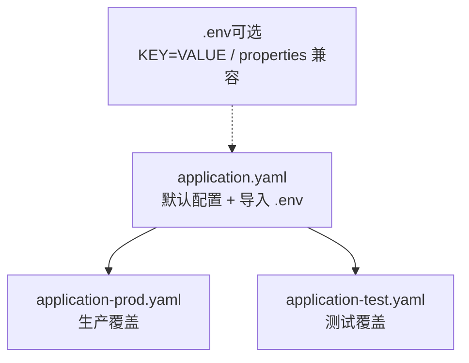
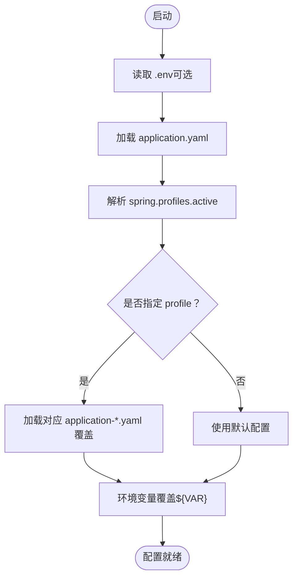
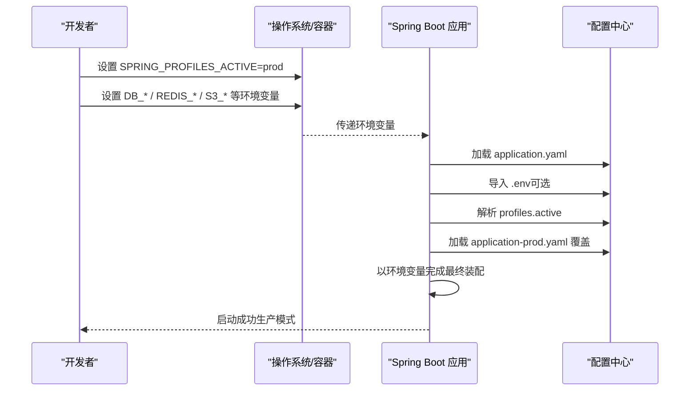
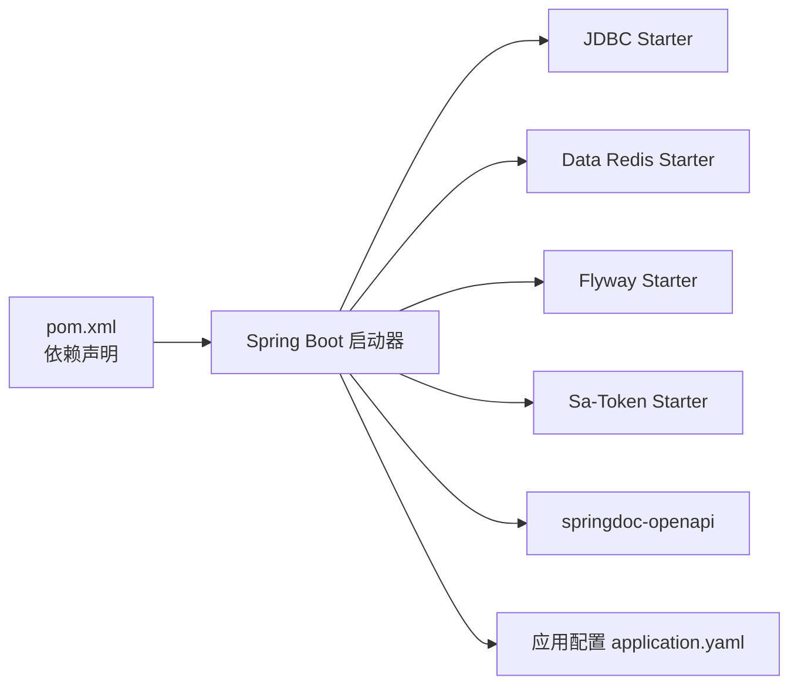

# 环境配置管理

<cite>
**本文引用的文件**   
- [application.yaml](file://src/main/resources/application.yaml)
- [application-prod.yaml](file://src/main/resources/application-prod.yaml)
- [application-test.yaml](file://src/test/resources/application-test.yaml)
- [README.md](file://README.md)
- [pom.xml](file://pom.xml)
- [SecurityConfigure.java](file://src/main/java/com/sunnao/spring/ddd/template/common/config/SecurityConfigure.java)
- [SpringDddTemplateApplicationTests.java](file://src/test/java/com/sunnao/spring/ddd/template/SpringDddTemplateApplicationTests.java)
</cite>

## 目录
1. [简介](#简介)
2. [项目结构](#项目结构)
3. [核心组件](#核心组件)
4. [架构总览](#架构总览)
5. [详细组件分析](#详细组件分析)
6. [依赖关系分析](#依赖关系分析)
7. [性能与可观测性](#性能与可观测性)
8. [故障排查指南](#故障排查指南)
9. [结论](#结论)
10. [附录](#附录)

## 简介
本文件面向“环境配置管理”，围绕多环境策略（开发 dev、生产 prod、测试 test）、Spring Profiles 激活机制、环境变量注入、敏感信息安全管理、.env 文件使用方式，以及最佳实践与安全建议进行系统化说明。文档内容严格基于仓库现有实现与约定，帮助读者在不同环境中安全、稳定地切换配置。

## 项目结构
本项目采用 Spring Boot 标准资源组织方式，配置文件集中于 resources 目录：
- 主应用配置：src/main/resources/application.yaml
- 生产环境覆盖：src/main/resources/application-prod.yaml
- 测试环境覆盖：src/test/resources/application-test.yaml
- 可选本地变量：项目根目录 .env（通过 optional:file:.env[.properties] 导入）

图表来源
- [application.yaml:1-88](file://src/main/resources/application.yaml#L1-L88)
- [application-prod.yaml:1-7](file://src/main/resources/application-prod.yaml#L1-L7)
- [application-test.yaml:1-18](file://src/test/resources/application-test.yaml#L1-L18)

章节来源
- [application.yaml:1-88](file://src/main/resources/application.yaml#L1-L88)
- [application-prod.yaml:1-7](file://src/main/resources/application-prod.yaml#L1-L7)
- [application-test.yaml:1-18](file://src/test/resources/application-test.yaml#L1-L18)
- [README.md:76-82](file://README.md#L76-L82)

## 核心组件
- 默认配置与外部化变量
  - 通过 spring.config.import 引入项目根目录的 .env 文件（不存在时跳过），支持 KEY=VALUE 与 properties 格式。
  - 通过 ${VAR:default} 占位符注入环境变量或 .env 值；未提供且无默认值时会报错。
- 多环境 Profile 激活
  - spring.profiles.active 默认值为 dev，可通过环境变量 SPRING_PROFILES_ACTIVE 覆盖。
  - application-prod.yaml 用于生产覆盖（如关闭 swagger-ui 和 api-docs）。
  - application-test.yaml 用于集成测试，连接云数据库/Redis，缺失关键环境变量时测试自动跳过。
- 敏感信息与环境隔离
  - 数据库、Redis、S3 等敏感参数均通过环境变量注入，避免落盘到代码库。
  - 生产环境禁用接口文档暴露，减少攻击面。

章节来源
- [application.yaml:4-8](file://src/main/resources/application.yaml#L4-L8)
- [application.yaml:9-26](file://src/main/resources/application.yaml#L9-L26)
- [application.yaml:76-87](file://src/main/resources/application.yaml#L76-L87)
- [application-prod.yaml:1-7](file://src/main/resources/application-prod.yaml#L1-L7)
- [application-test.yaml:1-18](file://src/test/resources/application-test.yaml#L1-L18)
- [README.md:76-82](file://README.md#L76-L82)

## 架构总览
下图展示配置加载与生效顺序：.env → application.yaml → 激活的 profile 覆盖 → 运行期环境变量优先级最高。

图表来源
- [application.yaml:4-8](file://src/main/resources/application.yaml#L4-L8)
- [application-prod.yaml:1-7](file://src/main/resources/application-prod.yaml#L1-L7)
- [application-test.yaml:1-18](file://src/test/resources/application-test.yaml#L1-L18)

## 详细组件分析

### 1) 多环境配置策略（dev / prod / test）
- 开发环境（dev）
  - 默认激活，适合本地快速启动；配合 docker-compose 提供 PostgreSQL 与 Redis。
  - 所有连接信息通过环境变量注入，便于在本地 .env 中维护。
- 生产环境（prod）
  - 通过 SPRING_PROFILES_ACTIVE=prod 激活。
  - 关闭 swagger-ui 与 openapi 文档，避免接口暴露。
  - 所有连接信息必须通过环境变量注入，禁止硬编码。
- 测试环境（test）
  - 集成测试使用 application-test.yaml，强制走 TEST_PG_URL、TEST_REDIS_HOST 等环境变量。
  - 若缺少必要环境变量，测试用例将自动跳过，保证 CI 稳定性。

章节来源
- [README.md:76-82](file://README.md#L76-L82)
- [application-prod.yaml:1-7](file://src/main/resources/application-prod.yaml#L1-L7)
- [application-test.yaml:1-18](file://src/test/resources/application-test.yaml#L1-L18)
- [SpringDddTemplateApplicationTests.java:14-16](file://src/test/java/com/sunnao/spring/ddd/template/SpringDddTemplateApplicationTests.java#L14-L16)

### 2) Spring Profiles 使用方法与激活机制
- 默认激活：spring.profiles.active=${SPRING_PROFILES_ACTIVE:dev}
- 覆盖方式：
  - 命令行：--spring.profiles.active=prod
  - 环境变量：export SPRING_PROFILES_ACTIVE=prod
  - IDE 运行配置：添加 VM 参数或环境变量
- 覆盖规则：profile 配置文件会覆盖 application.yaml 中的同名属性。

章节来源
- [application.yaml:7-8](file://src/main/resources/application.yaml#L7-L8)
- [application-prod.yaml:1-7](file://src/main/resources/application-prod.yaml#L1-L7)

### 3) 环境变量管理与敏感信息注入
- 数据库（PostgreSQL）
  - 驱动、URL、用户名、密码均通过环境变量注入，避免明文落盘。
- Redis
  - host、port、password、database、ssl 等均通过环境变量注入。
- S3 对象存储
  - endpoint、region、access-key、secret-key、bucket、path-style-access 全部通过环境变量注入，密钥不落盘。
- 安全建议
  - 仅在生产与测试环境设置真实凭据；开发环境可在 .env 中配置本地值。
  - 严禁将 .env 提交至版本库；CI/CD 平台应通过密钥管理服务注入。

章节来源
- [application.yaml:9-26](file://src/main/resources/application.yaml#L9-L26)
- [application.yaml:76-87](file://src/main/resources/application.yaml#L76-L87)

### 4) .env 文件格式与使用方式
- 位置：项目根目录
- 格式：KEY=VALUE 或 properties 键值对（例如 key=value）
- 行为：optional:file:.env[.properties] 表示文件不存在时跳过，不会导致启动失败
- 典型用途：
  - 本地开发时集中管理 DB、Redis、S3 等连接信息
  - 与系统环境变量共存时，遵循 Spring 外部化配置优先级（系统环境变量 > .env）

章节来源
- [application.yaml:4-6](file://src/main/resources/application.yaml#L4-L6)

### 5) 不同环境切换配置流程

图表来源
- [application.yaml:4-8](file://src/main/resources/application.yaml#L4-L8)
- [application-prod.yaml:1-7](file://src/main/resources/application-prod.yaml#L1-L7)

### 6) 配置验证与环境隔离策略
- 必填校验
  - 对于必须存在的环境变量（如数据库 URL、Redis Host），建议在部署前进行前置检查，或在应用启动阶段进行断言，避免运行时异常。
- 环境隔离
  - 通过不同的 Profile 与独立的环境变量空间实现隔离，确保各环境互不影响。
  - 测试环境通过 @EnabledIfEnvironmentVariable 条件注解，缺失关键变量时自动跳过，保障流水线稳定性。

章节来源
- [application-test.yaml:1-18](file://src/test/resources/application-test.yaml#L1-L18)
- [SpringDddTemplateApplicationTests.java:14-16](file://src/test/java/com/sunnao/spring/ddd/template/SpringDddTemplateApplicationTests.java#L14-L16)

### 7) 安全与合规建议
- 最小权限原则：为每个环境创建独立的数据库/Redis/对象存储账号，限制访问范围。
- 密钥轮换：定期轮换敏感凭据，并在 CI/CD 中自动化更新。
- 审计与告警：对生产环境的配置变更进行审计与告警。
- 网络隔离：生产服务与依赖之间通过内网/VPC 通信，禁止公网直连。
- 日志脱敏：确保日志不输出敏感字段（如密码、密钥）。

[本节为通用安全建议，不直接分析具体文件]

## 依赖关系分析
- 构建与打包
  - Spring Boot Maven Plugin 负责打包与运行；编译期启用 Lombok、MapStruct、MyBatis-Flex 注解处理器。
- 运行时依赖
  - JDBC、Redis、Flyway、Sa-Token、springdoc-openapi 等 starter 由 pom.xml 声明，结合 application.yaml 完成自动装配。

图表来源
- [pom.xml:1-217](file://pom.xml#L1-L217)
- [application.yaml:1-88](file://src/main/resources/application.yaml#L1-L88)

章节来源
- [pom.xml:1-217](file://pom.xml#L1-L217)
- [application.yaml:1-88](file://src/main/resources/application.yaml#L1-L88)

## 性能与可观测性
- 连接池与线程池
  - Redis Lettuce 连接池大小、空闲数等已在配置中给出，可根据压测结果调优。
- 文档与调试
  - 开发环境开启 springdoc UI，生产环境关闭，降低开销与风险。
- 上下文与追踪
  - 安全相关配置（如信任 X-Forwarded-For）通过 @Value 注入并初始化上下文工具类，便于链路追踪与审计。

章节来源
- [application.yaml:22-26](file://src/main/resources/application.yaml#L22-L26)
- [application-prod.yaml:1-7](file://src/main/resources/application-prod.yaml#L1-L7)
- [SecurityConfigure.java:15-27](file://src/main/java/com/sunnao/spring/ddd/template/common/config/SecurityConfigure.java#L15-L27)

## 故障排查指南
- 常见问题
  - 启动时报“找不到环境变量”：检查 .env 是否存在、环境变量名是否正确、是否被上层覆盖。
  - 测试用例跳过：确认 TEST_PG_URL、TEST_REDIS_HOST 等已正确设置。
  - 生产接口文档仍可见：确认 SPRING_PROFILES_ACTIVE=prod 且 application-prod.yaml 已生效。
- 定位步骤
  - 打印当前激活的 profiles：查看启动日志中 “The following profiles are active: ...”。
  - 验证配置合并：使用 Spring Boot Actuator 的 /actuator/env（需开启）查看最终生效值。
  - 检查 .env 路径与权限：确保应用进程可读项目根目录下的 .env。

章节来源
- [application-test.yaml:1-18](file://src/test/resources/application-test.yaml#L1-L18)
- [application-prod.yaml:1-7](file://src/main/resources/application-prod.yaml#L1-L7)
- [application.yaml:4-8](file://src/main/resources/application.yaml#L4-L8)

## 结论
本项目通过 .env 导入、Spring Profiles 与高优先级环境变量三者协同，实现了清晰的多环境配置体系。敏感信息一律通过环境变量注入，生产环境关闭调试能力，测试环境具备健壮的条件跳过机制。遵循本文的最佳实践与安全建议，可在保证安全性的前提下高效地在不同环境间切换与发布。

## 附录

### A. 常用环境变量清单（示例）
- 数据库
  - DB_HOST、DB_PORT、DB_NAME、DB_USERNAME、DB_PASSWORD
- Redis
  - REDIS_HOST、REDIS_PORT、REDIS_PASSWORD、REDIS_DATABASE、REDIS_SSL
- S3 对象存储
  - S3_ENDPOINT、S3_REGION、S3_ACCESS_KEY、S3_SECRET_KEY、S3_BUCKET、S3_PATH_STYLE_ACCESS
- 测试环境
  - TEST_PG_URL、TEST_PG_USERNAME、TEST_PG_PASSWORD、TEST_REDIS_HOST、TEST_REDIS_PORT、TEST_REDIS_PASSWORD、TEST_REDIS_DATABASE

章节来源
- [application.yaml:9-26](file://src/main/resources/application.yaml#L9-L26)
- [application.yaml:76-87](file://src/main/resources/application.yaml#L76-L87)
- [application-test.yaml:1-18](file://src/test/resources/application-test.yaml#L1-L18)

### B. 本地快速开始（参考 README）
- 启动依赖：docker compose up -d
- 启动应用：mvnw spring-boot:run（默认 dev 环境）
- API 文档：http://localhost:8080/swagger-ui.html

章节来源
- [README.md:63-74](file://README.md#L63-L74)