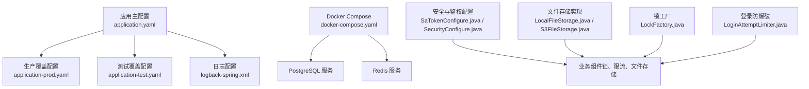
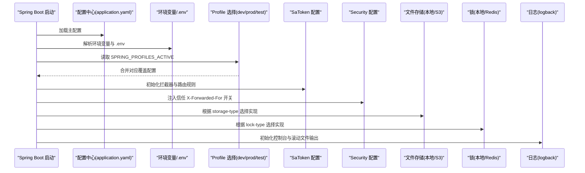
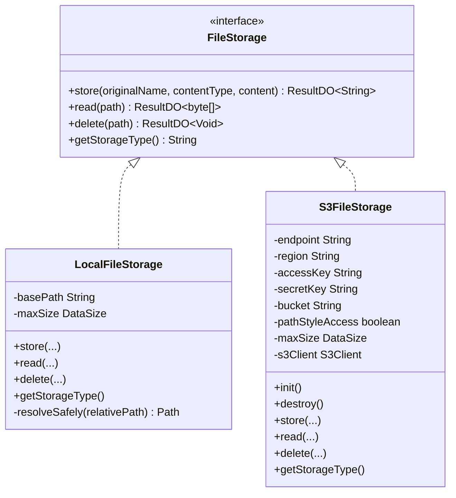
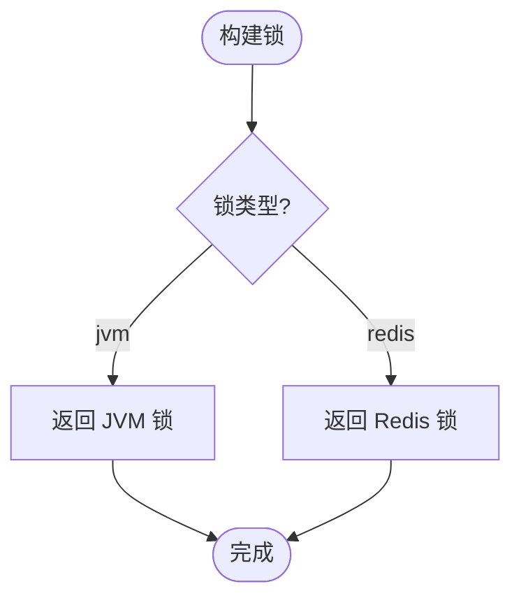
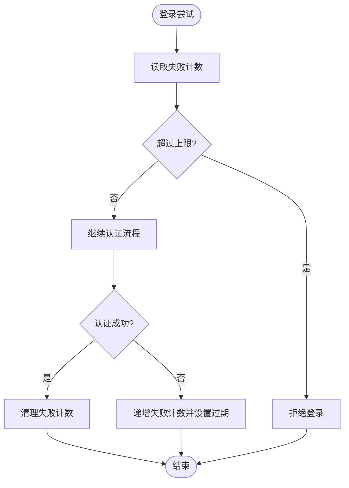
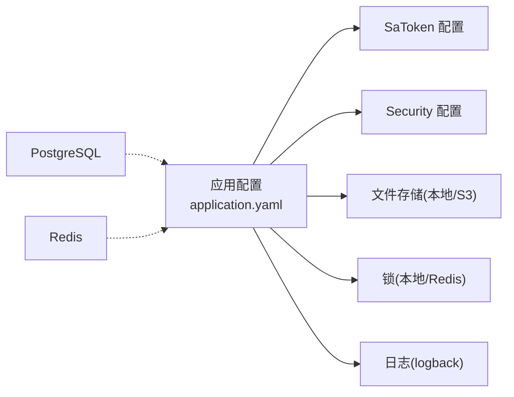

# 配置管理

<cite>
**本文引用的文件列表**
- [application.yaml](file://src/main/resources/application.yaml)
- [application-prod.yaml](file://src/main/resources/application-prod.yaml)
- [application-test.yaml](file://src/test/resources/application-test.yaml)
- [logback-spring.xml](file://src/main/resources/logback-spring.xml)
- [docker-compose.yaml](file://docker-compose.yaml)
- [SaTokenConfigure.java](file://src/main/java/com/sunnao/spring/ddd/template/common/config/SaTokenConfigure.java)
- [SecurityConfigure.java](file://src/main/java/com/sunnao/spring/ddd/template/common/config/SecurityConfigure.java)
- [LocalFileStorage.java](file://src/main/java/com/sunnao/spring/ddd/template/adaptor/system/file/output/LocalFileStorage.java)
- [S3FileStorage.java](file://src/main/java/com/sunnao/spring/ddd/template/adaptor/system/file/output/S3FileStorage.java)
- [LockFactory.java](file://src/main/java/com/sunnao/spring/ddd/template/common/lock/LockFactory.java)
- [LoginAttemptLimiter.java](file://src/main/java/com/sunnao/spring/ddd/template/common/security/LoginAttemptLimiter.java)
</cite>

## 目录
1. [简介](#简介)
2. [项目结构](#项目结构)
3. [核心组件](#核心组件)
4. [架构总览](#架构总览)
5. [详细组件分析](#详细组件分析)
6. [依赖关系分析](#依赖关系分析)
7. [性能与容量规划](#性能与容量规划)
8. [故障排查指南](#故障排查指南)
9. [结论](#结论)
10. [附录：环境变量清单](#附录环境变量清单)

## 简介
本文件面向配置管理系统，聚焦多环境策略、核心配置文件结构与关键项、环境变量与敏感信息管理、日志配置、Docker Compose 编排以及安全与存储等组件的配置与扩展方式。文档同时提供配置验证、热重载建议与常见问题排查路径，帮助读者在生产环境中稳定落地。

## 项目结构
本项目采用 Spring Boot 标准资源组织方式，通过 application.yaml 作为主配置，结合 profiles 与环境变量实现多环境差异化；测试环境使用独立的 application-test.yaml；生产环境通过 application-prod.yaml 关闭调试接口；日志由 logback-spring.xml 统一管控；容器化依赖通过 docker-compose.yaml 提供本地开发数据库与缓存服务。



图表来源
- [application.yaml:1-88](file://src/main/resources/application.yaml#L1-L88)
- [application-prod.yaml:1-7](file://src/main/resources/application-prod.yaml#L1-L7)
- [application-test.yaml:1-18](file://src/test/resources/application-test.yaml#L1-L18)
- [logback-spring.xml:1-43](file://src/main/resources/logback-spring.xml#L1-L43)
- [docker-compose.yaml:1-37](file://docker-compose.yaml#L1-L37)
- [SaTokenConfigure.java:1-31](file://src/main/java/com/sunnao/spring/ddd/template/common/config/SaTokenConfigure.java#L1-L31)
- [SecurityConfigure.java:1-29](file://src/main/java/com/sunnao/spring/ddd/template/common/config/SecurityConfigure.java#L1-L29)
- [LocalFileStorage.java:1-115](file://src/main/java/com/sunnao/spring/ddd/template/adaptor/system/file/output/LocalFileStorage.java#L1-L115)
- [S3FileStorage.java:1-190](file://src/main/java/com/sunnao/spring/ddd/template/adaptor/system/file/output/S3FileStorage.java#L1-L190)
- [LockFactory.java:1-41](file://src/main/java/com/sunnao/spring/ddd/template/common/lock/LockFactory.java#L1-L41)
- [LoginAttemptLimiter.java:1-96](file://src/main/java/com/sunnao/spring/ddd/template/common/security/LoginAttemptLimiter.java#L1-L96)

章节来源
- [application.yaml:1-88](file://src/main/resources/application.yaml#L1-L88)
- [application-prod.yaml:1-7](file://src/main/resources/application-prod.yaml#L1-L7)
- [application-test.yaml:1-18](file://src/test/resources/application-test.yaml#L1-L18)
- [logback-spring.xml:1-43](file://src/main/resources/logback-spring.xml#L1-L43)
- [docker-compose.yaml:1-37](file://docker-compose.yaml#L1-L37)

## 核心组件
本节从“多环境策略”“核心配置项”“环境变量与敏感信息”“日志”“容器编排”“安全与存储组件”六个维度展开。

- 多环境策略
  - 默认激活 profile 通过环境变量 SPRING_PROFILES_ACTIVE 控制，未设置时默认为 dev。
  - 生产环境通过 application-prod.yaml 关闭 Swagger UI 与 OpenAPI 文档，避免接口暴露。
  - 测试环境通过 application-test.yaml 完全走环境变量占位，便于在 CI/CD 或集成测试中连接外部数据库与缓存。

- 核心配置项（application.yaml）
  - 应用名与配置导入：支持可选的 .env 文件导入，兼容 KEY=VALUE 与 properties 格式。
  - 数据源：PostgreSQL 驱动与 JDBC URL，用户名密码通过环境变量注入。
  - Redis：主机、端口、密码、库号、SSL 开关及连接池参数。
  - 上传限制：servlet multipart 最大文件大小与请求大小，与应用层 app.file.max-size 保持一致。
  - 数据库迁移：Flyway 启用并指向 db/migration，开启 baseline-on-migrate 以兼容已有库。
  - MyBatis-Flex 逻辑删除：正常值与已删除值。
  - Sa-Token：token 名称、有效期、读取来源、并发登录、风格等。
  - SpringDoc：Swagger UI 访问路径。
  - 应用自定义：分级锁类型、文件存储类型与具体实现参数（本地或 S3）。

- 环境变量与敏感信息
  - 数据库与 Redis 凭据、S3 密钥等均通过环境变量注入，避免落盘到配置文件中。
  - 生产环境建议将敏感信息交由平台级密钥管理服务或运行期注入，不在制品中携带明文。

- 日志配置（logback-spring.xml）
  - 输出目标：控制台彩色输出 + 滚动文件输出。
  - 滚动策略：按天 + 按大小切分，保留 30 天且总量不超过 3GB。
  - 日志模式：包含 traceId（来自 MDC），便于链路追踪。
  - 可覆盖：logging.file.path 与 spring.application.name 动态调整日志目录与应用名。

- Docker Compose 编排
  - 提供 PostgreSQL 17 与 Redis 7 两个服务，含健康检查与持久卷。
  - 建表由 Flyway 在应用启动时自动完成。

- 安全与存储组件
  - SaToken：基于拦截器对 /api/** 进行登录态校验，放行认证与 OpenAPI 路径。
  - Security：是否信任 X-Forwarded-For 头，用于反向代理场景下的真实 IP 解析。
  - 文件存储：本地磁盘与 S3 兼容对象存储两种实现，通过 app.file.storage-type 切换。
  - 锁机制：分布式（Redis）与单机（JVM）两级锁，通过 app.lock.type 切换。
  - 登录防爆破：基于 Redis 固定窗口计数，失败次数与锁定时间可配置。

章节来源
- [application.yaml:1-88](file://src/main/resources/application.yaml#L1-L88)
- [application-prod.yaml:1-7](file://src/main/resources/application-prod.yaml#L1-L7)
- [application-test.yaml:1-18](file://src/test/resources/application-test.yaml#L1-L18)
- [logback-spring.xml:1-43](file://src/main/resources/logback-spring.xml#L1-L43)
- [docker-compose.yaml:1-37](file://docker-compose.yaml#L1-L37)
- [SaTokenConfigure.java:1-31](file://src/main/java/com/sunnao/spring/ddd/template/common/config/SaTokenConfigure.java#L1-L31)
- [SecurityConfigure.java:1-29](file://src/main/java/com/sunnao/spring/ddd/template/common/config/SecurityConfigure.java#L1-L29)
- [LocalFileStorage.java:1-115](file://src/main/java/com/sunnao/spring/ddd/template/adaptor/system/file/output/LocalFileStorage.java#L1-L115)
- [S3FileStorage.java:1-190](file://src/main/java/com/sunnao/spring/ddd/template/adaptor/system/file/output/S3FileStorage.java#L1-L190)
- [LockFactory.java:1-41](file://src/main/java/com/sunnao/spring/ddd/template/common/lock/LockFactory.java#L1-L41)
- [LoginAttemptLimiter.java:1-96](file://src/main/java/com/sunnao/spring/ddd/template/common/security/LoginAttemptLimiter.java#L1-L96)

## 架构总览
下图展示配置加载与运行时生效的关键路径：Spring Boot 根据 active profile 合并配置，环境变量与 .env 优先覆盖；Sa-Token 与 Security 在启动阶段完成初始化；文件存储与锁机制根据配置选择具体实现；日志系统按策略滚动输出。



图表来源
- [application.yaml:1-88](file://src/main/resources/application.yaml#L1-L88)
- [application-prod.yaml:1-7](file://src/main/resources/application-prod.yaml#L1-L7)
- [SaTokenConfigure.java:1-31](file://src/main/java/com/sunnao/spring/ddd/template/common/config/SaTokenConfigure.java#L1-L31)
- [SecurityConfigure.java:1-29](file://src/main/java/com/sunnao/spring/ddd/template/common/config/SecurityConfigure.java#L1-L29)
- [LocalFileStorage.java:1-115](file://src/main/java/com/sunnao/spring/ddd/template/adaptor/system/file/output/LocalFileStorage.java#L1-L115)
- [S3FileStorage.java:1-190](file://src/main/java/com/sunnao/spring/ddd/template/adaptor/system/file/output/S3FileStorage.java#L1-L190)
- [LockFactory.java:1-41](file://src/main/java/com/sunnao/spring/ddd/template/common/lock/LockFactory.java#L1-L41)
- [logback-spring.xml:1-43](file://src/main/resources/logback-spring.xml#L1-L43)

## 详细组件分析

### 多环境配置策略
- 开发环境（dev）
  - 默认激活，连接本地 PostgreSQL 与 Redis，开启 Swagger UI。
  - 文件存储默认本地磁盘，便于快速验证。
- 生产环境（prod）
  - 通过 application-prod.yaml 关闭 Swagger UI 与 OpenAPI 文档，减少攻击面。
  - 所有敏感信息通过环境变量注入，不写入制品。
- 测试环境（test）
  - 使用 application-test.yaml，全部走环境变量占位，便于在 CI/CD 中连接外部测试数据库与缓存。

章节来源
- [application.yaml:1-88](file://src/main/resources/application.yaml#L1-L88)
- [application-prod.yaml:1-7](file://src/main/resources/application-prod.yaml#L1-L7)
- [application-test.yaml:1-18](file://src/test/resources/application-test.yaml#L1-L18)

### 核心配置文件 application.yaml 结构与关键项
- 应用与配置导入
  - 应用名、可选 .env 导入、active profile 默认 dev。
- 数据库连接
  - PostgreSQL 驱动与 JDBC URL，用户名密码通过环境变量注入。
- Redis 配置
  - 主机、端口、密码、库号、SSL 开关与连接池参数。
- 文件上传限制
  - servlet multipart 最大文件大小与请求大小，与应用层 app.file.max-size 保持一致。
- 数据库迁移
  - Flyway 启用，位置指向 db/migration，baseline-on-migrate 兼容已有库。
- MyBatis-Flex 逻辑删除
  - 正常值与已删除值定义。
- Sa-Token
  - token 名称、有效期、读取来源、并发登录、风格等。
- SpringDoc
  - Swagger UI 访问路径。
- 应用自定义
  - 锁类型、文件存储类型与具体实现参数（本地或 S3）。

章节来源
- [application.yaml:1-88](file://src/main/resources/application.yaml#L1-L88)

### 环境变量管理与敏感信息保护
- 数据库与 Redis 凭据、S3 密钥均通过环境变量注入，避免落盘到配置文件中。
- 生产环境建议将敏感信息交由平台级密钥管理服务或运行期注入，不在制品中携带明文。
- 测试环境通过 application-test.yaml 强制使用环境变量，降低误提交风险。

章节来源
- [application.yaml:1-88](file://src/main/resources/application.yaml#L1-L88)
- [application-test.yaml:1-18](file://src/test/resources/application-test.yaml#L1-L18)

### 日志配置（logback-spring.xml）
- 输出目标
  - 控制台彩色输出 + 滚动文件输出。
- 滚动策略
  - 按天 + 按大小切分，保留 30 天且总量不超过 3GB。
- 日志模式
  - 包含 traceId（来自 MDC），便于链路追踪。
- 可覆盖
  - logging.file.path 与 spring.application.name 动态调整日志目录与应用名。

章节来源
- [logback-spring.xml:1-43](file://src/main/resources/logback-spring.xml#L1-L43)

### Docker Compose 编排
- 服务
  - PostgreSQL 17：端口映射、持久卷、健康检查。
  - Redis 7：端口映射、持久卷、健康检查。
- 说明
  - 建表由 Flyway 在应用启动时自动完成。

章节来源
- [docker-compose.yaml:1-37](file://docker-compose.yaml#L1-L37)

### 安全与鉴权组件（SaToken、Security）
- SaToken 配置
  - 通过拦截器对 /api/** 进行登录态校验，放行认证与 OpenAPI 路径。
- Security 配置
  - 是否信任 X-Forwarded-For 头，用于反向代理场景下的真实 IP 解析。

```mermaid
classDiagram
class SaTokenConfigure {
+addInterceptors(registry) void
}
class SecurityConfigure {
-trustXForwardedFor boolean
+init() void
}
SaTokenConfigure --> "注册拦截器" : "WebMvcConfigurer"
SecurityConfigure --> "设置上下文" : "PostConstruct"
```

图表来源
- [SaTokenConfigure.java:1-31](file://src/main/java/com/sunnao/spring/ddd/template/common/config/SaTokenConfigure.java#L1-L31)
- [SecurityConfigure.java:1-29](file://src/main/java/com/sunnao/spring/ddd/template/common/config/SecurityConfigure.java#L1-L29)

章节来源
- [SaTokenConfigure.java:1-31](file://src/main/java/com/sunnao/spring/ddd/template/common/config/SaTokenConfigure.java#L1-L31)
- [SecurityConfigure.java:1-29](file://src/main/java/com/sunnao/spring/ddd/template/common/config/SecurityConfigure.java#L1-L29)

### 文件存储组件（本地与 S3）
- 本地磁盘存储
  - 根目录与单文件大小上限通过配置注入；路径生成按日期分目录，防止单目录文件过多；包含路径穿越防护。
- S3 兼容对象存储
  - 基于 AWS SDK v2 通用 S3 协议客户端，通过 endpoint 切换服务商；连接配置不完整时在启动阶段抛出异常；对象 key 与本地存储一致；支持关闭 CRC 校验以兼容第三方 S3 服务。



图表来源
- [LocalFileStorage.java:1-115](file://src/main/java/com/sunnao/spring/ddd/template/adaptor/system/file/output/LocalFileStorage.java#L1-L115)
- [S3FileStorage.java:1-190](file://src/main/java/com/sunnao/spring/ddd/template/adaptor/system/file/output/S3FileStorage.java#L1-L190)

章节来源
- [LocalFileStorage.java:1-115](file://src/main/java/com/sunnao/spring/ddd/template/adaptor/system/file/output/LocalFileStorage.java#L1-L115)
- [S3FileStorage.java:1-190](file://src/main/java/com/sunnao/spring/ddd/template/adaptor/system/file/output/S3FileStorage.java#L1-L190)

### 锁机制（分布式与单机）
- 锁工厂
  - 根据 app.lock.type 返回不同实现：redis（分布式）| jvm（单机）。
- 适用场景
  - 领域服务仅依赖 LevelLock 接口，无需感知具体实现。



图表来源
- [LockFactory.java:1-41](file://src/main/java/com/sunnao/spring/ddd/template/common/lock/LockFactory.java#L1-L41)

章节来源
- [LockFactory.java:1-41](file://src/main/java/com/sunnao/spring/ddd/template/common/lock/LockFactory.java#L1-L41)

### 登录防爆破（Redis 固定窗口）
- 功能
  - 基于 Redis 固定窗口计数，按“邮箱+客户端IP”统计失败次数，达到上限后拒绝登录直至窗口过期；登录成功即清零。
- 降级
  - Redis 异常时降级放行，仅记录日志，不影响登录主流程。
- 配置
  - 最大失败次数与锁定分钟数可通过配置覆盖。



图表来源
- [LoginAttemptLimiter.java:1-96](file://src/main/java/com/sunnao/spring/ddd/template/common/security/LoginAttemptLimiter.java#L1-L96)

章节来源
- [LoginAttemptLimiter.java:1-96](file://src/main/java/com/sunnao/spring/ddd/template/common/security/LoginAttemptLimiter.java#L1-L96)

## 依赖关系分析
- 配置与组件耦合
  - application.yaml 为全局入口，profiles 与环境变量共同决定最终生效值。
  - SaToken 与 Security 在启动阶段完成初始化，影响后续请求处理。
  - 文件存储与锁机制通过条件装配与配置开关选择具体实现，解耦业务层。
- 外部依赖
  - PostgreSQL 与 Redis 通过 docker-compose.yaml 提供本地开发环境；生产环境需替换为托管服务并通过环境变量注入连接信息。



图表来源
- [application.yaml:1-88](file://src/main/resources/application.yaml#L1-L88)
- [SaTokenConfigure.java:1-31](file://src/main/java/com/sunnao/spring/ddd/template/common/config/SaTokenConfigure.java#L1-L31)
- [SecurityConfigure.java:1-29](file://src/main/java/com/sunnao/spring/ddd/template/common/config/SecurityConfigure.java#L1-L29)
- [LocalFileStorage.java:1-115](file://src/main/java/com/sunnao/spring/ddd/template/adaptor/system/file/output/LocalFileStorage.java#L1-L115)
- [S3FileStorage.java:1-190](file://src/main/java/com/sunnao/spring/ddd/template/adaptor/system/file/output/S3FileStorage.java#L1-L190)
- [LockFactory.java:1-41](file://src/main/java/com/sunnao/spring/ddd/template/common/lock/LockFactory.java#L1-L41)
- [logback-spring.xml:1-43](file://src/main/resources/logback-spring.xml#L1-L43)

章节来源
- [application.yaml:1-88](file://src/main/resources/application.yaml#L1-L88)
- [SaTokenConfigure.java:1-31](file://src/main/java/com/sunnao/spring/ddd/template/common/config/SaTokenConfigure.java#L1-L31)
- [SecurityConfigure.java:1-29](file://src/main/java/com/sunnao/spring/ddd/template/common/config/SecurityConfigure.java#L1-L29)
- [LocalFileStorage.java:1-115](file://src/main/java/com/sunnao/spring/ddd/template/adaptor/system/file/output/LocalFileStorage.java#L1-L115)
- [S3FileStorage.java:1-190](file://src/main/java/com/sunnao/spring/ddd/template/adaptor/system/file/output/S3FileStorage.java#L1-L190)
- [LockFactory.java:1-41](file://src/main/java/com/sunnao/spring/ddd/template/common/lock/LockFactory.java#L1-L41)
- [logback-spring.xml:1-43](file://src/main/resources/logback-spring.xml#L1-L43)

## 性能与容量规划
- 数据库连接
  - 合理设置连接池大小与超时，结合压测评估 QPS 与延迟。
- Redis 连接池
  - 根据并发量调整 max-active/max-idle/min-idle，避免连接耗尽。
- 文件存储
  - 本地存储注意磁盘空间与 inode 使用率；S3 存储关注带宽与请求配额。
- 日志滚动
  - 按天与大小切分，控制保留天数与总容量，避免磁盘打满。
- 登录防爆破
  - 合理设置失败次数与锁定时间，平衡安全性与用户体验。

[本节为通用指导，不涉及具体文件分析]

## 故障排查指南
- 启动失败
  - 检查环境变量是否缺失（数据库、Redis、S3 密钥等）。
  - 若启用 S3 存储，确认 endpoint/region/access-key/secret-key/bucket 完整。
- 鉴权问题
  - 确认 SaToken 拦截器路径匹配与放行规则是否符合预期。
  - 若使用反向代理，检查 Security 的 X-Forwarded-For 信任开关。
- 文件上传失败
  - 核对 servlet multipart 与 app.file.max-size 一致性。
  - 本地存储检查 base-path 权限与磁盘空间；S3 检查 bucket 与网络连通性。
- 锁失效
  - 确认 Redis 连通性与 app.lock.type 是否正确。
- 登录被锁定
  - 查看 LoginAttemptLimiter 相关配置与 Redis 中的计数 key。
- 日志定位
  - 使用滚动文件与 traceId 进行链路追踪，结合控制台彩色输出快速定位。

章节来源
- [SaTokenConfigure.java:1-31](file://src/main/java/com/sunnao/spring/ddd/template/common/config/SaTokenConfigure.java#L1-L31)
- [SecurityConfigure.java:1-29](file://src/main/java/com/sunnao/spring/ddd/template/common/config/SecurityConfigure.java#L1-L29)
- [LocalFileStorage.java:1-115](file://src/main/java/com/sunnao/spring/ddd/template/adaptor/system/file/output/LocalFileStorage.java#L1-L115)
- [S3FileStorage.java:1-190](file://src/main/java/com/sunnao/spring/ddd/template/adaptor/system/file/output/S3FileStorage.java#L1-L190)
- [LockFactory.java:1-41](file://src/main/java/com/sunnao/spring/ddd/template/common/lock/LockFactory.java#L1-L41)
- [LoginAttemptLimiter.java:1-96](file://src/main/java/com/sunnao/spring/ddd/template/common/security/LoginAttemptLimiter.java#L1-L96)
- [logback-spring.xml:1-43](file://src/main/resources/logback-spring.xml#L1-L43)

## 结论
本项目通过 application.yaml 与 profiles、环境变量实现了清晰的多环境配置策略；SaToken 与 Security 提供了灵活的鉴权与安全能力；文件存储与锁机制通过配置开关实现可扩展与可替换；日志与容器编排保障了开发与运维效率。生产环境应严格遵循环境变量注入敏感信息、关闭调试接口、合理设置容量与监控告警，以确保稳定性与安全性。

[本节为总结，不涉及具体文件分析]

## 附录：环境变量清单
- 数据库
  - DB_HOST、DB_PORT、DB_NAME、DB_USERNAME、DB_PASSWORD
- Redis
  - REDIS_HOST、REDIS_PORT、REDIS_PASSWORD、REDIS_DATABASE、REDIS_SSL
- S3 对象存储
  - S3_ENDPOINT、S3_REGION、S3_ACCESS_KEY、S3_SECRET_KEY、S3_BUCKET、S3_PATH_STYLE_ACCESS
- 应用自定义
  - app.security.trust-x-forwarded-for
  - app.lock.type
  - app.file.storage-type、app.file.local.base-path、app.file.max-size、app.file.s3.*
- 测试环境
  - TEST_PG_URL、TEST_PG_USERNAME、TEST_PG_PASSWORD、TEST_REDIS_HOST、TEST_REDIS_PORT、TEST_REDIS_PASSWORD、TEST_REDIS_DATABASE

章节来源
- [application.yaml:1-88](file://src/main/resources/application.yaml#L1-L88)
- [application-test.yaml:1-18](file://src/test/resources/application-test.yaml#L1-L18)