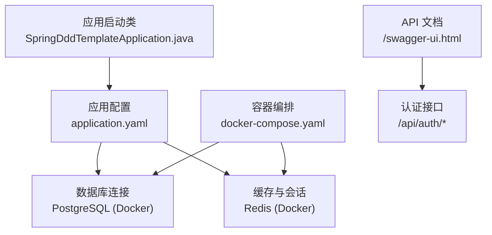
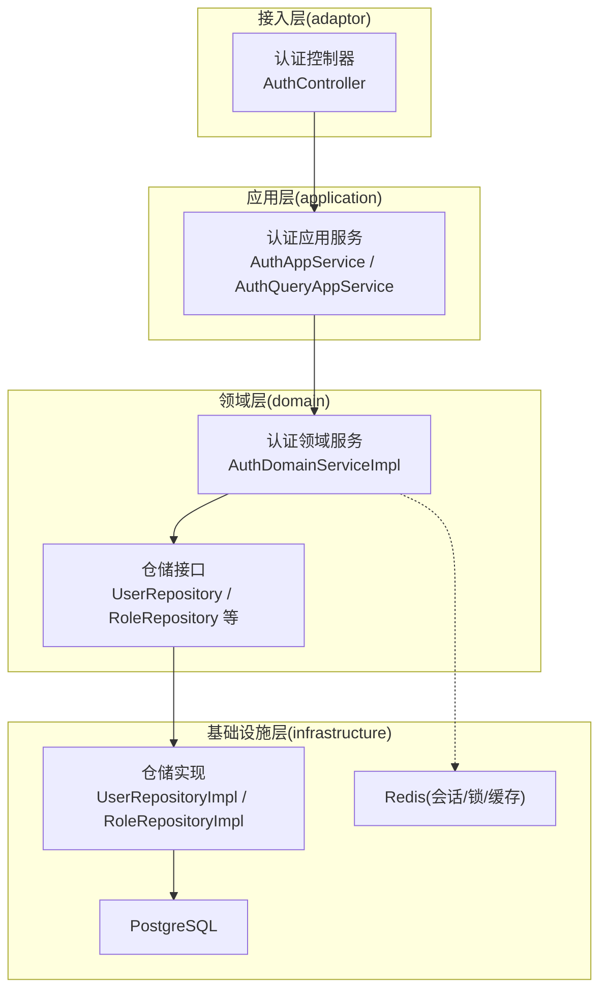
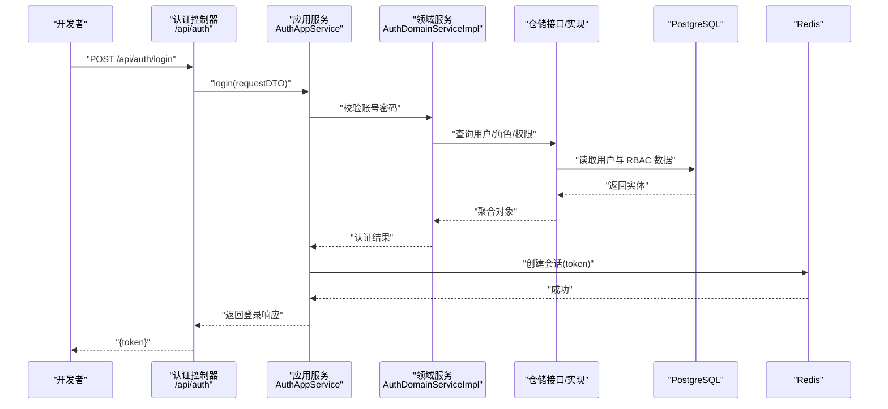
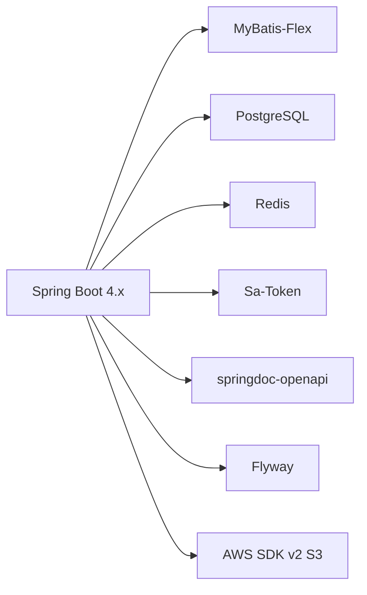

# 快速开始指南

<cite>
**本文引用的文件列表**
- [README.md](file://README.md)
- [pom.xml](file://pom.xml)
- [docker-compose.yaml](file://docker-compose.yaml)
- [rename-project.sh](file://rename-project.sh)
- [application.yaml](file://src/main/resources/application.yaml)
- [application-prod.yaml](file://src/main/resources/application-prod.yaml)
- [application-test.yaml](file://src/test/resources/application-test.yaml)
- [SpringDddTemplateApplication.java](file://src/main/java/com/sunnao/spring/ddd/template/SpringDddTemplateApplication.java)
- [AuthController.java](file://src/main/java/com/sunnao/spring/ddd/template/adaptor/auth/input/AuthController.java)
</cite>

## 目录
1. [简介](#简介)
2. [项目结构](#项目结构)
3. [核心组件](#核心组件)
4. [架构总览](#架构总览)
5. [详细组件分析](#详细组件分析)
6. [依赖分析](#依赖分析)
7. [性能考虑](#性能考虑)
8. [故障排查指南](#故障排查指南)
9. [结论](#结论)
10. [附录](#附录)

## 简介
本指南面向首次接触该 Spring Boot DDD 项目的开发者，提供从零到一的环境搭建、一键改包、本地启动、多环境配置、初始管理员登录与认证测试、以及常见问题排查方法。项目采用六边形（Hexagonal）架构，内置用户、认证、RBAC、字典、操作日志、文件上传等模块，开箱即用。

## 项目结构
仓库根目录包含构建脚本、容器编排、应用源码与资源、文档与规则说明等。关键入口与配置文件如下：
- 应用启动类：位于主包下，负责扫描 Mapper 并启动 Spring Boot 应用
- 资源与配置：默认配置、生产环境覆盖、测试环境配置
- 容器编排：PostgreSQL 与 Redis 的本地开发服务
- 一键改包脚本：用于将模板项目重命名为新项目

图表来源
- [SpringDddTemplateApplication.java:7-13](file://src/main/java/com/sunnao/spring/ddd/template/SpringDddTemplateApplication.java#L7-L13)
- [application.yaml:1-36](file://src/main/resources/application.yaml#L1-L36)
- [docker-compose.yaml:1-37](file://docker-compose.yaml#L1-L37)
- [AuthController.java:21-24](file://src/main/java/com/sunnao/spring/ddd/template/adaptor/auth/input/AuthController.java#L21-L24)

章节来源
- [README.md:170-182](file://README.md#L170-L182)
- [pom.xml:1-26](file://pom.xml#L1-L26)

## 核心组件
- 应用启动类：启用 Spring Boot 并扫描基础设施层 Mapper
- 配置中心：统一加载 .env 与环境变量，激活 dev 环境；定义 Flyway、Sa-Token、springdoc、MyBatis-Flex 等基础能力
- 容器化依赖：PostgreSQL 17 与 Redis 7 通过 docker compose 拉起
- 认证控制器：提供登录、注册、登出、当前用户信息接口，返回统一结果对象

章节来源
- [SpringDddTemplateApplication.java:7-13](file://src/main/java/com/sunnao/spring/ddd/template/SpringDddTemplateApplication.java#L7-L13)
- [application.yaml:1-36](file://src/main/resources/application.yaml#L1-L36)
- [docker-compose.yaml:1-37](file://docker-compose.yaml#L1-L37)
- [AuthController.java:21-69](file://src/main/java/com/sunnao/spring/ddd/template/adaptor/auth/input/AuthController.java#L21-L69)

## 架构总览
本项目遵循“自外向内”的调用顺序：adaptor(input) → application → domain → repository 接口（infrastructure 实现），同时 application 可定义外部服务接口由 adaptor(output) 实现。

图表来源
- [AuthController.java:21-69](file://src/main/java/com/sunnao/spring/ddd/template/adaptor/auth/input/AuthController.java#L21-L69)
- [application.yaml:44-57](file://src/main/resources/application.yaml#L44-L57)

## 详细组件分析

### 一键改包脚本使用
脚本支持交互模式与参数模式，自动替换 groupId、artifactId、Java 包名、启动类名、数据库名、容器名及 README 引用，并移动源码目录。

- 交互模式
  - 运行脚本后按提示输入新 groupId、artifactId，可选 new-package（不填则根据前两者推导）
- 参数模式
  - ./rename-project.sh <new-groupId> <new-artifactId> [new-package]
- 注意事项
  - Windows 建议在 Git Bash 中执行
  - 改包完成后建议重建数据库容器并验证构建

章节来源
- [rename-project.sh:1-150](file://rename-project.sh#L1-L150)
- [README.md:49-74](file://README.md#L49-L74)

### 本地开发环境启动
- 安装 JDK 25
  - 确保系统已安装 JDK 25，并使用对应版本进行编译与运行
- 准备 Docker 环境
  - 安装 Docker Desktop 或等效工具，确保 docker compose 可用
- 克隆并初始化项目
  - 克隆仓库至本地
  - 如需自定义项目名与包名，先执行一键改包脚本
- 启动依赖服务
  - 在项目根目录执行：docker compose up -d
  - 将拉起 PostgreSQL 17 与 Redis 7，端口分别为 5432 与 6379
- 构建与运行应用
  - Linux/macOS：./mvnw spring-boot:run
  - Windows：.\mvnw.cmd spring-boot:run
  - 默认激活 dev 环境，Flyway 会在启动时执行迁移脚本并写入种子数据
- 访问 API 文档
  - http://localhost:8080/swagger-ui.html

章节来源
- [README.md:64-74](file://README.md#L64-L74)
- [docker-compose.yaml:1-37](file://docker-compose.yaml#L1-L37)
- [application.yaml:32-36](file://src/main/resources/application.yaml#L32-L36)

### 多环境配置管理
- 环境文件与作用域
  - dev（默认）：application-dev.yaml（若存在）或 application.yaml 中的 dev 相关占位
  - prod：application-prod.yaml（关闭 swagger-ui 与 api-docs）
  - test：src/test/resources/application-test.yaml（集成测试专用）
- 环境变量注入
  - 数据库：DB_HOST、DB_PORT、DB_NAME、DB_USERNAME、DB_PASSWORD
  - Redis：REDIS_HOST、REDIS_PORT、REDIS_PASSWORD、REDIS_DATABASE、REDIS_SSL
  - 生产环境可通过 SPRING_PROFILES_ACTIVE=prod 激活
- 测试环境
  - 使用 TEST_PG_URL、TEST_REDIS_HOST 等变量，缺失时集成测试自动跳过

章节来源
- [application.yaml:1-36](file://src/main/resources/application.yaml#L1-L36)
- [application-prod.yaml:1-7](file://src/main/resources/application-prod.yaml#L1-L7)
- [application-test.yaml:1-18](file://src/test/resources/application-test.yaml#L1-L18)
- [README.md:76-83](file://README.md#L76-L83)

### 初始管理员账户与登录测试
- 初始管理员
  - 邮箱：admin@example.com
  - 密码：admin123456
  - 首次登录后请修改密码
- 登录流程
  - 调用 POST /api/auth/login，成功后在响应中获取 token
  - 后续请求携带请求头 satoken: {tokenValue}
- 文档地址
  - http://localhost:8080/swagger-ui.html

图表来源
- [AuthController.java:35-40](file://src/main/java/com/sunnao/spring/ddd/template/adaptor/auth/input/AuthController.java#L35-L40)
- [application.yaml:44-57](file://src/main/resources/application.yaml#L44-L57)

章节来源
- [README.md:72-75](file://README.md#L72-L75)
- [AuthController.java:21-69](file://src/main/java/com/sunnao/spring/ddd/template/adaptor/auth/input/AuthController.java#L21-L69)

## 依赖分析
- Java 与 Spring Boot
  - Java 25、Spring Boot 4.x
- ORM 与数据库
  - MyBatis-Flex + PostgreSQL 驱动
  - Flyway 数据库迁移（V1~V6）
- 缓存与会话
  - Redis（会话存储、分布式锁、字典缓存）
- 安全与鉴权
  - Sa-Token（token 存 Redis，注解鉴权）
- API 文档
  - springdoc-openapi（/swagger-ui.html）
- 其他
  - Lombok、Hutool、MapStruct、AWS SDK v2 S3（文件存储扩展）

图表来源
- [pom.xml:1-26](file://pom.xml#L1-L26)
- [pom.xml:28-151](file://pom.xml#L28-L151)

章节来源
- [pom.xml:1-26](file://pom.xml#L1-L26)
- [pom.xml:28-151](file://pom.xml#L28-L151)

## 性能考虑
- 连接池与并发
  - Redis Lettuce 连接池大小可按负载调整
- 文件上传限制
  - 框架层与业务层保持一致的大小上限，避免大请求进入后端
- 缓存策略
  - 字典读多写少场景优先走 Redis，写操作失效缓存
- 异步处理
  - 操作日志与领域事件监听器异步落库，降低主链路耗时

[本节为通用指导，无需具体文件引用]

## 故障排查指南
- 无法连接数据库
  - 检查 docker compose 是否正常运行，确认端口 5432 开放
  - 核对环境变量 DB_* 是否与容器一致
  - 查看 Flyway 迁移日志，确认 V1~V6 是否执行成功
- 无法连接 Redis
  - 检查端口 6379 是否被占用
  - 核对 REDIS_* 环境变量，必要时设置密码与数据库索引
- 登录失败或无权限
  - 确认请求头名称为 satoken，值为登录返回的 token
  - 检查 Sa-Token 配置与 Redis 中会话是否存在
- Swagger 不可用
  - 确认未激活 prod 环境（prod 会禁用 swagger-ui 与 api-docs）
  - 访问路径为 /swagger-ui.html
- 文件上传失败
  - 检查 app.file.max-size 与 multipart 配置是否一致
  - 本地存储需确保 base-path 目录可写；S3 需正确配置 endpoint、bucket、密钥等

章节来源
- [application.yaml:1-36](file://src/main/resources/application.yaml#L1-L36)
- [application.yaml:44-88](file://src/main/resources/application.yaml#L44-L88)
- [application-prod.yaml:1-7](file://src/main/resources/application-prod.yaml#L1-L7)
- [README.md:72-75](file://README.md#L72-L75)

## 结论
通过本指南，你可以快速完成环境搭建、项目初始化、本地启动与认证测试，并掌握多环境配置与常见问题的处理方法。建议在实际项目中结合团队规范完善环境变量管理与部署流程，持续优化性能与可观测性。

## 附录
- 常用命令
  - 启动依赖：docker compose up -d
  - 停止依赖：docker compose down
  - 运行应用：./mvnw spring-boot:run 或 .\mvnw.cmd spring-boot:run
  - 运行测试：./mvnw test
- 环境变量参考
  - 数据库：DB_HOST、DB_PORT、DB_NAME、DB_USERNAME、DB_PASSWORD
  - Redis：REDIS_HOST、REDIS_PORT、REDIS_PASSWORD、REDIS_DATABASE、REDIS_SSL
  - 文件存储（S3）：S3_ENDPOINT、S3_REGION、S3_ACCESS_KEY、S3_SECRET_KEY、S3_BUCKET、S3_PATH_STYLE_ACCESS
  - 环境切换：SPRING_PROFILES_ACTIVE=dev|prod|test

章节来源
- [README.md:64-83](file://README.md#L64-L83)
- [application.yaml:1-36](file://src/main/resources/application.yaml#L1-L36)
- [application.yaml:64-88](file://src/main/resources/application.yaml#L64-L88)