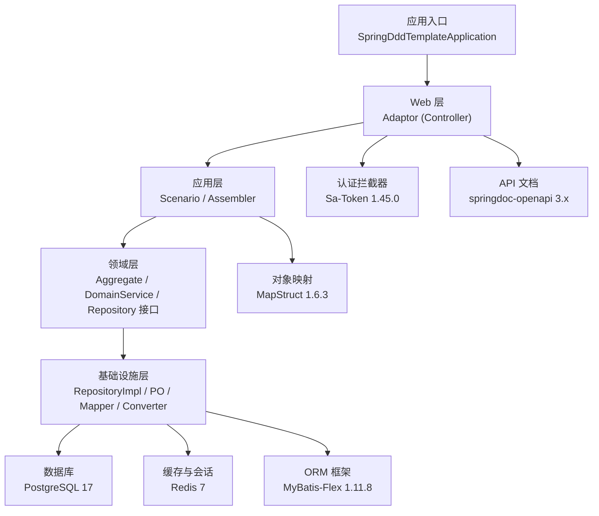
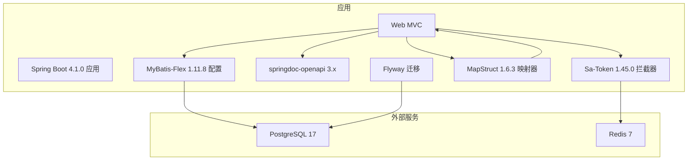
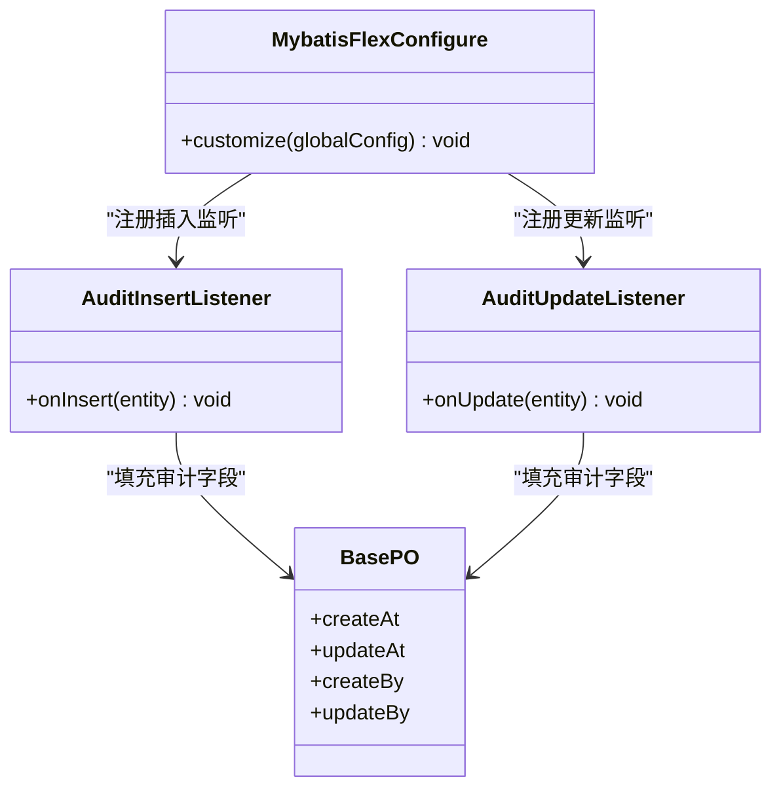
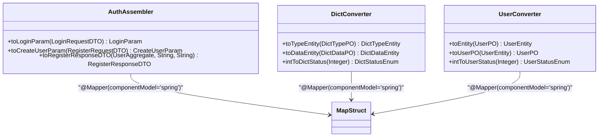
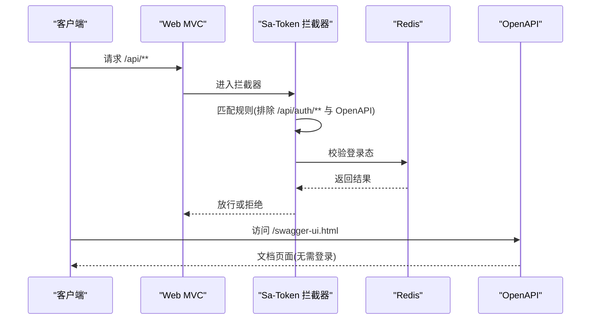
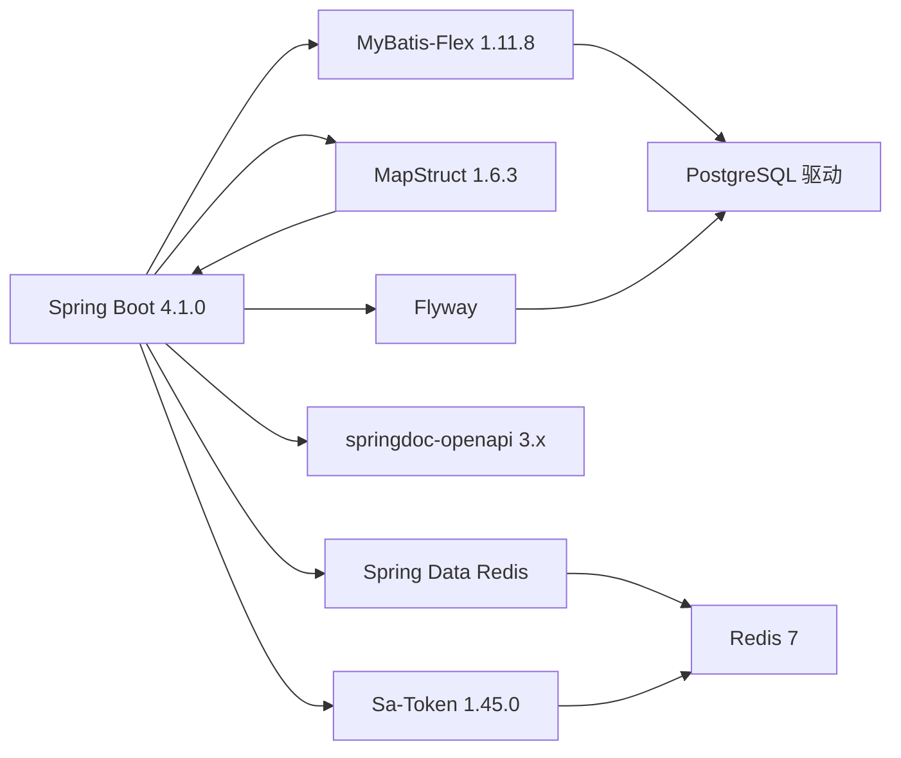

# 技术栈概览

<cite>
**本文引用的文件**
- [pom.xml](file://pom.xml)
- [README.md](file://README.md)
- [application.yaml](file://src/main/resources/application.yaml)
- [docker-compose.yaml](file://docker-compose.yaml)
- [SaTokenConfigure.java](file://src/main/java/com/sunnao/spring/ddd/template/common/config/SaTokenConfigure.java)
- [MybatisFlexConfigure.java](file://src/main/java/com/sunnao/spring/ddd/template/common/config/MybatisFlexConfigure.java)
- [OpenApiConfig.java](file://src/main/java/com/sunnao/spring/ddd/template/common/config/OpenApiConfig.java)
- [AuthAssembler.java](file://src/main/java/com/sunnao/spring/ddd/template/application/auth/assembler/AuthAssembler.java)
- [DictConverter.java](file://src/main/java/com/sunnao/spring/ddd/template/infrastructure/system/dict/converter/DictConverter.java)
- [UserConverter.java](file://src/main/java/com/sunnao/spring/ddd/template/infrastructure/system/user/converter/UserConverter.java)
</cite>

## 更新摘要
**所做更改**
- 更新了 Spring Boot 版本到 4.1.0，并说明了相关配置变化
- 更新了 MyBatis-Flex 版本到 1.11.8，增强了 ORM 功能
- 更新了 Sa-Token 版本到 1.45.0，改进了认证鉴权能力
- 新增了 MapStruct 1.6.3 集成章节，详细说明对象映射框架的使用
- 更新了依赖关系分析和架构图，反映新的技术栈组合

## 目录
1. [简介](#简介)
2. [项目结构](#项目结构)
3. [核心组件](#核心组件)
4. [架构总览](#架构总览)
5. [详细组件分析](#详细组件分析)
6. [依赖关系分析](#依赖关系分析)
7. [性能与容量规划](#性能与容量规划)
8. [故障排查指南](#故障排查指南)
9. [结论](#结论)
10. [附录：版本矩阵与升级策略](#附录版本矩阵与升级策略)

## 简介
本技术栈概览面向 Spring Boot DDD 模板项目，聚焦于核心技术选型、版本与兼容性、在系统中的职责与协作方式，以及可操作的升级建议。项目采用六边形（Hexagonal）架构，围绕认证鉴权、RBAC、字典、日志、文件等系统能力构建，便于快速扩展业务域。

**最新更新**：项目已升级到 Spring Boot 4.1.0、MyBatis-Flex 1.11.8、Sa-Token 1.45.0，并集成了 MapStruct 1.6.3 用于高效的对象映射操作，进一步提升了开发效率和运行时性能。

## 项目结构
- 分层组织：adaptor → application → domain → infrastructure（实现），并辅以 client 对外接口定义与 model 共享模型。
- 横切能力：全局异常处理、链路追踪、领域事件、分布式锁、操作日志等。
- 启动与运行：通过 Flyway 自动执行 db/migration 脚本完成建库建表；本地开发使用 docker-compose 提供 PostgreSQL 17 与 Redis 7。

图表来源
- [SaTokenConfigure.java:1-31](file://src/main/java/com/sunnao/spring/ddd/template/common/config/SaTokenConfigure.java#L1-L31)
- [OpenApiConfig.java:1-42](file://src/main/java/com/sunnao/spring/ddd/template/common/config/OpenApiConfig.java#L1-L42)
- [MybatisFlexConfigure.java:1-73](file://src/main/java/com/sunnao/spring/ddd/template/common/config/MybatisFlexConfigure.java#L1-L73)
- [application.yaml:1-88](file://src/main/resources/application.yaml#L1-L88)
- [docker-compose.yaml:1-37](file://docker-compose.yaml#L1-L37)

章节来源
- [README.md:1-182](file://README.md#L1-L182)

## 核心组件
- Java 25：作为运行时语言，提供最新语言特性与性能优化，支撑高并发与现代化 API 风格。
- Spring Boot 4.1.0：作为应用框架基座，提供 Web、AOP、配置管理、测试等基础能力；注意 JDBC 自动装配拆分，需显式引入 starter。
- MyBatis-Flex 1.11.8：ORM 框架，配合注解处理器生成代码，支持审计字段自动填充、逻辑删除等。
- MapStruct 1.6.3：编译时对象映射框架，提供类型安全的 DTO/Entity/PO 转换，替代运行时反射映射。
- PostgreSQL 17：主数据持久化存储，结合 Flyway 进行版本化迁移。
- Redis 7：会话存储（Sa-Token）、分布式锁、字典缓存等。
- Sa-Token 1.45.0：轻量级认证鉴权框架，支持注解鉴权与多端登录，token 存储于 Redis。
- Flyway：数据库迁移工具，按 Vn__xxx.sql 顺序执行，支持基线兼容。
- springdoc-openapi 3.x：API 文档生成与 UI，集成安全方案以支持带 token 的调试。

章节来源
- [pom.xml:1-217](file://pom.xml#L1-L217)
- [README.md:1-182](file://README.md#L1-L182)

## 架构总览
下图展示关键组件之间的交互与依赖关系，包括认证、文档、ORM、迁移与外部依赖。

图表来源
- [SaTokenConfigure.java:1-31](file://src/main/java/com/sunnao/spring/ddd/template/common/config/SaTokenConfigure.java#L1-L31)
- [OpenApiConfig.java:1-42](file://src/main/java/com/sunnao/spring/ddd/template/common/config/OpenApiConfig.java#L1-L42)
- [MybatisFlexConfigure.java:1-73](file://src/main/java/com/sunnao/spring/ddd/template/common/config/MybatisFlexConfigure.java#L1-L73)
- [application.yaml:1-88](file://src/main/resources/application.yaml#L1-L88)
- [docker-compose.yaml:1-37](file://docker-compose.yaml#L1-L37)

## 详细组件分析

### Java 25
- 作用：提供运行时环境与语言特性，驱动 Spring Boot 4.x 生态。
- 选择理由：长期演进的语言能力与性能提升，适配现代企业级应用需求。
- 兼容性：与 Spring Boot 4.x 及主流第三方库保持兼容；需注意部分旧库对较新 JDK 的支持情况。

章节来源
- [pom.xml:19-26](file://pom.xml#L19-L26)

### Spring Boot 4.1.0
- 作用：应用容器与自动化装配，提供 Web、AOP、测试、配置等能力。
- 选择理由：统一依赖管理与生态整合，简化工程搭建与运维。
- **更新**：JDBC 自动装配拆分，需显式引入 spring-boot-starter-jdbc；Flyway 自动装配也拆分为独立模块。
- **注意事项**：需要显式引入多个 starter，包括 jdbc、webmvc、flyway 等。

章节来源
- [pom.xml:35-40](file://pom.xml#L35-L40)
- [pom.xml:141-150](file://pom.xml#L141-L150)

### MyBatis-Flex 1.11.8
- 作用：ORM 层，负责实体映射、SQL 构建与执行，配合注解处理器生成代码。
- 选择理由：灵活且高性能的 SQL 控制能力，审计字段自动填充、逻辑删除等增强能力。
- 集成要点：注册 Insert/Update 监听器实现审计字段填充；启用逻辑删除策略。

图表来源
- [MybatisFlexConfigure.java:1-73](file://src/main/java/com/sunnao/spring/ddd/template/common/config/MybatisFlexConfigure.java#L1-L73)

章节来源
- [pom.xml:28-46](file://pom.xml#L28-L46)
- [application.yaml:38-43](file://src/main/resources/application.yaml#L38-L43)
- [MybatisFlexConfigure.java:1-73](file://src/main/java/com/sunnao/spring/ddd/template/common/config/MybatisFlexConfigure.java#L1-L73)

### MapStruct 1.6.3
- 作用：编译时对象映射框架，自动生成类型安全的 DTO/Entity/PO 转换代码。
- 选择理由：相比运行时反射映射（如 BeanUtils），具有更好的性能和类型安全性；支持复杂的映射规则配置。
- 集成要点：配置注解处理器路径，在 Application 层使用 Assembler，Infrastructure 层使用 Converter。

图表来源
- [AuthAssembler.java:22-99](file://src/main/java/com/sunnao/spring/ddd/template/application/auth/assembler/AuthAssembler.java#L22-99)
- [DictConverter.java:21-140](file://src/main/java/com/sunnao/spring/ddd/template/infrastructure/system/dict/converter/DictConverter.java#L21-140)
- [UserConverter.java:18-85](file://src/main/java/com/sunnao/spring/ddd/template/infrastructure/system/user/converter/UserConverter.java#L18-85)

**章节来源**
- [pom.xml:88-92](file://pom.xml#L88-92)
- [pom.xml:183-187](file://pom.xml#L183-187)
- [AuthAssembler.java:1-99](file://src/main/java/com/sunnao/spring/ddd/template/application/auth/assembler/AuthAssembler.java#L1-99)
- [DictConverter.java:1-140](file://src/main/java/com/sunnao/spring/ddd/template/infrastructure/system/dict/converter/DictConverter.java#L1-140)
- [UserConverter.java:1-85](file://src/main/java/com/sunnao/spring/ddd/template/infrastructure/system/user/converter/UserConverter.java#L1-85)

### PostgreSQL 17
- 作用：主数据存储，承载用户、角色、权限、字典、日志、文件元数据等。
- 选择理由：成熟稳定、功能丰富，适合复杂查询与事务场景。
- 迁移策略：通过 Flyway 管理版本化脚本，支持基线兼容。

章节来源
- [docker-compose.yaml:1-37](file://docker-compose.yaml#L1-37)
- [application.yaml:9-13](file://src/main/resources/application.yaml#L9-13)

### Redis 7
- 作用：会话存储（Sa-Token）、分布式锁、字典缓存等。
- 选择理由：高性能键值存储，广泛生态支持。
- 连接池：使用 Lettuce 连接池，合理设置最大活跃/空闲连接数。

章节来源
- [application.yaml:14-26](file://src/main/resources/application.yaml#L14-26)
- [docker-compose.yaml:21-32](file://docker-compose.yaml#L21-32)

### Sa-Token 1.45.0
- 作用：认证鉴权，支持注解鉴权、多端登录、token 存 Redis。
- 选择理由：轻量易用，注解式鉴权与路由拦截组合，降低接入成本。
- 集成要点：自定义拦截器放行 OpenAPI 路径；请求头名称与文档安全方案保持一致。

图表来源
- [SaTokenConfigure.java:1-31](file://src/main/java/com/sunnao/spring/ddd/template/common/config/SaTokenConfigure.java#L1-31)
- [OpenApiConfig.java:1-42](file://src/main/java/com/sunnao/spring/ddd/template/common/config/OpenApiConfig.java#L1-42)

章节来源
- [pom.xml:100-118](file://pom.xml#L100-118)
- [application.yaml:44-57](file://src/main/resources/application.yaml#L44-57)
- [SaTokenConfigure.java:1-31](file://src/main/java/com/sunnao/spring/ddd/template/common/config/SaTokenConfigure.java#L1-31)
- [OpenApiConfig.java:1-42](file://src/main/java/com/sunnao/spring/ddd/template/common/config/OpenApiConfig.java#L1-42)

### Flyway
- 作用：数据库版本化管理，按命名规范顺序执行迁移脚本。
- 选择理由：简单可靠，易于团队协作与回滚策略设计。
- 集成要点：启用 flyway-core 与数据库方言依赖；开启 baseline-on-migrate 兼容已有库。

章节来源
- [pom.xml:141-150](file://pom.xml#L141-150)
- [application.yaml:32-36](file://src/main/resources/application.yaml#L32-36)

### springdoc-openapi 3.x
- 作用：自动生成 OpenAPI 文档与 UI，支持安全方案配置。
- 选择理由：与 Spring Boot 4.x 生态良好集成，便于前后端联调。
- 集成要点：配置安全方案为请求头携带 token，与 Sa-Token 一致。

章节来源
- [pom.xml:120-125](file://pom.xml#L120-125)
- [application.yaml:58-62](file://src/main/resources/application.yaml#L58-62)
- [OpenApiConfig.java:1-42](file://src/main/java/com/sunnao/spring/ddd/template/common/config/OpenApiConfig.java#L1-42)

## 依赖关系分析
- 直接依赖：
  - Spring Boot 4.1.0 父 POM 管理核心版本。
  - MyBatis-Flex Starter 与 Processor 用于 ORM 与代码生成。
  - MapStruct 与 Processor 用于编译时对象映射。
  - Spring Data Redis 与 Lettuce 连接池用于 Redis 集成。
  - PostgreSQL 驱动用于数据库连接。
  - Sa-Token Starter 与 Redis 集成用于认证与会话。
  - springdoc-openapi 3.x 用于文档生成。
  - Flyway Starter 与 PostgreSQL 方言用于迁移。
- 间接依赖：
  - Lombok、Hutool 等工具库提升开发效率。
  - AWS SDK v2 S3 用于对象存储抽象（可选）。

图表来源
- [pom.xml:1-217](file://pom.xml#L1-217)

章节来源
- [pom.xml:1-217](file://pom.xml#L1-217)

## 性能与容量规划
- Redis 连接池：根据并发量调整 max-active/max-idle/min-idle，避免连接耗尽。
- 会话过期：Sa-Token timeout 设置为较长有效期，结合前端刷新策略平衡安全与体验。
- 文件上传：multipart 大小限制与存储实现上限保持一致，防止越界请求。
- 数据库：索引设计与分页查询优化，结合 Flyway 变更逐步演进。
- **新增**：MapStruct 编译时映射避免了运行时反射开销，显著提升对象转换性能。

[本节为通用指导，不直接分析具体文件]

## 故障排查指南
- 认证失败：检查 Sa-Token 请求头名称与 OpenAPI 安全方案是否一致；确认 Redis 连通性与 token 是否存在。
- 文档不可用：确认 OpenAPI 路径未被拦截器排除；浏览器缓存可能导致 UI 加载异常，尝试硬刷新。
- 迁移失败：核对 Flyway 基线配置与脚本命名规范；查看数据库方言依赖是否正确引入。
- ORM 审计字段未填充：确认 BasePO 继承与监听器注册生效；检查 CurrentUserContext 是否已注入当前用户。
- **新增**：MapStruct 编译错误：确保注解处理器路径配置正确；检查 @Mapper 注解的 componentModel 属性；验证字段映射规则。

章节来源
- [SaTokenConfigure.java:1-31](file://src/main/java/com/sunnao/spring/ddd/template/common/config/SaTokenConfigure.java#L1-31)
- [OpenApiConfig.java:1-42](file://src/main/java/com/sunnao/spring/ddd/template/common/config/OpenApiConfig.java#L1-42)
- [application.yaml:32-36](file://src/main/resources/application.yaml#L32-36)
- [MybatisFlexConfigure.java:1-73](file://src/main/java/com/sunnao/spring/ddd/template/common/config/MybatisFlexConfigure.java#L1-73)

## 结论
本项目以 Spring Boot 4.1.0 为核心，搭配 MyBatis-Flex 1.11.8、MapStruct 1.6.3、PostgreSQL、Redis、Sa-Token 1.45.0、Flyway 与 springdoc-openapi 3.x，形成一套完整的企业级后端技术栈。各组件职责清晰、耦合度低，便于扩展与维护。通过合理的版本管理与升级策略，可在保证稳定性的前提下持续演进。

**更新亮点**：MapStruct 的集成显著提升了对象映射的性能和类型安全性，Spring Boot 4.1.0 提供了最新的框架特性和性能优化。

[本节为总结性内容，不直接分析具体文件]

## 附录：版本矩阵与升级策略

### 版本矩阵
- Java：25
- Spring Boot：4.1.0
- MyBatis-Flex：1.11.8
- MapStruct：1.6.3
- PostgreSQL：17
- Redis：7
- Sa-Token：1.45.0
- springdoc-openapi：3.0.3
- Flyway：由 Spring Boot 父 POM 管理（starter 与数据库方言）

章节来源
- [pom.xml:19-26](file://pom.xml#L19-26)
- [pom.xml:6-10](file://pom.xml#L6-10)
- [docker-compose.yaml:1-37](file://docker-compose.yaml#L1-37)

### 升级策略建议
- 小步快跑：优先升级 Spring Boot 子项与工具库，验证兼容性后再升级核心框架。
- 依赖收敛：关注第三方库对 JDK 25 的支持状态，必要时引入桥接或替代方案。
- 迁移先行：数据库迁移脚本与 Flyway 基线策略保持稳定，确保升级过程可回滚。
- 灰度发布：在生产环境采用蓝绿或金丝雀发布，结合监控与告警快速定位问题。
- 文档同步：随版本升级更新 README 与配置说明，确保团队一致性。
- **新增**：MapStruct 迁移：从运行时映射框架迁移到 MapStruct 时，需要逐步替换 BeanUtils 调用，确保编译时验证所有映射规则。

[本节为通用指导，不直接分析具体文件]