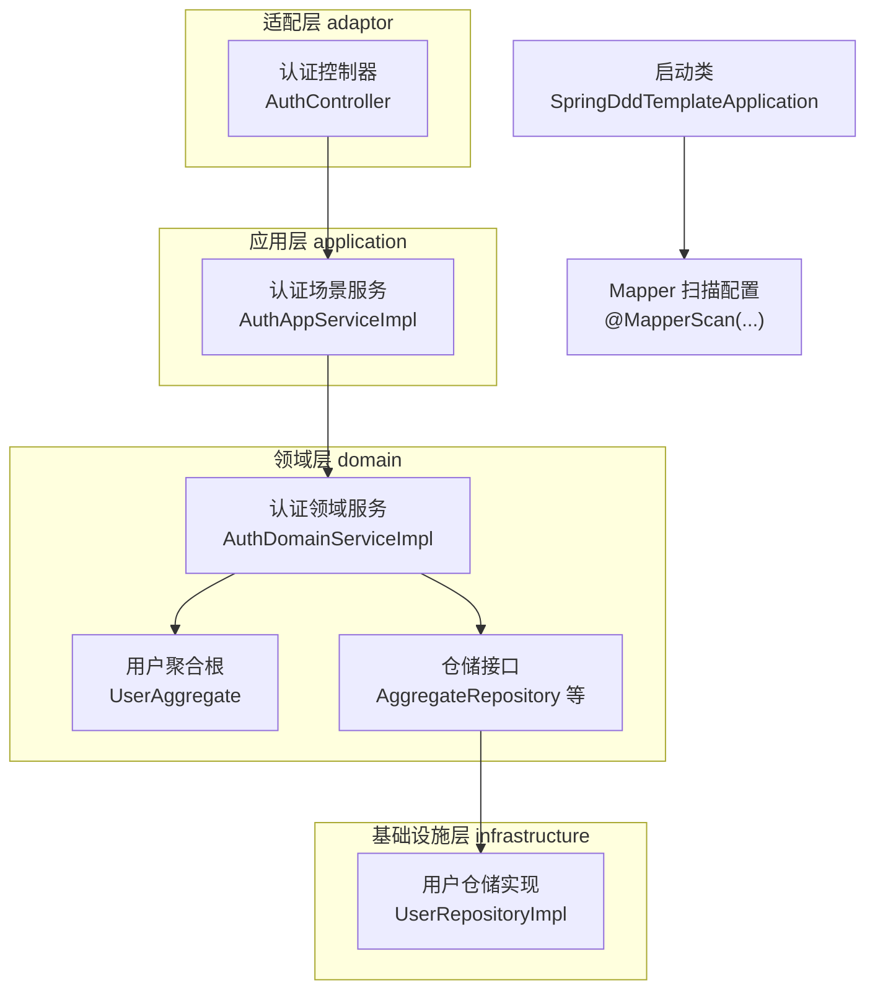
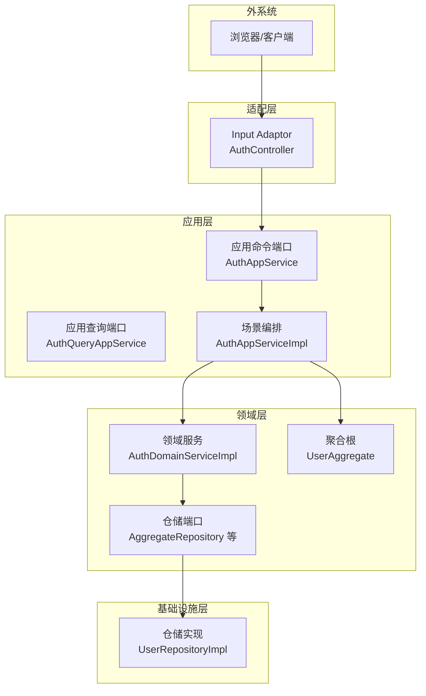
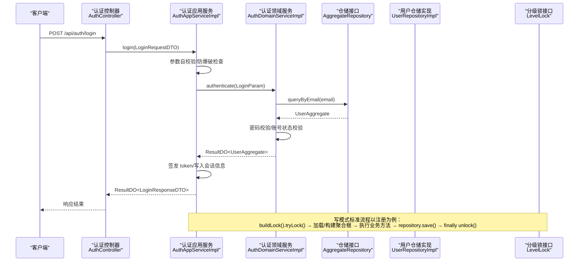
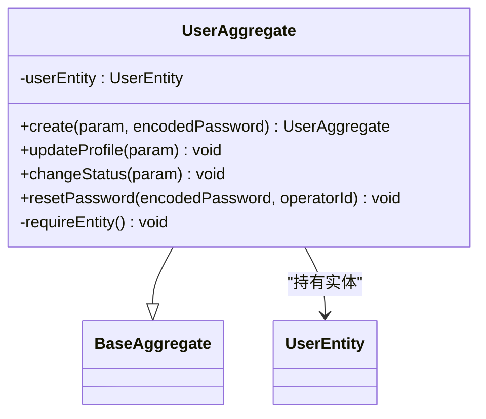
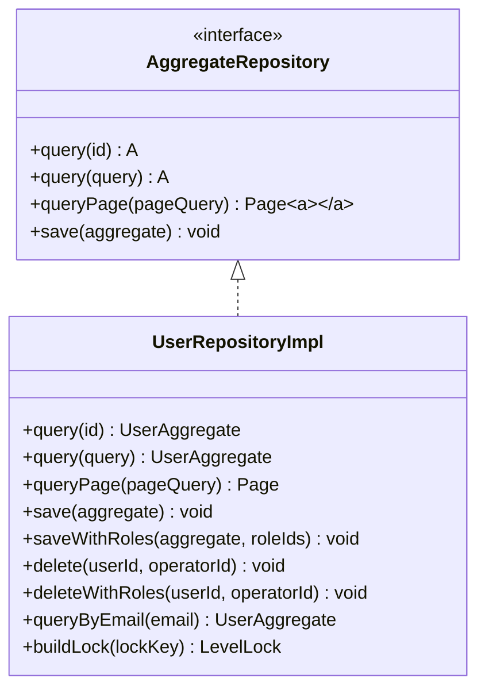
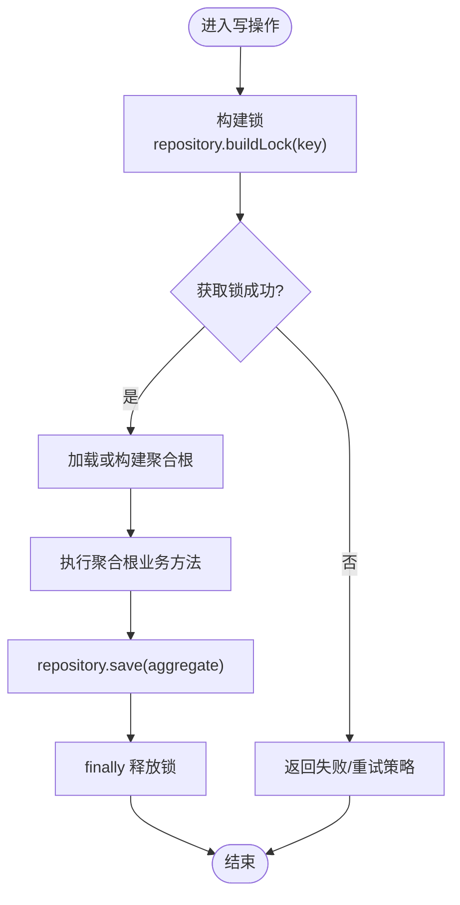
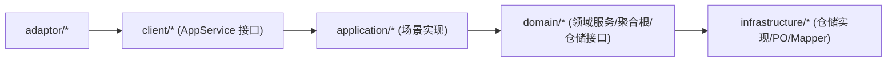

# 架构设计说明

<cite>
**本文引用的文件**   
- [README.md](file://README.md)
- [SpringDddTemplateApplication.java](file://src/main/java/com/sunnao/spring/ddd/template/SpringDddTemplateApplication.java)
- [AuthController.java](file://src/main/java/com/sunnao/spring/ddd/template/adaptor/auth/input/AuthController.java)
- [AuthAppServiceImpl.java](file://src/main/java/com/sunnao/spring/ddd/template/application/auth/scenario/AuthAppServiceImpl.java)
- [AuthDomainServiceImpl.java](file://src/main/java/com/sunnao/spring/ddd/template/domain/auth/service/AuthDomainServiceImpl.java)
- [UserRepositoryImpl.java](file://src/main/java/com/sunnao/spring/ddd/template/infrastructure/system/user/repository/UserRepositoryImpl.java)
- [UserAggregate.java](file://src/main/java/com/sunnao/spring/ddd/template/domain/system/user/model/aggregate/UserAggregate.java)
- [AggregateRepository.java](file://src/main/java/com/sunnao/spring/ddd/template/common/model/AggregateRepository.java)
- [LevelLock.java](file://src/main/java/com/sunnao/spring/ddd/template/common/lock/LevelLock.java)
- [ApplicationCmdService.java](file://src/main/java/com/sunnao/spring/ddd/template/common/service/ApplicationCmdService.java)
- [ApplicationQueryService.java](file://src/main/java/com/sunnao/spring/ddd/template/common/service/ApplicationQueryService.java)
- [AuthAppService.java](file://src/main/java/com/sunnao/spring/ddd/template/client/auth/AuthAppService.java)
- [ddd-adaptor-layer.md](file://docs/rule/ddd/ddd-adaptor-layer.md)
- [ddd-model-layer.md](file://docs/rule/ddd/ddd-model-layer.md)
</cite>

## 目录
1. [引言](#引言)
2. [项目结构](#项目结构)
3. [核心组件](#核心组件)
4. [架构总览](#架构总览)
5. [详细组件分析](#详细组件分析)
6. [依赖关系分析](#依赖关系分析)
7. [性能与并发特性](#性能与并发特性)
8. [故障排查指南](#故障排查指南)
9. [结论](#结论)
10. [附录：写模式标准流程与示例路径](#附录写模式标准流程与示例路径)

## 引言
本项目基于六边形架构（Hexagonal Architecture）与领域驱动设计（DDD），采用“端口与适配器”思想，将业务内核（领域层）与技术实现（基础设施层、适配层）解耦。通过依赖倒置原则，应用层定义对外能力接口，由基础设施层提供具体实现；适配器层负责内外协议转换与防腐。整体遵循自外向内的调用顺序：adaptor → application → domain → repository（接口在领域层，实现在基础设施层）。

## 项目结构
项目按“六层”组织：adaptor（输入输出适配器）、application（场景编排）、domain（聚合根与业务逻辑）、infrastructure（技术实现）、client（对外接口定义）、model（内部共享模型）。启动类扫描 MyBatis-Flex Mapper，确保基础设施层的持久化能力可用。

图表来源
- [SpringDddTemplateApplication.java:7-8](file://src/main/java/com/sunnao/spring/ddd/template/SpringDddTemplateApplication.java#L7-L8)
- [AuthController.java:22-24](file://src/main/java/com/sunnao/spring/ddd/template/adaptor/auth/input/AuthController.java#L22-L24)
- [AuthAppServiceImpl.java:39-41](file://src/main/java/com/sunnao/spring/ddd/template/application/auth/scenario/AuthAppServiceImpl.java#L39-L41)
- [AuthDomainServiceImpl.java:22-24](file://src/main/java/com/sunnao/spring/ddd/template/domain/auth/service/AuthDomainServiceImpl.java#L22-L24)
- [UserAggregate.java:21-23](file://src/main/java/com/sunnao/spring/ddd/template/domain/system/user/model/aggregate/UserAggregate.java#L21-L23)
- [AggregateRepository.java:6-6](file://src/main/java/com/sunnao/spring/ddd/template/common/model/AggregateRepository.java#L6-L6)
- [UserRepositoryImpl.java:34-36](file://src/main/java/com/sunnao/spring/ddd/template/infrastructure/system/user/repository/UserRepositoryImpl.java#L34-L36)

章节来源
- [README.md:19-36](file://README.md#L19-L36)
- [SpringDddTemplateApplication.java:7-8](file://src/main/java/com/sunnao/spring/ddd/template/SpringDddTemplateApplication.java#L7-L8)

## 核心组件
- 应用命令服务基接口：用于标记写模式的应用服务，便于统一规范与扩展。
- 应用查询服务基接口：用于标记读模式的应用服务。
- 聚合仓储通用接口：定义聚合根的增删改查与分页查询契约，供领域层依赖。
- 分级锁接口：抽象分布式/单机锁语义，供领域服务在写模式中保证并发安全。
- 用户聚合根：封装用户实体的创建、更新、状态变更等核心业务方法，作为写操作的边界。

章节来源
- [ApplicationCmdService.java:3-4](file://src/main/java/com/sunnao/spring/ddd/template/common/service/ApplicationCmdService.java#L3-L4)
- [ApplicationQueryService.java:3-4](file://src/main/java/com/sunnao/spring/ddd/template/common/service/ApplicationQueryService.java#L3-L4)
- [AggregateRepository.java:6-42](file://src/main/java/com/sunnao/spring/ddd/template/common/model/AggregateRepository.java#L6-L42)
- [LevelLock.java:12-32](file://src/main/java/com/sunnao/spring/ddd/template/common/lock/LevelLock.java#L12-L32)
- [UserAggregate.java:21-112](file://src/main/java/com/sunnao/spring/ddd/template/domain/system/user/model/aggregate/UserAggregate.java#L21-L112)

## 架构总览
六边形架构在本项目的落地体现为：
- 端口（Ports）：应用层定义的 AppService 接口（如 AuthAppService），以及领域层定义的 Repository 接口（如 AggregateRepository）。
- 适配器（Adapters）：输入适配器（Controller）接收外部请求并调用应用层；输出适配器（可选）封装第三方服务；基础设施层实现 Repository 接口完成数据持久化。
- 依赖方向：外层依赖内层，内层不感知外层技术细节。

图表来源
- [AuthController.java:22-24](file://src/main/java/com/sunnao/spring/ddd/template/adaptor/auth/input/AuthController.java#L22-L24)
- [AuthAppService.java:14-38](file://src/main/java/com/sunnao/spring/ddd/template/client/auth/AuthAppService.java#L14-L38)
- [AuthAppServiceImpl.java:39-41](file://src/main/java/com/sunnao/spring/ddd/template/application/auth/scenario/AuthAppServiceImpl.java#L39-L41)
- [AuthDomainServiceImpl.java:22-24](file://src/main/java/com/sunnao/spring/ddd/template/domain/auth/service/AuthDomainServiceImpl.java#L22-L24)
- [AggregateRepository.java:6-42](file://src/main/java/com/sunnao/spring/ddd/template/common/model/AggregateRepository.java#L6-L42)
- [UserRepositoryImpl.java:34-36](file://src/main/java/com/sunnao/spring/ddd/template/infrastructure/system/user/repository/UserRepositoryImpl.java#L34-L36)
- [UserAggregate.java:21-28](file://src/main/java/com/sunnao/spring/ddd/template/domain/system/user/model/aggregate/UserAggregate.java#L21-L28)

## 详细组件分析

### 认证登录写流程（序列图）
该流程展示从 HTTP 请求到领域认证与持久化的完整链路，体现“锁 → 聚合根 → 持久化”的写模式标准流程（以用户注册为例，登录流程类似但侧重会话签发）。

图表来源
- [AuthController.java:35-40](file://src/main/java/com/sunnao/spring/ddd/template/adaptor/auth/input/AuthController.java#L35-L40)
- [AuthAppServiceImpl.java:66-113](file://src/main/java/com/sunnao/spring/ddd/template/application/auth/scenario/AuthAppServiceImpl.java#L66-L113)
- [AuthDomainServiceImpl.java:29-56](file://src/main/java/com/sunnao/spring/ddd/template/domain/auth/service/AuthDomainServiceImpl.java#L29-L56)
- [UserRepositoryImpl.java:128-137](file://src/main/java/com/sunnao/spring/ddd/template/infrastructure/system/user/repository/UserRepositoryImpl.java#L128-L137)
- [LevelLock.java:12-32](file://src/main/java/com/sunnao/spring/ddd/template/common/lock/LevelLock.java#L12-L32)

章节来源
- [AuthController.java:17-69](file://src/main/java/com/sunnao/spring/ddd/template/adaptor/auth/input/AuthController.java#L17-L69)
- [AuthAppServiceImpl.java:39-195](file://src/main/java/com/sunnao/spring/ddd/template/application/auth/scenario/AuthAppServiceImpl.java#L39-L195)
- [AuthDomainServiceImpl.java:15-57](file://src/main/java/com/sunnao/spring/ddd/template/domain/auth/service/AuthDomainServiceImpl.java#L15-L57)
- [UserRepositoryImpl.java:29-190](file://src/main/java/com/sunnao/spring/ddd/template/infrastructure/system/user/repository/UserRepositoryImpl.java#L29-L190)

### 用户聚合根（类图）
用户聚合根封装了用户实体的创建、资料更新、状态变更与密码重置等核心行为，并通过工厂方法与业务方法维护一致性。

图表来源
- [UserAggregate.java:21-112](file://src/main/java/com/sunnao/spring/ddd/template/domain/system/user/model/aggregate/UserAggregate.java#L21-L112)

章节来源
- [UserAggregate.java:1-113](file://src/main/java/com/sunnao/spring/ddd/template/domain/system/user/model/aggregate/UserAggregate.java#L1-L113)

### 仓储接口与实现（类图）
仓储接口定义聚合根的读写契约，实现类负责 PO 与聚合根之间的纯技术转换与数据库访问。

图表来源
- [AggregateRepository.java:6-42](file://src/main/java/com/sunnao/spring/ddd/template/common/model/AggregateRepository.java#L6-L42)
- [UserRepositoryImpl.java:34-190](file://src/main/java/com/sunnao/spring/ddd/template/infrastructure/system/user/repository/UserRepositoryImpl.java#L34-L190)

章节来源
- [AggregateRepository.java:1-43](file://src/main/java/com/sunnao/spring/ddd/template/common/model/AggregateRepository.java#L1-L43)
- [UserRepositoryImpl.java:1-191](file://src/main/java/com/sunnao/spring/ddd/template/infrastructure/system/user/repository/UserRepositoryImpl.java#L1-L191)

### 写模式标准流程（流程图）
写模式强调“先锁、再聚合根、后持久化”，确保并发安全与事务一致性。

图表来源
- [LevelLock.java:12-32](file://src/main/java/com/sunnao/spring/ddd/template/common/lock/LevelLock.java#L12-L32)
- [AggregateRepository.java:35-41](file://src/main/java/com/sunnao/spring/ddd/template/common/model/AggregateRepository.java#L35-L41)
- [UserRepositoryImpl.java:165-168](file://src/main/java/com/sunnao/spring/ddd/template/infrastructure/system/user/repository/UserRepositoryImpl.java#L165-L168)

章节来源
- [LevelLock.java:1-33](file://src/main/java/com/sunnao/spring/ddd/template/common/lock/LevelLock.java#L1-L33)
- [AggregateRepository.java:1-43](file://src/main/java/com/sunnao/spring/ddd/template/common/model/AggregateRepository.java#L1-L43)
- [UserRepositoryImpl.java:165-168](file://src/main/java/com/sunnao/spring/ddd/template/infrastructure/system/user/repository/UserRepositoryImpl.java#L165-L168)

### 概念性概览（非代码映射）
- 端口与适配器：应用层暴露 AppService 接口（端口），由 application 层实现；领域层暴露 Repository 接口（端口），由 infrastructure 层实现。
- 依赖倒置：上层仅依赖接口，不依赖具体实现，降低耦合度，提升可测试性与可替换性。
- 内外分离：领域层保持纯净，不包含任何框架或中间件细节；技术实现下沉至基础设施层。

[本节为概念性内容，无需源码引用]

## 依赖关系分析
- 包级依赖方向：adaptor → client（接口）→ application（实现）→ domain（接口）→ infrastructure（实现）。
- 关键依赖点：
  - 控制器依赖应用服务接口（client 层定义）。
  - 应用服务依赖领域服务与仓储接口。
  - 领域服务依赖仓储接口与聚合根。
  - 基础设施层实现仓储接口，并依赖 MyBatis-Flex 进行数据访问。

图表来源
- [AuthController.java:22-24](file://src/main/java/com/sunnao/spring/ddd/template/adaptor/auth/input/AuthController.java#L22-L24)
- [AuthAppService.java:14-38](file://src/main/java/com/sunnao/spring/ddd/template/client/auth/AuthAppService.java#L14-L38)
- [AuthAppServiceImpl.java:39-41](file://src/main/java/com/sunnao/spring/ddd/template/application/auth/scenario/AuthAppServiceImpl.java#L39-L41)
- [AuthDomainServiceImpl.java:22-24](file://src/main/java/com/sunnao/spring/ddd/template/domain/auth/service/AuthDomainServiceImpl.java#L22-L24)
- [UserRepositoryImpl.java:34-36](file://src/main/java/com/sunnao/spring/ddd/template/infrastructure/system/user/repository/UserRepositoryImpl.java#L34-L36)

章节来源
- [README.md:19-36](file://README.md#L19-L36)
- [ddd-adaptor-layer.md:1-479](file://docs/rule/ddd/ddd-adaptor-layer.md#L1-L479)

## 性能与并发特性
- 分布式锁：通过 LevelLock 抽象，默认 RedisLevelLock 支持 SET NX PX + Lua 释放，避免重复写与竞态条件；可通过配置切换为 JvmLevelLock。
- 防爆破：登录尝试限制器在应用层对凭证失败计数，达到阈值后窗口内拒绝登录，降低暴力破解风险。
- 异步事件：登录日志等审计信息通过领域事件发布，监听器异步落库，减少主流程耗时。
- 缓存：字典模块按 typeKey 使用 Redis 缓存，写操作自动失效，兼顾读性能与一致性。

章节来源
- [LevelLock.java:1-33](file://src/main/java/com/sunnao/spring/ddd/template/common/lock/LevelLock.java#L1-L33)
- [AuthAppServiceImpl.java:66-113](file://src/main/java/com/sunnao/spring/ddd/template/application/auth/scenario/AuthAppServiceImpl.java#L66-L113)
- [README.md:119-128](file://README.md#L119-L128)

## 故障排查指南
- 全局异常处理：适配层统一捕获并转换为 ResultDO，避免异常穿透到上层。
- 领域异常：领域服务捕获 BizException 并转为错误码，保证上层无异常压力。
- 仓储异常：仓储实现捕获底层异常并包装为 RepositoryException，便于定位 DB 问题。
- 审计与追踪：TraceIdFilter 生成链路 ID，操作日志切面记录关键信息，便于问题回溯。

章节来源
- [AuthDomainServiceImpl.java:49-56](file://src/main/java/com/sunnao/spring/ddd/template/domain/auth/service/AuthDomainServiceImpl.java#L49-L56)
- [UserRepositoryImpl.java:50-58](file://src/main/java/com/sunnao/spring/ddd/template/infrastructure/system/user/repository/UserRepositoryImpl.java#L50-L58)
- [README.md:119-128](file://README.md#L119-L128)

## 结论
本项目以六边形架构为核心，结合 DDD 的分层与聚合根思想，实现了高内聚、低耦合的可维护系统。通过端口与适配器的明确分工、依赖倒置的严格约束、以及写模式的“锁-聚合根-持久化”标准流程，既保证了业务内核的稳定性，又提升了系统的可扩展性与可测试性。

## 附录：写模式标准流程与示例路径
- 写模式标准流程要点：
  - 构建锁：repository.buildLock(key)
  - 获取锁：tryLock()
  - 加载/构建聚合根
  - 执行业务方法
  - 持久化：repository.save(aggregate)
  - 释放锁：unlock()
- 参考实现路径：
  - 应用层写流程：[AuthAppServiceImpl.java:66-113](file://src/main/java/com/sunnao/spring/ddd/template/application/auth/scenario/AuthAppServiceImpl.java#L66-L113)
  - 领域层认证流程：[AuthDomainServiceImpl.java:29-56](file://src/main/java/com/sunnao/spring/ddd/template/domain/auth/service/AuthDomainServiceImpl.java#L29-L56)
  - 仓储接口与实现：[AggregateRepository.java:6-42](file://src/main/java/com/sunnao/spring/ddd/template/common/model/AggregateRepository.java#L6-L42)、[UserRepositoryImpl.java:89-117](file://src/main/java/com/sunnao/spring/ddd/template/infrastructure/system/user/repository/UserRepositoryImpl.java#L89-L117)
  - 锁接口：[LevelLock.java:12-32](file://src/main/java/com/sunnao/spring/ddd/template/common/lock/LevelLock.java#L12-L32)

章节来源
- [AuthAppServiceImpl.java:66-113](file://src/main/java/com/sunnao/spring/ddd/template/application/auth/scenario/AuthAppServiceImpl.java#L66-L113)
- [AuthDomainServiceImpl.java:29-56](file://src/main/java/com/sunnao/spring/ddd/template/domain/auth/service/AuthDomainServiceImpl.java#L29-L56)
- [AggregateRepository.java:6-42](file://src/main/java/com/sunnao/spring/ddd/template/common/model/AggregateRepository.java#L6-L42)
- [UserRepositoryImpl.java:89-117](file://src/main/java/com/sunnao/spring/ddd/template/infrastructure/system/user/repository/UserRepositoryImpl.java#L89-L117)
- [LevelLock.java:12-32](file://src/main/java/com/sunnao/spring/ddd/template/common/lock/LevelLock.java#L12-L32)