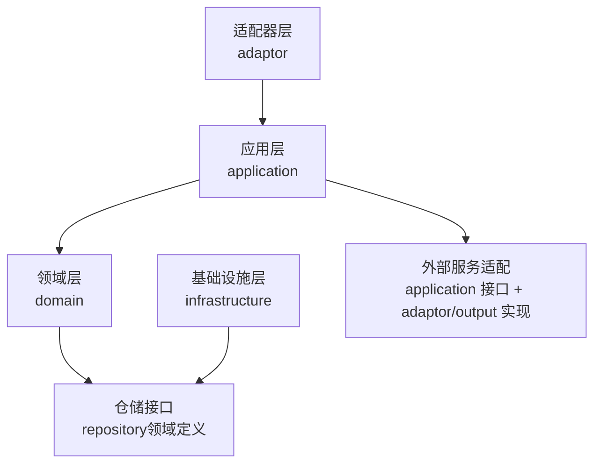
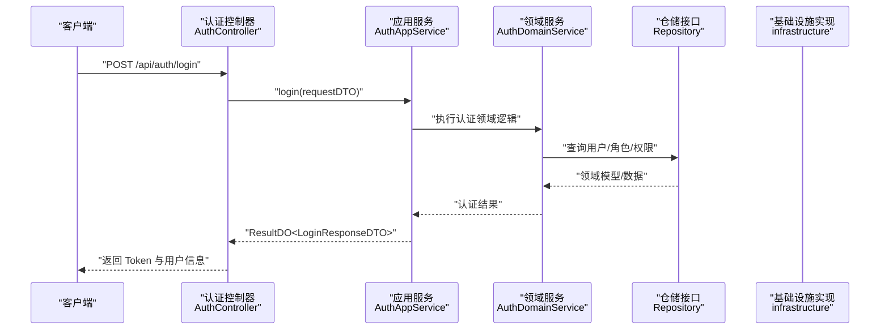
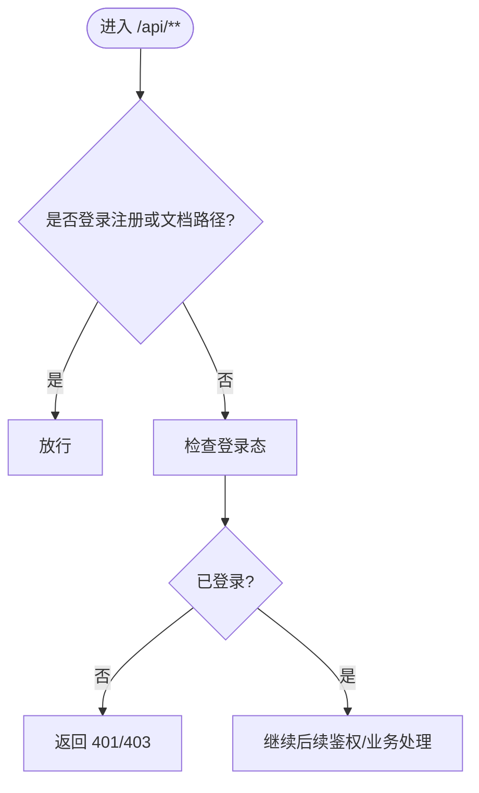
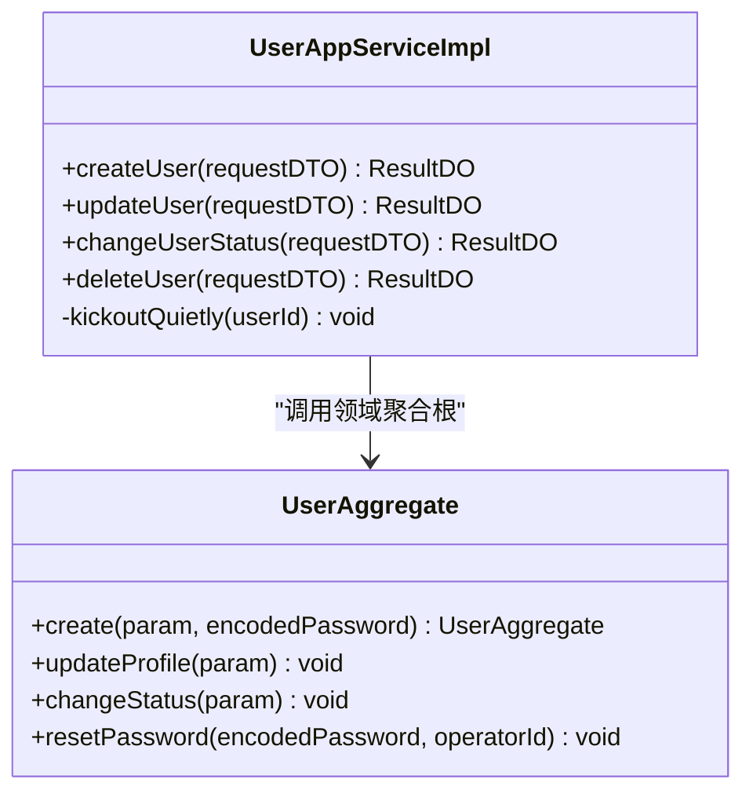
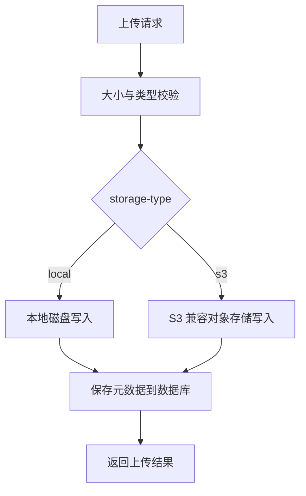
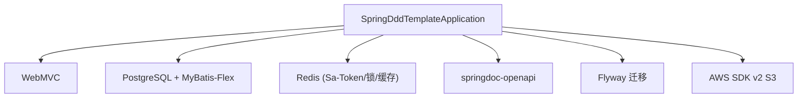

# 项目介绍与特性

<cite>
**本文引用的文件**   
- [README.md](file://README.md)
- [SpringDddTemplateApplication.java](file://src/main/java/com/sunnao/spring/ddd/template/SpringDddTemplateApplication.java)
- [pom.xml](file://pom.xml)
- [application.yaml](file://src/main/resources/application.yaml)
- [SaTokenConfigure.java](file://src/main/java/com/sunnao/spring/ddd/template/common/config/SaTokenConfigure.java)
- [AuthController.java](file://src/main/java/com/sunnao/spring/ddd/template/adaptor/auth/input/AuthController.java)
- [UserAggregate.java](file://src/main/java/com/sunnao/spring/ddd/template/domain/system/user/model/aggregate/UserAggregate.java)
- [UserAppServiceImpl.java](file://src/main/java/com/sunnao/spring/ddd/template/application/system/user/scenario/UserAppServiceImpl.java)
- [DDD 规范总览 README.md](file://docs/rule/ddd/README.md)
- [adaptor 层开发规范 ddd-adaptor-layer.md](file://docs/rule/ddd/ddd-adaptor-layer.md)
- [model 层开发规范 ddd-model-layer.md](file://docs/rule/ddd/ddd-model-layer.md)
- [前端开发指南 frontend-development-guide.md](file://docs/frontend-development-guide.md)
</cite>

## 目录
1. [简介](#简介)
2. [项目结构](#项目结构)
3. [核心组件](#核心组件)
4. [架构总览](#架构总览)
5. [详细组件分析](#详细组件分析)
6. [依赖分析](#依赖分析)
7. [性能考虑](#性能考虑)
8. [故障排查指南](#故障排查指南)
9. [结论](#结论)
10. [附录](#附录)

## 简介
本项目是一个基于六边形架构的 Spring Boot DDD 项目脚手架，定位为“企业级系统管理后台”的快速落地方案。项目内置六个开箱即用的业务模块：用户管理、认证授权、RBAC 权限控制、字典管理、操作日志、文件上传，覆盖企业管理系统最常见的能力边界，帮助团队以最小成本搭建可演进的系统骨架。

核心价值与目标
- 以领域驱动设计（DDD）为方法论，结合六边形架构实现技术细节与业务逻辑的清晰解耦，提升系统的可测试性与可演进性。
- 提供完整的权限控制系统（基于 Sa-Token + RBAC），支持注解式鉴权与会话管理，满足多端登录、细粒度权限点校验等常见需求。
- 统一横切能力：全局异常处理、链路追踪、异步事件机制、分布式锁、操作日志采集等，降低重复建设成本。
- 多存储后端支持的文件上传能力，默认本地磁盘，同时兼容 S3 协议对象存储（阿里云 OSS、腾讯云 COS、MinIO 等）。
- 面向初学者与实战团队：提供清晰的编码规范与分层约定，便于快速上手与团队协作。

适用场景
- 快速搭建企业级管理系统或中后台平台
- 学习与实践 DDD 落地的参考工程
- 作为新项目脚手架，复用统一的架构与横切能力

## 项目结构
项目采用六边形架构的分层组织方式，调用方向自外向内：adaptor → application → domain → repository（infrastructure 实现），并通过 application 定义的外部接口（Output Adaptor）完成跨域协作。

图示来源
- [README.md:19-36](file://README.md#L19-L36)
- [DDD 规范总览 README.md:50-81](file://docs/rule/ddd/README.md#L50-L81)

章节来源
- [README.md:19-36](file://README.md#L19-L36)
- [DDD 规范总览 README.md:50-81](file://docs/rule/ddd/README.md#L50-L81)

## 核心组件
- 启动入口与扫描配置
  - 启动类负责应用初始化与 Mapper 扫描路径配置，确保基础设施层的持久化访问生效。
- 安全与鉴权
  - 基于 Sa-Token 的全局拦截器配置，除登录注册与文档路径外，所有 /api/** 均需登录态；注解式鉴权由框架统一启用。
- 认证控制器（Input Adaptor）
  - 暴露登录、注册、登出、当前用户信息接口，仅做参数接收与结果返回，不承载业务规则。
- 领域聚合根（用户）
  - 用户聚合根封装创建、更新资料、状态变更、重置密码等核心行为，对外通过方法约束内部实体变更，保证领域一致性。
- 应用服务（写模式）
  - 用户应用服务编排典型写流程：参数自校验 → DTO 转领域 Param → 调用领域服务 → 组装响应；在禁用/删除后收敛会话踢出逻辑。

章节来源
- [SpringDddTemplateApplication.java:7-13](file://src/main/java/com/sunnao/spring/ddd/template/SpringDddTemplateApplication.java#L7-L13)
- [SaTokenConfigure.java:17-30](file://src/main/java/com/sunnao/spring/ddd/template/common/config/SaTokenConfigure.java#L17-L30)
- [AuthController.java:21-69](file://src/main/java/com/sunnao/spring/ddd/template/adaptor/auth/input/AuthController.java#L21-L69)
- [UserAggregate.java:21-112](file://src/main/java/com/sunnao/spring/ddd/template/domain/system/user/model/aggregate/UserAggregate.java#L21-L112)
- [UserAppServiceImpl.java:29-162](file://src/main/java/com/sunnao/spring/ddd/template/application/system/user/scenario/UserAppServiceImpl.java#L29-L162)

## 架构总览
下图展示一次“登录”请求从浏览器到领域与基础设施的完整调用链，体现输入适配、应用编排、领域服务与持久化的协作关系。

图示来源
- [AuthController.java:32-40](file://src/main/java/com/sunnao/spring/ddd/template/adaptor/auth/input/AuthController.java#L32-L40)
- [SaTokenConfigure.java:20-29](file://src/main/java/com/sunnao/spring/ddd/template/common/config/SaTokenConfigure.java#L20-L29)

## 详细组件分析

### 认证与鉴权组件
- 路由拦截策略
  - 除登录注册与 OpenAPI 文档路径外，所有 /api/** 均要求登录态；注解式鉴权（如 @SaCheckRole/@SaCheckPermission）由 SaInterceptor 统一启用。
- 认证控制器职责
  - 仅承担 HTTP 入参接收与结果包装，调用应用层服务完成登录、注册、登出与当前用户信息查询。
- 前端权限模型说明
  - 系统采用“角色 + 权限点”两级鉴权模型，多数功能按权限点校验；在线用户管理按角色（admin）校验。
  - 当前“获取当前登录用户信息”接口仅返回角色标识列表，未返回具体权限点集合，前端暂无法据此实现按钮级显隐控制。

图示来源
- [SaTokenConfigure.java:20-29](file://src/main/java/com/sunnao/spring/ddd/template/common/config/SaTokenConfigure.java#L20-L29)
- [frontend-development-guide.md:33-46](file://docs/frontend-development-guide.md#L33-L46)

章节来源
- [SaTokenConfigure.java:17-30](file://src/main/java/com/sunnao/spring/ddd/template/common/config/SaTokenConfigure.java#L17-L30)
- [AuthController.java:21-69](file://src/main/java/com/sunnao/spring/ddd/template/adaptor/auth/input/AuthController.java#L21-L69)
- [frontend-development-guide.md:33-46](file://docs/frontend-development-guide.md#L33-L46)

### 用户管理组件（写模式示例）
- 聚合根（UserAggregate）
  - 通过静态工厂方法创建用户，并提供 updateProfile、changeStatus、resetPassword 等方法，统一进行参数校验与状态流转约束。
- 应用服务（UserAppServiceImpl）
  - 标准写模式流程：参数自校验 → DTO 转领域 Param → 调用领域服务 → 组装响应；在禁用/删除成功后调用会话踢出逻辑，防止旧 token 继续访问。

图示来源
- [UserAggregate.java:38-112](file://src/main/java/com/sunnao/spring/ddd/template/domain/system/user/model/aggregate/UserAggregate.java#L38-L112)
- [UserAppServiceImpl.java:40-162](file://src/main/java/com/sunnao/spring/ddd/template/application/system/user/scenario/UserAppServiceImpl.java#L40-L162)

章节来源
- [UserAggregate.java:21-112](file://src/main/java/com/sunnao/spring/ddd/template/domain/system/user/model/aggregate/UserAggregate.java#L21-L112)
- [UserAppServiceImpl.java:29-162](file://src/main/java/com/sunnao/spring/ddd/template/application/system/user/scenario/UserAppServiceImpl.java#L29-L162)

### 文件上传组件（多存储后端）
- 存储抽象与实现
  - application 层定义 FileStorage 接口，infrastructure 层提供本地磁盘与 S3 兼容对象存储两种实现，通过配置项 app.file.storage-type 切换。
- 配置与环境变量
  - 本地存储根目录、单文件大小上限、S3 端点/区域/密钥/桶名/路径风格等均通过 application.yaml 与环境变量注入，密钥不落盘。

图示来源
- [application.yaml:64-88](file://src/main/resources/application.yaml#L64-L88)
- [README.md:97-117](file://README.md#L97-L117)

章节来源
- [application.yaml:64-88](file://src/main/resources/application.yaml#L64-L88)
- [README.md:97-117](file://README.md#L97-L117)

### 领域事件与异步处理
- 事件发布与监听
  - common 层定义领域事件接口，infrastructure 层提供基于 Spring 的实现；监听器使用 @Async 异步消费，示例包括用户创建事件、操作日志事件。
- 典型用途
  - 将非核心流程（如记录日志、发送通知）从主事务中剥离，提升吞吐与稳定性。

章节来源
- [README.md:119-128](file://README.md#L119-L128)

### 分布式锁与单机锁
- 锁抽象与实现
  - LevelLock 接口 + RedisLevelLock（SET NX PX + Lua 释放，默认）/ JvmLevelLock（单机），通过 app.lock.type 切换。
- 典型用法
  - 写模式标准流程中，领域服务先构建并尝试获取锁，再加载/构建聚合根、执行业务、持久化，finally 释放锁，保障并发安全。

章节来源
- [README.md:119-128](file://README.md#L119-L128)

## 依赖分析
- 关键依赖
  - Spring Boot 4.x、MyBatis-Flex、PostgreSQL、Redis、Sa-Token、springdoc-openapi、Flyway、AWS SDK v2（S3）、MapStruct、Hutool、Lombok。
- 启动与扫描
  - 启动类开启 Mapper 扫描，确保基础设施层持久化访问可用。
- 配置中心与环境
  - application.yaml 导入 .env 文件，支持多环境激活；数据库与 Redis 连接信息通过环境变量注入。

图示来源
- [pom.xml:28-151](file://pom.xml#L28-L151)
- [SpringDddTemplateApplication.java:7-13](file://src/main/java/com/sunnao/spring/ddd/template/SpringDddTemplateApplication.java#L7-L13)
- [application.yaml:1-36](file://src/main/resources/application.yaml#L1-L36)

章节来源
- [pom.xml:28-151](file://pom.xml#L28-L151)
- [SpringDddTemplateApplication.java:7-13](file://src/main/java/com/sunnao/spring/ddd/template/SpringDddTemplateApplication.java#L7-L13)
- [application.yaml:1-36](file://src/main/resources/application.yaml#L1-L36)

## 性能考虑
- 读写分离与缓存
  - 字典读路径走 Redis 缓存，写操作自动失效缓存，减少数据库压力。
- 异步化
  - 操作日志、用户创建等事件异步落库或处理，避免阻塞主流程。
- 连接池与资源
  - Redis Lettuce 连接池参数可调；大文件上传受 multipart 与存储实现双重限制，建议合理设置阈值。
- 锁粒度
  - 分布式锁尽量缩小范围与时间，避免长事务持有锁导致竞争加剧。

[本节为通用指导，无需源码引用]

## 故障排查指南
- 登录鉴权失败
  - 确认请求头携带 sa-token；检查 SaTokenConfigure 的路径放行与拦截策略是否符合预期。
- 权限点不足
  - 确认角色是否正确分配权限点；注意在线用户管理按角色（admin）校验，不走权限点体系。
- 文件上传失败
  - 检查 app.file.storage-type 与对应实现配置（本地 base-path 或 S3 环境变量）；确认单文件大小不超过 spring.servlet.multipart 与 app.file.max-size 限制。
- 事件未消费
  - 检查异步线程池配置与监听器是否被正确注册；关注链路 traceId 定位问题。

章节来源
- [SaTokenConfigure.java:20-29](file://src/main/java/com/sunnao/spring/ddd/template/common/config/SaTokenConfigure.java#L20-L29)
- [frontend-development-guide.md:33-46](file://docs/frontend-development-guide.md#L33-L46)
- [application.yaml:27-31](file://src/main/resources/application.yaml#L27-L31)
- [application.yaml:64-88](file://src/main/resources/application.yaml#L64-L88)
- [README.md:119-128](file://README.md#L119-L128)

## 结论
本脚手架以 DDD 与六边形架构为核心，提供企业级管理后台所需的六大基础模块与完善的横切能力，既适合快速落地生产系统，也适合作为学习与二次开发的起点。通过清晰的层级约定与可扩展的存储、锁、事件等能力，团队可在保持业务聚焦的同时，稳步演进系统复杂度。

[本节为总结性内容，无需源码引用]

## 附录
- 新增业务模块建议
  - 遵循 adaptor/application/client/domain/infrastructure/model 六层规范，明确写/读/计算/规则+计算四种模式的差异与适用场景。
- 前端对接要点
  - 菜单可见性与按钮级权限需结合后端权限点与角色；当前“当前用户信息”接口未返回权限点集合，建议补充相应接口以支撑细粒度控制。

章节来源
- [DDD 规范总览 README.md:1-15](file://docs/rule/ddd/README.md#L1-L15)
- [adaptor 层开发规范 ddd-adaptor-layer.md:1-479](file://docs/rule/ddd/ddd-adaptor-layer.md#L1-L479)
- [model 层开发规范 ddd-model-layer.md:1-97](file://docs/rule/ddd/ddd-model-layer.md#L1-L97)
- [frontend-development-guide.md:82-116](file://docs/frontend-development-guide.md#L82-L116)