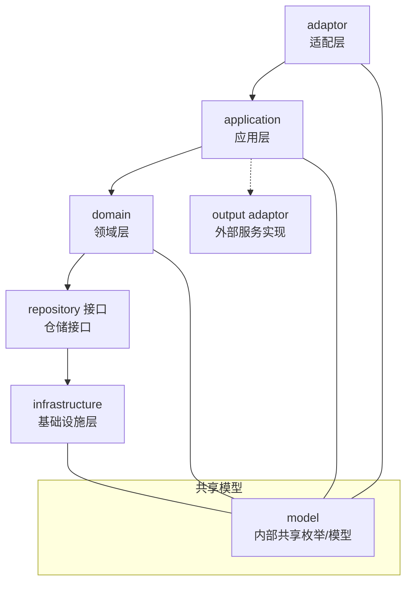
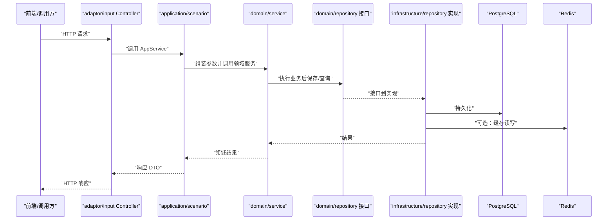
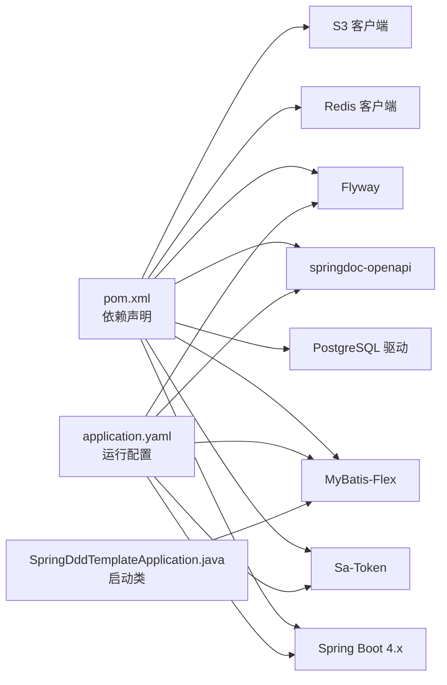

# 项目概述

<cite>
**本文引用的文件列表**
- [README.md](file://README.md)
- [pom.xml](file://pom.xml)
- [application.yaml](file://src/main/resources/application.yaml)
- [SpringDddTemplateApplication.java](file://src/main/java/com/sunnao/spring/ddd/template/SpringDddTemplateApplication.java)
- [ddd-adaptor-layer.md](file://docs/rule/ddd/ddd-adaptor-layer.md)
- [ddd-model-layer.md](file://docs/rule/ddd/ddd-model-layer.md)
- [frontend-development-guide.md](file://docs/frontend-development-guide.md)
</cite>

## 目录
1. [简介](#简介)
2. [项目结构](#项目结构)
3. [核心组件](#核心组件)
4. [架构总览](#架构总览)
5. [详细组件分析](#详细组件分析)
6. [依赖关系分析](#依赖关系分析)
7. [性能与扩展性考虑](#性能与扩展性考虑)
8. [故障排查指南](#故障排查指南)
9. [结论](#结论)
10. [附录：快速开始](#附录快速开始)

## 简介
本项目是一个基于六边形架构的 Spring Boot DDD 脚手架，内置用户管理、认证授权、RBAC 权限控制、字典管理、操作日志、文件上传六个开箱即用的系统模块。通过清晰的分层与职责划分，帮助团队在复杂业务中保持高内聚、低耦合，并具备良好的可测试性与可扩展性。

技术栈要点：
- Java 25、Spring Boot 4.x
- MyBatis-Flex（ORM）
- PostgreSQL（数据库）
- Redis（会话、分布式锁、缓存）
- Sa-Token（认证鉴权，token 存 Redis）
- Flyway（数据库迁移）
- springdoc-openapi（API 文档）
- Lombok / Hutool（工具库）

这些选型与配置在项目根 README 与构建脚本、应用配置中均有明确说明。

章节来源
- [README.md:5-18](file://README.md#L5-L18)
- [pom.xml:19-26](file://pom.xml#L19-L26)
- [application.yaml:1-88](file://src/main/resources/application.yaml#L1-L88)

## 项目结构
项目采用“六层”组织方式，遵循依赖倒置原则，调用方向自外向内：adaptor → application → domain → repository（infrastructure 实现），同时 application 可通过接口定义外部服务（output adaptor）。

图示来源
- [README.md:28-35](file://README.md#L28-L35)
- [ddd-adaptor-layer.md:28-51](file://docs/rule/ddd/ddd-adaptor-layer.md#L28-L51)
- [ddd-model-layer.md:14-29](file://docs/rule/ddd/ddd-model-layer.md#L14-L29)

章节来源
- [README.md:28-35](file://README.md#L28-L35)
- [README.md:170-182](file://README.md#L170-L182)

## 核心组件
- 启动入口：主类扫描 Mapper 包路径并启动 Spring Boot 应用。
- 配置中心：统一应用配置，包含数据源、Redis、Sa-Token、Flyway、springdoc、文件存储等。
- 横切能力：全局异常处理、traceId 链路、领域事件、分布式锁、操作日志注解与切面。
- 内置模块：认证、用户、角色（RBAC）、字典、操作日志、文件上传。

章节来源
- [SpringDddTemplateApplication.java:7-13](file://src/main/java/com/sunnao/spring/ddd/template/SpringDddTemplateApplication.java#L7-L13)
- [application.yaml:1-88](file://src/main/resources/application.yaml#L1-L88)
- [README.md:84-95](file://README.md#L84-L95)

## 架构总览
六边形架构强调“业务内核稳定、外围技术可变”。本项目的分层职责如下：
- adaptor 适配层：输入适配器（Controller 等）接收请求；输出适配器实现应用层定义的外部服务接口，隔离第三方细节。
- application 应用层：场景编排、DTO 转换，不写业务规则。
- domain 领域层：聚合根/实体承载业务逻辑，领域服务编排“锁 → 聚合根 → 持久化”，仓储只定义接口。
- infrastructure 基础设施层：仓储实现、PO 与聚合根互转、缓存读写。
- client 客户端接口层：对外接口定义与自包含 DTO（禁止依赖 model 层）。
- model 共享模型层：内部共享枚举/模型（client 层禁止依赖）。

图示来源
- [README.md:28-35](file://README.md#L28-L35)
- [ddd-adaptor-layer.md:93-112](file://docs/rule/ddd/ddd-adaptor-layer.md#L93-L112)

章节来源
- [README.md:28-35](file://README.md#L28-L35)
- [ddd-adaptor-layer.md:28-51](file://docs/rule/ddd/ddd-adaptor-layer.md#L28-L51)
- [ddd-model-layer.md:14-29](file://docs/rule/ddd/ddd-model-layer.md#L14-L29)

## 详细组件分析

### 启动与配置
- 启动类负责扫描 MyBatis-Flex Mapper 包路径并启动应用。
- 应用配置集中管理数据库、Redis、Sa-Token、Flyway、springdoc、文件存储等关键开关与环境变量注入。

章节来源
- [SpringDddTemplateApplication.java:7-13](file://src/main/java/com/sunnao/spring/ddd/template/SpringDddTemplateApplication.java#L7-L13)
- [application.yaml:1-88](file://src/main/resources/application.yaml#L1-L88)

### 认证与授权（Sa-Token + RBAC）
- 认证：Sa-Token 集成 Redis，支持 token 名称、有效期、并发登录等配置。
- 授权：RBAC 通过角色与权限点两级模型，StpInterfaceImpl 从角色与权限表加载权限集合。
- 前端侧需关注当前用户权限点获取能力的缺口（详见前端开发指南）。

章节来源
- [application.yaml:44-56](file://src/main/resources/application.yaml#L44-L56)
- [README.md:88-91](file://README.md#L88-L91)
- [frontend-development-guide.md:33-46](file://docs/frontend-development-guide.md#L33-L46)

### 用户管理
- 提供用户 CRUD、启用/禁用（仅 admin），并与 RBAC 关联。
- 领域层以聚合根承载用户状态变更，应用层编排流程，基础设施层完成持久化。

章节来源
- [README.md:89-90](file://README.md#L89-L90)

### 角色与权限（RBAC）
- 角色 CRUD、分配权限、给用户授角色（仅 admin）。
- 权限点命名规范与种子数据见前端开发指南。

章节来源
- [README.md:90-91](file://README.md#L90-L91)
- [frontend-development-guide.md:33-46](file://docs/frontend-development-guide.md#L33-L46)

### 字典管理
- 类型/数据 CRUD（admin），按 typeKey 查启用数据走 Redis 缓存，写操作自动失效缓存。

章节来源
- [README.md:91-92](file://README.md#L91-L92)

### 操作日志
- 写接口标注 @OperLog 即可自动采集（traceId、操作人、参数摘要、结果码、耗时、IP），异步落库；分页查询（仅 admin）。

章节来源
- [README.md:92-93](file://README.md#L92-L93)

### 文件上传
- multipart 上传/下载/分页查询（登录可用），删除仅 admin。
- FileStorage 抽象 + 本地磁盘/S3 对象存储双实现，通过配置切换。

章节来源
- [README.md:93-94](file://README.md#L93-L94)
- [application.yaml:68-87](file://src/main/resources/application.yaml#L68-L87)

### 编码约定与横切能力
- ResultDO 全链路不抛异常，各层方法统一返回 ResultDO，内部 catch 后转错误码。
- RequestDTO 自校验，AppService 不写校验逻辑。
- 手写 Assembler/Converter 进行 DTO/PO 转换。
- 写模式标准流程：领域服务先加锁，再加载/构建聚合根、执行业务、持久化，finally 释放锁。
- 审计字段自动填充：PO 继承 BasePO，由全局监听器填充创建/更新时间与操作人。
- 领域事件：DomainEventPublisher（common 接口）→ SpringDomainEventPublisher（infrastructure 实现），@Async 监听器消费。
- 分布式锁：LevelLock 接口 + RedisLevelLock/JvmLevelLock，配置切换。
- traceId 链路：TraceIdFilter 生成/透传 X-Trace-Id，logback pattern 输出，异步线程透传。

章节来源
- [README.md:37-46](file://README.md#L37-L46)
- [README.md:119-128](file://README.md#L119-L128)

## 依赖关系分析
- 构建与运行时依赖集中在 pom.xml，包括 Spring Boot 4.x、MyBatis-Flex、PostgreSQL、Redis、Sa-Token、springdoc-openapi、AWS SDK v2 S3、Flyway 等。
- 应用配置 application.yaml 声明了数据源、Redis、Sa-Token、springdoc、Flyway、文件存储等关键开关与环境变量注入。
- 启动类指定 Mapper 扫描路径，确保 MyBatis-Flex 正确装配。

图示来源
- [pom.xml:28-151](file://pom.xml#L28-L151)
- [application.yaml:1-88](file://src/main/resources/application.yaml#L1-L88)
- [SpringDddTemplateApplication.java:7-13](file://src/main/java/com/sunnao/spring/ddd/template/SpringDddTemplateApplication.java#L7-L13)

章节来源
- [pom.xml:19-26](file://pom.xml#L19-L26)
- [pom.xml:28-151](file://pom.xml#L28-L151)
- [application.yaml:1-88](file://src/main/resources/application.yaml#L1-L88)

## 性能与扩展性考虑
- 使用 Redis 作为会话与缓存介质，提升鉴权与字典查询性能。
- 操作日志异步落库，降低写接口延迟。
- 文件存储抽象支持本地与 S3 兼容对象存储，便于横向扩展与多环境部署。
- 分布式锁支持 Redis 与 JVM 两种实现，可按部署形态选择。

[本节为通用指导，无需源码引用]

## 故障排查指南
- 认证失败或无权限：检查 Sa-Token 配置、Redis 连通性与 token 头传递。
- 数据库连接失败：核对 application.yaml 中的数据库 URL、用户名、密码及 Flyway 基线策略。
- 文件上传失败：确认 multipart 大小限制与 app.file.max-size 一致，检查本地路径或 S3 配置。
- 日志未记录：确认 @OperLog 注解与切面生效，查看 TraceId 是否透传到异步线程。

章节来源
- [application.yaml:44-56](file://src/main/resources/application.yaml#L44-L56)
- [application.yaml:27-36](file://src/main/resources/application.yaml#L27-L36)
- [application.yaml:68-87](file://src/main/resources/application.yaml#L68-L87)
- [README.md:119-128](file://README.md#L119-L128)

## 结论
本项目以六边形架构为核心，结合 DDD 的分层与领域建模思想，提供了完整的系统级能力与工程化实践。通过清晰的分层边界、统一的编码约定与丰富的横切能力，既适合初学者快速上手，也为有经验的开发者提供了足够的技术深度与扩展空间。

[本节为总结性内容，无需源码引用]

## 附录：快速开始
- 一键改包：使用脚本交互式或直接传参替换 groupId/artifactId/包名/启动类等。
- 启动依赖：docker compose up -d 拉起 PostgreSQL 17 与 Redis 7。
- 启动应用：执行 Maven 命令启动，默认 dev 环境，Flyway 自动建表并写入种子数据。
- API 文档：访问 /swagger-ui.html。
- 管理员账号：admin@example.com / admin123456（首次登录后请修改）。
- 登录方式：POST /api/auth/login 获取 token，后续请求携带请求头 satoken: {tokenValue}。

章节来源
- [README.md:49-74](file://README.md#L49-L74)