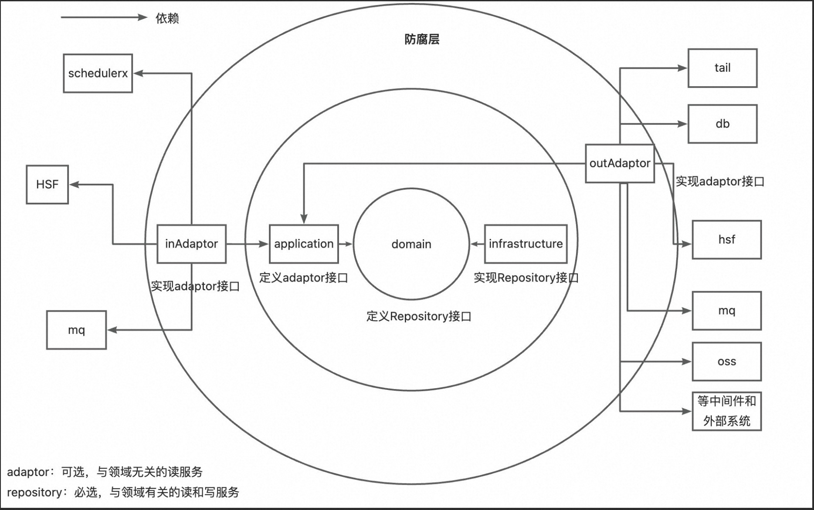

# Easy-DDD

一套**开箱即用的 DDD（领域驱动设计）落地规范**，基于六边形架构，覆盖从架构设计到各层编码的完整指南。

帮你解决 DDD 落地时最常见的问题：**知道理论，但不知道代码该怎么写、放在哪里。**



## ✨ 特性

- **📐 六边形架构**：基于依赖倒置原则，技术细节与业务逻辑彻底分离
- **📦 六层分层规范**：Domain、Application、Adaptor、Infrastructure、Client、Model，职责清晰
- **🔀 四种开发模式**：写模式、读模式、纯计算模式、规则+计算模式，覆盖常见业务场景
- **📝 详细编码规范**：每一层都有包结构、命名、依赖关系、代码示例等落地级规范
- **🤖 AI 友好**：规范文件可直接作为 AI 编程助手的 Cursor Rules / Copilot Instructions 使用

## 📁 文档结构

| 文件                                                         | 说明                                   |
|------------------------------------------------------------|--------------------------------------|
| [DDD.md](DDD.md)                                           | **总览**：架构设计原则、工程结构、四种开发模式、模式选择决策树    |
| [ddd-domain-layer.md](ddd-domain-layer.md)                 | **领域层规范**：聚合根、实体、值对象、领域服务、仓储接口       |
| [ddd-application-layer.md](ddd-application-layer.md)       | **应用层规范**：场景编排、Assembler、AppService  |
| [ddd-adaptor-layer.md](ddd-adaptor-layer.md)               | **适配器层规范**：Input/Output Adaptor、防腐层  |
| [ddd-infrastructure-layer.md](ddd-infrastructure-layer.md) | **基础设施层规范**：仓储实现、PO、Mapper、Converter |
| [ddd-client-layer.md](ddd-client-layer.md)                 | **Client 层规范**：对外 RPC 接口定义、DTO       |
| [ddd-model-layer.md](ddd-model-layer.md)                   | **Model 层规范**：内部共享模型、枚举              |

## 🚀 快速开始

### 作为架构参考

1. 先阅读 [DDD.md](DDD.md) 了解整体架构和四种开发模式
2. 根据业务场景选择对应的开发模式（参考模式选择决策树）
3. 按模式对应的规范文件逐层实现

### 作为 AI 编程规则

将规范文件配置为你的 AI 编程助手的 Rules，让 AI 按照 DDD 规范生成代码：

- **Cursor**：将 `.md` 文件放入 `.cursor/rules/` 目录
- **Aone Copilot**：将 `.md` 文件放入 `.aone_copilot/rules/` 目录
- **GitHub Copilot**：在 `.github/copilot-instructions.md` 中引用

## 📖 实践案例

- [DDD 实践案例：从理论到落地的完整实战](https://mp.weixin.qq.com/s/QRq_mnifw62LMoHey-tMiQ) — 结合真实业务场景的 DDD
  落地经验分享，推荐配合本规范一起阅读

## 🏗️ 工程结构

```
包路径
├── domain/                    # 领域层（纯业务逻辑，零技术依赖）
│   └── {业务名}/
│       ├── model/             # 聚合根、实体、值对象、参数、结果
│       ├── service/           # 领域服务
│       └── repository/        # 仓储接口
├── application/               # 应用层（场景编排）
│   └── {业务名}/
│       ├── scenario/          # 场景编排
│       ├── assembler/         # DTO ↔ 领域对象转换
│       └── model/             # 仅应用层内部使用的 DTO
├── client/                    # 对外接口定义层
│   └── {业务名}/
│       ├── enums/             # 对外枚举
│       ├── model/             # 复用引用对象（行业概念 DTO）
│       ├── req/               # 请求 DTO
│       └── res/               # 响应 DTO
├── model/                     # 内部共享模型
├── infrastructure/            # 基础设施层（技术实现）
│   └── {业务名}/
│       ├── repository/        # 仓储实现
│       ├── mysql/             # 数据库访问（PO、Mapper）
│       └── converter/         # 聚合根 ↔ PO 转换
└── adaptor/                   # 适配器层（防腐层）
    └── {业务名}/
        ├── input/             # 入口适配（Controller、MQ 消费者）
        ├── output/            # 出口适配（外部服务调用）
        └── inner/             # 内部复用适配器
```

## 🔀 四种开发模式

| 模式          | 聚合根/实体    | 业务逻辑位置        | 修改状态 | 典型场景      |
|-------------|-----------|---------------|------|-----------|
| **写模式**     | ✅ 有       | 聚合根/实体方法      | ✅ 是  | 订单创建、状态变更 |
| **读模式**     | ✅ 有（数据载体） | 无             | ❌ 否  | 订单查询      |
| **规则+计算模式** | ✅ 有       | 聚合根/实体方法      | ❌ 否  | 补贴规则匹配与计算 |
| **纯计算模式**   | ❌ 无       | DomainService | ❌ 否  | 费用计算、视图渲染 |
